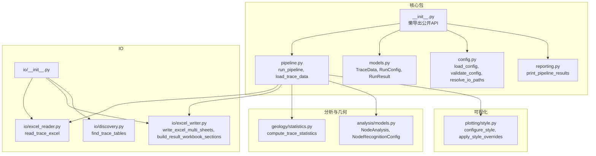
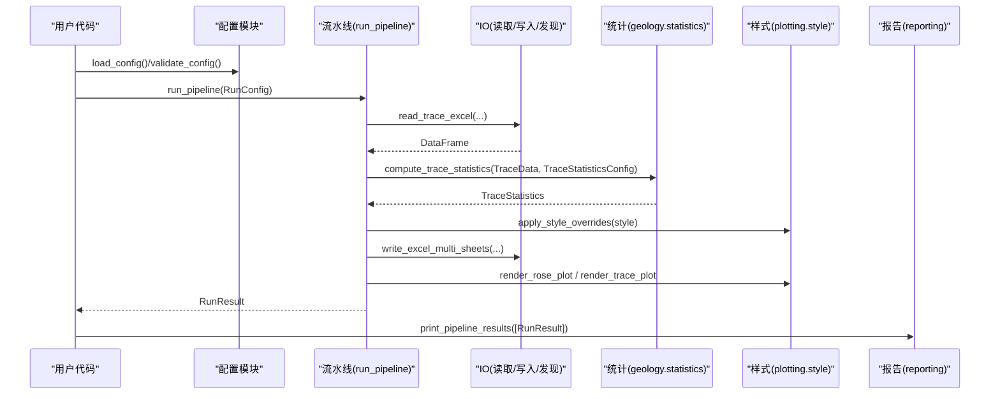
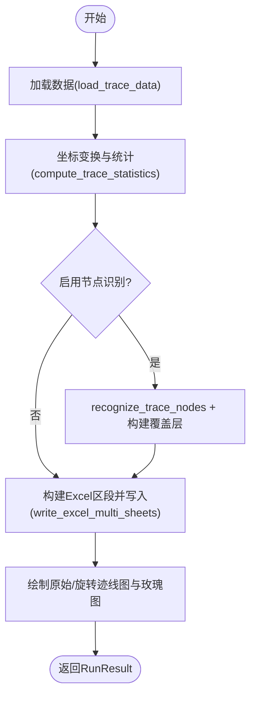
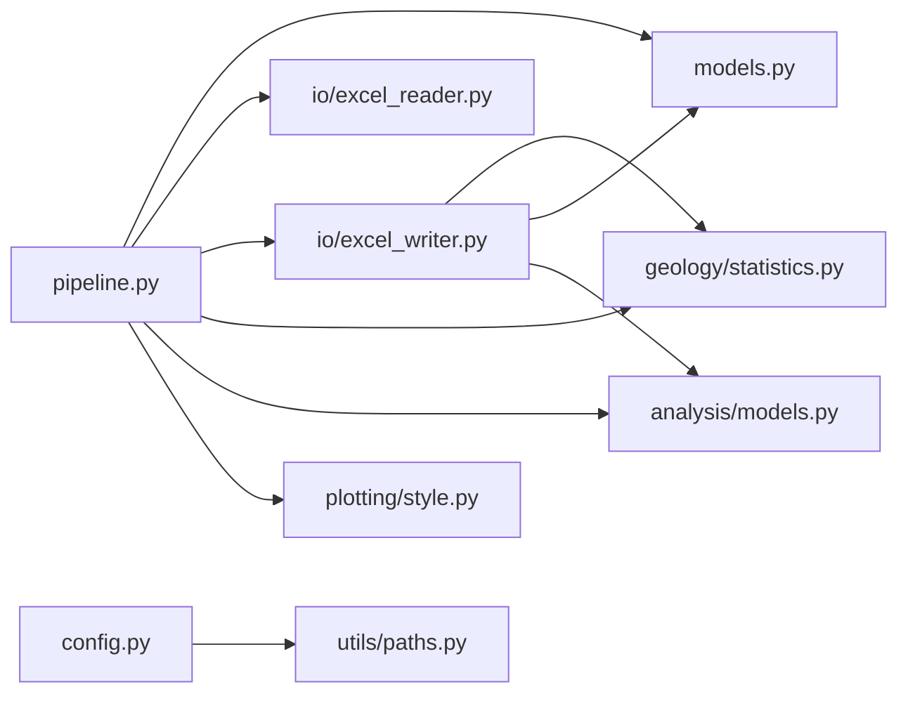

# API 参考文档

<cite>
**本文引用的文件**   
- [trace_pipeline/__init__.py](file://trace_pipeline/__init__.py)
- [trace_pipeline/pipeline.py](file://trace_pipeline/pipeline.py)
- [trace_pipeline/models.py](file://trace_pipeline/models.py)
- [trace_pipeline/config.py](file://trace_pipeline/config.py)
- [trace_pipeline/io/__init__.py](file://trace_pipeline/io/__init__.py)
- [trace_pipeline/io/excel_reader.py](file://trace_pipeline/io/excel_reader.py)
- [trace_pipeline/io/excel_writer.py](file://trace_pipeline/io/excel_writer.py)
- [trace_pipeline/io/discovery.py](file://trace_pipeline/io/discovery.py)
- [trace_pipeline/geology/statistics.py](file://trace_pipeline/geology/statistics.py)
- [trace_pipeline/analysis/models.py](file://trace_pipeline/analysis/models.py)
- [trace_pipeline/plotting/style.py](file://trace_pipeline/plotting/style.py)
- [trace_pipeline/reporting.py](file://trace_pipeline/reporting.py)
- [config.example.json](file://config.example.json)
</cite>

## 目录
1. [简介](#简介)
2. [项目结构](#项目结构)
3. [核心组件](#核心组件)
4. [架构总览](#架构总览)
5. [详细组件分析](#详细组件分析)
6. [依赖关系分析](#依赖关系分析)
7. [性能与并发特性](#性能与并发特性)
8. [错误处理与异常类型](#错误处理与异常类型)
9. [使用示例与最佳实践](#使用示例与最佳实践)
10. [版本兼容性与迁移指南](#版本兼容性与迁移指南)
11. [结论](#结论)

## 简介
本文件为 TracePipeline 的完整 Python API 参考，覆盖核心流水线、数据模型、IO 模块（Excel 读写与文件发现）、配置加载与管理、统计计算、样式与报告输出等。面向希望以编程方式集成或扩展 TracePipeline 的用户，提供类、方法、函数签名说明、参数与返回值约束、常见用法与注意事项。

## 项目结构
TracePipeline 采用模块化分层组织：
- trace_pipeline：核心包，包含模型、配置、流水线、统计、绘图、IO、CLI 等
- io：Excel 读取/写入与输入文件发现
- geology：地质算法（统计、角度、变换）
- analysis：节点识别相关的数据结构与工具
- plotting：迹线图、玫瑰图与样式管理
- reporting：终端友好的结果展示

图表来源
- [trace_pipeline/__init__.py:1-83](file://trace_pipeline/__init__.py#L1-L83)
- [trace_pipeline/pipeline.py:1-474](file://trace_pipeline/pipeline.py#L1-L474)
- [trace_pipeline/models.py:1-352](file://trace_pipeline/models.py#L1-L352)
- [trace_pipeline/config.py:1-326](file://trace_pipeline/config.py#L1-L326)
- [trace_pipeline/io/__init__.py:1-22](file://trace_pipeline/io/__init__.py#L1-L22)
- [trace_pipeline/io/excel_reader.py:1-169](file://trace_pipeline/io/excel_reader.py#L1-L169)
- [trace_pipeline/io/excel_writer.py:1-489](file://trace_pipeline/io/excel_writer.py#L1-L489)
- [trace_pipeline/io/discovery.py:1-63](file://trace_pipeline/io/discovery.py#L1-L63)
- [trace_pipeline/geology/statistics.py:1-391](file://trace_pipeline/geology/statistics.py#L1-L391)
- [trace_pipeline/analysis/models.py:1-98](file://trace_pipeline/analysis/models.py#L1-L98)
- [trace_pipeline/plotting/style.py:1-296](file://trace_pipeline/plotting/style.py#L1-L296)
- [trace_pipeline/reporting.py:1-190](file://trace_pipeline/reporting.py#L1-L190)

章节来源
- [trace_pipeline/__init__.py:1-83](file://trace_pipeline/__init__.py#L1-L83)

## 核心组件
本节汇总所有对外公开的 Python API 及其职责。

- 流水线与数据加载
  - run_pipeline(cfg: RunConfig) -> RunResult
  - load_trace_data(input_dir: str, table_stem: str, outcrop: str) -> TraceData
- 统计计算
  - compute_trace_statistics(trace: TraceData, config: TraceStatisticsConfig | None = None) -> TraceStatistics
  - format_statistics_box_lines(statistics: TraceStatistics) -> Sequence[str]
- IO 模块
  - read_trace_excel(base_path: str, table_stem: str, sheet: str | int | None = None) -> pd.DataFrame
  - write_excel_multi_sheets(excel_path: str, sections: Sequence[ExcelSection]) -> None
  - build_result_workbook_sections(trace: TraceData, rotated_xy: np.ndarray, statistics: TraceStatistics | None = None, node_analysis: NodeAnalysis | None = None, layout: ExcelLayout = DEFAULT_LAYOUT) -> list[ExcelSection]
  - find_trace_tables(input_dir: str, suffix: str = "_process", extensions: tuple[str, ...] = (".xlsx", ".xls")) -> list[TraceFile]
- 配置加载与管理
  - load_config(config_path: str | Path | None = None) -> dict[str, Any]
  - validate_config(cfg: Mapping[str, Any], *, resolve_paths: bool = True, base_dir: str | Path | None = None) -> dict[str, Any]
  - resolve_config_base_dir(config_path: str | Path | None = None) -> Path
  - resolve_io_paths(input_dir: str, output_dir: str, base_dir: str | Path | None = None, *, create_dirs: bool = True) -> tuple[str, str]
  - apply_cli_overrides(cfg: dict[str, Any], **overrides: Any) -> dict[str, Any]
  - ensure_workspace_dirs(cfg: dict[str, Any] | None = None) -> None
- 样式与报告
  - configure_style() -> None
  - apply_style_overrides(style: dict[str, Any]) -> Generator[None, None, None]
  - print_pipeline_results(results: list[RunResult]) -> None

章节来源
- [trace_pipeline/__init__.py:1-83](file://trace_pipeline/__init__.py#L1-L83)
- [trace_pipeline/pipeline.py:1-474](file://trace_pipeline/pipeline.py#L1-L474)
- [trace_pipeline/geology/statistics.py:1-391](file://trace_pipeline/geology/statistics.py#L1-L391)
- [trace_pipeline/io/__init__.py:1-22](file://trace_pipeline/io/__init__.py#L1-L22)
- [trace_pipeline/io/excel_reader.py:1-169](file://trace_pipeline/io/excel_reader.py#L1-L169)
- [trace_pipeline/io/excel_writer.py:1-489](file://trace_pipeline/io/excel_writer.py#L1-L489)
- [trace_pipeline/io/discovery.py:1-63](file://trace_pipeline/io/discovery.py#L1-L63)
- [trace_pipeline/config.py:1-326](file://trace_pipeline/config.py#L1-L326)
- [trace_pipeline/plotting/style.py:1-296](file://trace_pipeline/plotting/style.py#L1-L296)
- [trace_pipeline/reporting.py:1-190](file://trace_pipeline/reporting.py#L1-L190)

## 架构总览
下图展示了从配置到执行再到产物的端到端流程，以及关键模块间的调用关系。

图表来源
- [trace_pipeline/config.py:86-146](file://trace_pipeline/config.py#L86-L146)
- [trace_pipeline/pipeline.py:230-474](file://trace_pipeline/pipeline.py#L230-L474)
- [trace_pipeline/io/excel_reader.py:36-106](file://trace_pipeline/io/excel_reader.py#L36-L106)
- [trace_pipeline/geology/statistics.py:212-391](file://trace_pipeline/geology/statistics.py#L212-L391)
- [trace_pipeline/plotting/style.py:187-296](file://trace_pipeline/plotting/style.py#L187-L296)
- [trace_pipeline/reporting.py:176-190](file://trace_pipeline/reporting.py#L176-L190)

## 详细组件分析

### 数据模型（TraceData、RunConfig、RunResult、TraceStatistics）
- TraceData
  - 字段：scanline_azimuth(float)、count(int)、endpoints(np.ndarray[N×4])、joint_strikes(np.ndarray[N])、segment_lengths(np.ndarray[N])、scanline_positions(np.ndarray[N])、measured_scanline_length(float|None)、measured_outcrop_area(float|None)
  - 派生属性：lengths(N,)、mean_length(float)
  - 约束：非空有限值、形状一致、可选正数校验；内部数组写保护
- RunConfig
  - 字段：input_dir/output_dir/output_prefix/table_stem/outcrop/export_rose_plot/rose_bin_width/rose_dpi/trace_dpi/rotated_trace_dpi/window_strategy/auto_density_threshold/tangent_window_count/min_intersections/style/enable_node_recognition/node_merge_tolerance/show_node_overlay/node_label_mode
  - 工厂：from_mapping(cfg: Mapping[str, Any]) -> RunConfig
  - 约束：必填字段非空；数值范围与类型强制转换；node_merge_tolerance > 0
- RunResult
  - 字段：table_stem/status/trace_count/mean_length/scanline_azimuth/excel_path/raw_plot_path/rotated_plot_path/rose_plot_path/window_strategy/area_source/error/error_type/error_traceback/node_* 计数/intersection_count
  - 工厂：success(...), failure(table_stem, error, ...)
- TraceStatistics
  - 由 compute_trace_statistics 返回，包含测线长度来源、露头面积来源、平均迹长来源、P10/P20/P21 及其来源、窗口策略、诊断信息、一致性告警等

图表来源
- [trace_pipeline/models.py:41-157](file://trace_pipeline/models.py#L41-L157)
- [trace_pipeline/models.py:162-273](file://trace_pipeline/models.py#L162-L273)
- [trace_pipeline/models.py:278-352](file://trace_pipeline/models.py#L278-L352)
- [trace_pipeline/geology/statistics.py:212-391](file://trace_pipeline/geology/statistics.py#L212-L391)

章节来源
- [trace_pipeline/models.py:1-352](file://trace_pipeline/models.py#L1-L352)
- [trace_pipeline/geology/statistics.py:1-391](file://trace_pipeline/geology/statistics.py#L1-L391)

### 核心流水线 API

#### run_pipeline(cfg: RunConfig) -> RunResult
- 功能：单目标全流程编排（加载 → 坐标变换+统计 → 节点识别 → Excel 导出 → 绘图），返回不可变运行结果
- 参数：cfg — 已校验的 RunConfig
- 返回：RunResult，status 为 "success" 或 "error"
- 行为要点：
  - 子进程安全：在非主进程中初始化非交互后端并应用样式
  - 阶段日志：每步记录耗时与关键指标
  - 节点识别：可开关，支持合并容差与标签模式
  - 导出：生成多工作表 Excel（基本信息、裂隙情况、计算数据、端点坐标、走向与长度、节点统计/明细/交点等）
  - 绘图：原始迹线图、旋转迹线图、可选玫瑰图
  - 错误处理：捕获权限、文件不存在、通用异常，返回失败结果

图表来源
- [trace_pipeline/pipeline.py:230-474](file://trace_pipeline/pipeline.py#L230-L474)

章节来源
- [trace_pipeline/pipeline.py:1-474](file://trace_pipeline/pipeline.py#L1-L474)

#### load_trace_data(input_dir: str, table_stem: str, outcrop: str) -> TraceData
- 功能：读取迹线 Excel 表并解析为 TraceData，按文件签名缓存
- 参数：
  - input_dir: 输入目录路径
  - table_stem: 不含扩展名的文件名
  - outcrop: 露头标识（用于日志与后续处理）
- 返回：TraceData
- 行为要点：
  - 自动定位 .xlsx/.xls 文件
  - 基于 mtime/size 的 LRU 缓存提升重复加载性能
  - 内部调用 read_trace_excel 与端点计算

章节来源
- [trace_pipeline/pipeline.py:80-96](file://trace_pipeline/pipeline.py#L80-L96)
- [trace_pipeline/io/excel_reader.py:36-106](file://trace_pipeline/io/excel_reader.py#L36-L106)

#### compute_trace_statistics(trace: TraceData, config: TraceStatisticsConfig | None = None) -> TraceStatistics
- 功能：计算综合法 I/II/III 分型、圆形取样窗计数与 P10/P20/P21 等指标
- 参数：
  - trace: TraceData
  - config: TraceStatisticsConfig（含窗口策略、阈值、缓冲比例等）
- 返回：TraceStatistics（含来源标注、诊断信息与一致性告警）
- 行为要点：
  - 自适应阈值与四层回退（实测→凸包→缓冲凸包→圆窗等效面积）
  - 观测迹长优先链（segment→endpoint→window估计）
  - 一致性校验（主 P20/P21 与圆窗估计差异告警）

章节来源
- [trace_pipeline/geology/statistics.py:212-391](file://trace_pipeline/geology/statistics.py#L212-L391)

### IO 模块 API

#### read_trace_excel(base_path: str, table_stem: str, sheet: str | int | None = None) -> pd.DataFrame
- 功能：读取迹线 Excel 表，优先 .xlsx，缺失则回退 .xls；sheet 不存在时回退首表
- 参数：
  - base_path: 输入目录路径
  - table_stem: 不含扩展名的文件名
  - sheet: 工作表名或索引；None 或不存在时回退到第一个 sheet
- 返回：无表头的原始 DataFrame
- 异常：
  - FileNotFoundError：未找到 .xlsx 或 .xls
  - ValueError：文件存在但无法读取
  - TraceValidationError：格式校验失败（列数不足/NaN/Inf/过大）

章节来源
- [trace_pipeline/io/excel_reader.py:36-106](file://trace_pipeline/io/excel_reader.py#L36-L106)
- [trace_pipeline/io/excel_reader.py:128-169](file://trace_pipeline/io/excel_reader.py#L128-L169)

#### write_excel_multi_sheets(excel_path: str, sections: Sequence[ExcelSection]) -> None
- 功能：将每个分区写入独立工作表（多 sheet 格式），自动设置标题、边框、对齐与冻结窗格
- 参数：
  - excel_path: 输出 Excel 路径
  - sections: ExcelSection 列表（含 DataFrame、起始行列、是否带标题、标题文本）
- 行为要点：
  - 中文/西文字体混合渲染
  - 数字格式化与列宽自适应
  - 标题行与表头样式统一

章节来源
- [trace_pipeline/io/excel_writer.py:462-489](file://trace_pipeline/io/excel_writer.py#L462-L489)
- [trace_pipeline/io/excel_writer.py:37-70](file://trace_pipeline/io/excel_writer.py#L37-L70)

#### build_result_workbook_sections(trace: TraceData, rotated_xy: np.ndarray, statistics: TraceStatistics | None = None, node_analysis: NodeAnalysis | None = None, layout: ExcelLayout = DEFAULT_LAYOUT) -> list[ExcelSection]
- 功能：构建多工作表导出的 DataFrame 区段（含节点统计）
- 参数：
  - trace: TraceData
  - rotated_xy: 旋转后的端点坐标，形状需与 trace.endpoints 一致且有限
  - statistics: 可选统计结果
  - node_analysis: 可选节点分析结果
  - layout: 布局规格（列宽、起始位置等）
- 返回：ExcelSection 列表
- 约束：
  - 旋转坐标形状与有效性校验
  - 若提供 statistics，迹线类型数量需与 trace.count 一致

章节来源
- [trace_pipeline/io/excel_writer.py:280-331](file://trace_pipeline/io/excel_writer.py#L280-L331)
- [trace_pipeline/io/excel_writer.py:334-394](file://trace_pipeline/io/excel_writer.py#L334-L394)

#### find_trace_tables(input_dir: str, suffix: str = "_process", extensions: tuple[str, ...] = (".xlsx", ".xls")) -> list[TraceFile]
- 功能：扫描输入目录，返回匹配的迹线表列表
- 匹配规则：
  - 文件名以 suffix 结尾（不含扩展名）
  - 扩展名在 extensions 集合中
  - 同名文件去重（大小写不敏感）
- 返回：按 outcrop 排序的 TraceFile 列表；目录不存在或无匹配时返回空列表

章节来源
- [trace_pipeline/io/discovery.py:24-63](file://trace_pipeline/io/discovery.py#L24-L63)

### 配置加载与管理 API

#### load_config(config_path: str | Path | None = None) -> dict[str, Any]
- 功能：加载 JSON 配置文件，缺失则使用默认配置
- 参数：config_path — 显式指定配置文件路径；None 时使用默认路径
- 返回：合并后的配置字典（键值类型已规范化）
- 异常：
  - ValueError：JSON 格式无效或配置项不合法
  - OSError：文件读取失败
  - FileNotFoundError：显式指定路径不存在

章节来源
- [trace_pipeline/config.py:86-146](file://trace_pipeline/config.py#L86-L146)

#### validate_config(cfg: Mapping[str, Any], *, resolve_paths: bool = True, base_dir: str | Path | None = None) -> dict[str, Any]
- 功能：合并默认值、规范化类型并检查必填项；保留 style 子对象，对未知键发出警告
- 参数：
  - cfg: 输入的配置映射
  - resolve_paths: 是否将 input_dir/output_dir 解析为绝对路径
  - base_dir: 相对路径解析基准目录
- 返回：校验后的配置字典

章节来源
- [trace_pipeline/config.py:148-190](file://trace_pipeline/config.py#L148-L190)

#### resolve_config_base_dir(config_path: str | Path | None = None) -> Path
- 功能：返回解析相对路径用的基准目录

章节来源
- [trace_pipeline/config.py:196-209](file://trace_pipeline/config.py#L196-L209)

#### resolve_io_paths(input_dir: str, output_dir: str, base_dir: str | Path | None = None, *, create_dirs: bool = True) -> tuple[str, str]
- 功能：将输入/输出目录解析为绝对路径，并按需确保目录存在
- 参数：
  - input_dir/output_dir: 输入/输出目录
  - base_dir: 基准目录
  - create_dirs: 是否创建目录（默认 True）
- 返回：(resolved_input_dir, resolved_output_dir)

章节来源
- [trace_pipeline/config.py:218-245](file://trace_pipeline/config.py#L218-L245)

#### apply_cli_overrides(cfg: dict[str, Any], **overrides: Any) -> dict[str, Any]
- 功能：将 CLI 参数覆盖到配置字典中并重新校验

章节来源
- [trace_pipeline/config.py:251-258](file://trace_pipeline/config.py#L251-L258)

#### ensure_workspace_dirs(cfg: dict[str, Any] | None = None) -> None
- 功能：确保 input/output/logs 目录存在，缺失则自动创建；权限异常仅记录警告

章节来源
- [trace_pipeline/config.py:264-312](file://trace_pipeline/config.py#L264-L312)

### 样式与报告 API

#### configure_style() -> None
- 功能：配置 matplotlib 全局样式以支持中文显示并符合论文规范（幂等）

章节来源
- [trace_pipeline/plotting/style.py:187-256](file://trace_pipeline/plotting/style.py#L187-L256)

#### apply_style_overrides(style: dict[str, Any]) -> Generator[None, None, None]
- 功能：线程安全地临时应用样式覆盖，退出时自动恢复
- 参数：style — 样式覆盖字典，仅处理已注册的键

章节来源
- [trace_pipeline/plotting/style.py:258-296](file://trace_pipeline/plotting/style.py#L258-L296)

#### print_pipeline_results(results: list[RunResult]) -> None
- 功能：一站式打印：先输出汇总表，再输出摘要

章节来源
- [trace_pipeline/reporting.py:176-190](file://trace_pipeline/reporting.py#L176-L190)

## 依赖关系分析
- 模块耦合
  - pipeline 依赖 models、io、geology.statistics、analysis.models、plotting.style
  - io.excel_writer 依赖 analysis.models、geology.statistics、models
  - config 依赖 utils.paths 与 validation
- 外部依赖
  - pandas/openpyxl/xlrd：Excel 读写
  - numpy：数值计算
  - matplotlib：绘图与样式

图表来源
- [trace_pipeline/pipeline.py:1-474](file://trace_pipeline/pipeline.py#L1-L474)
- [trace_pipeline/io/excel_writer.py:1-489](file://trace_pipeline/io/excel_writer.py#L1-L489)
- [trace_pipeline/config.py:1-326](file://trace_pipeline/config.py#L1-L326)

章节来源
- [trace_pipeline/pipeline.py:1-474](file://trace_pipeline/pipeline.py#L1-L474)
- [trace_pipeline/io/excel_writer.py:1-489](file://trace_pipeline/io/excel_writer.py#L1-L489)
- [trace_pipeline/config.py:1-326](file://trace_pipeline/config.py#L1-L326)

## 性能与并发特性
- 数据加载缓存：load_trace_data 使用 lru_cache 按文件签名缓存 TraceData，避免重复 IO 与计算
- 子进程安全：run_pipeline 在非主进程中强制切换为非交互后端并初始化样式，避免 GUI 后端冲突
- 绘图 DPI 与样式：可通过 RunConfig.style 控制 DPI 与颜色等，apply_style_overrides 提供线程安全的临时覆盖
- 建议：
  - 批量处理时复用 RunConfig 与样式配置，减少重复初始化
  - 大文件读取注意 Excel 大小上限（~50 MiB），必要时拆分输入

[本节为通用指导，无需具体文件引用]

## 错误处理与异常类型
- 配置加载
  - ValueError：JSON 解析失败、配置项不合法
  - OSError：配置文件读取失败
  - FileNotFoundError：显式指定配置文件不存在
- IO 读取
  - FileNotFoundError：未找到 .xlsx 或 .xls
  - ValueError：文件存在但无法读取
  - TraceValidationError：格式校验失败（列数不足/NaN/Inf/过大）
- 流水线
  - PermissionError：文件被占用或权限不足
  - FileNotFoundError：输入文件不存在
  - ValueError/KeyError/TypeError/IndexError/OSError：数据处理过程中的常见异常
  - MemoryError/KeyboardInterrupt：直接上抛，交由上层处理
  - 其他 Exception：统一捕获并返回失败结果（可包含 traceback）

章节来源
- [trace_pipeline/config.py:86-146](file://trace_pipeline/config.py#L86-L146)
- [trace_pipeline/io/excel_reader.py:36-106](file://trace_pipeline/io/excel_reader.py#L36-L106)
- [trace_pipeline/pipeline.py:450-474](file://trace_pipeline/pipeline.py#L450-L474)

## 使用示例与最佳实践
以下为常见使用模式的步骤指引（不包含具体代码内容，请根据“章节来源”定位实现细节）：

- 基本流程（单露头）
  - 加载配置：load_config() 或 validate_config()
  - 构造 RunConfig：RunConfig.from_mapping(cfg)
  - 执行流水线：run_pipeline(cfg)
  - 查看结果：print_pipeline_results([result])
  - 参考：
    - [trace_pipeline/config.py:86-146](file://trace_pipeline/config.py#L86-L146)
    - [trace_pipeline/models.py:236-267](file://trace_pipeline/models.py#L236-L267)
    - [trace_pipeline/pipeline.py:230-474](file://trace_pipeline/pipeline.py#L230-L474)
    - [trace_pipeline/reporting.py:176-190](file://trace_pipeline/reporting.py#L176-L190)

- 自定义样式与 DPI
  - 通过 RunConfig.style 传入覆盖项（如 trace_line_color、rose_bar_color、label_font_size 等）
  - 在绘图阶段使用 apply_style_overrides 进行线程安全覆盖
  - 参考：
    - [trace_pipeline/plotting/style.py:187-296](file://trace_pipeline/plotting/style.py#L187-L296)
    - [trace_pipeline/pipeline.py:132-227](file://trace_pipeline/pipeline.py#L132-L227)

- 批量处理与文件发现
  - 使用 find_trace_tables 扫描 input_dir，遍历生成 RunConfig 并调用 run_pipeline
  - 参考：
    - [trace_pipeline/io/discovery.py:24-63](file://trace_pipeline/io/discovery.py#L24-L63)
    - [trace_pipeline/pipeline.py:230-474](file://trace_pipeline/pipeline.py#L230-L474)

- 仅计算统计指标
  - 使用 load_trace_data 获取 TraceData，再调用 compute_trace_statistics
  - 参考：
    - [trace_pipeline/pipeline.py:80-96](file://trace_pipeline/pipeline.py#L80-L96)
    - [trace_pipeline/geology/statistics.py:212-391](file://trace_pipeline/geology/statistics.py#L212-L391)

- Excel 导出定制
  - 使用 build_result_workbook_sections 构建区段，write_excel_multi_sheets 写入
  - 参考：
    - [trace_pipeline/io/excel_writer.py:280-331](file://trace_pipeline/io/excel_writer.py#L280-L331)
    - [trace_pipeline/io/excel_writer.py:462-489](file://trace_pipeline/io/excel_writer.py#L462-L489)

- 配置模板
  - 参考示例配置：config.example.json
  - 参考：
    - [config.example.json:1-26](file://config.example.json#L1-L26)

[本节为使用模式说明，不直接分析具体代码片段，故不附加“章节来源”]

## 版本兼容性与迁移指南
- 版本信息
  - 当前版本：4.5.5（见 __version__）
  - Python 要求：3.10/3.11/3.12
- 兼容性要点
  - 公开 API 以 trace_pipeline.__all__ 为准，其余为内部实现
  - 样式键与字体栈向后兼容（global_font_size 映射到 label_font_size）
  - Excel 引擎选择：.xlsx 使用 openpyxl，.xls 使用 xlrd
- 迁移建议
  - 旧版 style 键 global_font_size 仍可用，但建议使用 label_font_size
  - 新增节点识别相关字段（enable_node_recognition、node_merge_tolerance、show_node_overlay、node_label_mode）需在 RunConfig 中显式设置
  - 统计来源标注更完善，下游消费时应关注 *_source 字段

章节来源
- [trace_pipeline/__init__.py:19-83](file://trace_pipeline/__init__.py#L19-L83)
- [trace_pipeline/plotting/style.py:279-286](file://trace_pipeline/plotting/style.py#L279-L286)
- [trace_pipeline/io/excel_reader.py:16-19](file://trace_pipeline/io/excel_reader.py#L16-L19)
- [trace_pipeline/models.py:196-201](file://trace_pipeline/models.py#L196-L201)

## 结论
TracePipeline 提供了完整的岩体节理测线数据处理与可视化能力，其 Python API 设计清晰、健壮性强，具备完善的错误处理、日志追踪与样式控制。通过本参考文档，用户可以快速掌握核心流水线、数据模型、IO 与配置管理等关键接口，并在实际工程中高效集成与扩展。