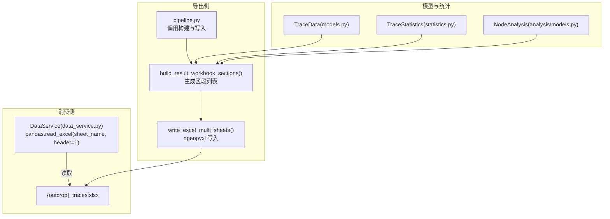
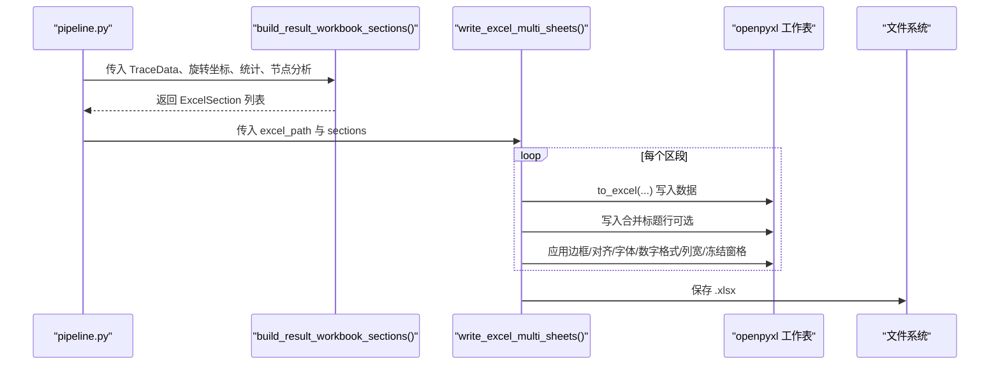
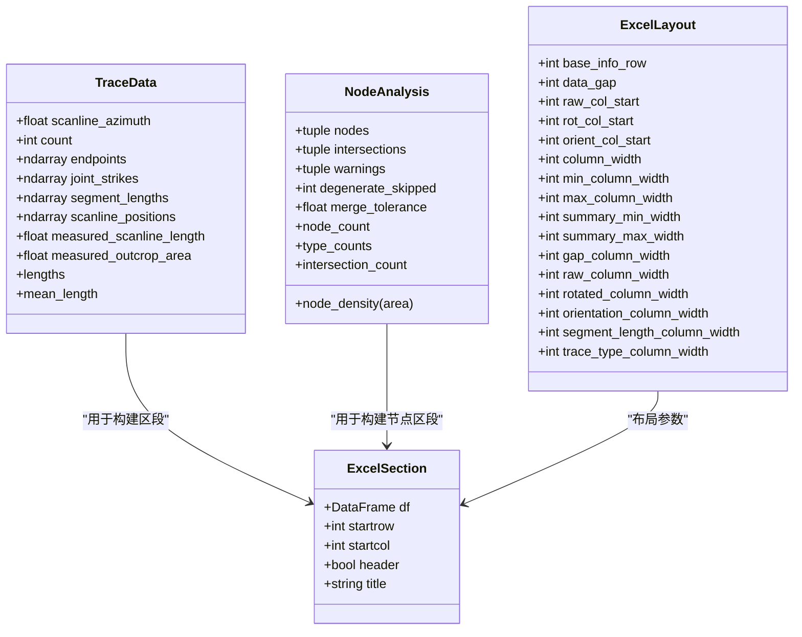
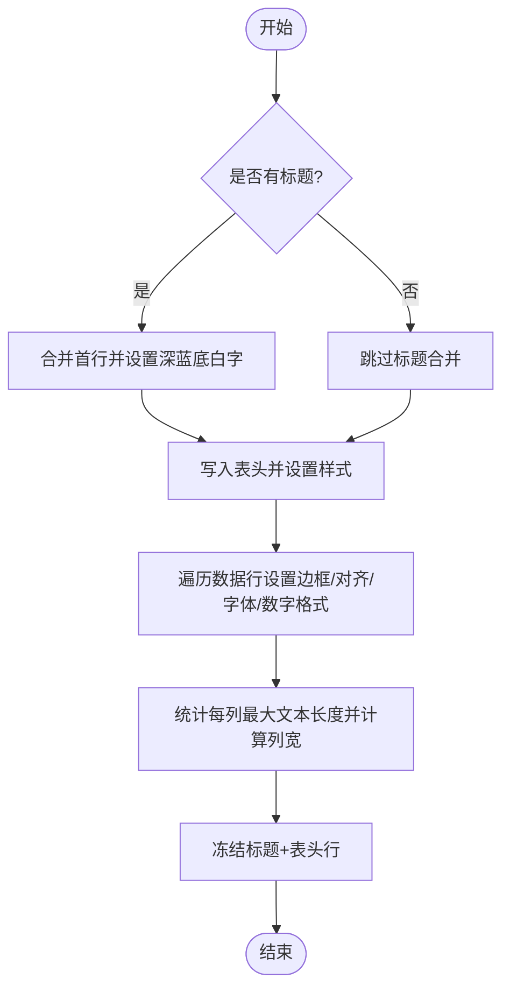
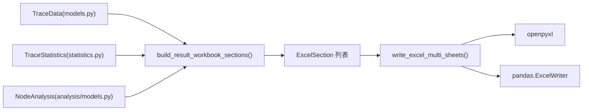

# Excel 写入接口

<cite>
**本文引用的文件**   
- [excel_writer.py](file://trace_pipeline/io/excel_writer.py)
- [models.py](file://trace_pipeline/models.py)
- [analysis_models.py](file://trace_pipeline/analysis/models.py)
- [statistics.py](file://trace_pipeline/geology/statistics.py)
- [pipeline.py](file://trace_pipeline/pipeline.py)
- [test_excel_writer.py](file://tests/test_excel_writer.py)
- [data_service.py](file://backend/services/data_service.py)
</cite>

## 目录
1. [简介](#简介)
2. [项目结构](#项目结构)
3. [核心组件](#核心组件)
4. [架构总览](#架构总览)
5. [详细组件分析](#详细组件分析)
6. [依赖关系分析](#依赖关系分析)
7. [性能与内存管理](#性能与内存管理)
8. [兼容性与限制](#兼容性与限制)
9. [扩展与自定义输出格式](#扩展与自定义输出格式)
10. [故障排查指南](#故障排查指南)
11. [结论](#结论)

## 简介
本文件面向使用 trace_pipeline 的工程师与数据分析师，系统化说明 Excel 写入接口的整体设计、工作簿结构与多工作表组织方式，覆盖字段定义、命名规范、输出路径约定、批量写入优化策略、不同 Excel 版本的兼容性以及扩展方法。重点围绕 write_excel_multi_sheets() 与其上游构建函数 build_result_workbook_sections() 展开，给出端到端的数据流与样式渲染流程，并提供可操作的排错建议。

## 项目结构
Excel 写入能力位于 io 模块中，由 pipeline 阶段调用；读取侧在 backend 服务层通过 pandas 打开生成的多工作表文件进行分页展示。

图表来源
- [pipeline.py:370-474](file://trace_pipeline/pipeline.py#L370-L474)
- [excel_writer.py:279-489](file://trace_pipeline/io/excel_writer.py#L279-L489)
- [models.py:41-157](file://trace_pipeline/models.py#L41-L157)
- [analysis_models.py:70-98](file://trace_pipeline/analysis/models.py#L70-L98)
- [statistics.py:1-200](file://trace_pipeline/geology/statistics.py#L1-L200)
- [data_service.py:97-130](file://backend/services/data_service.py#L97-L130)

章节来源
- [pipeline.py:370-474](file://trace_pipeline/pipeline.py#L370-L474)
- [excel_writer.py:279-489](file://trace_pipeline/io/excel_writer.py#L279-L489)
- [models.py:41-157](file://trace_pipeline/models.py#L41-L157)
- [analysis_models.py:70-98](file://trace_pipeline/analysis/models.py#L70-L98)
- [statistics.py:1-200](file://trace_pipeline/geology/statistics.py#L1-L200)
- [data_service.py:97-130](file://backend/services/data_service.py#L97-L130)

## 核心组件
- ExcelSection：表示一个待写入的 DataFrame 区段，包含起始行列、是否带表头、可选标题等元信息。
- ExcelLayout：控制列宽、间距、冻结窗格等布局参数（默认值已内置）。
- build_result_workbook_sections()：根据 TraceData、旋转坐标、统计结果与节点分析，组装多个 ExcelSection。
- write_excel_multi_sheets()：遍历区段，逐个写入独立工作表并应用统一样式。

章节来源
- [excel_writer.py:37-70](file://trace_pipeline/io/excel_writer.py#L37-L70)
- [excel_writer.py:279-331](file://trace_pipeline/io/excel_writer.py#L279-L331)
- [excel_writer.py:462-489](file://trace_pipeline/io/excel_writer.py#L462-L489)

## 架构总览
下图展示了从流水线到最终 Excel 文件的完整序列，包括数据准备、区段构建、写入与样式化过程。

图表来源
- [pipeline.py:370-474](file://trace_pipeline/pipeline.py#L370-L474)
- [excel_writer.py:279-489](file://trace_pipeline/io/excel_writer.py#L279-L489)

## 详细组件分析

### 工作簿结构与多工作表组织
- 基本信息：单行键值对，包含测线走向、长度、平均迹长、露头面积及来源标注。
- 裂隙情况：当存在统计结果时追加，包含各类裂隙计数。
- 计算数据：当存在统计结果时追加，包含 P10/P20/P21、有效取样窗数量与校验告警。
- 原始端点坐标：N×4 矩阵，列名为“起点X/起点Y/终点X/终点Y”。
- 旋转后端点坐标：N×4 矩阵，列名为“旋转后起点X/旋转后起点Y/旋转后终点X/旋转后终点Y”。
- 走向与长度：包含节理走向、端点距离、测段长度(r5+r7)，若提供统计则追加“迹线类型”列。
- 节点相关（可选）：节点统计、节点明细、节点交点（仅当有相交事件时出现）。

命名规范
- 工作表名采用中文语义名称，如“基本信息”“原始端点坐标”“走向与长度”等。
- 表头行使用加粗、浅蓝填充、居中对齐，首行可选合并标题（深蓝色背景、白字居中）。
- 正文单元格按内容自动选择西文或中文字体，数值型设置固定小数位格式。

数据格式要求
- 浮点数保留四位小数，末尾零去除；角度单位以度显示；长度单位以米显示。
- 缺失值统一显示为“N/A”。
- 面密度与面积等指标附带来源短标签，如“(measured)”“(hull)”“(window_equivalent)”等。

章节来源
- [excel_writer.py:193-273](file://trace_pipeline/io/excel_writer.py#L193-L273)
- [excel_writer.py:297-331](file://trace_pipeline/io/excel_writer.py#L297-L331)
- [excel_writer.py:334-394](file://trace_pipeline/io/excel_writer.py#L334-L394)
- [excel_writer.py:400-460](file://trace_pipeline/io/excel_writer.py#L400-L460)

### 字段定义与数据模型映射
- TraceData：提供测线走向、端点坐标、走向角、测段长度、位置、实测长度/面积等基础输入。
- TraceStatistics：提供 I/II/III 类裂隙计数、P10/P20/P21、有效窗数、警告信息等。
- NodeAnalysis：提供节点总数、类型分布、交点事件、密度与容差等。

图表来源
- [models.py:41-157](file://trace_pipeline/models.py#L41-L157)
- [analysis_models.py:70-98](file://trace_pipeline/analysis/models.py#L70-L98)
- [excel_writer.py:37-70](file://trace_pipeline/io/excel_writer.py#L37-L70)

章节来源
- [models.py:41-157](file://trace_pipeline/models.py#L41-L157)
- [analysis_models.py:70-98](file://trace_pipeline/analysis/models.py#L70-L98)
- [excel_writer.py:37-70](file://trace_pipeline/io/excel_writer.py#L37-L70)

### 写入流程与样式规则
- 标题行：可选合并，深蓝底白字居中。
- 表头行：浅蓝底、加粗、居中、自动换行、细边框。
- 数据行：居中、细边框、按内容选择字体（中文宋体/黑体，英文 Times New Roman），数值格式固定小数位。
- 列宽：基于文本长度动态计算，限定最小/最大宽度。
- 冻结窗格：冻结标题行与表头行，便于滚动查看。

图表来源
- [excel_writer.py:400-460](file://trace_pipeline/io/excel_writer.py#L400-L460)

章节来源
- [excel_writer.py:400-460](file://trace_pipeline/io/excel_writer.py#L400-L460)

### 输出文件目录结构与命名约定
- 文件名：{output_prefix}_traces.xlsx
- 目录：由配置项 output_dir 指定，写入前确保目录存在。
- 工作表：每个区段对应一个 sheet，名称即区段标题（如“原始端点坐标”“走向与长度”等）。

章节来源
- [pipeline.py:370-474](file://trace_pipeline/pipeline.py#L370-L474)
- [excel_writer.py:462-489](file://trace_pipeline/io/excel_writer.py#L462-L489)

### 输出数据模型与示例文件结构
- 基本信息：单行键值对，含测线走向、长度、平均迹长、露头面积与来源标注。
- 裂隙情况：I/II/III 类裂隙计数。
- 计算数据：P10/P20/P21、有效取样窗数量、校验告警。
- 原始端点坐标：N×4，列名“起点X/起点Y/终点X/终点Y”。
- 旋转后端点坐标：N×4，列名“旋转后起点X/旋转后起点Y/旋转后终点X/旋转后终点Y”。
- 走向与长度：节理走向(°)、端点距离、测段长度(r5+r7)，可选“迹线类型”。
- 节点统计/明细/交点：仅在启用节点分析且存在数据时输出。

章节来源
- [excel_writer.py:193-394](file://trace_pipeline/io/excel_writer.py#L193-L394)

## 依赖关系分析
- 构建阶段依赖：
  - TraceData：提供端点、走向、长度等基础几何与测量信息。
  - TraceStatistics：提供统计指标与来源标注。
  - NodeAnalysis：提供节点与交点信息。
- 写入阶段依赖：
  - openpyxl：负责 Excel 工作簿与工作表的创建、样式与富文本支持。
  - pandas：作为中间载体，将 DataFrame 写入 openpyxl 引擎。

图表来源
- [models.py:41-157](file://trace_pipeline/models.py#L41-L157)
- [analysis_models.py:70-98](file://trace_pipeline/analysis/models.py#L70-L98)
- [statistics.py:1-200](file://trace_pipeline/geology/statistics.py#L1-L200)
- [excel_writer.py:279-489](file://trace_pipeline/io/excel_writer.py#L279-L489)

章节来源
- [models.py:41-157](file://trace_pipeline/models.py#L41-L157)
- [analysis_models.py:70-98](file://trace_pipeline/analysis/models.py#L70-L98)
- [statistics.py:1-200](file://trace_pipeline/geology/statistics.py#L1-L200)
- [excel_writer.py:279-489](file://trace_pipeline/io/excel_writer.py#L279-L489)

## 性能与内存管理
- 批量写入优化
  - 使用 pandas.ExcelWriter 上下文管理器一次性打开 writer，避免重复打开/关闭开销。
  - 逐区段写入，减少单次写入的数据量，降低峰值内存占用。
  - 列宽计算在一次遍历中完成，避免二次扫描整列。
- 内存管理策略
  - 优先使用 numpy 数组与 pandas DataFrame 进行向量化处理，减少 Python 循环。
  - 对大表避免一次性加载过多工作表；按需构建区段列表。
  - 合理设置列宽上限，防止超大列宽导致渲染缓慢。
- 实践建议
  - 对于超大数据集，考虑分批次生成区段并分批写入。
  - 关闭不必要的样式（如合并标题）以提升性能。
  - 在流水线中记录导出耗时，便于定位瓶颈。

章节来源
- [excel_writer.py:462-489](file://trace_pipeline/io/excel_writer.py#L462-L489)
- [excel_writer.py:412-460](file://trace_pipeline/io/excel_writer.py#L412-L460)
- [pipeline.py:370-474](file://trace_pipeline/pipeline.py#L370-L474)

## 兼容性与限制
- 文件格式与引擎
  - 使用 openpyxl 引擎，输出 .xlsx 格式。
- 字体与富文本
  - 中文使用宋体/黑体，英文/数字使用 Times New Roman；混合文本通过 CellRichText 分段渲染。
  - 测试覆盖了英文/数字开头的首段字体选择，确保正确性。
- 数值格式
  - 整数与浮点数分别设置格式，浮点数保留四位小数并去除末尾零。
- 已知限制
  - 需要系统安装相应字体（SimSun/SimHei/Times New Roman）以保证显示一致。
  - 大量合并单元格与复杂样式可能影响大型文件的打开速度。

章节来源
- [excel_writer.py:77-148](file://trace_pipeline/io/excel_writer.py#L77-L148)
- [test_excel_writer.py:1-50](file://tests/test_excel_writer.py#L1-L50)

## 扩展与自定义输出格式
- 新增工作表区段
  - 在 build_result_workbook_sections() 中追加新的 ExcelSection，指定标题、DataFrame 与布局参数。
- 自定义样式
  - 复用 _style_sheet() 与 _apply_cell_font() 逻辑，或在外部封装自定义样式器。
- 自定义列宽与布局
  - 调整 ExcelLayout 实例中的列宽与间距参数，以满足特定报表需求。
- 自定义数据来源标注
  - 修改 _source_tag() 映射，适配新的来源类型或缩写。
- 最佳实践
  - 保持区段粒度清晰，避免单个区段过大。
  - 统一字段命名与单位，便于下游消费与可视化。
  - 对关键指标增加来源标注，提升可追溯性。

章节来源
- [excel_writer.py:279-331](file://trace_pipeline/io/excel_writer.py#L279-L331)
- [excel_writer.py:412-460](file://trace_pipeline/io/excel_writer.py#L412-L460)
- [excel_writer.py:178-191](file://trace_pipeline/io/excel_writer.py#L178-L191)

## 故障排查指南
- 常见错误
  - 形状不一致：旋转坐标与原始端点形状不匹配会抛出异常。
  - 非法数值：旋转坐标包含 NaN 或 inf 会抛出异常。
  - 类型数量不一致：统计结果的迹线类型数量与迹线条数不一致会抛出异常。
  - 权限问题：输出文件被占用或无写入权限时会抛出 PermissionError。
- 排查步骤
  - 检查输入数据的维度与有效性。
  - 确认统计结果与迹线条数一致。
  - 关闭已打开的输出文件后重试。
  - 查看日志中的导出路径与耗时，定位问题阶段。

章节来源
- [excel_writer.py:280-294](file://trace_pipeline/io/excel_writer.py#L280-L294)
- [excel_writer.py:314-319](file://trace_pipeline/io/excel_writer.py#L314-L319)
- [pipeline.py:450-474](file://trace_pipeline/pipeline.py#L450-L474)

## 结论
Excel 写入接口通过清晰的区段化设计与统一的样式规则，实现了结构化、可读性强且易于扩展的多工作表输出。借助 pandas 与 openpyxl 的组合，既保证了写入效率，又提供了灵活的样式定制能力。配合严格的输入校验与友好的错误提示，该接口在生产环境中具备较高的稳定性与可维护性。