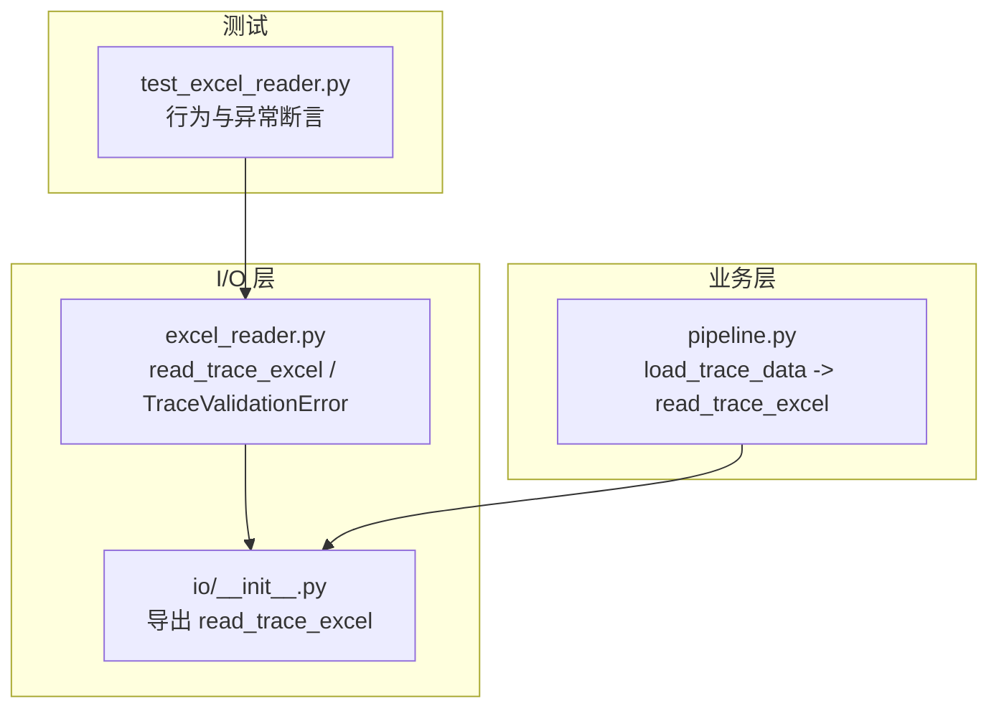
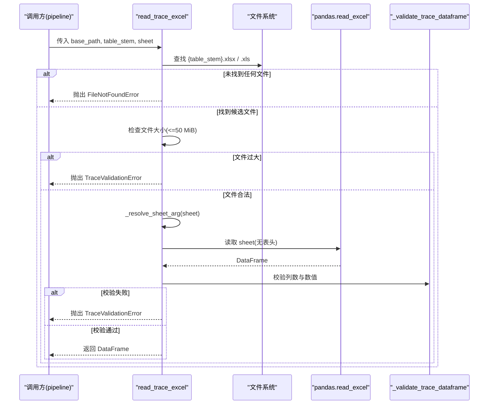
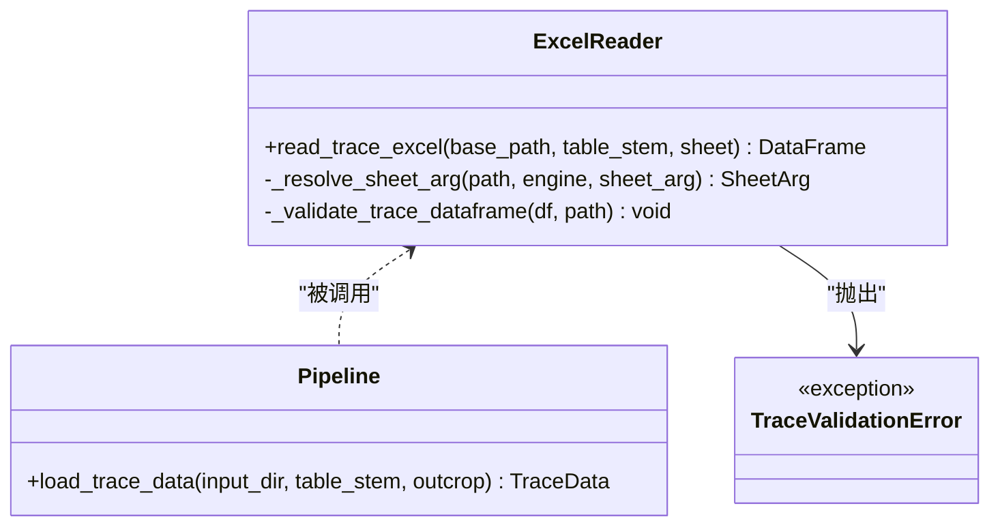

# Excel 读取接口

<cite>
**本文引用的文件列表**
- [trace_pipeline/io/excel_reader.py](file://trace_pipeline/io/excel_reader.py)
- [tests/test_excel_reader.py](file://tests/test_excel_reader.py)
- [trace_pipeline/pipeline.py](file://trace_pipeline/pipeline.py)
- [trace_pipeline/io/__init__.py](file://trace_pipeline/io/__init__.py)
- [config.example.json](file://config.example.json)
</cite>

## 目录
1. [简介](#简介)
2. [项目结构](#项目结构)
3. [核心组件](#核心组件)
4. [架构总览](#架构总览)
5. [详细组件分析](#详细组件分析)
6. [依赖关系分析](#依赖关系分析)
7. [性能考虑](#性能考虑)
8. [故障排查指南](#故障排查指南)
9. [结论](#结论)
10. [附录](#附录)

## 简介
本文件面向需要调用或集成 Excel 迹线表读取能力的开发者与使用者，聚焦于 read_trace_excel() 接口的参数格式、扩展名自动识别机制（.xlsx/.xls）、工作表回退策略、错误处理逻辑，以及 TraceValidationError 异常类型的使用场景和数据验证规则。文档同时给出文件大小限制（50 MiB）与性能优化建议，并提供输入数据格式规范、示例说明与批量处理最佳实践。

## 项目结构
Excel 读取能力位于 trace_pipeline/io 子包中，对外通过 __init__.py 暴露 read_trace_excel 函数；上层 pipeline 模块在数据处理流水线中调用该接口完成迹线数据的加载。

图表来源
- [trace_pipeline/io/excel_reader.py:1-169](file://trace_pipeline/io/excel_reader.py#L1-L169)
- [trace_pipeline/io/__init__.py:1-22](file://trace_pipeline/io/__init__.py#L1-L22)
- [trace_pipeline/pipeline.py:61-95](file://trace_pipeline/pipeline.py#L61-L95)
- [tests/test_excel_reader.py:1-46](file://tests/test_excel_reader.py#L1-46)

章节来源
- [trace_pipeline/io/excel_reader.py:1-169](file://trace_pipeline/io/excel_reader.py#L1-L169)
- [trace_pipeline/io/__init__.py:1-22](file://trace_pipeline/io/__init__.py#L1-L22)
- [trace_pipeline/pipeline.py:61-95](file://trace_pipeline/pipeline.py#L61-L95)
- [tests/test_excel_reader.py:1-46](file://tests/test_excel_reader.py#L1-46)

## 核心组件
- read_trace_excel(base_path, table_stem, sheet=None)
  - 功能：根据 base_path 与 table_stem 定位 .xlsx 或 .xls 文件，按指定 sheet 或首表读取，返回无表头的 DataFrame。
  - 关键特性：
    - 扩展名自动识别：优先 .xlsx，缺失则回退 .xls。
    - 工作表回退：若指定 sheet 不存在，直接回退到首个 sheet，避免失败读取尝试。
    - 大小限制：超过 50 MiB 的文件拒绝读取并抛出 TraceValidationError。
    - 数据校验：最少列数与数值有效性检查，不满足时抛出 TraceValidationError。
    - 错误聚合：当所有候选文件/工作表均失败时，汇总最近若干错误信息后抛出 ValueError。
- TraceValidationError(ValueError)
  - 用途：表示“数据格式错误”（如列数不足、数值无效、文件过大等），区别于“工作表不存在”的可回退错误。
- 内部辅助
  - _resolve_sheet_arg：解析实际读取的 sheet，目标 sheet 不存在时直接回退首表。
  - _validate_trace_dataframe：校验迹线 DataFrame 的基本格式（最小列数与数值占比）。

章节来源
- [trace_pipeline/io/excel_reader.py:28-106](file://trace_pipeline/io/excel_reader.py#L28-L106)
- [trace_pipeline/io/excel_reader.py:109-169](file://trace_pipeline/io/excel_reader.py#L109-L169)

## 架构总览
下图展示了从 pipeline 调用到 Excel 读取与校验的完整流程，包括扩展名选择、工作表解析与回退、大小限制与数据校验。

图表来源
- [trace_pipeline/pipeline.py:61-95](file://trace_pipeline/pipeline.py#L61-L95)
- [trace_pipeline/io/excel_reader.py:36-106](file://trace_pipeline/io/excel_reader.py#L36-L106)
- [trace_pipeline/io/excel_reader.py:109-169](file://trace_pipeline/io/excel_reader.py#L109-L169)

## 详细组件分析

### 接口定义与参数语义
- 参数
  - base_path: 输入目录路径（字符串）。
  - table_stem: 不含扩展名的文件名（字符串）。
  - sheet: 工作表名或索引；为 None 或不存在时回退到第一个 sheet。
- 返回值
  - pandas.DataFrame：无表头的原始数据帧。
- 异常
  - FileNotFoundError：在 base_path 下未找到 {table_stem}.xlsx 或 {table_stem}.xls。
  - TraceValidationError：文件过大、列数不足、数值无效等数据格式问题。
  - ValueError：存在文件但所有尝试均失败（包含最近若干错误详情）。

章节来源
- [trace_pipeline/io/excel_reader.py:36-54](file://trace_pipeline/io/excel_reader.py#L36-L54)
- [trace_pipeline/io/excel_reader.py:66-106](file://trace_pipeline/io/excel_reader.py#L66-L106)

### 扩展名自动识别机制
- 候选顺序：先尝试 .xlsx（openpyxl 引擎），再回退 .xls（xlrd 引擎）。
- 仅对存在的文件进行读取尝试，每个文件只读一次。
- 若两个扩展名均不存在，直接抛出 FileNotFoundError。

章节来源
- [trace_pipeline/io/excel_reader.py:16-24](file://trace_pipeline/io/excel_reader.py#L16-L24)
- [trace_pipeline/io/excel_reader.py:55-67](file://trace_pipeline/io/excel_reader.py#L55-L67)

### 工作表回退策略
- 若 sheet 为 None 或非字符串空值，直接使用原 sheet_arg（通常为整数索引）。
- 若 sheet 为字符串且存在，则使用该名称；否则直接回退到首个 sheet（索引 0），避免失败的读取尝试。
- 若检查工作表失败（例如底层异常），保留原 sheet_arg，交由外层循环继续回退。

章节来源
- [trace_pipeline/io/excel_reader.py:109-126](file://trace_pipeline/io/excel_reader.py#L109-L126)
- [tests/test_excel_reader.py:13-31](file://tests/test_excel_reader.py#L13-L31)

### 错误处理逻辑
- 文件级错误
  - 未找到文件：抛出 FileNotFoundError。
  - 文件过大：抛出 TraceValidationError（含具体大小信息与上限提示）。
- 工作表级错误
  - 工作表名不存在：被 _resolve_sheet_arg 捕获并回退至首表，不会记录为失败尝试。
  - 其他读取异常：记录日志并收集错误信息，最终汇总抛出 ValueError。
- 数据格式错误
  - 列数不足或数值无效：抛出 TraceValidationError，不回退，避免掩盖真实错误。

章节来源
- [trace_pipeline/io/excel_reader.py:66-106](file://trace_pipeline/io/excel_reader.py#L66-L106)

### 数据验证规则与 TraceValidationError 使用场景
- 最小列数要求
  - 至少 4 列，分别对应 x1, y1, x2, y2。
  - 若少于 4 列，抛出 TraceValidationError。
- 数值有效性检查
  - 对前若干行（默认最多 2 行）的前 4 列进行数值转换检测。
  - 统计可转换为数值的单元格比例，若低于阈值（0.5），记录警告日志（用于提示可能包含非数据行）。
  - 注意：当前实现以警告为主，未在此处直接抛出异常；但列数不足会直接抛出异常。
- 文件过大
  - 超过 50 MiB 直接抛出 TraceValidationError，不调用 pandas 读取。

章节来源
- [trace_pipeline/io/excel_reader.py:21-24](file://trace_pipeline/io/excel_reader.py#L21-L24)
- [trace_pipeline/io/excel_reader.py:69-78](file://trace_pipeline/io/excel_reader.py#L69-L78)
- [trace_pipeline/io/excel_reader.py:128-169](file://trace_pipeline/io/excel_reader.py#L128-L169)
- [tests/test_excel_reader.py:33-46](file://tests/test_excel_reader.py#L33-L46)

### 输入数据格式规范与示例
- 基本结构
  - 无表头，每行代表一条迹线。
  - 至少 4 列：x1, y1, x2, y2（均为数值型）。
- 支持版本与引擎
  - .xlsx：使用 openpyxl 引擎。
  - .xls：使用 xlrd 引擎。
- 兼容性与注意事项
  - 若工作表名为期望的名称但不存在，将自动回退到首个 sheet。
  - 若首行包含标题等非数值内容，可能导致数值占比过低告警；建议在生成 Excel 时确保数据从首行开始。
- 示例（概念性描述）
  - 文件命名：{table_stem}.xlsx 或 {table_stem}.xls。
  - 工作表：可为任意名称；若指定名称不存在，将回退到首个 sheet。
  - 数据样例（示意）：
    - 第1行：0.0, 0.1, 30.0, 1.5
    - 第2行：2.0, 0.2, 35.0, 3.5
  - 参考测试用例中的构造方式与断言。

章节来源
- [tests/test_excel_reader.py:13-31](file://tests/test_excel_reader.py#L13-L31)
- [trace_pipeline/io/excel_reader.py:128-169](file://trace_pipeline/io/excel_reader.py#L128-L169)

### 与上层流水线的集成
- pipeline 模块通过 load_trace_data 调用 read_trace_excel，并将结果进一步计算端点、统计量与绘图。
- 调用位置与缓存：
  - _input_file_signature 负责定位输入文件并返回签名（mtime、size）。
  - _load_trace_data_cached 基于文件签名做 LRU 缓存，减少重复读取开销。
  - load_trace_data 封装日志与耗时统计。

章节来源
- [trace_pipeline/pipeline.py:50-95](file://trace_pipeline/pipeline.py#L50-L95)

## 依赖关系分析
- 模块内依赖
  - excel_reader.py 依赖 pandas 进行 Excel 读取与数值转换。
  - io/__init__.py 导出 read_trace_excel，供外部模块统一导入。
- 跨模块依赖
  - pipeline.py 依赖 io.excel_reader 提供的读取能力。
- 耦合与内聚
  - 读取逻辑集中在 excel_reader.py，职责单一，内聚良好。
  - 工作表解析与数据校验分离为独立函数，便于复用与测试。

图表来源
- [trace_pipeline/io/excel_reader.py:28-169](file://trace_pipeline/io/excel_reader.py#L28-L169)
- [trace_pipeline/pipeline.py:61-95](file://trace_pipeline/pipeline.py#L61-L95)

章节来源
- [trace_pipeline/io/__init__.py:1-22](file://trace_pipeline/io/__init__.py#L1-L22)
- [trace_pipeline/pipeline.py:61-95](file://trace_pipeline/pipeline.py#L61-L95)

## 性能考虑
- 文件大小限制
  - 超过 50 MiB 直接拒绝读取，避免 pandas 加载大文件导致内存压力。
- 工作表预检
  - 通过 _resolve_sheet_arg 预先检查工作表是否存在，避免失败读取尝试，减少 I/O 浪费。
- 缓存策略
  - pipeline 层基于文件签名（mtime、size）对加载结果做 LRU 缓存，避免重复解析同一文件。
- 读取引擎选择
  - .xlsx 使用 openpyxl，.xls 使用 xlrd，兼顾新旧格式兼容性。
- 数值检测范围
  - 数值有效性检查仅针对前若干行与前 4 列，降低全表扫描成本。

章节来源
- [trace_pipeline/io/excel_reader.py:21-24](file://trace_pipeline/io/excel_reader.py#L21-L24)
- [trace_pipeline/io/excel_reader.py:109-126](file://trace_pipeline/io/excel_reader.py#L109-L126)
- [trace_pipeline/pipeline.py:61-95](file://trace_pipeline/pipeline.py#L61-L95)

## 故障排查指南
- 常见错误与解决
  - 未找到文件
    - 现象：抛出 FileNotFoundError。
    - 排查：确认 base_path 与 table_stem 是否正确，是否存在 .xlsx 或 .xls。
  - 工作表不存在
    - 现象：自动回退到首个 sheet，不会报错。
    - 排查：检查目标工作表名称是否拼写正确；必要时显式传入首个 sheet 的索引。
  - 文件过大
    - 现象：抛出 TraceValidationError，提示超过 50 MiB。
    - 排查：拆分文件或压缩数据后再处理。
  - 列数不足
    - 现象：抛出 TraceValidationError，提示至少 4 列。
    - 排查：确保数据包含 x1, y1, x2, y2 四列。
  - 数值无效或占比过低
    - 现象：记录警告日志，提示可能包含非数据行。
    - 排查：检查首行是否为标题或注释；确保数据从首行开始且为数值。
- 日志定位
  - 启用 DEBUG 级别日志可查看工作表解析与回退细节。
  - 关注 validate_trace 阶段的 numeric_ratio 字段，评估数值占比。

章节来源
- [trace_pipeline/io/excel_reader.py:66-106](file://trace_pipeline/io/excel_reader.py#L66-L106)
- [trace_pipeline/io/excel_reader.py:128-169](file://trace_pipeline/io/excel_reader.py#L128-L169)
- [tests/test_excel_reader.py:13-31](file://tests/test_excel_reader.py#L13-L31)

## 结论
read_trace_excel 提供了健壮、易用的 Excel 迹线表读取能力，具备扩展名自动识别、工作表智能回退、严格的数据校验与明确的大小限制。配合 pipeline 层的缓存策略，可在保证正确性的前提下提升整体性能。遵循本文的输入规范与最佳实践，可有效避免常见错误并提高批量处理的稳定性。

## 附录

### 配置项参考
- 常用配置字段（节选）
  - input_dir：输入目录。
  - output_dir：输出目录。
  - output_prefix：输出前缀。
  - table_stem：迹线表文件名（不含扩展名）。
  - outcrop：露头标识（常作为 sheet 名传入）。
  - process_all：是否处理全部文件。
  - export_rose_plot：是否导出玫瑰图。
  - rose_bin_width、rose_dpi：玫瑰图分箱宽度与 DPI。
  - trace_dpi、rotated_trace_dpi：迹线图 DPI。
  - window_strategy、auto_density_threshold、tangent_window_count、min_intersections：窗口策略与参数。
  - enable_node_recognition、node_merge_tolerance、show_node_overlay、node_label_mode：节点识别相关选项。
  - parallel_workers：并行工作进程数。
  - is_dev_mode：开发模式开关。

章节来源
- [config.example.json:1-26](file://config.example.json#L1-L26)