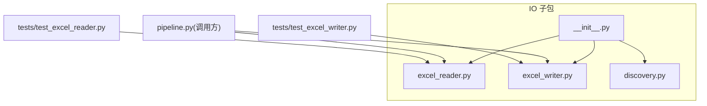
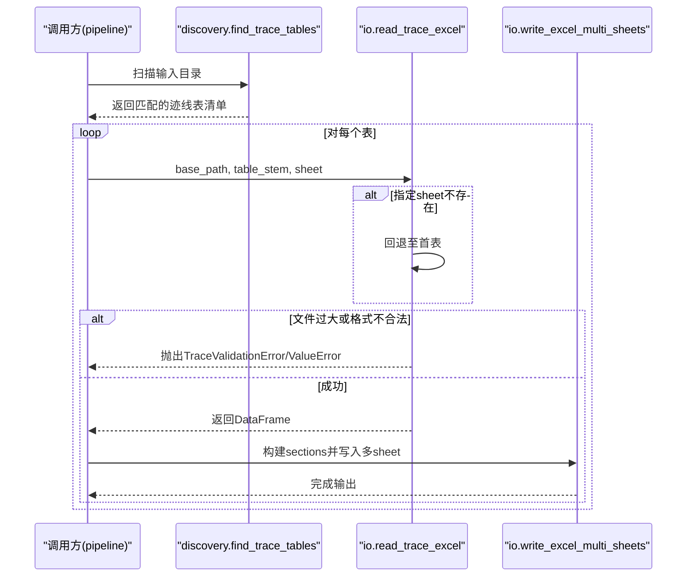
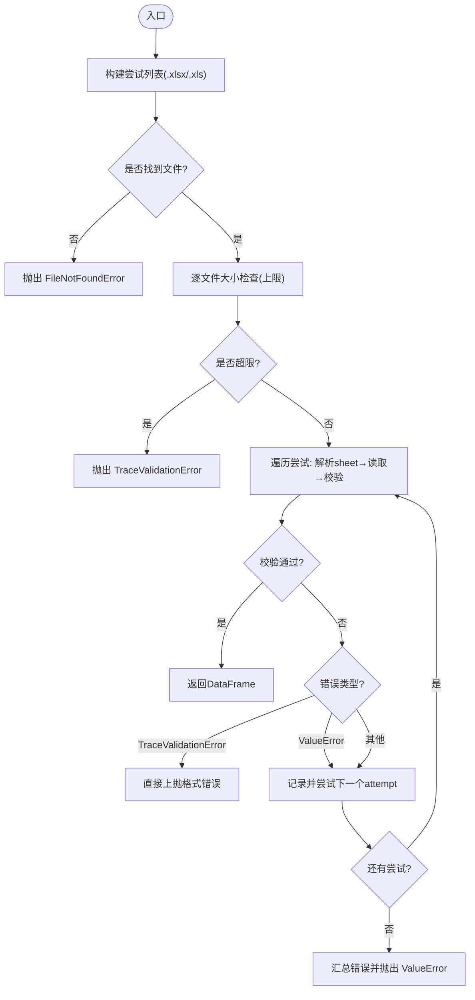
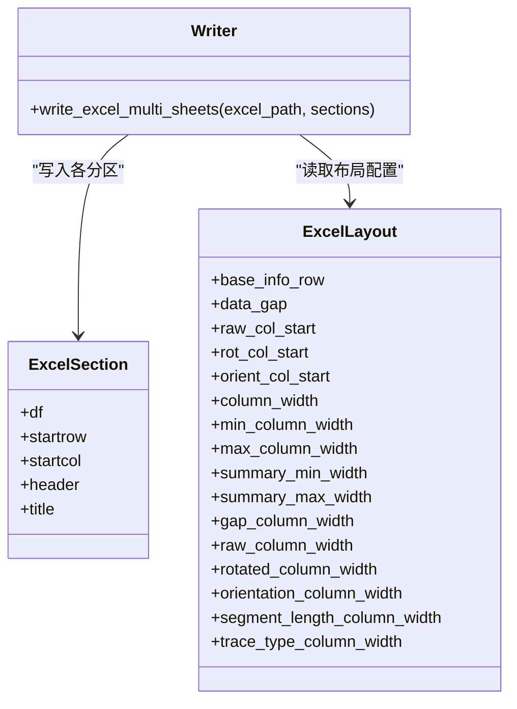
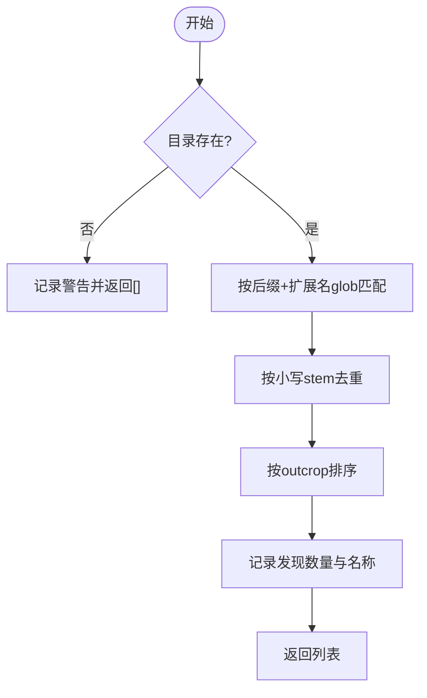
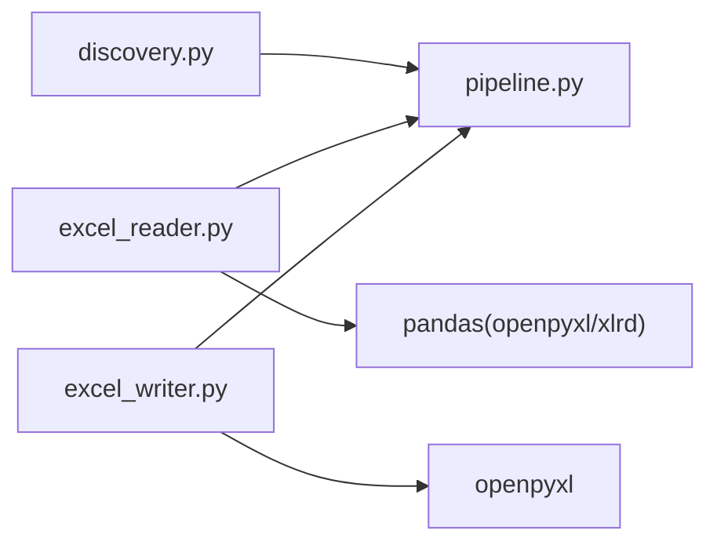

# IO 接口文档

<cite>
**本文引用的文件**
- [trace_pipeline/io/excel_reader.py](file://trace_pipeline/io/excel_reader.py)
- [trace_pipeline/io/excel_writer.py](file://trace_pipeline/io/excel_writer.py)
- [trace_pipeline/io/discovery.py](file://trace_pipeline/io/discovery.py)
- [trace_pipeline/io/__init__.py](file://trace_pipeline/io/__init__.py)
- [tests/test_excel_reader.py](file://tests/test_excel_reader.py)
- [tests/test_excel_writer.py](file://tests/test_excel_writer.py)
- [trace_pipeline/pipeline.py](file://trace_pipeline/pipeline.py)
</cite>

## 目录
1. [简介](#简介)
2. [项目结构](#项目结构)
3. [核心组件](#核心组件)
4. [架构总览](#架构总览)
5. [详细组件分析](#详细组件分析)
6. [依赖关系分析](#依赖关系分析)
7. [性能与兼容性](#性能与兼容性)
8. [故障排查指南](#故障排查指南)
9. [结论](#结论)
10. [附录：输入数据规范与示例结构](#附录输入数据规范与示例结构)

## 简介
本参考文档聚焦于 TracePipeline 的 IO 子系统，覆盖以下能力：
- Excel 迹线表读取接口 read_trace_excel()：参数格式、回退策略、数据验证规则与错误处理。
- Excel 多工作表写入接口 write_excel_multi_sheets()：工作簿结构与数据组织方式。
- 文件发现机制 discovery 模块：自动文件查找与路径解析。
- 输入数据格式规范与示例文件结构。
- 支持的 Excel 版本与兼容性要求。
- 批量处理与错误恢复策略（结合流水线调用方）。

## 项目结构
IO 子包位于 trace_pipeline/io，包含三个核心模块：
- excel_reader.py：Excel 迹线表读取、引擎选择、sheet 回退与基础校验。
- excel_writer.py：结果导出为多工作表 Excel，含样式与布局配置。
- discovery.py：扫描输入目录，按后缀匹配发现迹线表文件。

图表来源
- [trace_pipeline/io/__init__.py:1-22](file://trace_pipeline/io/__init__.py#L1-L22)
- [trace_pipeline/io/excel_reader.py:1-169](file://trace_pipeline/io/excel_reader.py#L1-L169)
- [trace_pipeline/io/excel_writer.py:1-489](file://trace_pipeline/io/excel_writer.py#L1-L489)
- [trace_pipeline/io/discovery.py:1-63](file://trace_pipeline/io/discovery.py#L1-L63)
- [trace_pipeline/pipeline.py:60-95](file://trace_pipeline/pipeline.py#L60-L95)
- [trace_pipeline/pipeline.py:375-388](file://trace_pipeline/pipeline.py#L375-L388)
- [tests/test_excel_reader.py:1-46](file://tests/test_excel_reader.py#L1-L46)
- [tests/test_excel_writer.py:1-50](file://tests/test_excel_writer.py#L1-L50)

章节来源
- [trace_pipeline/io/__init__.py:1-22](file://trace_pipeline/io/__init__.py#L1-L22)

## 核心组件
- 读取器：read_trace_excel(base_path, table_stem, sheet=None)
  - 优先 .xlsx，缺失则回退 .xls；指定 sheet 不存在时回退首表。
  - 返回无表头的 DataFrame，并进行最小列数与数值有效性检查。
- 写入器：write_excel_multi_sheets(excel_path, sections)
  - 将多个区段写入独立工作表，支持标题行、表头与单元格样式。
- 发现器：find_trace_tables(input_dir, suffix="_process", extensions=(".xlsx",".xls"))
  - 扫描目录，按后缀匹配并去重，返回排序后的 TraceFile 列表。

章节来源
- [trace_pipeline/io/excel_reader.py:36-106](file://trace_pipeline/io/excel_reader.py#L36-L106)
- [trace_pipeline/io/excel_writer.py:462-489](file://trace_pipeline/io/excel_writer.py#L462-L489)
- [trace_pipeline/io/discovery.py:24-63](file://trace_pipeline/io/discovery.py#L24-L63)

## 架构总览
下图展示从“发现文件”到“读取/写入”的整体流程，以及关键异常分支。

图表来源
- [trace_pipeline/io/discovery.py:24-63](file://trace_pipeline/io/discovery.py#L24-L63)
- [trace_pipeline/io/excel_reader.py:36-106](file://trace_pipeline/io/excel_reader.py#L36-L106)
- [trace_pipeline/io/excel_writer.py:462-489](file://trace_pipeline/io/excel_writer.py#L462-L489)
- [trace_pipeline/pipeline.py:60-95](file://trace_pipeline/pipeline.py#L60-L95)
- [trace_pipeline/pipeline.py:375-388](file://trace_pipeline/pipeline.py#L375-L388)

## 详细组件分析

### 读取接口 read_trace_excel()
- 功能要点
  - 候选扩展名顺序：.xlsx → .xls；任一存在即尝试读取。
  - sheet 解析：若传入字符串且不存在，直接回退首表；否则使用传入值或默认 0。
  - 文件大小上限：超过阈值直接拒绝，避免 pandas 加载大文件。
  - 数据校验：最少列数、前若干行的数值占比检测。
  - 错误分类：
    - TraceValidationError：数据格式错误（如列数不足、非数值），立即上抛不回退。
    - ValueError：工作表名不存在等可回退场景，继续尝试下一个 attempt。
    - 其他异常：记录日志并汇总失败原因，最终统一抛出 ValueError。
- 返回值
  - 无表头的 pandas.DataFrame。
- 典型异常
  - FileNotFoundError：未找到任何候选文件。
  - TraceValidationError：文件过大或数据格式不满足最低要求。
  - ValueError：所有尝试均失败（含 sheet 不存在但回退后仍失败）。

图表来源
- [trace_pipeline/io/excel_reader.py:36-106](file://trace_pipeline/io/excel_reader.py#L36-L106)
- [trace_pipeline/io/excel_reader.py:109-126](file://trace_pipeline/io/excel_reader.py#L109-L126)
- [trace_pipeline/io/excel_reader.py:128-169](file://trace_pipeline/io/excel_reader.py#L128-L169)

章节来源
- [trace_pipeline/io/excel_reader.py:36-106](file://trace_pipeline/io/excel_reader.py#L36-L106)
- [trace_pipeline/io/excel_reader.py:109-126](file://trace_pipeline/io/excel_reader.py#L109-L126)
- [trace_pipeline/io/excel_reader.py:128-169](file://trace_pipeline/io/excel_reader.py#L128-L169)
- [tests/test_excel_reader.py:13-31](file://tests/test_excel_reader.py#L13-L31)
- [tests/test_excel_reader.py:33-46](file://tests/test_excel_reader.py#L33-L46)

### 写入接口 write_excel_multi_sheets()
- 功能要点
  - 将多个 ExcelSection 写入独立工作表，每个 sheet 可选标题行与表头。
  - 样式：标题合并居中、表头背景与边框、冻结窗格、数字格式、中英文字体混合渲染。
  - 布局：ExcelLayout 提供列宽、起始列、间距等配置项。
- 工作簿结构
  - 基本信息：测线走向、长度、平均迹长、露头面积等。
  - 裂隙情况：迹线数量、I/II/III型计数。
  - 计算数据：P10、P20、P21、有效取样窗数量及告警。
  - 原始端点坐标、旋转后端点坐标、走向与长度。
  - 节点统计、节点明细、节点交点（可选）。
- 兼容性与限制
  - 使用 openpyxl 引擎，仅支持 .xlsx。
  - 中文/西文混排采用富文本分段，确保字体正确显示。

图表来源
- [trace_pipeline/io/excel_writer.py:37-70](file://trace_pipeline/io/excel_writer.py#L37-L70)
- [trace_pipeline/io/excel_writer.py:462-489](file://trace_pipeline/io/excel_writer.py#L462-L489)

章节来源
- [trace_pipeline/io/excel_writer.py:462-489](file://trace_pipeline/io/excel_writer.py#L462-L489)
- [trace_pipeline/io/excel_writer.py:37-70](file://trace_pipeline/io/excel_writer.py#L37-L70)
- [tests/test_excel_writer.py:14-50](file://tests/test_excel_writer.py#L14-L50)

### 文件发现 discovery 模块
- 功能要点
  - 扫描 input_dir，匹配以指定后缀结尾的文件（默认 "_process"）。
  - 支持扩展名集合（默认 ".xlsx", ".xls"）。
  - 同名文件去重（大小写不敏感），按 outcrop 排序返回。
  - 目录不存在或无匹配时返回空列表并记录日志。
- 数据结构
  - TraceFile(stem, outcrop)：stem 为完整文件名（不含扩展名），outcrop 为去除后缀后的名称。

图表来源
- [trace_pipeline/io/discovery.py:24-63](file://trace_pipeline/io/discovery.py#L24-L63)

章节来源
- [trace_pipeline/io/discovery.py:24-63](file://trace_pipeline/io/discovery.py#L24-L63)

## 依赖关系分析
- 读取器依赖 pandas 的 Excel 读取能力，并通过 openpyxl/xlrd 引擎分别处理 .xlsx/.xls。
- 写入器依赖 openpyxl 进行样式与富文本设置。
- 发现器基于 pathlib 进行文件系统操作。
- 调用方 pipeline 负责缓存、异常封装与阶段编排。

图表来源
- [trace_pipeline/pipeline.py:60-95](file://trace_pipeline/pipeline.py#L60-L95)
- [trace_pipeline/pipeline.py:375-388](file://trace_pipeline/pipeline.py#L375-L388)
- [trace_pipeline/io/excel_reader.py:16-23](file://trace_pipeline/io/excel_reader.py#L16-L23)
- [trace_pipeline/io/excel_writer.py:14-17](file://trace_pipeline/io/excel_writer.py#L14-L17)

章节来源
- [trace_pipeline/pipeline.py:60-95](file://trace_pipeline/pipeline.py#L60-L95)
- [trace_pipeline/pipeline.py:375-388](file://trace_pipeline/pipeline.py#L375-L388)

## 性能与兼容性
- 性能
  - 读取阶段对超大文件进行前置大小检查，避免内存压力。
  - 写入阶段在循环中统计列宽并一次性应用样式，减少二次遍历。
  - 调用方对数据加载进行签名缓存，避免重复解析。
- 兼容性
  - 读取：.xlsx 使用 openpyxl，.xls 使用 xlrd。
  - 写入：仅支持 .xlsx（openpyxl）。
  - 字体：中文宋体/黑体，英文/数字 Times New Roman，混排使用富文本分段。

章节来源
- [trace_pipeline/io/excel_reader.py:16-23](file://trace_pipeline/io/excel_reader.py#L16-L23)
- [trace_pipeline/io/excel_writer.py:77-121](file://trace_pipeline/io/excel_writer.py#L77-L121)
- [trace_pipeline/pipeline.py:60-95](file://trace_pipeline/pipeline.py#L60-L95)

## 故障排查指南
- 常见错误与定位
  - 未找到文件：确认 base_path 与 table_stem 是否正确，是否存在 .xlsx/.xls。
  - 工作表不存在：检查 sheet 名称；若不存在会回退首表，必要时显式传入首表索引。
  - 数据格式错误：确保至少 4 列且前若干行数值占比足够；避免标题行或非数据行干扰。
  - 文件过大：超过上限将被拒绝，需拆分或压缩数据。
  - 权限/占用：写入被占用时会提示关闭已打开的输出文件。
- 建议策略
  - 批量处理：对每个发现的文件逐个处理，捕获异常并记录上下文，继续处理其余文件。
  - 错误恢复：对于可回退的错误（如 sheet 不存在）自动重试；不可恢复错误（格式错误、过大）快速失败并上报。
  - 日志与诊断：利用调试日志中的 stage、path、numeric_ratio 等信息定位问题。

章节来源
- [trace_pipeline/io/excel_reader.py:36-106](file://trace_pipeline/io/excel_reader.py#L36-L106)
- [trace_pipeline/io/excel_reader.py:128-169](file://trace_pipeline/io/excel_reader.py#L128-L169)
- [trace_pipeline/pipeline.py:450-474](file://trace_pipeline/pipeline.py#L450-L474)

## 结论
IO 子系统提供了稳健的 Excel 读取与多工作表写入能力，配合文件发现机制形成端到端的批处理链路。通过严格的格式校验、合理的回退策略与完善的异常分类，系统在易用性与健壮性之间取得良好平衡。建议在批量任务中结合调用方的错误封装与日志体系，实现高可用的数据处理流水线。

## 附录：输入数据规范与示例结构
- 输入文件命名
  - 由 discovery 模块发现的迹线表文件需以指定后缀结尾（默认 "_process"），扩展名为 .xlsx 或 .xls。
  - 示例：O76_process.xlsx、A_outcrop_0map_process.xls。
- 工作表与列
  - 读取接口期望无表头的二维数据，至少 4 列，对应迹线端点坐标 x1, y1, x2, y2。
  - 若传入 sheet 名称不存在，将回退至首个 sheet。
- 数值与数据类型
  - 前若干行应包含足够的数值数据，以保证数值占比阈值通过。
  - 非数值或缺失过多会导致 TraceValidationError。
- 示例文件结构（概念示意）
  - 单表无表头，每行一条迹线，四列为端点坐标。
  - 若存在标题行或其他说明行，请确保其不影响数值占比检测，或在预处理阶段移除。

章节来源
- [trace_pipeline/io/discovery.py:24-63](file://trace_pipeline/io/discovery.py#L24-L63)
- [trace_pipeline/io/excel_reader.py:128-169](file://trace_pipeline/io/excel_reader.py#L128-L169)
- [tests/test_excel_reader.py:13-31](file://tests/test_excel_reader.py#L13-L31)