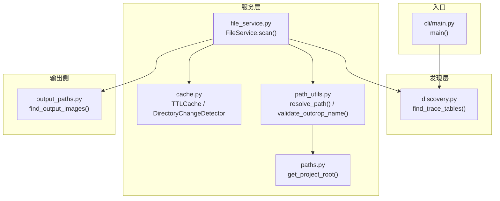
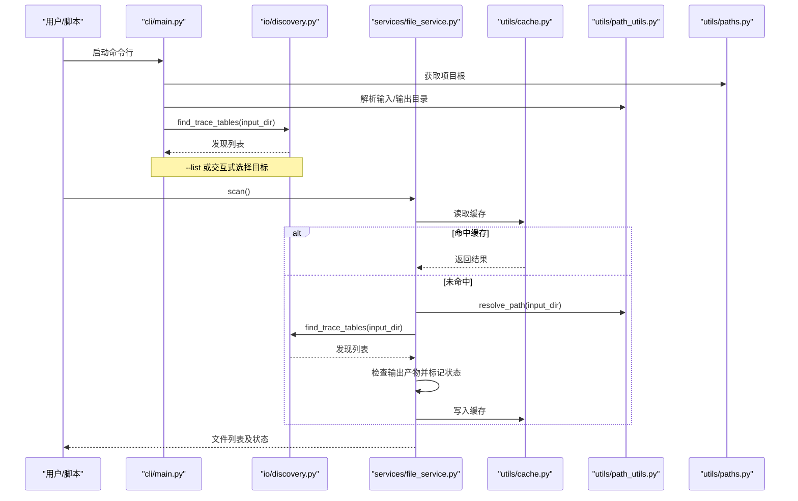
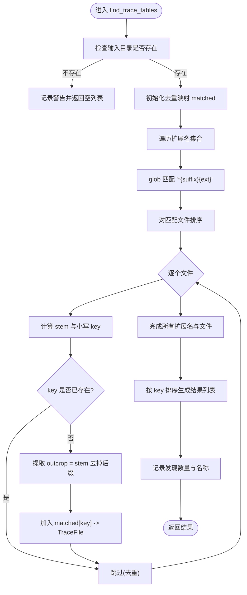
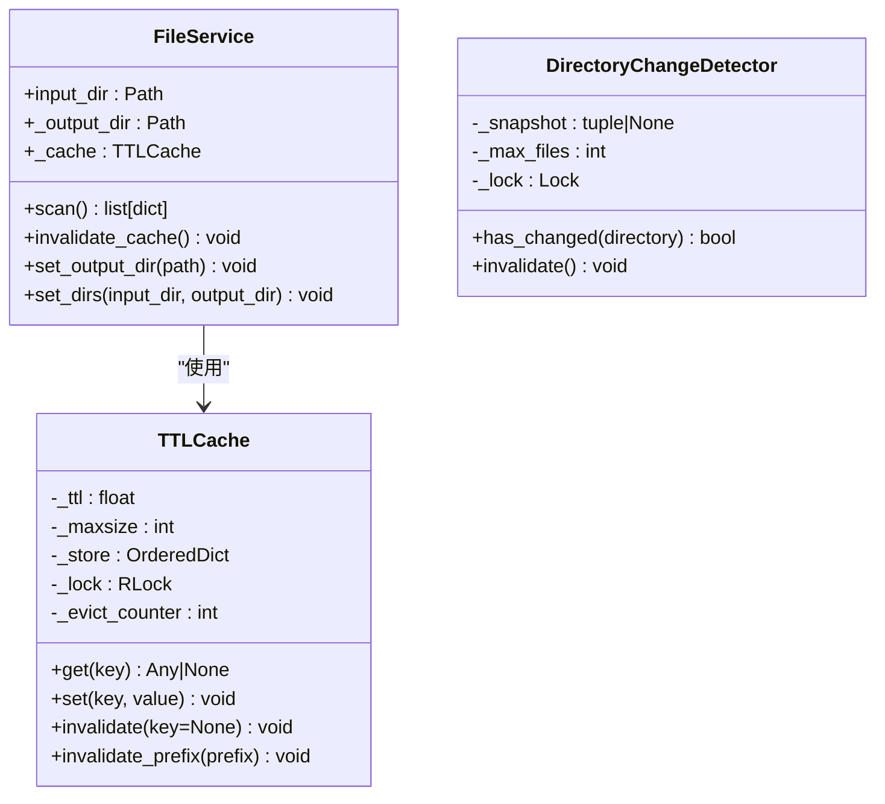
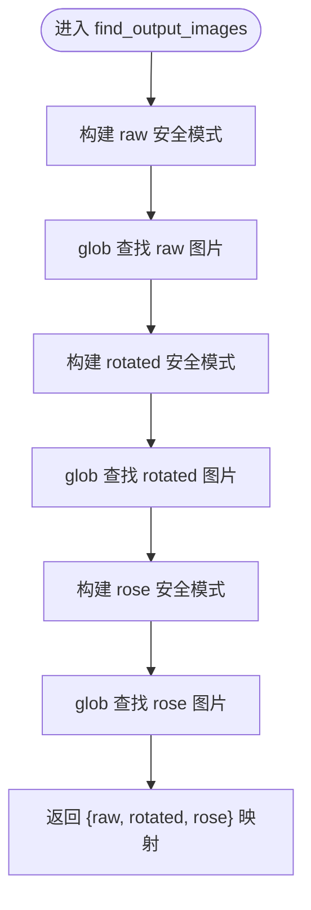
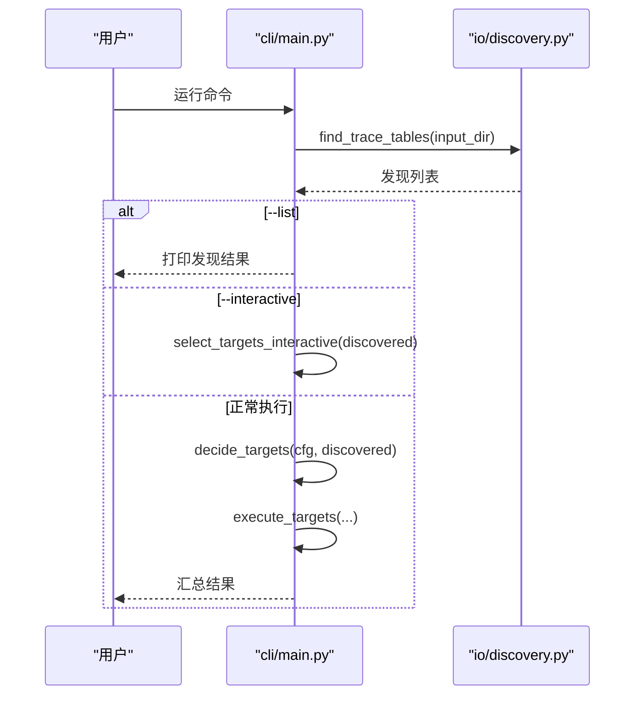
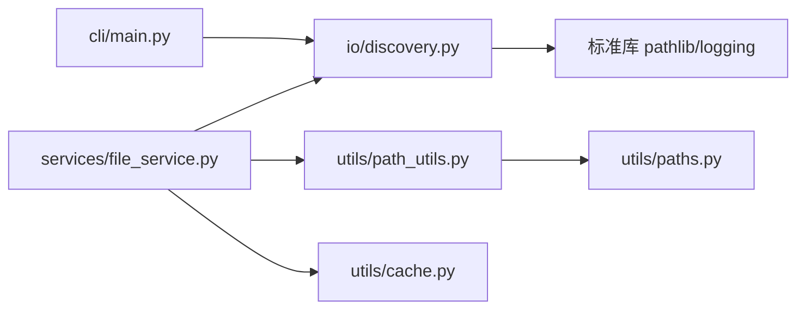

# 文件发现机制

<cite>
**本文引用的文件**   
- [trace_pipeline/io/discovery.py](file://trace_pipeline/io/discovery.py)
- [backend/services/file_service.py](file://backend/services/file_service.py)
- [backend/utils/path_utils.py](file://backend/utils/path_utils.py)
- [trace_pipeline/utils/paths.py](file://trace_pipeline/utils/paths.py)
- [backend/utils/cache.py](file://backend/utils/cache.py)
- [trace_pipeline/cli/main.py](file://trace_pipeline/cli/main.py)
- [trace_pipeline/utils/output_paths.py](file://trace_pipeline/utils/output_paths.py)
</cite>

## 目录
1. [简介](#简介)
2. [项目结构](#项目结构)
3. [核心组件](#核心组件)
4. [架构总览](#架构总览)
5. [详细组件分析](#详细组件分析)
6. [依赖关系分析](#依赖关系分析)
7. [性能考虑](#性能考虑)
8. [故障排查指南](#故障排查指南)
9. [结论](#结论)
10. [附录](#附录)

## 简介
本文件聚焦于“文件发现机制”，系统性说明 discovery 模块的自动文件查找算法、路径解析逻辑、匹配规则与通配符语法、递归搜索策略与性能优化、过滤与排序配置、大目录扫描调优与内存优化、错误处理与容错机制，以及批量文件操作的最佳实践与常见问题解决方案。文档面向不同技术背景的读者，既提供高层概览，也给出代码级细节与可视化图示。

## 项目结构
与文件发现相关的核心位置如下：
- trace_pipeline/io/discovery.py：实现输入目录扫描与迹线表文件发现的核心算法。
- backend/services/file_service.py：封装扫描服务，结合缓存对外暴露扫描接口。
- backend/utils/path_utils.py：统一路径解析与安全校验工具。
- trace_pipeline/utils/paths.py：项目根与资源根路径推断（兼容打包模式）。
- backend/utils/cache.py：TTL + LRU 缓存与目录变更检测器。
- trace_pipeline/cli/main.py：CLI 入口中调用文件发现并参与目标决策流程。
- trace_pipeline/utils/output_paths.py：输出结果图片的安全 glob 模式构建与查找。

图表来源
- [trace_pipeline/io/discovery.py:24-62](file://trace_pipeline/io/discovery.py#L24-L62)
- [backend/services/file_service.py:17-103](file://backend/services/file_service.py#L17-L103)
- [backend/utils/path_utils.py:40-56](file://backend/utils/path_utils.py#L40-L56)
- [trace_pipeline/utils/paths.py:12-24](file://trace_pipeline/utils/paths.py#L12-L24)
- [backend/utils/cache.py:18-90](file://backend/utils/cache.py#L18-L90)
- [trace_pipeline/utils/output_paths.py:21-40](file://trace_pipeline/utils/output_paths.py#L21-L40)
- [trace_pipeline/cli/main.py:28-56](file://trace_pipeline/cli/main.py#L28-L56)

章节来源
- [trace_pipeline/io/discovery.py:1-63](file://trace_pipeline/io/discovery.py#L1-L63)
- [backend/services/file_service.py:1-103](file://backend/services/file_service.py#L1-L103)
- [backend/utils/path_utils.py:1-68](file://backend/utils/path_utils.py#L1-L68)
- [trace_pipeline/utils/paths.py:1-43](file://trace_pipeline/utils/paths.py#L1-L43)
- [backend/utils/cache.py:1-155](file://backend/utils/cache.py#L1-L155)
- [trace_pipeline/cli/main.py:1-110](file://trace_pipeline/cli/main.py#L1-L110)
- [trace_pipeline/utils/output_paths.py:1-41](file://trace_pipeline/utils/output_paths.py#L1-L41)

## 核心组件
- TraceFile 命名元组：描述发现的迹线表文件，包含 stem（完整文件名）与 outcrop（露头标识，由 stem 去除后缀得到）。
- find_trace_tables(input_dir, suffix, extensions)：核心发现函数，按后缀与扩展名匹配，去重并按 outcrop 排序返回。
- FileService.scan()：对外提供的扫描接口，内置 TTL 缓存，避免重复 IO；同时根据输出产物判断任务状态。
- resolve_path(p, base)：将相对路径解析为绝对路径，默认以项目根为基准。
- get_project_root()：在开发与打包模式下均能正确推断项目根目录。
- TTLCache：线程安全的 TTL + LRU 缓存，支持批量驱逐与手动失效。
- DirectoryChangeDetector：对目录进行浅层快照对比，用于外部变更检测（可配合缓存使用）。
- find_output_images(out_dir, outcrop)：基于安全 glob 模式查找输出图片，避免特殊字符被误解释为通配符。

章节来源
- [trace_pipeline/io/discovery.py:17-62](file://trace_pipeline/io/discovery.py#L17-L62)
- [backend/services/file_service.py:17-103](file://backend/services/file_service.py#L17-L103)
- [backend/utils/path_utils.py:40-56](file://backend/utils/path_utils.py#L40-L56)
- [trace_pipeline/utils/paths.py:12-24](file://trace_pipeline/utils/paths.py#L12-L24)
- [backend/utils/cache.py:18-90](file://backend/utils/cache.py#L18-L90)
- [backend/utils/cache.py:92-155](file://backend/utils/cache.py#L92-L155)
- [trace_pipeline/utils/output_paths.py:11-40](file://trace_pipeline/utils/output_paths.py#L11-L40)

## 架构总览
下图展示了从 CLI 到发现与服务层的调用链，以及缓存与路径解析的协作方式。

图表来源
- [trace_pipeline/cli/main.py:28-56](file://trace_pipeline/cli/main.py#L28-L56)
- [trace_pipeline/io/discovery.py:24-62](file://trace_pipeline/io/discovery.py#L24-L62)
- [backend/services/file_service.py:29-89](file://backend/services/file_service.py#L29-L89)
- [backend/utils/path_utils.py:40-56](file://backend/utils/path_utils.py#L40-L56)
- [trace_pipeline/utils/paths.py:12-24](file://trace_pipeline/utils/paths.py#L12-L24)
- [backend/utils/cache.py:40-63](file://backend/utils/cache.py#L40-L63)

## 详细组件分析

### 发现算法与路径解析
- 匹配规则
  - 文件名需以指定后缀结尾（默认 "_process"），且扩展名在允许集合内（默认 ".xlsx", ".xls"）。
  - 同名文件（不同扩展名）按首次发现去重，键为小写 stem，保证大小写不敏感。
  - 结果按 outcrop 排序返回。
- 路径解析
  - 通过 resolve_path 将相对路径解析为绝对路径，默认以项目根为基准。
  - 项目根在开发与打包模式下分别推断，确保 input/output 等目录定位一致。
- 递归搜索
  - 当前实现仅扫描顶层目录，不进行递归遍历。
- 过滤与排序
  - 过滤：通过后缀与扩展名过滤。
  - 排序：按 outcrop 字典序排序。

图表来源
- [trace_pipeline/io/discovery.py:24-62](file://trace_pipeline/io/discovery.py#L24-L62)

章节来源
- [trace_pipeline/io/discovery.py:11-62](file://trace_pipeline/io/discovery.py#L11-L62)
- [backend/utils/path_utils.py:40-56](file://backend/utils/path_utils.py#L40-L56)
- [trace_pipeline/utils/paths.py:12-24](file://trace_pipeline/utils/paths.py#L12-L24)

### 服务层与缓存集成
- FileService.scan()
  - 先查 TTL 缓存，命中则直接返回。
  - 未命中时调用 find_trace_tables 进行扫描，并根据输出目录中的产物判断每个文件的处理状态（pending/completed）。
  - 将结果写入缓存，供后续请求复用。
- TTLCache
  - 线程安全，支持 TTL 过期与 LRU 裁剪。
  - 批量驱逐策略降低频繁清理开销。
- DirectoryChangeDetector
  - 维护目录浅层快照（文件名、类型、大小、修改时间），用于检测外部变更。
  - 当文件数超过阈值时会截断并记录总数作为信号，避免快照永远不变。

图表来源
- [backend/services/file_service.py:17-103](file://backend/services/file_service.py#L17-L103)
- [backend/utils/cache.py:18-90](file://backend/utils/cache.py#L18-L90)
- [backend/utils/cache.py:92-155](file://backend/utils/cache.py#L92-L155)

章节来源
- [backend/services/file_service.py:29-89](file://backend/services/file_service.py#L29-L89)
- [backend/utils/cache.py:18-90](file://backend/utils/cache.py#L18-L90)
- [backend/utils/cache.py:92-155](file://backend/utils/cache.py#L92-L155)

### 输出结果图片查找与安全通配符
- find_output_images(out_dir, outcrop)
  - 使用 _safe_glob_pattern 构建安全 glob 模式，转义字面特殊字符但保留通配符，避免括号等字符被误解释。
  - 查找 raw、rotated、rose 三类图片，返回字典映射。
- 与 FileService 的状态判定联动
  - FileService 通过检查输出目录中特定模式的文件是否存在，来判定任务状态。

图表来源
- [trace_pipeline/utils/output_paths.py:11-40](file://trace_pipeline/utils/output_paths.py#L11-L40)
- [backend/services/file_service.py:51-56](file://backend/services/file_service.py#L51-L56)

章节来源
- [trace_pipeline/utils/output_paths.py:11-40](file://trace_pipeline/utils/output_paths.py#L11-L40)
- [backend/services/file_service.py:51-56](file://backend/services/file_service.py#L51-L56)

### CLI 集成与交互流程
- main()
  - 加载配置、解析路径后调用 find_trace_tables 进行发现。
  - 支持 --list 列出发现结果，--interactive 交互式选择目标，--dry-run 试运行。
  - 最终交由执行器处理目标集合并汇总结果。

图表来源
- [trace_pipeline/cli/main.py:28-56](file://trace_pipeline/cli/main.py#L28-L56)
- [trace_pipeline/cli/main.py:58-92](file://trace_pipeline/cli/main.py#L58-L92)
- [trace_pipeline/cli/main.py:94-110](file://trace_pipeline/cli/main.py#L94-L110)
- [trace_pipeline/io/discovery.py:24-62](file://trace_pipeline/io/discovery.py#L24-L62)

章节来源
- [trace_pipeline/cli/main.py:28-110](file://trace_pipeline/cli/main.py#L28-L110)
- [trace_pipeline/io/discovery.py:24-62](file://trace_pipeline/io/discovery.py#L24-L62)

## 依赖关系分析
- discovery 模块无外部依赖，仅使用标准库 pathlib 与 logging。
- FileService 依赖 discovery、path_utils、cache。
- path_utils 依赖 paths 以获取项目根。
- CLI 依赖 discovery 与配置/调度模块。

图表来源
- [trace_pipeline/io/discovery.py:1-10](file://trace_pipeline/io/discovery.py#L1-L10)
- [backend/services/file_service.py:1-15](file://backend/services/file_service.py#L1-L15)
- [backend/utils/path_utils.py:1-15](file://backend/utils/path_utils.py#L1-L15)
- [trace_pipeline/utils/paths.py:1-10](file://trace_pipeline/utils/paths.py#L1-L10)
- [trace_pipeline/cli/main.py:1-20](file://trace_pipeline/cli/main.py#L1-L20)

章节来源
- [trace_pipeline/io/discovery.py:1-10](file://trace_pipeline/io/discovery.py#L1-L10)
- [backend/services/file_service.py:1-15](file://backend/services/file_service.py#L1-L15)
- [backend/utils/path_utils.py:1-15](file://backend/utils/path_utils.py#L1-L15)
- [trace_pipeline/utils/paths.py:1-10](file://trace_pipeline/utils/paths.py#L1-L10)
- [trace_pipeline/cli/main.py:1-20](file://trace_pipeline/cli/main.py#L1-L20)

## 性能考虑
- 扫描范围
  - 当前仅扫描顶层目录，避免深层递归带来的 I/O 压力。
- 去重与排序
  - 去重基于小写 stem，减少重复处理；排序稳定，便于 UI 展示与批处理顺序可控。
- 缓存策略
  - TTLCache 提供 TTL 与 LRU 双重保护，批量驱逐降低锁竞争与 GC 压力。
  - 建议根据目录更新频率调整 TTL（例如 30s 适合高频变更场景）。
- 目录变更检测
  - DirectoryChangeDetector 采用浅层快照，限制最大文件数以控制内存占用；超出阈值时记录总数作为变更信号。
- 输出图片查找
  - 使用安全 glob 模式，避免额外解析开销与误匹配。

优化建议
- 对于超大目录（数十万文件）：
  - 增大 TTL 以减少重复扫描。
  - 合理设置 DirectoryChangeDetector.max_files，避免快照过大。
  - 必要时引入增量扫描策略（如基于 mtime 的增量比对）。
- 并发访问：
  - TTLCache 已线程安全，注意在高并发下合理设置 maxsize 防止内存膨胀。
- I/O 热点：
  - 若发现阶段成为瓶颈，可考虑异步化或分片扫描（需评估一致性要求）。

章节来源
- [backend/utils/cache.py:18-90](file://backend/utils/cache.py#L18-L90)
- [backend/utils/cache.py:92-155](file://backend/utils/cache.py#L92-L155)
- [trace_pipeline/utils/output_paths.py:11-40](file://trace_pipeline/utils/output_paths.py#L11-L40)

## 故障排查指南
- 输入目录不存在
  - 现象：返回空列表并记录警告日志。
  - 处理：确认路径是否正确、权限是否足够。
- 未发现匹配文件
  - 现象：记录警告日志，提示后缀与扩展名。
  - 处理：检查文件名是否符合 "{outcrop}_process.{xlsx|xls}" 约定。
- 权限问题
  - 现象：OSError/PermissionError。
  - 处理：提升权限或修正目录读写权限；在服务层捕获并返回统一错误格式。
- 损坏文件或异常统计
  - 现象：stat 失败或 zip 损坏。
  - 处理：DirectoryChangeDetector 对 stat 失败做容错；zip 相关操作捕获 BadZipFile。
- 路径遍历风险
  - 防护：validate_outcrop_name 禁止非法字符，防止路径逃逸。
- 缓存不一致
  - 现象：扫描结果未及时反映外部变更。
  - 处理：调用 invalidate_cache 或等待 TTL 过期；必要时使用 DirectoryChangeDetector.has_changed 触发刷新。

章节来源
- [trace_pipeline/io/discovery.py:39-62](file://trace_pipeline/io/discovery.py#L39-L62)
- [backend/utils/path_utils.py:20-37](file://backend/utils/path_utils.py#L20-37)
- [backend/utils/cache.py:112-149](file://backend/utils/cache.py#L112-L149)

## 结论
该文件发现机制以简洁可靠的匹配规则为核心，结合缓存与目录变更检测，在保证正确性的前提下兼顾性能与可扩展性。通过安全通配符与路径解析工具，系统在跨平台与打包环境下具备良好稳定性。针对大规模目录与高并发场景，提供了多项优化手段与容错策略，便于在生产环境中稳健运行。

## 附录
- 最佳实践
  - 保持输入文件命名规范，确保后缀与扩展名符合约定。
  - 合理设置 TTL 与 maxsize，平衡新鲜度与内存占用。
  - 在批量操作中优先使用 FileService.scan 的缓存能力，减少重复扫描。
  - 对输出图片的查找使用 find_output_images，避免通配符误匹配。
- 常见问题
  - 为什么没有发现任何文件？检查目录是否存在、权限是否足够、文件名是否符合约定。
  - 为什么缓存未更新？确认是否调用 invalidate_cache 或等待 TTL 过期。
  - 为什么状态始终 pending？检查输出目录中对应产物是否生成。