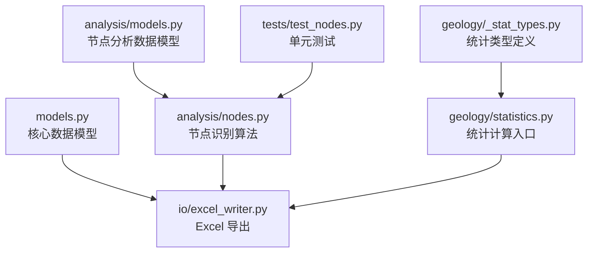
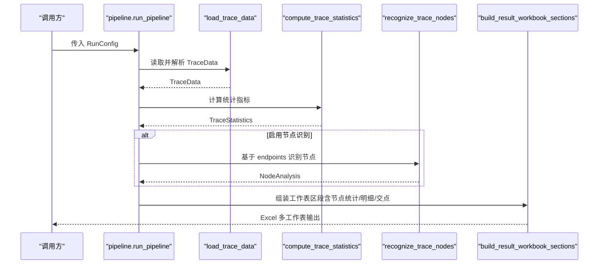
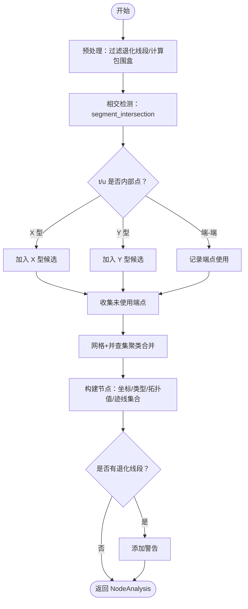
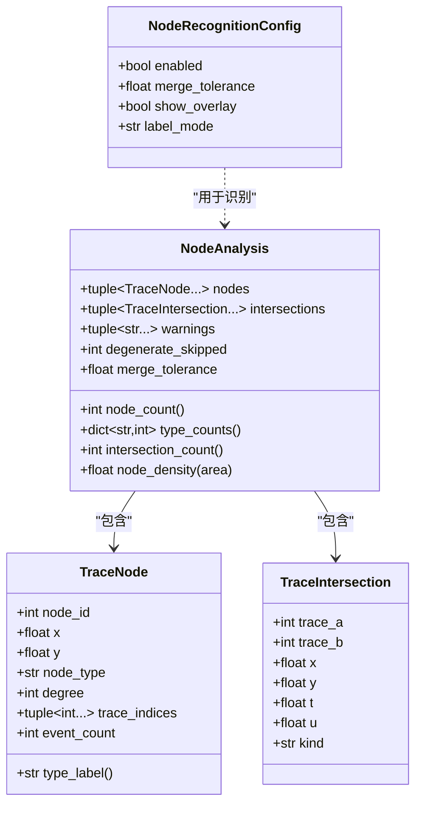
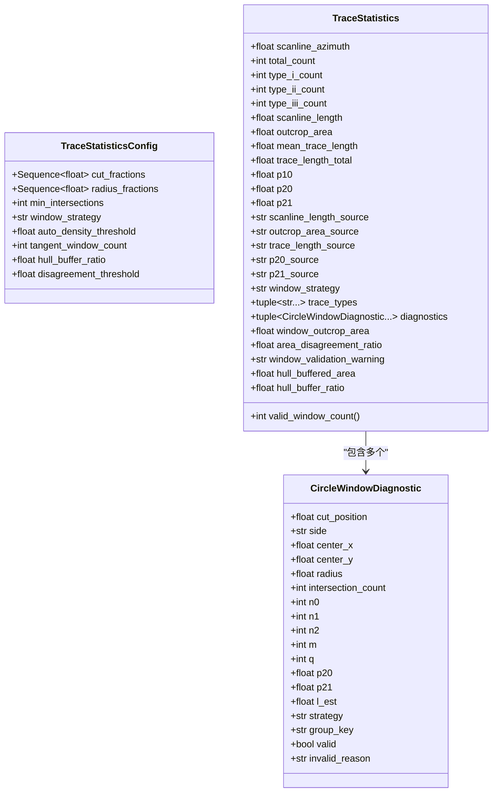
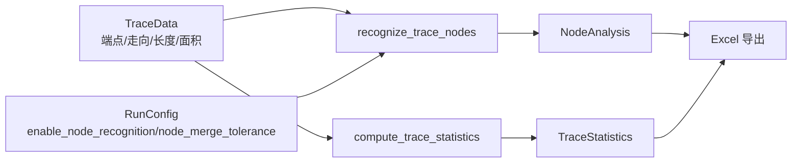
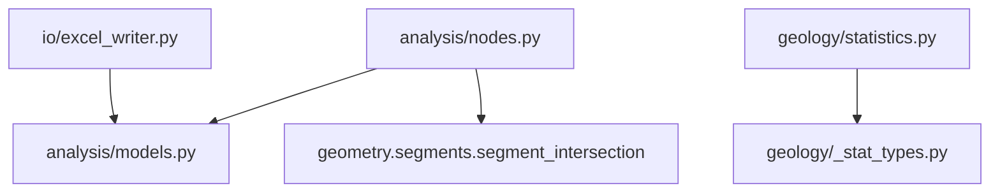

# 分析结果模型

<cite>
**本文引用的文件**
- [trace_pipeline/analysis/models.py](file://trace_pipeline/analysis/models.py)
- [trace_pipeline/analysis/nodes.py](file://trace_pipeline/analysis/nodes.py)
- [trace_pipeline/geology/_stat_types.py](file://trace_pipeline/geology/_stat_types.py)
- [trace_pipeline/geology/statistics.py](file://trace_pipeline/geology/statistics.py)
- [trace_pipeline/models.py](file://trace_pipeline/models.py)
- [trace_pipeline/io/excel_writer.py](file://trace_pipeline/io/excel_writer.py)
- [tests/test_nodes.py](file://tests/test_nodes.py)
</cite>

## 目录
1. [简介](#简介)
2. [项目结构](#项目结构)
3. [核心组件](#核心组件)
4. [架构总览](#架构总览)
5. [详细组件分析](#详细组件分析)
6. [依赖关系分析](#依赖关系分析)
7. [性能与复杂度](#性能与复杂度)
8. [序列化与反序列化](#序列化与反序列化)
9. [使用示例](#使用示例)
10. [故障排查](#故障排查)
11. [结论](#结论)

## 简介
本文件聚焦于“节点分析结果模型”的完整说明，覆盖以下方面：
- 数据结构定义：节点、相交事件、分析汇总等
- 节点类型识别标准（I/Y/X）与拓扑值计算
- 统计分析指标与诊断信息
- 算法流程与关键参数
- 与核心数据模型的关联关系
- 序列化和导出方法
- 常见问题的定位与修复建议

## 项目结构
与“分析结果模型”直接相关的代码主要分布在如下模块：
- analysis/models.py：节点分析结果的数据类定义
- analysis/nodes.py：节点识别主算法与分类逻辑
- geology/_stat_types.py：统计相关数据类型定义
- geology/statistics.py：统计指标计算入口
- models.py：核心数据模型（TraceData、RunConfig、RunResult）
- io/excel_writer.py：将分析结果写入 Excel 的工作表组织
- tests/test_nodes.py：节点识别用例与断言

图表来源
- [trace_pipeline/analysis/models.py:1-98](file://trace_pipeline/analysis/models.py#L1-L98)
- [trace_pipeline/analysis/nodes.py:1-417](file://trace_pipeline/analysis/nodes.py#L1-L417)
- [trace_pipeline/geology/_stat_types.py:1-125](file://trace_pipeline/geology/_stat_types.py#L1-L125)
- [trace_pipeline/geology/statistics.py:1-391](file://trace_pipeline/geology/statistics.py#L1-L391)
- [trace_pipeline/models.py:1-352](file://trace_pipeline/models.py#L1-L352)
- [trace_pipeline/io/excel_writer.py:280-395](file://trace_pipeline/io/excel_writer.py#L280-L395)
- [tests/test_nodes.py:1-149](file://tests/test_nodes.py#L1-L149)

章节来源
- [trace_pipeline/analysis/models.py:1-98](file://trace_pipeline/analysis/models.py#L1-L98)
- [trace_pipeline/analysis/nodes.py:1-417](file://trace_pipeline/analysis/nodes.py#L1-L417)
- [trace_pipeline/geology/_stat_types.py:1-125](file://trace_pipeline/geology/_stat_types.py#L1-L125)
- [trace_pipeline/geology/statistics.py:1-391](file://trace_pipeline/geology/statistics.py#L1-L391)
- [trace_pipeline/models.py:1-352](file://trace_pipeline/models.py#L1-L352)
- [trace_pipeline/io/excel_writer.py:280-395](file://trace_pipeline/io/excel_writer.py#L280-L395)
- [tests/test_nodes.py:1-149](file://tests/test_nodes.py#L1-L149)

## 核心组件
本节概述与分析结果模型直接相关的数据结构与职责。

- 节点识别配置 NodeRecognitionConfig
  - 作用：控制是否启用节点识别、合并容差、叠加显示与标签模式
  - 关键字段：enabled、merge_tolerance、show_overlay、label_mode
  - 约束：merge_tolerance > 0；label_mode ∈ {none, type, id}

- 单个节点 TraceNode
  - 字段：node_id、x、y、node_type（I/Y/X）、degree（拓扑值）、trace_indices（连接迹线索引元组）、event_count（参与事件数）
  - 属性：type_label（中文类型名）

- 相交事件 TraceIntersection
  - 字段：trace_a、trace_b、x、y、t、u、kind（internal/endpoint/overlap）

- 分析汇总 NodeAnalysis
  - 字段：nodes、intersections、warnings、degenerate_skipped、merge_tolerance
  - 属性：node_count、intersection_count、type_counts、node_density(area)

- 统计类型 TraceStatisticsConfig / CircleWindowDiagnostic / TraceStatistics
  - 作用：描述圆形取样窗策略、诊断信息与最终统计指标（P10/P20/P21、面积来源、窗口策略等）

- 核心数据模型 TraceData / RunConfig / RunResult
  - TraceData：包含端点坐标、走向、长度、测线位置、实测面积等
  - RunConfig：流水线运行参数（含节点识别开关与容差）
  - RunResult：运行结果摘要（含节点计数与交点计数）

章节来源
- [trace_pipeline/analysis/models.py:22-98](file://trace_pipeline/analysis/models.py#L22-L98)
- [trace_pipeline/geology/_stat_types.py:14-125](file://trace_pipeline/geology/_stat_types.py#L14-L125)
- [trace_pipeline/models.py:41-157](file://trace_pipeline/models.py#L41-L157)
- [trace_pipeline/models.py:162-233](file://trace_pipeline/models.py#L162-L233)
- [trace_pipeline/models.py:278-352](file://trace_pipeline/models.py#L278-L352)

## 架构总览
下图展示了从输入到分析结果的端到端数据流，以及节点分析与统计计算的协作关系。

图表来源
- [trace_pipeline/pipeline.py:1-200](file://trace_pipeline/pipeline.py#L1-L200)
- [trace_pipeline/geology/statistics.py:212-391](file://trace_pipeline/geology/statistics.py#L212-L391)
- [trace_pipeline/analysis/nodes.py:160-417](file://trace_pipeline/analysis/nodes.py#L160-L417)
- [trace_pipeline/io/excel_writer.py:280-395](file://trace_pipeline/io/excel_writer.py#L280-L395)

## 详细组件分析

### 节点识别算法与分类标准
- 输入：endpoints (N, 4)，列序 [x1, y1, x2, y2]；NodeRecognitionConfig
- 预处理：
  - 退化线段过滤（长度 < merge_tolerance）
  - AABB 包围盒快速筛选候选对
- 相交检测：
  - 调用 segment_intersection 获取 t/u 与交点坐标
  - 根据 t/u 是否为内部点区分 X/Y/端-端接触
- 端点接近检测：
  - 网格分桶 + 并查集聚类未使用端点
- 聚类合并：
  - 空间网格 + 并查集合并候选点为簇
- 节点生成：
  - 按簇中心坐标、参与迹线集合、拓扑值与类型构造 TraceNode
- 分类规则（I/Y/X）：
  - X 型：至少两条迹线的内部点参与
  - Y 型：仅一条迹线内部点参与，或拓扑值 ≥ 3
  - I 型：其余情况（孤立端点）
- 拓扑值 degree 计算：
  - 每条迹线贡献：若内部通过则 +2；否则根据端点参与数量贡献 1 或 2

图表来源
- [trace_pipeline/analysis/nodes.py:160-417](file://trace_pipeline/analysis/nodes.py#L160-L417)

章节来源
- [trace_pipeline/analysis/nodes.py:1-417](file://trace_pipeline/analysis/nodes.py#L1-L417)

### 节点数据模型

图表来源
- [trace_pipeline/analysis/models.py:22-98](file://trace_pipeline/analysis/models.py#L22-L98)

章节来源
- [trace_pipeline/analysis/models.py:22-98](file://trace_pipeline/analysis/models.py#L22-L98)

### 统计结果模型与指标
- TraceStatisticsConfig：控制圆窗策略、半径分数、切圆数量、缓冲比例、不一致阈值等
- CircleWindowDiagnostic：单窗口的计数与有效性诊断（n0/n1/n2/m/q/p20/p21/l_est 等）
- TraceStatistics：综合统计结果（P10/P20/P21、面积来源、窗口策略、诊断列表等）

图表来源
- [trace_pipeline/geology/_stat_types.py:14-125](file://trace_pipeline/geology/_stat_types.py#L14-L125)

章节来源
- [trace_pipeline/geology/_stat_types.py:14-125](file://trace_pipeline/geology/_stat_types.py#L14-L125)
- [trace_pipeline/geology/statistics.py:212-391](file://trace_pipeline/geology/statistics.py#L212-L391)

### 与核心数据模型的关联
- TraceData 提供端点坐标、走向、长度、测线位置与可选的实测面积，作为节点识别与统计计算的输入
- RunConfig 控制节点识别开关与容差，影响 recognize_trace_nodes 的行为
- RunResult 汇总节点计数与交点计数，便于上层服务展示

图表来源
- [trace_pipeline/models.py:41-157](file://trace_pipeline/models.py#L41-L157)
- [trace_pipeline/models.py:162-233](file://trace_pipeline/models.py#L162-L233)
- [trace_pipeline/analysis/nodes.py:160-417](file://trace_pipeline/analysis/nodes.py#L160-L417)
- [trace_pipeline/geology/statistics.py:212-391](file://trace_pipeline/geology/statistics.py#L212-L391)
- [trace_pipeline/io/excel_writer.py:280-395](file://trace_pipeline/io/excel_writer.py#L280-L395)

章节来源
- [trace_pipeline/models.py:41-157](file://trace_pipeline/models.py#L41-L157)
- [trace_pipeline/models.py:162-233](file://trace_pipeline/models.py#L162-L233)
- [trace_pipeline/analysis/nodes.py:160-417](file://trace_pipeline/analysis/nodes.py#L160-L417)
- [trace_pipeline/geology/statistics.py:212-391](file://trace_pipeline/geology/statistics.py#L212-L391)
- [trace_pipeline/io/excel_writer.py:280-395](file://trace_pipeline/io/excel_writer.py#L280-L395)

## 依赖关系分析
- analysis/nodes.py 依赖 geometry.segments.segment_intersection 进行精确相交检测
- analysis/models.py 被 nodes.py 与 excel_writer.py 引用
- geology/statistics.py 依赖 _stat_types.py 中的类型定义
- io/excel_writer.py 将 NodeAnalysis 与 TraceStatistics 转换为 Excel 工作表区段

图表来源
- [trace_pipeline/analysis/nodes.py:1-417](file://trace_pipeline/analysis/nodes.py#L1-L417)
- [trace_pipeline/analysis/models.py:1-98](file://trace_pipeline/analysis/models.py#L1-L98)
- [trace_pipeline/geology/statistics.py:1-391](file://trace_pipeline/geology/statistics.py#L1-L391)
- [trace_pipeline/geology/_stat_types.py:1-125](file://trace_pipeline/geology/_stat_types.py#L1-L125)
- [trace_pipeline/io/excel_writer.py:280-395](file://trace_pipeline/io/excel_writer.py#L280-L395)

章节来源
- [trace_pipeline/analysis/nodes.py:1-417](file://trace_pipeline/analysis/nodes.py#L1-L417)
- [trace_pipeline/analysis/models.py:1-98](file://trace_pipeline/analysis/models.py#L1-L98)
- [trace_pipeline/geology/statistics.py:1-391](file://trace_pipeline/geology/statistics.py#L1-L391)
- [trace_pipeline/geology/_stat_types.py:1-125](file://trace_pipeline/geology/_stat_types.py#L1-L125)
- [trace_pipeline/io/excel_writer.py:280-395](file://trace_pipeline/io/excel_writer.py#L280-L395)

## 性能与复杂度
- 包围盒筛选：向量化布尔掩码减少候选对数量
- 网格分桶 + 并查集：近似 O(N) 的聚类合并，避免全对比较
- 退化线段过滤：提前剔除无效线段，降低后续计算量
- 内存友好：不可变 dataclass 与只读 numpy 数组，减少拷贝与副作用

[本节为通用性能讨论，不直接分析具体文件]

## 序列化与反序列化
- 结构化导出（Excel）
  - 通过 build_result_workbook_sections 将 NodeAnalysis 与 TraceStatistics 转为 DataFrame 区段，分别写入“节点统计”“节点明细”“节点交点”等工作表
  - 节点明细包含：节点ID、X、Y、类型、拓扑值、连接迹线、事件数
  - 节点交点包含：迹线A/B、交点坐标、参数 t/u、事件类型
- 运行时聚合（RunResult）
  - RunResult.success 可携带 node_count、node_i/y/x_count、intersection_count 等汇总字段，供上层服务展示
- 自定义序列化建议
  - 可将 NodeAnalysis.nodes 与 NodeAnalysis.intersections 序列化为 JSON 列表（保留基本类型），并在消费端重建 dataclass 实例
  - 注意保持 merge_tolerance、warnings、degenerate_skipped 等元信息一致性

章节来源
- [trace_pipeline/io/excel_writer.py:280-395](file://trace_pipeline/io/excel_writer.py#L280-L395)
- [trace_pipeline/models.py:302-352](file://trace_pipeline/models.py#L302-L352)

## 使用示例
- 基础用法（单元测试）
  - 构造 NodeRecognitionConfig（开启识别、设置 merge_tolerance）
  - 调用 recognize_trace_nodes(endpoints, config) 得到 NodeAnalysis
  - 断言 node_count、intersection_count、type_counts 与密度计算
- 在流水线中集成
  - pipeline.run_pipeline 根据 RunConfig 决定是否执行节点识别
  - 将 NodeAnalysis 与 TraceStatistics 一并传入 Excel 导出函数，生成多工作表报告

章节来源
- [tests/test_nodes.py:1-149](file://tests/test_nodes.py#L1-L149)
- [trace_pipeline/pipeline.py:1-200](file://trace_pipeline/pipeline.py#L1-L200)
- [trace_pipeline/io/excel_writer.py:280-395](file://trace_pipeline/io/excel_writer.py#L280-L395)

## 故障排查
- 无节点或无交点
  - 检查 config.enabled 是否为 True
  - 检查 merge_tolerance 是否过小导致无法合并邻近端点
  - 确认输入 endpoints 非空且有效
- 大量退化线段
  - 查看 NodeAnalysis.warnings 与 degenerate_skipped
  - 适当增大 merge_tolerance 或清理输入数据
- 坐标过大警告
  - 当坐标绝对值极大时可能触发网格索引溢出警告，需归一化或缩放坐标
- 统计不一致告警
  - 关注 TraceStatistics.window_validation_warning 与 area_disagreement_ratio，必要时调整窗口策略或缓冲比例

章节来源
- [trace_pipeline/analysis/nodes.py:160-417](file://trace_pipeline/analysis/nodes.py#L160-L417)
- [trace_pipeline/geology/statistics.py:212-391](file://trace_pipeline/geology/statistics.py#L212-L391)

## 结论
本模型以不可变数据类为核心，清晰分离了“节点识别”和“统计计算”两大模块，并通过统一的导出接口将结果结构化输出。I/Y/X 分类与拓扑值计算遵循几何接触关系与参数区间判定，结合网格聚类与并查集实现高效稳健的节点发现。配合 TraceStatistics 的诊断信息，可为后续地质解释与可视化提供可靠依据。