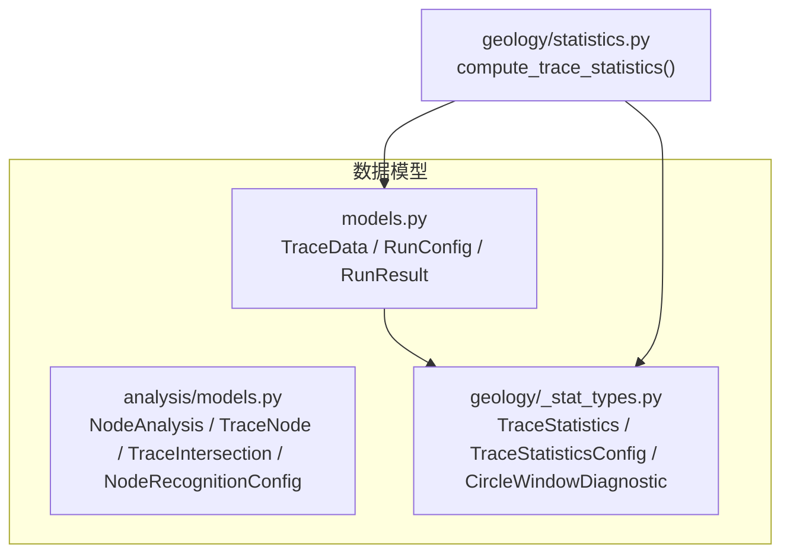
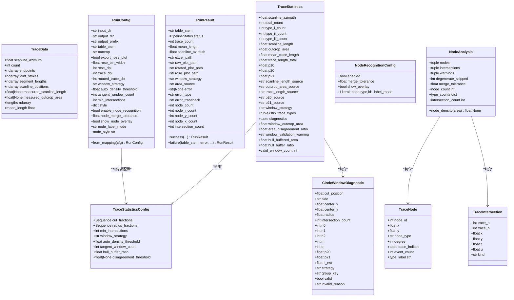
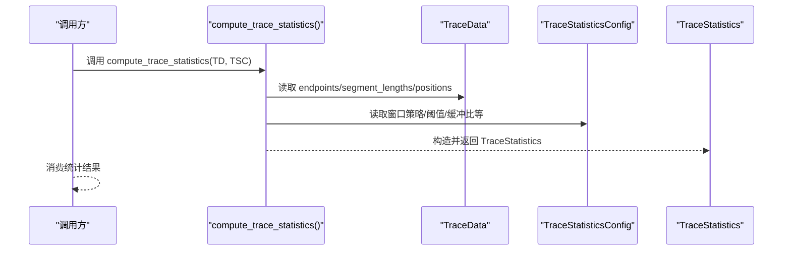

# 数据模型参考

<cite>
**本文引用的文件**   
- [trace_pipeline/models.py](file://trace_pipeline/models.py)
- [trace_pipeline/analysis/models.py](file://trace_pipeline/analysis/models.py)
- [trace_pipeline/geology/_stat_types.py](file://trace_pipeline/geology/_stat_types.py)
- [trace_pipeline/geology/statistics.py](file://trace_pipeline/geology/statistics.py)
</cite>

## 目录
1. [简介](#简介)
2. [项目结构（与数据模型相关）](#项目结构与数据模型相关)
3. [核心数据类总览](#核心数据类总览)
4. [架构概览（数据模型视角）](#架构概览数据模型视角)
5. [详细组件分析](#详细组件分析)
6. [依赖关系分析](#依赖关系分析)
7. [性能与不可变性设计要点](#性能与不可变性设计要点)
8. [序列化与反序列化指南](#序列化与反序列化指南)
9. [常见问题与排错](#常见问题与排错)
10. [结论](#结论)

## 简介
本参考文档聚焦于 TracePipeline 的核心数据模型，覆盖以下关键类：
- TraceData：单张迹线表的完整解析结果（不可变容器）
- RunConfig：单次流水线运行参数（不可变）
- RunResult：单次流水线运行结果（不可变）
- TraceStatistics：统计结果（不可变）
- NodeAnalysis、TraceNode、TraceIntersection、NodeRecognitionConfig：节点分析结果与配置（不可变）

文档将说明每个类的字段约束、业务含义、计算属性、构造方式、验证规则，并提供类关系图与序列流程示意。

## 项目结构（与数据模型相关）
与数据模型直接相关的模块分布如下：
- trace_pipeline/models.py：TraceData、RunConfig、RunResult 定义
- trace_pipeline/analysis/models.py：NodeAnalysis、TraceNode、TraceIntersection、NodeRecognitionConfig 定义
- trace_pipeline/geology/_stat_types.py：TraceStatistics、TraceStatisticsConfig、CircleWindowDiagnostic 定义
- trace_pipeline/geology/statistics.py：统计计算主入口 compute_trace_statistics，使用上述类型

图表来源
- [trace_pipeline/models.py:1-352](file://trace_pipeline/models.py#L1-L352)
- [trace_pipeline/analysis/models.py:1-98](file://trace_pipeline/analysis/models.py#L1-L98)
- [trace_pipeline/geology/_stat_types.py:1-125](file://trace_pipeline/geology/_stat_types.py#L1-L125)
- [trace_pipeline/geology/statistics.py:1-391](file://trace_pipeline/geology/statistics.py#L1-L391)

章节来源
- [trace_pipeline/models.py:1-352](file://trace_pipeline/models.py#L1-L352)
- [trace_pipeline/analysis/models.py:1-98](file://trace_pipeline/analysis/models.py#L1-L98)
- [trace_pipeline/geology/_stat_types.py:1-125](file://trace_pipeline/geology/_stat_types.py#L1-L125)
- [trace_pipeline/geology/statistics.py:1-391](file://trace_pipeline/geology/statistics.py#L1-L391)

## 核心数据类总览
- TraceData：承载原始测线与端点坐标、走向、长度等基础几何信息；提供 lengths、mean_length 等派生属性；所有数值数组在构造后标记为只读。
- RunConfig：封装一次运行的全部配置项，包含路径、输出样式、圆窗策略、节点识别开关等；支持 from_mapping 工厂方法从字典构建并执行字段级校验。
- RunResult：记录一次流水线的成功或失败状态及产物路径、统计摘要与错误信息；提供 success/failure 便捷构造器。
- TraceStatistics：统计结果，包含 P10/P20/P21、面积来源、平均迹长、诊断信息等；valid_window_count 为计算属性。
- NodeAnalysis：节点分析结果，包含节点列表、相交事件、告警、退化跳过计数、合并容差等；提供 node_count、type_counts、intersection_count、node_density 等计算属性与方法。
- TraceNode、TraceIntersection、NodeRecognitionConfig：节点拓扑的原子描述与识别配置。

章节来源
- [trace_pipeline/models.py:1-352](file://trace_pipeline/models.py#L1-L352)
- [trace_pipeline/analysis/models.py:1-98](file://trace_pipeline/analysis/models.py#L1-L98)
- [trace_pipeline/geology/_stat_types.py:1-125](file://trace_pipeline/geology/_stat_types.py#L1-L125)

## 架构概览（数据模型视角）
下图展示数据模型之间的静态关系与主要依赖方向：

图表来源
- [trace_pipeline/models.py:1-352](file://trace_pipeline/models.py#L1-L352)
- [trace_pipeline/analysis/models.py:1-98](file://trace_pipeline/analysis/models.py#L1-L98)
- [trace_pipeline/geology/_stat_types.py:1-125](file://trace_pipeline/geology/_stat_types.py#L1-L125)

## 详细组件分析

### TraceData（迹线数据容器）
- 不可变性：dataclass(frozen=True)，并在 __post_init__ 中将内部 NumPy 数组 flags.writeable=False，防止外部修改。
- 字段与约束
  - scanline_azimuth：有限浮点数
  - count：非负整数
  - endpoints：形状 (count, 4)，元素均为有限值
  - joint_strikes、segment_lengths、scanline_positions：长度为 count 的一维数组，元素均为有限值
  - measured_scanline_length、measured_outcrop_area：可选的正有限浮点数或 None
- 计算属性
  - lengths：基于端点欧氏距离计算的二维长度数组，首次访问后缓存，返回只读视图
  - mean_length：基于 lengths 的平均值，空集时返回 0.0
- 构造与校验
  - 通过 dataclass 默认构造；__post_init__ 完成类型转换、形状与范围校验、写保护设置
- 典型用途
  - 作为统计与绘图的基础输入；被 compute_trace_statistics 消费

章节来源
- [trace_pipeline/models.py:41-157](file://trace_pipeline/models.py#L41-L157)

### RunConfig（运行配置）
- 不可变性：frozen dataclass；__post_init__ 对字符串字段进行 strip 清理，并对标量字段执行统一类型强制与范围校验。
- 关键字段
  - 路径与命名：input_dir、output_dir、output_prefix、table_stem、outcrop（均不能为空）
  - 绘图与导出：export_rose_plot、rose_bin_width、rose_dpi、trace_dpi、rotated_trace_dpi
  - 圆窗策略：window_strategy、auto_density_threshold、tangent_window_count、min_intersections
  - 节点识别：enable_node_recognition、node_merge_tolerance（必须 > 0）、show_node_overlay、node_label_mode
  - 样式覆盖：style（dict），可通过 node_style 计算属性读取
- 工厂方法
  - from_mapping(cfg)：从映射中抽取已知键，缺失可选字段回退默认值；若 style 中存在 node_label_mode 且未显式传入，则自动提升
- 计算属性
  - node_style：从 style 字典读取节点样式预设，缺省为 "default"

章节来源
- [trace_pipeline/models.py:162-273](file://trace_pipeline/models.py#L162-L273)

### RunResult（处理结果）
- 不可变性：frozen dataclass；status 使用 PipelineStatus 枚举。
- 关键字段
  - 标识与状态：table_stem、status、error、error_type、error_traceback
  - 统计摘要：trace_count、mean_length、scanline_azimuth、window_strategy、area_source
  - 产物路径：excel_path、raw_plot_path、rotated_plot_path、rose_plot_path
  - 节点统计：node_count、node_i_count、node_y_count、node_x_count、intersection_count
- 便捷构造
  - success(...)：生成成功结果，填充统计与产物路径
  - failure(table_stem, error, ...): 生成失败结果，携带错误信息

章节来源
- [trace_pipeline/models.py:278-352](file://trace_pipeline/models.py#L278-L352)

### TraceStatistics（统计结果）
- 不可变性：frozen dataclass；包含丰富的来源标注字段（如 outcrop_area_source、p20_source、p21_source、trace_length_source）。
- 关键字段
  - 基础统计：total_count、type_i_count、type_ii_count、type_iii_count
  - 几何与密度：scanline_length、outcrop_area、mean_trace_length、trace_length_total、p10、p20、p21
  - 来源与策略：scanline_length_source、outcrop_area_source、trace_length_source、p20_source、p21_source、window_strategy
  - 诊断：trace_types、diagnostics、window_outcrop_area、area_disagreement_ratio、window_validation_warning、hull_buffered_area、hull_buffer_ratio
- 计算属性
  - valid_window_count：有效圆窗数量

章节来源
- [trace_pipeline/geology/_stat_types.py:91-125](file://trace_pipeline/geology/_stat_types.py#L91-L125)

### TraceStatisticsConfig（统计配置）
- 不可变性：frozen dataclass；__post_init__ 严格校验 cut_fractions、radius_fractions、min_intersections、window_strategy、auto_density_threshold、tangent_window_count、hull_buffer_ratio、disagreement_threshold 等。
- 关键字段
  - cut_fractions：(0,1) 区间内的正数序列
  - radius_fractions：正数序列
  - min_intersections：正整数
  - window_strategy：{"auto","tangent","hybrid","concentric"}
  - auto_density_threshold：正数
  - tangent_window_count：正整数
  - hull_buffer_ratio：非负数
  - disagreement_threshold：正数或 None

章节来源
- [trace_pipeline/geology/_stat_types.py:14-65](file://trace_pipeline/geology/_stat_types.py#L14-L65)

### CircleWindowDiagnostic（圆窗诊断）
- 不可变性：frozen dataclass；记录单个圆窗的几何位置、计数、有效性、估计指标等。
- 关键字段
  - 几何：cut_position、side、center_x、center_y、radius
  - 计数：intersection_count、n0、n1、n2、m、q
  - 估计：p20、p21、l_est
  - 元信息：strategy、group_key、valid、invalid_reason

章节来源
- [trace_pipeline/geology/_stat_types.py:67-89](file://trace_pipeline/geology/_stat_types.py#L67-L89)

### NodeRecognitionConfig（节点识别配置）
- 不可变性：frozen dataclass；__post_init__ 校验 merge_tolerance > 0 与 label_mode ∈ {"none","type","id"}。
- 关键字段
  - enabled：是否启用节点识别
  - merge_tolerance：合并容差（>0）
  - show_overlay：是否在图上绘制覆盖层
  - label_mode：标注模式

章节来源
- [trace_pipeline/analysis/models.py:22-36](file://trace_pipeline/analysis/models.py#L22-L36)

### TraceNode（节点）
- 不可变性：frozen dataclass；表示一个裂隙网络节点。
- 关键字段
  - node_id、x、y、node_type（I/Y/X）、degree、trace_indices、event_count
- 计算属性
  - type_label：中文类型名称映射

章节来源
- [trace_pipeline/analysis/models.py:38-54](file://trace_pipeline/analysis/models.py#L38-L54)

### TraceIntersection（相交事件）
- 不可变性：frozen dataclass；两个迹线之间的相交事件。
- 关键字段
  - trace_a、trace_b、x、y、t、u、kind（endpoint/internal/overlap）

章节来源
- [trace_pipeline/analysis/models.py:56-67](file://trace_pipeline/analysis/models.py#L56-L67)

### NodeAnalysis（节点分析结果）
- 不可变性：frozen dataclass；聚合节点与相交事件，并提供统计与密度计算。
- 关键字段
  - nodes、intersections、warnings、degenerate_skipped、merge_tolerance
- 计算属性与方法
  - node_count：节点总数
  - type_counts：按类型计数的字典
  - intersection_count：相交事件总数
  - node_density(area)：给定面积时的节点密度（面积无效或无节点时返回 None）

章节来源
- [trace_pipeline/analysis/models.py:69-98](file://trace_pipeline/analysis/models.py#L69-L98)

## 依赖关系分析
- 数据流向
  - compute_trace_statistics(trace: TraceData, config: TraceStatisticsConfig) -> TraceStatistics
  - 该函数内部复用 TraceData 的 endpoints、segment_lengths、scanline_positions 等，并产出 TraceStatistics
- 类型耦合
  - TraceStatistics 依赖 TraceStatisticsConfig 与 CircleWindowDiagnostic
  - NodeAnalysis 聚合 TraceNode 与 TraceIntersection
  - RunConfig 与 RunResult 贯穿流水线生命周期，但不直接参与数值计算

图表来源
- [trace_pipeline/geology/statistics.py:212-391](file://trace_pipeline/geology/statistics.py#L212-L391)
- [trace_pipeline/geology/_stat_types.py:14-125](file://trace_pipeline/geology/_stat_types.py#L14-L125)
- [trace_pipeline/models.py:41-157](file://trace_pipeline/models.py#L41-L157)

章节来源
- [trace_pipeline/geology/statistics.py:1-391](file://trace_pipeline/geology/statistics.py#L1-L391)
- [trace_pipeline/geology/_stat_types.py:1-125](file://trace_pipeline/geology/_stat_types.py#L1-L125)
- [trace_pipeline/models.py:1-352](file://trace_pipeline/models.py#L1-L352)

## 性能与不可变性设计要点
- 不可变性保障
  - frozen dataclass 阻止实例字段重写
  - NumPy 数组 writeable=False 防止意外修改底层数据
  - 派生属性（如 TraceData.lengths）采用懒加载+缓存，避免重复计算
- 向量化优先
  - 统计计算大量使用 NumPy 广播与向量运算，减少 Python 循环
- 惰性导入与副作用控制
  - 顶层 import 不触发绘图初始化，按需延迟加载

[本节为通用指导，无需具体文件引用]

## 序列化与反序列化指南
由于所有核心数据类均为 frozen dataclass，推荐以下方式进行序列化/反序列化：

- 推荐方案：转换为字典/JSON
  - 使用 dataclasses.asdict 将对象转为嵌套字典
  - 使用 json.dumps/json.loads 进行 JSON 序列化/反序列化
  - 反序列化后需重新构造对应 dataclass 实例（asdict 仅产生普通字典）
- 注意事项
  - NumPy 数组在 asdict 后会变为 Python 列表，反序列化时需转回 np.ndarray 并保证 dtype=float
  - 可选字段 None 在 JSON 中保持 null，构造时由 dataclass 默认值或校验逻辑处理
  - 枚举字段（如 PipelineStatus）在 JSON 中为字符串，反序列化时需映射回枚举
- 示例路径（以 TraceData 为例）
  - 序列化：asdict(TraceData(...)) → json.dumps(...)
  - 反序列化：json.loads(...) → 遍历字段，将列表还原为 np.ndarray → 构造 TraceData(...)

[本节为通用指导，无需具体文件引用]

## 常见问题与排错
- TraceData 构造报错
  - 常见原因：count 与数组形状不一致、存在 NaN/inf、可选正数字段为非正
  - 定位建议：检查 endpoints 形状是否为 (N, 4)、各一维数组长度是否为 N、数值是否有限
- RunConfig 构造报错
  - 常见原因：必填字符串为空、node_merge_tolerance ≤ 0、标量字段类型不符
  - 定位建议：使用 from_mapping 前确保键名正确，必要时打印中间 field_values
- TraceStatistics 异常
  - 常见原因：面积来源不可用导致 NaN、P20/P21 一致性告警
  - 定位建议：查看 outcrop_area_source、p20_source、p21_source 与 window_validation_warning
- NodeAnalysis 密度计算返回 None
  - 可能原因：面积无效或未检测到节点
  - 定位建议：确认传入 area > 0 且 nodes 非空

章节来源
- [trace_pipeline/models.py:65-130](file://trace_pipeline/models.py#L65-L130)
- [trace_pipeline/models.py:202-233](file://trace_pipeline/models.py#L202-L233)
- [trace_pipeline/geology/_stat_types.py:27-65](file://trace_pipeline/geology/_stat_types.py#L27-L65)
- [trace_pipeline/analysis/models.py:31-36](file://trace_pipeline/analysis/models.py#L31-L36)
- [trace_pipeline/analysis/models.py:94-98](file://trace_pipeline/analysis/models.py#L94-L98)

## 结论
TracePipeline 的数据模型以不可变为核心原则，结合严格的构造期校验与派生属性的懒加载缓存，在保证安全性的同时兼顾性能。TraceData 作为基础载体，RunConfig/RunResult 贯穿运行上下文，TraceStatistics 与 NodeAnalysis 分别承载统计与拓扑分析结果。通过清晰的类型边界与来源标注，系统实现了良好的可追溯性与可维护性。