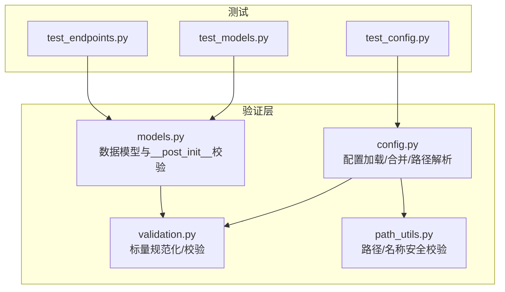
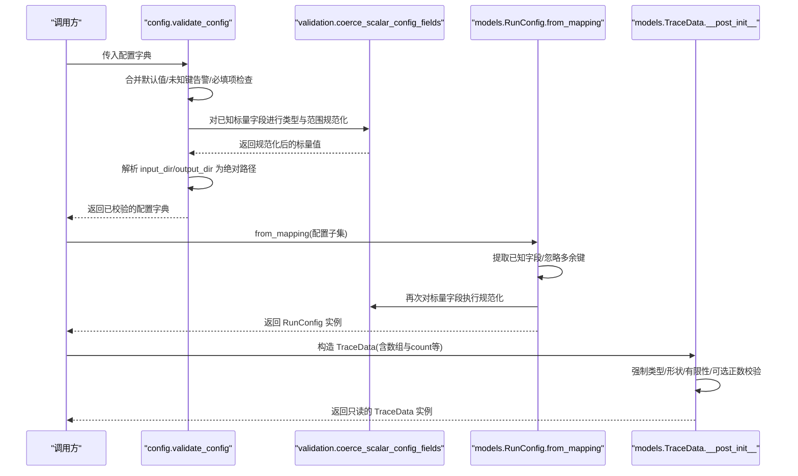
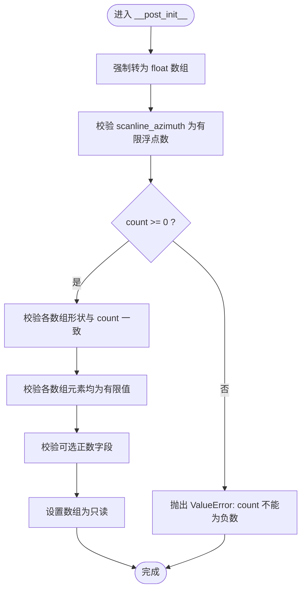
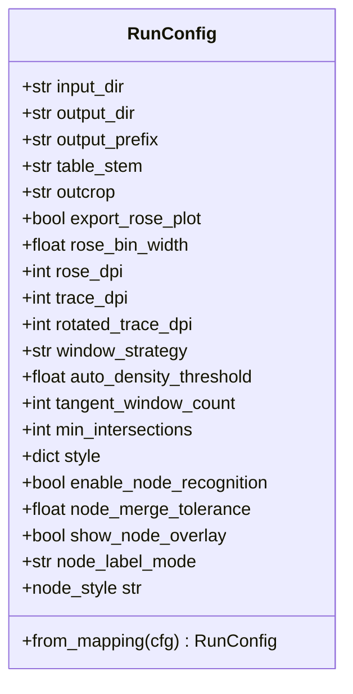
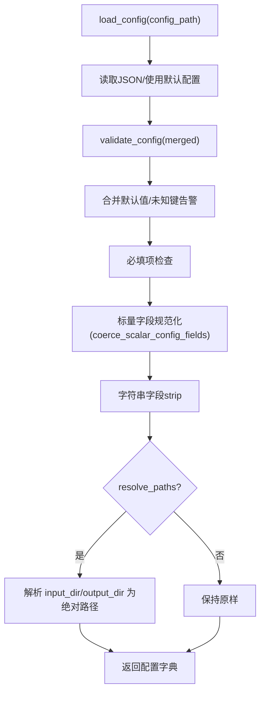
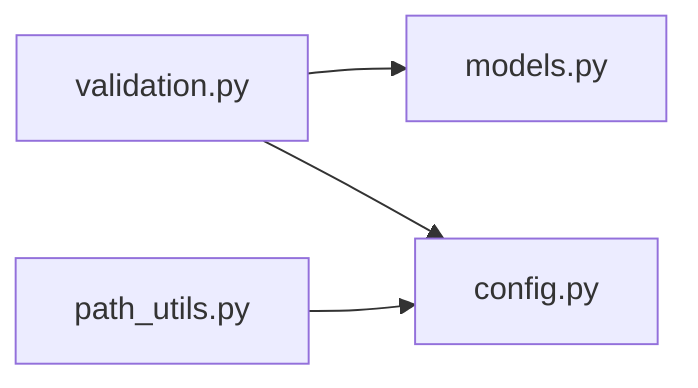

# 数据验证规则

<cite>
**本文引用的文件**
- [trace_pipeline/validation.py](file://trace_pipeline/validation.py)
- [trace_pipeline/models.py](file://trace_pipeline/models.py)
- [trace_pipeline/config.py](file://trace_pipeline/config.py)
- [backend/utils/path_utils.py](file://backend/utils/path_utils.py)
- [tests/test_models.py](file://tests/test_models.py)
- [tests/test_config.py](file://tests/test_config.py)
- [tests/test_endpoints.py](file://tests/test_endpoints.py)
</cite>

## 目录
1. [简介](#简介)
2. [项目结构](#项目结构)
3. [核心组件](#核心组件)
4. [架构总览](#架构总览)
5. [详细组件分析](#详细组件分析)
6. [依赖关系分析](#依赖关系分析)
7. [性能考虑](#性能考虑)
8. [故障排查指南](#故障排查指南)
9. [结论](#结论)
10. [附录](#附录)

## 简介
本文件系统化梳理 TracePipeline 的数据验证规则与约束，覆盖字段类型检查、数值范围校验、形状一致性校验、可选字段策略与默认值处理，以及 __post_init__ 中的验证逻辑与错误处理机制。同时提供自定义验证器的扩展方法与常见错误的诊断方案，帮助开发者快速定位并修复问题。

## 项目结构
与数据验证相关的核心代码集中在以下模块：
- trace_pipeline/validation.py：通用标量配置规范化与校验工具（纯函数）
- trace_pipeline/models.py：不可变数据模型与 __post_init__ 校验（TraceData、RunConfig、RunResult）
- trace_pipeline/config.py：配置加载、合并、路径解析与整体校验
- backend/utils/path_utils.py：路径与名称安全校验（如露头名白名单）
- tests/*：针对上述模块的单元测试，覆盖关键边界与异常路径

图表来源
- [trace_pipeline/validation.py:1-112](file://trace_pipeline/validation.py#L1-L112)
- [trace_pipeline/models.py:1-352](file://trace_pipeline/models.py#L1-L352)
- [trace_pipeline/config.py:1-326](file://trace_pipeline/config.py#L1-L326)
- [backend/utils/path_utils.py:1-68](file://backend/utils/path_utils.py#L1-L68)
- [tests/test_models.py:1-138](file://tests/test_models.py#L1-L138)
- [tests/test_config.py:1-21](file://tests/test_config.py#L1-L21)
- [tests/test_endpoints.py:1-103](file://tests/test_endpoints.py#L1-L103)

章节来源
- [trace_pipeline/validation.py:1-112](file://trace_pipeline/validation.py#L1-L112)
- [trace_pipeline/models.py:1-352](file://trace_pipeline/models.py#L1-L352)
- [trace_pipeline/config.py:1-326](file://trace_pipeline/config.py#L1-L326)
- [backend/utils/path_utils.py:1-68](file://backend/utils/path_utils.py#L1-L68)
- [tests/test_models.py:1-138](file://tests/test_models.py#L1-L138)
- [tests/test_config.py:1-21](file://tests/test_config.py#L1-L21)
- [tests/test_endpoints.py:1-103](file://tests/test_endpoints.py#L1-L103)

## 核心组件
- 通用标量校验器（validation.py）
  - 布尔规范化：coerce_bool
  - 正整数规范化：coerce_positive_int
  - 正浮点规范化：coerce_positive_float
  - 窗口策略规范化：coerce_window_strategy
  - 节点标签模式规范化：coerce_node_label_mode
  - 玫瑰图分箱宽度规范化：coerce_rose_bin_width
  - 批量标量字段规范化：coerce_scalar_config_fields
- 数据模型与 __post_init__ 校验（models.py）
  - TraceData：几何数组形状与有限性校验、可选正数校验、只读数组标记
  - RunConfig：必填字符串非空、标量字段统一规范化、node_merge_tolerance 正数校验
  - RunResult：结果聚合对象（无复杂校验）
- 配置加载与校验（config.py）
  - 默认配置合并、未知键告警、必填项校验、路径解析为绝对路径、CLI 覆盖合并
- 路径与名称安全校验（path_utils.py）
  - 露头名白名单校验，防止路径穿越

章节来源
- [trace_pipeline/validation.py:1-112](file://trace_pipeline/validation.py#L1-L112)
- [trace_pipeline/models.py:1-352](file://trace_pipeline/models.py#L1-L352)
- [trace_pipeline/config.py:1-326](file://trace_pipeline/config.py#L1-L326)
- [backend/utils/path_utils.py:1-68](file://backend/utils/path_utils.py#L1-L68)

## 架构总览
下图展示了配置与模型在运行时的校验流程与交互关系。

图表来源
- [trace_pipeline/config.py:148-190](file://trace_pipeline/config.py#L148-L190)
- [trace_pipeline/validation.py:90-112](file://trace_pipeline/validation.py#L90-L112)
- [trace_pipeline/models.py:236-267](file://trace_pipeline/models.py#L236-L267)
- [trace_pipeline/models.py:202-233](file://trace_pipeline/models.py#L202-L233)
- [trace_pipeline/models.py:65-121](file://trace_pipeline/models.py#L65-L121)

## 详细组件分析

### 通用标量校验器（validation.py）
- 设计要点
  - 所有函数均为纯函数，不引入业务耦合，便于复用
  - 通过 coerce_scalar_config_fields 集中注册标量字段的转换与校验映射
- 字段与约束
  - export_rose_plot：布尔规范化
  - rose_bin_width：浮点数，范围 (0, 180]
  - rose_dpi / trace_dpi / rotated_trace_dpi：正整数
  - tangent_window_count / min_intersections：正整数
  - window_strategy：枚举值 auto/tangent/hybrid/concentric
  - auto_density_threshold：正浮点数
  - enable_node_recognition / show_node_overlay：布尔
  - node_merge_tolerance：正浮点数
  - node_label_mode：枚举 none/type/id
- 错误处理
  - 所有非法输入均抛出 ValueError，消息包含字段名或明确约束，便于前端/上层捕获与提示

章节来源
- [trace_pipeline/validation.py:26-88](file://trace_pipeline/validation.py#L26-L88)
- [trace_pipeline/validation.py:90-112](file://trace_pipeline/validation.py#L90-L112)

### 数据模型 TraceData（models.py）
- 字段与类型
  - scanline_azimuth：float，必须为有限值
  - count：int，≥ 0
  - endpoints：np.ndarray(N, 4)，列序 [x1, y1, x2, y2]
  - joint_strikes：np.ndarray(N,)
  - segment_lengths：np.ndarray(N,)
  - scanline_positions：np.ndarray(N,)
  - measured_scanline_length：float | None，若存在须为正有限浮点数
  - measured_outcrop_area：float | None，若存在须为正有限浮点数
- __post_init__ 校验逻辑
  - 类型强制：将各数组转换为 float 类型
  - 形状一致性：endpoints 行数为 count；其他 N 维数组长度等于 count
  - 有限性：所有数组元素必须为有限浮点数（排除 NaN/inf）
  - 可选正数：measured_* 字段若提供则必须 > 0 且有限
  - 只读保护：设置 flags.writeable = False，避免后续意外修改
- 派生属性
  - lengths：基于端点坐标计算欧氏距离，首次访问后缓存，结果只读
  - mean_length：平均长度，空数据时返回 0.0

图表来源
- [trace_pipeline/models.py:65-121](file://trace_pipeline/models.py#L65-L121)

章节来源
- [trace_pipeline/models.py:41-157](file://trace_pipeline/models.py#L41-L157)
- [tests/test_models.py:14-98](file://tests/test_models.py#L14-L98)

### 数据模型 RunConfig（models.py）
- 字段与默认值
  - 必填字符串：input_dir、output_dir、output_prefix、table_stem、outcrop（在 __post_init__ 中要求非空）
  - 布尔/整型/浮点/枚举：由 coerce_scalar_config_fields 统一规范化
  - style：dict[str, Any]，用于样式预设（例如 node_style）
- __post_init__ 校验逻辑
  - 字符串字段 strip 后非空
  - 标量字段统一走 validation 映射进行类型与范围校验
  - node_merge_tolerance 必须大于 0
- 工厂方法
  - from_mapping：仅接受已知字段，忽略多余键；缺失可选字段使用 dataclass 默认值；支持从 style 读取 node_label_mode 回退

图表来源
- [trace_pipeline/models.py:162-273](file://trace_pipeline/models.py#L162-L273)

章节来源
- [trace_pipeline/models.py:162-273](file://trace_pipeline/models.py#L162-L273)
- [tests/test_models.py:100-138](file://tests/test_models.py#L100-L138)

### 配置加载与校验（config.py）
- 默认配置与合并
  - DEFAULT_CONFIG 定义全局默认值
  - validate_config 合并用户配置与默认值，保留 style 子对象
- 必填项与未知键
  - _REQUIRED_KEYS 指定必填字段
  - 未知键记录警告并忽略
- 标量规范化
  - 调用 coerce_scalar_config_fields 对已知标量字段进行类型与范围校验
- 路径解析
  - resolve_paths=True 时将 input_dir/output_dir 解析为绝对路径
- CLI 覆盖
  - apply_cli_overrides 将命令行参数覆盖到配置并重新校验

图表来源
- [trace_pipeline/config.py:86-145](file://trace_pipeline/config.py#L86-L145)
- [trace_pipeline/config.py:148-190](file://trace_pipeline/config.py#L148-L190)

章节来源
- [trace_pipeline/config.py:56-79](file://trace_pipeline/config.py#L56-L79)
- [trace_pipeline/config.py:148-190](file://trace_pipeline/config.py#L148-L190)
- [tests/test_config.py:8-21](file://tests/test_config.py#L8-L21)

### 路径与名称安全校验（path_utils.py）
- 露头名白名单校验
  - 仅允许字母、数字、下划线、连字符与中文，禁止路径分隔符与“..”等危险字符
  - 非法时抛出 ValueError，消息包含具体值
- 路径解析
  - resolve_path 将相对路径基于 base 或 PROJECT_ROOT 解析为绝对路径

章节来源
- [backend/utils/path_utils.py:20-37](file://backend/utils/path_utils.py#L20-L37)
- [backend/utils/path_utils.py:40-56](file://backend/utils/path_utils.py#L40-L56)

## 依赖关系分析
- 模块间依赖
  - models.RunConfig 依赖 validation.coerce_scalar_config_fields 进行标量字段规范化
  - config.validate_config 同样依赖 validation 进行标量规范化，并在路径解析阶段使用 path_utils.resolve_path 风格逻辑
  - path_utils 独立于业务模块，提供安全的路径与名称校验
- 潜在循环依赖
  - validation 为纯函数，无业务依赖，避免循环
  - models 仅依赖 validation，config 依赖 validation 与 path_utils，层次清晰

图表来源
- [trace_pipeline/validation.py:1-112](file://trace_pipeline/validation.py#L1-L112)
- [trace_pipeline/models.py:1-352](file://trace_pipeline/models.py#L1-L352)
- [trace_pipeline/config.py:1-326](file://trace_pipeline/config.py#L1-L326)
- [backend/utils/path_utils.py:1-68](file://backend/utils/path_utils.py#L1-L68)

章节来源
- [trace_pipeline/validation.py:1-112](file://trace_pipeline/validation.py#L1-L112)
- [trace_pipeline/models.py:1-352](file://trace_pipeline/models.py#L1-L352)
- [trace_pipeline/config.py:1-326](file://trace_pipeline/config.py#L1-L326)
- [backend/utils/path_utils.py:1-68](file://backend/utils/path_utils.py#L1-L68)

## 性能考虑
- 数组只读与缓存
  - TraceData 在 __post_init__ 中将数组设为只读，避免运行时意外修改导致额外复制
  - lengths 属性采用懒加载与缓存，减少重复计算
- 标量规范化
  - 通过集中映射一次性完成类型与范围校验，避免分散分支判断带来的开销
- 路径解析
  - 仅在需要时解析为绝对路径，避免不必要的文件系统操作

[本节为通用指导，无需特定文件引用]

## 故障排查指南
- TraceData 常见错误
  - 形状不一致：当 endpoints/joint_strikes/segment_lengths/scanline_positions 的形状与 count 不一致时抛出 ValueError
    - 参考用例：[tests/test_models.py:39-48](file://tests/test_models.py#L39-L48)
  - 包含 NaN/inf：任一数组包含非有限值会触发 ValueError
    - 参考用例：[tests/test_models.py:50-59](file://tests/test_models.py#L50-L59)
  - 可选正数校验失败：measured_scanline_length/measured_outcrop_area 若提供须为正有限浮点数
    - 参考用例：[tests/test_models.py:61-71](file://tests/test_models.py#L61-L71)
- RunConfig 常见错误
  - 必填字符串为空：input_dir/output_dir/output_prefix/table_stem/outcrop 经 strip 后为空将报错
    - 参考用例：[tests/test_models.py:113-121](file://tests/test_models.py#L113-L121)
  - 标量字段类型/范围错误：如 rose_bin_width 不在 (0, 180]、window_strategy 不在允许集合等
    - 参考实现：[trace_pipeline/validation.py:79-87](file://trace_pipeline/validation.py#L79-L87)、[trace_pipeline/validation.py:63-76](file://trace_pipeline/validation.py#L63-L76)
- 配置加载常见错误
  - JSON 格式无效或文件不存在：load_config 抛出 ValueError/OSError
    - 参考实现：[trace_pipeline/config.py:111-130](file://trace_pipeline/config.py#L111-L130)
  - 缺少必要配置字段：validate_config 抛出 ValueError
    - 参考实现：[trace_pipeline/config.py:169-177](file://trace_pipeline/config.py#L169-L177)
- 路径与名称安全
  - 露头名非法：path_utils.validate_outcrop_name 抛出 ValueError
    - 参考实现：[backend/utils/path_utils.py:35-36](file://backend/utils/path_utils.py#L35-L36)

章节来源
- [tests/test_models.py:28-71](file://tests/test_models.py#L28-L71)
- [tests/test_models.py:113-121](file://tests/test_models.py#L113-L121)
- [trace_pipeline/validation.py:63-87](file://trace_pipeline/validation.py#L63-L87)
- [trace_pipeline/config.py:111-130](file://trace_pipeline/config.py#L111-L130)
- [trace_pipeline/config.py:169-177](file://trace_pipeline/config.py#L169-L177)
- [backend/utils/path_utils.py:35-36](file://backend/utils/path_utils.py#L35-L36)

## 结论
本项目采用“纯函数标量校验 + 数据模型 __post_init__ 强校验 + 配置层统一合并与路径解析”的分层验证架构。该设计保证了：
- 类型与范围在入口处即被严格约束
- 数据结构在构造时即保证一致性与安全性
- 配置与路径解析具备可移植性与健壮性
- 错误信息明确、可追溯，便于前端与上层服务处理

[本节为总结性内容，无需特定文件引用]

## 附录

### 字段级验证规则清单
- TraceData
  - scanline_azimuth：float，必须为有限值
  - count：int，≥ 0
  - endpoints：np.ndarray(N, 4)，元素有限
  - joint_strikes：np.ndarray(N,)，元素有限
  - segment_lengths：np.ndarray(N,)，元素有限
  - scanline_positions：np.ndarray(N,)，元素有限
  - measured_scanline_length：float | None，若存在须 > 0 且有限
  - measured_outcrop_area：float | None，若存在须 > 0 且有限
- RunConfig
  - 必填字符串：input_dir/output_dir/output_prefix/table_stem/outcrop，strip 后非空
  - export_rose_plot：布尔
  - rose_bin_width：浮点，范围 (0, 180]
  - rose_dpi/trace_dpi/rotated_trace_dpi：正整数
  - tangent_window_count/min_intersections：正整数
  - window_strategy：auto/tangent/hybrid/concentric
  - auto_density_threshold：正浮点
  - enable_node_recognition/show_node_overlay：布尔
  - node_merge_tolerance：正浮点
  - node_label_mode：none/type/id
  - style：dict[str, Any]（透传）
- 配置层（config.py）
  - 必填项：input_dir/output_dir/outcrop（process_all=False 时 table_stem 也必填）
  - 未知键：记录警告并忽略
  - 路径解析：input_dir/output_dir 解析为绝对路径

章节来源
- [trace_pipeline/models.py:41-157](file://trace_pipeline/models.py#L41-L157)
- [trace_pipeline/models.py:162-273](file://trace_pipeline/models.py#L162-L273)
- [trace_pipeline/config.py:56-79](file://trace_pipeline/config.py#L56-L79)
- [trace_pipeline/config.py:148-190](file://trace_pipeline/config.py#L148-L190)

### 自定义验证器开发指南
- 新增标量字段校验
  - 在 validation.py 中添加专用 coerce_xxx(value, name) 函数，负责类型转换与范围校验，失败时抛出 ValueError
  - 在 _SCALAR_COERCIONS 映射中注册新字段键与对应处理器
  - 确保 RunConfig.from_mapping 的 known 集合包含新字段，以便正确提取与校验
- 新增数据模型字段校验
  - 在对应 dataclass 的 __post_init__ 中增加类型强制、形状/范围/有限性校验
  - 如需可选字段，使用类似 _validate_optional_positive 的模式封装校验逻辑
  - 对大型数组设置只读标志，避免后续修改
- 错误信息规范
  - 使用明确的字段名与约束描述，便于上层捕获与展示
  - 对于枚举类字段，列出允许值集合，降低歧义

章节来源
- [trace_pipeline/validation.py:90-112](file://trace_pipeline/validation.py#L90-L112)
- [trace_pipeline/models.py:202-233](file://trace_pipeline/models.py#L202-L233)
- [trace_pipeline/models.py:65-121](file://trace_pipeline/models.py#L65-L121)