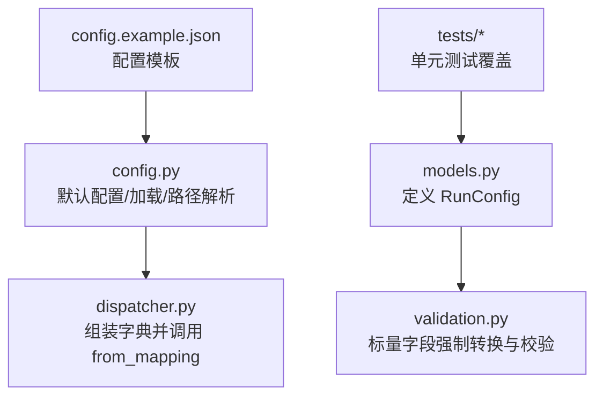
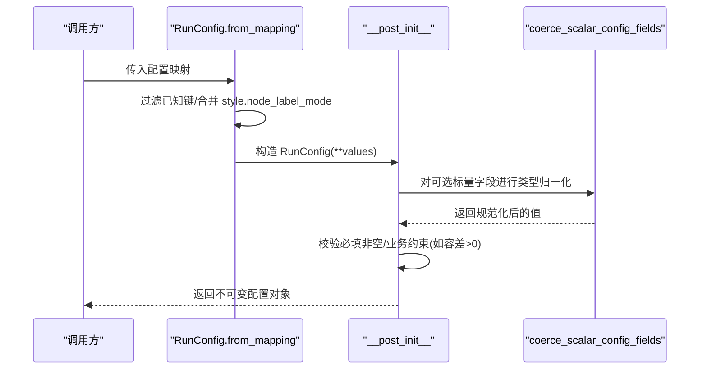
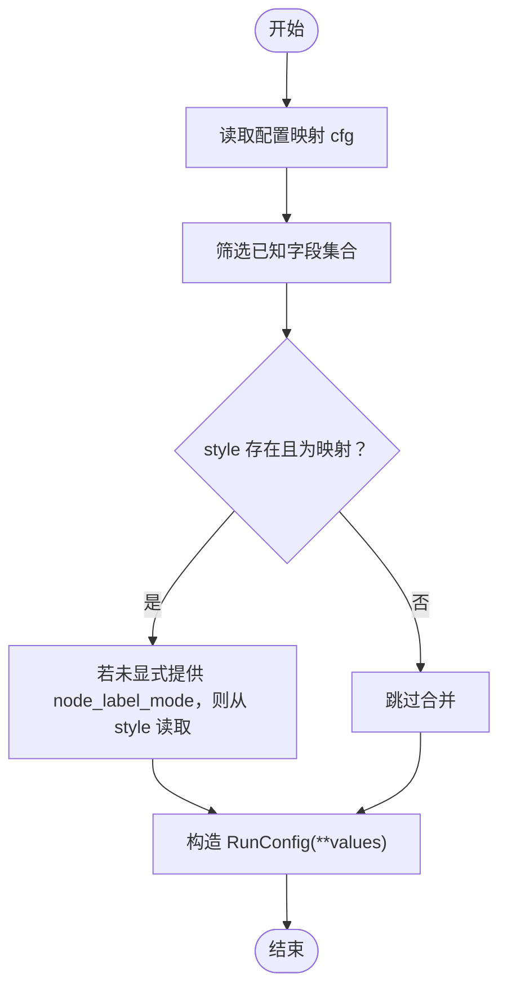
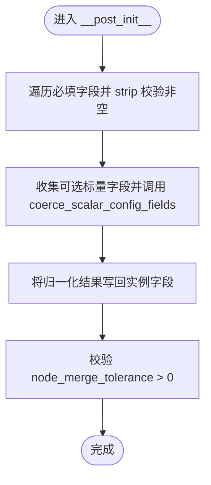
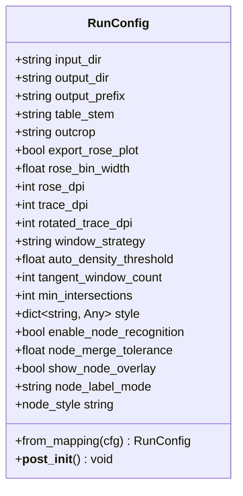
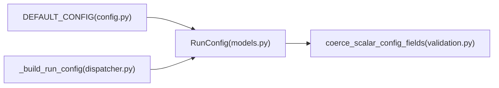

# RunConfig 运行配置模型

<cite>
**本文引用的文件**
- [trace_pipeline/models.py](file://trace_pipeline/models.py)
- [trace_pipeline/validation.py](file://trace_pipeline/validation.py)
- [trace_pipeline/config.py](file://trace_pipeline/config.py)
- [config.example.json](file://config.example.json)
- [tests/test_models.py](file://tests/test_models.py)
- [tests/test_run_config.py](file://tests/test_run_config.py)
- [trace_pipeline/cli/dispatcher.py](file://trace_pipeline/cli/dispatcher.py)
</cite>

## 目录
1. [简介](#简介)
2. [项目结构](#项目结构)
3. [核心组件](#核心组件)
4. [架构总览](#架构总览)
5. [详细组件分析](#详细组件分析)
6. [依赖关系分析](#依赖关系分析)
7. [性能与行为特性](#性能与行为特性)
8. [故障排查指南](#故障排查指南)
9. [结论](#结论)
10. [附录：示例与用法](#附录示例与用法)

## 简介
RunConfig 是一个不可变的单次流水线运行配置数据类，用于集中管理输入输出路径、输出命名、可视化选项、圆窗策略、节点识别与样式等参数。它提供从映射构造的工厂方法 from_mapping，并在初始化后执行严格的字段校验与类型归一化，确保下游处理逻辑获得一致且安全的配置对象。

## 项目结构
本模块位于 trace_pipeline/models.py，相关验证逻辑在 trace_pipeline/validation.py，配置文件加载与默认值在 trace_pipeline/config.py，使用示例与测试覆盖在 tests 目录下，CLI 侧通过 dispatcher 组装配置并调用 from_mapping。

图表来源
- [trace_pipeline/models.py:162-272](file://trace_pipeline/models.py#L162-L272)
- [trace_pipeline/validation.py:90-112](file://trace_pipeline/validation.py#L90-L112)
- [trace_pipeline/config.py:56-79](file://trace_pipeline/config.py#L56-L79)
- [trace_pipeline/cli/dispatcher.py:42-58](file://trace_pipeline/cli/dispatcher.py#L42-L58)
- [config.example.json:1-26](file://config.example.json#L1-L26)

章节来源
- [trace_pipeline/models.py:162-272](file://trace_pipeline/models.py#L162-L272)
- [trace_pipeline/validation.py:90-112](file://trace_pipeline/validation.py#L90-L112)
- [trace_pipeline/config.py:56-79](file://trace_pipeline/config.py#L56-L79)
- [trace_pipeline/cli/dispatcher.py:42-58](file://trace_pipeline/cli/dispatcher.py#L42-L58)
- [config.example.json:1-26](file://config.example.json#L1-L26)

## 核心组件
- 类名：RunConfig（不可变 dataclass）
- 职责：封装一次运行所需的全部配置项；提供 from_mapping 工厂方法与 node_style 属性；在 __post_init__ 中完成必填校验、类型归一化与业务约束检查。

章节来源
- [trace_pipeline/models.py:162-272](file://trace_pipeline/models.py#L162-L272)

## 架构总览
RunConfig 处于“配置层”，向上被 CLI 与服务层消费，向下为数据处理与绘图模块提供稳定参数。其关键流程如下：
- 外部传入配置映射 → from_mapping 提取已知字段 → 构造实例 → __post_init__ 校验与归一化 → 暴露只读属性（如 node_style）。

图表来源
- [trace_pipeline/models.py:236-267](file://trace_pipeline/models.py#L236-L267)
- [trace_pipeline/models.py:202-233](file://trace_pipeline/models.py#L202-L233)
- [trace_pipeline/validation.py:107-112](file://trace_pipeline/validation.py#L107-112)

## 详细组件分析

### 字段定义与语义
- 必需参数（字符串，且在 __post_init__ 中会被 strip 并禁止为空）
  - input_dir：输入目录绝对路径
  - output_dir：输出目录绝对路径
  - output_prefix：输出文件命名前缀
  - table_stem：迹线表文件名（不含扩展名）
  - outcrop：露头标识（也是 Excel 工作表名）
- 可选参数（带默认值，部分在 __post_init__ 中进行类型归一化与范围校验）
  - export_rose_plot：是否导出玫瑰花瓣图（bool，默认 False）
  - rose_bin_width：玫瑰图分箱宽度（度），取值范围 (0, 180]（float，默认 10.0）
  - rose_dpi：玫瑰图分辨率（int，默认 600）
  - trace_dpi：原始迹线图分辨率（int，默认 600）
  - rotated_trace_dpi：旋转迹线图分辨率（int，默认 600）
  - window_strategy：圆窗策略，允许 auto/tangent/hybrid/concentric（str，默认 "auto"）
  - auto_density_threshold：auto 策略的粗估面密度阈值（正浮点，默认 5.0）
  - tangent_window_count：tangent 策略每侧切圆数量（正整数，默认 3）
  - min_intersections：最小交点数（正整数，默认 5）
  - style：样式字典（dict，默认 {}）
  - enable_node_recognition：是否启用节点识别（bool，默认 False）
  - node_merge_tolerance：节点合并容差（正浮点，默认 0.01）
  - show_node_overlay：是否显示节点叠加（bool，默认 True）
  - node_label_mode：节点标签模式 none/type/id（str，默认 "type"）

章节来源
- [trace_pipeline/models.py:162-201](file://trace_pipeline/models.py#L162-L201)

### from_mapping 工厂方法：配置解析与字段映射
- 仅接受 RunConfig 已知的字段集合，未知键将被忽略。
- 若未显式提供 node_label_mode，但 style 为映射且包含该键，则从 style 中读取作为 node_label_mode 的值。
- 最终将过滤后的 values 以关键字参数形式构造 RunConfig 实例。

图表来源
- [trace_pipeline/models.py:236-267](file://trace_pipeline/models.py#L236-L267)

章节来源
- [trace_pipeline/models.py:236-267](file://trace_pipeline/models.py#L236-L267)

### __post_init__：验证规则与默认值处理
- 必填字段校验：对 table_stem、outcrop、output_prefix、input_dir、output_dir 执行 strip 并禁止为空，否则抛出 ValueError。
- 标量字段归一化：对一组可选标量字段调用 coerce_scalar_config_fields 进行类型强制与范围校验（例如布尔、正整数、正浮点、窗口策略枚举、玫瑰图分箱范围等）。
- 业务约束：node_merge_tolerance 必须大于 0，否则抛出 ValueError。

图表来源
- [trace_pipeline/models.py:202-233](file://trace_pipeline/models.py#L202-L233)
- [trace_pipeline/validation.py:107-112](file://trace_pipeline/validation.py#L107-112)

章节来源
- [trace_pipeline/models.py:202-233](file://trace_pipeline/models.py#L202-L233)
- [trace_pipeline/validation.py:90-112](file://trace_pipeline/validation.py#L90-L112)

### node_style 属性：读取逻辑
- 从 style 字典中读取键 "node_style"，若不存在则回退到 "default"。
- 该属性为只读计算属性，不改变实例状态。

章节来源
- [trace_pipeline/models.py:269-272](file://trace_pipeline/models.py#L269-L272)

### 类与方法关系图

图表来源
- [trace_pipeline/models.py:162-272](file://trace_pipeline/models.py#L162-L272)

## 依赖关系分析
- 内部依赖
  - validation.coerce_scalar_config_fields：负责标量字段的类型强制与范围校验。
  - config.DEFAULT_CONFIG：提供默认配置项，便于上层加载与合并。
  - cli.dispatcher._build_run_config：在 CLI 场景下组装字典并调用 from_mapping。
- 外部依赖
  - Python 标准库 dataclass、Mapping、field 等。

图表来源
- [trace_pipeline/models.py:162-272](file://trace_pipeline/models.py#L162-L272)
- [trace_pipeline/validation.py:107-112](file://trace_pipeline/validation.py#L107-112)
- [trace_pipeline/config.py:56-79](file://trace_pipeline/config.py#L56-L79)
- [trace_pipeline/cli/dispatcher.py:42-58](file://trace_pipeline/cli/dispatcher.py#L42-L58)

章节来源
- [trace_pipeline/models.py:162-272](file://trace_pipeline/models.py#L162-L272)
- [trace_pipeline/validation.py:107-112](file://trace_pipeline/validation.py#L107-112)
- [trace_pipeline/config.py:56-79](file://trace_pipeline/config.py#L56-L79)
- [trace_pipeline/cli/dispatcher.py:42-58](file://trace_pipeline/cli/dispatcher.py#L42-L58)

## 性能与行为特性
- 不可变性：dataclass(frozen=True) 保证实例创建后不可修改，避免副作用。
- 延迟归一化：仅在 __post_init__ 中对必要字段做类型归一化与校验，减少不必要的开销。
- 容错性：from_mapping 忽略未知键，提升配置兼容性。
- 资源影响：DPI 等数值越大，生成图像质量越高但耗时与体积也越大，需根据实际环境权衡。

[本节为通用指导，无需源码引用]

## 故障排查指南
- 常见错误
  - 必填字段为空：当 input_dir/output_dir/output_prefix/table_stem/outcrop 任一为空或仅空白字符时，会抛出 ValueError。
  - 类型不合法：布尔、正整数、正浮点、窗口策略枚举、玫瑰图分箱范围不符合预期时会抛出 ValueError。
  - 业务约束失败：node_merge_tolerance 不大于 0 时报错。
- 定位建议
  - 检查 from_mapping 传入的键是否为已知字段。
  - 确认 style 中的 node_label_mode 是否与顶层 node_label_mode 冲突（顶层优先）。
  - 核对 DPI 与分箱宽度的取值范围。

章节来源
- [trace_pipeline/models.py:202-233](file://trace_pipeline/models.py#L202-L233)
- [trace_pipeline/validation.py:90-112](file://trace_pipeline/validation.py#L90-L112)

## 结论
RunConfig 通过不可变设计、严格校验与灵活的工厂方法，为 TracePipeline 的运行期提供了高内聚、低耦合的配置抽象。配合默认配置与 CLI 覆盖机制，可在多种使用场景下保持一致的行为与可维护性。

[本节为总结性内容，无需源码引用]

## 附录：示例与用法

### 配置文件示例
- 参考模板位置：config.example.json
- 说明：复制为 config.json 后可按需修改所有字段；缺失字段将采用默认值。

章节来源
- [config.example.json:1-26](file://config.example.json#L1-L26)

### 编程式构造示例
- 直接构造（仅必需字段）
  - 参考测试用例：tests/test_models.py 中的基本构造断言。
- 从映射构造
  - 参考测试用例：tests/test_models.py 中的 from_mapping 断言。
  - 参考测试用例：tests/test_run_config.py 中的 node_label_mode 优先级断言。
- CLI 集成
  - 参考 CLI 构建器：trace_pipeline/cli/dispatcher.py 中的 _build_run_config，演示如何组合基础配置并调用 from_mapping。

章节来源
- [tests/test_models.py:100-138](file://tests/test_models.py#L100-L138)
- [tests/test_run_config.py:1-20](file://tests/test_run_config.py#L1-20)
- [trace_pipeline/cli/dispatcher.py:42-58](file://trace_pipeline/cli/dispatcher.py#L42-L58)