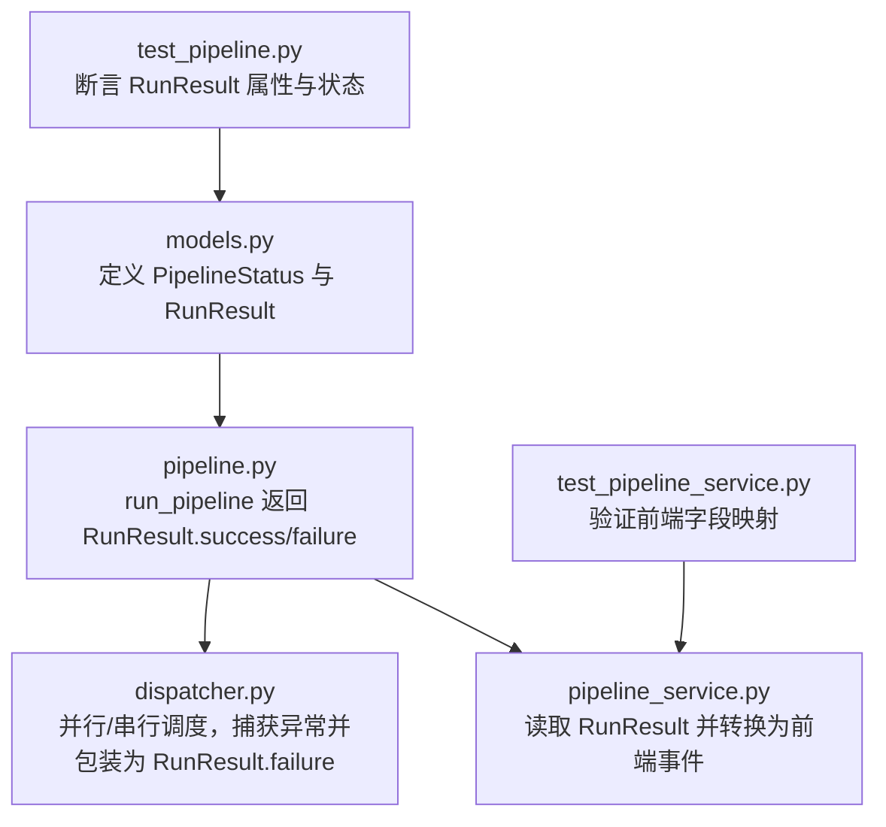
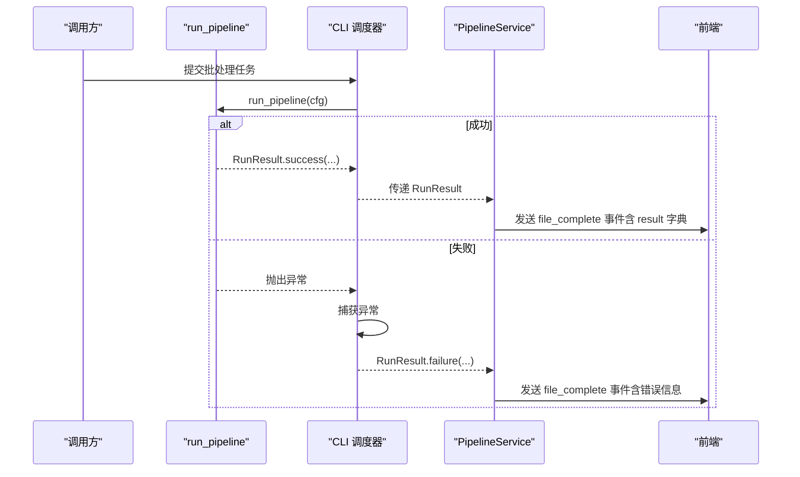
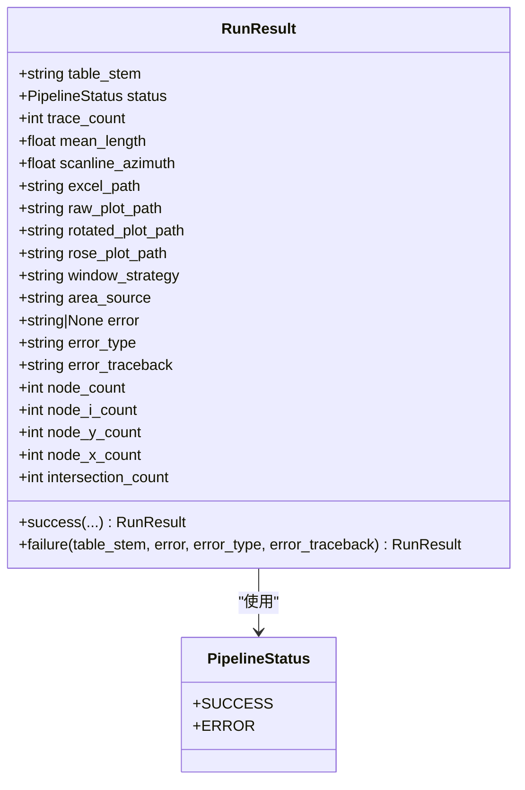
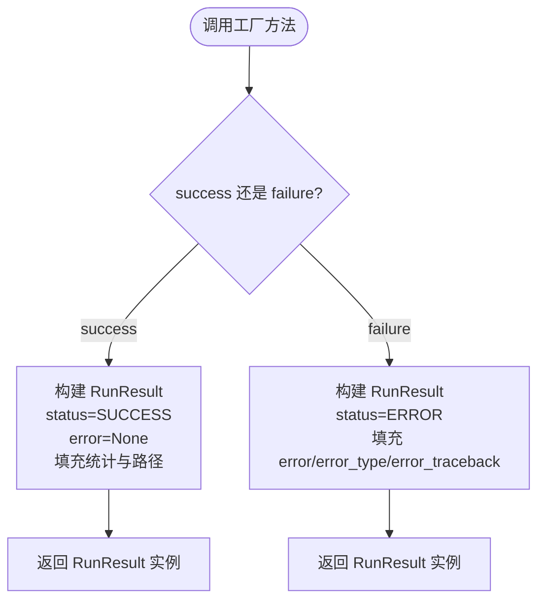
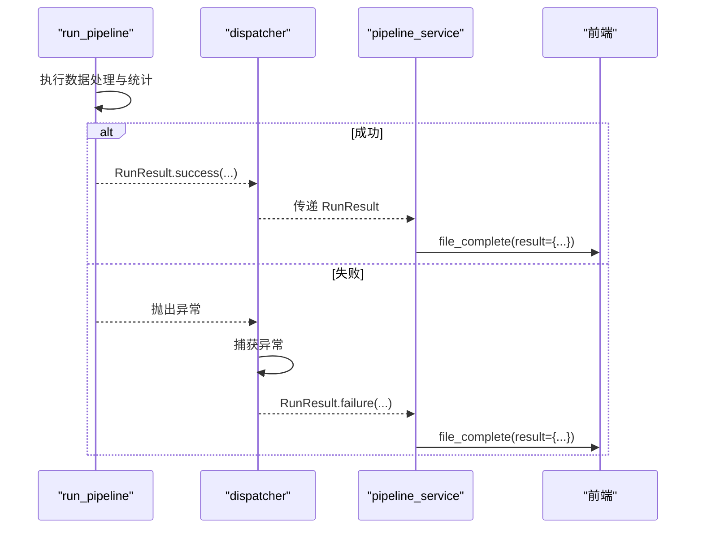
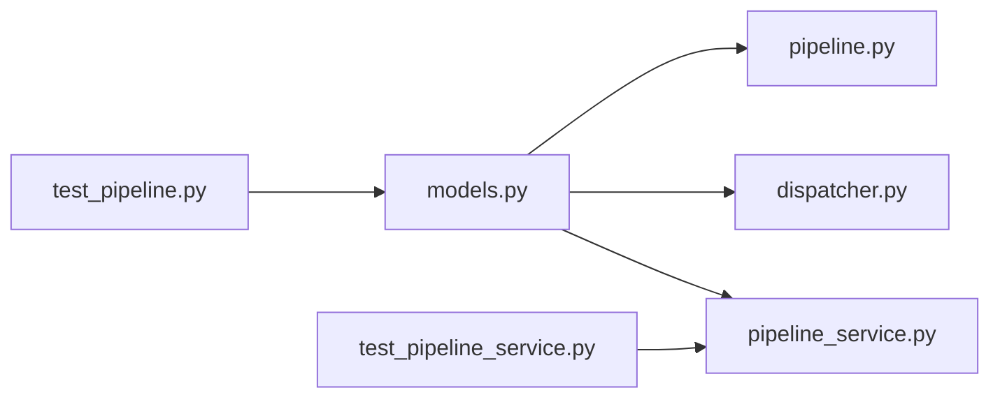

# RunResult 处理结果模型

<cite>
**本文引用的文件**   
- [trace_pipeline/models.py](file://trace_pipeline/models.py)
- [trace_pipeline/pipeline.py](file://trace_pipeline/pipeline.py)
- [backend/services/pipeline_service.py](file://backend/services/pipeline_service.py)
- [trace_pipeline/cli/dispatcher.py](file://trace_pipeline/cli/dispatcher.py)
- [tests/test_pipeline.py](file://tests/test_pipeline.py)
- [tests/test_pipeline_service.py](file://tests/test_pipeline_service.py)
</cite>

## 目录
1. [简介](#简介)
2. [项目结构](#项目结构)
3. [核心组件](#核心组件)
4. [架构总览](#架构总览)
5. [详细组件分析](#详细组件分析)
6. [依赖关系分析](#依赖关系分析)
7. [性能与可扩展性](#性能与可扩展性)
8. [故障排查指南](#故障排查指南)
9. [结论](#结论)
10. [附录：使用示例与集成模式](#附录使用示例与集成模式)

## 简介
RunResult 是 TracePipeline 中用于表达“单次流水线运行结果”的不可变数据类。它承载了状态信息、统计数据、输出文件路径、节点统计以及错误信息等，贯穿 CLI、后端服务与前端展示等各个层次。通过提供 success() 与 failure() 两个工厂方法，统一构造成功与失败的结果对象，避免在调用方重复拼装字段，提升一致性与可维护性。

## 项目结构
与 RunResult 相关的代码主要分布在以下位置：
- 定义与枚举：trace_pipeline/models.py
- 流水线执行与结果构造：trace_pipeline/pipeline.py
- 后台任务与事件分发（将 RunResult 转为前端事件）：backend/services/pipeline_service.py
- CLI 并行/串行调度器（捕获异常并生成失败结果）：trace_pipeline/cli/dispatcher.py
- 测试用例（验证结构与行为）：tests/test_pipeline.py、tests/test_pipeline_service.py

图表来源
- [trace_pipeline/models.py:23-27](file://trace_pipeline/models.py#L23-L27)
- [trace_pipeline/models.py:278-351](file://trace_pipeline/models.py#L278-L351)
- [trace_pipeline/pipeline.py:430-448](file://trace_pipeline/pipeline.py#L430-L448)
- [backend/services/pipeline_service.py:220-305](file://backend/services/pipeline_service.py#L220-L305)
- [trace_pipeline/cli/dispatcher.py:130-228](file://trace_pipeline/cli/dispatcher.py#L130-L228)
- [tests/test_pipeline.py:101-124](file://tests/test_pipeline.py#L101-L124)
- [tests/test_pipeline_service.py:26-55](file://tests/test_pipeline_service.py#L26-L55)

章节来源
- [trace_pipeline/models.py:23-27](file://trace_pipeline/models.py#L23-L27)
- [trace_pipeline/models.py:278-351](file://trace_pipeline/models.py#L278-L351)
- [trace_pipeline/pipeline.py:430-448](file://trace_pipeline/pipeline.py#L430-L448)
- [backend/services/pipeline_service.py:220-305](file://backend/services/pipeline_service.py#L220-L305)
- [trace_pipeline/cli/dispatcher.py:130-228](file://trace_pipeline/cli/dispatcher.py#L130-L228)
- [tests/test_pipeline.py:101-124](file://tests/test_pipeline.py#L101-L124)
- [tests/test_pipeline_service.py:26-55](file://tests/test_pipeline_service.py#L26-L55)

## 核心组件
本节聚焦 RunResult 的完整定义与语义。

- 不可变性：RunResult 使用不可变 dataclass，确保结果对象一旦创建即不可修改，便于并发安全与缓存。
- 状态信息：
  - status：使用 PipelineStatus 枚举，取值 SUCCESS 或 ERROR。
  - error：当失败时包含人类可读的错误消息；成功时为 None。
- 统计数据：
  - trace_count：迹线条数。
  - mean_length：平均迹线长度。
  - node_count：识别到的节点总数。
  - intersection_count：交点数量。
- 文件路径：
  - excel_path：生成的 Excel 文件路径。
  - raw_plot_path：原始迹线图路径。
  - rotated_plot_path：旋转后迹线图路径。
  - rose_plot_path：玫瑰图路径。
- 节点统计：
  - node_i_count：I 型节点计数。
  - node_y_count：Y 型节点计数。
  - node_x_count：X 型节点计数。
- 其他元数据：
  - table_stem：处理的迹线表名（不含扩展名）。
  - scanline_azimuth：测线走向角。
  - window_strategy：取样窗策略。
  - area_source：面积来源。
  - error_type：错误类型名称（如 PermissionError、FileNotFoundError）。
  - error_traceback：可选的堆栈跟踪字符串。

工厂方法：
- success(...)：构造成功结果，设置 status=SUCCESS，error=None，并填充统计与路径字段。
- failure(table_stem, error, error_type="", error_traceback="")：构造失败结果，设置 status=ERROR，并携带错误信息。

章节来源
- [trace_pipeline/models.py:23-27](file://trace_pipeline/models.py#L23-L27)
- [trace_pipeline/models.py:278-351](file://trace_pipeline/models.py#L278-L351)

## 架构总览
下图展示了 RunResult 在系统内的流转：流水线执行成功后返回 RunResult.success；若发生异常，调度层将其包装为 RunResult.failure；后端服务将 RunResult 的属性映射为前端事件字段，供 UI 展示。

图表来源
- [trace_pipeline/pipeline.py:430-448](file://trace_pipeline/pipeline.py#L430-L448)
- [trace_pipeline/cli/dispatcher.py:130-228](file://trace_pipeline/cli/dispatcher.py#L130-L228)
- [backend/services/pipeline_service.py:220-305](file://backend/services/pipeline_service.py#L220-L305)

## 详细组件分析

### RunResult 类与 PipelineStatus 枚举
- PipelineStatus：
  - SUCCESS：表示流水线正常完成。
  - ERROR：表示流水线执行过程中出现错误。
- RunResult 属性分组与用途：
  - 标识与状态：table_stem、status。
  - 统计指标：trace_count、mean_length、node_count、intersection_count。
  - 文件路径：excel_path、raw_plot_path、rotated_plot_path、rose_plot_path。
  - 节点细分：node_i_count、node_y_count、node_x_count。
  - 错误信息：error、error_type、error_traceback。
  - 元数据：scanline_azimuth、window_strategy、area_source。

图表来源
- [trace_pipeline/models.py:23-27](file://trace_pipeline/models.py#L23-L27)
- [trace_pipeline/models.py:278-351](file://trace_pipeline/models.py#L278-L351)

章节来源
- [trace_pipeline/models.py:23-27](file://trace_pipeline/models.py#L23-L27)
- [trace_pipeline/models.py:278-351](file://trace_pipeline/models.py#L278-L351)

### 工厂方法 success() 与 failure()
- success(...)：
  - 设置 status=SUCCESS。
  - 填充 trace_count、mean_length、scanline_azimuth、各输出路径、window_strategy、area_source 及节点统计。
  - 明确将 error 置为 None，保证成功结果的错误字段为空。
- failure(table_stem, error, error_type="", error_traceback="")：
  - 设置 status=ERROR。
  - 填充 error、error_type、error_traceback，便于上层记录与展示。

图表来源
- [trace_pipeline/models.py:302-351](file://trace_pipeline/models.py#L302-L351)

章节来源
- [trace_pipeline/models.py:302-351](file://trace_pipeline/models.py#L302-L351)

### 错误处理相关属性设计
- error：失败时的用户友好消息，便于日志与界面提示。
- error_type：异常类型名称，便于分类处理与提示（例如 PermissionError、FileNotFoundError）。
- error_traceback：可选的堆栈信息，适合调试与高级诊断。
- 在 pipeline.py 中，常见异常被捕获并转换为友好的错误消息，再经由 _handle_pipeline_error 返回 RunResult.failure。
- 在 dispatcher.py 中，并行/串行执行中的未捕获异常会被捕获并包装为 RunResult.failure，确保单文件失败不中断整批处理。

章节来源
- [trace_pipeline/pipeline.py:430-474](file://trace_pipeline/pipeline.py#L430-L474)
- [trace_pipeline/cli/dispatcher.py:130-228](file://trace_pipeline/cli/dispatcher.py#L130-L228)

### 与流水线集成的使用模式
- 成功路径：
  - pipeline.py 在完成数据处理、统计与绘图后，调用 RunResult.success(...) 返回结果。
  - dispatcher.py 与 pipeline_service.py 读取 RunResult 的字段，分别用于日志记录与前端事件。
- 失败路径：
  - 任何阶段抛出的异常都会被捕获，并通过 RunResult.failure(...) 返回，保持统一的错误传播方式。
  - 前端根据 status 与 error 字段显示失败原因与提示。

图表来源
- [trace_pipeline/pipeline.py:430-448](file://trace_pipeline/pipeline.py#L430-L448)
- [trace_pipeline/cli/dispatcher.py:130-228](file://trace_pipeline/cli/dispatcher.py#L130-L228)
- [backend/services/pipeline_service.py:220-305](file://backend/services/pipeline_service.py#L220-L305)

章节来源
- [trace_pipeline/pipeline.py:430-448](file://trace_pipeline/pipeline.py#L430-L448)
- [trace_pipeline/cli/dispatcher.py:130-228](file://trace_pipeline/cli/dispatcher.py#L130-L228)
- [backend/services/pipeline_service.py:220-305](file://backend/services/pipeline_service.py#L220-L305)

## 依赖关系分析
- models.py 仅依赖标准库与 numpy，RunResult 与 PipelineStatus 无外部模块耦合，内聚度高。
- pipeline.py 依赖 models.py 以返回 RunResult。
- dispatcher.py 与 pipeline_service.py 均依赖 models.py 以消费 RunResult。
- 测试文件对 RunResult 的结构与字段进行断言，保障契约稳定。

图表来源
- [trace_pipeline/models.py:278-351](file://trace_pipeline/models.py#L278-L351)
- [trace_pipeline/pipeline.py:430-448](file://trace_pipeline/pipeline.py#L430-L448)
- [trace_pipeline/cli/dispatcher.py:130-228](file://trace_pipeline/cli/dispatcher.py#L130-L228)
- [backend/services/pipeline_service.py:220-305](file://backend/services/pipeline_service.py#L220-L305)
- [tests/test_pipeline.py:101-124](file://tests/test_pipeline.py#L101-L124)
- [tests/test_pipeline_service.py:26-55](file://tests/test_pipeline_service.py#L26-L55)

章节来源
- [trace_pipeline/models.py:278-351](file://trace_pipeline/models.py#L278-L351)
- [trace_pipeline/pipeline.py:430-448](file://trace_pipeline/pipeline.py#L430-L448)
- [trace_pipeline/cli/dispatcher.py:130-228](file://trace_pipeline/cli/dispatcher.py#L130-L228)
- [backend/services/pipeline_service.py:220-305](file://backend/services/pipeline_service.py#L220-L305)
- [tests/test_pipeline.py:101-124](file://tests/test_pipeline.py#L101-L124)
- [tests/test_pipeline_service.py:26-55](file://tests/test_pipeline_service.py#L26-L55)

## 性能与可扩展性
- 不可变对象：RunResult 的不可变性避免了并发写入竞争，有利于并行执行与缓存。
- 轻量传输：RunResult 仅包含必要字段，便于跨进程/线程传递与序列化。
- 可扩展建议：
  - 如需新增统计维度，可在 RunResult 上增加只读字段，并在 pipeline.py 中计算后传入 success(...)。
  - 对于大型数组或二进制内容，不建议直接放入 RunResult，应通过路径引用或外部存储管理。

[本节为通用指导，无需具体文件分析]

## 故障排查指南
- 权限问题：
  - 现象：PermissionError，提示文件被占用或无法写入。
  - 处理：关闭已打开的输出文件（如 Excel/WPS），重试。
  - 依据：pipeline.py 中对 PermissionError 的友好提示与失败结果构造。
- 输入缺失：
  - 现象：FileNotFoundError，提示输入文件不存在。
  - 处理：检查输入路径与文件名是否正确。
  - 依据：pipeline.py 中对 FileNotFoundError 的处理。
- 超时：
  - 现象：处理超时（300s），由调度器标记为 TimeoutError。
  - 处理：优化数据处理逻辑或调整超时阈值。
  - 依据：dispatcher.py 中的超时检测与失败结果构造。
- 通用异常：
  - 现象：任意未捕获异常导致失败。
  - 处理：查看 error 与 error_type，必要时启用 error_traceback 进行定位。
  - 依据：dispatcher.py 与 pipeline_service.py 对异常的统一包装与事件上报。

章节来源
- [trace_pipeline/pipeline.py:450-474](file://trace_pipeline/pipeline.py#L450-L474)
- [trace_pipeline/cli/dispatcher.py:165-172](file://trace_pipeline/cli/dispatcher.py#L165-L172)
- [backend/services/pipeline_service.py:290-294](file://backend/services/pipeline_service.py#L290-L294)

## 结论
RunResult 作为 TracePipeline 的核心结果模型，提供了清晰、一致且不可变的运行结果载体。通过 PipelineStatus 枚举与 success()/failure() 工厂方法，系统在成功与失败路径上保持了统一的接口与数据结构，便于日志记录、错误诊断与前端展示。其属性覆盖状态、统计、路径与错误信息，满足从底层执行到上层展示的端到端需求。

[本节为总结性内容，无需具体文件分析]

## 附录：使用示例与集成模式
- 构造成功结果：
  - 参考路径：[trace_pipeline/pipeline.py:430-448](file://trace_pipeline/pipeline.py#L430-L448)
  - 说明：在数据处理完成后，调用 RunResult.success(...) 并传入统计与路径字段。
- 构造失败结果：
  - 参考路径：[trace_pipeline/cli/dispatcher.py:130-228](file://trace_pipeline/cli/dispatcher.py#L130-L228)
  - 说明：捕获异常后，调用 RunResult.failure(...) 并传入错误信息与类型。
- 前端字段映射：
  - 参考路径：[backend/services/pipeline_service.py:220-305](file://backend/services/pipeline_service.py#L220-L305)
  - 说明：将 RunResult 的属性映射为前端事件字段（如 raw_plot、rotated_plot、rose_plot）。
- 测试断言：
  - 参考路径：[tests/test_pipeline.py:101-124](file://tests/test_pipeline.py#L101-L124)、[tests/test_pipeline_service.py:26-55](file://tests/test_pipeline_service.py#L26-L55)
  - 说明：验证 RunResult 的状态、错误字段与路径字段是否符合预期。

章节来源
- [trace_pipeline/pipeline.py:430-448](file://trace_pipeline/pipeline.py#L430-L448)
- [trace_pipeline/cli/dispatcher.py:130-228](file://trace_pipeline/cli/dispatcher.py#L130-L228)
- [backend/services/pipeline_service.py:220-305](file://backend/services/pipeline_service.py#L220-L305)
- [tests/test_pipeline.py:101-124](file://tests/test_pipeline.py#L101-L124)
- [tests/test_pipeline_service.py:26-55](file://tests/test_pipeline_service.py#L26-L55)