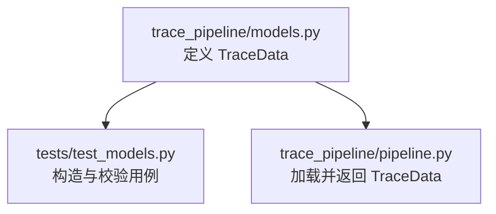
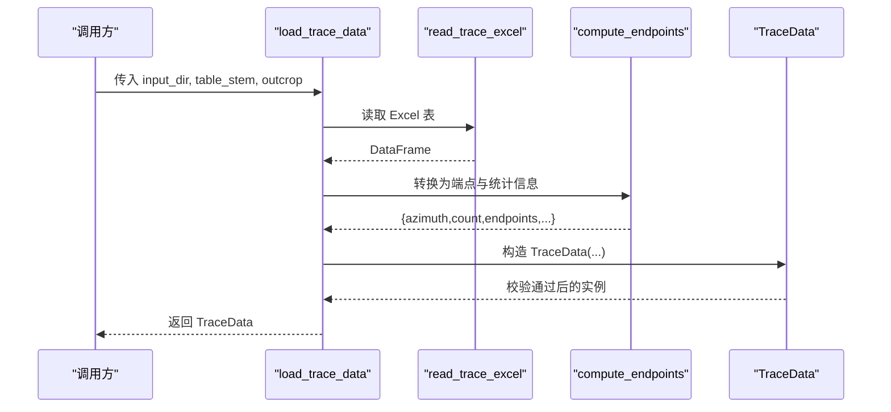
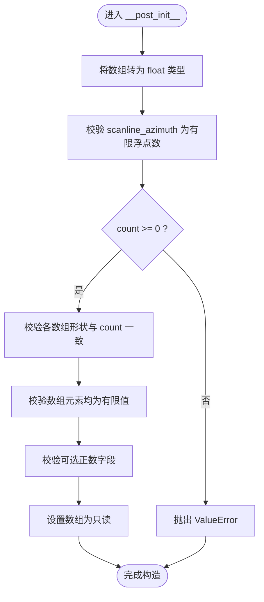
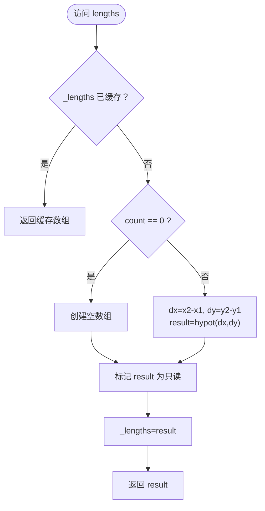
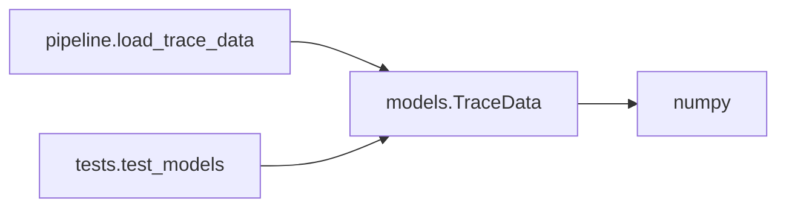

# TraceData 迹线数据模型

<cite>
**本文引用的文件**
- [trace_pipeline/models.py](file://trace_pipeline/models.py)
- [tests/test_models.py](file://tests/test_models.py)
- [trace_pipeline/pipeline.py](file://trace_pipeline/pipeline.py)
</cite>

## 目录
1. [简介](#简介)
2. [项目结构](#项目结构)
3. [核心组件](#核心组件)
4. [架构总览](#架构总览)
5. [详细组件分析](#详细组件分析)
6. [依赖关系分析](#依赖关系分析)
7. [性能考量](#性能考量)
8. [故障排查指南](#故障排查指南)
9. [结论](#结论)
10. [附录](#附录)

## 简介
TraceData 是一个不可变的数据容器，用于承载单张迹线表的完整解析结果。它通过严格的类型与形状校验、NaN/Inf 检查以及可选正数验证，确保内部数据的完整性与一致性；同时提供派生属性 lengths 与 mean_length，以端点坐标计算二维欧氏距离并缓存结果，避免重复计算开销。

## 项目结构
TraceData 定义于 trace_pipeline/models.py，并在单元测试中覆盖构造、校验与只读性断言；在 pipeline 模块中作为加载流程的产物被消费。

图表来源
- [trace_pipeline/models.py:41-156](file://trace_pipeline/models.py#L41-L156)
- [tests/test_models.py:11-97](file://tests/test_models.py#L11-L97)
- [trace_pipeline/pipeline.py:61-95](file://trace_pipeline/pipeline.py#L61-L95)

章节来源
- [trace_pipeline/models.py:41-156](file://trace_pipeline/models.py#L41-L156)
- [tests/test_models.py:11-97](file://tests/test_models.py#L11-L97)
- [trace_pipeline/pipeline.py:61-95](file://trace_pipeline/pipeline.py#L61-L95)

## 核心组件
TraceData 类采用 frozen dataclass 实现不可变性，包含以下字段：
- scanline_azimuth（测线走向角）：float，单位度，必须为有限浮点数。
- count（迹线条数）：int，≥ 0。
- endpoints（端点坐标数组）：np.ndarray，形状 (N, 4)，列序 [x1, y1, x2, y2]，元素必须为有限浮点数。
- joint_strikes（节理走向角）：np.ndarray，长度 N，元素必须为有限浮点数。
- segment_lengths（沿测段长度）：np.ndarray，长度 N，元素必须为有限浮点数。
- scanline_positions（沿测线位移）：np.ndarray，长度 N，元素必须为有限浮点数。
- measured_scanline_length（实测测线长度）：float | None，若提供则必须为正有限浮点数。
- measured_outcrop_area（实测露头面积）：float | None，若提供则必须为正有限浮点数。

所有数值型数组在构造后会被强制转换为 float 类型，并标记为只读（writeable=False），以保证不可变语义。

章节来源
- [trace_pipeline/models.py:41-156](file://trace_pipeline/models.py#L41-L156)

## 架构总览
TraceData 在数据处理流水线中的角色如下：上游读取 Excel 表并进行初步校验与转换，最终组装为 TraceData 实例；下游消费该实例进行统计、绘图与报告生成。

图表来源
- [trace_pipeline/pipeline.py:61-95](file://trace_pipeline/pipeline.py#L61-L95)
- [trace_pipeline/models.py:41-156](file://trace_pipeline/models.py#L41-L156)

## 详细组件分析

### 字段定义与约束
- scanline_azimuth
  - 类型：float
  - 约束：必须为有限浮点数（非 NaN/Inf）。
  - 业务含义：测线的走向角度（度），用于后续旋转与投影等几何处理。
- count
  - 类型：int
  - 约束：≥ 0。
  - 业务含义：迹线条数，决定后续数组的长度维度。
- endpoints
  - 类型：np.ndarray[float]
  - 形状：(count, 4)
  - 列序：[x1, y1, x2, y2]
  - 约束：元素必须为有限浮点数。
  - 业务含义：每条迹线的两个端点坐标，用于计算长度、绘制轨迹等。
- joint_strikes
  - 类型：np.ndarray[float]
  - 长度：count
  - 约束：元素必须为有限浮点数。
  - 业务含义：各条节理的走向角（度），用于玫瑰图与统计分析。
- segment_lengths
  - 类型：np.ndarray[float]
  - 长度：count
  - 约束：元素必须为有限浮点数。
  - 业务含义：沿测段的迹线长度（MATLAB 定义 r5+r7），用于面密度估计等。
- scanline_positions
  - 类型：np.ndarray[float]
  - 长度：count
  - 约束：元素必须为有限浮点数。
  - 业务含义：迹线沿测线的位移（r1），用于空间分布分析。
- measured_scanline_length
  - 类型：float | None
  - 约束：若不为 None，必须为正有限浮点数。
  - 业务含义：实测测线长度（米），缺失时可为 None。
- measured_outcrop_area
  - 类型：float | None
  - 约束：若不为 None，必须为正有限浮点数。
  - 业务含义：实测露头面积（平方米），缺失时可为 None。

章节来源
- [trace_pipeline/models.py:41-156](file://trace_pipeline/models.py#L41-L156)

### __post_init__ 验证逻辑与类型转换
- 类型转换
  - 将 endpoints、joint_strikes、segment_lengths、scanline_positions 统一转换为 float 类型的 numpy 数组，并通过 object.__setattr__ 写回实例，以兼容 frozen dataclass 的不可变语义。
- 基本约束
  - scanline_azimuth 必须为有限浮点数。
  - count 必须 ≥ 0。
  - 四个数组的形状必须与 count 一致（endpoints 为 (count, 4)，其余为 (count,)）。
- 数值有效性
  - 上述四个数组的所有元素必须为有限值（不允许 NaN 或 Inf）。
- 可选正数校验
  - measured_scanline_length 与 measured_outcrop_area 支持 None；若提供，需为正有限浮点数。
- 只读保护
  - 将四个数组的 writeable 标志置为 False，防止外部修改破坏不可变性。

图表来源
- [trace_pipeline/models.py:65-121](file://trace_pipeline/models.py#L65-L121)

章节来源
- [trace_pipeline/models.py:65-121](file://trace_pipeline/models.py#L65-L121)

### lengths 派生属性与缓存机制
- 计算逻辑
  - 基于 endpoints 的列序 [x1, y1, x2, y2]，计算 dx = x2 - x1，dy = y2 - y1，使用 np.hypot(dx, dy) 得到二维欧氏距离，结果为长度 N 的一维数组。
  - 当 count == 0 时，返回空数组。
- 缓存策略
  - 首次访问时计算并写入私有键 _lengths，后续访问直接返回缓存结果。
  - 使用 object.__setattr__ 写入 _lengths，符合 frozen dataclass 的缓存模式。
  - 返回的数组同样设置为只读，保证不可变语义。
- 平均长度
  - mean_length 基于 lengths.mean() 计算；当 count 为 0 时返回 0.0。

图表来源
- [trace_pipeline/models.py:133-151](file://trace_pipeline/models.py#L133-L151)

章节来源
- [trace_pipeline/models.py:133-156](file://trace_pipeline/models.py#L133-L156)

### 构造示例与最佳实践
- 最小构造
  - 提供必填字段：scanline_azimuth、count、endpoints、joint_strikes、segment_lengths、scanline_positions。
  - 可选字段：measured_scanline_length、measured_outcrop_area 可省略或设为 None。
- 常见错误与规避
  - count 与数组长度不一致：确保 endpoints 行数为 count，其他数组长度为 count。
  - 包含 NaN/Inf：在构造前清理数据或使用 np.isfinite 过滤。
  - 负数或非正可选字段：measured_* 字段若提供，必须为正数。
- 只读性与缓存
  - 构造完成后，数组为只读，无法直接修改；如需变更，应重新构造新的 TraceData 实例。
  - lengths 会缓存，多次访问不会重复计算，适合在统计与可视化中频繁使用。

章节来源
- [tests/test_models.py:14-97](file://tests/test_models.py#L14-L97)
- [trace_pipeline/models.py:41-156](file://trace_pipeline/models.py#L41-L156)

## 依赖关系分析
- 模块内依赖
  - TraceData 仅依赖 numpy 进行数值计算与数组操作。
  - 通过 object.__setattr__ 与 __dict__.get 实现不可变对象上的缓存写入。
- 上下游集成
  - 上游：pipeline 模块负责从 Excel 读取与预处理，最终构造 TraceData。
  - 下游：统计、绘图与报告模块消费 TraceData 的字段与派生属性。

图表来源
- [trace_pipeline/models.py:41-156](file://trace_pipeline/models.py#L41-L156)
- [trace_pipeline/pipeline.py:61-95](file://trace_pipeline/pipeline.py#L61-L95)
- [tests/test_models.py:11-97](file://tests/test_models.py#L11-L97)

章节来源
- [trace_pipeline/models.py:41-156](file://trace_pipeline/models.py#L41-L156)
- [trace_pipeline/pipeline.py:61-95](file://trace_pipeline/pipeline.py#L61-L95)
- [tests/test_models.py:11-97](file://tests/test_models.py#L11-L97)

## 性能考量
- 类型转换与形状校验在构造阶段执行一次，避免运行时重复检查。
- lengths 的懒加载与缓存显著降低重复计算的开销，尤其在多次访问的场景下。
- 数组只读标记减少意外修改带来的潜在 bug，提升稳定性。

## 故障排查指南
- 常见异常与定位
  - ValueError("scanline_azimuth 必须为有限浮点数")：检查输入角度是否为有效数值。
  - ValueError("count 不能为负数")：确认 count 为非负整数。
  - ValueError("... 形状 ... 与 count=... 不一致")：核对 endpoints 行数与其他数组长度是否等于 count。
  - ValueError("... 包含 NaN 或 inf")：对输入数据进行清洗，剔除无效值。
  - ValueError("measured_* 必须为正的有限浮点数")：确保可选正数字段为正数或 None。
- 调试建议
  - 打印 count 与各数组 shape，快速定位维度不匹配问题。
  - 使用 np.isfinite 批量检测数组有效性。
  - 在单元测试中复用测试用例的模式构造最小复现样例。

章节来源
- [trace_pipeline/models.py:65-121](file://trace_pipeline/models.py#L65-L121)
- [tests/test_models.py:28-97](file://tests/test_models.py#L28-L97)

## 结论
TraceData 通过严格的数据契约与不可变设计，为迹线数据处理提供了安全、稳定且高效的基础数据结构。其 __post_init__ 验证与 lengths 缓存机制在保证正确性的同时兼顾了性能，适合作为管线中间态的核心载体。

## 附录
- 相关 API 路径参考
  - 构造与校验：[trace_pipeline/models.py:41-156](file://trace_pipeline/models.py#L41-L156)
  - 单元测试用例：[tests/test_models.py:11-97](file://tests/test_models.py#L11-L97)
  - 加载入口：[trace_pipeline/pipeline.py:61-95](file://trace_pipeline/pipeline.py#L61-L95)