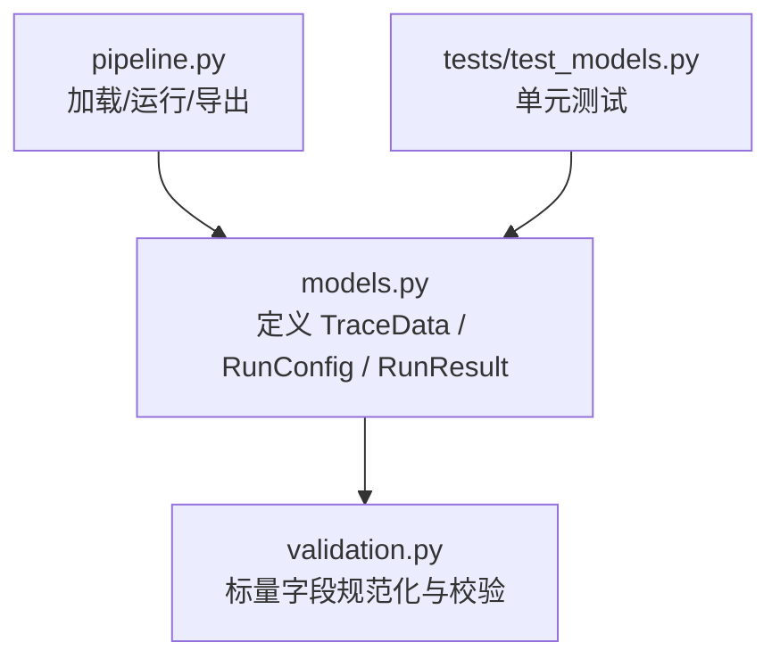
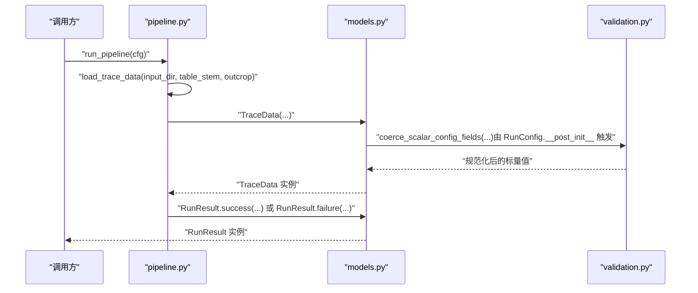
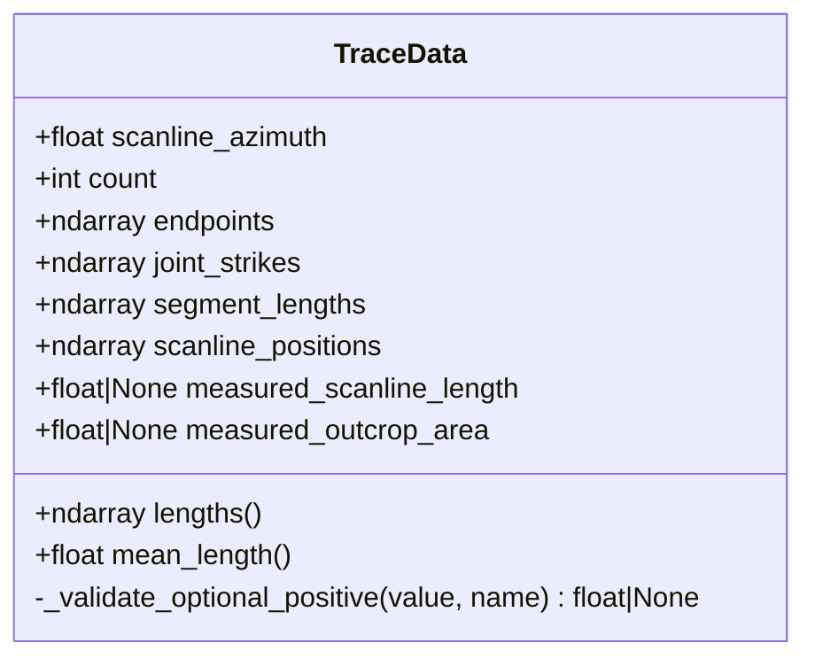
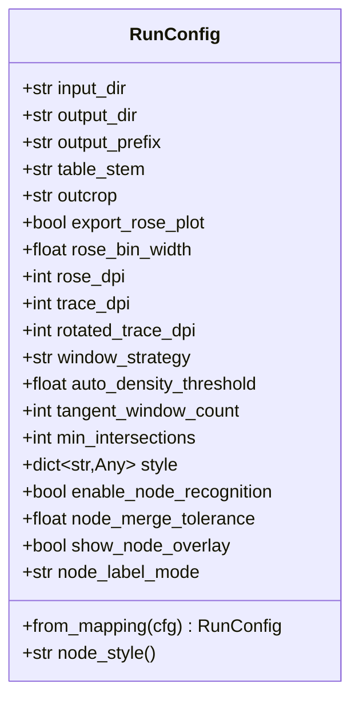
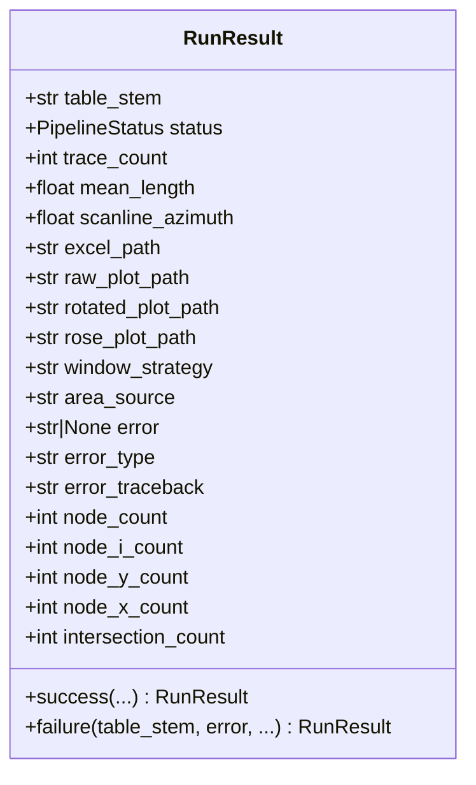
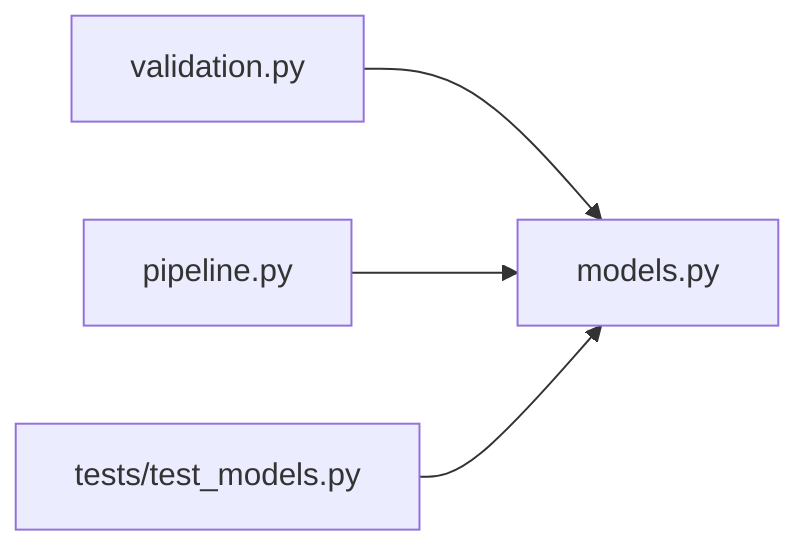

# 核心数据模型

<cite>
**本文引用的文件**   
- [trace_pipeline/models.py](file://trace_pipeline/models.py)
- [trace_pipeline/validation.py](file://trace_pipeline/validation.py)
- [trace_pipeline/pipeline.py](file://trace_pipeline/pipeline.py)
- [tests/test_models.py](file://tests/test_models.py)
</cite>

## 目录
1. [简介](#简介)
2. [项目结构](#项目结构)
3. [核心组件](#核心组件)
4. [架构总览](#架构总览)
5. [详细组件分析](#详细组件分析)
6. [依赖关系分析](#依赖关系分析)
7. [性能考量](#性能考量)
8. [故障排查指南](#故障排查指南)
9. [结论](#结论)
10. [附录：使用示例与最佳实践](#附录使用示例与最佳实践)

## 简介
本文件聚焦于 TracePipeline 的核心不可变数据模型，系统性说明以下三个类的完整定义、字段语义、约束条件与使用方法：
- TraceData：单张迹线表的完整解析结果（不可变）
- RunConfig：单次流水线运行的参数（不可变）
- RunResult：单次流水线运行的结果（不可变）

文档同时解释 frozen dataclass 的不可变性设计原理与实现细节，包括派生属性的计算逻辑与缓存机制，并给出类之间的关系、数据流转过程以及实际使用示例和最佳实践。

## 项目结构
核心数据模型集中在 trace_pipeline/models.py；类型强制与校验工具在 trace_pipeline/validation.py；模型的构造与使用贯穿 pipeline 流程，并在 tests/test_models.py 中有覆盖测试。

图表来源
- [trace_pipeline/models.py:1-352](file://trace_pipeline/models.py#L1-L352)
- [trace_pipeline/validation.py:1-112](file://trace_pipeline/validation.py#L1-L112)
- [trace_pipeline/pipeline.py:61-95](file://trace_pipeline/pipeline.py#L61-L95)
- [tests/test_models.py:1-138](file://tests/test_models.py#L1-L138)

章节来源
- [trace_pipeline/models.py:1-352](file://trace_pipeline/models.py#L1-L352)
- [trace_pipeline/validation.py:1-112](file://trace_pipeline/validation.py#L1-L112)
- [trace_pipeline/pipeline.py:61-95](file://trace_pipeline/pipeline.py#L61-L95)
- [tests/test_models.py:1-138](file://tests/test_models.py#L1-L138)

## 核心组件
本节概述三个核心类的职责与相互关系：
- TraceData：承载解析后的几何与统计信息，提供只读数组与派生属性（如长度、平均长度）。
- RunConfig：封装一次运行所需的全部配置项，提供 from_mapping 工厂方法以从字典安全构建。
- RunResult：记录一次运行的状态与产物路径，并提供 success/failure 便捷构造器。

章节来源
- [trace_pipeline/models.py:38-156](file://trace_pipeline/models.py#L38-L156)
- [trace_pipeline/models.py:162-272](file://trace_pipeline/models.py#L162-L272)
- [trace_pipeline/models.py:278-351](file://trace_pipeline/models.py#L278-L351)

## 架构总览
下图展示核心数据模型在流水线中的位置与交互：RunConfig 驱动流程，load_trace_data 产出 TraceData，最终生成 RunResult。

图表来源
- [trace_pipeline/pipeline.py:61-95](file://trace_pipeline/pipeline.py#L61-L95)
- [trace_pipeline/models.py:162-272](file://trace_pipeline/models.py#L162-L272)
- [trace_pipeline/models.py:278-351](file://trace_pipeline/models.py#L278-L351)
- [trace_pipeline/validation.py:90-112](file://trace_pipeline/validation.py#L90-L112)

## 详细组件分析

### TraceData：不可变的迹线数据容器
- 设计目标
  - 作为“已解析”的数据载体，保证构造后不可变，避免下游误改。
  - 对数值数组进行严格形状与数值有效性校验，并将底层数组设为只读。
- 字段与约束
  - scanline_azimuth：浮点，必须为有限数。
  - count：整数，≥ 0。
  - endpoints：(N, 4) 浮点矩阵，列序 [x1, y1, x2, y2]，元素必须有限。
  - joint_strikes：长度 N 的浮点向量，元素必须有限。
  - segment_lengths：长度 N 的浮点向量，元素必须有限。
  - scanline_positions：长度 N 的浮点向量，元素必须有限。
  - measured_scanline_length：可选正浮点数或 None。
  - measured_outcrop_area：可选正浮点数或 None。
- 构造与验证
  - __post_init__ 中完成：
    - 将输入数组统一转为 float 类型。
    - 校验 count 非负、各数组形状与 count 一致、所有数值有限。
    - 校验可选正数字段为正且有限。
    - 将内部数组标记为只写关闭（writeable=False），增强不可变性。
- 派生属性与缓存
  - lengths：基于端点坐标计算的二维欧氏距离 (N,)，首次访问时计算并缓存到私有字段 _lengths，后续直接返回缓存。
  - mean_length：基于 lengths 的平均值，count=0 时返回 0.0。
- 复杂度
  - lengths 计算时间 O(N)，空间 O(N)。
  - 缓存命中后读取时间 O(1)。
- 错误处理
  - 违反约束时抛出 ValueError，包含明确的中文提示。

图表来源
- [trace_pipeline/models.py:41-156](file://trace_pipeline/models.py#L41-L156)

章节来源
- [trace_pipeline/models.py:41-156](file://trace_pipeline/models.py#L41-L156)
- [tests/test_models.py:11-97](file://tests/test_models.py#L11-L97)

### RunConfig：不可变的运行配置
- 设计目标
  - 集中管理一次运行所需的参数，确保构造后不可变。
  - 提供 from_mapping 工厂方法，从外部配置字典安全构建，忽略未知键。
- 字段与默认值
  - 必填字符串字段：input_dir、output_dir、output_prefix、table_stem、outcrop（空串将被拒绝）。
  - 布尔开关：export_rose_plot、enable_node_recognition、show_node_overlay。
  - 数值型：rose_bin_width、rose_dpi、trace_dpi、rotated_trace_dpi、auto_density_threshold、tangent_window_count、min_intersections、node_merge_tolerance。
  - 策略与模式：window_strategy、node_label_mode。
  - style：dict[str, Any]，用于样式覆盖。
- 构造与验证
  - __post_init__ 中：
    - 对关键字符串字段执行 strip 并判空。
    - 通过 coerce_scalar_config_fields 对一系列标量字段进行类型强制与范围检查。
    - 额外业务校验：node_merge_tolerance 必须大于 0。
- 工厂方法与便利属性
  - from_mapping：仅提取已知字段，缺失可选字段回退到 dataclass 默认值；若 style 存在且 node_label_mode 未显式传入，则从 style 中读取默认值。
  - node_style：从 style 中读取节点样式预设。
- 复杂度
  - 构造与校验均为 O(1)（按字段数量线性）。
- 错误处理
  - 非法值或空串会抛出 ValueError，消息明确。

图表来源
- [trace_pipeline/models.py:162-272](file://trace_pipeline/models.py#L162-L272)
- [trace_pipeline/validation.py:90-112](file://trace_pipeline/validation.py#L90-L112)

章节来源
- [trace_pipeline/models.py:162-272](file://trace_pipeline/models.py#L162-L272)
- [trace_pipeline/validation.py:90-112](file://trace_pipeline/validation.py#L90-L112)
- [tests/test_models.py:100-137](file://tests/test_models.py#L100-L137)

### RunResult：不可变的运行结果
- 设计目标
  - 以不可变方式记录一次运行的状态、统计数据与产物路径。
- 字段与默认值
  - 标识：table_stem。
  - 状态：status（枚举 SUCCESS/ERROR）。
  - 统计：trace_count、mean_length、scanline_azimuth、node_*、intersection_count。
  - 产物路径：excel_path、raw_plot_path、rotated_plot_path、rose_plot_path。
  - 元信息：window_strategy、area_source。
  - 错误信息：error、error_type、error_traceback。
- 便捷构造器
  - success：成功路径，设置 status=SUCCESS，error=None。
  - failure：失败路径，设置 status=ERROR，并携带错误信息。
- 复杂度
  - 构造为 O(1)。
- 错误处理
  - 通过 status 与 error 字段表达异常场景，便于上层统一处理。

图表来源
- [trace_pipeline/models.py:278-351](file://trace_pipeline/models.py#L278-L351)

章节来源
- [trace_pipeline/models.py:278-351](file://trace_pipeline/models.py#L278-L351)

## 依赖关系分析
- models.py 依赖 validation.py 的标量字段规范化函数，用于 RunConfig 的构造期校验。
- pipeline.py 消费 models.py 的三个核心类，负责从 Excel 读取数据并组装 TraceData，最终以 RunResult 输出。
- tests/test_models.py 对 TraceData 与 RunConfig 的构造与校验进行断言，保障行为稳定。

图表来源
- [trace_pipeline/models.py:1-352](file://trace_pipeline/models.py#L1-L352)
- [trace_pipeline/validation.py:1-112](file://trace_pipeline/validation.py#L1-L112)
- [trace_pipeline/pipeline.py:61-95](file://trace_pipeline/pipeline.py#L61-L95)
- [tests/test_models.py:1-138](file://tests/test_models.py#L1-L138)

章节来源
- [trace_pipeline/models.py:1-352](file://trace_pipeline/models.py#L1-L352)
- [trace_pipeline/validation.py:1-112](file://trace_pipeline/validation.py#L1-L112)
- [trace_pipeline/pipeline.py:61-95](file://trace_pipeline/pipeline.py#L61-L95)
- [tests/test_models.py:1-138](file://tests/test_models.py#L1-L138)

## 性能考量
- TraceData.lengths 采用懒计算与缓存：
  - 首次访问时计算并写入私有字段，后续直接返回，避免重复计算。
  - 返回的 ndarray 被标记为只读，防止意外修改影响缓存一致性。
- RunConfig.from_mapping 仅提取已知字段，忽略多余键，减少无效赋值与校验开销。
- 整体构造与校验为常数级开销，适合在批量任务中频繁创建。

[本节为通用性能讨论，不直接分析具体文件]

## 故障排查指南
- TraceData 构造失败常见原因
  - count 为负数或与其他数组长度不一致。
  - endpoints/joint_strikes/segment_lengths/scanline_positions 包含 NaN 或 inf。
  - measured_scanline_length/measured_outcrop_area 为非正有限数。
- RunConfig 构造失败常见原因
  - 必填字符串字段为空。
  - 标量字段类型或范围不合法（例如 DPI 非正整数、窗口策略不在允许集合内等）。
  - node_merge_tolerance 不大于 0。
- 建议定位步骤
  - 捕获 ValueError 并打印字段名与错误消息。
  - 使用 from_mapping 逐步缩小问题范围，先最小化配置再逐项添加。
  - 对于 TraceData，优先检查输入 Excel 的前几行是否为数值列，并确保列数满足要求。

章节来源
- [trace_pipeline/models.py:65-129](file://trace_pipeline/models.py#L65-L129)
- [trace_pipeline/models.py:202-232](file://trace_pipeline/models.py#L202-L232)
- [tests/test_models.py:28-71](file://tests/test_models.py#L28-L71)

## 结论
TraceData、RunConfig、RunResult 三个不可变数据类构成了 TracePipeline 的核心数据契约。通过 frozen dataclass 与严格的 __post_init__ 校验，系统在构造期即拦截非法状态，结合派生属性缓存与只读数组，既保证了安全性也兼顾了性能。配合 validation.py 的标量规范化能力，使得配置与数据的健壮性得到统一保障。

[本节为总结性内容，不直接分析具体文件]

## 附录：使用示例与最佳实践

### 构造 TraceData 的步骤
- 准备输入数组：
  - endpoints 为 (N, 4) 的浮点矩阵。
  - joint_strikes、segment_lengths、scanline_positions 长度为 N 的浮点向量。
- 设置 count 与 scanline_azimuth，确保 count 与数组行数一致。
- 可选设置 measured_scanline_length/measured_outcrop_area 为正浮点数或 None。
- 构造后：
  - 使用 lengths 获取端点距离，注意其会被缓存。
  - 使用 mean_length 获取平均长度。

章节来源
- [trace_pipeline/models.py:41-156](file://trace_pipeline/models.py#L41-L156)
- [tests/test_models.py:14-97](file://tests/test_models.py#L14-L97)

### 构造 RunConfig 的方式
- 直接构造：
  - 传入必填字符串字段与必要的开关/数值字段。
- 从映射构造：
  - 使用 RunConfig.from_mapping(cfg)，cfg 可包含任意键，但仅已知键会被提取。
  - 若 style 中存在 node_label_mode 且未在顶层传入，将从 style 中读取。
- 注意事项：
  - 所有标量字段会在 __post_init__ 中被规范化与校验。
  - 未知键会被忽略，不会导致构造失败。

章节来源
- [trace_pipeline/models.py:236-267](file://trace_pipeline/models.py#L236-L267)
- [tests/test_models.py:123-137](file://tests/test_models.py#L123-L137)

### 生成 RunResult 的建议
- 成功路径：
  - 使用 RunResult.success(...)，填充统计与产物路径。
- 失败路径：
  - 使用 RunResult.failure(...)，携带错误信息与类型。
- 上层处理：
  - 根据 status 判断是否继续后续步骤。
  - 在 UI 或日志中展示 error/error_type/error_traceback。

章节来源
- [trace_pipeline/models.py:302-351](file://trace_pipeline/models.py#L302-L351)

### 在流水线中的典型用法
- 加载数据：
  - 调用 load_trace_data(input_dir, table_stem, outcrop) 获得 TraceData。
- 运行流程：
  - 使用 RunConfig 驱动 run_pipeline，最终返回 RunResult。
- 结果消费：
  - 读取 RunResult 中的路径与统计信息，用于报表或可视化。

章节来源
- [trace_pipeline/pipeline.py:61-95](file://trace_pipeline/pipeline.py#L61-L95)