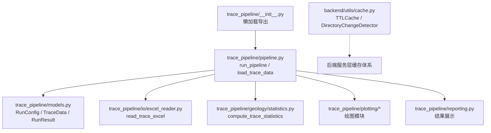
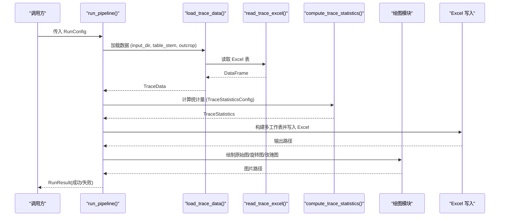
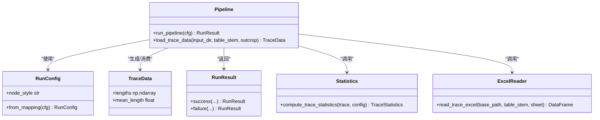

# 核心流水线 API

<cite>
**本文引用的文件**   
- [pipeline.py](file://trace_pipeline/pipeline.py)
- [models.py](file://trace_pipeline/models.py)
- [config.py](file://trace_pipeline/config.py)
- [excel_reader.py](file://trace_pipeline/io/excel_reader.py)
- [statistics.py](file://trace_pipeline/geology/statistics.py)
- [__init__.py](file://trace_pipeline/__init__.py)
- [cache.py](file://backend/utils/cache.py)
- [test_pipeline.py](file://tests/test_pipeline.py)
- [config.example.json](file://config.example.json)
</cite>

## 目录
1. [简介](#简介)
2. [项目结构](#项目结构)
3. [核心组件](#核心组件)
4. [架构总览](#架构总览)
5. [详细组件分析](#详细组件分析)
6. [依赖关系分析](#依赖关系分析)
7. [性能与缓存](#性能与缓存)
8. [故障排查指南](#故障排查指南)
9. [结论](#结论)
10. [附录：使用示例](#附录使用示例)

## 简介
本文件聚焦于 TracePipeline 的核心流水线 API，重点记录以下能力：
- run_pipeline() 的完整接口规范、参数类型、返回值与异常处理
- load_trace_data() 的完整接口规范、输入输出与缓存机制
- RunConfig 配置对象的所有参数选项（输入/输出路径、处理策略、绘图设置等）
- TraceData 数据模型的属性与计算方法
- 从数据加载到结果输出的端到端流程说明
- 缓存机制的工作原理与性能优化效果

## 项目结构
TracePipeline 采用分层模块化设计，核心流水线位于 trace_pipeline 包内，关键模块职责如下：
- models.py：定义不可变数据模型 TraceData、RunConfig、RunResult
- pipeline.py：编排单目标全流程（加载→变换→统计→导出→绘图），暴露 run_pipeline() 与 load_trace_data()
- config.py：配置加载、校验、路径解析与 CLI 覆盖合并
- io/excel_reader.py：Excel 迹线表读取与格式校验
- geology/statistics.py：统计指标计算（P10/P20/P21、面积回退、圆窗策略等）
- __init__.py：对外懒加载导出，统一入口
- backend/utils/cache.py：TTL + LRU 缓存工具（服务层通用）

图表来源
- [__init__.py:31-58](file://trace_pipeline/__init__.py#L31-L58)
- [pipeline.py:230-474](file://trace_pipeline/pipeline.py#L230-L474)
- [models.py:162-352](file://trace_pipeline/models.py#L162-L352)
- [excel_reader.py:36-106](file://trace_pipeline/io/excel_reader.py#L36-L106)
- [statistics.py:212-391](file://trace_pipeline/geology/statistics.py#L212-L391)
- [cache.py:18-90](file://backend/utils/cache.py#L18-L90)

章节来源
- [__init__.py:1-83](file://trace_pipeline/__init__.py#L1-L83)
- [pipeline.py:1-474](file://trace_pipeline/pipeline.py#L1-L474)
- [models.py:1-352](file://trace_pipeline/models.py#L1-L352)
- [config.py:1-326](file://trace_pipeline/config.py#L1-L326)
- [excel_reader.py:1-169](file://trace_pipeline/io/excel_reader.py#L1-L169)
- [statistics.py:1-391](file://trace_pipeline/geology/statistics.py#L1-L391)
- [cache.py:1-155](file://backend/utils/cache.py#L1-L155)

## 核心组件
本节概述核心函数与数据模型，后续章节将给出更详细的接口规范与流程图。

- run_pipeline(cfg: RunConfig) -> RunResult
  - 功能：对单个露头执行“加载 → 坐标变换+统计 → 节点识别(可选) → Excel 导出 → 绘图”的全流程。
  - 返回：RunResult，包含成功/失败状态、统计摘要、产物路径等。
  - 异常：内部捕获并转换为错误结果；部分异常会直接上抛（如内存不足、中断）。

- load_trace_data(input_dir: str, table_stem: str, outcrop: str) -> TraceData
  - 功能：读取迹线 Excel 表，解析为 TraceData；按文件签名进行 lru_cache 缓存。
  - 返回：TraceData，包含端点、走向、长度、位置等字段。
  - 异常：找不到输入文件或读取失败时抛出 FileNotFoundError/ValueError。

- RunConfig
  - 作用：封装单次运行所需的全部参数，含输入输出路径、处理策略、绘图 DPI、节点识别开关等。
  - 构造：支持 from_mapping(cfg_dict) 工厂方法，自动规范化与校验。

- TraceData
  - 作用：不可变的数据容器，承载原始解析结果与派生属性（如 lengths、mean_length）。
  - 校验：在构造时严格检查形状、数值有效性、非负计数等。

章节来源
- [pipeline.py:80-96](file://trace_pipeline/pipeline.py#L80-L96)
- [pipeline.py:230-474](file://trace_pipeline/pipeline.py#L230-L474)
- [models.py:162-352](file://trace_pipeline/models.py#L162-L352)
- [models.py:41-157](file://trace_pipeline/models.py#L41-L157)

## 架构总览
下图展示了 run_pipeline() 的关键调用链与阶段划分，以及各阶段的输入输出。

图表来源
- [pipeline.py:230-474](file://trace_pipeline/pipeline.py#L230-L474)
- [excel_reader.py:36-106](file://trace_pipeline/io/excel_reader.py#L36-L106)
- [statistics.py:212-391](file://trace_pipeline/geology/statistics.py#L212-L391)

## 详细组件分析

### 函数：load_trace_data()
- 函数签名
  - 输入：
    - input_dir: str — 输入目录绝对路径
    - table_stem: str — 迹线表文件名（不含扩展名）
    - outcrop: str — 露头标识（用于日志与定位）
  - 返回：TraceData
  - 异常：
    - FileNotFoundError：未找到 .xlsx/.xls 文件
    - ValueError：文件存在但无法读取或格式不合法

- 行为说明
  - 定位输入文件：优先 .xlsx，缺失则回退 .xls
  - 基于文件签名（mtime_ns、size）进行 lru_cache 缓存，避免重复解析
  - 读取后计算端点与基础统计信息，组装为 TraceData
  - 记录加载耗时与关键摘要（迹线条数、走向角、平均长度）

- 缓存机制
  - 使用 @lru_cache(maxsize=16) 装饰器缓存 _load_trace_data_cached
  - 缓存键由 (path.parent, table_stem, outcrop, mtime_ns, size) 组成
  - 当输入文件内容或元数据变化时，缓存失效并重新计算

- 典型异常场景
  - 输入目录不存在或文件命名不匹配：抛出 FileNotFoundError
  - Excel 过大或列数不足：抛出 TraceValidationError/ValueError（被上层捕获并转为错误结果）

章节来源
- [pipeline.py:61-96](file://trace_pipeline/pipeline.py#L61-L96)
- [excel_reader.py:36-106](file://trace_pipeline/io/excel_reader.py#L36-L106)

### 函数：run_pipeline()
- 函数签名
  - 输入：cfg: RunConfig
  - 返回：RunResult
  - 异常：
    - PermissionError：输出文件被占用或权限不足（友好提示）
    - FileNotFoundError：输入文件不存在（友好提示）
    - ValueError/KeyError/TypeError/IndexError/OSError：数据处理异常（记录错误）
    - MemoryError/KeyboardInterrupt：直接上抛，不做包装

- 处理阶段
  1) 数据加载：调用 load_trace_data() 获取 TraceData
  2) 坐标变换与统计：
     - 归一化坐标与旋转
     - 计算 TraceStatistics（P10/P20/P21、面积回退、窗口策略）
     - 构建圆窗覆盖层与凸包覆盖层
  3) 节点识别（可选）：根据 enable_node_recognition 决定是否执行
  4) Excel 导出：构建多工作表并写入 {output_prefix}_traces.xlsx
  5) 绘图：
     - 原始迹线图
     - 旋转迹线图
     - 玫瑰图（可选）

- 返回值 RunResult
  - 成功：status="success"，包含 trace_count、mean_length、scanline_azimuth、产物路径、window_strategy、area_source、节点统计等
  - 失败：status="error"，包含 error、error_type、error_traceback

- 子进程安全
  - 若由多进程池调用，初始化非交互 matplotlib 后端与样式，确保跨进程稳定

章节来源
- [pipeline.py:230-474](file://trace_pipeline/pipeline.py#L230-L474)

### 数据模型：RunConfig
- 字段清单与默认值
  - input_dir: str — 必填，输入目录绝对路径
  - output_dir: str — 必填，输出目录绝对路径
  - output_prefix: str — 必填，输出文件前缀
  - table_stem: str — 必填，迹线表文件名（不含扩展名）
  - outcrop: str — 必填，露头标识
  - export_rose_plot: bool = False — 是否导出玫瑰图
  - rose_bin_width: float = 10.0 — 玫瑰图分箱宽度（度）
  - rose_dpi: int = 600 — 玫瑰图分辨率
  - trace_dpi: int = 600 — 原始迹线图分辨率
  - rotated_trace_dpi: int = 600 — 旋转迹线图分辨率
  - window_strategy: str = "auto" — 圆窗策略（auto/tangent/hybrid/concentric）
  - auto_density_threshold: float = 5.0 — auto 策略密度阈值
  - tangent_window_count: int = 3 — tangent 策略切圆数量
  - min_intersections: int = 5 — 最小交点数
  - style: dict[str, Any] = {} — 样式覆盖字典
  - enable_node_recognition: bool = False — 启用节点识别
  - node_merge_tolerance: float = 0.01 — 节点合并容差（必须 > 0）
  - show_node_overlay: bool = True — 显示节点覆盖层
  - node_label_mode: str = "type" — 节点标签模式

- 工厂方法
  - from_mapping(cfg: Mapping[str, Any]) -> RunConfig
    - 仅提取已知字段，忽略多余键
    - 若 style 中存在 node_label_mode，且未显式提供，则回退到 style.node_label_mode
    - 执行字段级校验与类型转换

- 约束与校验
  - 必填字段不能为空字符串
  - node_merge_tolerance 必须大于 0
  - 标量字段通过 coerce_scalar_config_fields 进行类型强制转换

章节来源
- [models.py:162-273](file://trace_pipeline/models.py#L162-L273)
- [config.py:56-79](file://trace_pipeline/config.py#L56-L79)
- [config.example.json:1-26](file://config.example.json#L1-L26)

### 数据模型：TraceData
- 字段清单
  - scanline_azimuth: float — 测线走向角（度），已规范化到 [0, 360)
  - count: int — 迹线条数，≥ 0
  - endpoints: np.ndarray — 端点坐标 (N, 4)，列序 [x1, y1, x2, y2]
  - joint_strikes: np.ndarray — 各节理走向角（度），长度 N
  - segment_lengths: np.ndarray — 沿测段的迹线长度 r5+r7，长度 N
  - scanline_positions: np.ndarray — 沿测线位移 r1，长度 N
  - measured_scanline_length: float | None — 实测测线长度（m），可选
  - measured_outcrop_area: float | None — 实测露头面积（m²），可选

- 派生属性与计算方法
  - lengths: np.ndarray — 端点间欧氏距离 (N,)，首次访问后缓存
  - mean_length: float — 平均迹线长度（基于 lengths）

- 构造期校验
  - 形状一致性：endpoints/joint_strikes/segment_lengths/scanline_positions 长度均等于 count
  - 数值有效性：所有数组元素必须为有限浮点数（无 NaN/inf）
  - 可选正数校验：measured_* 字段若提供，必须为正有限浮点数
  - 不可变性：构造后将数组标记为只读

章节来源
- [models.py:41-157](file://trace_pipeline/models.py#L41-L157)

### 数据模型：RunResult
- 字段清单
  - table_stem: str
  - status: PipelineStatus = SUCCESS
  - trace_count: int
  - mean_length: float
  - scanline_azimuth: float
  - excel_path: str
  - raw_plot_path: str
  - rotated_plot_path: str
  - rose_plot_path: str
  - window_strategy: str
  - area_source: str
  - error: str | None
  - error_type: str
  - error_traceback: str
  - node_count: int
  - node_i_count: int
  - node_y_count: int
  - node_x_count: int
  - intersection_count: int

- 工厂方法
  - success(...)：成功结果，填充统计与产物路径
  - failure(table_stem, error, error_type="", error_traceback="")：失败结果，携带错误信息

章节来源
- [models.py:278-352](file://trace_pipeline/models.py#L278-L352)

### 统计计算：compute_trace_statistics()
- 输入：TraceData 与 TraceStatisticsConfig（可选）
- 输出：TraceStatistics（包含 P10/P20/P21、面积来源、窗口策略、诊断信息等）
- 关键逻辑
  - 测线长度来源：优先实测，否则估计
  - 面积四级回退：实测 → 凸包 → 缓冲凸包 → 圆窗等效面积
  - 迹长总长度回退：观测（segment/endpoint）→ 窗口估计
  - 自适应阈值：样本量越大，一致性校验越严格
  - 一致性校验：主 P20/P21 与圆窗估计差异超过阈值时发出警告

章节来源
- [statistics.py:212-391](file://trace_pipeline/geology/statistics.py#L212-L391)

## 依赖关系分析
- 模块耦合
  - pipeline.py 作为编排中心，依赖 models、io、geology、plotting、reporting
  - models.py 独立定义不可变数据结构，供其他模块消费
  - io/excel_reader.py 负责 Excel 读取与格式校验
  - geology/statistics.py 提供纯函数式统计计算
  - plotting/* 负责可视化渲染
- 外部依赖
  - numpy、pandas、openpyxl/xlrd（Excel 引擎）、matplotlib（绘图）
- 潜在循环依赖
  - 当前结构清晰，未见循环导入；通过 __init__.py 懒加载进一步降低启动开销

图表来源
- [models.py:162-352](file://trace_pipeline/models.py#L162-L352)
- [pipeline.py:230-474](file://trace_pipeline/pipeline.py#L230-L474)
- [statistics.py:212-391](file://trace_pipeline/geology/statistics.py#L212-L391)
- [excel_reader.py:36-106](file://trace_pipeline/io/excel_reader.py#L36-L106)

章节来源
- [__init__.py:31-58](file://trace_pipeline/__init__.py#L31-L58)
- [pipeline.py:1-474](file://trace_pipeline/pipeline.py#L1-L474)

## 性能与缓存
- 数据加载缓存
  - load_trace_data() 使用 @lru_cache(maxsize=16) 对 _load_trace_data_cached 进行缓存
  - 缓存键包含文件父目录、表名、露头名、mtime_ns、size，确保内容变更即失效
  - 适用场景：同一批露头多次处理或 GUI 预览时快速重算

- 服务层缓存（TTL + LRU）
  - backend/utils/cache.py 提供 TTLCache 与 DirectoryChangeDetector
  - TTLCache：线程安全，支持过期淘汰与最大条目限制，批量驱逐减少扫描开销
  - DirectoryChangeDetector：浅层快照检测目录变更，避免不必要重算

- 性能建议
  - 合理设置 rose_dpi/trace_dpi/rotated_trace_dpi，高 DPI 会显著增加绘图时间
  - 大数据集下可关闭节点识别以减少额外计算
  - 利用缓存避免重复解析相同 Excel 文件

章节来源
- [pipeline.py:61-96](file://trace_pipeline/pipeline.py#L61-L96)
- [cache.py:18-90](file://backend/utils/cache.py#L18-L90)

## 故障排查指南
- 常见错误与处理
  - 输入文件不存在：FileNotFoundError，请检查 input_dir 与 table_stem 是否正确
  - 输出文件被占用：PermissionError，关闭已打开的 Excel/WPS 后重试
  - Excel 过大或格式不合法：TraceValidationError/ValueError，检查文件大小与列数
  - 内存不足：MemoryError，考虑减少 DPI 或分批处理
  - 用户中断：KeyboardInterrupt，程序直接退出

- 调试建议
  - 查看结构化日志（JSON Lines），关注 stage 与 duration_ms 字段
  - 使用 RunResult.error/error_type/error_traceback 定位具体异常
  - 对于统计不一致，检查 window_validation_warning 与 area_source 来源链

章节来源
- [pipeline.py:98-130](file://trace_pipeline/pipeline.py#L98-L130)
- [excel_reader.py:128-169](file://trace_pipeline/io/excel_reader.py#L128-L169)

## 结论
TracePipeline 的核心流水线 API 提供了从数据加载到结果输出的完整自动化流程。通过严格的不可变数据模型、完善的配置校验与多级缓存机制，系统在易用性与性能之间取得良好平衡。建议在大规模处理中充分利用缓存与并行能力，并根据实际需求调整绘图 DPI 与节点识别开关以优化整体吞吐。

## 附录：使用示例
以下为端到端使用示例（概念性描述，不包含代码片段）：
- 准备输入
  - 在 input/ 目录下放置名为 {outcrop}_process.xlsx 的迹线表
  - 复制 config.example.json 为 config.json，按需修改 input_dir/output_dir/outcrop/table_stem 等字段
- 运行流水线
  - 构造 RunConfig，指定 input_dir、output_dir、output_prefix、table_stem、outcrop
  - 调用 run_pipeline(cfg)，获取 RunResult
  - 检查 result.status 是否为 SUCCESS，并读取 excel_path/raw_plot_path/rotated_plot_path/rose_plot_path
- 验证结果
  - 打开导出的 Excel，确认多工作表内容与统计指标
  - 查看生成的 PNG 图片，确认迹线图与玫瑰图质量
- 性能优化
  - 若重复处理相同数据，利用 load_trace_data() 的 lru_cache 加速
  - 在服务层结合 TTLCache 与 DirectoryChangeDetector 实现目录级缓存失效

章节来源
- [test_pipeline.py:49-125](file://tests/test_pipeline.py#L49-L125)
- [config.example.json:1-26](file://config.example.json#L1-L26)