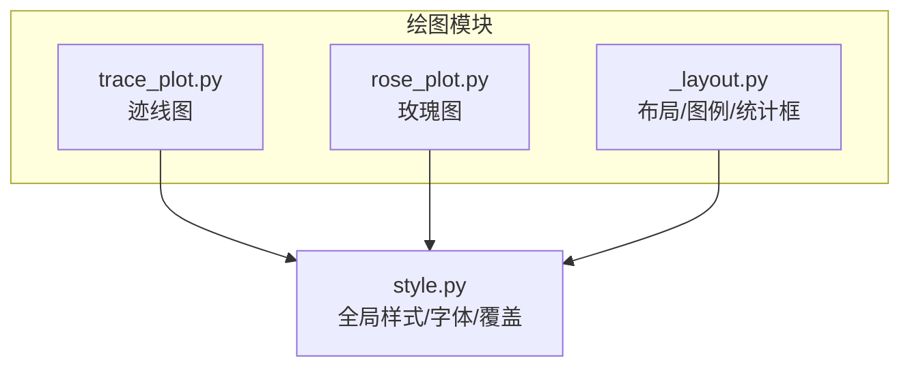
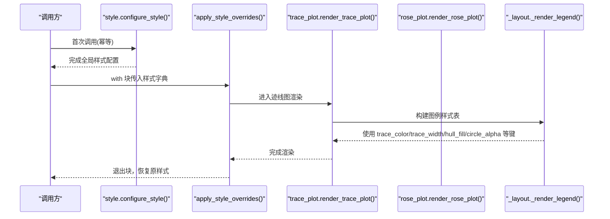
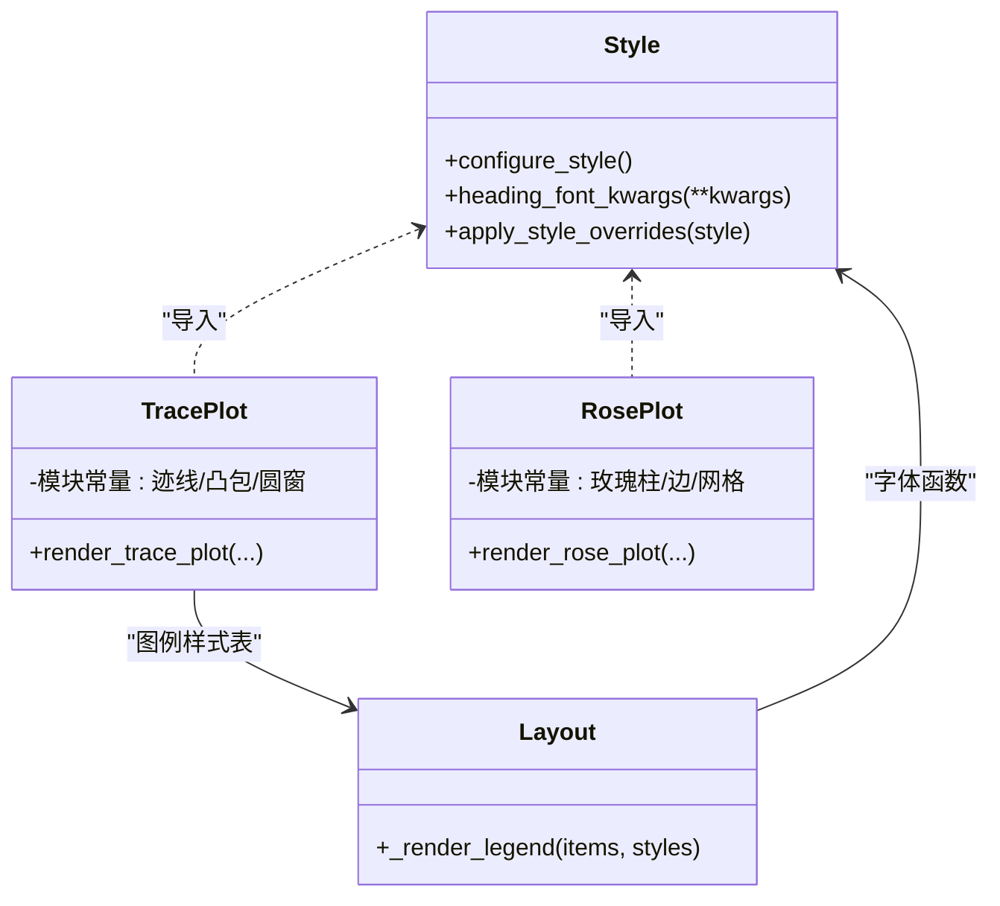

# 样式系统 API

<cite>
**本文引用的文件**   
- [trace_pipeline/plotting/style.py](file://trace_pipeline/plotting/style.py)
- [trace_pipeline/plotting/trace_plot.py](file://trace_pipeline/plotting/trace_plot.py)
- [trace_pipeline/plotting/rose_plot.py](file://trace_pipeline/plotting/rose_plot.py)
- [trace_pipeline/plotting/_layout.py](file://trace_pipeline/plotting/_layout.py)
- [README.md](file://README.md)
</cite>

## 目录
1. [简介](#简介)
2. [项目结构](#项目结构)
3. [核心组件](#核心组件)
4. [架构总览](#架构总览)
5. [详细组件分析](#详细组件分析)
6. [依赖关系分析](#依赖关系分析)
7. [性能与并发特性](#性能与并发特性)
8. [主题定制指南](#主题定制指南)
9. [最佳实践与常见问题](#最佳实践与常见问题)
10. [结论](#结论)

## 简介
本文件为 TracePipeline 样式系统的完整 API 文档，聚焦于 matplotlib 全局样式配置、字体策略、颜色与线条样式的覆盖机制，以及在不同图表类型（迹线图、玫瑰图）中的应用差异。文档涵盖：
- configure_style() 的全局样式配置机制
- heading_font_kwargs() 的字体参数与默认值
- 样式字典键值语义与取值范围
- 样式继承与覆盖流程
- 主题定制方法与最佳实践

## 项目结构
样式系统位于 plotting 子包中，核心由 style.py 提供全局样式与覆盖能力；trace_plot.py 与 rose_plot.py 分别实现两类图表渲染；_layout.py 提供共享布局与图例绘制逻辑，并在图例中消费样式字典键。

图示来源
- [trace_pipeline/plotting/style.py:187-255](file://trace_pipeline/plotting/style.py#L187-L255)
- [trace_pipeline/plotting/trace_plot.py:443-565](file://trace_pipeline/plotting/trace_plot.py#L443-L565)
- [trace_pipeline/plotting/rose_plot.py:106-140](file://trace_pipeline/plotting/rose_plot.py#L106-L140)
- [trace_pipeline/plotting/_layout.py:447-568](file://trace_pipeline/plotting/_layout.py#L447-L568)

章节来源
- [trace_pipeline/plotting/style.py:1-296](file://trace_pipeline/plotting/style.py#L1-L296)
- [trace_pipeline/plotting/trace_plot.py:1-565](file://trace_pipeline/plotting/trace_plot.py#L1-L565)
- [trace_pipeline/plotting/rose_plot.py:1-140](file://trace_pipeline/plotting/rose_plot.py#L1-L140)
- [trace_pipeline/plotting/_layout.py:1-653](file://trace_pipeline/plotting/_layout.py#L1-L653)

## 核心组件
- configure_style(): 初始化并缓存 matplotlib 全局样式（字体族、数学文本字体、线宽、字号、DPI 等），幂等且线程安全。
- heading_font_kwargs(): 返回标题字体参数，优先 Times New Roman，中文回退黑体，自动规避缺失字重导致的警告。
- apply_style_overrides(style): 线程安全的上下文管理器，临时覆盖模块级样式常量与全局字号，退出时恢复。

章节来源
- [trace_pipeline/plotting/style.py:187-255](file://trace_pipeline/plotting/style.py#L187-L255)
- [trace_pipeline/plotting/style.py:135-154](file://trace_pipeline/plotting/style.py#L135-L154)
- [trace_pipeline/plotting/style.py:258-296](file://trace_pipeline/plotting/style.py#L258-L296)

## 架构总览
样式系统通过“全局默认 + 局部覆盖”的方式工作：
- 全局默认：configure_style() 设置 rcParams 与字体栈
- 模块常量：各绘图模块定义默认颜色/线宽等常量
- 运行时覆盖：apply_style_overrides() 将用户样式映射到模块常量，并临时调整全局字号
- 图例消费：_layout.py 的图例绘制读取样式字典键以生成图例图标

图示来源
- [trace_pipeline/plotting/style.py:187-255](file://trace_pipeline/plotting/style.py#L187-L255)
- [trace_pipeline/plotting/style.py:258-296](file://trace_pipeline/plotting/style.py#L258-L296)
- [trace_pipeline/plotting/trace_plot.py:443-565](file://trace_pipeline/plotting/trace_plot.py#L443-L565)
- [trace_pipeline/plotting/rose_plot.py:106-140](file://trace_pipeline/plotting/rose_plot.py#L106-L140)
- [trace_pipeline/plotting/_layout.py:447-568](file://trace_pipeline/plotting/_layout.py#L447-L568)

## 详细组件分析

### configure_style() 样式配置机制
- 功能要点
  - 检测可用字体，构建西文/中文衬线/无衬线字体栈，设置 font.family、font.serif、font.sans-serif
  - 配置 mathtext 字体集，确保数学文本中西文字体一致
  - 设置论文风格全局参数：字号、线宽、刻度尺寸、DPI、保存背景色、标题字重等
  - 幂等与线程安全：内部使用锁与标记位避免重复配置与竞态
- 关键影响
  - 所有后续绘图的默认字体、字号、线宽、DPI 均受其控制
  - 若首选字体不可用，会记录警告并使用回退字体

章节来源
- [trace_pipeline/plotting/style.py:187-255](file://trace_pipeline/plotting/style.py#L187-L255)

### heading_font_kwargs() 字体配置选项与默认值
- 行为说明
  - 返回用于标题的字体参数 dict，包含 fontfamily 列表
  - 优先顺序：Times New Roman → SimHei → 可用西文/中文无衬线/中文衬线 → sans-serif
  - 对 bold/semibold/heavy/black 等字重请求进行规范化，避免 CJK 字体缺字重导致 findfont 警告
- 典型用法
  - 在 suptitle 或 axes.title 处传入该函数返回值作为关键字参数

章节来源
- [trace_pipeline/plotting/style.py:135-154](file://trace_pipeline/plotting/style.py#L135-L154)

### 样式覆盖机制：apply_style_overrides()
- 作用域
  - 仅处理 _STYLE_CONSTANTS 中注册的键，将样式值写入对应模块的模块级常量
  - 支持 label_font_size 或 global_font_size 覆盖全局字号
- 线程安全
  - 使用可重入锁保护“保存原值→覆盖→执行→恢复”的完整生命周期
- 注册键与目标模块映射
  - trace_line_color/trace_line_width → trace_plot 模块常量
  - hull_line_color/hull_fill_color/hull_fill_alpha → trace_plot 模块常量
  - circle_window_line_color/circle_window_fill_color/circle_window_fill_alpha → trace_plot 模块常量
  - rose_bar_color/rose_bar_edge/rose_grid_color → rose_plot 模块常量

章节来源
- [trace_pipeline/plotting/style.py:22-35](file://trace_pipeline/plotting/style.py#L22-L35)
- [trace_pipeline/plotting/style.py:258-296](file://trace_pipeline/plotting/style.py#L258-L296)

### 样式字典键值语义与取值范围
以下键在图例渲染中被消费，供主题定制参考：
- trace_color: 迹线颜色，字符串（如十六进制色）
- trace_width: 迹线宽度，数值（点）
- hull_fill: 凸包填充色，字符串（如十六进制色）
- hull_alpha: 凸包透明度，[0,1] 浮点数
- hull_edge: 凸包边框色，字符串
- hull_lw: 凸包边框宽度，数值
- hull_ls: 凸包边框线型，字符串（如 "--"）
- circle_fill: 圆窗填充色，字符串
- circle_alpha: 圆窗透明度，[0,1] 浮点数
- circle_edge: 圆窗边框色，字符串
- circle_lw: 圆窗边框宽度，数值
- circle_ls: 圆窗边框线型，字符串
- node_style: 节点样式预设名（default/solid/hollow/dark），影响 I/Y/X 三类节点的 marker 属性

注意：
- 上述键由 _layout.py 的图例绘制函数读取，用于生成图例图标
- 实际绘图时，迹线图与玫瑰图还受各自模块常量与 rcParams 共同影响

章节来源
- [trace_pipeline/plotting/_layout.py:447-568](file://trace_pipeline/plotting/_layout.py#L447-L568)
- [trace_pipeline/plotting/trace_plot.py:392-417](file://trace_pipeline/plotting/trace_plot.py#L392-L417)
- [trace_pipeline/plotting/rose_plot.py:19-24](file://trace_pipeline/plotting/rose_plot.py#L19-L24)

### 不同图表类型中的样式应用差异
- 迹线图（trace_plot）
  - 使用模块常量控制迹线、凸包、圆窗的颜色/线宽/透明度
  - 标题通过 heading_font_kwargs 注入字体族与字号
  - 图例样式表由 _add_legend 构造，引用样式字典键
- 玫瑰图（rose_plot）
  - 柱体颜色、边色、网格颜色由模块常量控制
  - 标题同样通过 heading_font_kwargs 注入字体族与字号
  - 坐标轴文本字体通过 apply_axis_text_fonts 统一设置

章节来源
- [trace_pipeline/plotting/trace_plot.py:443-565](file://trace_pipeline/plotting/trace_plot.py#L443-L565)
- [trace_pipeline/plotting/rose_plot.py:106-140](file://trace_pipeline/plotting/rose_plot.py#L106-L140)
- [trace_pipeline/plotting/_layout.py:447-568](file://trace_pipeline/plotting/_layout.py#L447-L568)

## 依赖关系分析
- style.py 被 trace_plot.py 与 rose_plot.py 导入，负责全局样式与字体
- _layout.py 被 trace_plot.py 与预览相关模块复用，负责布局与图例，并消费样式字典键
- pipeline 层通过 apply_style_overrides 将用户配置注入到绘图模块常量

图示来源
- [trace_pipeline/plotting/style.py:187-255](file://trace_pipeline/plotting/style.py#L187-L255)
- [trace_pipeline/plotting/trace_plot.py:443-565](file://trace_pipeline/plotting/trace_plot.py#L443-L565)
- [trace_pipeline/plotting/rose_plot.py:106-140](file://trace_pipeline/plotting/rose_plot.py#L106-L140)
- [trace_pipeline/plotting/_layout.py:447-568](file://trace_pipeline/plotting/_layout.py#L447-L568)

章节来源
- [trace_pipeline/plotting/style.py:1-296](file://trace_pipeline/plotting/style.py#L1-L296)
- [trace_pipeline/plotting/trace_plot.py:1-565](file://trace_pipeline/plotting/trace_plot.py#L1-L565)
- [trace_pipeline/plotting/rose_plot.py:1-140](file://trace_pipeline/plotting/rose_plot.py#L1-L140)
- [trace_pipeline/plotting/_layout.py:1-653](file://trace_pipeline/plotting/_layout.py#L1-L653)

## 性能与并发特性
- 字体扫描缓存：字体可用性检测使用 lru_cache 惰性创建，仅扫描一次
- 幂等配置：configure_style() 只生效一次，避免重复开销
- 线程安全：样式覆盖使用可重入锁，嵌套调用不会死锁
- 建议：批量渲染前一次性调用 configure_style()，减少重复初始化

章节来源
- [trace_pipeline/plotting/style.py:82-100](file://trace_pipeline/plotting/style.py#L82-L100)
- [trace_pipeline/plotting/style.py:187-255](file://trace_pipeline/plotting/style.py#L187-L255)
- [trace_pipeline/plotting/style.py:258-296](file://trace_pipeline/plotting/style.py#L258-L296)

## 主题定制指南
- 创建自定义配色方案
  - 通过 apply_style_overrides 传入样式字典，覆盖 trace_line_color、hull_line_color、circle_window_line_color、rose_bar_color、rose_bar_edge、rose_grid_color 等键
  - 同时可调整 trace_line_width、hull_fill_alpha、circle_window_fill_alpha 等视觉参数
- 自定义字体组合
  - 使用 heading_font_kwargs(fontsize=..., fontweight="bold") 控制标题字体族与字号
  - 正文使用 body_font_kwargs 获取字体族
- 主题持久化与加载
  - 前端配置界面维护样式对象，后端保存至配置文件
  - 运行期通过 apply_style_overrides 将样式应用到绘图模块常量
- 不同图表类型的差异
  - 迹线图关注迹线、凸包、圆窗样式；玫瑰图关注柱体、边、网格颜色
  - 两者标题均通过 heading_font_kwargs 注入字体族与字号

章节来源
- [trace_pipeline/plotting/style.py:258-296](file://trace_pipeline/plotting/style.py#L258-L296)
- [trace_pipeline/plotting/_layout.py:447-568](file://trace_pipeline/plotting/_layout.py#L447-L568)
- [README.md:481-497](file://README.md#L481-L497)

## 最佳实践与常见问题
- 最佳实践
  - 在进程启动时调用 configure_style()，确保全局样式一致
  - 使用 apply_style_overrides 包裹单次渲染，避免污染全局状态
  - 标题使用 heading_font_kwargs，避免 CJK 字体缺字重引发的警告
  - 保持 trace_width、hull_lw、circle_lw 与 rcParams lines.linewidth 协调
- 常见问题
  - 英文/数字显示异常：检查是否检测到首选西文字体，必要时允许回退
  - 中文乱码：确认 CJK 主字体可用，否则查看日志中的回退提示
  - 样式未生效：确认样式键是否在 _STYLE_CONSTANTS 中注册，且处于 apply_style_overrides 作用域内
  - 图例样式不一致：确保 _layout.py 消费的样式键与覆盖键一致

章节来源
- [trace_pipeline/plotting/style.py:187-255](file://trace_pipeline/plotting/style.py#L187-L255)
- [trace_pipeline/plotting/style.py:258-296](file://trace_pipeline/plotting/style.py#L258-L296)
- [trace_pipeline/plotting/_layout.py:447-568](file://trace_pipeline/plotting/_layout.py#L447-L568)

## 结论
TracePipeline 的样式系统以 configure_style() 为核心，结合 heading_font_kwargs() 与 apply_style_overrides() 实现了跨图表类型的一致外观与灵活的运行时覆盖。通过统一的样式字典键与模块常量映射，用户可便捷地定制配色与字体组合，并在迹线图与玫瑰图中获得一致的视觉效果。遵循本文的最佳实践可获得稳定、可复现的高质量输出。