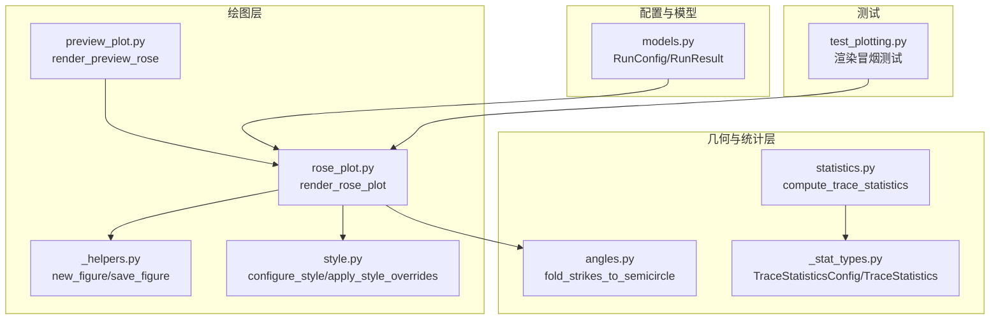
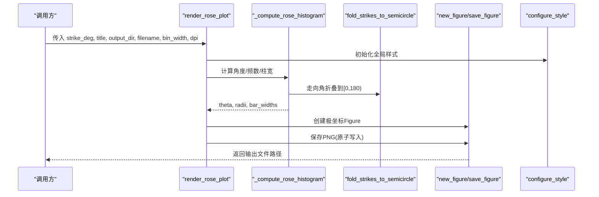
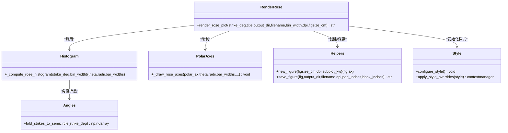

# 玫瑰图绘制 API

<cite>
**本文引用的文件列表**
- [rose_plot.py](file://trace_pipeline/plotting/rose_plot.py)
- [_helpers.py](file://trace_pipeline/plotting/_helpers.py)
- [style.py](file://trace_pipeline/plotting/style.py)
- [angles.py](file://trace_pipeline/geology/angles.py)
- [statistics.py](file://trace_pipeline/geology/statistics.py)
- [_stat_types.py](file://trace_pipeline/geology/_stat_types.py)
- [preview_plot.py](file://trace_pipeline/plotting/preview_plot.py)
- [models.py](file://trace_pipeline/models.py)
- [test_plotting.py](file://tests/test_plotting.py)
</cite>

## 目录
1. [简介](#简介)
2. [项目结构](#项目结构)
3. [核心组件](#核心组件)
4. [架构总览](#架构总览)
5. [详细组件分析](#详细组件分析)
6. [依赖关系分析](#依赖关系分析)
7. [性能与可扩展性](#性能与可扩展性)
8. [故障排查指南](#故障排查指南)
9. [结论](#结论)
10. [附录：参数与样式清单](#附录参数与样式清单)

## 简介
本文件面向地质数据分析场景，系统化说明“玫瑰图（走向玫瑰花瓣图）”的绘制 API。内容覆盖：
- 输入数据格式与预处理（角度折叠、分箱统计）
- 统计类型支持与可视化配置（P₁₀/P₂₀/P₂₁ 密度、平均迹长估计等）
- 图表布局与外观定制（扇区数量、颜色映射、标签显示、字体与主题）
- 与迹线图集成方式及批量生成策略
- 典型使用流程与参考路径（以代码片段路径替代具体代码）

## 项目结构
与玫瑰图绘制直接相关的模块位于 plotting 与 geology 子包中：
- 绘图层：rose_plot.py、_helpers.py、style.py、preview_plot.py
- 几何与统计层：angles.py、statistics.py、_stat_types.py
- 运行配置与结果模型：models.py
- 测试用例：test_plotting.py

图示来源
- [rose_plot.py:106-140](file://trace_pipeline/plotting/rose_plot.py#L106-L140)
- [_helpers.py:26-93](file://trace_pipeline/plotting/_helpers.py#L26-L93)
- [style.py:187-256](file://trace_pipeline/plotting/style.py#L187-L256)
- [angles.py:154-168](file://trace_pipeline/geology/angles.py#L154-L168)
- [statistics.py:212-391](file://trace_pipeline/geology/statistics.py#L212-L391)
- [_stat_types.py:15-65](file://trace_pipeline/geology/_stat_types.py#L15-L65)
- [models.py:162-267](file://trace_pipeline/models.py#L162-L267)
- [test_plotting.py:18-42](file://tests/test_plotting.py#L18-L42)

章节来源
- [rose_plot.py:1-140](file://trace_pipeline/plotting/rose_plot.py#L1-L140)
- [_helpers.py:1-192](file://trace_pipeline/plotting/_helpers.py#L1-L192)
- [style.py:1-296](file://trace_pipeline/plotting/style.py#L1-L296)
- [angles.py:1-168](file://trace_pipeline/geology/angles.py#L1-L168)
- [statistics.py:1-391](file://trace_pipeline/geology/statistics.py#L1-L391)
- [_stat_types.py:1-125](file://trace_pipeline/geology/_stat_types.py#L1-L125)
- [models.py:1-352](file://trace_pipeline/models.py#L1-L352)
- [test_plotting.py:1-98](file://tests/test_plotting.py#L1-L98)

## 核心组件
- render_rose_plot：主入口函数，负责读取走向角数组、执行半圆折叠与分箱统计、创建极坐标轴并保存图像。
- _compute_rose_histogram：实现走向角折叠到 [0°, 180°)、构建直方图、计算柱体中心角与宽度（弧度）。
- _draw_rose_axes：在极坐标轴上绘制柱体、网格、边框与刻度，统一应用字体族。
- new_figure / save_figure：统一的图形创建与原子化保存工具。
- configure_style / apply_style_overrides：全局样式与线程安全的临时样式覆盖。
- fold_strikes_to_semicircle：将 0–360° 走向角折叠为对称区间 [0, 180°)，用于玫瑰图分箱。
- compute_trace_statistics：提供 P₁₀/P₂₀/P₂₁ 密度与平均迹长估计等指标，供上层业务或报告使用。
- TraceStatisticsConfig / TraceStatistics：统计计算参数与结果的数据类定义。
- RunConfig / RunResult：流水线运行配置与结果，包含玫瑰图导出开关与分辨率等选项。

章节来源
- [rose_plot.py:76-140](file://trace_pipeline/plotting/rose_plot.py#L76-L140)
- [_helpers.py:26-93](file://trace_pipeline/plotting/_helpers.py#L26-L93)
- [style.py:187-296](file://trace_pipeline/plotting/style.py#L187-L296)
- [angles.py:154-168](file://trace_pipeline/geology/angles.py#L154-L168)
- [statistics.py:212-391](file://trace_pipeline/geology/statistics.py#L212-L391)
- [_stat_types.py:15-125](file://trace_pipeline/geology/_stat_types.py#L15-L125)
- [models.py:162-352](file://trace_pipeline/models.py#L162-L352)

## 架构总览
下图展示了从输入走向角到输出玫瑰图文件的完整调用链，以及统计指标与样式的参与点。

图示来源
- [rose_plot.py:106-140](file://trace_pipeline/plotting/rose_plot.py#L106-L140)
- [rose_plot.py:76-104](file://trace_pipeline/plotting/rose_plot.py#L76-L104)
- [angles.py:154-168](file://trace_pipeline/geology/angles.py#L154-L168)
- [_helpers.py:26-93](file://trace_pipeline/plotting/_helpers.py#L26-L93)
- [style.py:187-256](file://trace_pipeline/plotting/style.py#L187-L256)

## 详细组件分析

### 玫瑰图主接口：render_rose_plot
- 功能概述
  - 接收走向角数组（度）、标题、输出目录与文件名、分箱宽度（度）、DPI 等参数。
  - 内部完成样式初始化、角度折叠与分箱统计、极坐标轴绘制与图片保存。
- 关键参数
  - strike_deg：走向角数组（度），支持任意形状；空数组可安全处理。
  - title：图表标题文本。
  - output_dir：输出目录路径。
  - filename：输出文件名（建议 PNG）。
  - bin_width：分箱宽度（度），取值范围 (0, 180]。
  - dpi：输出分辨率。
  - figsize_cm：画布尺寸（厘米），默认正方形。
- 返回值
  - 输出文件的绝对路径字符串。
- 错误处理
  - bin_width 越界抛出异常。
  - 输入包含 NaN/inf 抛出异常。
  - 空输入不崩溃，返回空柱体并正常保存。
- 相关实现位置
  - 主函数与常量定义：[rose_plot.py:19-24](file://trace_pipeline/plotting/rose_plot.py#L19-L24), [rose_plot.py:106-140](file://trace_pipeline/plotting/rose_plot.py#L106-L140)
  - 角度折叠与分箱：[rose_plot.py:76-104](file://trace_pipeline/plotting/rose_plot.py#L76-L104)
  - 极坐标绘制与字体应用：[rose_plot.py:26-74](file://trace_pipeline/plotting/rose_plot.py#L26-L74)

章节来源
- [rose_plot.py:19-24](file://trace_pipeline/plotting/rose_plot.py#L19-L24)
- [rose_plot.py:76-104](file://trace_pipeline/plotting/rose_plot.py#L76-L104)
- [rose_plot.py:106-140](file://trace_pipeline/plotting/rose_plot.py#L106-L140)

### 角度折叠与分箱统计：_compute_rose_histogram
- 算法要点
  - 将走向角折叠到 [0°, 180°)，合并对称方向（如 NE/SW）。
  - 基于 edges 构建直方图，计算柱体中心角与宽度（弧度）。
  - 将半圆计数镜像到全圆，形成完整的玫瑰花瓣。
- 复杂度
  - 时间 O(N + B)，N 为样本数，B 为分箱数（由 180/bin_width 决定）。
  - 空间 O(B)。
- 边界条件
  - 空输入返回空数组。
  - 非有限值触发异常。
- 相关实现位置
  - [rose_plot.py:76-104](file://trace_pipeline/plotting/rose_plot.py#L76-L104)
  - [angles.py:154-168](file://trace_pipeline/geology/angles.py#L154-L168)

章节来源
- [rose_plot.py:76-104](file://trace_pipeline/plotting/rose_plot.py#L76-L104)
- [angles.py:154-168](file://trace_pipeline/geology/angles.py#L154-L168)

### 极坐标轴绘制：_draw_rose_axes
- 功能
  - 设置极坐标原点和方向、网格线、柱体、径向刻度与标签位置、边框与字体族。
- 样式
  - 通过 heading_font_kwargs 统一字体族，避免 CJK 乱码。
- 相关实现位置
  - [rose_plot.py:26-74](file://trace_pipeline/plotting/rose_plot.py#L26-L74)
  - [style.py:135-173](file://trace_pipeline/plotting/style.py#L135-L173)

章节来源
- [rose_plot.py:26-74](file://trace_pipeline/plotting/rose_plot.py#L26-L74)
- [style.py:135-173](file://trace_pipeline/plotting/style.py#L135-L173)

### 图形创建与保存：new_figure / save_figure
- new_figure
  - 按厘米尺寸创建 Figure/Axes，支持 subplot_kw（例如 polar 投影）。
- save_figure
  - 原子写入（先写 .tmp 再重命名），自动关闭 Figure，记录保存耗时日志。
- 相关实现位置
  - [helpers.py:26-93](file://trace_pipeline/plotting/_helpers.py#L26-L93)

章节来源
- [_helpers.py:26-93](file://trace_pipeline/plotting/_helpers.py#L26-L93)

### 样式与主题：configure_style / apply_style_overrides
- configure_style
  - 幂等初始化 matplotlib 全局样式，优先 Times New Roman 与宋体，数学文本字体定制，论文风格默认字号与线宽。
- apply_style_overrides
  - 线程安全地临时覆盖绘图模块级样式常量（包括玫瑰图颜色、网格色、线宽等），退出时恢复。
- 相关实现位置
  - [style.py:187-256](file://trace_pipeline/plotting/style.py#L187-L256)
  - [style.py:258-296](file://trace_pipeline/plotting/style.py#L258-L296)

章节来源
- [style.py:187-256](file://trace_pipeline/plotting/style.py#L187-L256)
- [style.py:258-296](file://trace_pipeline/plotting/style.py#L258-L296)

### 统计指标与可视化关联：P₁₀/P₂₀/P₂₁ 与平均迹长
- 统计能力
  - P₁₀：线密度（迹线条数/测线长度）。
  - P₂₀：面密度（迹线条数/露头面积），支持实测面积、凸包面积、缓冲凸包面积、圆窗等效面积四层回退。
  - P₂₁：长度密度（观测迹长总量/露头面积），若无观测迹长则回退至圆窗估计。
  - 平均迹长估计：来自圆窗诊断聚合 l_est 或观测总长/条数。
- 可视化关联
  - 统计结果可用于在迹线图上叠加统计框、标注来源与一致性告警。
  - 玫瑰图本身仅展示走向分布，但可与统计结果联合呈现。
- 相关实现位置
  - [statistics.py:212-391](file://trace_pipeline/geology/statistics.py#L212-L391)
  - [_stat_types.py:15-125](file://trace_pipeline/geology/_stat_types.py#L15-L125)

章节来源
- [statistics.py:212-391](file://trace_pipeline/geology/statistics.py#L212-L391)
- [_stat_types.py:15-125](file://trace_pipeline/geology/_stat_types.py#L15-L125)

### 预览与演示：render_preview_rose
- 用途
  - 独立于业务逻辑的预览图生成，固定分箱宽度，便于样式预览。
- 复用逻辑
  - 复用 _compute_rose_histogram 与 _draw_rose_axes，确保与正式渲染一致。
- 相关实现位置
  - [preview_plot.py:450-491](file://trace_pipeline/plotting/preview_plot.py#L450-L491)
  - [rose_plot.py:76-104](file://trace_pipeline/plotting/rose_plot.py#L76-L104)
  - [rose_plot.py:26-74](file://trace_pipeline/plotting/rose_plot.py#L26-L74)

章节来源
- [preview_plot.py:450-491](file://trace_pipeline/plotting/preview_plot.py#L450-L491)
- [rose_plot.py:76-104](file://trace_pipeline/plotting/rose_plot.py#L76-L104)
- [rose_plot.py:26-74](file://trace_pipeline/plotting/rose_plot.py#L26-L74)

### 运行配置与批量策略：RunConfig / RunResult
- 运行配置
  - export_rose_plot：是否导出玫瑰图。
  - rose_bin_width：玫瑰图分箱宽度（度）。
  - rose_dpi：玫瑰图输出 DPI。
- 运行结果
  - rose_plot_path：生成的玫瑰图文件路径。
- 批量策略
  - 对多个 outcrop 或表名循环调用 run_pipeline，根据配置决定是否生成玫瑰图。
- 相关实现位置
  - [models.py:162-267](file://trace_pipeline/models.py#L162-L267)
  - [models.py:278-352](file://trace_pipeline/models.py#L278-L352)

章节来源
- [models.py:162-267](file://trace_pipeline/models.py#L162-L267)
- [models.py:278-352](file://trace_pipeline/models.py#L278-L352)

### 测试与稳定性验证
- 冒烟测试
  - 验证 render_rose_plot 能正常渲染并写出非空白 PNG。
  - 空输入不会崩溃。
- 相关实现位置
  - [test_plotting.py:18-42](file://tests/test_plotting.py#L18-L42)

章节来源
- [test_plotting.py:18-42](file://tests/test_plotting.py#L18-L42)

## 依赖关系分析
- 模块耦合
  - rose_plot 依赖 angles 的角度折叠、_helpers 的图形创建与保存、style 的全局样式。
  - preview_plot 复用 rose_plot 的内部统计与绘制函数，保证预览与正式渲染一致。
  - statistics 与 _stat_types 提供密度与长度统计，供上层报告或 UI 展示。
- 外部依赖
  - matplotlib（绘图后端）、numpy（数值计算）。
- 潜在循环依赖
  - 通过延迟导入与上下文管理器避免循环依赖（如 style.apply_style_overrides 内延迟导入 trace_plot/rose_plot）。

图示来源
- [rose_plot.py:76-140](file://trace_pipeline/plotting/rose_plot.py#L76-L140)
- [_helpers.py:26-93](file://trace_pipeline/plotting/_helpers.py#L26-L93)
- [style.py:187-296](file://trace_pipeline/plotting/style.py#L187-L296)
- [angles.py:154-168](file://trace_pipeline/geology/angles.py#L154-L168)

## 性能与可扩展性
- 性能特征
  - 分箱统计为线性复杂度，适合大规模走向角数据。
  - 极坐标柱体绘制开销与分箱数成正比，合理设置 bin_width 控制柱体数量。
  - 原子写入与日志记录有助于定位 I/O 瓶颈。
- 优化建议
  - 大批量生成时，复用已配置的样式与字体缓存。
  - 调整 DPI 与 figsize_cm 平衡输出质量与磁盘占用。
  - 若需多系列对比，可在同一极坐标轴上多次绘制不同数据集（注意颜色与透明度区分）。

## 故障排查指南
- 常见错误
  - bin_width 不在 (0, 180]：检查分箱宽度设置。
  - 输入包含 NaN/inf：清洗数据后再绘制。
  - 空数据：API 会正常保存空图，确认业务逻辑是否需要跳过。
- 调试建议
  - 使用预览接口 render_preview_rose 快速验证样式与布局。
  - 通过 apply_style_overrides 局部覆盖颜色与线宽进行对比测试。
  - 查看保存日志中的 duration_ms 字段评估 I/O 性能。

章节来源
- [rose_plot.py:76-104](file://trace_pipeline/plotting/rose_plot.py#L76-L104)
- [test_plotting.py:18-42](file://tests/test_plotting.py#L18-L42)
- [_helpers.py:42-93](file://trace_pipeline/plotting/_helpers.py#L42-L93)
- [style.py:258-296](file://trace_pipeline/plotting/style.py#L258-L296)

## 结论
玫瑰图绘制 API 提供了简洁稳定的接口，支持地质走向数据的半圆折叠与分箱统计，具备完善的样式与字体管理、原子化输出与预览能力。结合统计模块的 P₁₀/P₂₀/P₂₁ 与平均迹长估计，可在地质报告中实现一致的可视化与指标展示。通过 RunConfig 与批量策略，可高效生成大量玫瑰图。

## 附录：参数与样式清单

### 玫瑰图接口参数
- strike_deg：走向角数组（度），支持空数组与非有限值校验。
- title：标题文本。
- output_dir：输出目录。
- filename：输出文件名。
- bin_width：分箱宽度（度），范围 (0, 180]。
- dpi：输出分辨率。
- figsize_cm：画布尺寸（厘米）。

章节来源
- [rose_plot.py:106-140](file://trace_pipeline/plotting/rose_plot.py#L106-L140)

### 统计类型与可视化配置
- P₁₀：线密度（迹线条数/测线长度）。
- P₂₀：面密度（迹线条数/露头面积），支持多层回退与一致性校验。
- P₂₁：长度密度（观测迹长总量/露头面积），支持回退与校验。
- 平均迹长估计：来自圆窗诊断聚合或观测总长/条数。
- 可视化：统计结果常用于迹线图统计框与报告文本。

章节来源
- [statistics.py:212-391](file://trace_pipeline/geology/statistics.py#L212-L391)
- [_stat_types.py:15-125](file://trace_pipeline/geology/_stat_types.py#L15-L125)

### 图表布局与自定义选项
- 扇区数量：由 180/bin_width 决定，镜像到 360° 全圆。
- 颜色映射：柱体填充色、边框色、网格色可通过样式覆盖。
- 标签显示：极坐标角度刻度与径向刻度默认启用，字体族统一。
- 标题与字体：标题使用 heading_font_kwargs，正文使用 body_font_kwargs。

章节来源
- [rose_plot.py:26-74](file://trace_pipeline/plotting/rose_plot.py#L26-L74)
- [style.py:135-173](file://trace_pipeline/plotting/style.py#L135-L173)

### 与迹线图集成与批量生成
- 集成方式
  - 共用样式与字体配置，确保多图风格一致。
  - 统计结果在迹线图中以统计框形式展示，玫瑰图作为走向分布补充。
- 批量生成
  - 通过 RunConfig 控制是否导出玫瑰图、分箱宽度与 DPI。
  - 对多个 outcrop 或表名循环调用 pipeline，收集 rose_plot_path。

章节来源
- [models.py:162-267](file://trace_pipeline/models.py#L162-L267)
- [models.py:278-352](file://trace_pipeline/models.py#L278-L352)

### 样式定制与主题配置
- 全局样式
  - configure_style 初始化字体族、数学文本、默认字号与线宽。
- 临时覆盖
  - apply_style_overrides 支持覆盖玫瑰图颜色、网格色、线宽等模块级常量。
- 预览模式
  - render_preview_rose 固定分箱宽度，便于快速验证样式。

章节来源
- [style.py:187-296](file://trace_pipeline/plotting/style.py#L187-L296)
- [preview_plot.py:450-491](file://trace_pipeline/plotting/preview_plot.py#L450-L491)