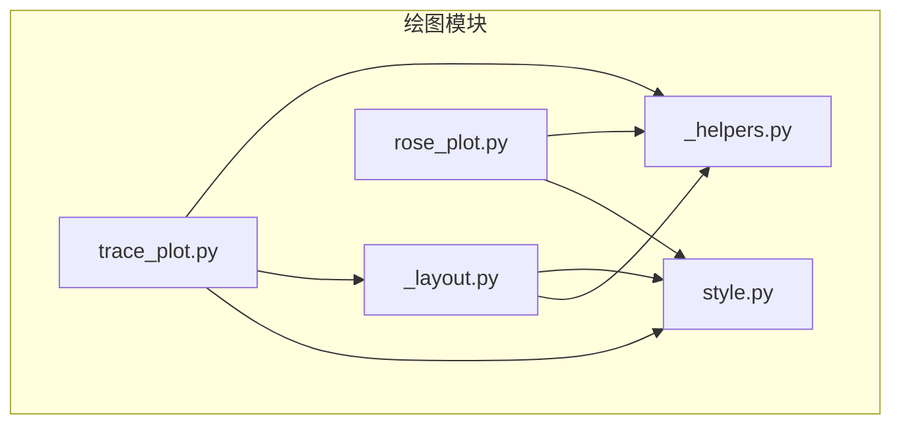
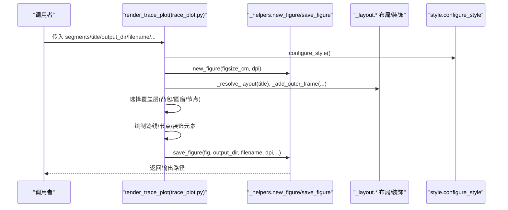
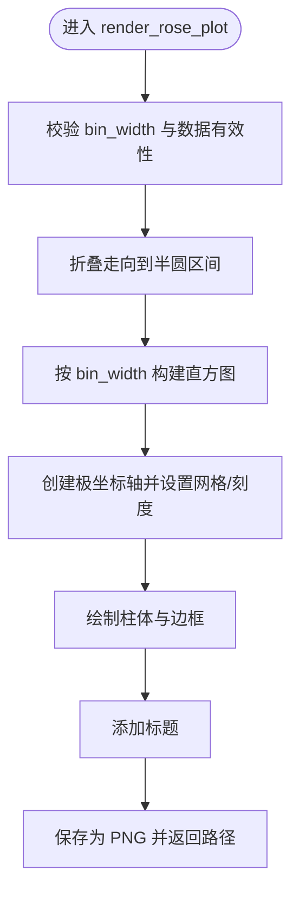
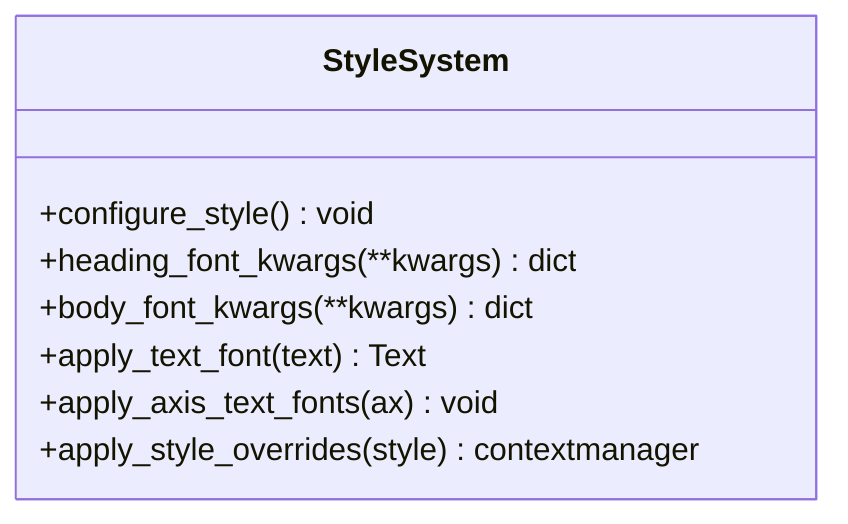
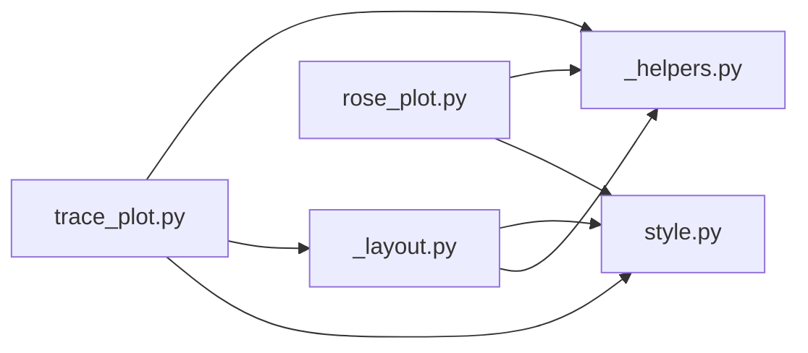

# 绘图 API 参考

<cite>
**本文引用的文件**   
- [trace_plot.py](file://trace_pipeline/plotting/trace_plot.py)
- [rose_plot.py](file://trace_pipeline/plotting/rose_plot.py)
- [style.py](file://trace_pipeline/plotting/style.py)
- [_helpers.py](file://trace_pipeline/plotting/_helpers.py)
- [_layout.py](file://trace_pipeline/plotting/_layout.py)
- [test_plotting.py](file://tests/test_plotting.py)
</cite>

## 目录
1. [简介](#简介)
2. [项目结构](#项目结构)
3. [核心组件](#核心组件)
4. [架构总览](#架构总览)
5. [详细组件分析](#详细组件分析)
6. [依赖关系分析](#依赖关系分析)
7. [性能与输出建议](#性能与输出建议)
8. [故障排查指南](#故障排查指南)
9. [结论](#结论)
10. [附录：示例与参数调优](#附录示例与参数调优)

## 简介
本参考文档面向使用 TracePipeline 绘图模块的开发者与用户，聚焦以下目标：
- 完整记录迹线图绘制接口 render_trace_plot() 的参数、数据格式、样式与覆盖层配置。
- 说明玫瑰图绘制接口 render_rose_plot() 的参数与自定义选项。
- 解析样式配置系统 style.py 的样式字典结构与主题定制方法。
- 提供不同图表类型的生成示例与参数调优指南。
- 给出高分辨率输出与批量绘制的最佳实践。
- 说明样式主题定制与颜色方案配置方式。

## 项目结构
绘图相关代码集中在 trace_pipeline/plotting 目录下，采用“功能模块 + 共享工具”的组织方式：
- trace_plot.py：迹线长度图渲染主入口与图层控制。
- rose_plot.py：节理走向玫瑰花瓣图渲染主入口。
- style.py：全局样式与字体、主题覆盖机制。
- _helpers.py：通用辅助（Figure 创建、保存、指北针、数据边界计算）。
- _layout.py：布局常量、外框、比例尺、统计框、图例、节点样式等共享逻辑。

图示来源
- [trace_plot.py:1-50](file://trace_pipeline/plotting/trace_plot.py#L1-L50)
- [rose_plot.py:1-30](file://trace_pipeline/plotting/rose_plot.py#L1-L30)
- [style.py:1-40](file://trace_pipeline/plotting/style.py#L1-L40)
- [_helpers.py:1-30](file://trace_pipeline/plotting/_helpers.py#L1-L30)
- [_layout.py:1-35](file://trace_pipeline/plotting/_layout.py#L1-L35)

章节来源
- [trace_plot.py:1-50](file://trace_pipeline/plotting/trace_plot.py#L1-L50)
- [rose_plot.py:1-30](file://trace_pipeline/plotting/rose_plot.py#L1-L30)
- [style.py:1-40](file://trace_pipeline/plotting/style.py#L1-L40)
- [_helpers.py:1-30](file://trace_pipeline/plotting/_helpers.py#L1-L30)
- [_layout.py:1-35](file://trace_pipeline/plotting/_layout.py#L1-L35)

## 核心组件
- 迹线图渲染器：render_trace_plot()
  - 负责将线段数据转换为可绘制的 X/Y 序列，叠加可选的凸包或圆窗区域，绘制迹线、节点符号、指北针、比例尺、统计信息框与自适应图例，并支持背景透明与图层开关。
- 玫瑰图渲染器：render_rose_plot()
  - 将走向角度数据折叠为半圆区间后做直方图统计，在极坐标轴上绘制柱体网格与边框，并输出标题与图片。
- 样式系统：style.py
  - 提供全局字体栈、数学文本字体、论文风格默认值；通过 apply_style_overrides() 线程安全地临时覆盖模块级样式常量与字号。

章节来源
- [trace_plot.py:442-565](file://trace_pipeline/plotting/trace_plot.py#L442-L565)
- [rose_plot.py:105-140](file://trace_pipeline/plotting/rose_plot.py#L105-L140)
- [style.py:187-296](file://trace_pipeline/plotting/style.py#L187-L296)

## 架构总览
下图展示了两个渲染函数与其依赖的辅助与布局模块之间的调用关系。

图示来源
- [trace_plot.py:442-565](file://trace_pipeline/plotting/trace_plot.py#L442-L565)
- [_helpers.py:26-93](file://trace_pipeline/plotting/_helpers.py#L26-L93)
- [_layout.py:362-420](file://trace_pipeline/plotting/_layout.py#L362-L420)
- [style.py:187-256](file://trace_pipeline/plotting/style.py#L187-L256)

## 详细组件分析

### 迹线图渲染接口 render_trace_plot()
- 作用
  - 根据 (N,4) 线段数组绘制迹线，支持面积覆盖层（凸包或圆窗）、节点覆盖层、指北针、比例尺、统计信息框与自适应图例。
- 输入参数
  - segments: numpy.ndarray，形状 (N,4)，每行表示一条线段起点(x1,y1)、终点(x2,y2)。
  - title: str，图表标题，支持换行影响布局。
  - output_dir: str，输出目录路径。
  - filename: str，输出文件名。
  - dpi: int，图像分辨率（默认 300）。
  - figsize_cm: tuple[float,float] | None，画布尺寸（厘米）；None 时按数据范围自适应，使 1m 物理长度一致。
  - north_angle_deg: float，指北针方向角度（度），默认 90。
  - statistics_lines: Sequence[str] | None，统计信息行列表，用于绘制统计框。
  - circle_windows: Sequence[CircleWindowOverlay] | None，圆窗覆盖层数据。
  - hull_overlay: ConvexHullOverlay | None，凸包覆盖层数据。
  - area_source: str，面积来源标识，影响图例显示与覆盖层选择（如 "hull"/"hull_buffered"/"window"/"window_equivalent"/"measured" 等）。
  - node_overlays: Sequence[NodeOverlay] | None，节点覆盖层数据。
  - style: dict[str, Any] | None，样式覆盖字典，包含节点样式预设名等。
  - include_trace: bool，是否绘制迹线（默认 True）。
  - include_hull: bool，是否绘制凸包覆盖层（默认 True）。
  - include_circles: bool，是否绘制圆窗覆盖层（默认 True）。
  - include_nodes: bool，是否绘制节点覆盖层（默认 True）。
  - include_decorations: bool，是否绘制装饰元素（指北针、比例尺、统计框、图例、外框等，默认 True）。
  - background_color: str，背景色；支持 "white"/"none"/"transparent" 等，后者启用透明背景。
- 返回值
  - str，输出文件的绝对路径。
- 关键行为
  - 自动选择覆盖层：当 area_source 为 "hull"/"hull_buffered" 且存在有效凸包时优先绘制凸包；否则若为 "window"/"window_equivalent" 且存在有效圆窗则绘制圆窗。
  - 自适应画布尺寸：当未指定 figsize_cm 时，依据数据跨度与目标物理尺度计算 figure 尺寸，确保跨图可比性。
  - 图层顺序：底层为覆盖层（凸包或圆窗），顶层为迹线与节点；装饰元素独立面板绘制。
  - 背景透明：当 background_color 为 "none"/"transparent" 时，保存时开启透明通道。
- 数据结构
  - CircleWindowOverlay：圆心 x/y 与半径。
  - ConvexHullOverlay：凸包顶点数组 (N,2)。
  - NodeOverlay：节点位置、类型（I/Y/X/overlap/multi）、ID、度数。
- 样式与主题
  - 迹线颜色、宽度、凸包填充/边线、圆窗填充/边线等由模块级常量定义，可通过 style.py 的 apply_style_overrides() 进行线程安全的临时覆盖。
  - 节点标记样式通过 _layout._NODE_STYLE_PRESETS 提供多种预设（default/solid/hollow/dark），也可通过 style 中的 node_style 键切换。

```mermaid
classDiagram
class CircleWindowOverlay {
+float center_x
+float center_y
+float radius
}
class ConvexHullOverlay {
+ndarray vertices
}
class NodeOverlay {
+float x
+float y
+string node_type
+int node_id
+int degree
}
class TracePlotLayout {
+float pad_data_ratio
+float pad_base_ratio
+float left_pad_ratio
+float bottom_pad_ratio
+float top_pad_ratio
+float tick_pad_ratio
+float tick_base_ratio
+float arrow_rel_x
+float arrow_rel_y
+float arrow_rel_len
+float legend_rel_x
+float legend_rel_y
+float stats_box_rel_x0
+float stats_box_rel_x1
+float stats_box_rel_y0
+float stats_box_rel_y1
+float scale_bar_y_offset_ratio
+bool auto_placement
+float placement_margin
+float legend_size_w
+float legend_size_h
+float stats_size_w
+float stats_size_h_min
+float stats_size_h_max
+float scale_size_w
+float scale_size_h
+tuple compass_rect
}
```

图示来源
- [trace_plot.py:72-133](file://trace_pipeline/plotting/trace_plot.py#L72-L133)

章节来源
- [trace_plot.py:151-170](file://trace_pipeline/plotting/trace_plot.py#L151-L170)
- [trace_plot.py:172-223](file://trace_pipeline/plotting/trace_plot.py#L172-L223)
- [trace_plot.py:225-281](file://trace_pipeline/plotting/trace_plot.py#L225-L281)
- [trace_plot.py:283-357](file://trace_pipeline/plotting/trace_plot.py#L283-L357)
- [trace_plot.py:359-418](file://trace_pipeline/plotting/trace_plot.py#L359-L418)
- [trace_plot.py:420-441](file://trace_pipeline/plotting/trace_plot.py#L420-L441)
- [trace_plot.py:442-565](file://trace_pipeline/plotting/trace_plot.py#L442-L565)
- [_layout.py:90-173](file://trace_pipeline/plotting/_layout.py#L90-L173)

### 玫瑰图渲染接口 render_rose_plot()
- 作用
  - 将节理走向角度数据折叠至半圆区间，按 bin_width 分箱统计，在极坐标轴上绘制柱体、网格与边框，并输出标题与图片。
- 输入参数
  - strike_deg: numpy.ndarray，走向角度（度）。
  - title: str，图表标题。
  - output_dir: str，输出目录路径。
  - filename: str，输出文件名。
  - bin_width: float，分箱宽度（度），必须在 (0, 180] 范围内。
  - dpi: int，图像分辨率（默认 400）。
  - figsize_cm: tuple[float,float]，画布尺寸（厘米），默认正方形。
- 返回值
  - str，输出文件的绝对路径。
- 关键行为
  - 角度折叠：将走向折叠到半圆区间，避免重复计数。
  - 空数据处理：若无有效数据，仍会生成最小极坐标图。
  - 网格与刻度：固定 30° 径向网格，动态设置径向刻度与标签位置。
- 样式与主题
  - 柱体颜色、边线颜色、网格颜色由模块级常量定义，可通过 style.py 的 apply_style_overrides() 进行临时覆盖。

图示来源
- [rose_plot.py:76-104](file://trace_pipeline/plotting/rose_plot.py#L76-L104)
- [rose_plot.py:105-140](file://trace_pipeline/plotting/rose_plot.py#L105-L140)

章节来源
- [rose_plot.py:76-104](file://trace_pipeline/plotting/rose_plot.py#L76-L104)
- [rose_plot.py:105-140](file://trace_pipeline/plotting/rose_plot.py#L105-L140)

### 样式配置系统 style.py
- 全局样式配置
  - configure_style()：幂等设置 matplotlib 全局样式，包括字体族、数学文本字体、轴线粗细、刻度大小、默认 DPI、保存背景等。
  - heading_font_kwargs()/body_font_kwargs()：返回标题/正文使用的字体族字典，自动回退可用字体，避免 CJK 缺失字重导致的警告。
- 样式覆盖机制
  - apply_style_overrides(style): 线程安全上下文管理器，临时覆盖模块级样式常量（如迹线颜色/宽度、凸包/圆窗颜色、玫瑰图柱体/网格颜色等）与全局字号，退出时自动恢复。
  - 支持的覆盖键（部分）：
    - trace_line_color, trace_line_width
    - hull_line_color, hull_fill_color, hull_fill_alpha
    - circle_window_line_color, circle_window_fill_color, circle_window_fill_alpha
    - rose_bar_color, rose_bar_edge, rose_grid_color
    - label_font_size 或 global_font_size（向后兼容）
- 字体策略
  - 西文优先 Times New Roman，中文优先宋体；标题使用黑体字形但不强制 bold，避免 findfont 噪声。
  - 数学文本统一使用可用西文字体，保证单位与数字一致性。

图示来源
- [style.py:187-296](file://trace_pipeline/plotting/style.py#L187-L296)
- [style.py:135-173](file://trace_pipeline/plotting/style.py#L135-L173)

章节来源
- [style.py:187-296](file://trace_pipeline/plotting/style.py#L187-L296)
- [style.py:135-173](file://trace_pipeline/plotting/style.py#L135-L173)

## 依赖关系分析
- 模块耦合
  - trace_plot.py 依赖 _helpers.py（new_figure/save_figure/add_data_north_arrow/compute_data_bounds）、_layout.py（布局与装饰）、style.py（全局样式与字体）。
  - rose_plot.py 依赖 _helpers.py（new_figure/save_figure）、style.py（全局样式与字体）。
  - _layout.py 依赖 style.py（字体）与 _helpers.py（指北针几何）。
- 外部依赖
  - matplotlib.pyplot、matplotlib.font_manager、numpy。
- 潜在循环依赖
  - 通过 TYPE_CHECKING 与延迟导入避免循环依赖（例如 apply_style_overrides 中延迟导入 trace_plot 与 rose_plot）。

图示来源
- [trace_plot.py:1-35](file://trace_pipeline/plotting/trace_plot.py#L1-L35)
- [rose_plot.py:1-20](file://trace_pipeline/plotting/rose_plot.py#L1-L20)
- [_helpers.py:1-25](file://trace_pipeline/plotting/_helpers.py#L1-L25)
- [_layout.py:1-25](file://trace_pipeline/plotting/_layout.py#L1-L25)
- [style.py:1-25](file://trace_pipeline/plotting/style.py#L1-L25)

章节来源
- [trace_plot.py:1-35](file://trace_pipeline/plotting/trace_plot.py#L1-L35)
- [rose_plot.py:1-20](file://trace_pipeline/plotting/rose_plot.py#L1-L20)
- [_helpers.py:1-25](file://trace_pipeline/plotting/_helpers.py#L1-L25)
- [_layout.py:1-25](file://trace_pipeline/plotting/_layout.py#L1-L25)
- [style.py:1-25](file://trace_pipeline/plotting/style.py#L1-L25)

## 性能与输出建议
- 高分辨率输出
  - 迹线图默认 dpi=300，玫瑰图默认 dpi=400；如需更高清晰度，提高 dpi 参数，但注意文件体积与保存时间增加。
  - 使用 save_figure 的原子写入策略，避免异常中断产生损坏文件。
- 批量绘制
  - 建议在进程内复用 Figure/Axes 对象以减少开销；当前实现每次调用新建并关闭 Figure，适合脚本化批量任务。
  - 使用 apply_style_overrides() 在上下文中统一覆盖样式，避免多次修改全局 rcParams。
- 自适应尺寸
  - 不指定 figsize_cm 时，迹线图会根据数据跨度自动调整，确保 1m 物理长度一致，便于面积比较。
- 背景透明
  - 需要透明背景时，设置 background_color="transparent" 或 "none"，save_figure 会自动启用透明通道。

章节来源
- [_helpers.py:42-93](file://trace_pipeline/plotting/_helpers.py#L42-L93)
- [trace_plot.py:420-441](file://trace_pipeline/plotting/trace_plot.py#L420-L441)
- [trace_plot.py:442-565](file://trace_pipeline/plotting/trace_plot.py#L442-L565)
- [style.py:258-296](file://trace_pipeline/plotting/style.py#L258-L296)

## 故障排查指南
- 常见错误
  - segments 包含 NaN/inf：compute_data_bounds 会抛出 ValueError，需清洗数据。
  - strike_deg 包含 NaN/inf：_compute_rose_histogram 会抛出 ValueError，需过滤无效角度。
  - bin_width 不在 (0, 180]：_compute_rose_histogram 会抛出 ValueError，请调整分箱宽度。
- 调试建议
  - 检查 segments 形状是否为 (N,4)。
  - 确认 circle_windows 的半径为正数且坐标有限。
  - 使用测试用例作为参考，验证基本渲染流程。

章节来源
- [_helpers.py:160-192](file://trace_pipeline/plotting/_helpers.py#L160-L192)
- [rose_plot.py:76-104](file://trace_pipeline/plotting/rose_plot.py#L76-L104)
- [test_plotting.py:18-42](file://tests/test_plotting.py#L18-L42)
- [test_plotting.py:44-98](file://tests/test_plotting.py#L44-L98)

## 结论
TracePipeline 的绘图 API 提供了稳定、可扩展的迹线图与玫瑰图渲染能力。通过统一的样式系统与布局工具，用户可以灵活定制外观、叠加覆盖层、控制图层与背景，并在高分辨率下批量输出高质量图像。遵循本文的参数规范与最佳实践，可获得一致的可视化效果与良好的性能表现。

## 附录：示例与参数调优
- 迹线图示例要点
  - 基础绘制：传入 segments、title、output_dir、filename、dpi 即可生成。
  - 覆盖层：提供 circle_windows 或 hull_overlay，并通过 area_source 控制图例与覆盖层选择。
  - 节点：提供 node_overlays 与 style.node_style 预设名，控制节点符号样式。
  - 统计框：statistics_lines 支持带单位的文本，内部会规范化为数学文本。
  - 背景透明：background_color="transparent" 配合 save_figure 透明输出。
- 玫瑰图示例要点
  - 基础绘制：传入 strike_deg、title、output_dir、filename、bin_width、dpi。
  - 空数据：即使为空数组也能生成最小极坐标图。
- 参数调优指南
  - 迹线图
    - figsize_cm：若希望固定物理尺寸，显式设置；否则保持 None 以启用自适应。
    - north_angle_deg：根据测线实际方位调整指北针方向。
    - include_*：按需关闭图层以提升渲染速度或生成独立视觉层。
  - 玫瑰图
    - bin_width：较宽的分箱更平滑但细节丢失，较窄的分箱更敏感但噪声增多；建议在 (0, 180] 内尝试 10–20 度。
- 样式主题定制
  - 使用 apply_style_overrides() 在上下文中覆盖颜色与字号，例如：
    - 覆盖迹线宽度：{"trace_line_width": 1.2}
    - 覆盖玫瑰图柱体颜色：{"rose_bar_color": "#C94C4C"}
    - 覆盖全局字号：{"label_font_size": 9.0}
  - 节点样式预设：在 style 中设置 {"node_style": "solid"} 或 "hollow"/"dark" 等。

章节来源
- [test_plotting.py:44-98](file://tests/test_plotting.py#L44-L98)
- [style.py:258-296](file://trace_pipeline/plotting/style.py#L258-L296)
- [_layout.py:90-173](file://trace_pipeline/plotting/_layout.py#L90-L173)