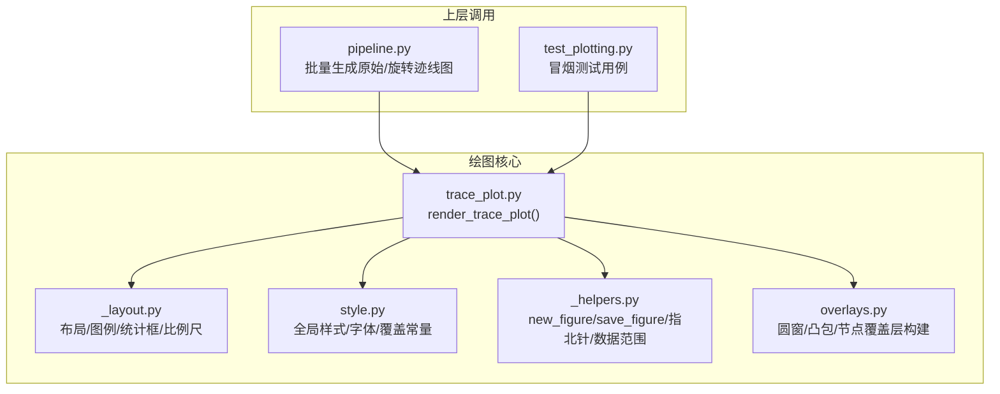
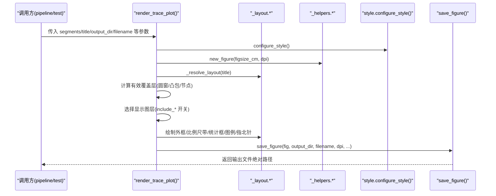
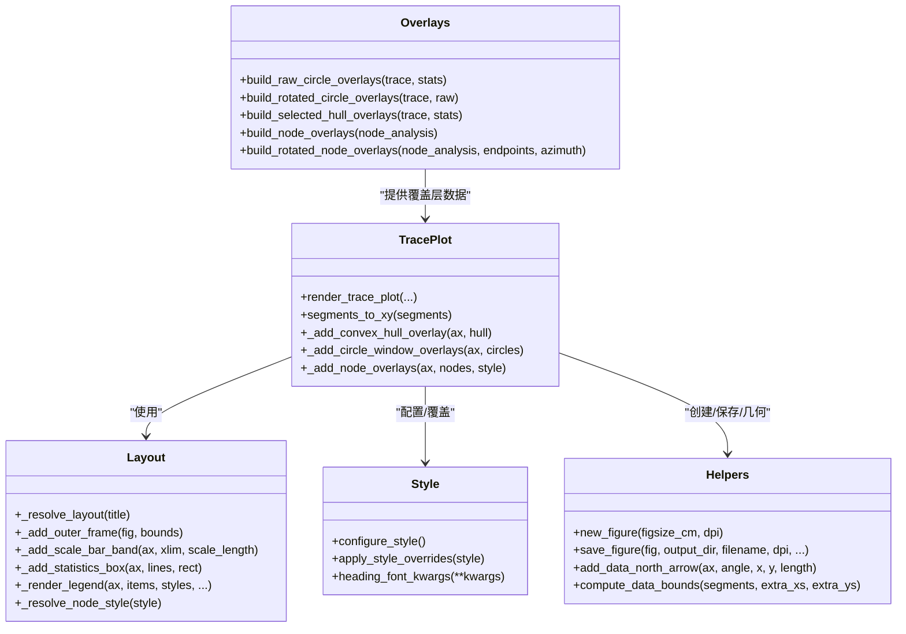

# 迹线图绘制 API

<cite>
**本文引用的文件**   
- [trace_plot.py](file://trace_pipeline/plotting/trace_plot.py)
- [style.py](file://trace_pipeline/plotting/style.py)
- [overlays.py](file://trace_pipeline/plotting/overlays.py)
- [_layout.py](file://trace_pipeline/plotting/_layout.py)
- [_helpers.py](file://trace_pipeline/plotting/_helpers.py)
- [pipeline.py](file://trace_pipeline/pipeline.py)
- [test_plotting.py](file://tests/test_plotting.py)
</cite>

## 目录
1. [简介](#简介)
2. [项目结构](#项目结构)
3. [核心组件](#核心组件)
4. [架构总览](#架构总览)
5. [详细组件分析](#详细组件分析)
6. [依赖关系分析](#依赖关系分析)
7. [性能与输出质量](#性能与输出质量)
8. [故障排查指南](#故障排查指南)
9. [结论](#结论)
10. [附录：使用示例](#附录使用示例)

## 简介
本文件面向需要调用“迹线图”绘制能力的开发者，聚焦于公共 API render_trace_plot() 的参数、覆盖层数据结构、图层开关机制、样式配置字典、高分辨率与自适应尺寸、背景色与透明背景支持等。文档同时给出不同场景的完整调用示例路径，便于快速上手与集成。

## 项目结构
与迹线图绘制相关的代码主要位于 plotting 子包中，围绕一个主函数 render_trace_plot() 组织，配合布局、样式、辅助工具与覆盖层构建模块协同工作。

图表来源
- [trace_plot.py:443-565](file://trace_pipeline/plotting/trace_plot.py#L443-L565)
- [_layout.py:362-420](file://trace_pipeline/plotting/_layout.py#L362-L420)
- [style.py:187-256](file://trace_pipeline/plotting/style.py#L187-L256)
- [_helpers.py:26-93](file://trace_pipeline/plotting/_helpers.py#L26-L93)
- [overlays.py:33-156](file://trace_pipeline/plotting/overlays.py#L33-L156)
- [pipeline.py:150-202](file://trace_pipeline/pipeline.py#L150-L202)
- [test_plotting.py:44-98](file://tests/test_plotting.py#L44-L98)

章节来源
- [trace_plot.py:1-565](file://trace_pipeline/plotting/trace_plot.py#L1-L565)
- [_layout.py:1-653](file://trace_pipeline/plotting/_layout.py#L1-L653)
- [style.py:1-296](file://trace_pipeline/plotting/style.py#L1-L296)
- [_helpers.py:1-192](file://trace_pipeline/plotting/_helpers.py#L1-L192)
- [overlays.py:1-156](file://trace_pipeline/plotting/overlays.py#L1-L156)
- [pipeline.py:150-202](file://trace_pipeline/pipeline.py#L150-L202)
- [test_plotting.py:44-98](file://tests/test_plotting.py#L44-L98)

## 核心组件
- render_trace_plot(): 单张迹线图的渲染入口，负责数据校验、布局计算、图层叠加、装饰元素绘制与文件保存。
- 覆盖层数据结构：CircleWindowOverlay（圆窗）、ConvexHullOverlay（凸包）、NodeOverlay（节点）。
- 图层控制参数：include_trace、include_hull、include_circles、include_nodes、include_decorations。
- 样式配置 style：通过 apply_style_overrides 临时覆盖绘图常量与字号。
- 布局与装饰：_layout 提供外框、比例尺带、统计信息框、图例、指北针等。
- 辅助工具：_helpers 提供 figure 创建、保存、指北针几何、数据边界计算。

章节来源
- [trace_plot.py:72-133](file://trace_pipeline/plotting/trace_plot.py#L72-L133)
- [trace_plot.py:443-565](file://trace_pipeline/plotting/trace_plot.py#L443-L565)
- [_layout.py:362-420](file://trace_pipeline/plotting/_layout.py#L362-L420)
- [_helpers.py:26-93](file://trace_pipeline/plotting/_helpers.py#L26-L93)

## 架构总览
下图展示了从调用方到最终 PNG 输出的关键流程与数据流向。

图表来源
- [trace_plot.py:443-565](file://trace_pipeline/plotting/trace_plot.py#L443-L565)
- [_layout.py:362-420](file://trace_pipeline/plotting/_layout.py#L362-L420)
- [_helpers.py:26-93](file://trace_pipeline/plotting/_helpers.py#L26-L93)
- [style.py:187-256](file://trace_pipeline/plotting/style.py#L187-L256)

## 详细组件分析

### 1) render_trace_plot() 函数签名与参数说明
- 必需参数
  - segments: numpy.ndarray，形状为 (N, 4)，每行表示一条线段起点(x1,y1)、终点(x2,y2)。内部会转换为带 NaN 分隔的一维序列供 matplotlib 绘制。
  - title: str，图表标题，支持换行影响布局。
  - output_dir: str，输出目录路径，不存在会自动创建。
  - filename: str，输出文件名（建议以 .png 结尾），将保存到 output_dir。
- 可选参数
  - dpi: int，默认 300。图像分辨率，越高越清晰但体积越大。
  - figsize_cm: tuple[float,float] | None，默认 None。当为 None 时根据数据范围自适应计算宽高，使不同图之间 1m 的物理长度尽量一致；否则按厘米指定宽高。
  - north_angle_deg: float，默认 90.0。指北针方向角度（度）。
  - statistics_lines: Sequence[str] | None，默认 None。统计信息文本列表，格式为“标签：值”，单位会被规范化为数学文本。
  - circle_windows: Sequence[CircleWindowOverlay] | None，默认 None。圆窗覆盖层数据。
  - hull_overlay: ConvexHullOverlay | None，默认 None。凸包覆盖层数据。
  - area_source: str，默认 ""。面积来源标识，用于决定显示哪种面积标注（如“hull”、“hull_buffered”、“window”、“window_equivalent”、“measured”）。
  - node_overlays: Sequence[NodeOverlay] | None，默认 None。节点覆盖层数据。
  - style: dict[str, Any] | None，默认 None。样式覆盖字典，详见后文“样式配置”。
  - include_trace: bool，默认 True。是否绘制迹线。
  - include_hull: bool，默认 True。是否绘制凸包覆盖层。
  - include_circles: bool，默认 True。是否绘制圆窗覆盖层。
  - include_nodes: bool，默认 True。是否绘制节点覆盖层。
  - include_decorations: bool，默认 True。是否绘制外框、比例尺带、统计框、图例、指北针等装饰元素。
  - background_color: str，默认 "white"。背景颜色；设为 "none" 或 "transparent" 可启用透明背景。
- 返回值
  - str：输出文件的完整路径。

章节来源
- [trace_plot.py:443-565](file://trace_pipeline/plotting/trace_plot.py#L443-L565)
- [trace_plot.py:151-169](file://trace_pipeline/plotting/trace_plot.py#L151-L169)
- [trace_plot.py:198-222](file://trace_pipeline/plotting/trace_plot.py#L198-L222)
- [trace_plot.py:420-441](file://trace_pipeline/plotting/trace_plot.py#L420-L441)

### 2) 覆盖层数据结构与用法
- CircleWindowOverlay（圆窗）
  - 字段：center_x, center_y, radius。
  - 用途：在数据轴上绘制半透明填充+虚线边框的圆形区域，常用于窗口策略可视化。
  - 有效性：仅保留有限坐标且半径 > 0 的圆窗。
- ConvexHullOverlay（凸包）
  - 字段：vertices，numpy.ndarray，形状 (N, 2)，顶点顺序连接形成多边形。
  - 用途：绘制蓝色虚线边框+浅蓝填充的多边形，代表凸包或缓冲凸包的轮廓。
- NodeOverlay（节点）
  - 字段：x, y, node_type, node_id, degree。
  - node_type 取值："I"（孤立端点）、"Y"（三叉节点）、"X"（交叉节点）。
  - 用途：按类型分组批量散点绘制，提升性能；图例自动汇总各类型数量。

覆盖层构建工具（供 pipeline 等上层调用）：
- build_raw_circle_overlays / build_rotated_circle_overlays：基于统计诊断结果构建原始/旋转坐标系下的圆窗。
- build_selected_hull_overlays：根据 outcrop_area_source 选择原始或缓冲凸包，并返回原始/旋转两套顶点。
- build_node_overlays / build_rotated_node_overlays：将节点分析结果转为覆盖层，并可旋转到测线坐标系。

章节来源
- [trace_plot.py:72-98](file://trace_pipeline/plotting/trace_plot.py#L72-L98)
- [trace_plot.py:172-196](file://trace_pipeline/plotting/trace_plot.py#L172-L196)
- [overlays.py:33-156](file://trace_pipeline/plotting/overlays.py#L33-L156)

### 3) 图层控制参数与绘制顺序
- include_trace：控制迹线绘制。
- include_hull / include_circles：二者二选一生效（取决于 area_source 与数据存在性），优先凸包，其次圆窗。
- include_nodes：控制节点符号绘制。
- include_decorations：控制外框、比例尺带、统计框、图例、指北针等装饰元素。
- 绘制顺序（zorder 由内至外）：
  1) 底层：凸包或圆窗（二选一）
  2) 顶层：迹线
  3) 节点覆盖层
  4) 装饰元素（外框、比例尺带、统计框、图例、指北针）

章节来源
- [trace_plot.py:514-536](file://trace_pipeline/plotting/trace_plot.py#L514-L536)
- [trace_plot.py:538-562](file://trace_pipeline/plotting/trace_plot.py#L538-L562)

### 4) 样式配置 style 字典
- 作用域：通过 apply_style_overrides 线程安全地临时覆盖绘图模块级常量与字号，退出上下文自动恢复。
- 支持的键（映射到 trace_plot 模块常量）：
  - trace_line_color / trace_line_width
  - hull_line_color / hull_fill_color / hull_fill_alpha
  - circle_window_line_color / circle_window_fill_color / circle_window_fill_alpha
  - rose_bar_color / rose_bar_edge / rose_grid_color（玫瑰图相关）
- 字号覆盖：
  - label_font_size（推荐）或 global_font_size（向后兼容）：统一设置正文字号。
- 节点样式预设：
  - node_style 预设名：default、solid、hollow、dark。
  - 每个预设包含 I/Y/X 三类节点的 marker、markerfacecolor、markeredgecolor、markeredgewidth。
- 字体与全局样式：
  - configure_style() 幂等初始化，设置中英文字体栈、数学文本字体、线条宽度、刻度大小、默认 DPI 与保存背景等。

章节来源
- [style.py:22-35](file://trace_pipeline/plotting/style.py#L22-L35)
- [style.py:187-256](file://trace_pipeline/plotting/style.py#L187-L256)
- [style.py:258-296](file://trace_pipeline/plotting/style.py#L258-L296)
- [_layout.py:92-173](file://trace_pipeline/plotting/_layout.py#L92-L173)

### 5) 高分辨率输出与自适应尺寸
- dpi：直接控制输出像素密度，默认 300。
- figsize_cm：
  - 若为 None：根据数据跨度自适应计算 figure 宽高，目标是在不同图中保持 1m 物理长度一致，从而面积可比。
  - 若显式指定：按厘米设置宽高，适合固定版式需求。
- 自适应算法要点：
  - 依据数据范围与 axes 占 figure 的比例反推 figure 尺寸，并在最小/最大区间裁剪。

章节来源
- [trace_plot.py:420-441](file://trace_pipeline/plotting/trace_plot.py#L420-L441)
- [_helpers.py:26-39](file://trace_pipeline/plotting/_helpers.py#L26-L39)

### 6) 背景颜色与透明背景
- background_color：
  - 非 "none"/"transparent"：设置 figure 背景为该颜色（默认 "white"）。
  - "none" 或 "transparent"：设置 figure 透明度为 0，保存时开启 transparent=True，得到透明背景 PNG。
- 保存逻辑：
  - save_figure 检测 figure.patch.alpha == 0.0 则启用透明保存，否则强制 facecolor="white"。

章节来源
- [trace_plot.py:501-506](file://trace_pipeline/plotting/trace_plot.py#L501-L506)
- [_helpers.py:56-93](file://trace_pipeline/plotting/_helpers.py#L56-L93)

### 7) 统计信息与单位格式化
- statistics_lines：字符串列表，支持“标签：值”格式。
- 单位处理：
  - 自动识别 m⁻¹/m⁻²/m²/cm 等单位，替换为 mathtext 表达式，确保英文单位与上标使用 Times New Roman。
- 统计框布局：
  - 自适应字号与行间距，避免重叠；标题与分割线样式统一。

章节来源
- [_layout.py:219-260](file://trace_pipeline/plotting/_layout.py#L219-L260)
- [_layout.py:262-357](file://trace_pipeline/plotting/_layout.py#L262-L357)

### 8) 指北针与比例尺
- 指北针：
  - 在数据轴左上角绘制，角度由 north_angle_deg 控制，箭头长度随数据跨度自适应。
- 比例尺带：
  - 独立面板绘制，长度按数据跨度选择规整值（1/2/5 × 10ⁿ），单位自动切换 m/cm。

章节来源
- [_helpers.py:121-158](file://trace_pipeline/plotting/_helpers.py#L121-L158)
- [_layout.py:179-201](file://trace_pipeline/plotting/_layout.py#L179-L201)
- [_layout.py:623-642](file://trace_pipeline/plotting/_layout.py#L623-L642)

## 依赖关系分析
- render_trace_plot 依赖：
  - _layout：布局解析、外框、比例尺带、统计框、图例、节点样式解析。
  - style：全局样式与字体、样式覆盖。
  - _helpers：figure 创建、保存、指北针几何、数据边界计算。
  - overlays：覆盖层数据构建（由上层 pipeline 调用）。
- 上层调用：
  - pipeline 在应用样式覆盖后，分别绘制原始与旋转两种视图，并可选择性导出玫瑰图。
  - 测试用例验证基本渲染、圆窗覆盖、统计信息、样式覆盖不卡死等。

图表来源
- [trace_plot.py:443-565](file://trace_pipeline/plotting/trace_plot.py#L443-L565)
- [_layout.py:362-420](file://trace_pipeline/plotting/_layout.py#L362-L420)
- [style.py:187-256](file://trace_pipeline/plotting/style.py#L187-L256)
- [_helpers.py:26-93](file://trace_pipeline/plotting/_helpers.py#L26-L93)
- [overlays.py:33-156](file://trace_pipeline/plotting/overlays.py#L33-L156)

章节来源
- [trace_plot.py:1-565](file://trace_pipeline/plotting/trace_plot.py#L1-L565)
- [_layout.py:1-653](file://trace_pipeline/plotting/_layout.py#L1-L653)
- [style.py:1-296](file://trace_pipeline/plotting/style.py#L1-L296)
- [_helpers.py:1-192](file://trace_pipeline/plotting/_helpers.py#L1-L192)
- [overlays.py:1-156](file://trace_pipeline/plotting/overlays.py#L1-L156)

## 性能与输出质量
- 性能优化
  - 节点覆盖层按类型分组批量 scatter，减少多次绘图开销。
  - 覆盖层有效性过滤（圆窗半径>0、坐标有限）避免无效绘制。
  - 自适应 figsize 减少不必要的空白区域，利于压缩与对比。
- 输出质量
  - 默认 300 DPI，适合出版与报告。
  - 透明背景支持便于后续合成与叠加。
  - 原子写入（先写临时文件再重命名）保证文件完整性。

章节来源
- [trace_plot.py:320-357](file://trace_pipeline/plotting/trace_plot.py#L320-L357)
- [trace_plot.py:172-180](file://trace_pipeline/plotting/trace_plot.py#L172-L180)
- [_helpers.py:56-93](file://trace_pipeline/plotting/_helpers.py#L56-L93)

## 故障排查指南
- segments 数据非法
  - 若包含 NaN/inf，compute_data_bounds 会抛出异常；请检查输入数据。
- 覆盖层无效
  - 圆窗需满足中心坐标有限且半径>0；凸包顶点数不足 3 不会绘制。
- 样式覆盖冲突
  - 使用 apply_style_overrides 包裹渲染过程，避免全局样式污染；退出后自动恢复。
- 中文乱码
  - configure_style() 已配置字体栈；若仍出现乱码，检查系统字体安装情况与回退策略日志。
- 输出文件损坏
  - save_figure 采用原子写入；如遇中断，检查临时文件残留并重新运行。

章节来源
- [_helpers.py:160-192](file://trace_pipeline/plotting/_helpers.py#L160-L192)
- [trace_plot.py:172-180](file://trace_pipeline/plotting/trace_plot.py#L172-L180)
- [trace_plot.py:302-317](file://trace_pipeline/plotting/trace_plot.py#L302-L317)
- [style.py:187-256](file://trace_pipeline/plotting/style.py#L187-L256)
- [_helpers.py:56-93](file://trace_pipeline/plotting/_helpers.py#L56-L93)

## 结论
render_trace_plot() 提供了完整的迹线图绘制能力，涵盖数据输入、覆盖层叠加、图层开关、样式定制、自适应尺寸与高分辨率输出。结合 overlays 构建器与 layout/style 工具，可在多种业务场景中灵活组合，实现高质量、可复现的地质迹线可视化。

## 附录：使用示例
以下示例均来源于仓库中的实际调用与测试，可直接参考对应路径进行集成。

- 基础迹线图（最小参数）
  - 参考：tests/test_plotting.py 中的基础渲染用例
  - 关键点：传入 segments、title、output_dir、filename、dpi 即可出图
  - 示例路径：[test_plotting.py:44-55](file://tests/test_plotting.py#L44-L55)

- 带圆窗覆盖层的迹线图
  - 参考：tests/test_plotting.py 中的圆窗用例
  - 关键点：构造 CircleWindowOverlay 列表，传入 circle_windows
  - 示例路径：[test_plotting.py:57-72](file://tests/test_plotting.py#L57-L72)

- 带统计信息的迹线图
  - 参考：tests/test_plotting.py 中的统计用例
  - 关键点：statistics_lines 传入“标签：值”列表，area_source 控制面积标注
  - 示例路径：[test_plotting.py:74-85](file://tests/test_plotting.py#L74-L85)

- 样式覆盖（线程安全）
  - 参考：tests/test_plotting.py 中的样式覆盖用例
  - 关键点：使用 apply_style_overrides 包裹渲染，避免全局污染
  - 示例路径：[test_plotting.py:87-98](file://tests/test_plotting.py#L87-L98)

- 批量生成原始与旋转迹线图（含覆盖层与节点）
  - 参考：pipeline.py 中的绘制步骤
  - 关键点：分别传入原始/旋转数据、north_angle_deg、circle_windows/hull_overlay/node_overlays、style
  - 示例路径：[pipeline.py:150-202](file://trace_pipeline/pipeline.py#L150-L202)

- 自适应尺寸与高分辨率输出
  - 参考：trace_plot.py 自适应 figsize 与 dpi 参数
  - 关键点：figsize_cm=None 时自动适配；dpi 控制清晰度
  - 示例路径：[trace_plot.py:420-441](file://trace_pipeline/plotting/trace_plot.py#L420-L441)

- 透明背景输出
  - 参考：trace_plot.py 背景设置与 _helpers.save_figure 透明保存
  - 关键点：background_color="transparent" 或 "none"，保存时启用透明
  - 示例路径：[trace_plot.py:501-506](file://trace_pipeline/plotting/trace_plot.py#L501-L506), [_helpers.py:56-93](file://trace_pipeline/plotting/_helpers.py#L56-L93)