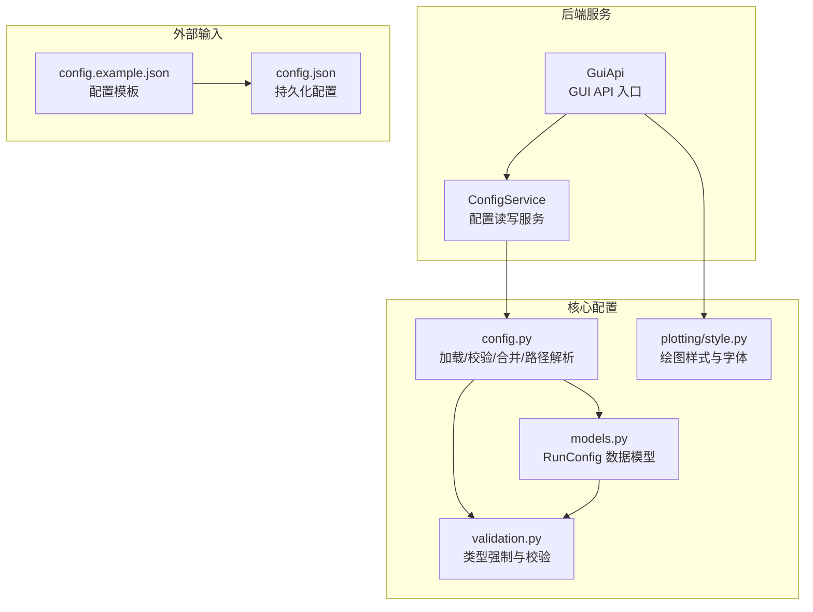
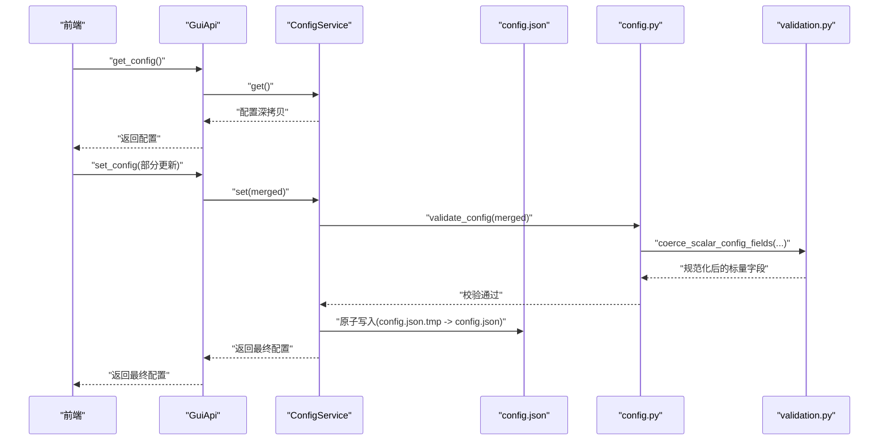
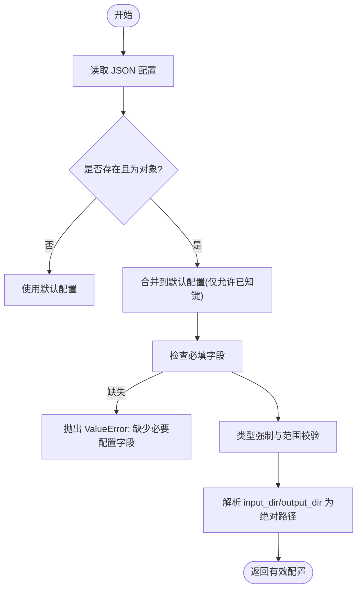
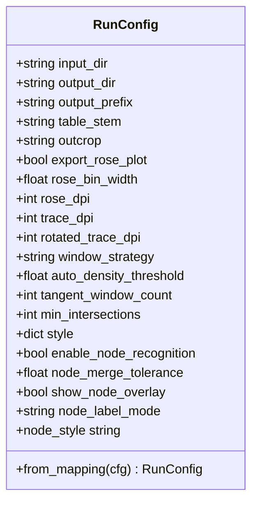
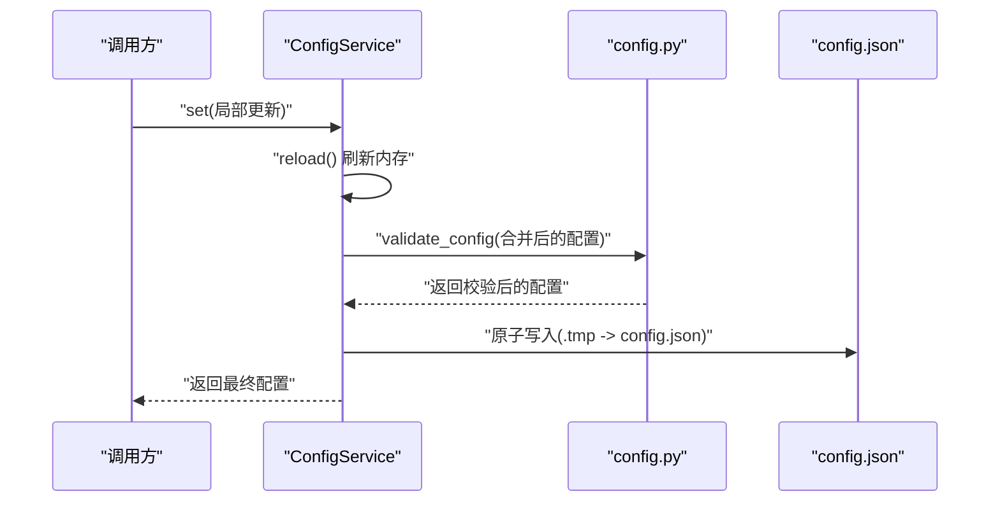
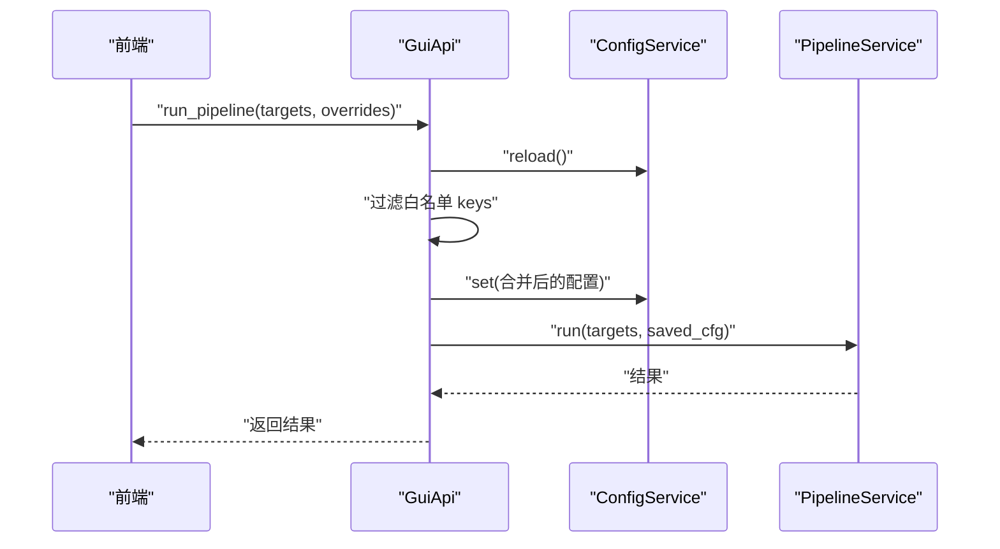
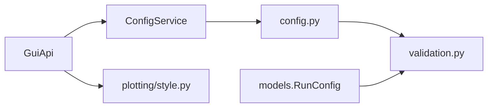

# 配置管理 API

<cite>
**本文引用的文件列表**
- [config.example.json](file://config.example.json)
- [trace_pipeline/config.py](file://trace_pipeline/config.py)
- [trace_pipeline/validation.py](file://trace_pipeline/validation.py)
- [trace_pipeline/models.py](file://trace_pipeline/models.py)
- [backend/services/config_service.py](file://backend/services/config_service.py)
- [backend/gui_api.py](file://backend/gui_api.py)
- [trace_pipeline/plotting/style.py](file://trace_pipeline/plotting/style.py)
- [tests/test_config.py](file://tests/test_config.py)
- [tests/test_run_config.py](file://tests/test_run_config.py)
</cite>

## 目录
1. [简介](#简介)
2. [项目结构](#项目结构)
3. [核心组件](#核心组件)
4. [架构总览](#架构总览)
5. [详细组件分析](#详细组件分析)
6. [依赖关系分析](#依赖关系分析)
7. [性能与并发特性](#性能与并发特性)
8. [故障排查指南](#故障排查指南)
9. [结论](#结论)
10. [附录：JSON 规范、默认值与最佳实践](#附录json-规范默认值与最佳实践)

## 简介
本文件面向 TracePipeline 的配置管理子系统，系统性记录配置文件的加载、校验与合并机制；详细说明 RunConfig 类的所有配置选项（数据处理参数、统计分析设置、绘图样式等）；提供配置文件 JSON 格式规范与默认值说明；记录配置验证规则与错误提示；说明配置的优先级与覆盖机制；并提供配置模板、最佳实践以及编程接口和使用示例。

## 项目结构
配置相关代码主要分布在以下模块：
- trace_pipeline/config.py：配置加载、路径解析、CLI 覆盖合并、工作目录保障
- trace_pipeline/validation.py：通用类型强制转换与标量字段校验
- trace_pipeline/models.py：RunConfig 数据模型与构造逻辑
- backend/services/config_service.py：config.json 的读写服务（唯一写入入口）
- backend/gui_api.py：前端可调用的 GUI API，封装配置读取/保存与运行覆盖
- trace_pipeline/plotting/style.py：绘图样式与字体配置（被 style 配置项影响）
- config.example.json：配置模板
- tests/*：配置与 RunConfig 的行为测试

图表来源
- [backend/services/config_service.py:1-144](file://backend/services/config_service.py#L1-L144)
- [backend/gui_api.py:264-333](file://backend/gui_api.py#L264-L333)
- [trace_pipeline/config.py:86-190](file://trace_pipeline/config.py#L86-L190)
- [trace_pipeline/validation.py:90-112](file://trace_pipeline/validation.py#L90-L112)
- [trace_pipeline/models.py:162-267](file://trace_pipeline/models.py#L162-L267)
- [trace_pipeline/plotting/style.py:187-296](file://trace_pipeline/plotting/style.py#L187-L296)
- [config.example.json:1-26](file://config.example.json#L1-L26)

章节来源
- [trace_pipeline/config.py:86-190](file://trace_pipeline/config.py#L86-L190)
- [backend/services/config_service.py:41-144](file://backend/services/config_service.py#L41-L144)
- [backend/gui_api.py:264-333](file://backend/gui_api.py#L264-L333)
- [trace_pipeline/models.py:162-267](file://trace_pipeline/models.py#L162-L267)
- [trace_pipeline/plotting/style.py:187-296](file://trace_pipeline/plotting/style.py#L187-L296)
- [config.example.json:1-26](file://config.example.json#L1-L26)

## 核心组件
- ConfigService：对 config.json 的唯一写入入口，提供 get/set/reset/reset_processing/reset_style/reload 等方法，内部使用线程锁保证并发安全，并采用原子写（先写临时文件再替换）。
- config.py：负责从磁盘加载 JSON 配置、合并默认值、规范化类型、校验必填项、解析相对路径为绝对路径、应用 CLI 覆盖、确保工作目录存在。
- validation.py：提供 coerce_bool/coerce_positive_int/coerce_positive_float/coerce_window_strategy/coerce_node_label_mode/coerce_rose_bin_width 等标量字段强制转换函数，以及统一入口 coerce_scalar_config_fields。
- models.RunConfig：不可变数据类，封装单次流水线运行所需的全部配置项，支持 from_mapping 工厂方法，并在 __post_init__ 中执行字段级校验与类型强制。
- GuiApi：对外暴露的前端 API，封装配置获取、保存、重置、以及 run_pipeline 时的“白名单覆盖”逻辑。

章节来源
- [backend/services/config_service.py:41-144](file://backend/services/config_service.py#L41-L144)
- [trace_pipeline/config.py:86-190](file://trace_pipeline/config.py#L86-L190)
- [trace_pipeline/validation.py:26-112](file://trace_pipeline/validation.py#L26-L112)
- [trace_pipeline/models.py:162-267](file://trace_pipeline/models.py#L162-L267)
- [backend/gui_api.py:264-333](file://backend/gui_api.py#L264-L333)

## 架构总览
配置生命周期如下：
- 启动时：GuiApi 初始化 ConfigService，后者若发现 config.json 不存在则自动创建默认配置。
- 读取：get_config 返回当前内存中的配置深拷贝；reload 会重新从磁盘加载并校验。
- 写入：set_config 合并新配置、校验后原子写入磁盘；reset_* 系列方法用于部分或全部恢复默认。
- 运行覆盖：run_pipeline 仅允许覆盖白名单内的处理参数与样式/并行度，禁止覆盖路径/目标字段。
- 样式生效：style 字典通过 apply_style_overrides 在绘图时临时覆盖 matplotlib 全局样式。

图表来源
- [backend/gui_api.py:273-291](file://backend/gui_api.py#L273-L291)
- [backend/services/config_service.py:92-144](file://backend/services/config_service.py#L92-L144)
- [trace_pipeline/config.py:148-190](file://trace_pipeline/config.py#L148-L190)
- [trace_pipeline/validation.py:107-112](file://trace_pipeline/validation.py#L107-L112)

## 详细组件分析

### 配置加载与校验流程
- 加载顺序与优先级
  - 默认配置 DEFAULT_CONFIG 作为基线
  - 用户提供的 JSON 配置覆盖默认值（仅允许已知键）
  - 可选的 CLI 覆盖（通过 apply_cli_overrides），再次校验
- 必填字段与条件必填
  - 必填：input_dir、output_dir、outcrop
  - 当 process_all=False 时，table_stem 也变为必填
- 路径解析
  - input_dir/output_dir 会被解析为绝对路径，基准目录取决于是否显式指定配置文件路径
- 未知键处理
  - 忽略未知键并记录警告日志
- 类型强制与范围校验
  - 布尔、正整数、正浮点数、窗口策略枚举、节点标签模式枚举、玫瑰图分箱宽度范围等

图表来源
- [trace_pipeline/config.py:86-190](file://trace_pipeline/config.py#L86-L190)
- [trace_pipeline/validation.py:90-112](file://trace_pipeline/validation.py#L90-L112)

章节来源
- [trace_pipeline/config.py:86-190](file://trace_pipeline/config.py#L86-L190)
- [trace_pipeline/validation.py:26-112](file://trace_pipeline/validation.py#L26-L112)
- [tests/test_config.py:8-21](file://tests/test_config.py#L8-L21)

### RunConfig 类详解
RunConfig 是不可变数据类，包含所有运行时所需的配置项，支持 from_mapping 工厂方法，并在构造阶段完成字段级校验与类型强制。

- 字段分类与含义
  - 路径与命名
    - input_dir: 输入目录绝对路径
    - output_dir: 输出目录绝对路径
    - output_prefix: 输出文件命名前缀
    - table_stem: 迹线表文件名（不含扩展名）
    - outcrop: 露头标识（也是 Excel 工作表名）
  - 数据处理与统计
    - export_rose_plot: 是否导出玫瑰花瓣图
    - rose_bin_width: 玫瑰图分箱宽度（度），范围 (0, 180]
    - rose_dpi: 玫瑰图分辨率（正整数）
    - trace_dpi: 原始迹线图分辨率（正整数）
    - rotated_trace_dpi: 旋转迹线图分辨率（正整数）
    - window_strategy: 圆形取样窗策略，取值 auto/tangent/hybrid/concentric
    - auto_density_threshold: auto 策略的粗估面密度阈值（正数）
    - tangent_window_count: tangent 策略每侧切圆数量（正整数）
    - min_intersections: 最小交点数量（正整数）
  - 节点识别与可视化
    - enable_node_recognition: 是否启用节点识别
    - node_merge_tolerance: 节点合并容差（正数）
    - show_node_overlay: 是否在图上显示节点叠加层
    - node_label_mode: 节点标签显示模式，取值 none/type/id
  - 样式
    - style: 绘图样式覆盖字典（例如颜色、字号等）
- 校验要点
  - 字符串字段需非空（strip 后）
  - 数值字段经 coerce_scalar_config_fields 强制为正数/正整数/合法枚举
  - node_merge_tolerance 必须大于 0
- 工厂方法 from_mapping
  - 只提取已知字段，多余键被忽略
  - 若未显式提供 node_label_mode，可从 style.node_label_mode 回退

图表来源
- [trace_pipeline/models.py:162-267](file://trace_pipeline/models.py#L162-L267)

章节来源
- [trace_pipeline/models.py:162-267](file://trace_pipeline/models.py#L162-L267)
- [tests/test_run_config.py:6-20](file://tests/test_run_config.py#L6-L20)

### 配置服务 ConfigService
- 职责
  - 作为 config.json 的唯一写入入口，确保所有变更经过 validate_config 校验
  - 提供 reload/get/set/reset/reset_processing/reset_style 等接口
  - 使用 RLock 保证多线程安全
  - 原子写入：先写 .tmp 再 replace，失败时清理临时文件
- 关键行为
  - 首次访问时若 config.json 不存在，自动用默认配置创建
  - set 会先 reload 最新磁盘值，再合并传入的 cfg，避免覆盖外部修改
  - reset_processing 仅重置处理参数为默认值，保留路径和样式
  - reset_style 仅将 style 置为空字典，保留其他配置

图表来源
- [backend/services/config_service.py:92-144](file://backend/services/config_service.py#L92-L144)
- [trace_pipeline/config.py:148-190](file://trace_pipeline/config.py#L148-L190)

章节来源
- [backend/services/config_service.py:41-144](file://backend/services/config_service.py#L41-L144)

### GUI API 配置覆盖与白名单
- 读取配置：get_config 直接返回内存配置深拷贝
- 保存配置：set_config 调用 ConfigService.set，随后同步各服务路径并失效缓存
- 运行覆盖：run_pipeline 仅允许覆盖 PROCESSING_KEYS 与 style、parallel_workers，禁止覆盖路径/目标字段
- 重置：reset_config / reset_processing_config / reset_style_config 分别对应全量或部分重置

图表来源
- [backend/gui_api.py:388-445](file://backend/gui_api.py#L388-L445)
- [backend/services/config_service.py:68-101](file://backend/services/config_service.py#L68-L101)

章节来源
- [backend/gui_api.py:264-333](file://backend/gui_api.py#L264-L333)
- [backend/gui_api.py:388-445](file://backend/gui_api.py#L388-L445)

### 绘图样式与字体配置
- 样式覆盖
  - style 字典中的注册键（如 trace_line_color、rose_bar_color 等）会在绘图时通过 apply_style_overrides 临时覆盖模块常量
  - label_font_size/global_font_size 可覆盖 matplotlib.rcParams["font.size"]
- 字体与全局样式
  - configure_style 幂等配置 matplotlib 全局样式，优先 Times New Roman 与宋体/黑体，数学文本使用西文字体
  - 提供 heading_font_kwargs/body_font_kwargs 辅助生成字体参数

章节来源
- [trace_pipeline/plotting/style.py:187-296](file://trace_pipeline/plotting/style.py#L187-L296)

## 依赖关系分析
- 耦合与内聚
  - ConfigService 强依赖 config.py 的 load_config/validate_config，低耦合于业务服务
  - RunConfig 依赖 validation.py 的标量强制转换，保持不可变性与高内聚
  - GuiApi 聚合多个服务，但通过白名单限制覆盖范围，降低越权风险
- 外部依赖
  - JSON 文件读写、matplotlib 样式配置、线程锁等

图表来源
- [backend/gui_api.py:264-333](file://backend/gui_api.py#L264-L333)
- [backend/services/config_service.py:41-144](file://backend/services/config_service.py#L41-L144)
- [trace_pipeline/config.py:86-190](file://trace_pipeline/config.py#L86-L190)
- [trace_pipeline/models.py:162-267](file://trace_pipeline/models.py#L162-L267)
- [trace_pipeline/plotting/style.py:187-296](file://trace_pipeline/plotting/style.py#L187-L296)

## 性能与并发特性
- 原子写入：ConfigService._save 使用临时文件 + replace，避免写入中断导致配置损坏
- 线程安全：ConfigService 使用 RLock；GuiApi 对重资源操作（预览、报告）加锁防止并发冲突
- 缓存失效：配置变更后主动使 FileService/StatsService 等缓存失效，确保一致性
- 样式预热：GuiApi.preload_fonts 主动触发 matplotlib 字体扫描与样式初始化，减少首次绘图延迟

章节来源
- [backend/services/config_service.py:128-144](file://backend/services/config_service.py#L128-L144)
- [backend/gui_api.py:336-356](file://backend/gui_api.py#L336-L356)
- [backend/gui_api.py:225-230](file://backend/gui_api.py#L225-L230)

## 故障排查指南
- 常见错误与定位
  - JSON 解析失败：检查配置文件语法是否为合法 JSON 对象
  - 缺少必要字段：确认 input_dir/output_dir/outcrop 已填写；当 process_all=False 时需补充 table_stem
  - 类型不合法：布尔/正整数/正浮点数/枚举值不符合要求
  - 路径无效：相对路径无法解析或权限不足
- 建议步骤
  - 使用 config.example.json 作为模板，逐项对照默认值与约束
  - 通过 GuiApi.get_config 查看当前生效配置
  - 使用 reset_* 系列方法快速恢复到默认状态
  - 关注日志中的 stage=api_set_config/api_run_pipeline 等条目，定位具体失败环节

章节来源
- [trace_pipeline/config.py:110-145](file://trace_pipeline/config.py#L110-L145)
- [trace_pipeline/config.py:148-190](file://trace_pipeline/config.py#L148-L190)
- [backend/gui_api.py:420-445](file://backend/gui_api.py#L420-L445)

## 结论
TracePipeline 的配置管理以“默认配置 + JSON 覆盖 + 严格校验 + 原子写入”为核心设计，结合 GUI API 的白名单覆盖机制，既保证了安全性与一致性，又提供了灵活的运行时调整能力。RunConfig 作为不可变数据容器，集中承载了数据处理、统计分析与绘图样式的各项参数，便于跨模块复用与测试。

## 附录：JSON 规范、默认值与最佳实践

### JSON 配置键与默认值
以下为配置键、类型与默认值的完整清单（来源于 DEFAULT_CONFIG 与示例模板）：
- input_dir: 字符串，默认项目根/input
- output_dir: 字符串，默认项目根/output
- output_prefix: 字符串，默认 "Outcrop"
- table_stem: 字符串，默认 "O76_process"
- outcrop: 字符串，默认 "O76"
- process_all: 布尔，默认 true
- export_rose_plot: 布尔，默认 false
- rose_bin_width: 浮点，默认 10.0，范围 (0, 180]
- rose_dpi: 整数，默认 600，必须为正整数
- trace_dpi: 整数，默认 600，必须为正整数
- rotated_trace_dpi: 整数，默认 600，必须为正整数
- window_strategy: 枚举，默认 "auto"，取值 auto/tangent/hybrid/concentric
- auto_density_threshold: 浮点，默认 5.0，必须为正数
- tangent_window_count: 整数，默认 3，必须为正整数
- min_intersections: 整数，默认 5，必须为正整数
- style: 对象，默认 {}
- enable_node_recognition: 布尔，默认 false
- node_merge_tolerance: 浮点，默认 0.01，必须为正数
- show_node_overlay: 布尔，默认 true
- is_dev_mode: 布尔，默认 false
- node_label_mode: 枚举，默认 "type"，取值 none/type/id
- parallel_workers: 整数，默认 0

章节来源
- [trace_pipeline/config.py:56-79](file://trace_pipeline/config.py#L56-L79)
- [config.example.json:1-26](file://config.example.json#L1-L26)

### 配置优先级与覆盖机制
- 优先级顺序（从高到低）
  - CLI 覆盖（apply_cli_overrides）
  - 用户 JSON 配置（覆盖默认值）
  - 默认配置（DEFAULT_CONFIG）
- GUI 运行覆盖
  - run_pipeline 仅允许覆盖白名单键：PROCESSING_KEYS + style + parallel_workers
  - 禁止覆盖路径/目标字段（如 input_dir/output_dir/table_stem/outcrop 等）

章节来源
- [trace_pipeline/config.py:251-258](file://trace_pipeline/config.py#L251-L258)
- [backend/gui_api.py:48-49](file://backend/gui_api.py#L48-L49)
- [backend/gui_api.py:388-445](file://backend/gui_api.py#L388-L445)

### 配置验证规则与错误提示
- 必填字段
  - input_dir、output_dir、outcrop 必须非空
  - 当 process_all=False 时，table_stem 也必须非空
- 类型与范围
  - 布尔：支持多种写法（true/false/yes/no/1/0/on/off 等）
  - 正整数：DPI、计数类字段必须为正整数
  - 正浮点数：阈值、容差等必须为正数
  - 窗口策略：必须为 auto/tangent/hybrid/concentric
  - 节点标签模式：必须为 none/type/id
  - 玫瑰图分箱宽度：必须在 (0, 180]
- 路径解析
  - 相对路径基于配置文件所在目录或项目根解析为绝对路径
- 未知键
  - 忽略并记录警告日志

章节来源
- [trace_pipeline/config.py:148-190](file://trace_pipeline/config.py#L148-L190)
- [trace_pipeline/validation.py:26-112](file://trace_pipeline/validation.py#L26-L112)

### 配置模板与最佳实践
- 模板
  - 复制 config.example.json 为 config.json 并按需修改
- 最佳实践
  - 仅在需要时覆盖白名单内的处理参数，避免越权修改路径/目标字段
  - 合理设置 DPI 与分箱宽度，平衡图像质量与渲染时间
  - 使用 reset_processing_config/reset_style_config 快速回归默认
  - 在批量模式下（process_all=true）无需指定 table_stem
  - 如需中文标题与单位正常显示，确保系统安装 Times New Roman 与宋体/黑体

章节来源
- [config.example.json:1-26](file://config.example.json#L1-L26)
- [trace_pipeline/plotting/style.py:187-296](file://trace_pipeline/plotting/style.py#L187-L296)

### 编程接口与使用示例
- 加载与校验
  - 使用 load_config 加载 JSON 配置，缺失时使用默认配置并校验
  - 使用 validate_config 进行合并、类型强制与必填项检查
- 构建 RunConfig
  - 使用 RunConfig.from_mapping(dict) 从配置字典构造，自动执行字段级校验
- 配置服务
  - ConfigService.get/set/reset/reset_processing/reset_style/reload
- GUI API
  - GuiApi.get_config/set_config/reset_config/reset_processing_config/reset_style_config
  - GuiApi.run_pipeline(targets, overrides) 支持白名单覆盖

章节来源
- [trace_pipeline/config.py:86-190](file://trace_pipeline/config.py#L86-L190)
- [trace_pipeline/models.py:236-267](file://trace_pipeline/models.py#L236-L267)
- [backend/services/config_service.py:68-126](file://backend/services/config_service.py#L68-L126)
- [backend/gui_api.py:264-333](file://backend/gui_api.py#L264-L333)
- [backend/gui_api.py:388-445](file://backend/gui_api.py#L388-L445)