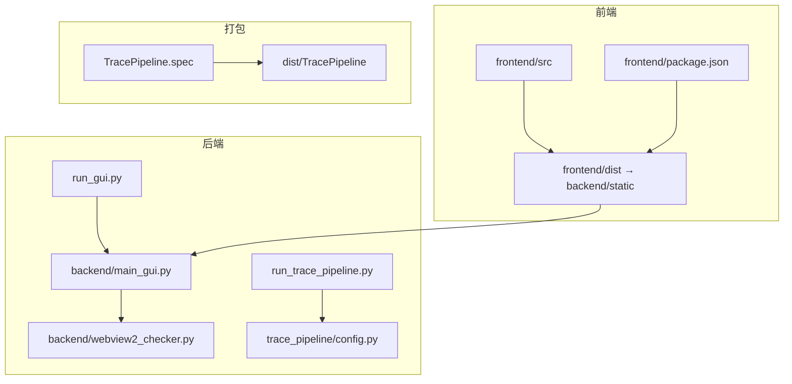
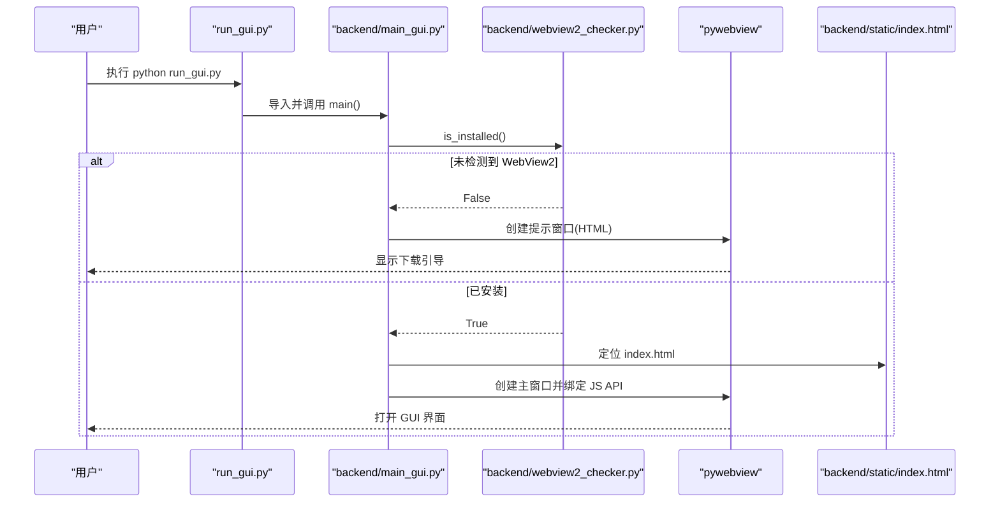
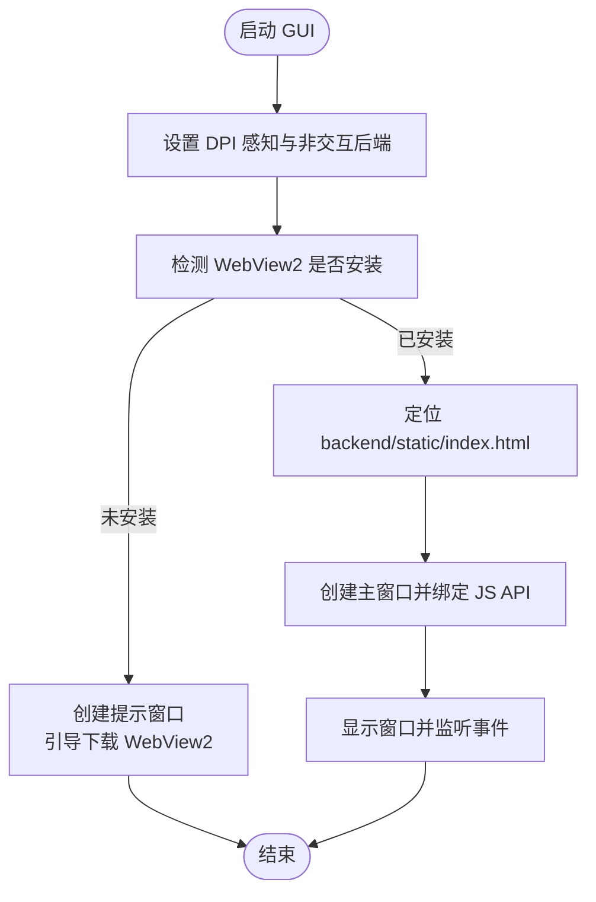
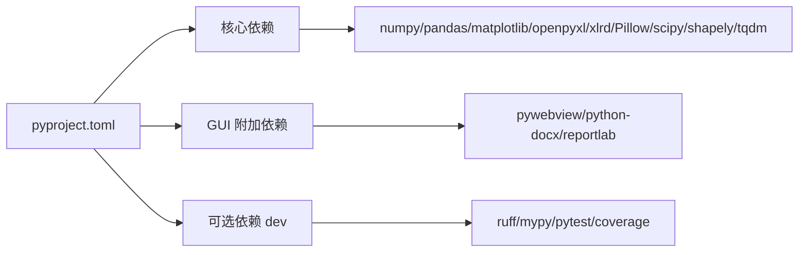

# 安装与环境配置

<cite>
**本文引用的文件**   
- [README.md](file://README.md)
- [pyproject.toml](file://pyproject.toml)
- [requirements.txt](file://requirements.txt)
- [config.example.json](file://config.example.json)
- [trace_pipeline/config.py](file://trace_pipeline/config.py)
- [run_trace_pipeline.py](file://run_trace_pipeline.py)
- [run_gui.py](file://run_gui.py)
- [backend/main_gui.py](file://backend/main_gui.py)
- [backend/webview2_checker.py](file://backend/webview2_checker.py)
- [TracePipeline.spec](file://TracePipeline.spec)
- [frontend/package.json](file://frontend/package.json)
</cite>

## 目录
1. [简介](#简介)
2. [项目结构](#项目结构)
3. [核心组件](#核心组件)
4. [架构总览](#架构总览)
5. [详细组件分析](#详细组件分析)
6. [依赖分析](#依赖分析)
7. [性能考虑](#性能考虑)
8. [故障排除指南](#故障排除指南)
9. [结论](#结论)
10. [附录](#附录)

## 简介
本文件面向 TracePipeline 的安装与环境配置，覆盖多种安装方式（pip 虚拟环境、仅 CLI 模式、开发依赖、conda/mamba、uv），系统要求与运行时/GUI 附加依赖，前端构建与开发环境设置，配置文件 config.json 的完整说明，以及常见问题排查与性能优化建议。

## 项目结构
TracePipeline 采用前后端分离的桌面应用架构：
- 后端：Python 服务（CLI + GUI 容器 pywebview）
- 前端：Vue 3 + TypeScript + Element Plus + ECharts，生产构建产物位于 backend/static
- 打包：PyInstaller 规格文件用于生成独立可执行

图表来源
- [frontend/package.json:1-37](file://frontend/package.json#L1-L37)
- [run_gui.py:1-60](file://run_gui.py#L1-L60)
- [backend/main_gui.py:1-211](file://backend/main_gui.py#L1-L211)
- [backend/webview2_checker.py:1-60](file://backend/webview2_checker.py#L1-L60)
- [run_trace_pipeline.py:1-30](file://run_trace_pipeline.py#L1-L30)
- [TracePipeline.spec:1-150](file://TracePipeline.spec#L1-L150)

章节来源
- [README.md:323-406](file://README.md#L323-L406)
- [frontend/package.json:1-37](file://frontend/package.json#L1-L37)
- [run_gui.py:1-60](file://run_gui.py#L1-L60)
- [backend/main_gui.py:1-211](file://backend/main_gui.py#L1-L211)
- [backend/webview2_checker.py:1-60](file://backend/webview2_checker.py#L1-L60)
- [run_trace_pipeline.py:1-30](file://run_trace_pipeline.py#L1-L30)
- [TracePipeline.spec:1-150](file://TracePipeline.spec#L1-L150)

## 核心组件
- 安装与依赖声明：pyproject.toml 定义 Python 版本、依赖与可选依赖；requirements.txt 为自动生成清单
- 运行入口：CLI 通过 run_trace_pipeline.py，GUI 通过 run_gui.py
- 配置加载：trace_pipeline/config.py 提供默认配置、JSON 覆盖、路径解析与校验
- GUI 启动：backend/main_gui.py 负责 WebView2 检测、窗口创建与静态资源加载
- 前端构建：frontend/package.json 管理脚本与依赖，构建输出到 backend/static

章节来源
- [pyproject.toml:1-83](file://pyproject.toml#L1-L83)
- [requirements.txt:1-17](file://requirements.txt#L1-L17)
- [run_trace_pipeline.py:1-30](file://run_trace_pipeline.py#L1-L30)
- [run_gui.py:1-60](file://run_gui.py#L1-L60)
- [trace_pipeline/config.py:1-326](file://trace_pipeline/config.py#L1-L326)
- [backend/main_gui.py:1-211](file://backend/main_gui.py#L1-L211)
- [frontend/package.json:1-37](file://frontend/package.json#L1-L37)

## 架构总览
下图展示 GUI 启动流程与关键依赖关系，包括 WebView2 检测、静态资源定位与服务初始化。

图表来源
- [run_gui.py:1-60](file://run_gui.py#L1-L60)
- [backend/main_gui.py:1-211](file://backend/main_gui.py#L1-L211)
- [backend/webview2_checker.py:1-60](file://backend/webview2_checker.py#L1-L60)

## 详细组件分析

### 系统要求与前置条件
- 操作系统：Windows 10 (1809+) / 11（GUI 必需；CLI 理论上跨平台）
- Python：3.10+（推荐 3.11）
- Node.js：18 LTS（仅 GUI 前端构建需要）
- WebView2 Runtime：Win11 内置；Win10 需手动或自动推送安装
- 内存/磁盘：建议 ≥4 GB 内存；≥500 MB 磁盘空间

章节来源
- [README.md:284-321](file://README.md#L284-L321)

### 安装方式

- pip 虚拟环境（推荐，全功能）
  - 步骤：克隆仓库 → 创建 venv → 激活 → 安装项目（含全部依赖）
  - 参考命令见 README 快速开始与安装章节

- 仅 CLI 模式（不含 GUI 依赖）
  - 先以 --no-deps 安装项目，再单独安装核心依赖包

- 含开发依赖
  - 使用可选依赖组 dev 安装 ruff、mypy、pytest 等

- conda / mamba
  - 创建并激活环境后，使用 pip 安装项目

- uv（快速依赖解析）
  - 使用 uv sync 同步依赖，uv run 直接运行命令行入口

章节来源
- [README.md:323-368](file://README.md#L323-L368)
- [pyproject.toml:53-60](file://pyproject.toml#L53-L60)

### 运行时依赖与 GUI 附加依赖
- 核心依赖（CLI/GUI 通用）：numpy、pandas、matplotlib、openpyxl、xlrd、Pillow、scipy、shapely、tqdm
- GUI 附加依赖：pywebview、python-docx、reportlab
- requirements.txt 由 pyproject.toml 自动生成，可直接安装

章节来源
- [README.md:297-321](file://README.md#L297-L321)
- [pyproject.toml:35-48](file://pyproject.toml#L35-L48)
- [requirements.txt:1-17](file://requirements.txt#L1-L17)

### 前端构建与开发环境
- 首次构建：进入 frontend 目录，安装依赖并执行构建，产物输出至 backend/static
- 开发模式：可使用 Vite 本地热重载，在浏览器中独立调试前端（无需后端）
- 构建脚本与依赖定义见 package.json

章节来源
- [README.md:369-379](file://README.md#L369-L379)
- [frontend/package.json:1-37](file://frontend/package.json#L1-L37)

### 运行方式
- CLI 模式：支持批量处理、单文件模式、并行、交互式选择、试运行、列出文件等
- GUI 模式：先构建前端，再运行 GUI 入口

章节来源
- [README.md:381-406](file://README.md#L381-L406)

### 配置文件 config.json 完整说明
- 位置与模板：项目根目录 config.json（不提交 Git），可从 config.example.json 复制
- 加载与校验：缺失时使用默认值，类型强制转换，未知键告警，必填项检查
- 路径解析：相对路径基于配置文件所在目录或项目根目录解析为绝对路径
- 工作目录保障：启动时自动确保 input/output/logs 存在

配置项详表（节选）
- 输入输出与模式
  - input_dir: string，默认 "input"
  - output_dir: string，默认 "output"
  - process_all: bool，默认 true
  - table_stem: string，单文件模式必填
  - outcrop: string，单文件模式必填
- 绘图与导出
  - export_rose_plot: bool，默认 false
  - rose_bin_width: float，默认 10.0
  - rose_dpi / trace_dpi / rotated_trace_dpi: int，默认 600
- 圆窗策略
  - window_strategy: string，默认 "auto"
  - auto_density_threshold: float，默认 5.0
  - tangent_window_count: int，默认 3
  - min_intersections: int，默认 5
- 节点识别
  - enable_node_recognition: bool，默认 false
  - node_merge_tolerance: float，默认 0.01
  - show_node_overlay: bool，默认 true
  - node_label_mode: string，默认 "type"
- 其他
  - style: dict，默认 {}
  - parallel_workers: int，默认 0（自动 CPU 数）
  - is_dev_mode: bool，默认 false

章节来源
- [config.example.json:1-26](file://config.example.json#L1-L26)
- [trace_pipeline/config.py:56-79](file://trace_pipeline/config.py#L56-L79)
- [trace_pipeline/config.py:86-145](file://trace_pipeline/config.py#L86-L145)
- [trace_pipeline/config.py:148-190](file://trace_pipeline/config.py#L148-L190)
- [trace_pipeline/config.py:218-245](file://trace_pipeline/config.py#L218-L245)
- [trace_pipeline/config.py:264-312](file://trace_pipeline/config.py#L264-L312)
- [README.md:410-505](file://README.md#L410-L505)

### GUI 启动与 WebView2 检测
- 启动流程：run_gui.py 设置 DPI 感知与 matplotlib 非交互后端，随后调用 backend/main_gui.py
- WebView2 检测：若未安装，弹出 HTML 提示并引导下载；否则创建主窗口并加载静态资源
- 窗口居中与事件：根据屏幕尺寸计算居中坐标，注册关闭事件以优雅退出

图表来源
- [run_gui.py:1-60](file://run_gui.py#L1-L60)
- [backend/main_gui.py:1-211](file://backend/main_gui.py#L1-L211)
- [backend/webview2_checker.py:1-60](file://backend/webview2_checker.py#L1-L60)

章节来源
- [run_gui.py:1-60](file://run_gui.py#L1-L60)
- [backend/main_gui.py:1-211](file://backend/main_gui.py#L1-L211)
- [backend/webview2_checker.py:1-60](file://backend/webview2_checker.py#L1-L60)

### 打包与分发
- PyInstaller 规格文件包含数据文件、隐藏导入与图标配置
- 打包产物：独立文件夹 dist/TracePipeline，可用于安装版与便携版生成

章节来源
- [TracePipeline.spec:1-150](file://TracePipeline.spec#L1-L150)

## 依赖分析
- Python 版本约束：>=3.10
- 核心依赖：数值计算、Excel 读写、绘图、空间算法、图像处理、进度条
- GUI 依赖：pywebview（WebView2 容器）、报告导出库
- 可选依赖：开发工具链（ruff、mypy、pytest、coverage）

图表来源
- [pyproject.toml:1-83](file://pyproject.toml#L1-L83)

章节来源
- [pyproject.toml:1-83](file://pyproject.toml#L1-L83)
- [requirements.txt:1-17](file://requirements.txt#L1-L17)

## 性能考虑
- 并行处理：CLI 支持多进程并行，合理设置 workers 可提升吞吐
- 缓存体系：GUI 提供多级缓存（文件扫描、统计数据、图片、缩略图、Excel 数据、样式预览、结果列表、对比数据）
- 渲染质量：DPI 可调，按需启用玫瑰图与节点覆盖层
- 资源占用：GUI 模式建议 ≥4 GB 内存；大量图像预览时注意内存峰值

章节来源
- [README.md:636-648](file://README.md#L636-L648)
- [README.md:603-610](file://README.md#L603-L610)

## 故障排除指南
- 未安装项目依赖
  - 现象：导入失败或模块缺失
  - 解决：执行 pip install -e . 或 pip install -r requirements.txt

- 仅 CLI 模式缺少 GUI 依赖
  - 现象：GUI 启动时报 pywebview 相关错误
  - 解决：按“仅 CLI 模式”安装方式安装核心依赖，避免引入 GUI 依赖

- WebView2 Runtime 未安装
  - 现象：GUI 启动后弹出 WebView2 未安装提示
  - 解决：按提示下载安装 WebView2 Runtime 后重启程序

- 配置文件无效或缺失
  - 现象：JSON 解析失败、字段缺失或类型不合法
  - 解决：从 config.example.json 复制为 config.json，修正 JSON 语法与必填字段

- 目录权限问题
  - 现象：无法创建 input/output/logs 目录
  - 解决：以管理员权限运行或修改目标路径为可写目录

章节来源
- [README.md:1102-1133](file://README.md#L1102-L1133)
- [backend/webview2_checker.py:1-60](file://backend/webview2_checker.py#L1-L60)
- [trace_pipeline/config.py:86-145](file://trace_pipeline/config.py#L86-L145)
- [trace_pipeline/config.py:264-312](file://trace_pipeline/config.py#L264-L312)

## 结论
TracePipeline 提供了完善的安装与环境配置方案，支持多种安装方式与灵活的配置选项。遵循本文档的系统要求、依赖说明与故障排除建议，可快速搭建稳定可用的 CLI 与 GUI 环境。对于大规模数据处理，建议结合并行与缓存策略以获得更佳性能。

## 附录
- 快速开始命令与示例请参考 README 中的“快速开始”与“安装与运行”章节
- 前端开发与调试请参考 frontend/package.json 中的脚本定义