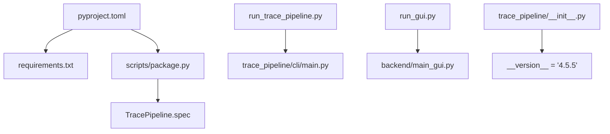
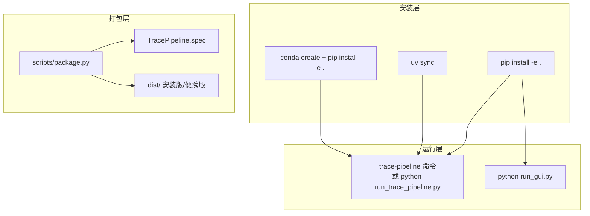
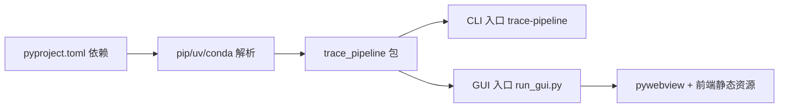

# 安装方式详解

<cite>
**本文引用的文件**   
- [README.md](file://README.md)
- [pyproject.toml](file://pyproject.toml)
- [requirements.txt](file://requirements.txt)
- [TracePipeline.spec](file://TracePipeline.spec)
- [scripts/package.py](file://scripts/package.py)
- [run_trace_pipeline.py](file://run_trace_pipeline.py)
- [run_gui.py](file://run_gui.py)
- [trace_pipeline/__init__.py](file://trace_pipeline/__init__.py)
- [config.example.json](file://config.example.json)
</cite>

## 目录
1. [简介](#简介)
2. [项目结构（与安装相关）](#项目结构与安装相关)
3. [核心组件（与安装相关）](#核心组件与安装相关)
4. [架构总览（与安装相关）](#架构总览与安装相关)
5. [详细安装方式](#详细安装方式)
6. [依赖关系分析](#依赖关系分析)
7. [性能与环境建议](#性能与环境建议)
8. [故障排查指南](#故障排查指南)
9. [结论](#结论)
10. [附录：验证步骤清单](#附录验证步骤清单)

## 简介
本文件面向 TracePipeline 的安装与部署，覆盖所有官方支持的安装方式：pip 虚拟环境安装（推荐）、仅 CLI 模式安装、开发依赖安装、conda/mamba 安装、uv 快速安装，以及 PyInstaller 打包的预编译版本下载与安装说明。文档同时给出不同操作系统下的差异与注意事项、安装后的验证方法，帮助读者在不同场景下顺利完成安装并稳定运行。

## 项目结构（与安装相关）
与安装直接相关的顶层文件与脚本如下：
- pyproject.toml：声明 Python 版本要求、运行时依赖、可选依赖、可执行入口等
- requirements.txt：由构建脚本从 pyproject.toml 自动生成的依赖清单
- scripts/package.py：PyInstaller + Inno Setup + 7-Zip 的一键打包流水线
- TracePipeline.spec：PyInstaller 打包规格，定义数据文件与隐藏导入
- run_trace_pipeline.py / run_gui.py：CLI 与 GUI 启动入口
- trace_pipeline/__init__.py：包元信息与惰性导出，包含版本号
- README.md：包含多种安装方式的示例命令与说明
- config.example.json：配置模板，复制为 config.json 后使用

图表来源
- [pyproject.toml:1-83](file://pyproject.toml#L1-L83)
- [requirements.txt:1-17](file://requirements.txt#L1-L17)
- [scripts/package.py:1-703](file://scripts/package.py#L1-L703)
- [TracePipeline.spec:1-150](file://TracePipeline.spec#L1-L150)
- [run_trace_pipeline.py:1-30](file://run_trace_pipeline.py#L1-L30)
- [run_gui.py:1-60](file://run_gui.py#L1-L60)
- [trace_pipeline/__init__.py:1-83](file://trace_pipeline/__init__.py#L1-L83)

章节来源
- [pyproject.toml:1-83](file://pyproject.toml#L1-L83)
- [requirements.txt:1-17](file://requirements.txt#L1-L17)
- [scripts/package.py:1-703](file://scripts/package.py#L1-L703)
- [TracePipeline.spec:1-150](file://TracePipeline.spec#L1-L150)
- [run_trace_pipeline.py:1-30](file://run_trace_pipeline.py#L1-L30)
- [run_gui.py:1-60](file://run_gui.py#L1-L60)
- [trace_pipeline/__init__.py:1-83](file://trace_pipeline/__init__.py#L1-L83)

## 核心组件（与安装相关）
- 包元信息：trace_pipeline/__init__.py 中定义了 __version__，用于打包与分发标识
- 命令行入口：pyproject.toml 中注册 trace-pipeline 命令，指向 trace_pipeline.cli.main:main
- 依赖声明：pyproject.toml 的 dependencies 列表决定 pip/uv/conda 等工具解析的依赖集
- 打包产物：scripts/package.py 生成独立程序文件夹、安装版与便携版

章节来源
- [trace_pipeline/__init__.py:1-83](file://trace_pipeline/__init__.py#L1-L83)
- [pyproject.toml:50-52](file://pyproject.toml#L50-L52)
- [pyproject.toml:35-48](file://pyproject.toml#L35-L48)
- [scripts/package.py:1-703](file://scripts/package.py#L1-L703)

## 架构总览（与安装相关）
下图展示与安装和运行相关的组件交互：用户通过 pip/uv/conda 安装后，可通过命令行或 GUI 启动；GUI 需要前端构建产物；打包流程将应用与资源合并为可分发的安装包。

图表来源
- [pyproject.toml:50-52](file://pyproject.toml#L50-L52)
- [run_trace_pipeline.py:1-30](file://run_trace_pipeline.py#L1-L30)
- [run_gui.py:1-60](file://run_gui.py#L1-L60)
- [scripts/package.py:1-703](file://scripts/package.py#L1-L703)
- [TracePipeline.spec:1-150](file://TracePipeline.spec#L1-L150)

## 详细安装方式

### 前置条件与系统要求
- 操作系统：Windows 10 (1809+) / 11（GUI 必需）；CLI 理论上跨平台
- Python：3.10+（推荐 3.11），支持 3.12
- Node.js：18 LTS（仅 GUI 前端构建时需要）
- WebView2 Runtime：Win11 内置；Win10 需手动安装
- 内存：CLI ≥2 GB，GUI ≥4 GB
- 磁盘：≥500 MB（含依赖），打包产物约 150–250 MB

章节来源
- [README.md:284-321](file://README.md#L284-L321)

### 方式一：pip 虚拟环境安装（推荐，全功能）
适用场景：首次安装、需要完整功能（含 GUI 与报告导出）。

步骤：
1. 克隆仓库并进入目录
2. 创建并激活虚拟环境
3. 以可编辑模式安装项目（自动解析 pyproject.toml 依赖）
4. 如需 GUI，先构建前端再启动 GUI

参考命令路径：
- [README.md:327-339](file://README.md#L327-L339)
- [README.md:369-377](file://README.md#L369-L377)

注意：
- 若网络受限，可改用国内镜像源
- 首次构建前端耗时较长，请确保 Node.js 已安装

章节来源
- [README.md:327-339](file://README.md#L327-L339)
- [README.md:369-377](file://README.md#L369-L377)

### 方式二：仅 CLI 模式安装（不含 GUI 依赖）
适用场景：仅需命令行批处理，不运行 GUI，减少依赖体积。

步骤：
1. 以 --no-deps 安装项目本体
2. 手动安装核心依赖（numpy、pandas、matplotlib、openpyxl、xlrd、Pillow、scipy、shapely、tqdm）

参考命令路径：
- [README.md:341-346](file://README.md#L341-L346)

注意：
- 该方式跳过 GUI 与报告导出所需依赖，适合服务器或轻量环境
- 若后续需要 GUI，请切换至方式一

章节来源
- [README.md:341-346](file://README.md#L341-L346)

### 方式三：含开发依赖安装
适用场景：参与开发、运行测试、代码检查与类型检查。

步骤：
- 在虚拟环境中安装可选依赖 dev（ruff、mypy、pytest、pytest-cov、coverage）

参考命令路径：
- [README.md:348-352](file://README.md#L348-L352)
- [pyproject.toml:53-60](file://pyproject.toml#L53-L60)

注意：
- 开发依赖仅在本地开发时使用，不影响生产运行

章节来源
- [README.md:348-352](file://README.md#L348-L352)
- [pyproject.toml:53-60](file://pyproject.toml#L53-L60)

### 方式四：conda / mamba 安装
适用场景：已有 conda/mamba 环境，希望统一管理 Python 与系统级依赖。

步骤：
1. 创建并激活新环境（Python 3.11）
2. 在项目目录下以可编辑模式安装

参考命令路径：
- [README.md:354-360](file://README.md#L354-L360)

注意：
- 若某些二进制依赖在 conda 通道不可用，仍会回退到 pip 安装
- 建议在 conda 环境中也遵循“先构建前端，再启动 GUI”的流程

章节来源
- [README.md:354-360](file://README.md#L354-L360)

### 方式五：uv 快速安装
适用场景：追求更快的依赖解析与安装体验。

步骤：
1. 在项目根目录执行 uv sync（根据 pyproject.toml 解析依赖）
2. 使用 uv run 调用注册的命令行入口

参考命令路径：
- [README.md:362-367](file://README.md#L362-L367)
- [pyproject.toml:50-52](file://pyproject.toml#L50-L52)

注意：
- uv 会自动管理虚拟环境，无需手动创建
- 若需 GUI，仍需按方式一的步骤构建前端

章节来源
- [README.md:362-367](file://README.md#L362-L367)
- [pyproject.toml:50-52](file://pyproject.toml#L50-L52)

### PyInstaller 打包的预编译版本下载与安装
适用场景：不想安装 Python 环境，直接运行桌面应用。

获取与安装：
- 从发布页下载“安装版”或“便携版”
- 安装版：运行安装程序，按向导完成安装
- 便携版：自解压后直接运行 TracePipeline.exe

打包与产物说明：
- 打包脚本：scripts/package.py
- 打包规格：TracePipeline.spec
- 产物位置：dist/ 目录（包含程序文件夹、安装版 exe、便携版 exe）

参考路径：
- [scripts/package.py:1-703](file://scripts/package.py#L1-L703)
- [TracePipeline.spec:1-150](file://TracePipeline.spec#L1-L150)

注意：
- 便携版为单文件自解压程序，解压后直接运行
- 安装版会在开始菜单创建快捷方式，并提供卸载选项

章节来源
- [scripts/package.py:1-703](file://scripts/package.py#L1-L703)
- [TracePipeline.spec:1-150](file://TracePipeline.spec#L1-L150)

### 不同操作系统下的安装差异与特殊处理
- Windows：
  - GUI 必需 WebView2 Runtime；Win11 内置，Win10 需手动安装
  - 打包与安装程序生成依赖 Inno Setup 6 与 7-Zip（SFX）
- Linux/macOS：
  - CLI 理论上可用，但 GUI 依赖 pywebview 与 WebView2，主要面向 Windows
  - 若需 GUI，建议使用 Windows 环境或虚拟机

参考路径：
- [README.md:284-296](file://README.md#L284-L296)
- [scripts/package.py:260-277](file://scripts/package.py#L260-L277)

章节来源
- [README.md:284-296](file://README.md#284-296)
- [scripts/package.py:260-277](file://scripts/package.py#L260-L277)

## 依赖关系分析
- 运行时依赖（核心）：numpy、pandas、matplotlib、openpyxl、xlrd、Pillow、scipy、shapely、tqdm
- GUI 附加依赖：pywebview、python-docx、reportlab
- 可选依赖（开发）：ruff、mypy、pytest、pytest-cov、coverage
- 可执行入口：trace-pipeline → trace_pipeline.cli.main:main

图表来源
- [pyproject.toml:35-48](file://pyproject.toml#L35-L48)
- [pyproject.toml:50-52](file://pyproject.toml#L50-L52)
- [run_gui.py:1-60](file://run_gui.py#L1-L60)

章节来源
- [pyproject.toml:35-48](file://pyproject.toml#L35-L48)
- [pyproject.toml:50-52](file://pyproject.toml#L50-L52)
- [run_gui.py:1-60](file://run_gui.py#L1-L60)

## 性能与环境建议
- 优先使用 Python 3.11 以获得最佳性能
- 并行处理时建议内存 ≥4 GB
- 高 DPI 输出（玫瑰图/迹线图）会增加绘图时间，按需调整 DPI
- 批量处理可使用 -p 参数指定进程数，提升吞吐

章节来源
- [README.md:284-296](file://README.md#L284-L296)
- [README.md:596-610](file://README.md#L596-L610)

## 故障排查指南
常见问题与定位：
- 未安装项目依赖：提示缺少依赖时，运行 pip install -e . 或 uv sync
- 仅 CLI 模式缺失依赖：确认是否采用“仅 CLI 模式安装”，必要时补装 matplotlib、openpyxl 等
- GUI 无法启动：检查 WebView2 Runtime 是否安装；确认前端已构建（backend/static/index.html 存在）
- 打包失败：检查 PyInstaller、Inno Setup 6、7-Zip 是否可用；查看打包脚本日志

参考路径：
- [README.md:1102-1133](file://README.md#L1102-L1133)
- [run_trace_pipeline.py:14-30](file://run_trace_pipeline.py#L14-L30)
- [run_gui.py:40-60](file://run_gui.py#L40-L60)
- [scripts/package.py:210-278](file://scripts/package.py#L210-L278)

章节来源
- [README.md:1102-1133](file://README.md#L1102-L1133)
- [run_trace_pipeline.py:14-30](file://run_trace_pipeline.py#L14-L30)
- [run_gui.py:40-60](file://run_gui.py#L40-L60)
- [scripts/package.py:210-278](file://scripts/package.py#L210-L278)

## 结论
TracePipeline 提供多种安装方式以满足不同用户需求：推荐使用 pip 虚拟环境进行全功能安装；对仅需批处理的场景可采用仅 CLI 模式；开发者可选择安装开发依赖；conda/mamba 与 uv 提供了更灵活的环境管理与更快的安装体验。对于非技术用户，可直接下载 PyInstaller 打包的预编译版本，免去环境配置。无论选择哪种方式，都建议按照本文提供的验证步骤确认安装成功。

## 附录：验证步骤清单
- 验证 Python 与包版本：
  - 运行 trace-pipeline --version 或 python -c "import trace_pipeline; print(trace_pipeline.__version__)"
  - 参考路径：[trace_pipeline/__init__.py:19](file://trace_pipeline/__init__.py#L19)
- 验证 CLI 工作流：
  - 列出输入文件：trace-pipeline -l
  - 试运行：trace-pipeline -n
  - 参考路径：[README.md:585-602](file://README.md#L585-L602)
- 验证 GUI 工作流：
  - 构建前端后运行：python run_gui.py
  - 参考路径：[README.md:369-377](file://README.md#L369-L377)
- 验证配置文件：
  - 复制模板为 config.json 并按需修改
  - 参考路径：[config.example.json:1-26](file://config.example.json#L1-L26)

章节来源
- [trace_pipeline/__init__.py:19](file://trace_pipeline/__init__.py#L19)
- [README.md:585-602](file://README.md#L585-L602)
- [README.md:369-377](file://README.md#L369-L377)
- [config.example.json:1-26](file://config.example.json#L1-L26)