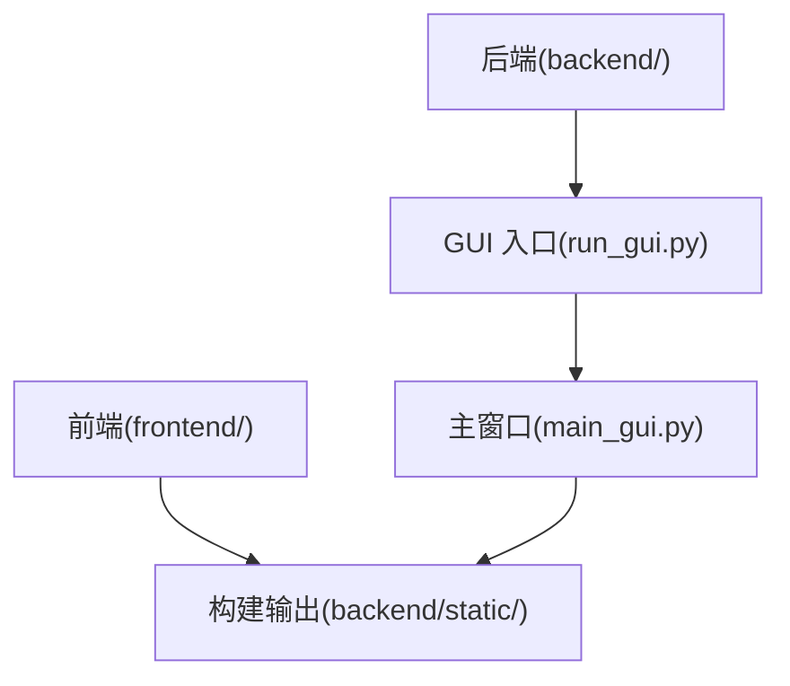
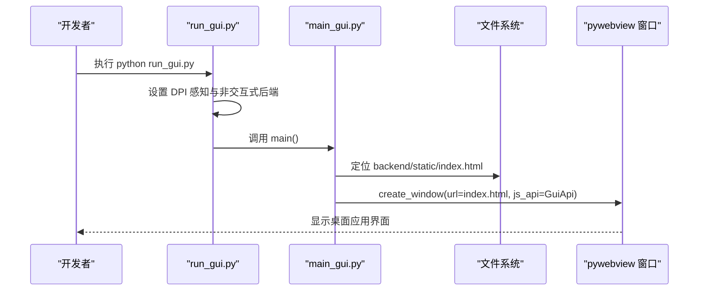
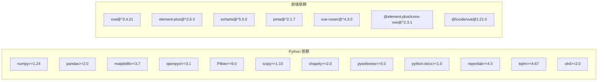

# 开发环境设置

<cite>
**本文引用的文件**   
- [README.md](file://README.md)
- [pyproject.toml](file://pyproject.toml)
- [requirements.txt](file://requirements.txt)
- [frontend/package.json](file://frontend/package.json)
- [frontend/vite.config.ts](file://frontend/vite.config.ts)
- [frontend/vitest.config.ts](file://frontend/vitest.config.ts)
- [run_gui.py](file://run_gui.py)
- [backend/main_gui.py](file://backend/main_gui.py)
- [.gitignore](file://.gitignore)
</cite>

## 目录
1. [简介](#简介)
2. [项目结构](#项目结构)
3. [核心组件](#核心组件)
4. [架构总览](#架构总览)
5. [详细组件分析](#详细组件分析)
6. [依赖关系分析](#依赖关系分析)
7. [性能与构建优化](#性能与构建优化)
8. [故障排查指南](#故障排查指南)
9. [结论](#结论)
10. [附录](#附录)

## 简介
本指南面向开发者，提供 TracePipeline 前后端完整开发环境的搭建说明。内容涵盖：
- 前端开发环境：Node.js 版本、包管理器安装、依赖安装、开发服务器启动与预览
- 后端开发环境：Python 虚拟环境、GUI 入口运行、调试要点
- 前后端联调：本地独立调试前端（Vite 热重载）与 GUI 桌面应用（WebView2）
- 代码质量与测试：格式化、类型检查、Linting、单元测试
- 构建与打包：前端生产构建、PyInstaller 打包流程

## 项目结构
仓库采用前后端分离的桌面应用形态：
- 前端位于 frontend/，基于 Vue 3 + Vite + TypeScript，使用 Element Plus 和 ECharts
- 后端以 Python 为主，GUI 通过 pywebview 嵌入 WebView2，静态资源由前端构建产物提供
- 根级配置包括 Python 项目元数据与可选开发依赖、前端脚本与构建配置

图表来源
- [frontend/vite.config.ts:112-126](file://frontend/vite.config.ts#L112-L126)
- [run_gui.py:40-46](file://run_gui.py#L40-L46)
- [backend/main_gui.py:143-174](file://backend/main_gui.py#L143-L174)

章节来源
- [README.md:369-377](file://README.md#L369-L377)
- [frontend/package.json:6-12](file://frontend/package.json#L6-L12)
- [frontend/vite.config.ts:112-126](file://frontend/vite.config.ts#L112-L126)
- [run_gui.py:40-46](file://run_gui.py#L40-L46)
- [backend/main_gui.py:143-174](file://backend/main_gui.py#L143-L174)

## 核心组件
- 前端工程化
  - 包管理：npm/yarn/pnpm 均可，推荐 npm（默认锁定文件为 package-lock.json）
  - 脚本命令：dev/build/preview/typecheck/test/test:watch
  - 构建输出：指向 backend/static/，供 GUI 直接加载
- 后端 GUI 启动
  - 入口：run_gui.py 负责 DPI 感知、非交互式 matplotlib 后端、工作区初始化
  - 主窗口：backend/main_gui.py 创建 pywebview 窗口并加载前端 index.html
- 开发与测试工具链
  - 前端：Vite、vue-tsc、vitest
  - 后端：ruff、mypy、pytest、coverage（可选 dev 依赖）

章节来源
- [frontend/package.json:6-12](file://frontend/package.json#L6-L12)
- [frontend/vite.config.ts:112-126](file://frontend/vite.config.ts#L112-L126)
- [run_gui.py:23-33](file://run_gui.py#L23-L33)
- [backend/main_gui.py:81-106](file://backend/main_gui.py#L81-L106)
- [pyproject.toml:53-60](file://pyproject.toml#L53-L60)

## 架构总览
下图展示 GUI 启动与前后端交互的关键路径：DPI 感知设置 → 工作区准备 → 创建窗口 → 加载静态页面 → 绑定 JS API。

图表来源
- [run_gui.py:23-33](file://run_gui.py#L23-L33)
- [run_gui.py:40-46](file://run_gui.py#L40-L46)
- [backend/main_gui.py:143-174](file://backend/main_gui.py#L143-L174)

## 详细组件分析

### 前端开发环境
- Node.js 版本要求
  - 官方文档建议 Node.js 18 LTS（用于构建与运行 Vite）
- 包管理器
  - 推荐使用 npm（已包含 package-lock.json），yarn/pnpm 亦可
- 依赖安装
  - 进入 frontend 目录执行安装命令
- 开发服务器
  - 启动 Vite 开发服务器，支持热重载；可独立于后端在浏览器中调试
- 类型检查
  - 使用 vue-tsc 进行类型校验
- 测试
  - 使用 vitest 运行前端测试用例

章节来源
- [README.md:292-293](file://README.md#L292-L293)
- [frontend/package.json:6-12](file://frontend/package.json#L6-L12)
- [frontend/vitest.config.ts:12-17](file://frontend/vitest.config.ts#L12-L17)

### 后端开发环境
- Python 版本
  - 最低 3.10，推荐 3.11（性能最优），兼容 3.12
- 虚拟环境
  - 使用 venv 或 conda/mamba 创建隔离环境
- 安装方式
  - 全功能安装（含 GUI 依赖）、仅 CLI 模式、含开发依赖、uv 快速同步
- GUI 运行
  - 首次需构建前端静态资源，然后运行 GUI 入口
- 调试要点
  - 确保 WebView2 Runtime 已安装；未安装时会弹出提示页引导下载

章节来源
- [README.md:288-295](file://README.md#L288-L295)
- [README.md:327-367](file://README.md#L327-L367)
- [README.md:369-377](file://README.md#L369-L377)
- [backend/main_gui.py:97-133](file://backend/main_gui.py#L97-L133)

### 前后端联调方法
- 前端独立调试
  - 使用 Vite 开发服务器，自动热重载，无需启动 Python 后端
- 与 GUI 联调
  - 先构建前端到 backend/static/，再运行 GUI 入口
  - 修改前端后重新构建，或在开发阶段使用 Vite 预览
- 环境变量与注入
  - 构建时从 Python 源码读取版本号并注入到前端常量

章节来源
- [README.md:369-377](file://README.md#L369-L377)
- [frontend/vite.config.ts:10-20](file://frontend/vite.config.ts#L10-L20)
- [frontend/vite.config.ts:109-111](file://frontend/vite.config.ts#L109-L111)

### 代码质量与测试
- 前端
  - 类型检查：vue-tsc
  - 测试：vitest（jsdom 环境）
- 后端
  - Lint/格式：ruff（行宽 100，选择规则集）
  - 类型检查：mypy（Python 3.10）
  - 测试：pytest（测试路径 tests）
  - 覆盖率：coverage（源路径 trace_pipeline 与 backend）

章节来源
- [frontend/package.json:6-12](file://frontend/package.json#L6-L12)
- [frontend/vitest.config.ts:12-17](file://frontend/vitest.config.ts#L12-L17)
- [pyproject.toml:62-73](file://pyproject.toml#L62-L73)
- [pyproject.toml:81-83](file://pyproject.toml#L81-L83)

### 构建与打包流程
- 前端构建
  - 构建输出目录：backend/static/
  - 手动分块策略：按库拆分（如 echarts、element-plus、vue-vendor 等）
- 应用打包
  - PyInstaller 打包 Python 应用
  - Inno Setup 生成安装程序
  - 7-Zip SFX 生成便携版
- 打包脚本
  - scripts/package.py 提供一键流水线（含跳过选项）

章节来源
- [frontend/vite.config.ts:112-126](file://frontend/vite.config.ts#L112-L126)
- [README.md:749-778](file://README.md#L749-L778)

## 依赖关系分析
- Python 依赖
  - 核心运行时依赖定义于 pyproject.toml，requirements.txt 为自动生成镜像
  - 可选开发依赖包含 ruff、mypy、pytest、pytest-cov、coverage
- 前端依赖
  - 运行时依赖：Vue 3、Element Plus、ECharts、Pinia、Router 等
  - 开发依赖：Vite、TypeScript、vue-tsc、vitest、jsdom、sass 等

图表来源
- [pyproject.toml:35-48](file://pyproject.toml#L35-L48)
- [requirements.txt:1-17](file://requirements.txt#L1-L17)
- [frontend/package.json:14-34](file://frontend/package.json#L14-L34)

章节来源
- [pyproject.toml:35-48](file://pyproject.toml#L35-L48)
- [requirements.txt:1-17](file://requirements.txt#L1-L17)
- [frontend/package.json:14-34](file://frontend/package.json#L14-L34)

## 性能与构建优化
- 前端构建优化
  - 使用 manualChunks 将大型第三方库拆分为独立 chunk，提升缓存命中与并行加载
  - 忽略特定警告（如 @vueuse/core 注解相关）以减少噪音
- 后端运行优化
  - 强制 matplotlib 非交互式后端，避免多线程绘图冲突
  - 窗口居中与最小尺寸限制，提升用户体验
- 缓存体系
  - 后端服务层内置 TTL/LRU 缓存，减少重复计算与 IO 开销

章节来源
- [frontend/vite.config.ts:115-126](file://frontend/vite.config.ts#L115-L126)
- [run_gui.py:32-33](file://run_gui.py#L32-L33)
- [backend/main_gui.py:163-174](file://backend/main_gui.py#L163-L174)
- [README.md:636-648](file://README.md#L636-L648)

## 故障排查指南
- WebView2 未安装
  - 现象：启动 GUI 时提示需要安装 WebView2 Runtime
  - 处理：根据提示链接下载安装后重启应用
- 前端构建产物缺失
  - 现象：GUI 无法加载 index.html
  - 处理：确保先执行前端构建，产物位于 backend/static/
- 类型检查失败
  - 前端：运行 typecheck 脚本定位错误
  - 后端：运行 mypy 检查类型问题
- 测试失败
  - 前端：vitest 查看具体用例失败信息
  - 后端：pytest 查看日志与堆栈
- 忽略文件与缓存
  - 确认 .gitignore 已忽略 node_modules、dist、build、backend/static/ 等，避免污染仓库

章节来源
- [backend/main_gui.py:97-133](file://backend/main_gui.py#L97-L133)
- [frontend/vite.config.ts:112-126](file://frontend/vite.config.ts#L112-L126)
- [frontend/package.json:6-12](file://frontend/package.json#L6-L12)
- [pyproject.toml:67-73](file://pyproject.toml#L67-L73)
- [pyproject.toml:81-83](file://pyproject.toml#L81-L83)
- [.gitignore:37-42](file://.gitignore#L37-L42)

## 结论
按照本指南完成前后端环境搭建与工具链配置后，即可高效开展本地开发与联调。建议：
- 始终使用推荐的 Node.js 与 Python 版本
- 保持前端构建产物与后端静态目录一致
- 利用 Vite 热重载与 vitest 快速迭代前端
- 使用 ruff/mypy/pytest 保障代码质量与稳定性

## 附录
- 常用命令速查
  - 前端
    - 安装依赖：进入 frontend 目录执行安装命令
    - 开发服务器：npm run dev
    - 类型检查：npm run typecheck
    - 测试：npm run test / npm run test:watch
    - 预览构建：npm run preview
  - 后端
    - 创建虚拟环境并安装（含开发依赖）
    - 运行 GUI：python run_gui.py
- 关键路径
  - 前端构建输出：backend/static/
  - GUI 入口：run_gui.py
  - 主窗口逻辑：backend/main_gui.py

章节来源
- [frontend/package.json:6-12](file://frontend/package.json#L6-L12)
- [README.md:369-377](file://README.md#L369-L377)
- [run_gui.py:40-46](file://run_gui.py#L40-L46)
- [backend/main_gui.py:143-174](file://backend/main_gui.py#L143-L174)