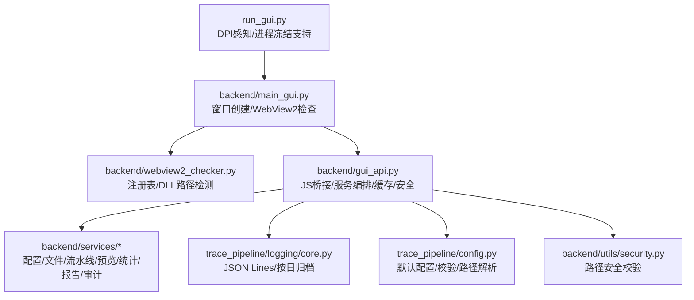
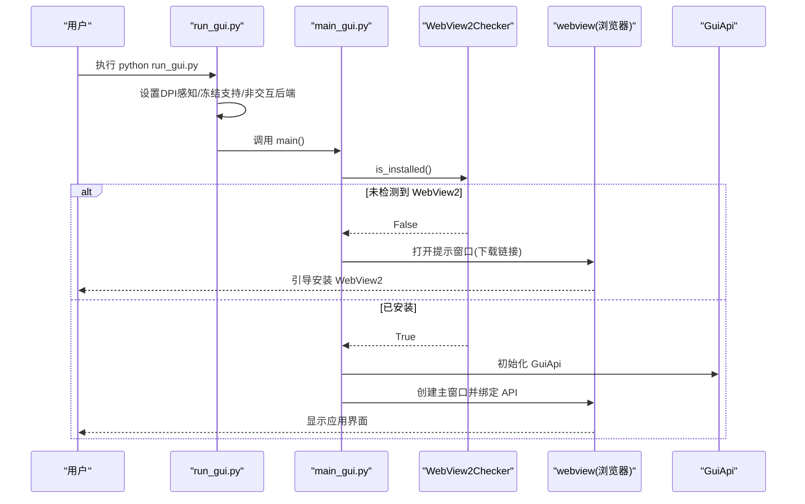
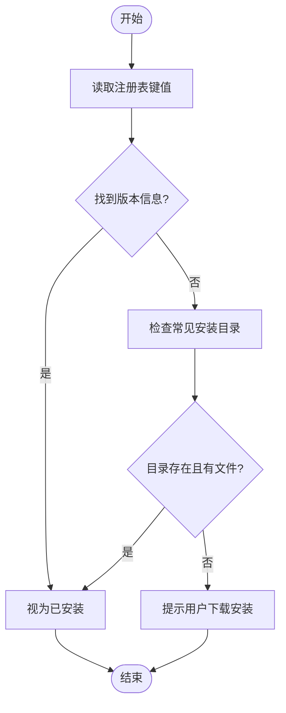
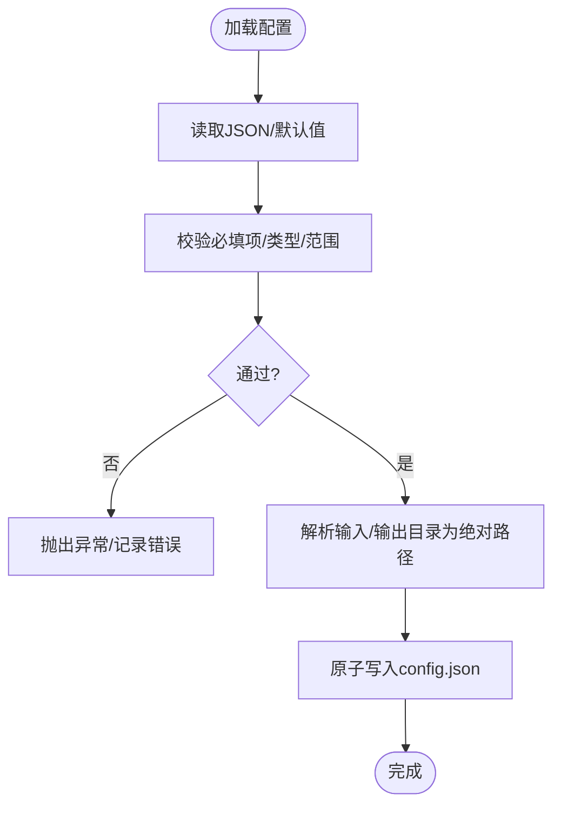
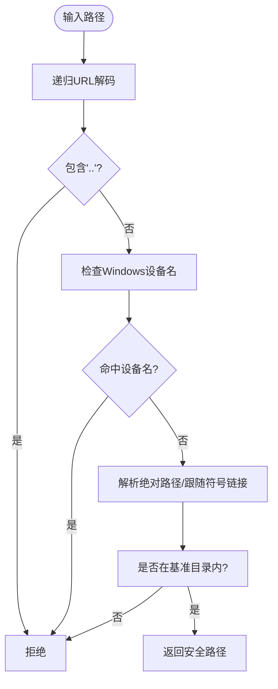
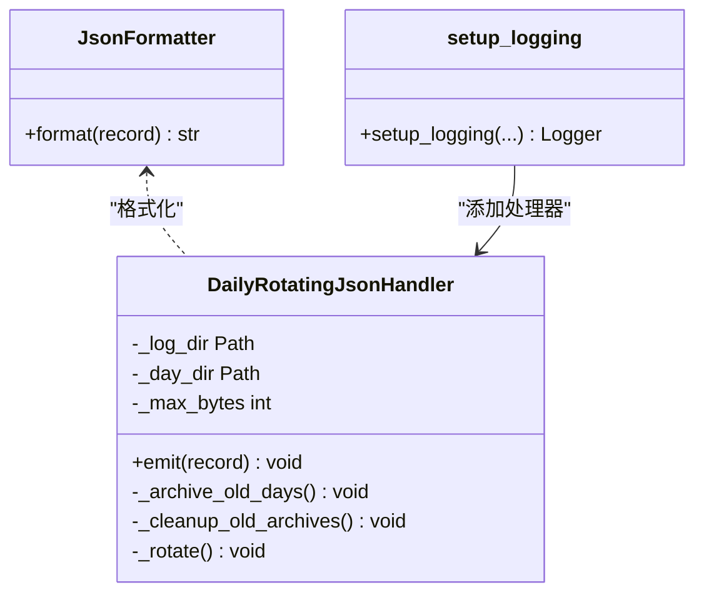
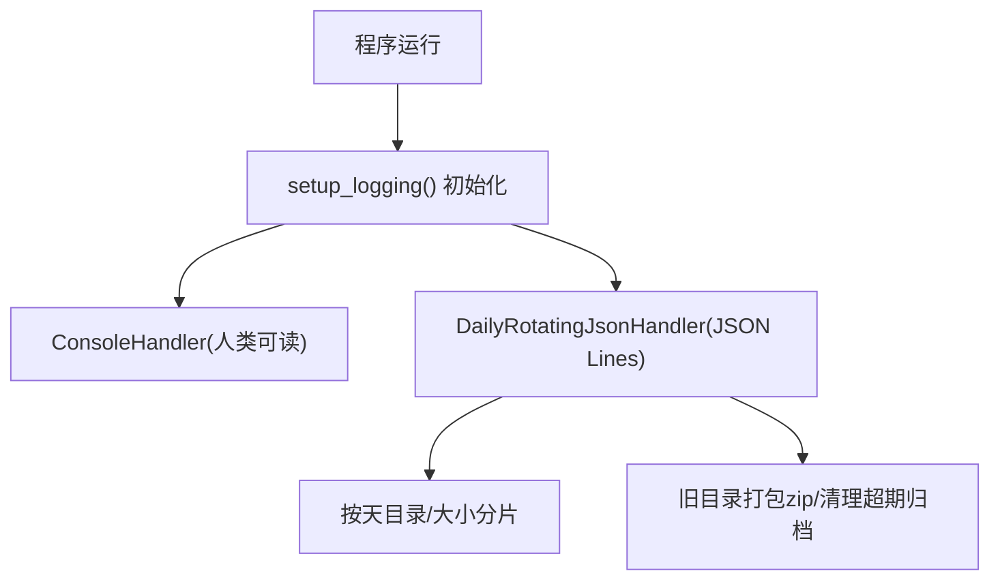

# 故障排除指南

<cite>
**本文引用的文件**   
- [README.md](file://README.md)
- [pyproject.toml](file://pyproject.toml)
- [requirements.txt](file://requirements.txt)
- [run_gui.py](file://run_gui.py)
- [run_trace_pipeline.py](file://run_trace_pipeline.py)
- [backend/main_gui.py](file://backend/main_gui.py)
- [backend/webview2_checker.py](file://backend/webview2_checker.py)
- [backend/gui_api.py](file://backend/gui_api.py)
- [backend/services/config_service.py](file://backend/services/config_service.py)
- [trace_pipeline/logging/core.py](file://trace_pipeline/logging/core.py)
- [trace_pipeline/config.py](file://trace_pipeline/config.py)
- [backend/utils/security.py](file://backend/utils/security.py)
</cite>

## 目录
1. [简介](#简介)
2. [项目结构](#项目结构)
3. [核心组件](#核心组件)
4. [架构总览](#架构总览)
5. [详细组件分析](#详细组件分析)
6. [依赖与冲突排查](#依赖与冲突排查)
7. [安装与运行问题](#安装与运行问题)
8. [运行时错误与配置问题](#运行时错误与配置问题)
9. [日志分析与调试技巧](#日志分析与调试技巧)
10. [性能问题诊断与优化](#性能问题诊断与优化)
11. [社区支持与反馈](#社区支持与反馈)
12. [结论](#结论)

## 简介
本指南聚焦于 TracePipeline 在 Windows 平台上的常见问题定位与修复，覆盖安装、依赖、运行时错误、配置问题、WebView2 Runtime 缺失、日志与调试、性能优化等。读者可据此快速定位问题并恢复使用。

## 项目结构
TracePipeline 采用“前端（Vue）+ pywebview 容器 + Python 服务层 + 计算/数据层”的分层架构。GUI 启动时先检测 WebView2，再初始化 GuiApi 与各服务；CLI 模式直接调用命令行入口。

图示来源
- [run_gui.py:1-60](file://run_gui.py#L1-L60)
- [backend/main_gui.py:1-211](file://backend/main_gui.py#L1-L211)
- [backend/webview2_checker.py:1-60](file://backend/webview2_checker.py#L1-L60)
- [backend/gui_api.py:1-800](file://backend/gui_api.py#L1-L800)
- [trace_pipeline/logging/core.py:1-450](file://trace_pipeline/logging/core.py#L1-L450)
- [trace_pipeline/config.py:1-326](file://trace_pipeline/config.py#L1-L326)
- [backend/utils/security.py:1-128](file://backend/utils/security.py#L1-L128)

章节来源
- [README.md:1-120](file://README.md#L1-L120)
- [pyproject.toml:1-83](file://pyproject.toml#L1-L83)

## 核心组件
- GUI 启动器：负责 DPI 感知、进程冻结支持、强制非交互后端、工作区目录保障、主窗口创建与事件绑定。
- WebView2 检测：通过注册表与常见 DLL 路径判断是否已安装 WebView2 Runtime。
- GuiApi：前后端 JS 桥接，统一服务编排、线程锁、缓存、输出目录变更检测、安全路径校验。
- 配置服务：config.json 的原子写入、类型校验、字段白名单覆盖、默认值合并。
- 日志系统：JSON Lines 格式、按天归档、大小分片、子进程独立日志、上下文 request_id 传播。
- 配置加载与校验：默认配置、必填项检查、相对路径解析、CLI 覆盖。
- 路径安全：递归 URL 解码、设备名过滤、符号链接解析、基准目录限制。

章节来源
- [run_gui.py:1-60](file://run_gui.py#L1-L60)
- [backend/main_gui.py:1-211](file://backend/main_gui.py#L1-L211)
- [backend/webview2_checker.py:1-60](file://backend/webview2_checker.py#L1-L60)
- [backend/gui_api.py:1-800](file://backend/gui_api.py#L1-L800)
- [backend/services/config_service.py:1-144](file://backend/services/config_service.py#L1-L144)
- [trace_pipeline/logging/core.py:1-450](file://trace_pipeline/logging/core.py#L1-L450)
- [trace_pipeline/config.py:1-326](file://trace_pipeline/config.py#L1-L326)
- [backend/utils/security.py:1-128](file://backend/utils/security.py#L1-L128)

## 架构总览
下图展示 GUI 启动与 WebView2 检测的关键流程。

图示来源
- [run_gui.py:1-60](file://run_gui.py#L1-L60)
- [backend/main_gui.py:1-211](file://backend/main_gui.py#L1-L211)
- [backend/webview2_checker.py:1-60](file://backend/webview2_checker.py#L1-L60)

## 详细组件分析

### WebView2 Runtime 检测与修复
- 检测逻辑：优先读取注册表键值，其次检查常见安装目录是否存在且包含文件。
- 未安装处理：弹出最小化窗口并提供官方下载链接，阻止后续 GUI 初始化以避免无谓的资源消耗。
- 常见症状：启动即弹窗提示需要安装 WebView2；或 GUI 无法渲染页面。

图示来源
- [backend/webview2_checker.py:1-60](file://backend/webview2_checker.py#L1-L60)
- [backend/main_gui.py:97-133](file://backend/main_gui.py#L97-L133)

章节来源
- [backend/webview2_checker.py:1-60](file://backend/webview2_checker.py#L1-L60)
- [backend/main_gui.py:97-133](file://backend/main_gui.py#L97-L133)

### 配置加载与校验
- 默认配置与必填项：缺少必要字段会抛出异常；单文件模式下 table_stem/outcrop 为必填。
- 路径解析：相对路径基于配置文件所在目录或项目根解析为绝对路径。
- 原子写入：临时文件写入后替换，避免中断导致损坏。
- 常见症状：启动时报 JSON 解析失败、缺少必填字段、保存配置失败。

图示来源
- [trace_pipeline/config.py:86-190](file://trace_pipeline/config.py#L86-L190)
- [backend/services/config_service.py:128-144](file://backend/services/config_service.py#L128-L144)

章节来源
- [trace_pipeline/config.py:86-190](file://trace_pipeline/config.py#L86-L190)
- [backend/services/config_service.py:1-144](file://backend/services/config_service.py#L1-L144)

### 路径安全与越权访问防护
- 规则要点：拒绝空路径、递归 URL 解码防双重编码、禁止 “..”、过滤 Windows 设备名、resolve 后限制在基准目录内。
- 常见症状：保存报告/ZIP 被拒绝、外部路径被拦截、越权路径警告。

图示来源
- [backend/utils/security.py:14-128](file://backend/utils/security.py#L14-L128)
- [backend/gui_api.py:165-208](file://backend/gui_api.py#L165-L208)

章节来源
- [backend/utils/security.py:1-128](file://backend/utils/security.py#L1-L128)
- [backend/gui_api.py:165-208](file://backend/gui_api.py#L165-L208)

### 日志系统与上下文追踪
- 输出格式：JSON Lines，含时间戳、级别、模块、函数、行号、request_id、异常堆栈与扩展字段。
- 存储策略：按天目录存放，超过大小自动分片，旧目录打包 zip 并清理超期归档。
- 子进程隔离：worker 进程独立日志文件，避免跨进程竞态。
- 常见症状：日志过大、找不到日志、多进程下日志丢失。

图示来源
- [trace_pipeline/logging/core.py:44-123](file://trace_pipeline/logging/core.py#L44-L123)
- [trace_pipeline/logging/core.py:148-305](file://trace_pipeline/logging/core.py#L148-L305)
- [trace_pipeline/logging/core.py:326-398](file://trace_pipeline/logging/core.py#L326-L398)

章节来源
- [trace_pipeline/logging/core.py:1-450](file://trace_pipeline/logging/core.py#L1-L450)

## 依赖与冲突排查
- 最低要求：Python ≥3.10，Windows 10 (1809+) / 11；GUI 需 Node.js 18 LTS（仅构建前端）。
- 核心依赖：numpy、pandas、matplotlib、openpyxl、Pillow、scipy、shapely、pywebview、python-docx、reportlab、tqdm、xlrd。
- 常见冲突：
  - 多个 Python 环境混用导致导入失败或版本不兼容。
  - 未安装 GUI 依赖（如 reportlab/python-docx）导致报告导出失败。
  - matplotlib 字体缺失导致中文乱码或样式异常。
  - openpyxl/xlrd 版本过旧导致 Excel 读写失败。

建议操作
- 使用虚拟环境安装：pip install -e . 或 uv sync。
- 仅 CLI 模式：安装核心依赖，跳过 GUI 附加依赖。
- 确认 Node.js 版本满足前端构建需求。

章节来源
- [README.md:284-321](file://README.md#L284-L321)
- [requirements.txt:1-17](file://requirements.txt#L1-L17)
- [pyproject.toml:35-48](file://pyproject.toml#L35-L48)

## 安装与运行问题

### 典型症状与解决方案
- 启动 GUI 即弹窗提示需要安装 WebView2
  - 原因：注册表与常见目录均未检测到 WebView2。
  - 解决：按提示前往官方下载页安装，重启应用。
  - 参考：[backend/webview2_checker.py:35-60](file://backend/webview2_checker.py#L35-L60)、[backend/main_gui.py:97-133](file://backend/main_gui.py#L97-L133)
- 前端静态资源缺失（空白页或报错）
  - 原因：未构建前端或构建产物不在 backend/static。
  - 解决：进入 frontend 执行 npm install && npm run build，再启动 GUI。
  - 参考：[README.md:369-377](file://README.md#L369-L377)
- 权限不足导致目录创建失败
  - 原因：无权限创建 input/output/logs。
  - 解决：以管理员身份运行或将目录切换至有权限位置。
  - 参考：[trace_pipeline/config.py:264-312](file://trace_pipeline/config.py#L264-L312)
- 配置文件不存在或格式错误
  - 原因：config.json 缺失或 JSON 语法错误。
  - 解决：复制示例配置并按需修改；确保 JSON 合法。
  - 参考：[trace_pipeline/config.py:86-145](file://trace_pipeline/config.py#L86-L145)
- 保存报告/ZIP 被拒绝
  - 原因：目标路径越权或未通过系统对话框登记。
  - 解决：使用内置文件选择器选择路径，或确保路径位于可信基目录下。
  - 参考：[backend/gui_api.py:699-723](file://backend/gui_api.py#L699-L723)、[backend/gui_api.py:804-827](file://backend/gui_api.py#L804-L827)、[backend/utils/security.py:47-128](file://backend/utils/security.py#L47-L128)

章节来源
- [backend/webview2_checker.py:1-60](file://backend/webview2_checker.py#L1-L60)
- [backend/main_gui.py:97-133](file://backend/main_gui.py#L97-L133)
- [README.md:369-377](file://README.md#L369-L377)
- [trace_pipeline/config.py:264-312](file://trace_pipeline/config.py#L264-L312)
- [trace_pipeline/config.py:86-145](file://trace_pipeline/config.py#L86-L145)
- [backend/gui_api.py:699-723](file://backend/gui_api.py#L699-L723)
- [backend/gui_api.py:804-827](file://backend/gui_api.py#L804-L827)
- [backend/utils/security.py:47-128](file://backend/utils/security.py#L47-L128)

## 运行时错误与配置问题

### 错误信息对照表（节选）
- “配置文件不是合法 JSON”
  - 可能原因：config.json 语法错误。
  - 处理：修正 JSON 语法或使用默认配置。
  - 参考：[trace_pipeline/config.py:113-123](file://trace_pipeline/config.py#L113-L123)
- “缺少必要配置字段”
  - 可能原因：未提供 input_dir/output_dir/outcrop 或单文件模式下缺少 table_stem。
  - 处理：补充必填字段。
  - 参考：[trace_pipeline/config.py:169-177](file://trace_pipeline/config.py#L169-L177)
- “无法读取配置文件”
  - 可能原因：路径无效或权限不足。
  - 处理：检查路径与权限。
  - 参考：[trace_pipeline/config.py:124-130](file://trace_pipeline/config.py#L124-L130)
- “保存路径越权”
  - 可能原因：目标路径不在可信基目录或未通过系统对话框登记。
  - 处理：使用内置选择器或调整路径到允许范围。
  - 参考：[backend/gui_api.py:699-723](file://backend/gui_api.py#L699-L723)
- “已有任务正在运行”
  - 可能原因：并发生成预览/报告被拒绝。
  - 处理：等待前一次任务完成或减少并发。
  - 参考：[backend/gui_api.py:603-608](file://backend/gui_api.py#L603-L608)、[backend/gui_api.py:655-659](file://backend/gui_api.py#L655-L659)
- “ZIP 创建失败/跳过越权路径”
  - 可能原因：打包过程中遇到越权或不存在的文件。
  - 处理：检查源文件存在性与权限。
  - 参考：[backend/gui_api.py:820-827](file://backend/gui_api.py#L820-L827)

章节来源
- [trace_pipeline/config.py:113-130](file://trace_pipeline/config.py#L113-L130)
- [trace_pipeline/config.py:169-177](file://trace_pipeline/config.py#L169-L177)
- [backend/gui_api.py:603-608](file://backend/gui_api.py#L603-L608)
- [backend/gui_api.py:655-659](file://backend/gui_api.py#L655-L659)
- [backend/gui_api.py:699-723](file://backend/gui_api.py#L699-L723)
- [backend/gui_api.py:820-827](file://backend/gui_api.py#L820-L827)

## 日志分析与调试技巧

### 日志位置与结构
- 目录：logs/
- 命名：当天目录下的 run_XXX.jsonl，子进程 worker_PID.jsonl；历史日期目录会被打包为 YYYY-MM-DD.zip。
- 内容：每行一个 JSON 对象，包含 timestamp、level、logger、module、funcName、lineno、message、request_id、exc_info、extra 等。

图示来源
- [trace_pipeline/logging/core.py:326-398](file://trace_pipeline/logging/core.py#L326-L398)
- [trace_pipeline/logging/core.py:148-273](file://trace_pipeline/logging/core.py#L148-L273)

### 常用调试步骤
- 查看最近日志：通过 GUI 开发者面板或后端接口获取最近 N 条日志。
- 关联请求：根据 request_id 串联一次操作的完整链路。
- 定位异常：关注 exc_info 字段中的堆栈信息。
- 并行任务：区分主进程与 worker 日志，避免混淆。

章节来源
- [trace_pipeline/logging/core.py:1-450](file://trace_pipeline/logging/core.py#L1-L450)
- [backend/gui_api.py:630-636](file://backend/gui_api.py#L630-L636)

## 性能问题诊断与优化

### 常见瓶颈
- 首次启动慢：matplotlib 字体扫描与样式初始化耗时。
- 大文件处理慢：Excel 读取与绘图 DPI 过高。
- 并发竞争：预览/报告生成并发导致锁等待。
- 输出目录频繁变更：触发缓存失效与重复扫描。

### 优化建议
- 预热字体：在启动画面中主动触发字体缓存与样式配置，降低首次绘图延迟。
- 控制 DPI：适当降低 trace_dpi/rose_dpi/rotated_trace_dpi 以提升速度。
- 合理并行：根据 CPU 核数设置 parallel_workers，避免过度并行导致 I/O 争用。
- 减少刷新：避免频繁手动更改 output 目录，必要时使用 force 刷新。
- 观察日志：关注各阶段耗时（init_duration_ms、api_* duration_ms），定位慢点。

章节来源
- [backend/gui_api.py:336-356](file://backend/gui_api.py#L336-L356)
- [backend/main_gui.py:82-95](file://backend/main_gui.py#L82-L95)
- [backend/gui_api.py:388-445](file://backend/gui_api.py#L388-L445)
- [README.md:447-474](file://README.md#L447-L474)

## 社区支持与反馈
- 维护状态：当前版本为计划内最后一个维护版本，后续不再持续投入。
- 联系方式：GitHub Issue 或作者邮箱。
- 贡献规范：遵循行为准则与贡献指南。

章节来源
- [README.md:86-86](file://README.md#L86-L86)

## 结论
通过系统化排查 WebView2 安装、依赖与环境、配置与路径安全、日志与并发锁等关键点，大多数安装与运行问题均可快速定位与修复。结合日志中的结构化信息与耗时指标，可进一步进行性能调优与稳定性提升。