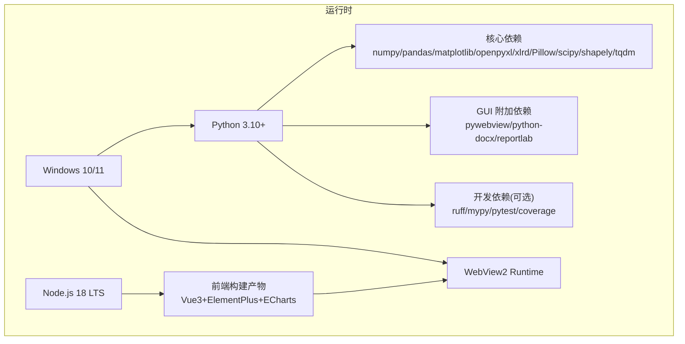
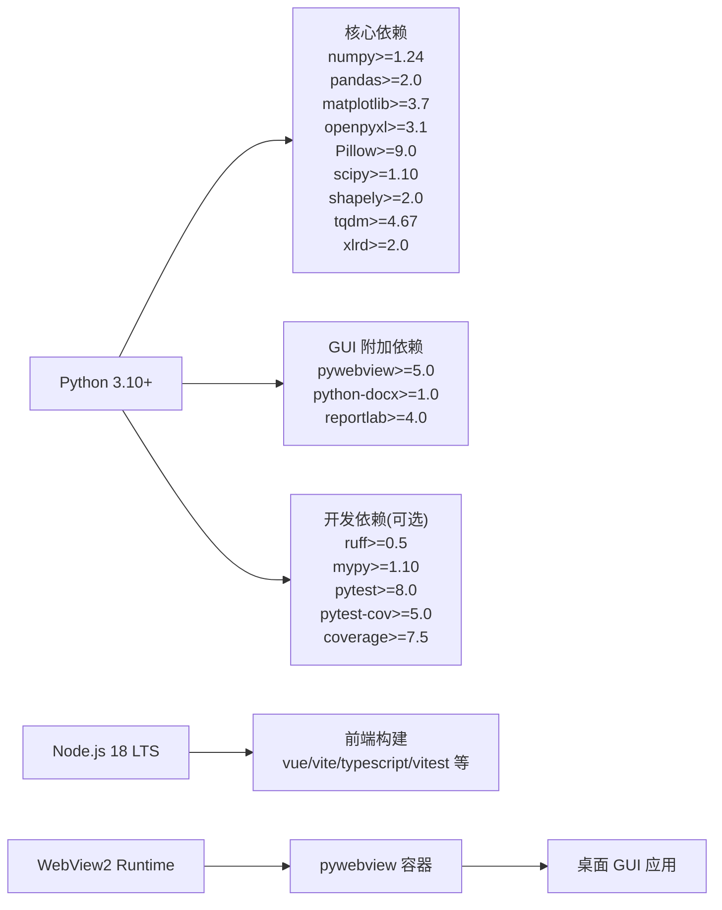
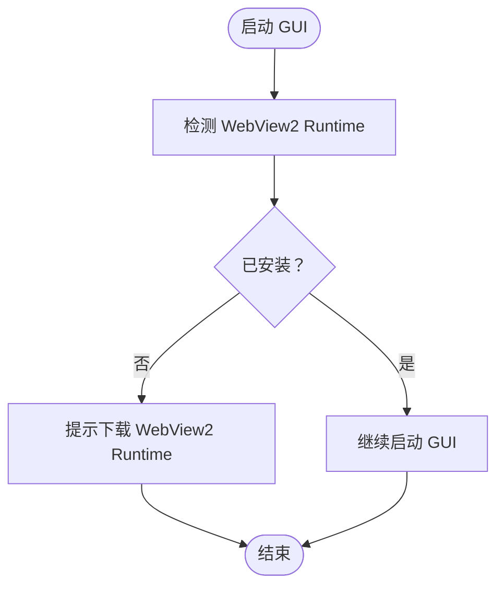
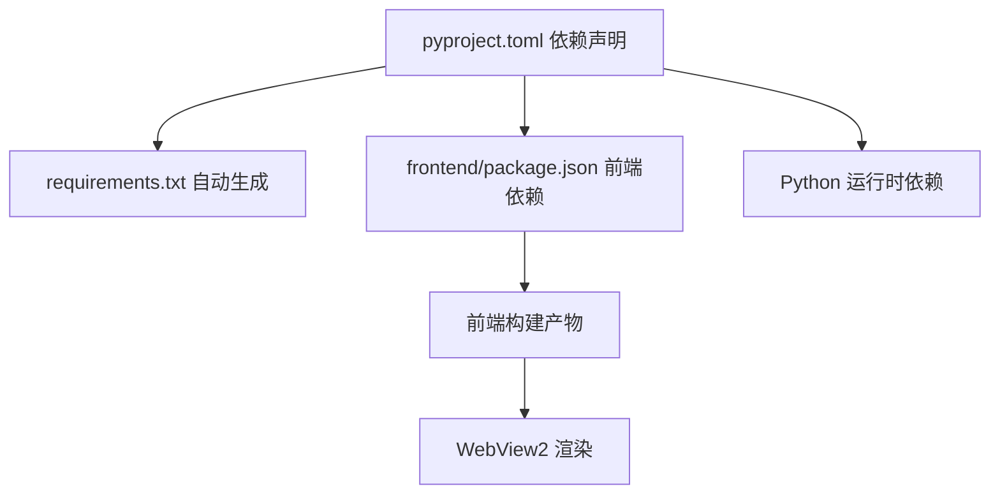

# 系统要求和依赖

<cite>
**本文引用的文件**   
- [README.md](file://README.md)
- [pyproject.toml](file://pyproject.toml)
- [requirements.txt](file://requirements.txt)
- [frontend/package.json](file://frontend/package.json)
- [backend/webview2_checker.py](file://backend/webview2_checker.py)
</cite>

## 目录
1. [简介](#简介)
2. [项目结构](#项目结构)
3. [核心组件](#核心组件)
4. [架构总览](#架构总览)
5. [详细组件分析](#详细组件分析)
6. [依赖关系分析](#依赖关系分析)
7. [性能与资源建议](#性能与资源建议)
8. [故障排查指南](#故障排查指南)
9. [结论](#结论)
10. [附录](#附录)

## 简介
本文件聚焦于 TracePipeline 的系统要求与依赖环境，覆盖硬件与软件前置条件、Python 与前端构建工具链版本、全部核心与可选依赖包及其作用说明、GUI 模式附加依赖、依赖检查与自动安装方法，以及常见依赖冲突的解决方案。内容严格基于仓库现有文档与源码配置整理，便于快速部署与排障。

## 项目结构
TracePipeline 采用前后端分离的桌面应用形态：
- Python 后端提供计算与服务能力（CLI/GUI）
- Vue 3 + TypeScript 前端通过 pywebview 嵌入 WebView2 运行
- 打包产物为 Windows 平台可执行或便携版

图表来源
- [README.md:286-320](file://README.md#L286-L320)
- [pyproject.toml:35-48](file://pyproject.toml#L35-L48)
- [frontend/package.json:14-34](file://frontend/package.json#L14-L34)

章节来源
- [README.md:286-320](file://README.md#L286-L320)
- [pyproject.toml:35-48](file://pyproject.toml#L35-L48)
- [frontend/package.json:14-34](file://frontend/package.json#L14-L34)

## 核心组件
本节汇总系统与环境层面的关键要素，包括操作系统、Python、WebView2、Node.js 及依赖包清单。

- 操作系统
  - Windows 10 (1809+) / Windows 11；GUI 模式必需；CLI 模式理论上跨平台
- Python
  - 3.10+（推荐 3.11，支持 3.12）
- WebView2 Runtime
  - Win11 内置；Win10 需手动或自动推送安装
- Node.js
  - 18 LTS（仅 GUI 前端构建需要）
- 内存与磁盘
  - 内存：CLI ≥2 GB，GUI ≥4 GB（并行处理建议 ≥4 GB）
  - 磁盘：≥500 MB（含依赖），打包产物约 150–250 MB

章节来源
- [README.md:286-296](file://README.md#L286-L296)

## 架构总览
下图展示运行时依赖在系统中的位置与作用域，区分“核心依赖”“GUI 附加依赖”“开发依赖”。

图表来源
- [pyproject.toml:35-48](file://pyproject.toml#L35-L48)
- [pyproject.toml:53-60](file://pyproject.toml#L53-L60)
- [frontend/package.json:14-34](file://frontend/package.json#L14-L34)
- [README.md:286-320](file://README.md#L286-L320)

## 详细组件分析

### 硬件与软件要求
- 硬件
  - CPU：无特殊限制，建议使用多核以提升并行批处理能力
  - 内存：CLI ≥2 GB，GUI ≥4 GB；并行处理建议 ≥4 GB
  - 磁盘：≥500 MB（含依赖），打包产物约 150–250 MB
- 软件
  - 操作系统：Windows 10 (1809+) / 11（GUI 必需）
  - Python：3.10+（推荐 3.11，支持 3.12）
  - Node.js：18 LTS（仅前端构建）
  - WebView2 Runtime：任意版本（Win11 内置；Win10 需安装）

章节来源
- [README.md:286-296](file://README.md#L286-L296)

### 核心依赖（CLI 与 GUI 通用）
以下依赖由项目声明并随 pip 安装自动拉取，用于数值计算、Excel 读写、绘图、图像处理、空间算法与进度条等。

- numpy ≥1.24：向量化数值计算
- pandas ≥2.0：表格数据与 Excel 读写
- matplotlib ≥3.7：迹线图与玫瑰图绘制
- openpyxl ≥3.1：.xlsx 读写引擎
- xlrd ≥2.0：.xls 读写引擎
- Pillow ≥9.0：图像处理与缩略图生成
- scipy ≥1.10：空间算法（如 KDTree）
- shapely ≥2.0：几何缓冲区与求交
- tqdm ≥4.67：CLI 进度条

章节来源
- [pyproject.toml:35-48](file://pyproject.toml#L35-L48)
- [requirements.txt:1-17](file://requirements.txt#L1-L17)
- [README.md:297-312](file://README.md#L297-L312)

### GUI 附加依赖
启用桌面 GUI 时额外需要以下包：
- pywebview ≥5.0：桌面 GUI 容器（基于 WebView2）
- python-docx ≥1.0：Word 报告导出
- reportlab ≥4.0：PDF 报告导出

章节来源
- [pyproject.toml:35-48](file://pyproject.toml#L35-L48)
- [README.md:313-320](file://README.md#L313-L320)

### 开发依赖（可选）
用于代码质量、类型检查与测试：
- ruff ≥0.5：代码风格与静态检查
- mypy ≥1.10：类型检查
- pytest ≥8.0：测试框架
- pytest-cov ≥5.0：覆盖率统计
- coverage ≥7.5：覆盖率收集

章节来源
- [pyproject.toml:53-60](file://pyproject.toml#L53-L60)

### 前端构建依赖（Node.js 生态）
仅在构建 GUI 前端时需要 Node.js 18 LTS 与 npm/yarn/pnpm 等包管理器。

- 运行时依赖（示例）：vue、element-plus、echarts、pinia、vue-router、vue-echarts 等
- 开发依赖（示例）：vite、typescript、vue-tsc、vitest、@types/node 等

章节来源
- [frontend/package.json:14-34](file://frontend/package.json#L14-L34)
- [README.md:369-379](file://README.md#L369-L379)

### WebView2 Runtime 检测
GUI 启动前会检测 WebView2 Runtime 是否可用，若未检测到将提示下载链接以便用户安装。

图表来源
- [backend/webview2_checker.py:35-59](file://backend/webview2_checker.py#L35-L59)

章节来源
- [backend/webview2_checker.py:1-60](file://backend/webview2_checker.py#L1-L60)

## 依赖关系分析
- 核心依赖与 GUI 附加依赖均通过 pyproject.toml 统一声明，pip 安装时会一并解析
- requirements.txt 由 pyproject.toml 自动生成，二者保持一致
- 前端依赖独立于 Python 环境，通过 frontend/package.json 管理

图表来源
- [pyproject.toml:35-48](file://pyproject.toml#L35-L48)
- [requirements.txt:1-17](file://requirements.txt#L1-L17)
- [frontend/package.json:14-34](file://frontend/package.json#L14-L34)

章节来源
- [pyproject.toml:35-48](file://pyproject.toml#L35-L48)
- [requirements.txt:1-17](file://requirements.txt#L1-L17)
- [frontend/package.json:14-34](file://frontend/package.json#L14-L34)

## 性能与资源建议
- 内存
  - CLI 模式最低 2 GB，GUI 模式最低 4 GB；并行处理建议 ≥4 GB
- 磁盘
  - 运行环境 ≥500 MB；打包产物约 150–250 MB
- 并行
  - 可通过命令行参数控制并行进程数，提升批量处理吞吐

章节来源
- [README.md:294-296](file://README.md#L294-L296)

## 故障排查指南

- WebView2 Runtime 缺失
  - 现象：GUI 无法启动或页面空白
  - 处理：使用内置检测提示的官方下载链接安装 WebView2 Runtime；或在 Win11 上确认系统更新已包含
  - 参考实现：注册表键值与 DLL 路径检测逻辑
  - 章节来源
    - [backend/webview2_checker.py:35-59](file://backend/webview2_checker.py#L35-L59)

- Python 版本不兼容
  - 现象：导入失败或二进制包编译错误
  - 处理：确保 Python 3.10+（推荐 3.11）；必要时切换至 conda/venv 隔离环境
  - 章节来源
    - [README.md:286-296](file://README.md#L286-L296)

- 前端构建失败（Node.js 相关）
  - 现象：npm install 或 build 报错
  - 处理：安装 Node.js 18 LTS；清理 node_modules 后重试；确保 package-lock.json 存在
  - 章节来源
    - [frontend/package.json:14-34](file://frontend/package.json#L14-L34)
    - [README.md:369-379](file://README.md#L369-L379)

- 依赖冲突（例如 numpy/pandas 版本不匹配）
  - 现象：ImportError 或 ABI 不匹配
  - 处理：使用虚拟环境；优先以 pyproject.toml 声明的版本为准；必要时单独升级/降级冲突包
  - 章节来源
    - [pyproject.toml:35-48](file://pyproject.toml#L35-L48)

- Excel 读写异常（.xls/.xlsx）
  - 现象：读取旧格式 .xls 失败
  - 处理：确保安装 xlrd ≥2.0；如需同时支持 .xlsx，保留 openpyxl ≥3.1
  - 章节来源
    - [pyproject.toml:35-48](file://pyproject.toml#L35-L48)

## 结论
TracePipeline 对系统的要求明确且轻量：Windows 10/11、Python 3.10+、WebView2 Runtime（GUI 必需）、Node.js 18 LTS（仅前端构建）。核心依赖集中在科学计算、可视化与办公文档导出领域，GUI 扩展依赖较少。通过统一的 pyproject.toml 声明与自动生成的 requirements.txt，依赖管理清晰可控。遇到常见问题时，可依据本文提供的定位方法与解决步骤快速恢复。

## 附录

### 依赖清单速查
- 核心依赖（CLI/GUI 通用）
  - numpy ≥1.24、pandas ≥2.0、matplotlib ≥3.7、openpyxl ≥3.1、Pillow ≥9.0、scipy ≥1.10、shapely ≥2.0、tqdm ≥4.67、xlrd ≥2.0
- GUI 附加依赖
  - pywebview ≥5.0、python-docx ≥1.0、reportlab ≥4.0
- 开发依赖（可选）
  - ruff ≥0.5、mypy ≥1.10、pytest ≥8.0、pytest-cov ≥5.0、coverage ≥7.5
- 前端构建依赖（Node.js 生态）
  - vue、element-plus、echarts、pinia、vue-router、vue-echarts、vite、typescript、vue-tsc、vitest 等

章节来源
- [pyproject.toml:35-48](file://pyproject.toml#L35-L48)
- [pyproject.toml:53-60](file://pyproject.toml#L53-L60)
- [requirements.txt:1-17](file://requirements.txt#L1-L17)
- [frontend/package.json:14-34](file://frontend/package.json#L14-L34)
- [README.md:297-320](file://README.md#L297-L320)