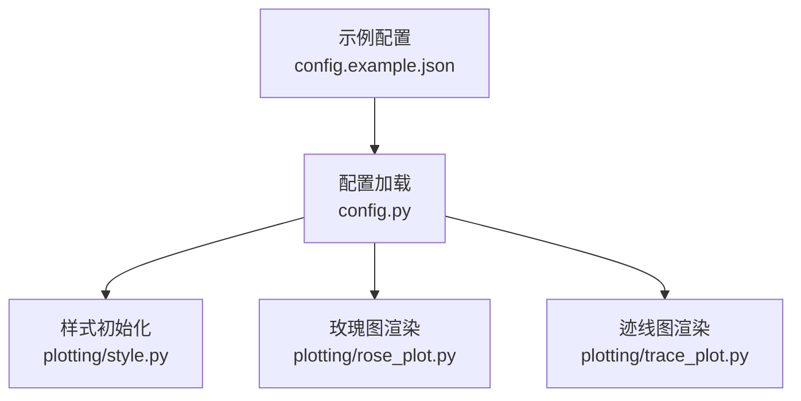
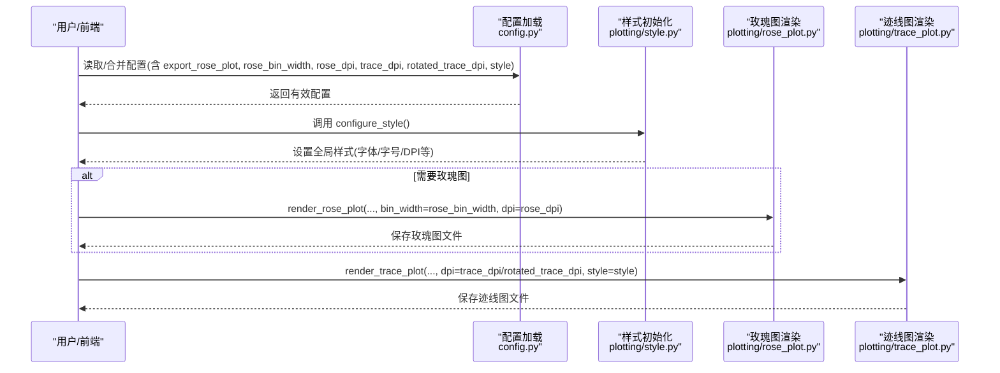
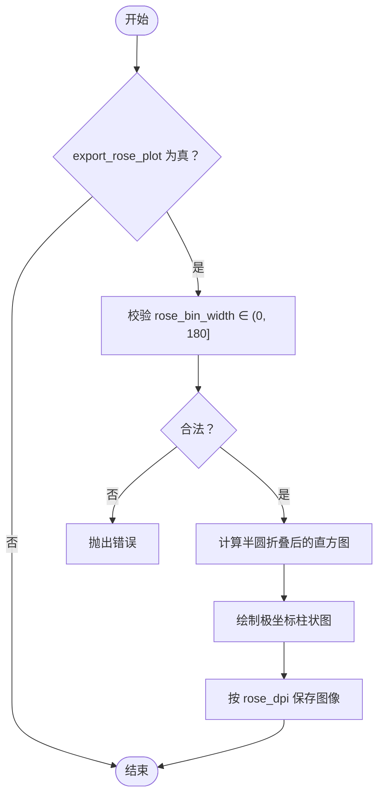
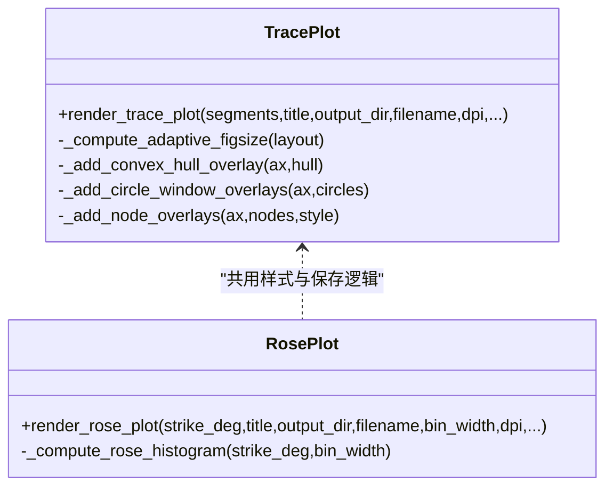
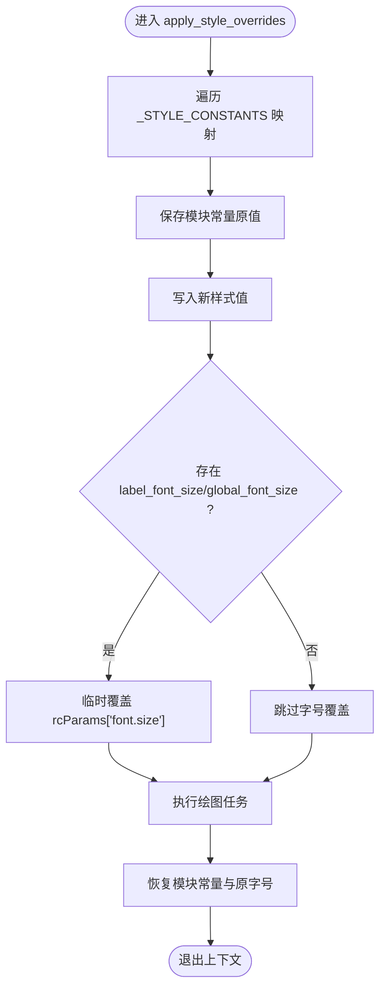
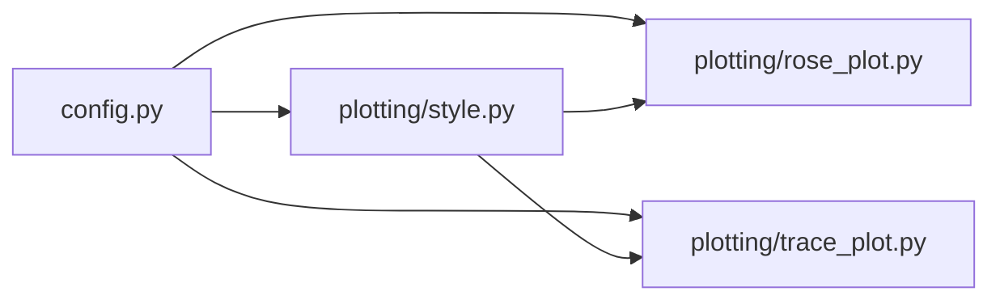

# 可视化输出配置

<cite>
**本文引用的文件**
- [trace_pipeline/config.py](file://trace_pipeline/config.py)
- [config.example.json](file://config.example.json)
- [trace_pipeline/plotting/style.py](file://trace_pipeline/plotting/style.py)
- [trace_pipeline/plotting/rose_plot.py](file://trace_pipeline/plotting/rose_plot.py)
- [trace_pipeline/plotting/trace_plot.py](file://trace_pipeline/plotting/trace_plot.py)
</cite>

## 目录
1. [简介](#简介)
2. [项目结构](#项目结构)
3. [核心组件](#核心组件)
4. [架构总览](#架构总览)
5. [详细组件分析](#详细组件分析)
6. [依赖关系分析](#依赖关系分析)
7. [性能与分辨率建议](#性能与分辨率建议)
8. [故障排查指南](#故障排查指南)
9. [结论](#结论)
10. [附录：不同出版标准下的配置示例](#附录不同出版标准下的配置示例)

## 简介
本文件聚焦于“可视化输出配置”，系统说明以下方面：
- 玫瑰图相关参数：export_rose_plot、rose_bin_width、rose_dpi
- 迹线图相关参数：trace_dpi、rotated_trace_dpi
- DPI 对输出质量的影响及选择建议
- 样式自定义（style 字典）的可用键与使用方法
- 面向不同出版标准的推荐配置组合

## 项目结构
与可视化输出相关的核心代码位于 trace_pipeline 包内，关键文件如下：
- 配置加载与默认值：trace_pipeline/config.py
- 绘图样式与字体：trace_pipeline/plotting/style.py
- 玫瑰图绘制：trace_pipeline/plotting/rose_plot.py
- 迹线图绘制：trace_pipeline/plotting/trace_plot.py
- 示例配置文件：config.example.json

**图表来源**
- [trace_pipeline/config.py:56-79](file://trace_pipeline/config.py#L56-L79)
- [trace_pipeline/plotting/style.py:187-255](file://trace_pipeline/plotting/style.py#L187-L255)
- [trace_pipeline/plotting/rose_plot.py:106-139](file://trace_pipeline/plotting/rose_plot.py#L106-L139)
- [trace_pipeline/plotting/trace_plot.py:443-564](file://trace_pipeline/plotting/trace_plot.py#L443-L564)
- [config.example.json:1-26](file://config.example.json#L1-L26)

**章节来源**
- [trace_pipeline/config.py:56-79](file://trace_pipeline/config.py#L56-L79)
- [config.example.json:1-26](file://config.example.json#L1-L26)

## 核心组件
- 配置项定义与默认值
  - export_rose_plot：是否导出玫瑰图
  - rose_bin_width：玫瑰图分箱宽度（度）
  - rose_dpi：玫瑰图输出分辨率
  - trace_dpi：原始迹线图输出分辨率
  - rotated_trace_dpi：旋转迹线图输出分辨率
  - style：样式覆盖字典（颜色、线宽、透明度、字号等）
- 样式系统
  - configure_style：幂等设置 matplotlib 全局样式（字体、字号、线条粗细、保存 DPI 等）
  - apply_style_overrides：线程安全地临时覆盖绘图模块常量（如颜色、线宽、透明度），并支持 label_font_size/global_font_size 覆盖字号
- 绘图函数
  - render_rose_plot：计算直方图、绘制极坐标柱状图并保存
  - render_trace_plot：根据数据范围自适应 figure 尺寸，绘制迹线、可选凸包/圆窗/节点覆盖层，并保存

**章节来源**
- [trace_pipeline/config.py:56-79](file://trace_pipeline/config.py#L56-L79)
- [trace_pipeline/plotting/style.py:23-35](file://trace_pipeline/plotting/style.py#L23-L35)
- [trace_pipeline/plotting/style.py:187-255](file://trace_pipeline/plotting/style.py#L187-L255)
- [trace_pipeline/plotting/style.py:258-296](file://trace_pipeline/plotting/style.py#L258-L296)
- [trace_pipeline/plotting/rose_plot.py:106-139](file://trace_pipeline/plotting/rose_plot.py#L106-L139)
- [trace_pipeline/plotting/trace_plot.py:443-564](file://trace_pipeline/plotting/trace_plot.py#L443-L564)

## 架构总览
下图展示了从配置到最终图像输出的关键流程。

**图表来源**
- [trace_pipeline/config.py:86-145](file://trace_pipeline/config.py#L86-L145)
- [trace_pipeline/plotting/style.py:187-255](file://trace_pipeline/plotting/style.py#L187-L255)
- [trace_pipeline/plotting/rose_plot.py:106-139](file://trace_pipeline/plotting/rose_plot.py#L106-L139)
- [trace_pipeline/plotting/trace_plot.py:443-564](file://trace_pipeline/plotting/trace_plot.py#L443-L564)

## 详细组件分析

### 玫瑰图配置（export_rose_plot、rose_bin_width、rose_dpi）
- export_rose_plot
  - 控制是否生成走向玫瑰图；为布尔开关
  - 参考默认值与类型定义位置
- rose_bin_width
  - 控制角度分箱宽度（单位：度），影响玫瑰图柱体数量与分布粒度
  - 在玫瑰图内部会校验取值范围
- rose_dpi
  - 控制玫瑰图输出图像的像素密度（DPI）
  - 与 save_figure 一起决定最终像素尺寸与文件大小

**图表来源**
- [trace_pipeline/plotting/rose_plot.py:76-103](file://trace_pipeline/plotting/rose_plot.py#L76-L103)
- [trace_pipeline/plotting/rose_plot.py:106-139](file://trace_pipeline/plotting/rose_plot.py#L106-L139)

**章节来源**
- [trace_pipeline/config.py:56-79](file://trace_pipeline/config.py#L56-L79)
- [trace_pipeline/plotting/rose_plot.py:76-103](file://trace_pipeline/plotting/rose_plot.py#L76-L103)
- [trace_pipeline/plotting/rose_plot.py:106-139](file://trace_pipeline/plotting/rose_plot.py#L106-L139)

### 迹线图配置（trace_dpi、rotated_trace_dpi）
- trace_dpi
  - 原始迹线图输出 DPI
- rotated_trace_dpi
  - 旋转后迹线图输出 DPI
- 两者均传入对应渲染函数，用于 save_figure 时确定输出像素密度

**图表来源**
- [trace_pipeline/plotting/trace_plot.py:443-564](file://trace_pipeline/plotting/trace_plot.py#L443-L564)
- [trace_pipeline/plotting/rose_plot.py:106-139](file://trace_pipeline/plotting/rose_plot.py#L106-L139)

**章节来源**
- [trace_pipeline/config.py:56-79](file://trace_pipeline/config.py#L56-L79)
- [trace_pipeline/plotting/trace_plot.py:443-564](file://trace_pipeline/plotting/trace_plot.py#L443-L564)

### 样式自定义（style 字典）
- 支持的覆盖键（通过 _STYLE_CONSTANTS 映射到具体绘图模块常量）
  - 迹线图：trace_line_color、trace_line_width、hull_line_color、hull_fill_color、hull_fill_alpha、circle_window_line_color、circle_window_fill_color、circle_window_fill_alpha
  - 玫瑰图：rose_bar_color、rose_bar_edge、rose_grid_color
- 字号覆盖
  - label_font_size 或 global_font_size（兼容旧键）将临时覆盖 matplotlib.rcParams["font.size"]
- 使用方式
  - 通过 apply_style_overrides(style) 上下文管理器进行线程安全的临时覆盖
  - 退出上下文后自动恢复原值，避免污染全局样式

**图表来源**
- [trace_pipeline/plotting/style.py:23-35](file://trace_pipeline/plotting/style.py#L23-L35)
- [trace_pipeline/plotting/style.py:258-296](file://trace_pipeline/plotting/style.py#L258-L296)

**章节来源**
- [trace_pipeline/plotting/style.py:23-35](file://trace_pipeline/plotting/style.py#L23-L35)
- [trace_pipeline/plotting/style.py:258-296](file://trace_pipeline/plotting/style.py#L258-L296)

## 依赖关系分析
- 配置层
  - config.py 提供默认配置与校验，包含所有可视化相关键
- 样式层
  - plotting/style.py 负责全局样式与字体栈，并提供样式覆盖机制
- 渲染层
  - plotting/rose_plot.py 与 plotting/trace_plot.py 分别实现两类图形的渲染与保存

**图表来源**
- [trace_pipeline/config.py:56-79](file://trace_pipeline/config.py#L56-L79)
- [trace_pipeline/plotting/style.py:187-255](file://trace_pipeline/plotting/style.py#L187-L255)
- [trace_pipeline/plotting/rose_plot.py:106-139](file://trace_pipeline/plotting/rose_plot.py#L106-L139)
- [trace_pipeline/plotting/trace_plot.py:443-564](file://trace_pipeline/plotting/trace_plot.py#L443-L564)

**章节来源**
- [trace_pipeline/config.py:56-79](file://trace_pipeline/config.py#L56-L79)
- [trace_pipeline/plotting/style.py:187-255](file://trace_pipeline/plotting/style.py#L187-L255)

## 性能与分辨率建议
- DPI 对输出质量的影响
  - 更高的 DPI 意味着更大的像素矩阵，细节更清晰，但文件体积与渲染时间也会增加
  - 玫瑰图与迹线图各自拥有独立的 DPI 参数，可针对不同用途分别优化
- 选择建议
  - 屏幕预览/快速检查：较低 DPI（例如 150–300）
  - 一般报告/论文插图：中等偏高 DPI（例如 300–600）
  - 高分辨率印刷/期刊要求：高 DPI（例如 600–1200，视目标期刊要求而定）
- 注意
  - 若同时启用玫瑰图与迹线图，需权衡整体处理时间与存储占用
  - 调整 rose_bin_width 会影响玫瑰图复杂度与视觉密度，但不直接影响 DPI

[本节为通用指导，不直接分析具体文件]

## 故障排查指南
- 常见错误
  - rose_bin_width 不在允许范围内：会在玫瑰图计算阶段抛出异常
  - 缺少必要配置字段：配置校验阶段会提示缺失键
  - 未知配置项：会被忽略并记录警告
- 定位方法
  - 查看日志中关于配置加载与样式配置的记录
  - 确认 style 字典中的键是否在 _STYLE_CONSTANTS 白名单内

**章节来源**
- [trace_pipeline/plotting/rose_plot.py:76-86](file://trace_pipeline/plotting/rose_plot.py#L76-L86)
- [trace_pipeline/config.py:148-190](file://trace_pipeline/config.py#L148-L190)
- [trace_pipeline/plotting/style.py:23-35](file://trace_pipeline/plotting/style.py#L23-L35)

## 结论
- 通过 config.py 集中管理可视化输出参数，配合 style.py 的样式覆盖机制，可实现灵活且一致的图形输出
- 针对不同的使用场景与出版要求，合理设置 DPI 与样式，可在清晰度与效率之间取得平衡
- 建议在正式提交前，依据目标期刊或机构规范微调样式与分辨率

[本节为总结性内容，不直接分析具体文件]

## 附录：不同出版标准下的配置示例
以下为基于仓库默认配置与示例文件的参考组合（仅列出与可视化输出相关的键）：

- 屏幕预览/快速检查
  - export_rose_plot: true
  - rose_bin_width: 10
  - rose_dpi: 300
  - trace_dpi: 300
  - rotated_trace_dpi: 300
  - style: {}

- 一般报告/论文插图
  - export_rose_plot: true
  - rose_bin_width: 10
  - rose_dpi: 600
  - trace_dpi: 600
  - rotated_trace_dpi: 600
  - style: {}

- 高分辨率印刷/期刊要求
  - export_rose_plot: true
  - rose_bin_width: 10
  - rose_dpi: 1200
  - trace_dpi: 1200
  - rotated_trace_dpi: 1200
  - style: {}

以上示例可直接复制到 config.json 或 config.example.json 中进行修改与验证。

**章节来源**
- [config.example.json:1-26](file://config.example.json#L1-L26)
- [trace_pipeline/config.py:56-79](file://trace_pipeline/config.py#L56-L79)