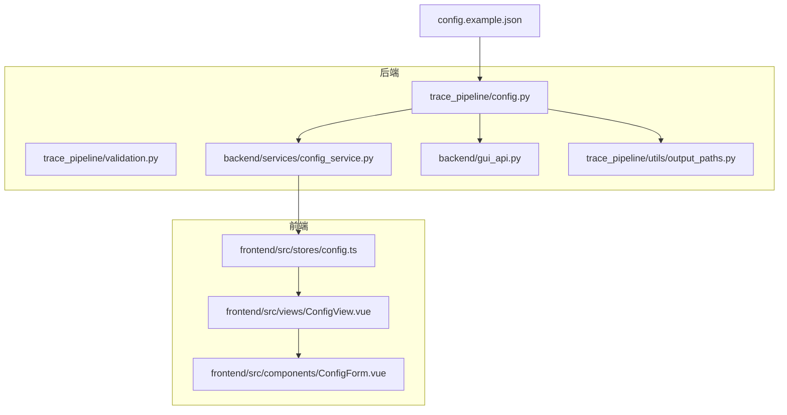
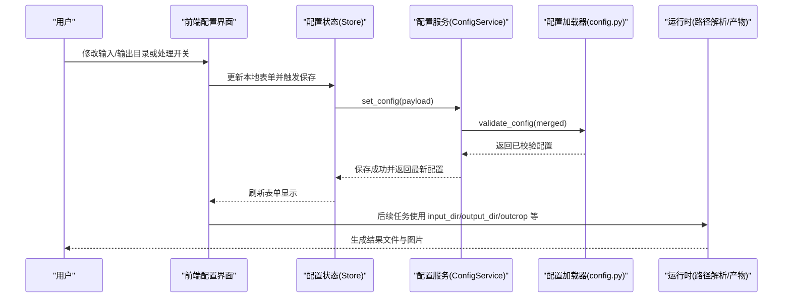
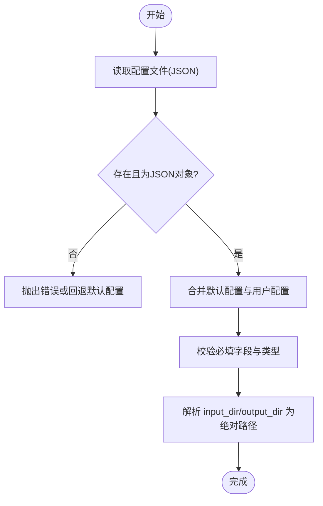
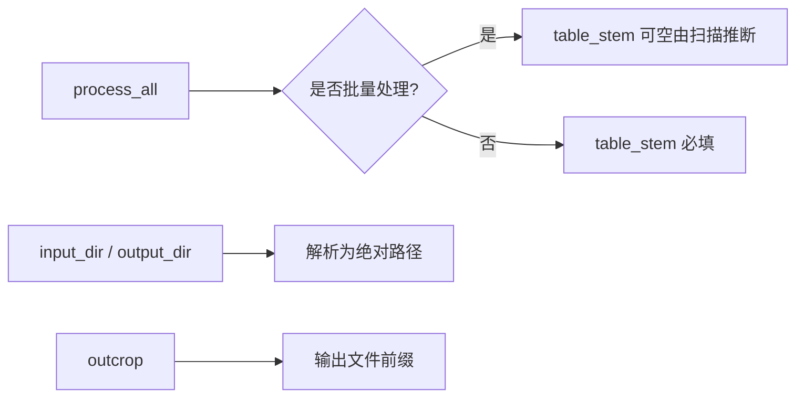

# 基础配置项

<cite>
**本文引用的文件**   
- [config.example.json](file://config.example.json)
- [trace_pipeline/config.py](file://trace_pipeline/config.py)
- [trace_pipeline/validation.py](file://trace_pipeline/validation.py)
- [backend/services/config_service.py](file://backend/services/config_service.py)
- [frontend/src/stores/config.ts](file://frontend/src/stores/config.ts)
- [frontend/src/views/ConfigView.vue](file://frontend/src/views/ConfigView.vue)
- [frontend/src/components/ConfigForm.vue](file://frontend/src/components/ConfigForm.vue)
- [backend/gui_api.py](file://backend/gui_api.py)
- [trace_pipeline/utils/output_paths.py](file://trace_pipeline/utils/output_paths.py)
</cite>

## 目录
1. [简介](#简介)
2. [项目结构](#项目结构)
3. [核心组件](#核心组件)
4. [架构总览](#架构总览)
5. [详细组件分析](#详细组件分析)
6. [依赖关系分析](#依赖关系分析)
7. [性能与可用性考虑](#性能与可用性考虑)
8. [故障排查指南](#故障排查指南)
9. [结论](#结论)
10. [附录：配置项清单与示例](#附录配置项清单与示例)

## 简介
本章节聚焦于 TracePipeline 的“基础配置项”，围绕输入输出目录、文件命名与处理模式等关键参数，给出数据类型、默认值、取值范围与用途说明；并提供单文件与批量处理的配置差异、配置项之间的依赖与约束，以及常见使用场景的配置示例。

## 项目结构
与基础配置相关的代码主要分布在以下位置：
- 后端配置加载与校验：trace_pipeline/config.py、trace_pipeline/validation.py
- 配置文件读写服务：backend/services/config_service.py
- 前端配置界面与状态管理：frontend/src/stores/config.ts、frontend/src/views/ConfigView.vue、frontend/src/components/ConfigForm.vue
- 运行时路径解析与输出产物定位：backend/gui_api.py、trace_pipeline/utils/output_paths.py
- 示例配置模板：config.example.json

图表来源
- [trace_pipeline/config.py:1-326](file://trace_pipeline/config.py#L1-L326)
- [trace_pipeline/validation.py:1-112](file://trace_pipeline/validation.py#L1-L112)
- [backend/services/config_service.py:1-144](file://backend/services/config_service.py#L1-L144)
- [frontend/src/stores/config.ts:1-80](file://frontend/src/stores/config.ts#L1-L80)
- [frontend/src/views/ConfigView.vue:1-302](file://frontend/src/views/ConfigView.vue#L1-L302)
- [frontend/src/components/ConfigForm.vue:1-411](file://frontend/src/components/ConfigForm.vue#L1-L411)
- [backend/gui_api.py:243-257](file://backend/gui_api.py#L243-L257)
- [trace_pipeline/utils/output_paths.py:21-41](file://trace_pipeline/utils/output_paths.py#L21-L41)

章节来源
- [config.example.json:1-26](file://config.example.json#L1-L26)
- [trace_pipeline/config.py:1-326](file://trace_pipeline/config.py#L1-L326)
- [trace_pipeline/validation.py:1-112](file://trace_pipeline/validation.py#L1-L112)
- [backend/services/config_service.py:1-144](file://backend/services/config_service.py#L1-L144)
- [frontend/src/stores/config.ts:1-80](file://frontend/src/stores/config.ts#L1-L80)
- [frontend/src/views/ConfigView.vue:1-302](file://frontend/src/views/ConfigView.vue#L1-L302)
- [frontend/src/components/ConfigForm.vue:1-411](file://frontend/src/components/ConfigForm.vue#L1-L411)
- [backend/gui_api.py:243-257](file://backend/gui_api.py#L243-L257)
- [trace_pipeline/utils/output_paths.py:21-41](file://trace_pipeline/utils/output_paths.py#L21-L41)

## 核心组件
本节对与基础配置直接相关的关键模块进行概览，帮助读者理解配置从磁盘到运行时的流转过程。

- 配置加载与校验（config.py）
  - 提供默认配置字典与必填字段集合
  - 合并 JSON 配置、规范化类型、解析相对路径为绝对路径
  - 暴露 CLI 覆盖与工作目录保障工具函数
- 标量字段校验与强制转换（validation.py）
  - 布尔、正整数、正浮点、枚举类字段的统一规范化
- 配置服务（config_service.py）
  - 作为 config.json 的唯一写入入口，支持重载、保存、重置（全部/仅处理/仅样式）
- 前端配置状态与表单（stores/config.ts、ConfigView.vue、ConfigForm.vue）
  - 通过 API 读取/保存配置，表单变更自动持久化（防抖），提供导入导出与重置操作
- 运行时路径与产物定位（gui_api.py、output_paths.py）
  - 基于配置解析输出目录、查找结果图片等

章节来源
- [trace_pipeline/config.py:56-190](file://trace_pipeline/config.py#L56-L190)
- [trace_pipeline/validation.py:26-112](file://trace_pipeline/validation.py#L26-L112)
- [backend/services/config_service.py:41-144](file://backend/services/config_service.py#L41-L144)
- [frontend/src/stores/config.ts:14-78](file://frontend/src/stores/config.ts#L14-L78)
- [frontend/src/views/ConfigView.vue:62-233](file://frontend/src/views/ConfigView.vue#L62-L233)
- [frontend/src/components/ConfigForm.vue:174-244](file://frontend/src/components/ConfigForm.vue#L174-L244)
- [backend/gui_api.py:243-257](file://backend/gui_api.py#L243-L257)
- [trace_pipeline/utils/output_paths.py:21-41](file://trace_pipeline/utils/output_paths.py#L21-L41)

## 架构总览
下图展示了基础配置在系统中的数据流与控制流：从配置文件到后端加载、校验、持久化，再到前端展示与交互，最终影响运行时路径解析与输出产物生成。

图表来源
- [backend/services/config_service.py:92-101](file://backend/services/config_service.py#L92-L101)
- [trace_pipeline/config.py:148-190](file://trace_pipeline/config.py#L148-L190)
- [frontend/src/stores/config.ts:25-35](file://frontend/src/stores/config.ts#L25-L35)
- [frontend/src/views/ConfigView.vue:62-75](file://frontend/src/views/ConfigView.vue#L62-L75)
- [backend/gui_api.py:243-257](file://backend/gui_api.py#L243-L257)

## 详细组件分析

### 配置加载与校验流程
- 加载顺序
  - 若显式指定配置文件路径且不存在：抛出错误
  - 否则尝试加载默认路径；不存在则记录日志并使用默认配置
- 校验与合并
  - 合并默认配置与用户配置，忽略未知键并告警
  - 检查必填字段（input_dir、output_dir、outcrop）
  - process_all 为 false 时，table_stem 变为必填
  - 将字符串型路径解析为绝对路径（以配置文件所在目录或项目根为基准）
- CLI 覆盖
  - 支持通过命令行参数覆盖配置项并重新校验

图表来源
- [trace_pipeline/config.py:86-145](file://trace_pipeline/config.py#L86-L145)
- [trace_pipeline/config.py:148-190](file://trace_pipeline/config.py#L148-L190)
- [trace_pipeline/config.py:196-215](file://trace_pipeline/config.py#L196-L215)

章节来源
- [trace_pipeline/config.py:86-190](file://trace_pipeline/config.py#L86-L190)
- [trace_pipeline/config.py:196-215](file://trace_pipeline/config.py#L196-L215)

### 标量字段规范化与取值范围
- 布尔字段：支持多种文本写法（true/false、yes/no、on/off、1/0）
- 正整数：如 DPI、窗口计数、最小交点数等
- 正浮点：如密度阈值、节点合并容差、玫瑰图分箱宽度（0 < width ≤ 180）
- 枚举字段：window_strategy 限定为 auto/tangent/hybrid/concentric；node_label_mode 限定为 none/type/id

章节来源
- [trace_pipeline/validation.py:26-87](file://trace_pipeline/validation.py#L26-L87)
- [trace_pipeline/validation.py:90-112](file://trace_pipeline/validation.py#L90-L112)

### 配置服务（唯一写入入口）
- 线程安全：内部使用重入锁保护并发读写
- 原子写入：先写临时文件再替换，失败时清理临时文件
- 重置能力：支持重置全部、仅处理参数、仅样式

章节来源
- [backend/services/config_service.py:41-144](file://backend/services/config_service.py#L41-L144)

### 前端配置交互与自动持久化
- 表单双向绑定：输入/输出目录、处理开关等
- 自动保存：对路径变更进行防抖合并后调用后端保存接口
- 导入/导出：支持从 JSON 导入与导出当前配置
- 重置：提供“重置处理设置”“重置样式设置”“重置所有设置”

章节来源
- [frontend/src/stores/config.ts:14-78](file://frontend/src/stores/config.ts#L14-L78)
- [frontend/src/views/ConfigView.vue:62-233](file://frontend/src/views/ConfigView.vue#L62-L233)
- [frontend/src/components/ConfigForm.vue:174-244](file://frontend/src/components/ConfigForm.vue#L174-L244)

### 运行时路径与产物定位
- 输出目录解析：优先使用配置中的 output_dir，未设置时回退至默认
- 产物图片查找：根据 outcrop 前缀匹配 raw/rotated/rose 三类图片

章节来源
- [backend/gui_api.py:243-257](file://backend/gui_api.py#L243-L257)
- [trace_pipeline/utils/output_paths.py:21-41](file://trace_pipeline/utils/output_paths.py#L21-L41)

## 依赖关系分析
- 配置项间的依赖与约束
  - 必填项：input_dir、output_dir、outcrop
  - 条件必填：当 process_all=false 时，table_stem 必填
  - 路径解析：input_dir/output_dir 会被解析为绝对路径，基准目录取决于配置文件位置或项目根
  - 命名约定：输出产物文件名通常以 outcrop 为前缀（例如 *_raw.png、*_rotated(strike=...).png、*_rose(bin=...).png）
- 外部依赖
  - 前端通过配置服务访问后端，后端通过配置加载器进行校验与路径解析
  - 产物定位依赖 outcrop 与输出目录

图表来源
- [trace_pipeline/config.py:169-189](file://trace_pipeline/config.py#L169-L189)
- [trace_pipeline/utils/output_paths.py:21-41](file://trace_pipeline/utils/output_paths.py#L21-L41)

章节来源
- [trace_pipeline/config.py:169-189](file://trace_pipeline/config.py#L169-L189)
- [trace_pipeline/utils/output_paths.py:21-41](file://trace_pipeline/utils/output_paths.py#L21-L41)

## 性能与可用性考虑
- 路径解析与目录创建
  - 解析为绝对路径避免工作目录切换导致的路径失效
  - 按需创建目录，CLI 只读命令可禁用自动创建以避免副作用
- 配置写入原子性
  - 临时文件+替换策略降低损坏风险
- 前端自动保存
  - 防抖减少频繁网络请求，提升用户体验

[本节为通用建议，不直接分析具体文件]

## 故障排查指南
- 配置文件不存在或格式错误
  - 现象：加载失败或回退默认配置
  - 排查：确认配置文件路径、JSON 语法、是否为对象类型
- 缺少必要字段
  - 现象：校验报错提示缺失字段
  - 排查：确保 input_dir、output_dir、outcrop 非空；若 process_all=false，补充 table_stem
- 路径权限问题
  - 现象：无法创建目录或写入失败
  - 排查：检查目标目录权限与磁盘空间
- 产物找不到
  - 现象：按 outcrop 前缀找不到图片
  - 排查：确认 outcrop 与输出目录一致，检查文件名规则

章节来源
- [trace_pipeline/config.py:102-145](file://trace_pipeline/config.py#L102-L145)
- [trace_pipeline/config.py:169-190](file://trace_pipeline/config.py#L169-L190)
- [backend/services/config_service.py:128-144](file://backend/services/config_service.py#L128-L144)
- [trace_pipeline/utils/output_paths.py:21-41](file://trace_pipeline/utils/output_paths.py#L21-L41)

## 结论
TracePipeline 的基础配置体系以“默认配置 + JSON 覆盖 + 严格校验 + 路径解析”为核心，结合前端友好的配置管理与后端原子化持久化，保证了易用性与稳定性。理解各配置项的数据类型、默认值、取值范围与依赖关系，有助于在不同使用场景下正确配置系统并获得预期输出。

[本节为总结，不直接分析具体文件]

## 附录：配置项清单与示例

### 基础配置项定义表
- input_dir
  - 类型：字符串（路径）
  - 默认值：项目根下的 input 目录
  - 取值范围：任意合法文件系统路径
  - 用途：指定原始数据输入目录
- output_dir
  - 类型：字符串（路径）
  - 默认值：项目根下的 output 目录
  - 取值范围：任意合法文件系统路径
  - 用途：指定结果输出目录
- output_prefix
  - 类型：字符串
  - 默认值：Outcrop
  - 取值范围：非空字符串（将被 strip）
  - 用途：部分输出文件名的前缀（视下游逻辑而定）
- table_stem
  - 类型：字符串
  - 默认值：O76_process
  - 取值范围：非空字符串（当 process_all=false 时为必填）
  - 用途：输入表格文件名的主体（例如 {table_stem}.xls/.xlsx）
- outcrop
  - 类型：字符串
  - 默认值：O76
  - 取值范围：非空字符串（将被 strip）
  - 用途：露头标识，常用于输出文件前缀与统计查询
- process_all
  - 类型：布尔
  - 默认值：true
  - 取值范围：true/false
  - 用途：控制是否批量处理（true 表示批量；false 表示单文件模式）

章节来源
- [trace_pipeline/config.py:56-79](file://trace_pipeline/config.py#L56-L79)
- [trace_pipeline/config.py:169-189](file://trace_pipeline/config.py#L169-L189)
- [config.example.json:1-26](file://config.example.json#L1-L26)

### 使用场景与配置示例

- 单文件处理（process_all=false）
  - 要点：必须显式指定 table_stem，以便定位单个输入表格
  - 示例（示意）：
    - input_dir: "input"
    - output_dir: "output"
    - outcrop: "O76"
    - table_stem: "O76_process"
    - process_all: false
- 批量处理（process_all=true）
  - 要点：table_stem 可为空，系统会从输入目录扫描推断
  - 示例（示意）：
    - input_dir: "input"
    - output_dir: "output"
    - outcrop: "O76"
    - process_all: true

章节来源
- [trace_pipeline/config.py:169-189](file://trace_pipeline/config.py#L169-L189)
- [config.example.json:1-26](file://config.example.json#L1-L26)

### 配置项依赖与约束
- 必填项：input_dir、output_dir、outcrop
- 条件必填：process_all=false 时，table_stem 必填
- 路径解析：input_dir/output_dir 会被解析为绝对路径，基准目录依据配置文件位置或项目根
- 产物命名：输出图片通常以 outcrop 为前缀（raw/rotated/rose）

章节来源
- [trace_pipeline/config.py:169-189](file://trace_pipeline/config.py#L169-L189)
- [trace_pipeline/utils/output_paths.py:21-41](file://trace_pipeline/utils/output_paths.py#L21-L41)