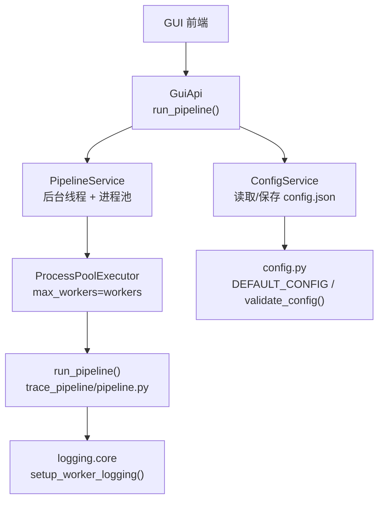
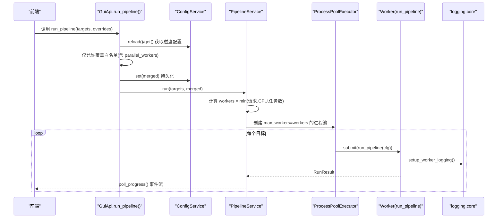
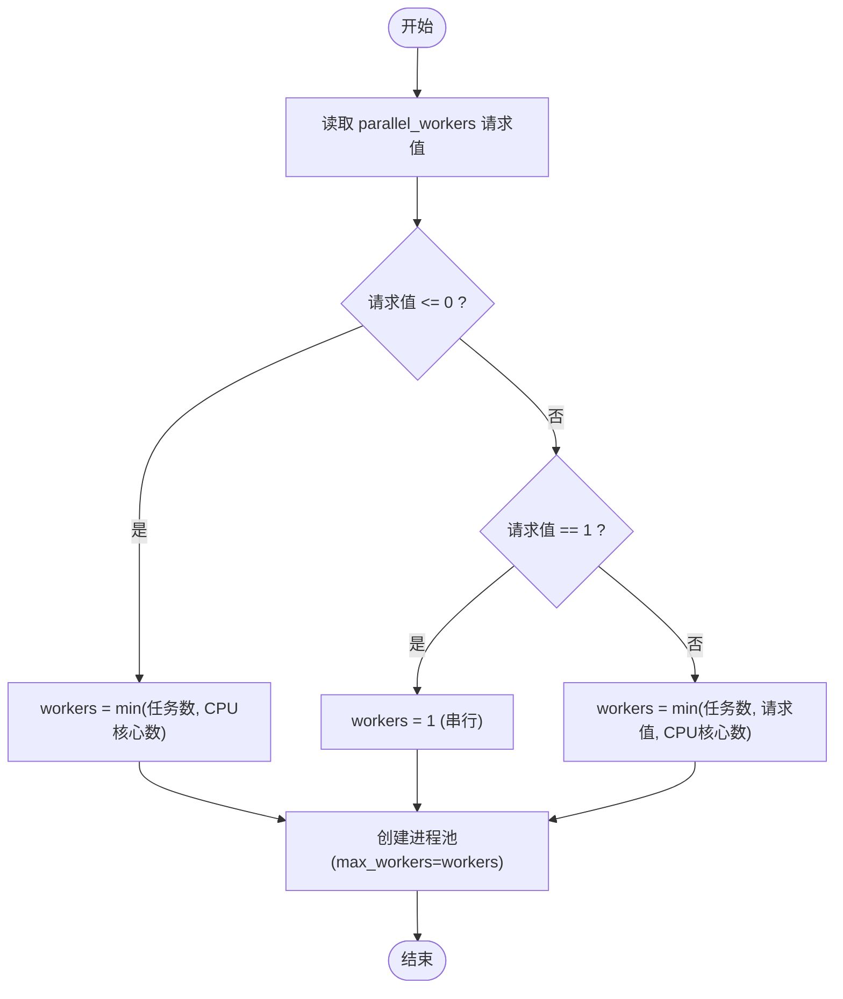
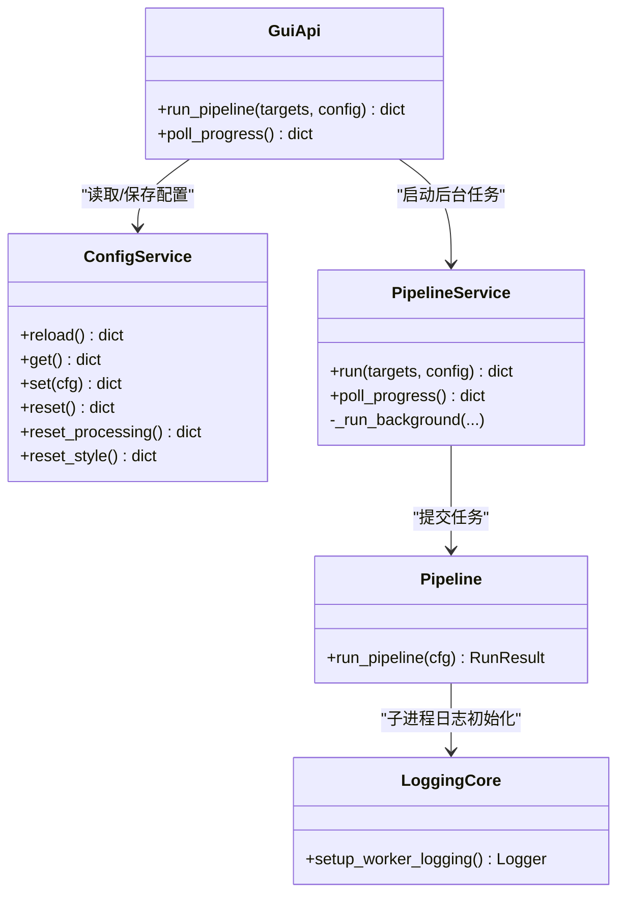

# 性能优化配置

<cite>
**本文引用的文件列表**
- [trace_pipeline/config.py](file://trace_pipeline/config.py)
- [backend/services/config_service.py](file://backend/services/config_service.py)
- [backend/services/pipeline_service.py](file://backend/services/pipeline_service.py)
- [trace_pipeline/pipeline.py](file://trace_pipeline/pipeline.py)
- [backend/gui_api.py](file://backend/gui_api.py)
- [trace_pipeline/logging/core.py](file://trace_pipeline/logging/core.py)
- [config.example.json](file://config.example.json)
</cite>

## 目录
1. [简介](#简介)
2. [项目结构](#项目结构)
3. [核心组件](#核心组件)
4. [架构总览](#架构总览)
5. [详细组件分析](#详细组件分析)
6. [依赖关系分析](#依赖关系分析)
7. [性能考虑](#性能考虑)
8. [故障排查指南](#故障排查指南)
9. [结论](#结论)
10. [附录](#附录)

## 简介
本文件聚焦于 TracePipeline 的性能优化配置，围绕以下目标展开：
- 并行处理配置（parallel_workers）的设置方法与 CPU 核心数适配策略
- 开发模式配置（is_dev_mode）的作用与调试能力
- 不同硬件环境下的调优建议（内存管理、进程池配置）
- 性能监控与瓶颈分析方法
- 大规模数据处理的最佳实践与注意事项

## 项目结构
与性能优化相关的关键模块分布如下：
- 配置加载与校验：trace_pipeline/config.py
- GUI 配置服务（读写 config.json）：backend/services/config_service.py
- 流水线执行与并行调度：backend/services/pipeline_service.py
- 单任务流水线编排：trace_pipeline/pipeline.py
- GUI API 入口（运行覆盖白名单）：backend/gui_api.py
- 日志系统（JSON Lines、按天归档、子进程独立日志）：trace_pipeline/logging/core.py
- 示例配置：config.example.json

图表来源
- [backend/gui_api.py:388-445](file://backend/gui_api.py#L388-L445)
- [backend/services/config_service.py:41-144](file://backend/services/config_service.py#L41-L144)
- [backend/services/pipeline_service.py:100-200](file://backend/services/pipeline_service.py#L100-L200)
- [trace_pipeline/pipeline.py:230-260](file://trace_pipeline/pipeline.py#L230-L260)
- [trace_pipeline/logging/core.py:401-449](file://trace_pipeline/logging/core.py#L401-L449)
- [trace_pipeline/config.py:56-79](file://trace_pipeline/config.py#L56-L79)

章节来源
- [trace_pipeline/config.py:56-79](file://trace_pipeline/config.py#L56-L79)
- [backend/services/config_service.py:41-144](file://backend/services/config_service.py#L41-L144)
- [backend/services/pipeline_service.py:100-200](file://backend/services/pipeline_service.py#L100-L200)
- [trace_pipeline/pipeline.py:230-260](file://trace_pipeline/pipeline.py#L230-L260)
- [backend/gui_api.py:388-445](file://backend/gui_api.py#L388-L445)
- [trace_pipeline/logging/core.py:401-449](file://trace_pipeline/logging/core.py#L401-L449)

## 核心组件
- 配置项定义与默认值
  - parallel_workers：控制并行工作进程数。默认 0 表示自动根据 CPU 核心数决定；1 表示串行；大于 1 为指定进程数。
  - is_dev_mode：布尔开关，用于启用开发者模式（如显示调试面板等）。
- 配置加载与校验
  - DEFAULT_CONFIG 中声明了上述字段及默认值。
  - validate_config 负责合并默认值、类型规范化与必填项检查。
- GUI 配置服务
  - ConfigService 提供 get/set/reset/reset_processing/reset_style 等方法，保证并发安全与原子写入。
- 流水线执行
  - PipelineService.run_background 计算实际 workers 数，使用 ProcessPoolExecutor 提交任务。
  - run_pipeline 在子进程中初始化非交互后端与样式，避免 GUI 阻塞。
- 日志系统
  - setup_worker_logging 为每个 worker 创建独立的 JSON 日志文件，便于定位问题。

章节来源
- [trace_pipeline/config.py:56-79](file://trace_pipeline/config.py#L56-L79)
- [backend/services/config_service.py:41-144](file://backend/services/config_service.py#L41-L144)
- [backend/services/pipeline_service.py:146-175](file://backend/services/pipeline_service.py#L146-L175)
- [trace_pipeline/pipeline.py:239-253](file://trace_pipeline/pipeline.py#L239-L253)
- [trace_pipeline/logging/core.py:401-449](file://trace_pipeline/logging/core.py#L401-L449)

## 架构总览
下图展示了从前端触发到并行执行的完整链路，以及关键配置项的生效位置。

图表来源
- [backend/gui_api.py:388-445](file://backend/gui_api.py#L388-L445)
- [backend/services/config_service.py:68-101](file://backend/services/config_service.py#L68-L101)
- [backend/services/pipeline_service.py:146-200](file://backend/services/pipeline_service.py#L146-L200)
- [trace_pipeline/pipeline.py:239-253](file://trace_pipeline/pipeline.py#L239-L253)
- [trace_pipeline/logging/core.py:401-449](file://trace_pipeline/logging/core.py#L401-L449)

## 详细组件分析

### 并行处理配置（parallel_workers）
- 配置项定义与默认值
  - 在默认配置中声明 parallel_workers，默认值为 0（自动）。
- 运行时决策逻辑
  - 若 requested <= 0：workers = min(任务数, CPU 核心数)
  - 若 requested == 1：强制串行（仍在独立进程中）
  - 若 requested > 1：workers = min(任务数, requested, CPU 核心数)，超出 CPU 核心数的部分会被裁剪并记录日志
- 进程上下文
  - 使用 spawn 上下文创建子进程，避免继承状态导致的不一致
- 子进程初始化
  - 在子进程中强制设置非交互后端并初始化样式，确保绘图稳定且不与 GUI 冲突
- 日志隔离
  - 每个 worker 拥有独立的 JSON 日志文件，便于并行场景下定位问题

图表来源
- [backend/services/pipeline_service.py:146-175](file://backend/services/pipeline_service.py#L146-L175)
- [trace_pipeline/pipeline.py:239-253](file://trace_pipeline/pipeline.py#L239-L253)
- [trace_pipeline/logging/core.py:401-449](file://trace_pipeline/logging/core.py#L401-L449)

章节来源
- [trace_pipeline/config.py:56-79](file://trace_pipeline/config.py#L56-L79)
- [backend/services/pipeline_service.py:146-175](file://backend/services/pipeline_service.py#L146-L175)
- [trace_pipeline/pipeline.py:239-253](file://trace_pipeline/pipeline.py#L239-L253)
- [trace_pipeline/logging/core.py:401-449](file://trace_pipeline/logging/core.py#L401-L449)

### 开发模式配置（is_dev_mode）
- 作用
  - 作为布尔开关，用于启用或禁用开发者模式功能（例如显示调试面板等），由 GUI 层消费该配置。
- 配置位置
  - 默认值在 DEFAULT_CONFIG 中定义，可通过 GUI 或配置文件修改。
- 影响范围
  - 主要影响前端展示与调试能力，不改变核心计算流程。

章节来源
- [trace_pipeline/config.py:56-79](file://trace_pipeline/config.py#L56-L79)
- [backend/services/config_service.py:22-38](file://backend/services/config_service.py#L22-L38)

### GUI 运行覆盖白名单与安全
- 白名单机制
  - run_pipeline 仅允许前端覆盖“处理参数”、“style”和“parallel_workers”，禁止通过运行请求覆盖输入/输出目录、表名前缀、露头名等路径/目标字段，防止越权。
- 配置持久化
  - 合并后的配置会写回 config.json，确保后续轮询与结果扫描一致性。

章节来源
- [backend/gui_api.py:48-49](file://backend/gui_api.py#L48-L49)
- [backend/gui_api.py:388-445](file://backend/gui_api.py#L388-L445)

### 单目标流水线（run_pipeline）
- 阶段划分
  - 数据加载 → 坐标变换与统计 → 节点识别（可选）→ Excel 导出 → 绘图（原始图、旋转图、玫瑰图）
- 错误处理
  - 统一捕获常见异常并返回失败结果，包含友好提示（如文件被占用、输入不存在等）
- 子进程安全
  - 在非主进程中强制初始化非交互后端与样式，避免 GUI 资源竞争

章节来源
- [trace_pipeline/pipeline.py:230-474](file://trace_pipeline/pipeline.py#L230-L474)

## 依赖关系分析
- 配置层
  - config.py 提供默认配置与校验；config_service.py 封装读写，保证并发安全与原子写入。
- 执行层
  - gui_api.py 暴露 API，维护白名单；pipeline_service.py 负责后台线程与进程池调度；pipeline.py 实现具体处理流程。
- 日志层
  - logging/core.py 提供 JSON 格式、按天归档、大小分片与子进程独立日志。

图表来源
- [backend/services/config_service.py:41-144](file://backend/services/config_service.py#L41-L144)
- [backend/gui_api.py:388-445](file://backend/gui_api.py#L388-L445)
- [backend/services/pipeline_service.py:100-200](file://backend/services/pipeline_service.py#L100-L200)
- [trace_pipeline/pipeline.py:230-260](file://trace_pipeline/pipeline.py#L230-L260)
- [trace_pipeline/logging/core.py:401-449](file://trace_pipeline/logging/core.py#L401-L449)

章节来源
- [backend/services/config_service.py:41-144](file://backend/services/config_service.py#L41-L144)
- [backend/gui_api.py:388-445](file://backend/gui_api.py#L388-L445)
- [backend/services/pipeline_service.py:100-200](file://backend/services/pipeline_service.py#L100-L200)
- [trace_pipeline/pipeline.py:230-260](file://trace_pipeline/pipeline.py#L230-L260)
- [trace_pipeline/logging/core.py:401-449](file://trace_pipeline/logging/core.py#L401-L449)

## 性能考虑

### 并行度与 CPU 核心数
- 自动模式（parallel_workers=0）
  - 推荐在多核服务器上开启，workers 取任务数与 CPU 核心数的较小值，避免过度创建进程。
- 串行模式（parallel_workers=1）
  - 适用于单核环境或需要严格顺序处理的场景。
- 指定模式（parallel_workers>1）
  - 超过 CPU 核心数的部分会被裁剪，并在日志中记录裁剪信息。

章节来源
- [backend/services/pipeline_service.py:146-175](file://backend/services/pipeline_service.py#L146-L175)

### 内存管理与 I/O 优化
- 大对象与缓存
  - 单目标流水线内部对数据加载进行签名缓存，减少重复 IO 开销。
- 绘图 DPI 与图像尺寸
  - 高 DPI 会显著增加内存与时间消耗，建议在批量处理时适当降低 trace_dpi/rotated_trace_dpi/rose_dpi。
- 文件锁与权限
  - 当输出文件被外部程序（如 Excel/WPS）占用时会抛出权限错误，需关闭后再重试。

章节来源
- [trace_pipeline/pipeline.py:61-95](file://trace_pipeline/pipeline.py#L61-L95)
- [trace_pipeline/pipeline.py:450-474](file://trace_pipeline/pipeline.py#L450-L474)

### 进程池与上下文
- 使用 spawn 上下文可避免继承状态导致的潜在问题，但会带来额外的进程启动开销。
- 对于大量小任务，合理设置 workers 以避免频繁创建销毁带来的额外成本。

章节来源
- [backend/services/pipeline_service.py:161-175](file://backend/services/pipeline_service.py#L161-L175)

### 不同硬件环境的调优建议
- 低配笔记本（CPU 核心数少、内存有限）
  - 建议 parallel_workers=1 或 2，降低 DPI，关闭不必要的节点识别与玫瑰图导出。
- 多核工作站（CPU 核心数多、内存充足）
  - 建议 parallel_workers=0（自动），根据任务规模调整 DPI，必要时开启节点识别。
- 服务器（高并发、长时间运行）
  - 建议 parallel_workers=0，结合日志归档与监控，定期清理历史输出与日志。

[本节为通用指导，无需特定文件引用]

## 故障排查指南

### 常见问题与定位方法
- 并行度过高导致卡顿或 OOM
  - 现象：系统负载飙升、内存不足、任务失败
  - 排查：查看并行执行日志中的 workers 与实际 CPU 核心数，适当降低 parallel_workers
- 输出文件被占用
  - 现象：PermissionError
  - 排查：关闭已打开的输出文件（Excel/WPS），重新运行
- 输入文件缺失
  - 现象：FileNotFoundError
  - 排查：确认 input_dir 与 table_stem 是否正确
- 子进程日志分散
  - 现象：worker 日志位于 logs/<日期>/worker_<pid>.jsonl
  - 排查：结合 request_id 与 stage 字段定位问题阶段

章节来源
- [backend/services/pipeline_service.py:289-305](file://backend/services/pipeline_service.py#L289-L305)
- [trace_pipeline/pipeline.py:450-474](file://trace_pipeline/pipeline.py#L450-L474)
- [trace_pipeline/logging/core.py:148-194](file://trace_pipeline/logging/core.py#L148-L194)

### 性能监控与瓶颈分析
- 利用日志关键字段
  - stage：标识各阶段（如 load、transform、plot、item_end、batch_end）
  - duration_ms：记录耗时，便于对比阶段差异
  - outcrop、trace_count、mean_length：辅助判断数据规模与复杂度
- 分析步骤
  - 筛选 batch_end 与 item_end 日志，评估整体吞吐与单任务耗时
  - 关注 plot 阶段的 duration_ms，若偏高则考虑降低 DPI 或关闭玫瑰图
  - 观察 transform 阶段，若窗口策略复杂，可适当调整 window_strategy 与阈值

章节来源
- [trace_pipeline/pipeline.py:264-343](file://trace_pipeline/pipeline.py#L264-L343)
- [backend/services/pipeline_service.py:307-325](file://backend/services/pipeline_service.py#L307-L325)
- [trace_pipeline/logging/core.py:44-123](file://trace_pipeline/logging/core.py#L44-L123)

### 大规模数据处理最佳实践
- 分批处理
  - 将大批量任务拆分为若干批次，避免单次提交过多任务导致队列过长
- 动态调整并行度
  - 根据实时系统负载与内存使用情况，动态调整 parallel_workers
- 输出与日志管理
  - 定期清理历史输出与归档日志，避免磁盘空间不足
- 预检与预热
  - 首次运行前执行字体缓存预热，减少首帧延迟

章节来源
- [backend/gui_api.py:336-356](file://backend/gui_api.py#L336-L356)
- [trace_pipeline/logging/core.py:207-273](file://trace_pipeline/logging/core.py#L207-L273)

## 结论
- parallel_workers 是提升批处理吞吐的关键配置，应依据 CPU 核心数与任务规模合理设置
- is_dev_mode 主要用于前端调试与可视化，不影响核心计算流程
- 通过结构化日志与阶段计时，可有效定位性能瓶颈并进行针对性优化
- 针对不同硬件环境采取差异化策略，兼顾吞吐与稳定性

[本节为总结性内容，无需特定文件引用]

## 附录

### 配置项速查
- parallel_workers
  - 含义：并行工作进程数
  - 默认值：0（自动）
  - 取值说明：0=自动（min(任务数, CPU核心数)），1=串行，>1=指定进程数（不超过 CPU 核心数）
- is_dev_mode
  - 含义：开发者模式开关
  - 默认值：false
  - 用途：启用调试面板等功能

章节来源
- [trace_pipeline/config.py:56-79](file://trace_pipeline/config.py#L56-L79)
- [config.example.json:22-23](file://config.example.json#L22-L23)