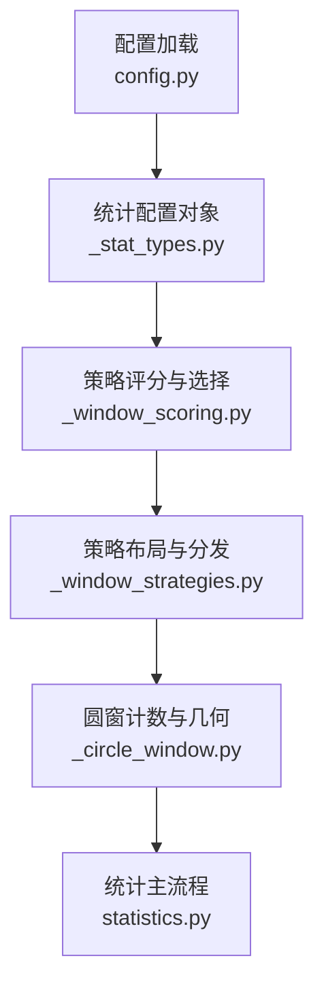
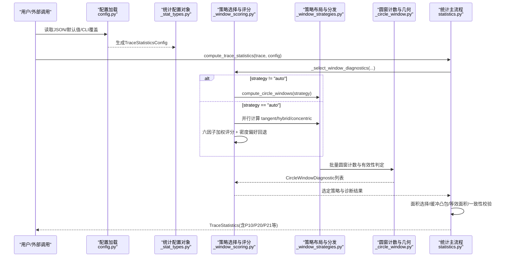
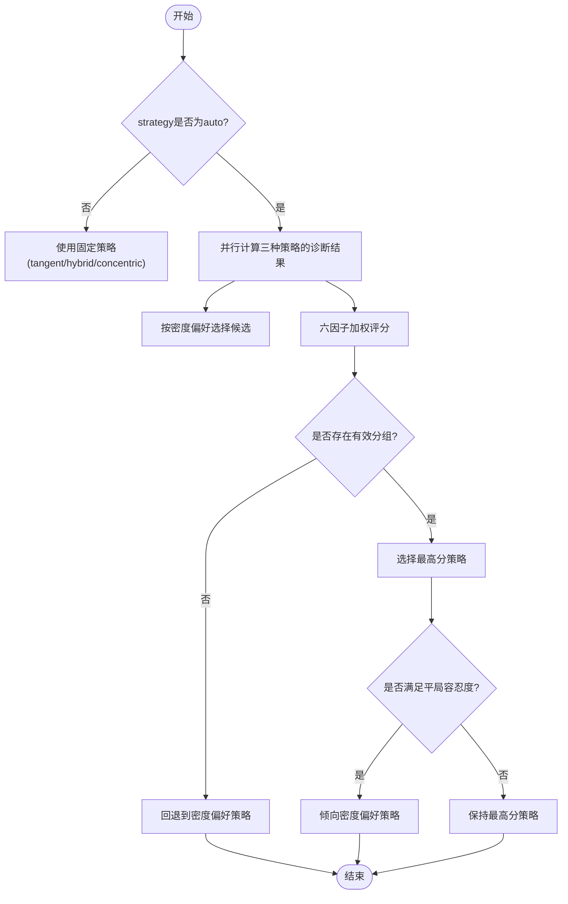
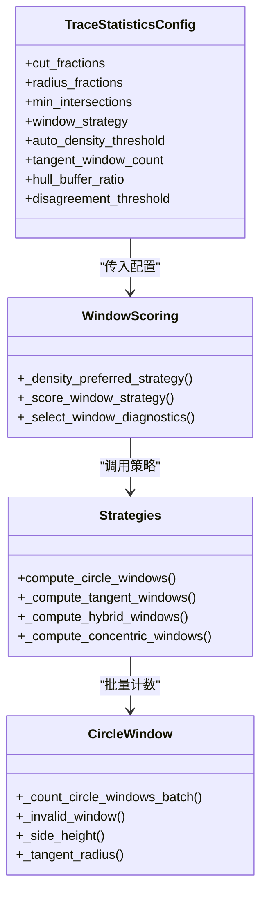
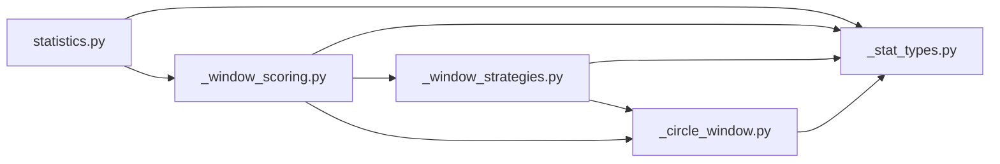

# 统计分析配置

<cite>
**本文引用的文件**   
- [config.py](file://trace_pipeline/config.py)
- [_stat_types.py](file://trace_pipeline/geology/_stat_types.py)
- [_window_scoring.py](file://trace_pipeline/geology/_window_scoring.py)
- [_window_strategies.py](file://trace_pipeline/geology/_window_strategies.py)
- [_circle_window.py](file://trace_pipeline/geology/_circle_window.py)
- [statistics.py](file://trace_pipeline/geology/statistics.py)
- [config.example.json](file://config.example.json)
</cite>

## 目录
1. [简介](#简介)
2. [项目结构](#项目结构)
3. [核心组件](#核心组件)
4. [架构总览](#架构总览)
5. [详细组件分析](#详细组件分析)
6. [依赖关系分析](#依赖关系分析)
7. [性能考虑](#性能考虑)
8. [故障排查指南](#故障排查指南)
9. [结论](#结论)
10. [附录](#附录)

## 简介
本文件聚焦于“圆窗策略”的统计分析配置，系统性地说明以下参数的作用与调优方法：
- window_strategy：圆窗策略选择（auto、tangent、hybrid、concentric）
- auto_density_threshold：自动密度阈值
- tangent_window_count：切向窗数量
- min_intersections：最少相交迹线数

文档将解释四种策略的算法原理与适用场景，给出密度阈值的调优建议，并提供不同地质环境下的最佳实践。

## 项目结构
与圆窗策略相关的核心代码位于 geology 子模块中，配合顶层配置加载模块完成参数解析与校验。关键文件职责如下：
- trace_pipeline/config.py：全局配置加载、默认值、CLI 覆盖与路径解析
- trace_pipeline/geology/_stat_types.py：统计配置类 TraceStatisticsConfig 及诊断结果数据结构定义
- trace_pipeline/geology/_window_scoring.py：多策略评分与自动策略选择逻辑
- trace_pipeline/geology/_window_strategies.py：具体策略布局与分发（tangent/hybrid/concentric）
- trace_pipeline/geology/_circle_window.py：圆窗计数、几何工具与无效窗口处理
- trace_pipeline/geology/statistics.py：统计主流程，串联面积选择、P10/P20/P21 计算与一致性校验
- config.example.json：示例配置文件，包含圆窗相关键位

图表来源
- [config.py:56-79](file://trace_pipeline/config.py#L56-L79)
- [_stat_types.py:15-64](file://trace_pipeline/geology/_stat_types.py#L15-L64)
- [_window_scoring.py:178-323](file://trace_pipeline/geology/_window_scoring.py#L178-L323)
- [_window_strategies.py:173-185](file://trace_pipeline/geology/_window_strategies.py#L173-L185)
- [_circle_window.py:71-216](file://trace_pipeline/geology/_circle_window.py#L71-L216)
- [statistics.py:212-391](file://trace_pipeline/geology/statistics.py#L212-L391)

章节来源
- [config.py:56-79](file://trace_pipeline/config.py#L56-L79)
- [_stat_types.py:15-64](file://trace_pipeline/geology/_stat_types.py#L15-L64)
- [_window_scoring.py:178-323](file://trace_pipeline/geology/_window_scoring.py#L178-L323)
- [_window_strategies.py:173-185](file://trace_pipeline/geology/_window_strategies.py#L173-L185)
- [_circle_window.py:71-216](file://trace_pipeline/geology/_circle_window.py#L71-L216)
- [statistics.py:212-391](file://trace_pipeline/geology/statistics.py#L212-L391)

## 核心组件
- 配置项与默认值
  - window_strategy：默认 "auto"，支持 "auto"/"tangent"/"hybrid"/"concentric"
  - auto_density_threshold：默认 5.0，用于自动策略密度判断
  - tangent_window_count：默认 3，控制切向窗数量
  - min_intersections：默认 5，控制有效窗口的最低相交迹线数
- 配置校验与类型约束
  - cut_fractions/radius_fractions 范围与正数约束
  - min_intersections 必须为正整数
  - auto_density_threshold 必须为正数
  - tangent_window_count 必须为正整数
  - disagreement_threshold 可选，若提供则需为正数或 None
- 配置加载与合并
  - 从 JSON 加载并合并默认值，支持 CLI 覆盖
  - 未知键将被忽略并记录警告

章节来源
- [config.py:56-79](file://trace_pipeline/config.py#L56-L79)
- [_stat_types.py:15-64](file://trace_pipeline/geology/_stat_types.py#L15-L64)

## 架构总览
下图展示从配置到最终统计结果的完整数据流与控制流。

图表来源
- [config.py:86-145](file://trace_pipeline/config.py#L86-L145)
- [_stat_types.py:15-64](file://trace_pipeline/geology/_stat_types.py#L15-L64)
- [_window_scoring.py:235-323](file://trace_pipeline/geology/_window_scoring.py#L235-L323)
- [_window_strategies.py:173-185](file://trace_pipeline/geology/_window_strategies.py#L173-L185)
- [_circle_window.py:71-216](file://trace_pipeline/geology/_circle_window.py#L71-L216)
- [statistics.py:212-391](file://trace_pipeline/geology/statistics.py#L212-L391)

## 详细组件分析

### 配置项与校验
- window_strategy
  - 取值："auto"、"tangent"、"hybrid"、"concentric"
  - 默认："auto"
  - 行为：当为 "auto" 时进入评分与密度偏好选择；否则直接采用指定策略
- auto_density_threshold
  - 含义：在自动模式下，根据粗略面密度决定倾向的策略
  - 默认：5.0
  - 影响：密度低于该阈值更倾向 hybrid，高于该阈值更倾向 concentric
- tangent_window_count
  - 含义：切向策略下沿测线方向生成的切向窗数量
  - 默认：3
  - 影响：半径 = 测线长度 / (2 × tangent_window_count)
- min_intersections
  - 含义：单个圆窗至少需要相交的迹线数，低于此数则该窗无效
  - 默认：5
  - 影响：直接影响有效分组数量与稳定性评分

章节来源
- [config.py:56-79](file://trace_pipeline/config.py#L56-L79)
- [_stat_types.py:15-64](file://trace_pipeline/geology/_stat_types.py#L15-L64)

### 自动策略选择与评分机制
- 密度偏好
  - 基于粗略面密度与期望相交数进行初步偏好选择
  - 当期望相交数不足时优先 tangent；密度较低时倾向 hybrid；密度较高时倾向 concentric
- 六因子加权评分
  - 有效分组得分权重最高，保证指标可信度前提
  - 空间覆盖（侧向+沿测线）、稳定性（变异系数倒数）、样本充分性（相对目标相交数的比例）、半径大小等综合打分
  - 当所有策略得分非正时回退至最保守策略 tangent
  - 存在平局容忍度，允许密度偏好策略在接近分数时被选中

图表来源
- [_window_scoring.py:209-323](file://trace_pipeline/geology/_window_scoring.py#L209-L323)

章节来源
- [_window_scoring.py:178-323](file://trace_pipeline/geology/_window_scoring.py#L178-L323)

### 四种圆窗策略的原理与适用场景
- tangent（切向策略）
  - 原理：以测线长度为基准，按 tangent_window_count 均匀分布切向位置，半径由测线长度与切向窗数量决定
  - 适用：低密度或样本量不足的场景，确保每个窗有足够相交迹线
  - 注意：当可用侧向高度不足或测线长度不足时，会标记为无效窗口
- hybrid（混合策略）
  - 原理：在多个 cut_fraction 处沿左右两侧生成窗口，半径取侧向高度与端部距离限制的最大值乘以 radius_fractions
  - 适用：中等密度场景，兼顾侧向与沿测线的空间覆盖
  - 注意：若某 cut_fraction 或 side 的可用高度不足，会生成无效窗口
- concentric（同心策略）
  - 原理：以测线中心为圆心，按 radius_fractions 生成多个同心圆窗
  - 适用：高密度场景，便于获得较大半径与稳定估计
  - 注意：若可用半径不足，会返回无效窗口
- auto（自动策略）
  - 原理：同时计算 tangent/hybrid/concentric，通过六因子评分与密度偏好择优
  - 适用：通用场景，无需人工干预即可得到较稳健的结果
  - 注意：当所有策略均无有效分组时回退到 tangent

图表来源
- [_stat_types.py:15-64](file://trace_pipeline/geology/_stat_types.py#L15-L64)
- [_window_scoring.py:178-323](file://trace_pipeline/geology/_window_scoring.py#L178-L323)
- [_window_strategies.py:173-185](file://trace_pipeline/geology/_window_strategies.py#L173-L185)
- [_circle_window.py:71-216](file://trace_pipeline/geology/_circle_window.py#L71-L216)

章节来源
- [_window_strategies.py:52-185](file://trace_pipeline/geology/_window_strategies.py#L52-L185)
- [_circle_window.py:255-269](file://trace_pipeline/geology/_circle_window.py#L255-L269)

### 密度阈值参数调优方法
- 密度估算方式
  - 粗略面密度 = 迹线数 / 有效露头面积（优先原始凸包面积，必要时降级至缓冲凸包或圆窗等效面积）
  - 期望相交数 = 粗略面密度 × π × 半径^2
- 调优步骤
  - 观察当前数据的粗略面密度与期望相交数
  - 若期望相交数 < min_intersections，优先选择 tangent 或增大 tangent_window_count
  - 若密度 < auto_density_threshold，倾向 hybrid；若密度 > auto_density_threshold，倾向 concentric
  - 调整 auto_density_threshold 以平衡 hybrid 与 concentric 的选择边界
- 验证手段
  - 检查各策略的有效分组数量与稳定性评分
  - 关注一致性告警（主 P20/P21 与圆窗估计的差异）

章节来源
- [_window_scoring.py:209-233](file://trace_pipeline/geology/_window_scoring.py#L209-L233)
- [statistics.py:106-166](file://trace_pipeline/geology/statistics.py#L106-L166)

### 不同地质环境的配置最佳实践
- 低密度裂隙网络（稀疏、样本少）
  - 推荐：window_strategy="tangent"，适当增大 tangent_window_count，提高 min_intersections 以保证统计可靠性
  - 理由：切向策略在小样本下更易达到最小相交要求，避免无效窗过多
- 中等密度（常见露头）
  - 推荐：window_strategy="auto"，保留默认 auto_density_threshold=5.0，观察评分与有效分组
  - 理由：自动模式能根据数据特征在 hybrid 与 concentric 间取得平衡
- 高密度（密集裂隙或构造带）
  - 推荐：window_strategy="auto" 或 "concentric"，可适当降低 auto_density_threshold 以更早选择 concentric
  - 理由：高密度下同心窗可获得更大半径与更稳定的估计
- 边缘效应显著（测线长度有限或侧向高度不足）
  - 推荐：window_strategy="tangent"，减小 tangent_window_count 以避免半径过大导致无效窗
  - 理由：减少切向窗数量可降低半径，提升有效窗比例

[本节为概念性指导，不直接分析具体文件]

## 依赖关系分析
- 模块耦合
  - statistics.py 作为主入口，依赖 _window_scoring.py 进行策略选择，再依赖 _window_strategies.py 与 _circle_window.py 完成计数
  - _window_scoring.py 依赖 _circle_window.py 的几何工具与 _window_strategies.py 的策略实现
  - _stat_types.py 提供统一的数据结构与常量（如 _EPS）
- 外部依赖
  - numpy 用于向量化计算与广播，提升批量圆窗计数的性能
- 潜在循环依赖
  - 当前结构清晰分层，未见循环导入

图表来源
- [statistics.py:212-391](file://trace_pipeline/geology/statistics.py#L212-L391)
- [_window_scoring.py:178-323](file://trace_pipeline/geology/_window_scoring.py#L178-L323)
- [_window_strategies.py:173-185](file://trace_pipeline/geology/_window_strategies.py#L173-L185)
- [_circle_window.py:71-216](file://trace_pipeline/geology/_circle_window.py#L71-L216)
- [_stat_types.py:15-64](file://trace_pipeline/geology/_stat_types.py#L15-L64)

章节来源
- [statistics.py:212-391](file://trace_pipeline/geology/statistics.py#L212-L391)
- [_window_scoring.py:178-323](file://trace_pipeline/geology/_window_scoring.py#L178-L323)
- [_window_strategies.py:173-185](file://trace_pipeline/geology/_window_strategies.py#L173-L185)
- [_circle_window.py:71-216](file://trace_pipeline/geology/_circle_window.py#L71-L216)
- [_stat_types.py:15-64](file://trace_pipeline/geology/_stat_types.py#L15-L64)

## 性能考虑
- 向量化批量计数
  - 利用 broadcasting 一次性计算 N 条线段到 M 个圆心的距离矩阵，避免多次 Python 函数调用开销
- 内存与复杂度
  - 距离矩阵维度为 (N, M)，在大数据集上需注意内存占用
  - 可通过合理设置 tangent_window_count 与 radius_fractions 控制 M 的大小
- 自适应阈值
  - 一致性阈值随样本量指数衰减，有助于在大样本下更严格地校验 P20/P21 的一致性

章节来源
- [_circle_window.py:71-216](file://trace_pipeline/geology/_circle_window.py#L71-L216)
- [statistics.py:84-94](file://trace_pipeline/geology/statistics.py#L84-L94)

## 故障排查指南
- 无效窗口原因
  - 无迹线数据：本地线段为空
  - 可用侧向高度或端部距离不足：hybrid/tangent 策略下半径受限
  - 测线长度不足：tangent 策略无法计算有效半径
  - 可用半径不足：concentric 策略中心半径受限
  - 相交迹线数不足：低于 min_intersections
- 面积来源降级与一致性告警
  - 四层回退：实测面积 → 原始凸包 → 缓冲凸包 → 圆窗等效面积
  - 当主 P20/P21 与圆窗估计差异超过自适应阈值时，产生一致性告警
- 常见问题定位
  - 检查 min_intersections 是否过高导致大量无效窗
  - 调整 tangent_window_count 以降低半径，提升有效窗比例
  - 观察 auto_density_threshold 对策略选择的敏感性

章节来源
- [_circle_window.py:219-249](file://trace_pipeline/geology/_circle_window.py#L219-L249)
- [statistics.py:106-166](file://trace_pipeline/geology/statistics.py#L106-L166)
- [statistics.py:313-336](file://trace_pipeline/geology/statistics.py#L313-L336)

## 结论
- 自动策略在多数场景下能提供稳健结果，但理解密度阈值与策略特性有助于精细化调优
- 低密度与边缘效应显著的环境应优先考虑 tangent 策略并控制切向窗数量
- 高密度环境下可倾向 concentric 以获得更大半径与更稳定估计
- 通过一致性告警与面积来源降级信息，可有效评估统计结果的可靠性

[本节为总结性内容，不直接分析具体文件]

## 附录
- 示例配置键位参考
  - window_strategy、auto_density_threshold、tangent_window_count、min_intersections
- 配置加载与默认值
  - 默认值来源于 DEFAULT_CONFIG，可在 JSON 或 CLI 中覆盖

章节来源
- [config.example.json:14-17](file://config.example.json#L14-L17)
- [config.py:56-79](file://trace_pipeline/config.py#L56-L79)