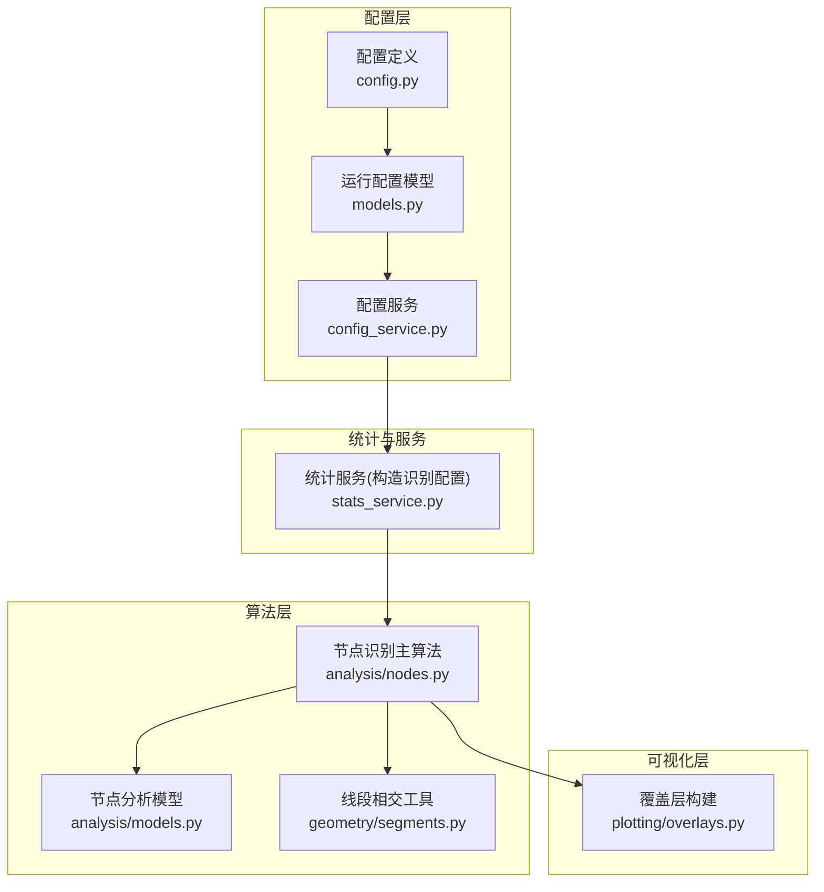
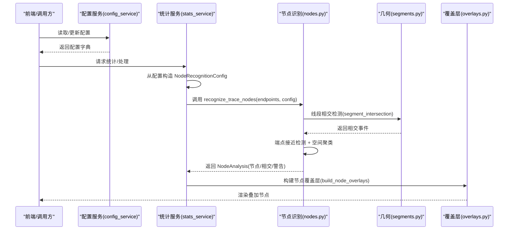
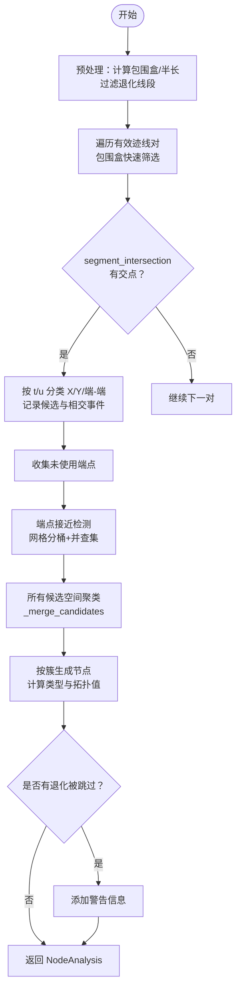
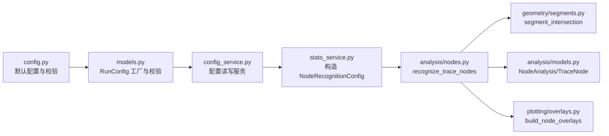

# 节点识别配置

<cite>
**本文引用的文件**   
- [trace_pipeline/analysis/nodes.py](file://trace_pipeline/analysis/nodes.py)
- [trace_pipeline/analysis/models.py](file://trace_pipeline/analysis/models.py)
- [trace_pipeline/config.py](file://trace_pipeline/config.py)
- [trace_pipeline/models.py](file://trace_pipeline/models.py)
- [backend/services/config_service.py](file://backend/services/config_service.py)
- [backend/services/stats_service.py](file://backend/services/stats_service.py)
- [trace_pipeline/geometry/segments.py](file://trace_pipeline/geometry/segments.py)
- [trace_pipeline/plotting/overlays.py](file://trace_pipeline/plotting/overlays.py)
- [tests/test_nodes.py](file://tests/test_nodes.py)
</cite>

## 目录
1. [简介](#简介)
2. [项目结构](#项目结构)
3. [核心组件](#核心组件)
4. [架构总览](#架构总览)
5. [详细组件分析](#详细组件分析)
6. [依赖关系分析](#依赖关系分析)
7. [性能与精度控制](#性能与精度控制)
8. [参数调优指南](#参数调优指南)
9. [结果验证与调试](#结果验证与调试)
10. [结论](#结论)

## 简介
本文件面向用户与开发者，系统化说明“节点识别”功能的配置项、算法原理、精度控制方法以及结果验证与调试技巧。重点覆盖以下配置项：
- 节点识别开关：enable_node_recognition
- 合并容差：node_merge_tolerance
- 显示选项：show_node_overlay
- 标签模式：node_label_mode

同时解释节点识别算法的核心流程（相交检测、端点接近检测、空间聚类与拓扑分类），并给出不同容差对结果的影响及数据质量相关的调整建议。

## 项目结构
与节点识别相关的关键代码分布在如下模块：
- 配置定义与加载：config.py、models.py、config_service.py
- 节点识别算法：analysis/nodes.py、analysis/models.py
- 几何基础：geometry/segments.py
- 可视化覆盖层：plotting/overlays.py
- 测试用例：tests/test_nodes.py

图表来源
- [trace_pipeline/config.py:56-79](file://trace_pipeline/config.py#L56-L79)
- [trace_pipeline/models.py:196-267](file://trace_pipeline/models.py#L196-L267)
- [backend/services/config_service.py:22-38](file://backend/services/config_service.py#L22-L38)
- [backend/services/stats_service.py:191-194](file://backend/services/stats_service.py#L191-L194)
- [trace_pipeline/analysis/nodes.py:160-180](file://trace_pipeline/analysis/nodes.py#L160-L180)
- [trace_pipeline/analysis/models.py:22-36](file://trace_pipeline/analysis/models.py#L22-L36)
- [trace_pipeline/geometry/segments.py:42-113](file://trace_pipeline/geometry/segments.py#L42-L113)
- [trace_pipeline/plotting/overlays.py:117-130](file://trace_pipeline/plotting/overlays.py#L117-L130)

章节来源
- [trace_pipeline/config.py:56-79](file://trace_pipeline/config.py#L56-L79)
- [trace_pipeline/models.py:196-267](file://trace_pipeline/models.py#L196-L267)
- [backend/services/config_service.py:22-38](file://backend/services/config_service.py#L22-L38)
- [backend/services/stats_service.py:191-194](file://backend/services/stats_service.py#L191-L194)
- [trace_pipeline/analysis/nodes.py:160-180](file://trace_pipeline/analysis/nodes.py#L160-L180)
- [trace_pipeline/analysis/models.py:22-36](file://trace_pipeline/analysis/models.py#L22-L36)
- [trace_pipeline/geometry/segments.py:42-113](file://trace_pipeline/geometry/segments.py#L42-L113)
- [trace_pipeline/plotting/overlays.py:117-130](file://trace_pipeline/plotting/overlays.py#L117-L130)

## 核心组件
- 配置项定义与默认值
  - enable_node_recognition：布尔开关，控制是否执行节点识别。
  - node_merge_tolerance：浮点数，用于几何相交与端点接近的容差；内部还会基于平均迹线长度计算聚类容差。
  - show_node_overlay：布尔开关，控制是否在绘图中叠加节点覆盖层。
  - node_label_mode：字符串，控制节点标签显示模式（none/type/id）。
- 运行时配置模型
  - NodeRecognitionConfig：封装节点识别所需的运行时配置，包含 enabled、merge_tolerance、show_overlay、label_mode 等字段，并在构造时进行校验。
  - RunConfig：高层运行配置，包含上述键，并提供 from_mapping 工厂方法与 style 子对象兼容逻辑（当未显式提供 node_label_mode 时从 style.node_label_mode 读取）。
- 配置持久化与服务
  - ConfigService：负责 config.json 的读写、校验与原子保存，暴露 get/set/reset/reset_processing/reset_style 等方法。
  - stats_service：在统计服务中根据全局配置构造 NodeRecognitionConfig 实例，传入识别算法。

章节来源
- [trace_pipeline/config.py:56-79](file://trace_pipeline/config.py#L56-L79)
- [trace_pipeline/models.py:196-267](file://trace_pipeline/models.py#L196-L267)
- [trace_pipeline/analysis/models.py:22-36](file://trace_pipeline/analysis/models.py#L22-L36)
- [backend/services/config_service.py:22-38](file://backend/services/config_service.py#L22-L38)
- [backend/services/stats_service.py:191-194](file://backend/services/stats_service.py#L191-L194)

## 架构总览
下图展示了从配置到识别再到可视化的端到端流程。

图表来源
- [backend/services/config_service.py:68-101](file://backend/services/config_service.py#L68-L101)
- [backend/services/stats_service.py:191-194](file://backend/services/stats_service.py#L191-L194)
- [trace_pipeline/analysis/nodes.py:160-180](file://trace_pipeline/analysis/nodes.py#L160-L180)
- [trace_pipeline/geometry/segments.py:42-113](file://trace_pipeline/geometry/segments.py#L42-L113)
- [trace_pipeline/plotting/overlays.py:117-130](file://trace_pipeline/plotting/overlays.py#L117-L130)

## 详细组件分析

### 配置项详解
- enable_node_recognition
  - 作用：控制是否执行节点识别。为 False 时直接返回空结果。
  - 默认值：False
  - 影响范围：识别入口快速路径，避免不必要的计算。
- node_merge_tolerance
  - 作用：几何相交与端点接近的容差；内部会结合平均迹线长度计算聚类容差（取两者最大值）。
  - 默认值：0.01
  - 约束：必须大于 0，否则抛出异常。
- show_node_overlay
  - 作用：控制是否在绘图中叠加节点覆盖层。
  - 默认值：True
- node_label_mode
  - 作用：节点标签显示模式，支持 none/type/id。
  - 默认值：type
  - 兼容：若未在顶层提供，可从 style.node_label_mode 读取。

章节来源
- [trace_pipeline/config.py:56-79](file://trace_pipeline/config.py#L56-L79)
- [trace_pipeline/models.py:196-267](file://trace_pipeline/models.py#L196-L267)
- [trace_pipeline/analysis/models.py:22-36](file://trace_pipeline/analysis/models.py#L22-L36)

### 节点识别算法原理
- 输入：端点坐标数组 (N, 4)，列序 [x1, y1, x2, y2]；NodeRecognitionConfig。
- 输出：NodeAnalysis，包含 nodes、intersections、warnings、degenerate_skipped、merge_tolerance。
- 主要步骤：
  1) 预处理：计算每条迹线的包围盒与半长，过滤退化线段（长度小于容差）。
  2) 候选筛选：按包围盒扩展 margin 做快速过滤，再对候选对调用 segment_intersection 精确检测。
  3) 事件分类：根据参数 t/u 是否位于内部，区分 X/Y/端-端接触，记录 TraceIntersection。
  4) 端点接近检测：收集未被使用的端点，网格分桶 + 并查集聚类，生成候选。
  5) 聚类合并：对所有候选点进行空间网格 + 并查集聚类，得到簇。
  6) 节点分类：依据簇内迹线参与方式与拓扑值，判定 I/Y/X 类型与 degree。
- 关键数据结构：
  - _Candidate：候选点（坐标、所属迹线索引、参数）。
  - _UnionFind：并查集，用于传递性聚类合并。
  - TraceNode/TraceIntersection/NodeAnalysis：结果模型。

图表来源
- [trace_pipeline/analysis/nodes.py:160-180](file://trace_pipeline/analysis/nodes.py#L160-L180)
- [trace_pipeline/analysis/nodes.py:202-246](file://trace_pipeline/analysis/nodes.py#L202-L246)
- [trace_pipeline/analysis/nodes.py:246-319](file://trace_pipeline/analysis/nodes.py#L246-L319)
- [trace_pipeline/analysis/nodes.py:320-383](file://trace_pipeline/analysis/nodes.py#L320-L383)
- [trace_pipeline/analysis/nodes.py:384-416](file://trace_pipeline/analysis/nodes.py#L384-L416)
- [trace_pipeline/geometry/segments.py:42-113](file://trace_pipeline/geometry/segments.py#L42-L113)

章节来源
- [trace_pipeline/analysis/nodes.py:160-416](file://trace_pipeline/analysis/nodes.py#L160-L416)
- [trace_pipeline/analysis/models.py:22-98](file://trace_pipeline/analysis/models.py#L22-L98)
- [trace_pipeline/geometry/segments.py:42-113](file://trace_pipeline/geometry/segments.py#L42-L113)

### 可视化覆盖层
- build_node_overlays：将 NodeAnalysis.nodes 转换为 NodeOverlay 列表，供绘图叠加。
- build_rotated_node_overlays：将原始节点坐标旋转到测线坐标系后再生成覆盖层。

章节来源
- [trace_pipeline/plotting/overlays.py:117-156](file://trace_pipeline/plotting/overlays.py#L117-L156)

## 依赖关系分析
- 配置到算法
  - config.py 提供默认配置与校验；models.py 提供 RunConfig 与字段级校验；config_service.py 提供持久化与线程安全访问。
  - stats_service.py 从全局配置构造 NodeRecognitionConfig 并传入识别算法。
- 算法到几何
  - analysis/nodes.py 依赖 geometry/segments.py 的 segment_intersection 完成精确相交检测。
- 算法到可视化
  - analysis/nodes.py 产出 NodeAnalysis；plotting/overlays.py 将其转为覆盖层。

图表来源
- [trace_pipeline/config.py:56-79](file://trace_pipeline/config.py#L56-L79)
- [trace_pipeline/models.py:196-267](file://trace_pipeline/models.py#L196-L267)
- [backend/services/config_service.py:68-101](file://backend/services/config_service.py#L68-L101)
- [backend/services/stats_service.py:191-194](file://backend/services/stats_service.py#L191-L194)
- [trace_pipeline/analysis/nodes.py:160-180](file://trace_pipeline/analysis/nodes.py#L160-L180)
- [trace_pipeline/analysis/models.py:22-98](file://trace_pipeline/analysis/models.py#L22-L98)
- [trace_pipeline/geometry/segments.py:42-113](file://trace_pipeline/geometry/segments.py#L42-L113)
- [trace_pipeline/plotting/overlays.py:117-130](file://trace_pipeline/plotting/overlays.py#L117-L130)

章节来源
- [trace_pipeline/config.py:56-79](file://trace_pipeline/config.py#L56-L79)
- [trace_pipeline/models.py:196-267](file://trace_pipeline/models.py#L196-L267)
- [backend/services/config_service.py:68-101](file://backend/services/config_service.py#L68-L101)
- [backend/services/stats_service.py:191-194](file://backend/services/stats_service.py#L191-L194)
- [trace_pipeline/analysis/nodes.py:160-180](file://trace_pipeline/analysis/nodes.py#L160-L180)
- [trace_pipeline/analysis/models.py:22-98](file://trace_pipeline/analysis/models.py#L22-L98)
- [trace_pipeline/geometry/segments.py:42-113](file://trace_pipeline/geometry/segments.py#L42-L113)
- [trace_pipeline/plotting/overlays.py:117-130](file://trace_pipeline/plotting/overlays.py#L117-L130)

## 性能与精度控制
- 性能优化要点
  - 向量化包围盒筛选：减少无效对的精确相交计算。
  - 网格分桶 + 并查集：加速端点接近与候选点聚类。
  - 预计算数据结构：降低重复计算开销。
- 精度控制要点
  - merge_tolerance：直接影响相交判定与端点接近判定；过小可能漏检，过大可能误合并。
  - 聚类容差：内部取 max(tolerance, 0.01 * mean_len)，兼顾绝对容差与数据尺度。
  - 退化线段过滤：长度小于容差的线段会被跳过并产生警告。

章节来源
- [trace_pipeline/analysis/nodes.py:182-196](file://trace_pipeline/analysis/nodes.py#L182-L196)
- [trace_pipeline/analysis/nodes.py:208-222](file://trace_pipeline/analysis/nodes.py#L208-L222)
- [trace_pipeline/analysis/nodes.py:384-416](file://trace_pipeline/analysis/nodes.py#L384-L416)

## 参数调优指南
- 不同容差值的影响
  - 较小容差：更严格，可能漏掉轻微偏移的交叉或端点接触；适合高精度、低噪声数据。
  - 较大容差：更易合并相近事件，但可能将独立特征错误合并；适合低分辨率或含噪声的数据。
- 数据质量与参数选择
  - 数据分辨率高、噪声低：优先使用较小的 merge_tolerance，并观察 warnings 中的“退化线段”数量。
  - 数据分辨率低、噪声大：适当增大 merge_tolerance，并结合聚类容差自动放大策略（mean_len 比例）提升鲁棒性。
  - 大量平行/共线重叠：关注 parallel_overlap 分支产生的节点，必要时微调容差以避免过度合并。
- 实用建议
  - 先启用 show_node_overlay 与合适的 label_mode（如 type），通过可视化直观评估效果。
  - 逐步调整 node_merge_tolerance，观察节点密度与类型分布变化。
  - 若出现过多孤立端点（I 型）或过少交叉（X 型），反向调节容差。

章节来源
- [trace_pipeline/analysis/nodes.py:182-196](file://trace_pipeline/analysis/nodes.py#L182-L196)
- [trace_pipeline/analysis/nodes.py:208-222](file://trace_pipeline/analysis/nodes.py#L208-L222)
- [trace_pipeline/analysis/nodes.py:384-416](file://trace_pipeline/analysis/nodes.py#L384-L416)

## 结果验证与调试
- 基本验证
  - 检查 NodeAnalysis.node_count、intersection_count、type_counts 一致性（I+Y+X=总数）。
  - 检查 warnings 是否包含“退化线段”提示，确认 degenerate_skipped 计数。
- 可视化验证
  - 开启 show_node_overlay，设置 node_label_mode 为 type 或 id，查看节点位置与类型是否符合预期。
  - 使用旋转覆盖层对比原始与测线坐标系下的节点位置。
- 单元测试参考
  - 交叉（X）、端点接触（Y）、退化线段跳过、平行无交、共线重叠等场景均有回归测试可参考。
- 常见问题定位
  - 无节点：确认 enable_node_recognition 已开启；检查 endpoints 是否为空或全部退化。
  - 节点过多/过少：调整 node_merge_tolerance；观察 warnings 与可视化。
  - 标签不显示：检查 node_label_mode 是否为 none；确认 show_node_overlay 为 True。

章节来源
- [trace_pipeline/analysis/models.py:70-98](file://trace_pipeline/analysis/models.py#L70-L98)
- [trace_pipeline/plotting/overlays.py:117-156](file://trace_pipeline/plotting/overlays.py#L117-L156)
- [tests/test_nodes.py:25-149](file://tests/test_nodes.py#L25-L149)

## 结论
节点识别功能通过严格的几何相交检测与稳健的空间聚类，能够可靠地识别 I/Y/X 三类节点。合理配置 enable_node_recognition、node_merge_tolerance、show_node_overlay 与 node_label_mode，并结合可视化与单元测试进行验证，可在不同数据质量下获得稳定且可解释的结果。建议在工程实践中以“小步快跑”的方式迭代调整容差，并以 warnings 与可视化作为主要反馈信号。