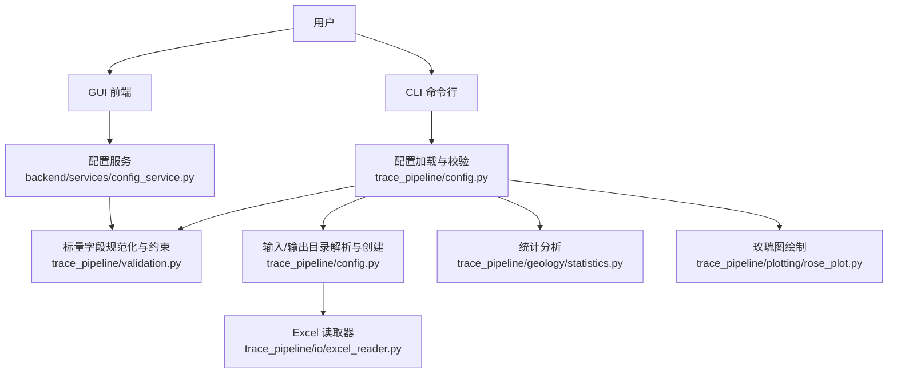
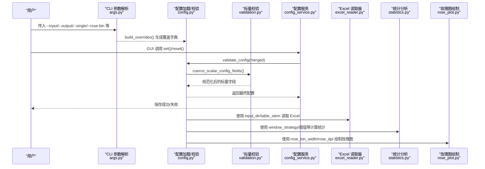
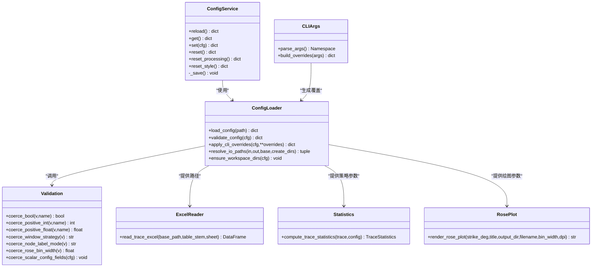

# 配置文件详解

<cite>
**本文引用的文件**   
- [config.example.json](file://config.example.json)
- [trace_pipeline/config.py](file://trace_pipeline/config.py)
- [trace_pipeline/validation.py](file://trace_pipeline/validation.py)
- [backend/services/config_service.py](file://backend/services/config_service.py)
- [trace_pipeline/cli/args.py](file://trace_pipeline/cli/args.py)
- [trace_pipeline/io/excel_reader.py](file://trace_pipeline/io/excel_reader.py)
- [trace_pipeline/geology/statistics.py](file://trace_pipeline/geology/statistics.py)
- [trace_pipeline/plotting/rose_plot.py](file://trace_pipeline/plotting/rose_plot.py)
</cite>

## 目录
1. [简介](#简介)
2. [项目结构](#项目结构)
3. [核心组件](#核心组件)
4. [架构总览](#架构总览)
5. [详细配置项说明](#详细配置项说明)
6. [依赖关系分析](#依赖关系分析)
7. [性能与优化建议](#性能与优化建议)
8. [故障排查指南](#故障排查指南)
9. [结论](#结论)
10. [附录：使用场景示例与最佳实践](#附录使用场景示例与最佳实践)

## 简介
本指南面向 TracePipeline 的配置文件 config.json，提供完整、可操作的使用说明。内容涵盖：
- 所有配置项的数据类型、默认值、取值范围与实际用途
- 按功能模块分组（数据处理、统计分析、绘图输出、性能优化等）
- CLI 覆盖机制与 GUI 读写服务
- 配置校验规则与错误提示
- 不同使用场景的配置示例与最佳实践

## 项目结构
配置文件由后端统一加载、校验与持久化；CLI 支持参数覆盖；GUI 通过服务层进行安全读写。关键路径如下：
- 默认配置文件位置：项目根目录下的 config.json
- 模板参考：config.example.json
- 加载与校验：trace_pipeline/config.py、trace_pipeline/validation.py
- GUI 读写服务：backend/services/config_service.py
- CLI 覆盖映射：trace_pipeline/cli/args.py
- 数据读取与统计、绘图等模块根据配置驱动行为

图表来源
- [trace_pipeline/config.py:86-190](file://trace_pipeline/config.py#L86-L190)
- [trace_pipeline/validation.py:90-112](file://trace_pipeline/validation.py#L90-L112)
- [backend/services/config_service.py:41-144](file://backend/services/config_service.py#L41-L144)
- [trace_pipeline/cli/args.py:11-93](file://trace_pipeline/cli/args.py#L11-L93)
- [trace_pipeline/io/excel_reader.py:36-106](file://trace_pipeline/io/excel_reader.py#L36-L106)
- [trace_pipeline/geology/statistics.py:212-391](file://trace_pipeline/geology/statistics.py#L212-L391)
- [trace_pipeline/plotting/rose_plot.py:106-140](file://trace_pipeline/plotting/rose_plot.py#L106-L140)

章节来源
- [config.example.json:1-26](file://config.example.json#L1-L26)
- [trace_pipeline/config.py:26-80](file://trace_pipeline/config.py#L26-L80)

## 核心组件
- 配置加载与合并：从 JSON 文件加载，缺失时使用默认配置；支持相对路径解析为绝对路径；保留 style 子对象；忽略未知键并记录警告。
- 标量字段规范化：布尔、正整数、正浮点、枚举类字段均做严格校验与转换。
- 工作目录保障：自动创建 input/output/logs 目录（权限异常仅告警）。
- CLI 覆盖：命令行参数可覆盖配置项，再经统一校验流程生效。
- GUI 服务：ConfigService 作为唯一写入入口，提供 reload/get/set/reset/reset_processing/reset_style 等方法，原子写盘避免损坏。

章节来源
- [trace_pipeline/config.py:86-190](file://trace_pipeline/config.py#L86-L190)
- [trace_pipeline/validation.py:26-112](file://trace_pipeline/validation.py#L26-L112)
- [trace_pipeline/config.py:264-312](file://trace_pipeline/config.py#L264-L312)
- [trace_pipeline/cli/args.py:75-93](file://trace_pipeline/cli/args.py#L75-L93)
- [backend/services/config_service.py:41-144](file://backend/services/config_service.py#L41-L144)

## 架构总览
配置在系统中的流转与控制流如下：

图表来源
- [trace_pipeline/cli/args.py:75-93](file://trace_pipeline/cli/args.py#L75-L93)
- [trace_pipeline/config.py:86-190](file://trace_pipeline/config.py#L86-L190)
- [trace_pipeline/validation.py:90-112](file://trace_pipeline/validation.py#L90-L112)
- [backend/services/config_service.py:92-144](file://backend/services/config_service.py#L92-L144)
- [trace_pipeline/io/excel_reader.py:36-106](file://trace_pipeline/io/excel_reader.py#L36-L106)
- [trace_pipeline/geology/statistics.py:212-391](file://trace_pipeline/geology/statistics.py#L212-L391)
- [trace_pipeline/plotting/rose_plot.py:106-140](file://trace_pipeline/plotting/rose_plot.py#L106-L140)

## 详细配置项说明
以下按功能模块分组，列出每个配置项的数据类型、默认值、取值范围与用途。默认值来源于 DEFAULT_CONFIG；取值范围与校验逻辑来源于 validation.py 与相关模块。

### 通用与路径
- input_dir
  - 类型：字符串（路径）
  - 默认值：项目根目录下的 input
  - 取值范围：有效目录路径
  - 用途：迹线表所在输入目录
  - 备注：若未显式指定，会被解析为绝对路径；ensure_workspace_dirs 会确保该目录存在
- output_dir
  - 类型：字符串（路径）
  - 默认值：项目根目录下的 output
  - 取值范围：有效目录路径
  - 用途：结果与图片输出目录
  - 备注：同上，会被解析为绝对路径并确保存在
- output_prefix
  - 类型：字符串
  - 默认值："Outcrop"
  - 取值范围：非空字符串
  - 用途：输出文件名前缀
- table_stem
  - 类型：字符串
  - 默认值："O76_process"
  - 取值范围：非空字符串（当 process_all=False 时必填）
  - 用途：迹线表文件名前缀（不含扩展名），用于定位 .xlsx/.xls
- outcrop
  - 类型：字符串
  - 默认值："O76"
  - 取值范围：非空字符串
  - 用途：露头标识，常用于输出命名或报告标题

章节来源
- [trace_pipeline/config.py:56-80](file://trace_pipeline/config.py#L56-L80)
- [trace_pipeline/config.py:169-189](file://trace_pipeline/config.py#L169-L189)
- [trace_pipeline/config.py:264-312](file://trace_pipeline/config.py#L264-L312)
- [trace_pipeline/io/excel_reader.py:36-106](file://trace_pipeline/io/excel_reader.py#L36-L106)

### 数据处理控制
- process_all
  - 类型：布尔
  - 默认值：True
  - 取值范围：true/false
  - 用途：是否批量处理所有发现的迹线表；False 时仅处理 table_stem 指定的单表
  - 备注：CLI 的 --single 会将其设为 False
- enable_node_recognition
  - 类型：布尔
  - 默认值：False
  - 取值范围：true/false
  - 用途：是否启用节点识别（如端点/交叉点检测）
- node_merge_tolerance
  - 类型：正浮点数
  - 默认值：0.01
  - 取值范围：>0
  - 用途：节点合并容差，单位与坐标一致
- show_node_overlay
  - 类型：布尔
  - 默认值：True
  - 用途：是否在绘图中显示节点叠加层
- node_label_mode
  - 类型：枚举字符串
  - 默认值："type"
  - 取值范围：none/type/id
  - 用途：节点标签显示模式
- min_intersections
  - 类型：正整数
  - 默认值：5
  - 取值范围：>0
  - 用途：最小交点数量阈值（影响某些判定逻辑）

章节来源
- [trace_pipeline/config.py:56-80](file://trace_pipeline/config.py#L56-L80)
- [trace_pipeline/validation.py:26-77](file://trace_pipeline/validation.py#L26-L77)
- [trace_pipeline/validation.py:90-112](file://trace_pipeline/validation.py#L90-L112)
- [trace_pipeline/cli/args.py:75-93](file://trace_pipeline/cli/args.py#L75-L93)

### 统计分析配置
- window_strategy
  - 类型：枚举字符串
  - 默认值："auto"
  - 取值范围：auto/tangent/hybrid/concentric
  - 用途：圆窗策略，影响面积与密度估计方法
- auto_density_threshold
  - 类型：正浮点数
  - 默认值：5.0
  - 取值范围：>0
  - 用途：自适应密度阈值（参与窗口选择/评分）
- tangent_window_count
  - 类型：正整数
  - 默认值：3
  - 取值范围：>0
  - 用途：切线窗计数参数（配合特定策略）

章节来源
- [trace_pipeline/config.py:56-80](file://trace_pipeline/config.py#L56-L80)
- [trace_pipeline/validation.py:63-104](file://trace_pipeline/validation.py#L63-L104)
- [trace_pipeline/geology/statistics.py:212-391](file://trace_pipeline/geology/statistics.py#L212-L391)

### 绘图输出配置
- export_rose_plot
  - 类型：布尔
  - 默认值：False
  - 取值范围：true/false
  - 用途：是否导出玫瑰花瓣图
- rose_bin_width
  - 类型：正浮点数
  - 默认值：10.0
  - 取值范围：(0, 180]
  - 用途：玫瑰图分箱宽度（度）
- rose_dpi
  - 类型：正整数
  - 默认值：600
  - 取值范围：>0
  - 用途：玫瑰图输出 DPI
- trace_dpi
  - 类型：正整数
  - 默认值：600
  - 取值范围：>0
  - 用途：迹线图输出 DPI
- rotated_trace_dpi
  - 类型：正整数
  - 默认值：600
  - 取值范围：>0
  - 用途：旋转后迹线图输出 DPI
- style
  - 类型：对象（字典）
  - 默认值：{}
  - 用途：样式配置（保持原样，不参与标量校验）

章节来源
- [trace_pipeline/config.py:56-80](file://trace_pipeline/config.py#L56-L80)
- [trace_pipeline/validation.py:79-104](file://trace_pipeline/validation.py#L79-L104)
- [trace_pipeline/plotting/rose_plot.py:106-140](file://trace_pipeline/plotting/rose_plot.py#L106-L140)

### 性能与运行模式
- parallel_workers
  - 类型：非负整数
  - 默认值：0
  - 取值范围：>=0
  - 用途：并行线程数；0 表示串行
- is_dev_mode
  - 类型：布尔
  - 默认值：False
  - 用途：开发模式开关（可能影响日志/调试行为）

章节来源
- [trace_pipeline/config.py:56-80](file://trace_pipeline/config.py#L56-L80)
- [trace_pipeline/validation.py:90-112](file://trace_pipeline/validation.py#L90-L112)

## 依赖关系分析
- 配置加载与校验
  - load_config 负责读取 JSON、基础格式检查、路径基准确定与 validate_config 调用
  - validate_config 负责合并默认值、必填项检查、标量字段规范化、路径解析
  - ensure_workspace_dirs 负责创建 input/output/logs 目录
- CLI 覆盖
  - parse_args 定义支持的 CLI 选项
  - build_overrides 将 CLI 选项映射为配置覆盖项
  - apply_cli_overrides 将覆盖项合并到配置并重新校验
- GUI 服务
  - ConfigService 封装了 reload/get/set/reset/reset_processing/reset_style/_save
  - _save 采用临时文件+替换的原子写入策略，防止中断导致配置损坏
- 下游模块依赖
  - excel_reader 依赖 input_dir 与 table_stem 定位数据文件
  - statistics 依赖 window_strategy、auto_density_threshold、tangent_window_count 等
  - rose_plot 依赖 rose_bin_width、rose_dpi 等

图表来源
- [backend/services/config_service.py:41-144](file://backend/services/config_service.py#L41-L144)
- [trace_pipeline/config.py:86-190](file://trace_pipeline/config.py#L86-L190)
- [trace_pipeline/validation.py:26-112](file://trace_pipeline/validation.py#L26-L112)
- [trace_pipeline/cli/args.py:11-93](file://trace_pipeline/cli/args.py#L11-L93)
- [trace_pipeline/io/excel_reader.py:36-106](file://trace_pipeline/io/excel_reader.py#L36-L106)
- [trace_pipeline/geology/statistics.py:212-391](file://trace_pipeline/geology/statistics.py#L212-L391)
- [trace_pipeline/plotting/rose_plot.py:106-140](file://trace_pipeline/plotting/rose_plot.py#L106-L140)

## 性能与优化建议
- 并行处理
  - 合理设置 parallel_workers；对于大批量任务可适当增加线程数，但需考虑磁盘 I/O 与内存占用
- 图像输出质量
  - rose_dpi/trace_dpi/rotated_trace_dpi 越高，图像越清晰，但体积越大、耗时越长；建议在预览阶段使用较低 DPI，最终出图再提高
- 玫瑰图分箱
  - rose_bin_width 越小，细节越多，但噪声也更多；一般 5–20 度之间较为常用
- 圆窗策略
  - window_strategy="auto" 适合大多数情况；对复杂几何或特殊需求可尝试 "tangent"/"hybrid"/"concentric"
- 节点识别
  - enable_node_recognition 开启会增加计算开销，仅在需要节点标注或叠加时启用
- 工作目录
  - 确保 input/output/logs 有足够空间与写入权限；必要时在部署脚本中预先创建

[本节为通用指导，不直接分析具体文件]

## 故障排查指南
- 配置文件不存在
  - 现象：报错“指定的配置文件不存在”
  - 原因：显式指定了 --config 路径但该文件不存在
  - 解决：确认路径正确，或移除 --config 以使用默认位置
- 配置文件不是合法 JSON
  - 现象：报错“配置文件不是合法 JSON”
  - 原因：JSON 语法错误（如多余逗号、引号不匹配）
  - 解决：修复 JSON 语法或使用模板文件对照
- 缺少必要配置字段
  - 现象：报错“缺少必要配置字段”
  - 原因：未填写 input_dir/output_dir/outcrop；或在 process_all=False 时未填 table_stem
  - 解决：补齐必填项
- 未知配置项被忽略
  - 现象：日志警告“忽略未知配置项”
  - 原因：配置中包含不在默认白名单中的键
  - 解决：删除或修正为已知键
- 标量字段校验失败
  - 现象：报错“必须为正整数/正数/布尔值”或“必须在 (0, 180] 范围内”
  - 原因：数值类型或范围不符合要求
  - 解决：调整至合法范围
- 目录创建失败
  - 现象：日志警告“无权限创建目录/创建目录失败”，程序继续运行
  - 原因：目标目录不可写或父目录不存在且无法创建
  - 解决：赋予写入权限或手动创建目录
- Excel 读取失败
  - 现象：报错“未找到 .xlsx 或 .xls”或“Excel 文件过大/读取失败”
  - 原因：文件名不匹配、sheet 不存在、文件过大或格式错误
  - 解决：确认 table_stem 与扩展名；检查 sheet 名称；拆分大文件或降低行数

章节来源
- [trace_pipeline/config.py:102-145](file://trace_pipeline/config.py#L102-L145)
- [trace_pipeline/config.py:169-190](file://trace_pipeline/config.py#L169-L190)
- [trace_pipeline/validation.py:26-87](file://trace_pipeline/validation.py#L26-L87)
- [trace_pipeline/config.py:288-312](file://trace_pipeline/config.py#L288-L312)
- [trace_pipeline/io/excel_reader.py:66-106](file://trace_pipeline/io/excel_reader.py#L66-L106)

## 结论
TracePipeline 的配置文件体系以“默认值 + 严格校验 + 灵活覆盖”为核心设计，既保证易用性，又兼顾健壮性与可扩展性。通过 CLI 覆盖与 GUI 服务，用户可在不同场景下快速调整行为；同时，完善的错误提示与日志有助于快速定位问题。

[本节为总结，不直接分析具体文件]

## 附录：使用场景示例与最佳实践

### 场景一：CLI 批量处理
- 适用条件：需要一次性处理多个迹线表
- 推荐配置要点
  - process_all=true
  - input_dir 指向包含多张表的目录
  - output_dir 指向结果输出目录
  - export_rose_plot=false（批量时可关闭以提升速度）
  - rose_dpi/trace_dpi 适当降低以减少 I/O 压力
  - parallel_workers 设置为大于 0 的值以启用并行
- CLI 覆盖示例（概念性描述）
  - 使用 --input 与 --output 覆盖路径
  - 使用 --single 切换为单文件模式
  - 使用 --rose-bin 与 --rose-dpi 覆盖玫瑰图参数
  - 使用 --window-strategy 指定圆窗策略
  - 使用 --parallel N 设置并行线程数

章节来源
- [trace_pipeline/cli/args.py:11-93](file://trace_pipeline/cli/args.py#L11-L93)
- [trace_pipeline/config.py:251-258](file://trace_pipeline/config.py#L251-L258)

### 场景二：GUI 交互式分析
- 适用条件：需要在界面中逐步调整参数并查看结果
- 推荐配置要点
  - 使用 GUI 的“重置处理参数”恢复默认值，便于对比实验
  - 按需开启 enable_node_recognition 与 show_node_overlay
  - 使用 style 自定义外观（颜色、字体等）
  - 在预览阶段使用较低的 DPI，最终导出时提高 DPI
- 注意事项
  - 所有修改通过 ConfigService.set 写入，确保原子性与一致性
  - 使用 reset_style 仅清空样式，保留其他设置

章节来源
- [backend/services/config_service.py:110-126](file://backend/services/config_service.py#L110-L126)
- [backend/services/config_service.py:128-144](file://backend/services/config_service.py#L128-L144)

### 场景三：高性能计算
- 适用条件：大规模数据批处理，追求吞吐
- 推荐配置要点
  - parallel_workers 设置为合适的线程数（结合 CPU 核数与磁盘 I/O）
  - export_rose_plot=false 或延迟到最终阶段
  - rose_bin_width 适中（如 10 度），避免过细导致计算量增大
  - window_strategy="auto" 通常具备良好鲁棒性
  - 确保 input/output/logs 目录位于高速存储介质上
- 监控与调优
  - 关注日志中的“自动创建目录”“配置已重新加载”等信息
  - 若出现 I/O 瓶颈，考虑分批处理或提升磁盘带宽

章节来源
- [trace_pipeline/config.py:264-312](file://trace_pipeline/config.py#L264-L312)
- [trace_pipeline/validation.py:90-112](file://trace_pipeline/validation.py#L90-L112)

### 配置模板与最佳实践
- 模板来源
  - 复制 config.example.json 为 config.json 后按需修改
- 最佳实践
  - 始终保留必填项 input_dir/output_dir/outcrop
  - 在 process_all=false 时务必设置 table_stem
  - 使用 CLI 覆盖进行临时调整，避免频繁编辑 JSON
  - 定期使用 GUI 的“重置处理参数”回归基线
  - 对未知键保持谨慎，避免误用导致被忽略

章节来源
- [config.example.json:1-26](file://config.example.json#L1-L26)
- [trace_pipeline/config.py:169-190](file://trace_pipeline/config.py#L169-L190)