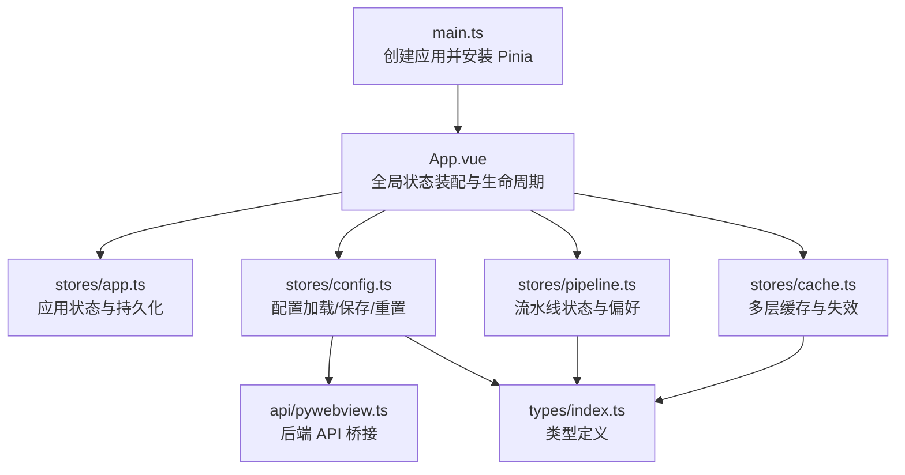
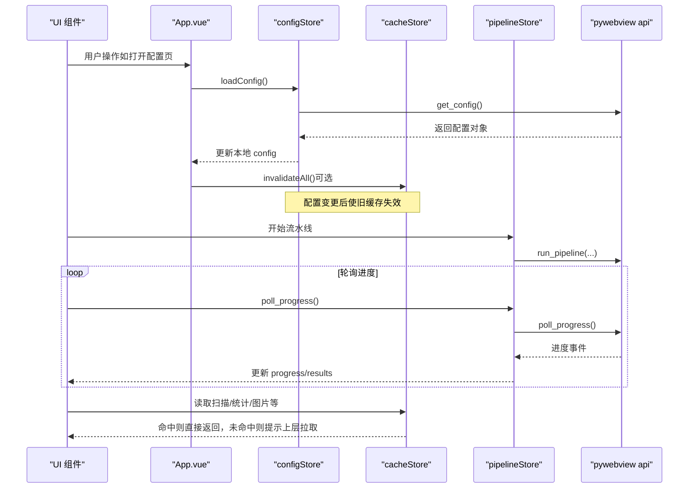
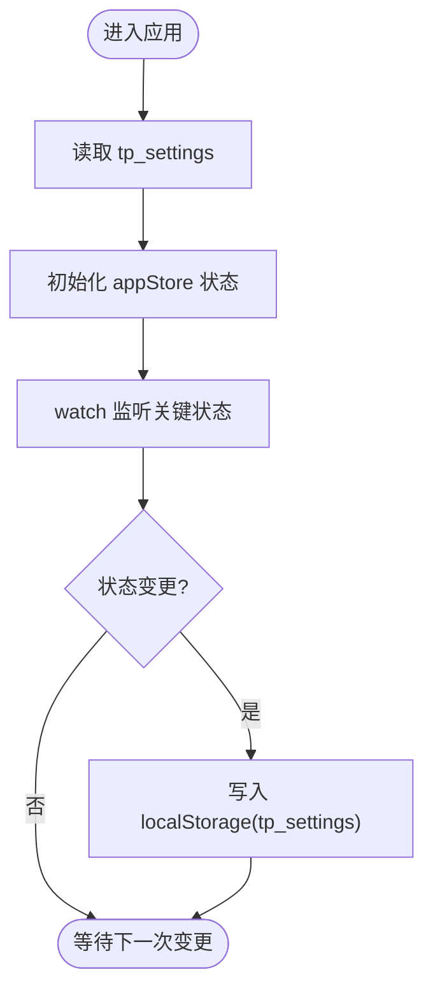
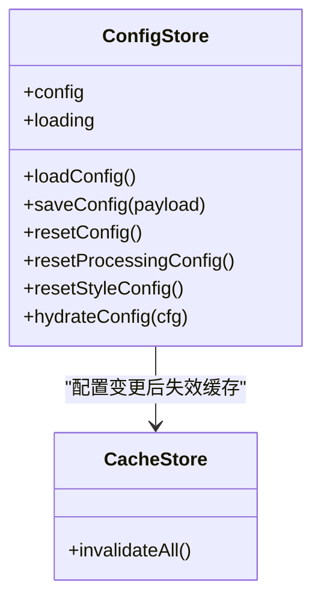
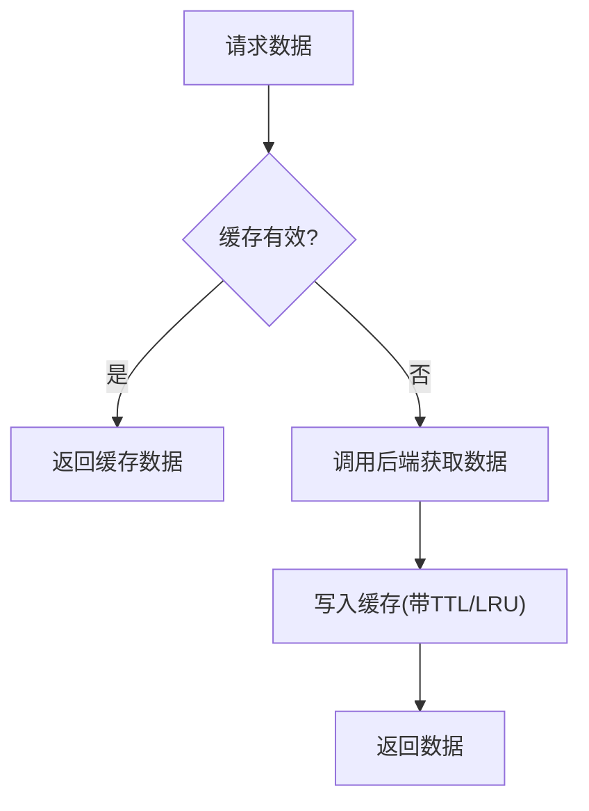
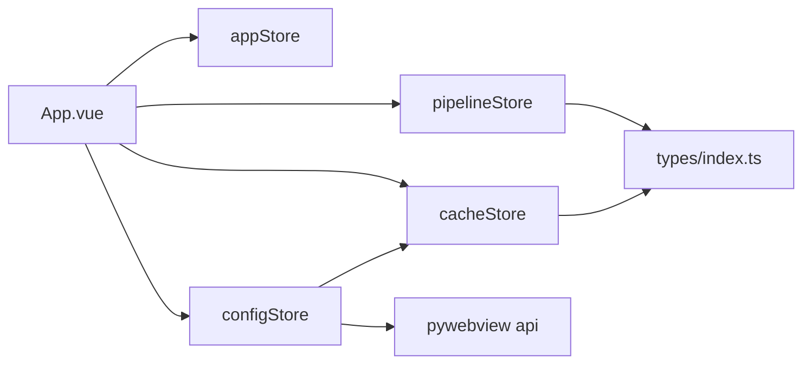

# Pinia 状态管理

<cite>
**本文引用的文件**
- [frontend/src/stores/app.ts](file://frontend/src/stores/app.ts)
- [frontend/src/stores/config.ts](file://frontend/src/stores/config.ts)
- [frontend/src/stores/pipeline.ts](file://frontend/src/stores/pipeline.ts)
- [frontend/src/stores/cache.ts](file://frontend/src/stores/cache.ts)
- [frontend/src/api/pywebview.ts](file://frontend/src/api/pywebview.ts)
- [frontend/src/types/index.ts](file://frontend/src/types/index.ts)
- [frontend/src/main.ts](file://frontend/src/main.ts)
- [frontend/src/App.vue](file://frontend/src/App.vue)
- [frontend/src/views/ConfigView.vue](file://frontend/src/views/ConfigView.vue)
- [frontend/src/components/DevPanel.vue](file://frontend/src/components/DevPanel.vue)
</cite>

## 目录
1. [简介](#简介)
2. [项目结构](#项目结构)
3. [核心组件](#核心组件)
4. [架构总览](#架构总览)
5. [详细组件分析](#详细组件分析)
6. [依赖关系分析](#依赖关系分析)
7. [性能考虑](#性能考虑)
8. [故障排查指南](#故障排查指南)
9. [结论](#结论)
10. [附录](#附录)

## 简介
本文件系统性梳理前端基于 Pinia 的状态管理方案，围绕四个 store 的职责划分与数据流向展开：
- appStore：应用级状态（窗口控制、输入输出目录、当前页面、运行状态等）
- configStore：配置管理（从后端加载/保存配置，并触发缓存失效）
- pipelineStore：流水线执行状态（运行中标志、进度、结果列表、上次运行偏好）
- cacheStore：多层缓存（扫描结果、统计数据、对比数据、结果列表、图片与缩略图），结合 TTL 与 LRU 策略

文档同时覆盖 state/getters/actions 设计模式、跨 store 通信机制、持久化策略（localStorage/sessionStorage + 内存 Map）、调试技巧、性能监控方法以及状态迁移与版本兼容性处理建议。

## 项目结构
Pinia 在应用启动时通过 createPinia() 注册，随后各模块按需引入对应 store。关键入口与初始化流程如下：
- main.ts 创建 Vue 应用并安装 Pinia
- App.vue 作为根组件，负责全局状态装配、窗口控制、引导流程与跨 store 协作
- 各视图与组件按需引入并使用相应 store



图表来源
- [frontend/src/main.ts:1-88](file://frontend/src/main.ts#L1-L88)
- [frontend/src/App.vue:150-210](file://frontend/src/App.vue#L150-L210)
- [frontend/src/stores/app.ts:1-57](file://frontend/src/stores/app.ts#L1-L57)
- [frontend/src/stores/config.ts:1-80](file://frontend/src/stores/config.ts#L1-L80)
- [frontend/src/stores/pipeline.ts:1-56](file://frontend/src/stores/pipeline.ts#L1-L56)
- [frontend/src/stores/cache.ts:1-120](file://frontend/src/stores/cache.ts#L1-L120)
- [frontend/src/api/pywebview.ts:1-120](file://frontend/src/api/pywebview.ts#L1-L120)
- [frontend/src/types/index.ts:1-167](file://frontend/src/types/index.ts#L1-L167)

章节来源
- [frontend/src/main.ts:1-88](file://frontend/src/main.ts#L1-L88)
- [frontend/src/App.vue:150-210](file://frontend/src/App.vue#L150-L210)

## 核心组件
本节概述四个 store 的核心职责与交互方式。

- appStore
  - 职责：维护输入/输出目录、当前页面、开发模式开关、最近操作时间、选中文件数、流水线状态；将部分设置持久化到 localStorage
  - 关键点：使用 watch 监听关键状态变化并落盘；提供 setDirs、updateLastOperation 等动作
- configStore
  - 职责：封装配置的加载、保存、重置（全部/仅处理/仅样式）；成功后调用 cacheStore.invalidateAll() 使相关缓存失效
  - 关键点：提供 hydrateConfig 用于“只更新本地状态不触发持久化”的场景
- pipelineStore
  - 职责：维护 running、progress、results；记录上次运行的节点识别与玫瑰图导出偏好，并持久化到 localStorage
  - 关键点：提供 reset、setLastRunConfig 等方法
- cacheStore
  - 职责：实现多层缓存（TTL + LRU），包括扫描结果、统计数据、对比数据、结果列表、图片与缩略图；提供统计指标与全量失效能力
  - 关键点：sessionStorage 与内存 Map 混合；按 key 维度失效与全量失效；提供 onPipelineComplete 统一清理

章节来源
- [frontend/src/stores/app.ts:1-57](file://frontend/src/stores/app.ts#L1-L57)
- [frontend/src/stores/config.ts:1-80](file://frontend/src/stores/config.ts#L1-L80)
- [frontend/src/stores/pipeline.ts:1-56](file://frontend/src/stores/pipeline.ts#L1-L56)
- [frontend/src/stores/cache.ts:1-120](file://frontend/src/stores/cache.ts#L1-L120)

## 架构总览
下图展示跨 store 的协作与数据流：UI 层通过 store 访问状态，configStore 与后端 API 交互，pipelineStore 驱动运行态，cacheStore 提供高性能读取与失效。



图表来源
- [frontend/src/App.vue:170-210](file://frontend/src/App.vue#L170-L210)
- [frontend/src/stores/config.ts:14-35](file://frontend/src/stores/config.ts#L14-L35)
- [frontend/src/stores/pipeline.ts:22-55](file://frontend/src/stores/pipeline.ts#L22-L55)
- [frontend/src/stores/cache.ts:388-416](file://frontend/src/stores/cache.ts#L388-L416)
- [frontend/src/api/pywebview.ts:294-337](file://frontend/src/api/pywebview.ts#L294-L337)

## 详细组件分析

### appStore 应用状态管理
- 状态字段
  - inputDir/outputDir：输入/输出目录
  - currentPage：当前路由页签
  - isDevMode：开发模式开关
  - lastOperationTime：最近一次操作时间
  - selectedFileCount：选中文件数量
  - pipelineStatus：流水线状态（idle/running/completed/error）
- 计算属性与副作用
  - 使用 watch 监听 currentPage 等关键状态，自动写入 localStorage 中的 tp_settings
- 动作
  - setDirs(input, output)：批量设置目录
  - updateLastOperation(action?)：记录最近操作时间与描述
- 典型用法
  - 在 App.vue 初始化阶段根据后端配置回填 inputDir/outputDir
  - 在配置页保存后同步更新 appStore 的目录字段



图表来源
- [frontend/src/stores/app.ts:6-20](file://frontend/src/stores/app.ts#L6-L20)
- [frontend/src/stores/app.ts:42-49](file://frontend/src/stores/app.ts#L42-L49)
- [frontend/src/App.vue:175-195](file://frontend/src/App.vue#L175-L195)

章节来源
- [frontend/src/stores/app.ts:1-57](file://frontend/src/stores/app.ts#L1-L57)
- [frontend/src/App.vue:175-195](file://frontend/src/App.vue#L175-L195)

### configStore 配置管理
- 状态字段
  - config：当前配置快照
  - loading：是否加载中
- 动作
  - loadConfig()：从后端获取配置并更新本地
  - saveConfig(payload)：保存配置并触发缓存失效
  - resetConfig()/resetProcessingConfig()/resetStyleConfig()：不同粒度的重置
  - hydrateConfig(cfg)：仅更新本地状态（不触发持久化），用于首次引导或外部注入
- 跨 store 通信
  - 内部调用 useCacheStore().invalidateAll()，确保配置变更后旧缓存失效



图表来源
- [frontend/src/stores/config.ts:6-79](file://frontend/src/stores/config.ts#L6-L79)
- [frontend/src/stores/cache.ts:388-397](file://frontend/src/stores/cache.ts#L388-L397)

章节来源
- [frontend/src/stores/config.ts:1-80](file://frontend/src/stores/config.ts#L1-L80)
- [frontend/src/views/ConfigView.vue:62-75](file://frontend/src/views/ConfigView.vue#L62-L75)
- [frontend/src/components/DevPanel.vue:359-373](file://frontend/src/components/DevPanel.vue#L359-L373)

### pipelineStore 流水线状态
- 状态字段
  - running：是否正在运行
  - progress：{ current, total, filename, message }
  - results：结果列表
  - lastEnableNodeRecognition / lastExportRosePlot：上次运行偏好
- 计算属性
  - isRunning：对外暴露运行态
- 动作
  - reset()：清空运行态与结果
  - setLastRunConfig(enableNode, exportRose)：保存偏好并持久化到 localStorage
- 典型用法
  - 在 App.vue 或其他视图中驱动 run_pipeline 与 poll_progress，并更新 pipelineStore

```mermaid
sequenceDiagram
participant UI as "UI"
participant Pipeline as "pipelineStore"
participant API as "pywebview api"
UI->>Pipeline : setLastRunConfig(...)
UI->>Pipeline : running=true; progress=初始值
UI->>API : run_pipeline(targets, config)
loop 轮询
UI->>Pipeline : poll_progress()
Pipeline->>API : poll_progress()
API-->>Pipeline : 进度事件
Pipeline-->>UI : 更新 progress/results
end
UI->>Pipeline : reset()可选
```

图表来源
- [frontend/src/stores/pipeline.ts:22-55](file://frontend/src/stores/pipeline.ts#L22-L55)
- [frontend/src/api/pywebview.ts:302-304](file://frontend/src/api/pywebview.ts#L302-L304)

章节来源
- [frontend/src/stores/pipeline.ts:1-56](file://frontend/src/stores/pipeline.ts#L1-L56)

### cacheStore 数据缓存
- 缓存层级与存储介质
  - scan：TTL 30s，sessionStorage
  - stats：TTL 5min，内存 Map，LRU（最大 100）
  - comparison：TTL 5min，sessionStorage
  - results：TTL 5s，sessionStorage
  - image/thumbnail：TTL 10min，内存 Map，LRU + 字符预算上限
- 数据结构
  - 通用 CachedItem<T> = { data, timestamp }
  - 各类条目：ScanEntry、StatsResult、ComparisonEntry、ResultEntry
- 核心方法
  - 扫描：getScan/setScan/isScanValid
  - 统计：getStats/setStats（含 LRU 移动与淘汰）
  - 对比：getComparison/setComparison/isComparisonValid
  - 结果：getResults/setResults/isResultsValid
  - 图片：imageKey/getImage/setImage/getThumbnail/setThumbnail
  - 失效：invalidateScan/invalidateStats/invalidateComparison/invalidateResults/invalidateImages/invalidateThumbnails/invalidateAll/onPipelineComplete
  - 统计：getImageCacheStats（命中率、大小、阈值等）
- 复杂度与优化
  - LRU 通过 Map 插入顺序模拟，get 命中时 delete+set 移至末尾；淘汰时取 keys().next()
  - 图片缓存额外进行同路径旧版本清理与字符预算修剪，避免内存膨胀



图表来源
- [frontend/src/stores/cache.ts:111-176](file://frontend/src/stores/cache.ts#L111-L176)
- [frontend/src/stores/cache.ts:257-308](file://frontend/src/stores/cache.ts#L257-L308)
- [frontend/src/stores/cache.ts:388-416](file://frontend/src/stores/cache.ts#L388-L416)

章节来源
- [frontend/src/stores/cache.ts:1-418](file://frontend/src/stores/cache.ts#L1-L418)

## 依赖关系分析
- 模块耦合
  - configStore 依赖 api/pywebview.ts 与 cacheStore
  - App.vue 聚合多个 store，协调初始化与窗口控制
  - pipelineStore 与 types/index.ts 的类型紧密绑定
  - cacheStore 独立性强，被多处消费（配置页、数据页、对比页等）
- 外部依赖
  - pywebview.api：桌面端 WebView2 环境下的后端桥接；浏览器环境回退为 mockApi
- 潜在循环依赖
  - 当前无显式循环引用；store 间通过函数调用解耦



图表来源
- [frontend/src/App.vue:150-210](file://frontend/src/App.vue#L150-L210)
- [frontend/src/stores/config.ts:1-80](file://frontend/src/stores/config.ts#L1-L80)
- [frontend/src/stores/pipeline.ts:1-56](file://frontend/src/stores/pipeline.ts#L1-L56)
- [frontend/src/stores/cache.ts:1-120](file://frontend/src/stores/cache.ts#L1-L120)
- [frontend/src/api/pywebview.ts:1-120](file://frontend/src/api/pywebview.ts#L1-L120)
- [frontend/src/types/index.ts:1-167](file://frontend/src/types/index.ts#L1-L167)

章节来源
- [frontend/src/App.vue:150-210](file://frontend/src/App.vue#L150-L210)
- [frontend/src/stores/config.ts:1-80](file://frontend/src/stores/config.ts#L1-L80)
- [frontend/src/stores/pipeline.ts:1-56](file://frontend/src/stores/pipeline.ts#L1-L56)
- [frontend/src/stores/cache.ts:1-120](file://frontend/src/stores/cache.ts#L1-L120)
- [frontend/src/api/pywebview.ts:1-120](file://frontend/src/api/pywebview.ts#L1-L120)
- [frontend/src/types/index.ts:1-167](file://frontend/src/types/index.ts#L1-L167)

## 性能考虑
- 缓存命中率与容量
  - 使用 cacheStore.getImageCacheStats() 监控图片/缩略图的命中率、条目数与字符占用，关注接近阈值的场景
- LRU 与 TTL 平衡
  - 对热点 outcrop 的统计数据采用 LRU 提升命中率；对频繁变化的结果列表采用短 TTL 快速感知外部变更
- 内存预算
  - 图片与缩略图缓存具备字符预算上限，超过阈值会优先淘汰最久未使用的条目，防止内存暴涨
- 渲染与重计算
  - 合理拆分 getters 与 actions，避免在高频更新的 state 上触发不必要的重渲染
- 网络与 I/O
  - 在配置变更后主动失效相关缓存，减少无效请求；对大体积资源（图片）优先走缓存

[本节为通用指导，无需特定文件来源]

## 故障排查指南
- 配置无法生效
  - 检查 configStore.saveConfig 是否成功，确认已调用 cacheStore.invalidateAll()
  - 查看 DevPanel 的高级配置保存与重置逻辑是否正确
- 缓存未更新
  - 确认对应 invalidate* 方法是否被调用（例如配置变更后）
  - 检查 TTL 是否过短导致频繁失效
- 图片加载缓慢
  - 通过 getImageCacheStats 观察命中率与字符占用，必要时调整 IMAGE_MAX_CHARS 或 THUMBNAIL_MAX_CHARS
- 流水线状态异常
  - 检查 pipelineStore.running 与 progress 更新链路，确认 poll_progress 轮询是否正常
- 持久化丢失
  - 检查 localStorage/sessionStorage 是否可用；注意 appStore 与 pipelineStore 的键名与写入时机

章节来源
- [frontend/src/components/DevPanel.vue:359-409](file://frontend/src/components/DevPanel.vue#L359-L409)
- [frontend/src/stores/config.ts:25-35](file://frontend/src/stores/config.ts#L25-L35)
- [frontend/src/stores/cache.ts:388-416](file://frontend/src/stores/cache.ts#L388-L416)
- [frontend/src/stores/pipeline.ts:22-55](file://frontend/src/stores/pipeline.ts#L22-L55)

## 结论
本项目以 Pinia 为核心构建清晰的前端状态分层：应用级状态、配置管理、流水线运行态与多层缓存各司其职。通过合理的持久化策略（localStorage/sessionStorage + 内存 Map）、TTL/LRU 组合与统一的失效接口，系统在可维护性与性能之间取得良好平衡。配合完善的调试与监控手段，可有效支撑复杂业务场景的稳定运行。

[本节为总结性内容，无需特定文件来源]

## 附录

### 状态持久化策略
- localStorage
  - appStore：tp_settings（包含 inputDir、outputDir、currentPage、lastOperationTime 等）
  - pipelineStore：tp_last_export_rose_plot、tp_last_enable_node_recognition
- sessionStorage
  - cacheStore：tp_cache_scan、tp_cache_comparison、tp_cache_results
- 内存 Map
  - cacheStore：statsCache、imageCache、thumbnailCache（LRU + 字符预算）

章节来源
- [frontend/src/stores/app.ts:6-20](file://frontend/src/stores/app.ts#L6-L20)
- [frontend/src/stores/pipeline.ts:16-20](file://frontend/src/stores/pipeline.ts#L16-L20)
- [frontend/src/stores/cache.ts:81-120](file://frontend/src/stores/cache.ts#L81-L120)

### 跨 store 通信机制
- 直接调用：configStore 内部调用 useCacheStore().invalidateAll()
- 事件/回调：App.vue 在引导完成后调用 configStore.hydrateConfig 并同步 appStore 的目录字段
- 共享类型：types/index.ts 为多 store 提供统一的数据契约

章节来源
- [frontend/src/stores/config.ts:10-12](file://frontend/src/stores/config.ts#L10-L12)
- [frontend/src/App.vue:184-195](file://frontend/src/App.vue#L184-L195)
- [frontend/src/types/index.ts:1-167](file://frontend/src/types/index.ts#L1-L167)

### 状态调试技巧
- 使用 DevPanel 查看与修改高级配置，验证配置持久化与缓存失效
- 通过 cacheStore.getImageCacheStats() 输出缓存命中率与容量信息
- 在 App.vue 中打印 appStore.pipelineStatus 与 pipelineStore.progress 辅助定位问题

章节来源
- [frontend/src/components/DevPanel.vue:210-230](file://frontend/src/components/DevPanel.vue#L210-L230)
- [frontend/src/stores/cache.ts:337-350](file://frontend/src/stores/cache.ts#L337-L350)
- [frontend/src/App.vue:215-222](file://frontend/src/App.vue#L215-L222)

### 性能监控方法
- 缓存指标
  - 命中率：imageCacheHits/imageCacheMisses、thumbnailCacheHits/thumbnailCacheMisses
  - 容量：imageCacheChars/thumbnailCacheChars 与各自上限
- 流水线指标
  - progress.current/total 与 message 用于评估吞吐与卡顿点
- 配置变更影响
  - 记录 saveConfig 前后缓存命中率变化，评估失效范围是否合理

章节来源
- [frontend/src/stores/cache.ts:121-128](file://frontend/src/stores/cache.ts#L121-L128)
- [frontend/src/stores/cache.ts:337-350](file://frontend/src/stores/cache.ts#L337-L350)
- [frontend/src/stores/pipeline.ts:24-29](file://frontend/src/stores/pipeline.ts#L24-L29)

### 状态迁移与版本兼容性
- 键名演进
  - 当新增或重命名持久化键（如 tp_settings 字段扩展）时，建议在加载时做兼容处理：缺失字段使用默认值
- 缓存版本化
  - 为缓存项增加 version 字段或在 key 中包含版本号，便于在升级后区分新旧数据
- 渐进式迁移
  - 在首次启动或检测到版本差异时，执行一次性迁移脚本，将旧格式转换为新格式，并保留回滚能力
- 向后兼容
  - 在读取配置时允许缺失字段，提供默认值；在写入时遵循最新 schema，避免破坏旧客户端

[本节为通用指导，无需特定文件来源]