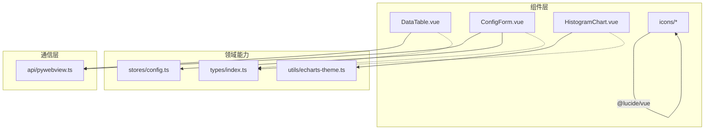
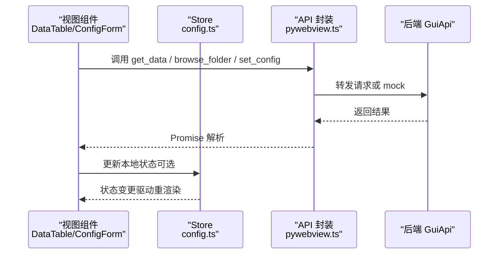
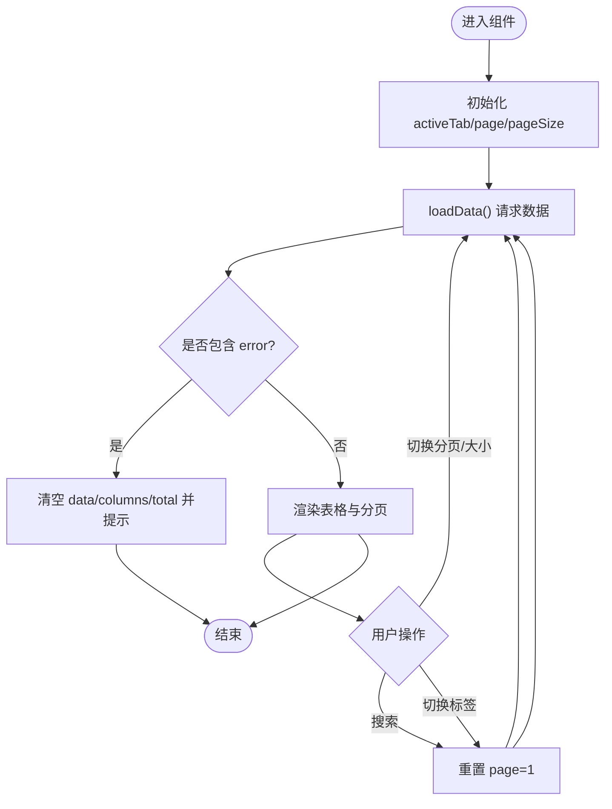
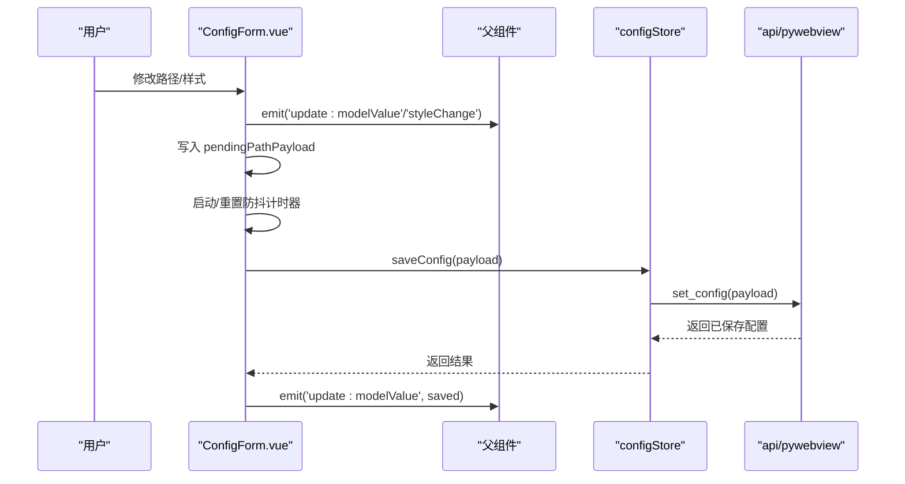
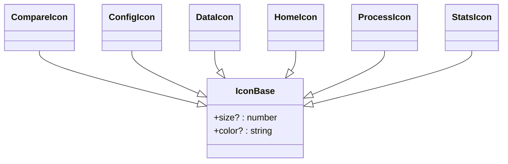
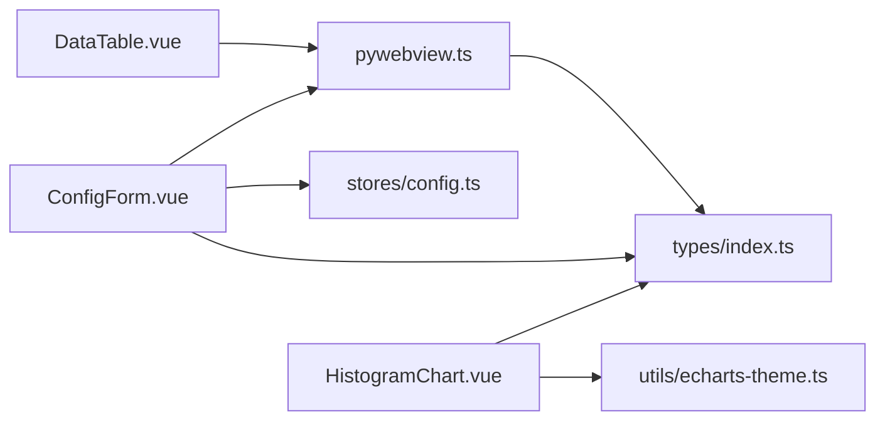

# Vue 3 组件开发

<cite>
**本文引用的文件**   
- [DataTable.vue](file://frontend/src/components/DataTable.vue)
- [ConfigForm.vue](file://frontend/src/components/ConfigForm.vue)
- [HistogramChart.vue](file://frontend/src/components/HistogramChart.vue)
- [CompareIcon.vue](file://frontend/src/components/icons/CompareIcon.vue)
- [ConfigIcon.vue](file://frontend/src/components/icons/ConfigIcon.vue)
- [DataIcon.vue](file://frontend/src/components/icons/DataIcon.vue)
- [HomeIcon.vue](file://frontend/src/components/icons/HomeIcon.vue)
- [ProcessIcon.vue](file://frontend/src/components/icons/ProcessIcon.vue)
- [StatsIcon.vue](file://frontend/src/components/icons/StatsIcon.vue)
- [echarts-theme.ts](file://frontend/src/utils/echarts-theme.ts)
- [index.ts](file://frontend/src/types/index.ts)
- [config.ts](file://frontend/src/stores/config.ts)
- [pywebview.ts](file://frontend/src/api/pywebview.ts)
</cite>

## 目录
1. [简介](#简介)
2. [项目结构](#项目结构)
3. [核心组件](#核心组件)
4. [架构总览](#架构总览)
5. [详细组件分析](#详细组件分析)
6. [依赖关系分析](#依赖关系分析)
7. [性能考量](#性能考量)
8. [故障排查指南](#故障排查指南)
9. [结论](#结论)
10. [附录](#附录)

## 简介
本指南面向 TracePipeline 前端（Vue 3 + TypeScript）的组件开发，聚焦组合式 API 的最佳实践、自定义组件规范与核心业务组件实现。重点覆盖：
- 组合式 API：ref、reactive、computed、watch 的使用模式与注意事项
- 自定义组件：props 定义、事件发射、插槽使用
- 核心组件：DataTable 数据表格（分页）、ConfigForm 配置表单（自动保存与样式同步）、HistogramChart 图表（ECharts 集成）
- 图标系统：基于 Lucide 的统一封装
- 测试策略与性能优化
- 响应式设计与移动端适配

## 项目结构
前端采用按功能域组织的目录结构：
- components：业务与通用 UI 组件
- icons：Lucide 图标封装
- utils：工具函数（如 ECharts 主题）
- stores：Pinia 状态管理
- api：后端桥接封装（pywebview）
- types：类型定义
- views：页面级视图



图示来源
- [DataTable.vue:1-199](file://frontend/src/components/DataTable.vue#L1-L199)
- [ConfigForm.vue:1-411](file://frontend/src/components/ConfigForm.vue#L1-L411)
- [HistogramChart.vue:1-81](file://frontend/src/components/HistogramChart.vue#L1-L81)
- [config.ts:1-80](file://frontend/src/stores/config.ts#L1-L80)
- [echarts-theme.ts:1-140](file://frontend/src/utils/echarts-theme.ts#L1-L140)
- [pywebview.ts:1-337](file://frontend/src/api/pywebview.ts#L1-L337)

章节来源
- [DataTable.vue:1-199](file://frontend/src/components/DataTable.vue#L1-L199)
- [ConfigForm.vue:1-411](file://frontend/src/components/ConfigForm.vue#L1-L411)
- [HistogramChart.vue:1-81](file://frontend/src/components/HistogramChart.vue#L1-L81)
- [pywebview.ts:1-337](file://frontend/src/api/pywebview.ts#L1-L337)
- [config.ts:1-80](file://frontend/src/stores/config.ts#L1-L80)
- [echarts-theme.ts:1-140](file://frontend/src/utils/echarts-theme.ts#L1-L140)

## 核心组件
本节概述三个关键组件的职责与交互方式：
- DataTable：负责输出/输入数据的分页展示与搜索，通过 API 获取数据并渲染表格
- ConfigForm：双向绑定配置项，支持路径浏览、样式实时预览与自动保存
- HistogramChart：基于 ECharts 的直方图可视化，统一字体与配色主题

章节来源
- [DataTable.vue:1-199](file://frontend/src/components/DataTable.vue#L1-L199)
- [ConfigForm.vue:1-411](file://frontend/src/components/ConfigForm.vue#L1-L411)
- [HistogramChart.vue:1-81](file://frontend/src/components/HistogramChart.vue#L1-L81)

## 架构总览
下图展示了从组件到 Store 再到后端 API 的调用链路，以及 ECharts 主题与类型系统的支撑作用。



图示来源
- [DataTable.vue:51-141](file://frontend/src/components/DataTable.vue#L51-L141)
- [ConfigForm.vue:127-261](file://frontend/src/components/ConfigForm.vue#L127-L261)
- [config.ts:1-80](file://frontend/src/stores/config.ts#L1-L80)
- [pywebview.ts:144-337](file://frontend/src/api/pywebview.ts#L144-L337)

## 详细组件分析

### DataTable 数据表格组件
职责与特性
- 根据 source 切换“输出/输入”数据源；当为输出时显示多个分区标签页
- 使用 Element Plus 表格进行分页展示，支持列排序与溢出提示
- 提供分页控件与搜索框，触发重新加载
- 监听 outcrop/source 变化，自动重置分页并拉取数据

组合式 API 使用要点
- ref 用于局部状态：activeTab、tableData、columns、page、pageSize、total、loading、searchText
- watch 监听 props 变化以触发数据刷新
- onMounted 初始化默认 tab 与首次加载

分页与搜索流程
- 用户切换分页或修改 pageSize 时，触发 loadData
- 搜索输入回车或清空时，重置 page 至 1 并重新加载
- 切换标签页时，重置 page 并加载对应 section 的数据

错误处理
- 若后端返回 error 字段，则清空表格与列信息并提示错误
- 网络异常时捕获并提示“加载数据失败”

虚拟滚动说明
- 当前实现基于 Element Plus 的分页与表格高度固定布局，未启用行级虚拟滚动
- 如需大数据量场景，可考虑引入 el-table-v2 或第三方虚拟滚动方案



图示来源
- [DataTable.vue:51-141](file://frontend/src/components/DataTable.vue#L51-L141)

章节来源
- [DataTable.vue:1-199](file://frontend/src/components/DataTable.vue#L1-L199)

### ConfigForm 配置表单组件
职责与特性
- 双向绑定 modelValue（ConfigData），将变更通过 update:modelValue 事件回传父组件
- 样式配置 styleConfig 独立维护，变更通过 styleChange 事件通知父组件
- 支持路径浏览（调用后端 browse_folder），并自动保存路径变更（防抖合并）
- 提供保存/重置样式的动作事件 save-style/reset-style

组合式 API 使用要点
- reactive 构建 form 对象，deep watch 同步回传给父组件
- ref 维护 style 对象，避免与 form 混用导致不必要的持久化
- 使用 nextTick 与标志位 syncingFromProps 防止循环更新
- 使用 window.setTimeout 实现路径保存的防抖与批量提交

自动保存策略
- 收集 input_dir/output_dir 的变化，合并到 pendingPathPayload
- 防抖定时器到期后 flushPathSave，调用 configStore.saveConfig 持久化
- 失败时将待保存内容回写 pendingPathPayload，并在卸载前尝试最终提交



图示来源
- [ConfigForm.vue:127-261](file://frontend/src/components/ConfigForm.vue#L127-L261)
- [config.ts:25-35](file://frontend/src/stores/config.ts#L25-L35)
- [pywebview.ts:294-337](file://frontend/src/api/pywebview.ts#L294-L337)

章节来源
- [ConfigForm.vue:1-411](file://frontend/src/components/ConfigForm.vue#L1-L411)
- [config.ts:1-80](file://frontend/src/stores/config.ts#L1-L80)
- [pywebview.ts:144-337](file://frontend/src/api/pywebview.ts#L144-L337)

### HistogramChart 图表组件
职责与特性
- 接收 histogram 数据（bins/edges），计算 x 轴区间标签
- 使用 vue-echarts 渲染柱状图，统一动画、标题、坐标轴与提示框样式
- 通过 echarts-theme 读取 CSS 变量，确保字体与颜色与全局主题一致

ECharts 集成要点
- 按需注册 CanvasRenderer、BarChart、GridComponent、TooltipComponent、TitleComponent
- computed 生成 option，保证数据变化时自动更新
- devicePixelRatio 提升高分屏清晰度

```mermaid
classDiagram
class HistogramChart {
+props.histogram
+computed.option
+initOptions.devicePixelRatio
}
class EChartsTheme {
+getEchartsFontFamily()
+baseTitleStyle()
+baseAxisLabelStyle()
+baseTooltipStyle()
+baseAnimationConfig()
+baseSeriesAnimation()
}
HistogramChart --> EChartsTheme : "读取主题与字体"
```

图示来源
- [HistogramChart.vue:1-81](file://frontend/src/components/HistogramChart.vue#L1-L81)
- [echarts-theme.ts:1-140](file://frontend/src/utils/echarts-theme.ts#L1-L140)

章节来源
- [HistogramChart.vue:1-81](file://frontend/src/components/HistogramChart.vue#L1-L81)
- [echarts-theme.ts:1-140](file://frontend/src/utils/echarts-theme.ts#L1-L140)

### 图标组件系统（Lucide 封装）
设计目标
- 统一尺寸与描边宽度，减少重复代码
- 暴露 size/color 属性，便于在不同场景中复用
- 基于 @lucide/vue 按需导入具体图标

示例封装
- CompareIcon.vue、ConfigIcon.vue、DataIcon.vue、HomeIcon.vue、ProcessIcon.vue、StatsIcon.vue 均遵循相同模式



图示来源
- [CompareIcon.vue:1-8](file://frontend/src/components/icons/CompareIcon.vue#L1-L8)
- [ConfigIcon.vue:1-8](file://frontend/src/components/icons/ConfigIcon.vue#L1-L8)
- [DataIcon.vue:1-8](file://frontend/src/components/icons/DataIcon.vue#L1-L8)
- [HomeIcon.vue:1-8](file://frontend/src/components/icons/HomeIcon.vue#L1-L8)
- [ProcessIcon.vue:1-8](file://frontend/src/components/icons/ProcessIcon.vue#L1-L8)
- [StatsIcon.vue:1-8](file://frontend/src/components/icons/StatsIcon.vue#L1-L8)

章节来源
- [CompareIcon.vue:1-8](file://frontend/src/components/icons/CompareIcon.vue#L1-L8)
- [ConfigIcon.vue:1-8](file://frontend/src/components/icons/ConfigIcon.vue#L1-L8)
- [DataIcon.vue:1-8](file://frontend/src/components/icons/DataIcon.vue#L1-L8)
- [HomeIcon.vue:1-8](file://frontend/src/components/icons/HomeIcon.vue#L1-L8)
- [ProcessIcon.vue:1-8](file://frontend/src/components/icons/ProcessIcon.vue#L1-L8)
- [StatsIcon.vue:1-8](file://frontend/src/components/icons/StatsIcon.vue#L1-L8)

## 依赖关系分析
- 组件对 API 层的依赖集中在 pywebview.ts，所有后端方法通过该模块统一入口访问
- ConfigForm 依赖 configStore 完成配置的持久化与缓存失效
- HistogramChart 依赖 echarts-theme.ts 统一字体与配色
- 类型定义集中于 types/index.ts，被各组件与 API 层引用



图示来源
- [DataTable.vue:51-141](file://frontend/src/components/DataTable.vue#L51-L141)
- [ConfigForm.vue:127-261](file://frontend/src/components/ConfigForm.vue#L127-L261)
- [HistogramChart.vue:1-81](file://frontend/src/components/HistogramChart.vue#L1-L81)
- [config.ts:1-80](file://frontend/src/stores/config.ts#L1-L80)
- [echarts-theme.ts:1-140](file://frontend/src/utils/echarts-theme.ts#L1-L140)
- [pywebview.ts:1-337](file://frontend/src/api/pywebview.ts#L1-L337)
- [index.ts:1-167](file://frontend/src/types/index.ts#L1-L167)

章节来源
- [pywebview.ts:1-337](file://frontend/src/api/pywebview.ts#L1-L337)
- [config.ts:1-80](file://frontend/src/stores/config.ts#L1-L80)
- [echarts-theme.ts:1-140](file://frontend/src/utils/echarts-theme.ts#L1-L140)
- [index.ts:1-167](file://frontend/src/types/index.ts#L1-L167)

## 性能考量
- 表格性能
  - 当前使用分页控制渲染行数，适合中等规模数据
  - 若需展示超大数据集，建议引入虚拟滚动表格（如 el-table-v2）以减少 DOM 节点数量
- 图表性能
  - 按需注册 ECharts 模块，减小打包体积
  - 合理设置 devicePixelRatio，平衡清晰度与渲染开销
  - 使用 computed 生成 option，避免在模板中执行复杂计算
- 表单性能
  - 路径保存使用防抖与批处理，降低频繁 I/O 带来的性能损耗
  - 使用 deep watch 时注意仅监听必要字段，避免不必要的全量同步
- 资源与主题
  - 字体与颜色通过 CSS 变量集中管理，运行时解析一次，避免重复计算

[本节为通用指导，不直接分析具体文件]

## 故障排查指南
常见问题与定位思路
- 数据加载失败
  - 检查 DataTable 的错误分支与消息提示逻辑，确认后端返回 error 字段或网络异常
  - 验证 get_data 参数是否正确传递（outcrop、section、page、pageSize、source）
- 配置保存失败
  - 查看 ConfigForm 的防抖与 flushPathSave 逻辑，确认 pendingPathPayload 未被覆盖
  - 检查 configStore.saveConfig 返回值与缓存失效逻辑
- 图表字体/颜色异常
  - 确认 echarts-theme 的 CSS 变量可用，且 getComputedStyle 能正确读取
  - 检查高分屏下 devicePixelRatio 设置是否生效
- 开发环境无法调用后端
  - 确认 pywebview.ts 的 waitForApi 机制与 mockApi 回退是否正常
  - 在浏览器环境下，确认 mockApi 返回数据结构与真实接口一致

章节来源
- [DataTable.vue:88-110](file://frontend/src/components/DataTable.vue#L88-L110)
- [ConfigForm.vue:184-217](file://frontend/src/components/ConfigForm.vue#L184-L217)
- [config.ts:25-35](file://frontend/src/stores/config.ts#L25-L35)
- [HistogramChart.vue:17-18](file://frontend/src/components/HistogramChart.vue#L17-L18)
- [pywebview.ts:167-185](file://frontend/src/api/pywebview.ts#L167-L185)

## 结论
TracePipeline 的前端组件体系以组合式 API 为核心，结合 Pinia 与统一的 API 封装，实现了清晰的数据流与良好的可维护性。DataTable、ConfigForm、HistogramChart 分别覆盖了数据展示、配置管理与可视化三大典型场景。通过 ECharts 主题与 Lucide 图标封装，系统在视觉一致性与扩展性方面具备良好基础。后续可在大数据表格虚拟化、更完善的表单校验与单元测试覆盖等方面持续优化。

[本节为总结性内容，不直接分析具体文件]

## 附录

### 组合式 API 最佳实践清单
- ref
  - 用于基本类型与需要显式 .value 的状态
  - 列表数据建议使用 ref<T[]> 保持类型安全
- reactive
  - 适用于对象型状态，配合 deep watch 做全量同步
  - 避免与 ref 混用同一语义状态，防止不一致
- computed
  - 将复杂计算放入 computed，避免在模板中执行耗时逻辑
  - 图表 option 等只读派生数据优先使用 computed
- watch
  - 监听 props 变化时，注意重置内部状态（如分页）
  - 使用 immediate 与 nextTick 控制时机，避免循环更新

### 自定义组件规范
- props
  - 使用 defineProps 的类型语法，明确必填与可选字段
  - 对外暴露最小必要接口，内部状态尽量私有
- 事件
  - 使用 defineEmits 声明事件签名，事件名使用短横线风格
  - 对于双向绑定，使用 v-model 的 update:xxx 事件
- 插槽
  - 使用具名插槽与作用域插槽增强灵活性
  - 为插槽提供默认内容与占位符，提升易用性

### 响应式设计与移动端适配
- 使用 CSS 变量与媒体查询调整布局密度与字号
- 在小屏幕下减少每行元素数量，必要时折叠次要操作
- 图表在窄屏下调整 grid 与 label 旋转策略，避免重叠

[本节为通用指导，不直接分析具体文件]