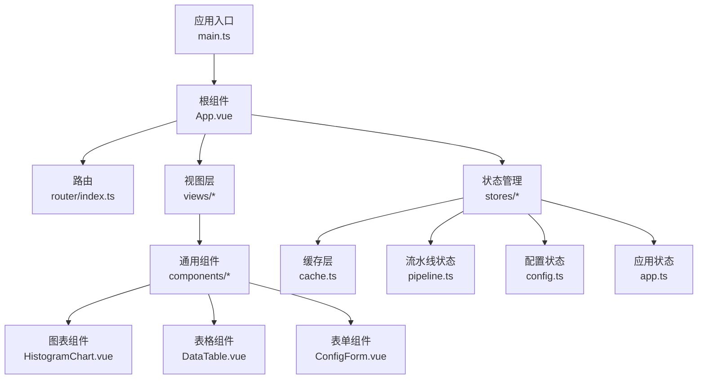
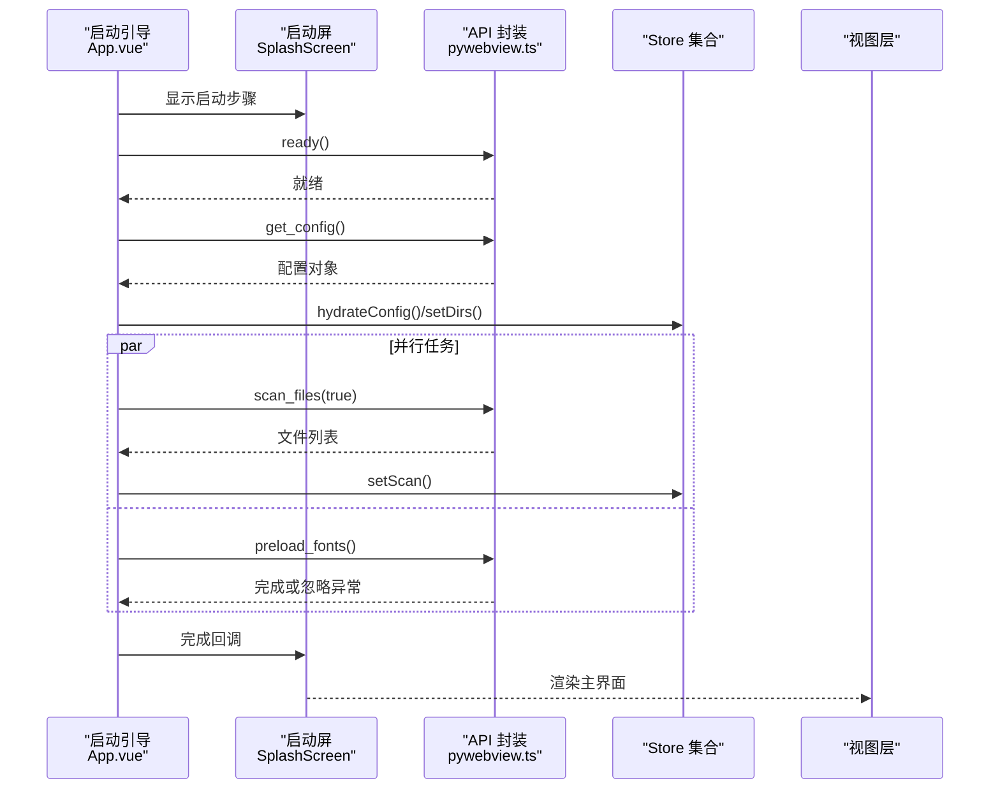
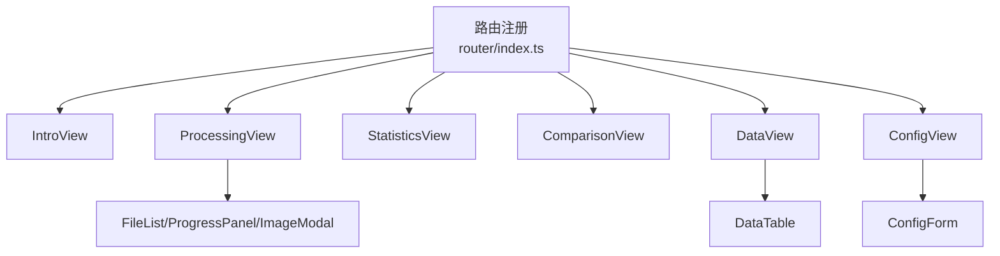
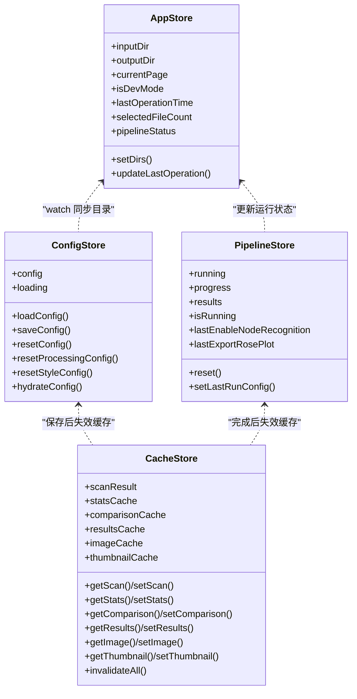
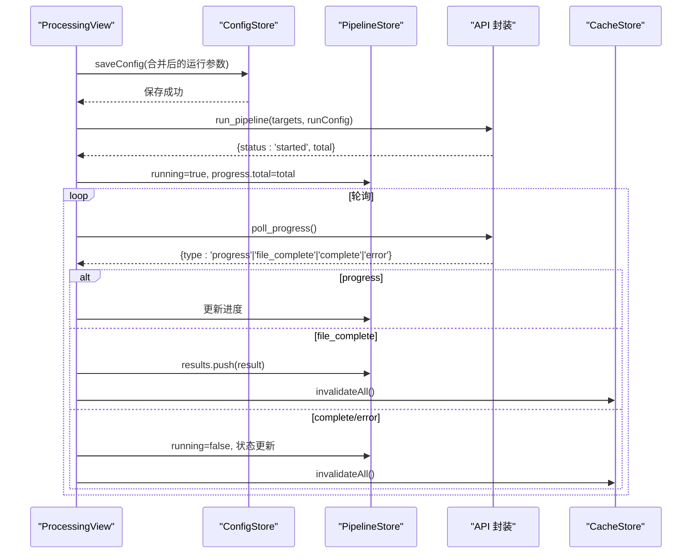
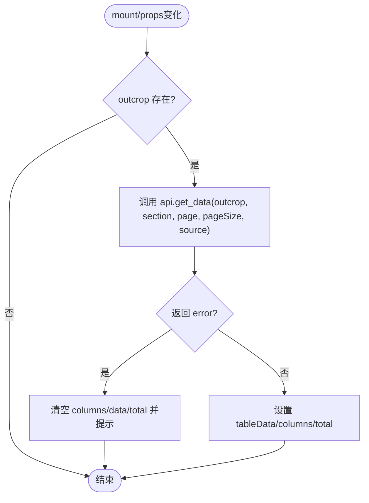
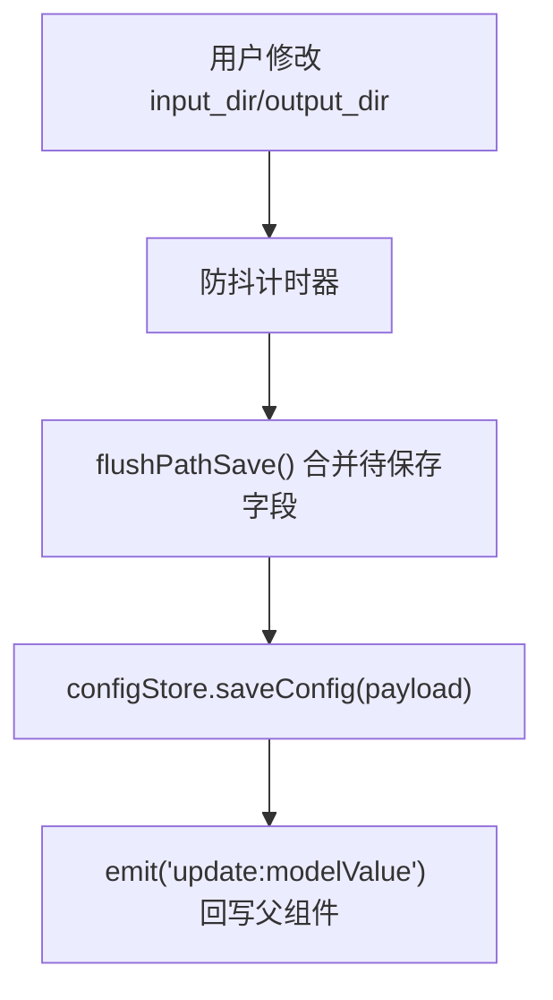
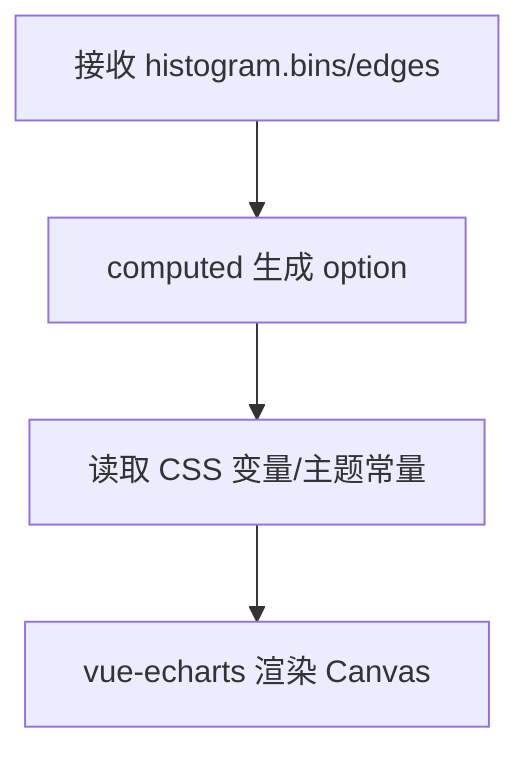
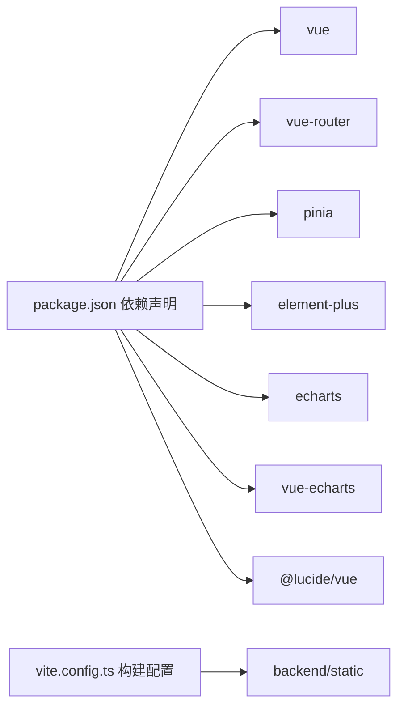

# 前端开发

<cite>
**本文引用的文件**   
- [frontend/package.json](file://frontend/package.json)
- [frontend/vite.config.ts](file://frontend/vite.config.ts)
- [frontend/tsconfig.json](file://frontend/tsconfig.json)
- [frontend/src/main.ts](file://frontend/src/main.ts)
- [frontend/src/App.vue](file://frontend/src/App.vue)
- [frontend/src/router/index.ts](file://frontend/src/router/index.ts)
- [frontend/src/stores/app.ts](file://frontend/src/stores/app.ts)
- [frontend/src/stores/config.ts](file://frontend/src/stores/config.ts)
- [frontend/src/stores/pipeline.ts](file://frontend/src/stores/pipeline.ts)
- [frontend/src/stores/cache.ts](file://frontend/src/stores/cache.ts)
- [frontend/src/views/IntroView.vue](file://frontend/src/views/IntroView.vue)
- [frontend/src/views/ProcessingView.vue](file://frontend/src/views/ProcessingView.vue)
- [frontend/src/components/DataTable.vue](file://frontend/src/components/DataTable.vue)
- [frontend/src/components/ConfigForm.vue](file://frontend/src/components/ConfigForm.vue)
- [frontend/src/components/HistogramChart.vue](file://frontend/src/components/HistogramChart.vue)
</cite>

## 目录
1. [简介](#简介)
2. [项目结构](#项目结构)
3. [核心组件](#核心组件)
4. [架构总览](#架构总览)
5. [详细组件分析](#详细组件分析)
6. [依赖分析](#依赖分析)
7. [性能考虑](#性能考虑)
8. [故障排查指南](#故障排查指南)
9. [结论](#结论)
10. [附录](#附录)

## 简介
本指南面向 TracePipeline 前端（Vue 3 + TypeScript）开发者，系统阐述技术栈、组件组织模式、组合式 API 最佳实践、Pinia 状态管理架构与数据流、路由与页面设计、自定义组件实现思路、样式系统与主题定制、构建配置与开发工作流、调试技巧、性能优化策略与浏览器兼容性处理。目标是帮助读者快速上手并高质量地扩展功能。

## 项目结构
前端位于 frontend 目录，采用按“能力域”划分的目录组织：
- src/api：与后端通信的封装（PyWebView）
- src/components：可复用业务组件与基础 UI 组件
- src/router：路由定义与懒加载
- src/stores：Pinia store（app、config、pipeline、cache）
- src/styles：全局样式、字体、Element Plus 覆盖
- src/types：类型定义
- src/utils：工具函数（格式化、消息提示、ECharts 主题等）
- src/views：页面级视图（Intro、Processing、Statistics、Comparison、Data、Config）
- index.html：入口 HTML
- vite.config.ts：Vite 构建与分包策略
- tsconfig.json：TypeScript 编译选项与路径别名

**图示来源**
- [frontend/src/main.ts:1-88](file://frontend/src/main.ts#L1-L88)
- [frontend/src/App.vue:1-140](file://frontend/src/App.vue#L1-L140)
- [frontend/src/router/index.ts:1-26](file://frontend/src/router/index.ts#L1-L26)
- [frontend/src/stores/cache.ts:1-120](file://frontend/src/stores/cache.ts#L1-L120)
- [frontend/src/stores/pipeline.ts:1-56](file://frontend/src/stores/pipeline.ts#L1-L56)
- [frontend/src/stores/config.ts:1-80](file://frontend/src/stores/config.ts#L1-L80)
- [frontend/src/stores/app.ts:1-57](file://frontend/src/stores/app.ts#L1-L57)
- [frontend/src/components/HistogramChart.vue:1-81](file://frontend/src/components/HistogramChart.vue#L1-L81)
- [frontend/src/components/DataTable.vue:1-199](file://frontend/src/components/DataTable.vue#L1-L199)
- [frontend/src/components/ConfigForm.vue:1-411](file://frontend/src/components/ConfigForm.vue#L1-L411)

**章节来源**
- [frontend/package.json:1-37](file://frontend/package.json#L1-L37)
- [frontend/vite.config.ts:1-134](file://frontend/vite.config.ts#L1-L134)
- [frontend/tsconfig.json:1-26](file://frontend/tsconfig.json#L1-L26)
- [frontend/src/main.ts:1-88](file://frontend/src/main.ts#L1-L88)
- [frontend/src/App.vue:1-140](file://frontend/src/App.vue#L1-L140)
- [frontend/src/router/index.ts:1-26](file://frontend/src/router/index.ts#L1-L26)

## 核心组件
- DataTable：基于 Element Plus Table 的数据浏览组件，支持分页、搜索、多 Tab 切换（输出/输入源），内部维护列头、数据、总数与加载态。
- ConfigForm：配置与样式编辑表单，支持路径选择、颜色/线宽/透明度/字号等可视化调整，具备防抖自动保存与样式重置/保存事件。
- HistogramChart：基于 vue-echarts 的直方图组件，统一使用 ECharts 主题与动画配置，适配设备像素比。

关键职责与交互要点：
- DataTable 通过 props.outcrop/source 控制数据来源，Tab 切换时重置页码并拉取数据；错误时清空展示并提示。
- ConfigForm 将 form 与 style 双向绑定到父组件，路径变更触发防抖写入，样式变更通过事件向上冒泡。
- HistogramChart 以 computed 生成 option，结合 CSS 变量动态读取主题色，保证图表风格一致。

**章节来源**
- [frontend/src/components/DataTable.vue:1-199](file://frontend/src/components/DataTable.vue#L1-L199)
- [frontend/src/components/ConfigForm.vue:1-411](file://frontend/src/components/ConfigForm.vue#L1-L411)
- [frontend/src/components/HistogramChart.vue:1-81](file://frontend/src/components/HistogramChart.vue#L1-L81)

## 架构总览
整体采用“视图层 → Store → API 封装 → 后端服务”的分层架构。启动流程由 App.vue 驱动，SplashScreen 阶段并行执行连接后端、扫描文件与字体预热，随后进入主界面。

**图示来源**
- [frontend/src/App.vue:488-548](file://frontend/src/App.vue#L488-L548)
- [frontend/src/stores/config.ts:73-79](file://frontend/src/stores/config.ts#L73-L79)
- [frontend/src/stores/cache.ts:145-153](file://frontend/src/stores/cache.ts#L145-L153)

## 详细组件分析

### 路由设计与页面结构
- 路由采用 Hash 历史模式，6 个主要视图均启用 KeepAlive，提升切换体验。
- 视图职责：
  - IntroView：首页导航与快速开始指引
  - ProcessingView：参数设置、文件选择、批量运行、进度轮询与结果预览
  - StatisticsView：统计指标与图表展示
  - ComparisonView：多露头对比
  - DataView：数据明细浏览（DataTable）
  - ConfigView：全局配置与样式设置（ConfigForm）

**图示来源**
- [frontend/src/router/index.ts:1-26](file://frontend/src/router/index.ts#L1-L26)
- [frontend/src/views/IntroView.vue:1-136](file://frontend/src/views/IntroView.vue#L1-L136)
- [frontend/src/views/ProcessingView.vue:1-120](file://frontend/src/views/ProcessingView.vue#L1-L120)
- [frontend/src/components/DataTable.vue:1-49](file://frontend/src/components/DataTable.vue#L1-L49)
- [frontend/src/components/ConfigForm.vue:1-125](file://frontend/src/components/ConfigForm.vue#L1-L125)

**章节来源**
- [frontend/src/router/index.ts:1-26](file://frontend/src/router/index.ts#L1-L26)
- [frontend/src/views/IntroView.vue:1-136](file://frontend/src/views/IntroView.vue#L1-L136)
- [frontend/src/views/ProcessingView.vue:1-120](file://frontend/src/views/ProcessingView.vue#L1-L120)

### Pinia 状态管理架构与数据流向
四个 store 的职责划分：
- app：应用级状态（当前页、目录、操作时间、选中文件数、流水线状态），持久化至 localStorage
- config：配置读写（加载/保存/重置），失败时失效相关缓存
- pipeline：流水线运行状态（running、progress、results）、上次运行偏好（节点识别/玫瑰图导出）
- cache：多层缓存（sessionStorage + Memory Map），TTL 与 LRU 淘汰，图片/缩略图缓存与字符配额限制

**图示来源**
- [frontend/src/stores/app.ts:1-57](file://frontend/src/stores/app.ts#L1-L57)
- [frontend/src/stores/config.ts:1-80](file://frontend/src/stores/config.ts#L1-L80)
- [frontend/src/stores/pipeline.ts:1-56](file://frontend/src/stores/pipeline.ts#L1-L56)
- [frontend/src/stores/cache.ts:111-418](file://frontend/src/stores/cache.ts#L111-L418)

**章节来源**
- [frontend/src/stores/app.ts:1-57](file://frontend/src/stores/app.ts#L1-L57)
- [frontend/src/stores/config.ts:1-80](file://frontend/src/stores/config.ts#L1-L80)
- [frontend/src/stores/pipeline.ts:1-56](file://frontend/src/stores/pipeline.ts#L1-L56)
- [frontend/src/stores/cache.ts:1-418](file://frontend/src/stores/cache.ts#L1-L418)

### 处理流程时序（ProcessingView）
处理流程包含参数合并、保存配置、启动流水线、轮询进度、结果聚合与缓存失效。

**图示来源**
- [frontend/src/views/ProcessingView.vue:354-518](file://frontend/src/views/ProcessingView.vue#L354-L518)
- [frontend/src/stores/pipeline.ts:22-56](file://frontend/src/stores/pipeline.ts#L22-L56)
- [frontend/src/stores/cache.ts:388-402](file://frontend/src/stores/cache.ts#L388-L402)

**章节来源**
- [frontend/src/views/ProcessingView.vue:120-582](file://frontend/src/views/ProcessingView.vue#L120-L582)

### 自定义组件设计思路

#### DataTable 组件
- 设计目标：统一数据浏览体验，屏蔽后端 section 差异，提供分页与搜索。
- 关键点：
  - 前端 Tab 名到后端 section 的映射表，避免耦合
  - 切换 Tab 与 source 时重置页码并重新加载
  - 错误分支清空数据并提示用户

**图示来源**
- [frontend/src/components/DataTable.vue:51-141](file://frontend/src/components/DataTable.vue#L51-L141)

**章节来源**
- [frontend/src/components/DataTable.vue:1-199](file://frontend/src/components/DataTable.vue#L1-L199)

#### ConfigForm 组件
- 设计目标：集中管理路径与绘图样式，提供即时反馈与持久化。
- 关键点：
  - 路径变更防抖写入，避免频繁请求
  - 样式变更通过事件向上传递，父组件决定保存时机
  - 支持外部重置/保存样式按钮

**图示来源**
- [frontend/src/components/ConfigForm.vue:174-244](file://frontend/src/components/ConfigForm.vue#L174-L244)

**章节来源**
- [frontend/src/components/ConfigForm.vue:1-411](file://frontend/src/components/ConfigForm.vue#L1-L411)

#### HistogramChart 组件
- 设计目标：统一的直方图展示，遵循全局 ECharts 主题与动画规范。
- 关键点：
  - 使用 computed 生成 option，结合 CSS 变量动态读取主题色
  - devicePixelRatio 自适应高清屏
  - 仅按需引入 echarts 模块，减少包体

**图示来源**
- [frontend/src/components/HistogramChart.vue:1-81](file://frontend/src/components/HistogramChart.vue#L1-L81)

**章节来源**
- [frontend/src/components/HistogramChart.vue:1-81](file://frontend/src/components/HistogramChart.vue#L1-L81)

## 依赖分析
- 运行时依赖：Vue 3、Vue Router、Pinia、Element Plus、ECharts、vue-echarts、Lucide Vue 图标库
- 开发依赖：Vite、TypeScript、Sass、vitest、jsdom、vue-tsc
- 构建产物输出至 backend/static，供 PyWebView 静态资源服务

**图示来源**
- [frontend/package.json:14-34](file://frontend/package.json#L14-L34)
- [frontend/vite.config.ts:112-127](file://frontend/vite.config.ts#L112-L127)

**章节来源**
- [frontend/package.json:1-37](file://frontend/package.json#L1-L37)
- [frontend/vite.config.ts:1-134](file://frontend/vite.config.ts#L1-L134)

## 性能考虑
- 启动并行化：连接后端、扫描文件与字体预热并行执行，缩短首屏等待时间
- 多级缓存：
  - sessionStorage：扫描结果、对比数据、结果列表（短 TTL）
  - Memory Map：统计数据（LRU，最大条目数）、图片与缩略图（LRU + 字符配额）
- 增量失效：配置保存后仅失效相关缓存；流水线完成后全量失效
- 图表优化：按需引入 echarts 模块，devicePixelRatio 自适应，避免过度重绘
- 滚动与日志：处理日志限制条数，避免 DOM 过大；KeepAlive 减少重复初始化

[本节为通用指导，不直接分析具体文件]

## 故障排查指南
- 文件扫描失败：自动重试一次，若仍失败请检查后端是否可用与输入目录权限
- 轮询失败：连续失败达到阈值将停止轮询并提示检查后端进程
- 配置保存失败：路径自动保存会合并待保存字段，下次修改继续尝试
- 图片打开失败：优先从 pipelineStore.results 查找，未命中则扫描 output 目录

**章节来源**
- [frontend/src/views/ProcessingView.vue:232-313](file://frontend/src/views/ProcessingView.vue#L232-L313)
- [frontend/src/views/ProcessingView.vue:405-518](file://frontend/src/views/ProcessingView.vue#L405-L518)
- [frontend/src/components/ConfigForm.vue:195-244](file://frontend/src/components/ConfigForm.vue#L195-L244)

## 结论
TracePipeline 前端以清晰的层次与职责划分实现了高效的数据处理与可视化体验。通过 Pinia 的多 store 协作与多层缓存策略，保证了良好的响应性与可扩展性。配合 Vite 的分包与按需引入，兼顾了构建体积与运行性能。建议后续在以下方面持续优化：
- 进一步细化错误边界与用户提示
- 对大数据集场景引入虚拟滚动
- 完善单元测试与端到端测试覆盖率

[本节为总结性内容，不直接分析具体文件]

## 附录

### 构建与开发工作流
- 脚本命令：
  - 开发：npm run dev
  - 构建：npm run build（先进行类型检查）
  - 预览：npm run preview
  - 类型检查：npm run typecheck
  - 测试：npm run test / npm run test:watch
- 构建输出：backend/static
- 版本注入：从 Python 包 __init__.py 读取版本号并注入到前端常量

**章节来源**
- [frontend/package.json:6-13](file://frontend/package.json#L6-L13)
- [frontend/vite.config.ts:10-21](file://frontend/vite.config.ts#L10-L21)
- [frontend/vite.config.ts:94-111](file://frontend/vite.config.ts#L94-L111)

### 样式系统与主题定制
- 设计 Token：通过 CSS 变量统一管理色彩、间距、圆角、阴影、动效时长与缓动曲线
- 字体系统：全局字体族与标题/正文/数据字体的分层
- Element Plus 覆盖：全局样式覆盖确保与主题一致
- 组件内样式：使用 scoped SCSS，结合 CSS 变量与渐变/网格背景营造科技感

**章节来源**
- [frontend/src/main.ts:41-44](file://frontend/src/main.ts#L41-L44)
- [frontend/src/App.vue:551-700](file://frontend/src/App.vue#L551-L700)

### 浏览器兼容性处理
- 目标环境：ES2020 + DOM API，现代浏览器
- 特性兼容：
  - Clipboard API：复制路径失败时降级为提示
  - devicePixelRatio：图表渲染自适应高清屏
  - Web Worker/多线程：未使用，避免兼容问题
- 打包策略：Vite 默认针对现代浏览器优化，必要时可按需添加 polyfill

**章节来源**
- [frontend/src/App.vue:236-243](file://frontend/src/App.vue#L236-L243)
- [frontend/src/components/HistogramChart.vue:18-18](file://frontend/src/components/HistogramChart.vue#L18-L18)
- [frontend/tsconfig.json:1-26](file://frontend/tsconfig.json#L1-L26)