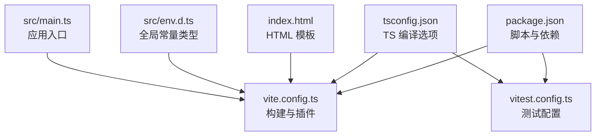
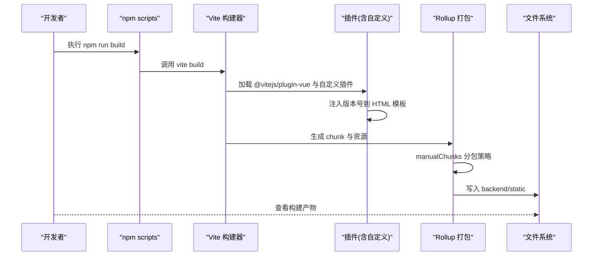
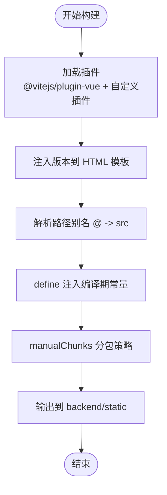
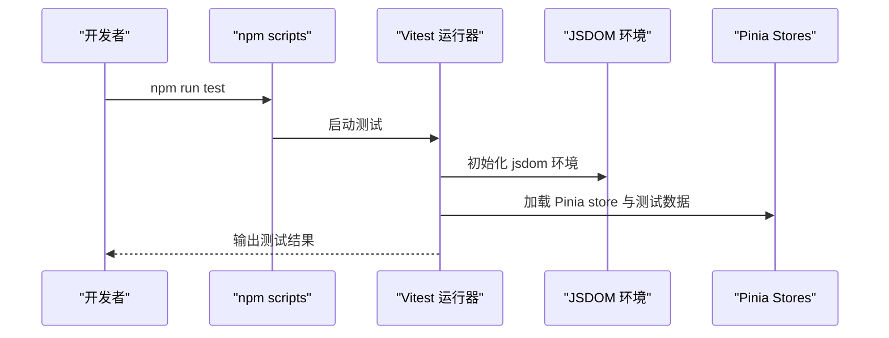
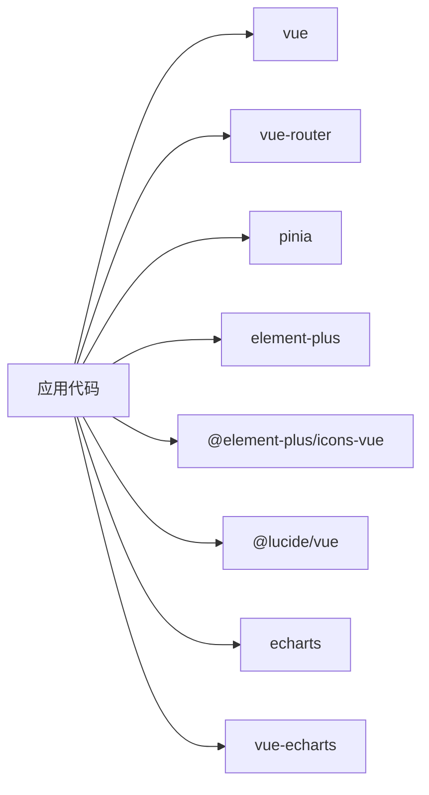

# 构建配置与开发工作流

<cite>
**本文引用的文件**   
- [frontend/package.json](file://frontend/package.json)
- [frontend/vite.config.ts](file://frontend/vite.config.ts)
- [frontend/tsconfig.json](file://frontend/tsconfig.json)
- [frontend/tsconfig.node.json](file://frontend/tsconfig.node.json)
- [frontend/vitest.config.ts](file://frontend/vitest.config.ts)
- [frontend/index.html](file://frontend/index.html)
- [frontend/src/env.d.ts](file://frontend/src/env.d.ts)
- [frontend/src/main.ts](file://frontend/src/main.ts)
- [frontend/tests/stores/cache.test.ts](file://frontend/tests/stores/cache.test.ts)
- [frontend/tests/stores/pipeline.test.ts](file://frontend/tests/stores/pipeline.test.ts)
</cite>

## 目录
1. [简介](#简介)
2. [项目结构](#项目结构)
3. [核心组件](#核心组件)
4. [架构总览](#架构总览)
5. [详细组件分析](#详细组件分析)
6. [依赖关系分析](#依赖关系分析)
7. [性能考虑](#性能考虑)
8. [故障排查指南](#故障排查指南)
9. [结论](#结论)
10. [附录](#附录)

## 简介
本文件面向前端工程化与构建配置，聚焦以下目标：
- Vite 构建配置、插件生态与开发服务器设置
- TypeScript 配置选项、类型检查与编译优化
- 包依赖管理（生产/开发依赖分离）
- 单元测试配置（Vitest 集成与用例编写）
- 开发工作流最佳实践（热重载、调试技巧）
- 生产环境构建优化（代码压缩、资源优化策略）
- 多环境配置管理与环境变量处理

## 项目结构
前端位于 frontend 目录，采用 Vue 3 + Vite + TypeScript + Vitest 的现代前端工程方案。关键配置文件如下：
- package.json：脚本命令、依赖声明
- vite.config.ts：Vite 构建与开发服务器配置、插件、分包策略
- tsconfig.json / tsconfig.node.json：TypeScript 编译与模块解析配置
- vitest.config.ts：测试框架配置
- index.html：应用入口 HTML，模板变量注入
- src/env.d.ts：全局常量与环境类型声明
- src/main.ts：应用初始化与 Element Plus 按需注册

图表来源
- [frontend/package.json:1-37](file://frontend/package.json#L1-L37)
- [frontend/vite.config.ts:1-134](file://frontend/vite.config.ts#L1-L134)
- [frontend/tsconfig.json:1-26](file://frontend/tsconfig.json#L1-L26)
- [frontend/tsconfig.node.json:1-12](file://frontend/tsconfig.node.json#L1-L12)
- [frontend/vitest.config.ts:1-19](file://frontend/vitest.config.ts#L1-L19)
- [frontend/index.html:1-14](file://frontend/index.html#L1-L14)
- [frontend/src/env.d.ts:1-4](file://frontend/src/env.d.ts#L1-L4)
- [frontend/src/main.ts:1-88](file://frontend/src/main.ts#L1-L88)

章节来源
- [frontend/package.json:1-37](file://frontend/package.json#L1-L37)
- [frontend/vite.config.ts:1-134](file://frontend/vite.config.ts#L1-L134)
- [frontend/tsconfig.json:1-26](file://frontend/tsconfig.json#L1-L26)
- [frontend/tsconfig.node.json:1-12](file://frontend/tsconfig.node.json#L1-L12)
- [frontend/vitest.config.ts:1-19](file://frontend/vitest.config.ts#L1-L19)
- [frontend/index.html:1-14](file://frontend/index.html#L1-L14)
- [frontend/src/env.d.ts:1-4](file://frontend/src/env.d.ts#L1-L4)
- [frontend/src/main.ts:1-88](file://frontend/src/main.ts#L1-L88)

## 核心组件
本节从工程化角度梳理关键构建与运行能力：

- 脚本命令
  - dev：启动 Vite 开发服务器
  - build：先执行 vue-tsc 类型检查（不输出），再执行 Vite 构建
  - preview：本地预览生产构建产物
  - typecheck：仅进行类型检查
  - test / test:watch：运行 Vitest 单测或监听模式

- 依赖分类
  - 运行时依赖：Vue 生态（vue、vue-router、pinia）、UI 库（element-plus、@element-plus/icons-vue）、可视化（echarts、vue-echarts）、图标（@lucide/vue）
  - 开发依赖：Vite、@vitejs/plugin-vue、typescript、vue-tsc、vitest、@vue/test-utils、jsdom、sass

- 构建产物
  - 输出目录：backend/static（由 Vite 配置指定）
  - 自动清空输出目录：确保每次构建干净

- 插件与增强
  - @vitejs/plugin-vue：支持 .vue SFC
  - 自定义插件 inject-version：在构建时读取后端 Python 版本并替换到 HTML 模板中
  - define：将 __APP_VERSION__ 注入为编译期常量

- 路径别名
  - @ 指向 src 目录，统一导入路径

- CSS 预处理
  - 启用 SCSS 预处理器

章节来源
- [frontend/package.json:6-13](file://frontend/package.json#L6-L13)
- [frontend/package.json:14-34](file://frontend/package.json#L14-L34)
- [frontend/vite.config.ts:94-133](file://frontend/vite.config.ts#L94-L133)
- [frontend/vite.config.ts:95-103](file://frontend/vite.config.ts#L95-L103)
- [frontend/vite.config.ts:104-111](file://frontend/vite.config.ts#L104-L111)
- [frontend/vite.config.ts:128-132](file://frontend/vite.config.ts#L128-L132)

## 架构总览
下图展示构建与运行时的主要流程：从脚本命令到 Vite 构建、插件处理、资源分包与产物输出。

图表来源
- [frontend/package.json:8](file://frontend/package.json#L8)
- [frontend/vite.config.ts:94-133](file://frontend/vite.config.ts#L94-L133)
- [frontend/vite.config.ts:95-103](file://frontend/vite.config.ts#L95-L103)
- [frontend/vite.config.ts:112-126](file://frontend/vite.config.ts#L112-L126)

## 详细组件分析

### Vite 构建配置与插件生态
- 插件
  - @vitejs/plugin-vue：提供 SFC 支持与 Vue 3 特性
  - 自定义插件 inject-version：在 transformIndexHtml 阶段将 {{APP_VERSION}} 替换为实际版本字符串；版本来源于读取后端 Python 包的 __init__.py 中的 __version__

- 定义常量
  - define.__APP_VERSION__：将版本作为编译期常量注入，便于在运行时直接访问

- 路径别名
  - resolve.alias.@ -> src

- 构建输出
  - build.outDir -> ../backend/static
  - build.emptyOutDir -> true
  - build.rollupOptions.output.manualChunks：按依赖分组实现细粒度分包，提升缓存命中与并行加载

- 警告过滤
  - onwarn：忽略特定第三方库的注解警告，避免干扰

- CSS 预处理
  - css.preprocessorOptions.scss：启用 SCSS

图表来源
- [frontend/vite.config.ts:95-103](file://frontend/vite.config.ts#L95-L103)
- [frontend/vite.config.ts:104-111](file://frontend/vite.config.ts#L104-L111)
- [frontend/vite.config.ts:112-126](file://frontend/vite.config.ts#L112-L126)
- [frontend/vite.config.ts:128-132](file://frontend/vite.config.ts#L128-L132)

章节来源
- [frontend/vite.config.ts:1-134](file://frontend/vite.config.ts#L1-134)

### 分包策略与 Chunk 划分
manualChunks 规则要点：
- echarts 生态：zrender、vue-echarts、echarts 独立 chunk
- UI 与工具：@vueuse、@element-plus/icons-vue、@popperjs/@ctrl/tinycolor 归入 element-plus-vendor
- Element Plus 组件按功能分块：form/data/feedback 三类组件分别打包
- Vue 生态：vue、pinia、vue-router 合并为 vue-vendor
- 其他 vendor 资源归入 vendor

该策略有利于：
- 提高浏览器缓存命中率（稳定依赖变更少）
- 降低首屏体积（按需加载）
- 提升并行加载效率（拆分大依赖）

章节来源
- [frontend/vite.config.ts:59-92](file://frontend/vite.config.ts#L59-L92)

### TypeScript 配置与类型检查
- tsconfig.json（应用层）
  - target: ES2020
  - module: ESNext
  - lib: ES2020, DOM, DOM.Iterable
  - moduleResolution: bundler（适配 Vite 的模块解析）
  - allowImportingTsExtensions: true（允许 .ts 扩展名导入）
  - isolatedModules: true（配合 vite 的逐模块编译）
  - noEmit: true（交由 Vite 负责产出）
  - strict: true（开启严格模式）
  - paths: "@/*" -> "./src/*"（路径映射）
  - include: 包含 src 下 .ts/.tsx/.vue

- tsconfig.node.json（Node 侧）
  - composite: true（用于引用）
  - types: ["node"]（引入 Node 类型）
  - include: vite.config.ts（仅对构建脚本生效）

- 类型检查命令
  - npm run typecheck：使用 vue-tsc --noEmit 进行纯类型检查
  - npm run build：先执行类型检查，再构建

章节来源
- [frontend/tsconfig.json:1-26](file://frontend/tsconfig.json#L1-L26)
- [frontend/tsconfig.node.json:1-12](file://frontend/tsconfig.node.json#L1-L12)
- [frontend/package.json:8-11](file://frontend/package.json#L8-L11)

### 环境变量与多环境配置
- 当前实现
  - 通过 define 注入 __APP_VERSION__ 作为编译期常量
  - 在 index.html 中使用 {{APP_VERSION}} 占位符，由自定义插件替换
  - 在 src/env.d.ts 中声明 const __APP_VERSION__: string，供 TS 识别

- 建议的多环境方案（概念性指导）
  - 使用 Vite 的环境变量约定：以 VITE_ 前缀暴露给客户端
  - 创建 .env.development、.env.production 等文件，按环境加载
  - 在 vite.config.ts 中根据 mode 切换不同配置（如 API 地址、日志开关）
  - 在源码中通过 import.meta.env.VITE_* 访问

说明：以上为通用实践建议，当前仓库未显式使用 .env 文件与 import.meta.env。

章节来源
- [frontend/vite.config.ts:95-103](file://frontend/vite.config.ts#L95-L103)
- [frontend/vite.config.ts:109-111](file://frontend/vite.config.ts#L109-L111)
- [frontend/index.html:7](file://frontend/index.html#L7)
- [frontend/src/env.d.ts:1-4](file://frontend/src/env.d.ts#L1-L4)

### 开发服务器与热重载
- 开发命令：npm run dev 启动 Vite 开发服务器
- 热重载：基于 Vite 原生 HMR，修改 .vue/.ts/.css 即时更新
- 调试技巧
  - 使用浏览器开发者工具断点调试
  - 利用 console 与网络面板观察请求与资源加载
  - 结合 Vue Devtools 进行组件状态与路由调试

章节来源
- [frontend/package.json:7](file://frontend/package.json#L7)

### 生产构建优化
- 输出目录与清理
  - outDir: ../backend/static
  - emptyOutDir: true

- 代码压缩与资源优化
  - 默认启用 Terser 压缩（Vite 内置）
  - 图片/字体等资源可考虑启用内联或压缩（可通过 Vite 插件扩展）
  - 手动分包减少首屏体积，提升缓存命中率

- 警告过滤
  - 针对特定第三方库的注解警告进行忽略，保持构建输出整洁

章节来源
- [frontend/vite.config.ts:112-126](file://frontend/vite.config.ts#L112-L126)
- [frontend/vite.config.ts:116-120](file://frontend/vite.config.ts#L116-L120)

### 单元测试配置与用例编写（Vitest）
- 配置要点
  - plugins: 使用 @vitejs/plugin-vue 支持 .vue 组件
  - resolve.alias: 与主配置一致，@ 指向 src
  - test.globals: true（全局可用 describe/it/expect）
  - test.environment: jsdom（模拟浏览器环境）
  - test.include: tests/**/*.test.ts
  - test.css: false（禁用样式处理以提升速度）

- 用例示例
  - cache.test.ts：验证缓存 TTL、LRU 淘汰、sessionStorage 持久化
  - pipeline.test.ts：验证流水线状态、localStorage 持久化与计算属性

- 运行命令
  - npm run test：一次性运行
  - npm run test:watch：监听模式

图表来源
- [frontend/vitest.config.ts:1-19](file://frontend/vitest.config.ts#L1-L19)
- [frontend/tests/stores/cache.test.ts:1-199](file://frontend/tests/stores/cache.test.ts#L1-L199)
- [frontend/tests/stores/pipeline.test.ts:1-70](file://frontend/tests/stores/pipeline.test.ts#L1-L70)

章节来源
- [frontend/vitest.config.ts:1-19](file://frontend/vitest.config.ts#L1-L19)
- [frontend/tests/stores/cache.test.ts:1-199](file://frontend/tests/stores/cache.test.ts#L1-L199)
- [frontend/tests/stores/pipeline.test.ts:1-70](file://frontend/tests/stores/pipeline.test.ts#L1-L70)

### 应用入口与组件注册
- main.ts 负责：
  - 创建 Vue 应用实例
  - 注册 Pinia 与 Router
  - 按需注册 Element Plus 组件（表单、数据、反馈等类别）
  - 引入全局样式（设计 Tokens、字体系统、Element Plus 覆盖）
  - 挂载到 #app

- 样式顺序
  - tokens.css → fonts.css → element-global.css，保证主题与覆盖优先级正确

章节来源
- [frontend/src/main.ts:1-88](file://frontend/src/main.ts#L1-L88)

## 依赖关系分析
- 运行时依赖
  - Vue 生态：vue、vue-router、pinia
  - UI 与图标：element-plus、@element-plus/icons-vue、@lucide/vue
  - 可视化：echarts、vue-echarts

- 开发依赖
  - 构建与转译：vite、@vitejs/plugin-vue、typescript、vue-tsc
  - 测试：vitest、@vue/test-utils、jsdom
  - 样式：sass

图表来源
- [frontend/package.json:14-23](file://frontend/package.json#L14-L23)

章节来源
- [frontend/package.json:14-34](file://frontend/package.json#L14-L34)

## 性能考虑
- 分包策略
  - 将大型第三方库拆分为独立 chunk，提升缓存命中率与并行加载
  - 按功能域拆分 Element Plus 组件，减少首屏体积

- 类型检查与构建
  - 使用 vue-tsc 进行严格类型检查，尽早发现潜在问题
  - isolatedModules 与 bundler 模块解析提升构建速度

- 资源优化
  - 启用 CSS 预处理，便于统一管理主题与复用样式
  - 按需引入 UI 组件，避免全量引入导致体积膨胀

[本节为通用性能建议，无需具体文件分析]

## 故障排查指南
- 构建失败
  - 检查 TypeScript 错误：运行 npm run typecheck 定位类型问题
  - 检查依赖版本一致性：确保 package-lock.json 已提交并锁定版本

- 构建产物异常
  - 确认 outDir 与 emptyOutDir 配置是否正确
  - 检查 manualChunks 规则是否误匹配路径

- 测试失败
  - 确认 jsdom 环境与全局 API 可用性
  - 检查 Pinia 实例初始化与 localStorage/sessionStorage 清理

章节来源
- [frontend/package.json:8-12](file://frontend/package.json#L8-L12)
- [frontend/vite.config.ts:112-126](file://frontend/vite.config.ts#L112-L126)
- [frontend/vitest.config.ts:12-17](file://frontend/vitest.config.ts#L12-L17)

## 结论
本项目的前端构建体系以 Vite 为核心，结合 Vue 3 生态与严格的 TypeScript 配置，实现了高效的开发与构建体验。通过自定义插件注入版本信息、精细化的分包策略以及完善的单元测试配置，项目在可维护性与性能之间取得了良好平衡。建议在后续迭代中引入 .env 多环境配置与更丰富的资源优化插件，以进一步提升构建灵活性与产物质量。

## 附录
- 常用命令速查
  - 开发：npm run dev
  - 构建：npm run build
  - 预览：npm run preview
  - 类型检查：npm run typecheck
  - 测试：npm run test / npm run test:watch

章节来源
- [frontend/package.json:6-13](file://frontend/package.json#L6-L13)