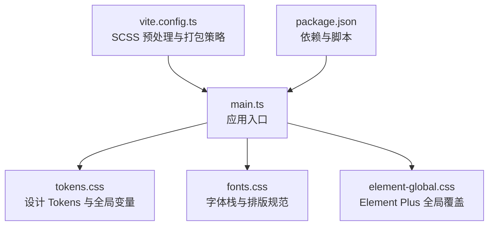
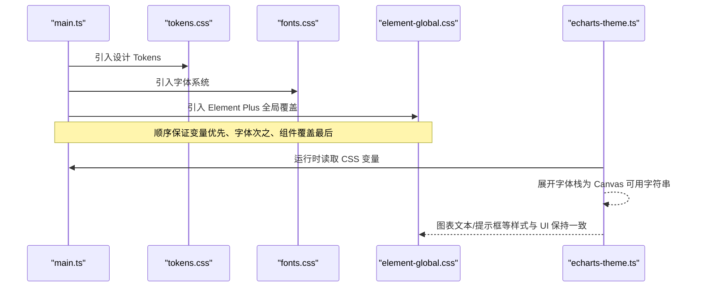
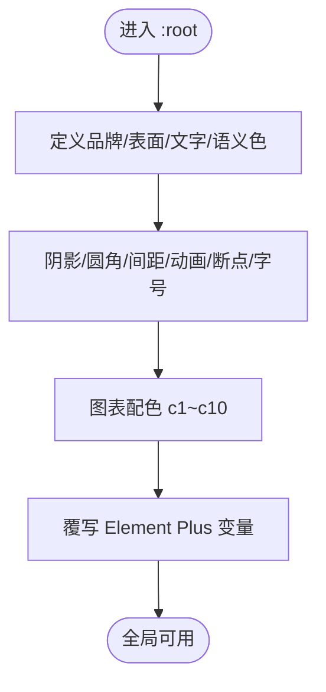
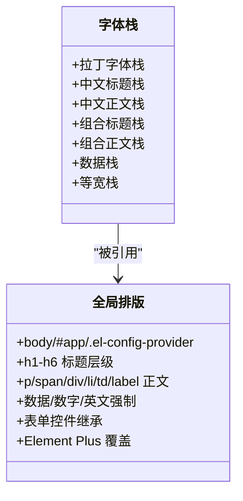
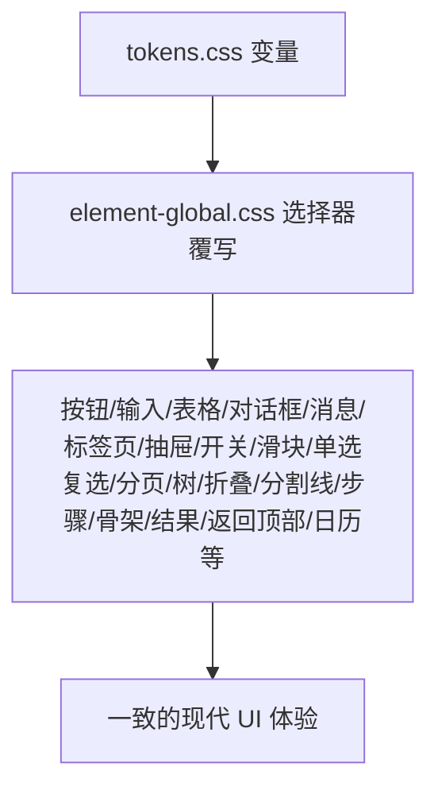
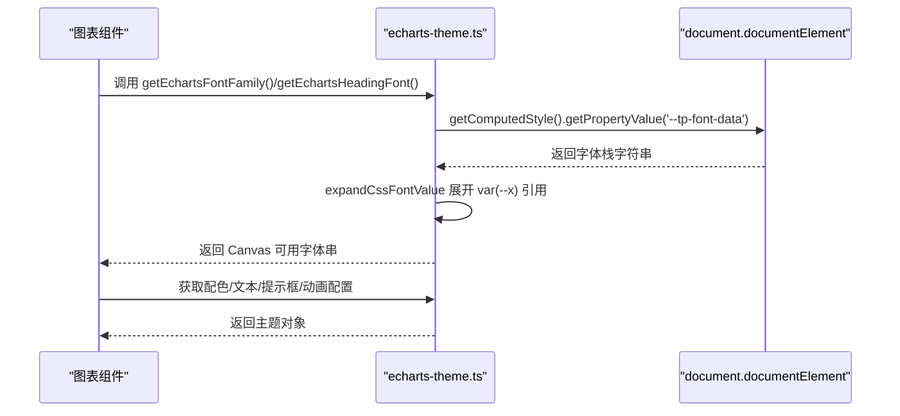
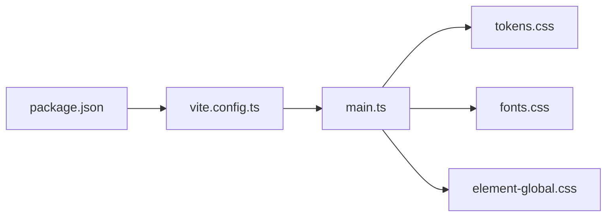

# 样式系统与主题定制

<cite>
**本文引用的文件**   
- [frontend/src/styles/tokens.css](file://frontend/src/styles/tokens.css)
- [frontend/src/styles/fonts.css](file://frontend/src/styles/fonts.css)
- [frontend/src/styles/element-global.css](file://frontend/src/styles/element-global.css)
- [frontend/src/utils/echarts-theme.ts](file://frontend/src/utils/echarts-theme.ts)
- [frontend/src/main.ts](file://frontend/src/main.ts)
- [frontend/vite.config.ts](file://frontend/vite.config.ts)
- [frontend/package.json](file://frontend/package.json)
</cite>

## 目录
1. [简介](#简介)
2. [项目结构](#项目结构)
3. [核心组件](#核心组件)
4. [架构总览](#架构总览)
5. [详细组件分析](#详细组件分析)
6. [依赖关系分析](#依赖关系分析)
7. [性能考量](#性能考量)
8. [故障排查指南](#故障排查指南)
9. [结论](#结论)
10. [附录](#附录)

## 简介
本文件系统性梳理前端样式体系与主题定制方案，覆盖以下关键主题：
- CSS 变量（设计 Tokens）体系：颜色、字体家族、间距、圆角、阴影、动画、断点等统一治理
- Element Plus 全局样式覆盖与主题定制：通过 CSS 变量覆写与选择器增强实现一致体验
- 字体管理系统：中文字体加载策略、回退链与跨平台渲染优化
- ECharts 主题定制：从 CSS 变量运行时解析到 Canvas 可用字体的桥接，配色与动效规范
- SCSS 预处理器使用规范与组织方式
- 响应式设计与移动端适配方案
- 样式性能优化与 CSS 模块化最佳实践

## 项目结构
前端样式相关文件集中于 src/styles 目录，并通过入口 main.ts 按顺序注入，确保变量优先、字体次之、组件覆盖最后。构建配置在 vite.config.ts 中启用 SCSS 预处理，并定义按需打包策略。

图表来源
- [frontend/src/main.ts:41-44](file://frontend/src/main.ts#L41-L44)
- [frontend/vite.config.ts:128-132](file://frontend/vite.config.ts#L128-L132)
- [frontend/package.json:14-34](file://frontend/package.json#L14-L34)

章节来源
- [frontend/src/main.ts:41-44](file://frontend/src/main.ts#L41-L44)
- [frontend/vite.config.ts:128-132](file://frontend/vite.config.ts#L128-L132)
- [frontend/package.json:14-34](file://frontend/package.json#L14-L34)

## 核心组件
- 设计 Tokens（CSS 变量）：集中管理品牌色、表面色、语义色、边框、阴影、圆角、间距、动画时长与缓动、断点、字号、图表配色、Element Plus 变量覆写等
- 字体系统：定义西文/中文标题/正文/数据/等宽字体栈，统一全局排版与 Element Plus 组件字体覆盖
- Element Plus 全局覆盖：按钮、输入框、表格、对话框、消息提示、标签页、开关、滑块、单选/复选、分页、抽屉、时间线、结果页等组件的视觉一致性
- ECharts 主题工具：将 CSS 变量中的字体栈展开为 Canvas 可用的字体名列表，提供统一的文本、坐标轴、提示框、动画配置

章节来源
- [frontend/src/styles/tokens.css:18-211](file://frontend/src/styles/tokens.css#L18-L211)
- [frontend/src/styles/fonts.css:16-33](file://frontend/src/styles/fonts.css#L16-L33)
- [frontend/src/styles/element-global.css:6-115](file://frontend/src/styles/element-global.css#L6-L115)
- [frontend/src/utils/echarts-theme.ts:13-56](file://frontend/src/utils/echarts-theme.ts#L13-L56)

## 架构总览
样式系统的运行期流程如下：
- 启动时按顺序加载 tokens → fonts → element-global，保证变量先于任何组件样式生效
- 组件样式通过选择器覆写 + CSS 变量引用，形成“低耦合、高内聚”的主题化能力
- ECharts 主题通过运行时读取 CSS 变量，将字体栈展开为 Canvas 可识别的字体串，保持与 UI 一致

图表来源
- [frontend/src/main.ts:41-44](file://frontend/src/main.ts#L41-L44)
- [frontend/src/utils/echarts-theme.ts:13-56](file://frontend/src/utils/echarts-theme.ts#L13-L56)

## 详细组件分析

### 设计 Tokens（CSS 变量）体系
- 颜色体系
  - 品牌色与地质主题辅助色：用于主色调、强调色、侧边栏背景与悬停态
  - 表面色系统：基础背景、抬升层级、悬浮层、凹陷面板、遮罩、玻璃拟态等
  - 文字色系统：主次三级、反色、强调色上文字
  - 语义色：成功/警告/危险/信息及其浅色与背景变体，配套边框变体
- 视觉维度
  - 多层复合阴影：sm/md/lg/xl/2xl/inset/accent/sidebar-item/glow 等
  - 圆角系统：xs/sm/md/lg/xl/2xl/full
  - 间距尺度：以 4px 为基数的 space-1~space-12
  - 动画与缓动：时长与多种缓动曲线，含入场、缩放、滑入、计数、光晕呼吸等
- 响应式断点：xs/sm/md/lg/xl
- 排版：行高、字距、展示字号
- 图表配色：c1~c10，色相均匀分布，兼顾地质语义
- Element Plus 变量覆写：主色、成功/警告/危险/信息、圆角、阴影等

图表来源
- [frontend/src/styles/tokens.css:18-211](file://frontend/src/styles/tokens.css#L18-L211)

章节来源
- [frontend/src/styles/tokens.css:18-211](file://frontend/src/styles/tokens.css#L18-L211)

### 字体管理系统
- 字体栈定义
  - 西文与数字：Times New Roman 严格优先，完整降级链
  - 中文标题：黑体体系（Windows→macOS→Linux→通用无衬线）
  - 中文正文：宋体体系（Windows→macOS→Linux→通用衬线）
  - 组合栈：英文/数字走 Times New Roman，中文自动回退至对应中文字体
  - 数据栈：Times New Roman 优先，中文回退宋体；日志/时间戳采用相同栈
- 全局排版
  - body/#app/.el-config-provider 统一字体、字号、行高、颜色
  - 标题层级统一黑体，正文统一 Times+宋体
  - 数据/数字/英文强制 Times New Roman，tabular-nums 对齐
  - 表单控件显式继承，Element Plus 各组件字体覆盖
- 中英文混排优化
  - text-rendering: optimizeSpeed，避免 optimizeLegibility 在大段文本的性能损耗
  - letter-spacing: 0，CJK 标点压缩，lang 属性分区辅助
  - 紧凑/宽松排版工具类

图表来源
- [frontend/src/styles/fonts.css:16-33](file://frontend/src/styles/fonts.css#L16-L33)
- [frontend/src/styles/fonts.css:35-106](file://frontend/src/styles/fonts.css#L35-L106)
- [frontend/src/styles/fonts.css:115-198](file://frontend/src/styles/fonts.css#L115-L198)

章节来源
- [frontend/src/styles/fonts.css:16-33](file://frontend/src/styles/fonts.css#L16-L33)
- [frontend/src/styles/fonts.css:35-106](file://frontend/src/styles/fonts.css#L35-L106)
- [frontend/src/styles/fonts.css:115-198](file://frontend/src/styles/fonts.css#L115-L198)

### Element Plus 全局样式覆盖
- 按钮：圆角、渐变主色、涟漪点击效果、默认/链接按钮样式
- 输入框/选择器：圆角、聚焦环、占位符颜色
- 表格：表头渐变、悬停行、单元格字体、左侧悬停指示条
- 标签页：激活态高亮与发光下划线
- 消息提示：居中定位、入场/离场动画、类型化配色与阴影
- 对话框/抽屉：大圆角、阴影、头部/内容/底部内边距
- 下拉菜单/开关/滑块/单选/复选/颜色选择器/描述列表/警告提示/标签/加载/分页/树形控件/折叠面板/分割线/步骤条/骨架屏/结果页/返回顶部/日历数字等
- 统一聚焦环与滚动条美化

图表来源
- [frontend/src/styles/element-global.css:6-115](file://frontend/src/styles/element-global.css#L6-L115)
- [frontend/src/styles/element-global.css:116-206](file://frontend/src/styles/element-global.css#L116-L206)
- [frontend/src/styles/element-global.css:264-300](file://frontend/src/styles/element-global.css#L264-L300)
- [frontend/src/styles/element-global.css:323-376](file://frontend/src/styles/element-global.css#L323-L376)
- [frontend/src/styles/element-global.css:435-458](file://frontend/src/styles/element-global.css#L435-L458)
- [frontend/src/styles/element-global.css:678-688](file://frontend/src/styles/element-global.css#L678-L688)

章节来源
- [frontend/src/styles/element-global.css:6-115](file://frontend/src/styles/element-global.css#L6-L115)
- [frontend/src/styles/element-global.css:116-206](file://frontend/src/styles/element-global.css#L116-L206)
- [frontend/src/styles/element-global.css:264-300](file://frontend/src/styles/element-global.css#L264-L300)
- [frontend/src/styles/element-global.css:323-376](file://frontend/src/styles/element-global.css#L323-L376)
- [frontend/src/styles/element-global.css:435-458](file://frontend/src/styles/element-global.css#L435-L458)
- [frontend/src/styles/element-global.css:678-688](file://frontend/src/styles/element-global.css#L678-L688)

### ECharts 主题定制
- 字体桥接
  - 运行时读取 CSS 变量中的字体栈，递归展开 var(--x) 引用，生成 Canvas 可用的字体名列表
  - 提供 getEchartsFontFamily() 与 getEchartsHeadingFont() 供图表文本与标题使用
- 配色同步
  - CHART_COLORS 与 tokens.css 中 --tp-chart-c1~c10 保持一致，支持地质科学主题语义
- 文本/坐标轴/提示框/动画
  - baseTextStyle/baseAxisLabelStyle/baseTitleStyle/baseTooltipStyle/baseAnimationConfig/baseSeriesAnimation 统一风格与动效

图表来源
- [frontend/src/utils/echarts-theme.ts:13-56](file://frontend/src/utils/echarts-theme.ts#L13-L56)
- [frontend/src/utils/echarts-theme.ts:76-78](file://frontend/src/utils/echarts-theme.ts#L76-L78)
- [frontend/src/utils/echarts-theme.ts:97-133](file://frontend/src/utils/echarts-theme.ts#L97-L133)

章节来源
- [frontend/src/utils/echarts-theme.ts:13-56](file://frontend/src/utils/echarts-theme.ts#L13-L56)
- [frontend/src/utils/echarts-theme.ts:76-78](file://frontend/src/utils/echarts-theme.ts#L76-L78)
- [frontend/src/utils/echarts-theme.ts:97-133](file://frontend/src/utils/echarts-theme.ts#L97-L133)

### 暗色主题支持与动态主题切换
- 现状说明
  - 当前仓库未包含暗色主题变量或切换逻辑的实现文件
  - 可在 :root 下新增暗色变量集，或通过 data-theme="dark" 配合媒体查询/JS 切换变量值
  - 建议将现有浅色变量作为默认主题，新增 --tp-* 的暗色映射，并在需要处覆写
- 建议路径
  - 在 tokens.css 中扩展暗色变量块
  - 在 element-global.css 中增加对暗色变量的兼容
  - 在 echarts-theme.ts 中根据当前主题读取对应变量值

章节来源
- [frontend/src/styles/tokens.css:18-211](file://frontend/src/styles/tokens.css#L18-L211)
- [frontend/src/styles/element-global.css:6-115](file://frontend/src/styles/element-global.css#L6-L115)
- [frontend/src/utils/echarts-theme.ts:84-90](file://frontend/src/utils/echarts-theme.ts#L84-L90)

### SCSS 预处理器使用规范
- 构建配置
  - vite.config.ts 已启用 scss 预处理器选项
  - package.json 已安装 sass 依赖
- 组织建议
  - 将混合函数与变量放入独立 .scss 文件，按模块导入
  - 组件级样式使用 scoped lang="scss"，仅在本组件作用域内复用 Token 与混合
  - 全局样式集中在 styles 目录，避免散落在组件内部

章节来源
- [frontend/vite.config.ts:128-132](file://frontend/vite.config.ts#L128-L132)
- [frontend/package.json:29](file://frontend/package.json#L29)

### 响应式设计断点与移动端适配
- 自定义断点
  - tokens.css 定义了 xs/sm/md/lg/xl 五个断点变量，便于在组件中使用 @media (min-width: var(--tp-breakpoint-xx)) 进行适配
- Element Plus 栅格
  - 依赖 Element Plus 内置栅格与显示类，提供 xs/sm/md/lg/xl 多档响应式列布局
- 建议
  - 优先使用 tokens 断点变量，保持与设计语言一致
  - 在小屏场景下，减少复杂动画与重绘，提升交互流畅度

章节来源
- [frontend/src/styles/tokens.css:140-146](file://frontend/src/styles/tokens.css#L140-L146)
- [frontend/node_modules/element-plus/theme-chalk/display.css](file://frontend/node_modules/element-plus/theme-chalk/display.css)
- [frontend/node_modules/element-plus/theme-chalk/el-col.css](file://frontend/node_modules/element-plus/theme-chalk/el-col.css)

## 依赖关系分析
- 入口加载顺序
  - main.ts 依次引入 tokens.css → fonts.css → element-global.css，确保变量优先、字体次之、组件覆盖最后
- 构建与依赖
  - vite.config.ts 启用 SCSS 预处理，并按功能拆分 manualChunks，利于缓存与并行加载
  - package.json 声明了 Vue、Element Plus、ECharts、Sass 等依赖

图表来源
- [frontend/src/main.ts:41-44](file://frontend/src/main.ts#L41-L44)
- [frontend/vite.config.ts:128-132](file://frontend/vite.config.ts#L128-L132)
- [frontend/package.json:14-34](file://frontend/package.json#L14-L34)

章节来源
- [frontend/src/main.ts:41-44](file://frontend/src/main.ts#L41-L44)
- [frontend/vite.config.ts:128-132](file://frontend/vite.config.ts#L128-L132)
- [frontend/package.json:14-34](file://frontend/package.json#L14-L34)

## 性能考量
- 字体渲染
  - 使用 optimizeSpeed 与 tabular-nums，避免 optimizeLegibility 在大段文本上的性能开销
  - 通过字体栈与 lang 属性分区，减少不必要的字体回退计算
- 动画与过渡
  - 统一缓动与时长，避免过度动画；在 prefers-reduced-motion 环境下禁用动画
- 滚动条与选中
  - 轻量滚动条与选中样式，避免复杂滤镜与重绘
- 构建与缓存
  - 使用 manualChunks 拆分 Element Plus、ECharts、Vue 等依赖，提高缓存命中率与并行加载效率

章节来源
- [frontend/src/styles/fonts.css:35-57](file://frontend/src/styles/fonts.css#L35-L57)
- [frontend/src/styles/tokens.css:655-669](file://frontend/src/styles/tokens.css#L655-L669)
- [frontend/vite.config.ts:112-127](file://frontend/vite.config.ts#L112-L127)

## 故障排查指南
- 字体显示异常
  - 检查浏览器是否支持 Times New Roman 及中文字体回退链
  - 确认 fonts.css 在全局样式中的加载顺序未被覆盖
- Element Plus 样式不生效
  - 确认 element-global.css 在 tokens.css 之后加载
  - 检查是否存在更高优先级选择器覆盖
- ECharts 字体不一致
  - 检查 echarts-theme.ts 是否能正确读取 CSS 变量
  - 确认 Canvas 上下文字体栈展开后的字体名存在且可渲染
- 构建问题
  - 确认 Sass 依赖已安装，vite.config.ts 中 preprocessorOptions.scss 已启用
  - 检查 manualChunks 配置是否导致资源缺失

章节来源
- [frontend/src/styles/fonts.css:115-198](file://frontend/src/styles/fonts.css#L115-L198)
- [frontend/src/styles/element-global.css:6-115](file://frontend/src/styles/element-global.css#L6-L115)
- [frontend/src/utils/echarts-theme.ts:13-56](file://frontend/src/utils/echarts-theme.ts#L13-L56)
- [frontend/vite.config.ts:128-132](file://frontend/vite.config.ts#L128-L132)

## 结论
本项目的前端样式系统以 CSS 变量为核心，结合字体栈与 Element Plus 全局覆盖，实现了高度一致的主题化体验。ECharts 主题通过运行时解析 CSS 变量，保证了图表与 UI 的一致性。构建层面启用 SCSS 预处理与手动分包，有利于性能与可维护性。后续可扩展暗色主题与更丰富的组件主题能力。

## 附录
- 主题定制清单
  - 修改 tokens.css 中的颜色、圆角、阴影、间距、断点、字号等变量
  - 在 fonts.css 调整字体栈与全局排版
  - 在 element-global.css 覆写组件细节样式
  - 在 echarts-theme.ts 同步图表配色与字体
- 最佳实践
  - 优先使用 Token 变量，避免硬编码
  - 组件样式尽量 scoped，复用全局 Token
  - 控制动画复杂度，尊重用户偏好设置
  - 利用 manualChunks 优化首屏与缓存