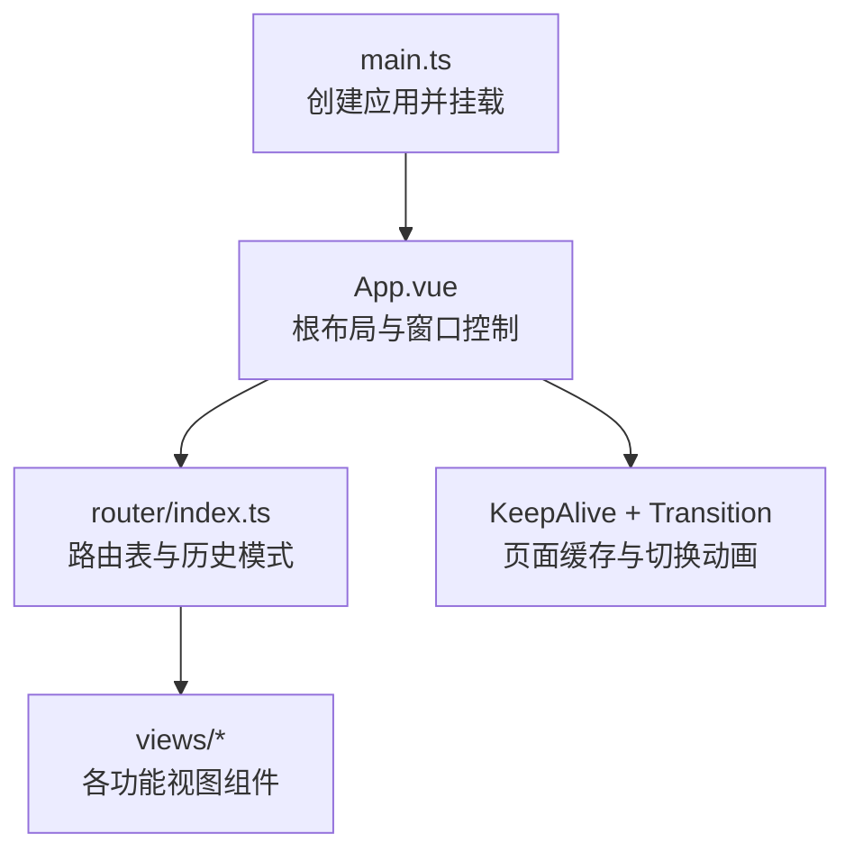
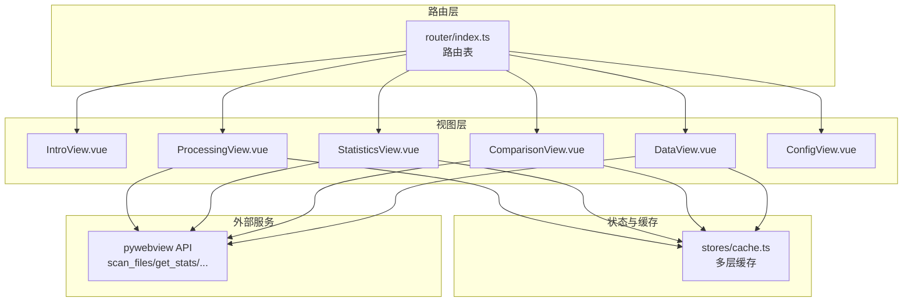
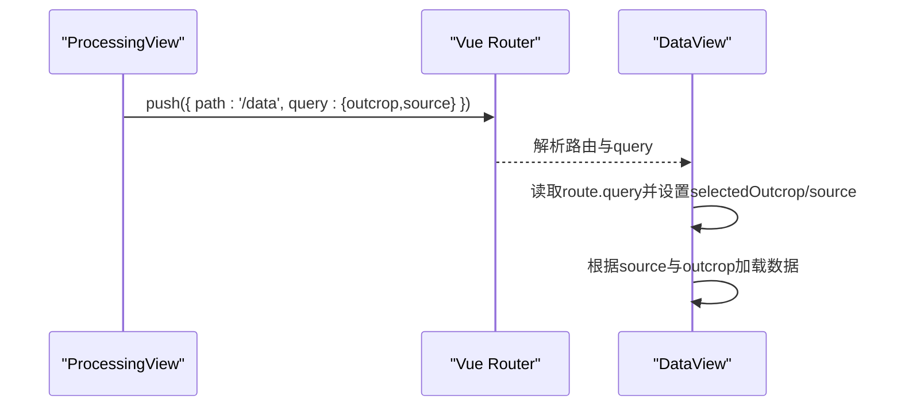
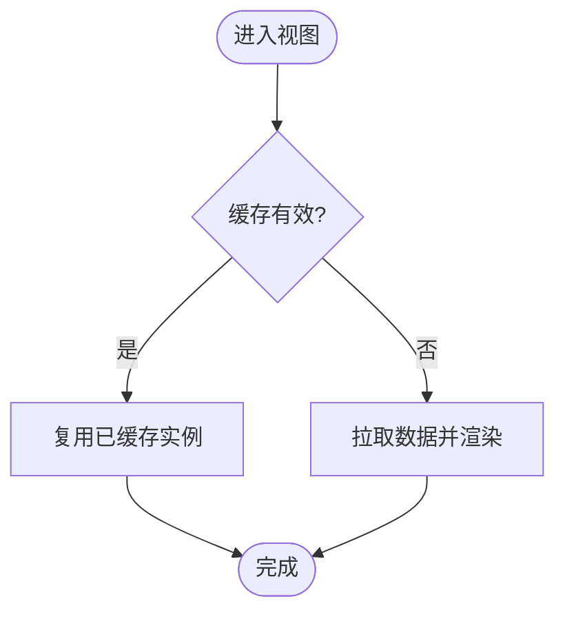
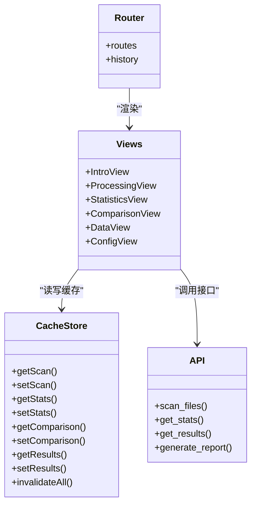

# 路由设计与导航

<cite>
**本文引用的文件**   
- [frontend/src/router/index.ts](file://frontend/src/router/index.ts)
- [frontend/src/App.vue](file://frontend/src/App.vue)
- [frontend/src/main.ts](file://frontend/src/main.ts)
- [frontend/src/views/IntroView.vue](file://frontend/src/views/IntroView.vue)
- [frontend/src/views/ProcessingView.vue](file://frontend/src/views/ProcessingView.vue)
- [frontend/src/views/StatisticsView.vue](file://frontend/src/views/StatisticsView.vue)
- [frontend/src/views/ComparisonView.vue](file://frontend/src/views/ComparisonView.vue)
- [frontend/src/views/DataView.vue](file://frontend/src/views/DataView.vue)
- [frontend/src/views/ConfigView.vue](file://frontend/src/views/ConfigView.vue)
- [frontend/src/stores/cache.ts](file://frontend/src/stores/cache.ts)
</cite>

## 目录
1. [简介](#简介)
2. [项目结构](#项目结构)
3. [核心组件](#核心组件)
4. [架构总览](#架构总览)
5. [详细组件分析](#详细组件分析)
6. [依赖关系分析](#依赖关系分析)
7. [性能考虑](#性能考虑)
8. [故障排查指南](#故障排查指南)
9. [结论](#结论)
10. [附录](#附录)

## 简介
本文件聚焦前端 Vue Router 的路由设计与导航实现，覆盖以下要点：
- 六个主要视图的路由配置与页面结构：首页 IntroView、处理页 ProcessingView、统计页 StatisticsView、对比页 ComparisonView、数据页 DataView、配置页 ConfigView。
- 路由守卫与权限控制现状说明及扩展建议。
- 路由参数传递与查询字符串处理（以 Data 页为例）。
- 页面切换动画与 KeepAlive 缓存策略。
- 路由懒加载与代码分割优化方案。
- 面包屑导航与菜单同步机制的实现思路与建议。

## 项目结构
前端采用单页应用架构，入口 main.ts 注册 Pinia 与 Router；App.vue 作为根布局承载侧边栏菜单、标题栏、状态栏以及 router-view 渲染区域；router/index.ts 集中定义路由表与历史模式。

图示来源
- [frontend/src/main.ts:1-88](file://frontend/src/main.ts#L1-L88)
- [frontend/src/App.vue:88-95](file://frontend/src/App.vue#L88-L95)
- [frontend/src/router/index.ts:1-26](file://frontend/src/router/index.ts#L1-L26)

章节来源
- [frontend/src/main.ts:1-88](file://frontend/src/main.ts#L1-L88)
- [frontend/src/App.vue:88-95](file://frontend/src/App.vue#L88-L95)
- [frontend/src/router/index.ts:1-26](file://frontend/src/router/index.ts#L1-L26)

## 核心组件
- 路由定义与懒加载
  - 使用 createWebHashHistory 的 Hash 模式，便于在桌面 WebView 环境中运行。
  - 所有视图均通过动态 import 实现按需加载，减少首屏体积。
  - 每个路由 meta.keepAlive = true，配合 App.vue 中的 KeepAlive 进行页面级缓存。
- 全局过渡动画
  - 在 App.vue 中为 router-view 包裹 Transition，提供 out-in 模式的页面切换动效。
- 菜单与路由联动
  - App.vue 侧边栏通过 router-link 绑定到对应 path，active 状态基于当前 route.path 计算。

章节来源
- [frontend/src/router/index.ts:1-26](file://frontend/src/router/index.ts#L1-L26)
- [frontend/src/App.vue:88-95](file://frontend/src/App.vue#L88-L95)
- [frontend/src/App.vue:201-208](file://frontend/src/App.vue#L201-L208)

## 架构总览
下图展示路由、视图、缓存与后端 API 的整体交互关系。

图示来源
- [frontend/src/router/index.ts:10-18](file://frontend/src/router/index.ts#L10-L18)
- [frontend/src/views/ProcessingView.vue:232-266](file://frontend/src/views/ProcessingView.vue#L232-L266)
- [frontend/src/views/StatisticsView.vue:175-198](file://frontend/src/views/StatisticsView.vue#L175-L198)
- [frontend/src/views/ComparisonView.vue:386-478](file://frontend/src/views/ComparisonView.vue#L386-L478)
- [frontend/src/views/DataView.vue:80-107](file://frontend/src/views/DataView.vue#L80-L107)
- [frontend/src/stores/cache.ts:111-143](file://frontend/src/stores/cache.ts#L111-L143)

## 详细组件分析

### 路由配置与页面结构
- 路由清单
  - / → IntroView（首页）
  - /processing → ProcessingView（处理）
  - /statistics → StatisticsView（统计）
  - /comparison → ComparisonView（对比）
  - /data → DataView（数据）
  - /config → ConfigView（配置）
  - 通配符重定向至首页
- 页面结构要点
  - 各视图均为独立 .vue 文件，包含模板、脚本与样式。
  - 视图内部通过 Element Plus 组件组织表单、表格、图表等 UI。
  - 部分视图使用 onActivated 生命周期配合缓存失效标志，实现“激活时按需刷新”。

章节来源
- [frontend/src/router/index.ts:10-18](file://frontend/src/router/index.ts#L10-L18)
- [frontend/src/views/IntroView.vue:1-750](file://frontend/src/views/IntroView.vue#L1-L750)
- [frontend/src/views/ProcessingView.vue:1-800](file://frontend/src/views/ProcessingView.vue#L1-L800)
- [frontend/src/views/StatisticsView.vue:1-612](file://frontend/src/views/StatisticsView.vue#L1-L612)
- [frontend/src/views/ComparisonView.vue:1-774](file://frontend/src/views/ComparisonView.vue#L1-L774)
- [frontend/src/views/DataView.vue:1-302](file://frontend/src/views/DataView.vue#L1-L302)
- [frontend/src/views/ConfigView.vue:1-302](file://frontend/src/views/ConfigView.vue#L1-L302)

### 路由守卫与权限控制
- 现状
  - 当前路由未定义全局前置守卫或路由独享守卫，所有页面均可直接访问。
- 影响
  - 无登录态校验、角色鉴权或资源访问限制。
- 扩展建议
  - 在 router/index.ts 中添加 beforeEach 全局守卫，结合 appStore 或本地持久化状态判断是否允许进入特定路由。
  - 对敏感页面（如配置页）可添加白名单或二次确认逻辑。
  - 若未来引入用户体系，可在守卫中校验 token 有效性并处理过期跳转。

章节来源
- [frontend/src/router/index.ts:1-26](file://frontend/src/router/index.ts#L1-L26)

### 路由参数与查询字符串处理
- 示例：从处理页跳转到数据页并携带查询参数
  - 处理页在预览数据时，将 outcrop 与 source 写入 query，目标页读取后自动选择对应露头与数据源。
- 数据页行为
  - 初始化时优先读取 route.query.outcrop 与 route.query.source，若存在则设置选中项并触发加载。
  - 在 onActivated 中再次同步路由 query，确保从其他页面返回时仍保持最新状态。

图示来源
- [frontend/src/views/ProcessingView.vue:273-275](file://frontend/src/views/ProcessingView.vue#L273-L275)
- [frontend/src/views/DataView.vue:78-107](file://frontend/src/views/DataView.vue#L78-L107)
- [frontend/src/views/DataView.vue:151-179](file://frontend/src/views/DataView.vue#L151-L179)

章节来源
- [frontend/src/views/ProcessingView.vue:273-275](file://frontend/src/views/ProcessingView.vue#L273-L275)
- [frontend/src/views/DataView.vue:78-107](file://frontend/src/views/DataView.vue#L78-L107)
- [frontend/src/views/DataView.vue:151-179](file://frontend/src/views/DataView.vue#L151-L179)

### 页面切换动画与 KeepAlive 缓存
- 切换动画
  - App.vue 中使用 Transition name="page-slide" mode="out-in" 包裹 router-view，实现页面进出场动画。
- 缓存策略
  - 使用 KeepAlive :max="4" 限制最大缓存实例数，避免内存占用过高。
  - 各路由 meta.keepAlive = true，确保视图被缓存而非销毁重建。
- 激活刷新
  - 多个视图在 onActivated 中检查缓存有效性（如 isScanValid/isResultsValid），必要时强制刷新，保证数据一致性。

图示来源
- [frontend/src/App.vue:88-95](file://frontend/src/App.vue#L88-L95)
- [frontend/src/router/index.ts:11-16](file://frontend/src/router/index.ts#L11-L16)
- [frontend/src/views/ProcessingView.vue:561-568](file://frontend/src/views/ProcessingView.vue#L561-L568)
- [frontend/src/views/StatisticsView.vue:402-414](file://frontend/src/views/StatisticsView.vue#L402-L414)
- [frontend/src/views/ComparisonView.vue:480-493](file://frontend/src/views/ComparisonView.vue#L480-L493)
- [frontend/src/views/DataView.vue:151-179](file://frontend/src/views/DataView.vue#L151-L179)
- [frontend/src/stores/cache.ts:130-143](file://frontend/src/stores/cache.ts#L130-L143)

章节来源
- [frontend/src/App.vue:88-95](file://frontend/src/App.vue#L88-L95)
- [frontend/src/router/index.ts:11-16](file://frontend/src/router/index.ts#L11-L16)
- [frontend/src/stores/cache.ts:130-143](file://frontend/src/stores/cache.ts#L130-L143)

### 路由懒加载与代码分割
- 当前实现
  - 所有视图均采用动态 import 语法，按路由按需加载，降低初始包体。
- 进一步优化建议
  - 针对大组件（如图表、图片查看器）进一步拆分为子模块，按需引入。
  - 利用构建工具（Vite）的 chunk 划分能力，将公共逻辑抽取为共享 chunk。
  - 对非关键路径（如开发面板）使用条件加载，仅在开发者模式下启用。

章节来源
- [frontend/src/router/index.ts:3-8](file://frontend/src/router/index.ts#L3-L8)

### 面包屑导航与菜单同步机制
- 现状
  - 未实现面包屑导航组件；顶部标题栏显示当前页面名称，来源于侧边栏菜单映射。
- 菜单同步
  - App.vue 侧边栏通过 router-link 绑定 path，active 状态基于 route.path 匹配，实现高亮同步。
- 面包屑建议
  - 在路由 meta 中增加 breadcrumb 字段，顶层组件统一渲染面包屑。
  - 支持动态层级（例如：数据 > 输入数据/输出数据），根据 route.meta 生成路径段。

章节来源
- [frontend/src/App.vue:201-208](file://frontend/src/App.vue#L201-L208)
- [frontend/src/App.vue:210-213](file://frontend/src/App.vue#L210-L213)

## 依赖关系分析
- 路由与视图
  - router/index.ts 仅负责声明式路由与懒加载，不耦合业务逻辑。
  - 视图组件内自行管理数据获取、缓存与 UI 状态。
- 视图与缓存
  - 多视图共用 cache store，依据 TTL 与 LRU 策略维护 scan/stats/comparison/results/image/thumbnail 等多层缓存。
- 视图与后端 API
  - 通过统一的 pywebview API 封装进行扫描、统计、结果列表、报告导出等操作。

图示来源
- [frontend/src/router/index.ts:10-18](file://frontend/src/router/index.ts#L10-L18)
- [frontend/src/stores/cache.ts:111-143](file://frontend/src/stores/cache.ts#L111-L143)
- [frontend/src/views/ProcessingView.vue:232-266](file://frontend/src/views/ProcessingView.vue#L232-L266)
- [frontend/src/views/StatisticsView.vue:175-198](file://frontend/src/views/StatisticsView.vue#L175-L198)
- [frontend/src/views/ComparisonView.vue:386-478](file://frontend/src/views/ComparisonView.vue#L386-L478)
- [frontend/src/views/DataView.vue:80-107](file://frontend/src/views/DataView.vue#L80-L107)

章节来源
- [frontend/src/router/index.ts:10-18](file://frontend/src/router/index.ts#L10-L18)
- [frontend/src/stores/cache.ts:111-143](file://frontend/src/stores/cache.ts#L111-L143)

## 性能考虑
- 路由懒加载已生效，显著降低首屏体积。
- KeepAlive 限制最大实例数为 4，避免过多页面驻留导致内存增长。
- 多层缓存策略：
  - 短时效缓存（如 results 5s）快速感知后端变化。
  - 长时效缓存（如 stats/comparison 5min）减少重复请求。
  - 图片与缩略图缓存结合 LRU 与字符配额，防止内存溢出。
- 建议
  - 对大数据量表格分页加载。
  - 图表按需初始化与销毁，避免频繁重绘。
  - 图片网格采用悬停预取与并发队列控制，提升浏览体验。

章节来源
- [frontend/src/stores/cache.ts:28-37](file://frontend/src/stores/cache.ts#L28-37)
- [frontend/src/stores/cache.ts:130-143](file://frontend/src/stores/cache.ts#L130-L143)
- [frontend/src/views/ComparisonView.vue:138-141](file://frontend/src/views/ComparisonView.vue#L138-L141)

## 故障排查指南
- 常见问题
  - 页面切换后数据未更新：检查 onActivated 中缓存有效性判断与 invalidate 调用。
  - 图片加载缓慢：确认缩略图与全图缓存命中情况，必要时调整 maxPx 或清理缓存。
  - 启动后目录路径不同步：确认 App.vue 启动步骤中对 configStore.hydrateConfig 的调用。
- 定位方法
  - 在视图内打印缓存状态（isScanValid/isResultsValid）与 API 响应。
  - 观察进度轮询与错误计数，确认后端通信是否正常。

章节来源
- [frontend/src/views/ProcessingView.vue:528-568](file://frontend/src/views/ProcessingView.vue#L528-L568)
- [frontend/src/views/StatisticsView.vue:402-414](file://frontend/src/views/StatisticsView.vue#L402-L414)
- [frontend/src/App.vue:491-536](file://frontend/src/App.vue#L491-L536)

## 结论
当前路由设计简洁清晰，采用 Hash 模式与懒加载，配合 KeepAlive 与多层缓存，兼顾了用户体验与性能。尚未实现路由守卫与面包屑导航，后续可按需扩展。建议在复杂权限场景下引入全局守卫，并在顶层统一渲染面包屑以提升导航清晰度。

## 附录
- 路由元信息扩展建议
  - 在 meta 中新增 breadcrumb、requiresAuth、roles 等字段，配合全局守卫与面包屑组件使用。
- 路由命名规范
  - 使用具名路由与常量 path 映射，避免硬编码字符串分散在各处。
- 测试建议
  - 对路由跳转与查询参数解析编写单元测试，确保跨页面传参稳定可靠。