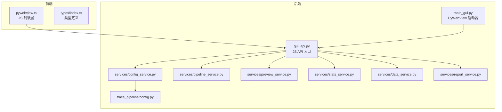
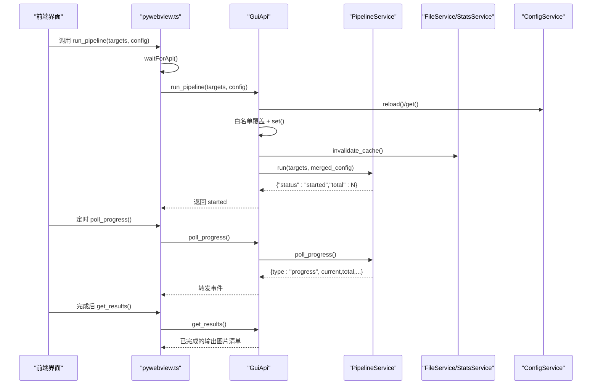
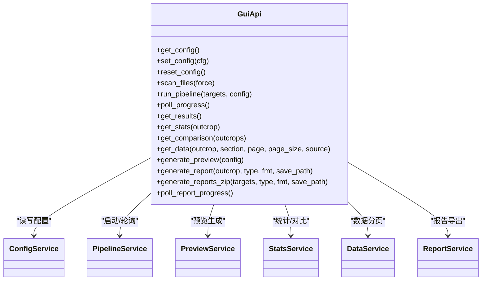

# API 接口设计

<cite>
**本文引用的文件列表**
- [backend/gui_api.py](file://backend/gui_api.py)
- [frontend/src/api/pywebview.ts](file://frontend/src/api/pywebview.ts)
- [backend/main_gui.py](file://backend/main_gui.py)
- [backend/services/config_service.py](file://backend/services/config_service.py)
- [trace_pipeline/config.py](file://trace_pipeline/config.py)
- [backend/services/pipeline_service.py](file://backend/services/pipeline_service.py)
- [backend/services/preview_service.py](file://backend/services/preview_service.py)
- [backend/services/stats_service.py](file://backend/services/stats_service.py)
- [backend/services/data_service.py](file://backend/services/data_service.py)
- [backend/services/report_service.py](file://backend/services/report_service.py)
- [frontend/src/types/index.ts](file://frontend/src/types/index.ts)
</cite>

## 目录
1. [简介](#简介)
2. [项目结构](#项目结构)
3. [核心组件](#核心组件)
4. [架构总览](#架构总览)
5. [详细组件分析](#详细组件分析)
6. [依赖关系分析](#依赖关系分析)
7. [性能考量](#性能考量)
8. [故障排查指南](#故障排查指南)
9. [结论](#结论)
10. [附录：API 参考与示例](#附录api-参考与示例)

## 简介
本文件面向 GUI 前端与后端集成人员，系统化梳理 pywebview JS API 入口（GuiApi）的所有公共方法，覆盖配置管理、文件操作、流水线控制、结果查询、数据访问、预览生成与报告导出等能力。文档包含每个方法的参数规范、返回值格式、错误处理机制、性能特征，并提供完整的请求响应示例与最佳实践建议，帮助读者快速、安全、高效地使用该 API。

## 项目结构
GUI 应用通过 PyWebView 将 Python 后端的 GuiApi 暴露为前端可调用的 JS 桥接对象。前端 TypeScript 封装层负责等待后端就绪、在浏览器环境回退到 mock 数据，并统一调用约定。

图表来源
- [backend/main_gui.py:135-175](file://backend/main_gui.py#L135-L175)
- [backend/gui_api.py:52-110](file://backend/gui_api.py#L52-L110)
- [frontend/src/api/pywebview.ts:150-185](file://frontend/src/api/pywebview.ts#L150-L185)

章节来源
- [backend/main_gui.py:1-211](file://backend/main_gui.py#L1-L211)
- [backend/gui_api.py:1-120](file://backend/gui_api.py#L1-L120)
- [frontend/src/api/pywebview.ts:1-185](file://frontend/src/api/pywebview.ts#L1-L185)

## 核心组件
- GuiApi：所有对外暴露的 JS API 方法集合，负责线程安全、资源锁、路径校验、服务懒加载与缓存失效策略。
- 服务层：ConfigService、PipelineService、PreviewService、StatsService、DataService、ReportService 分别承担配置、流水线、预览、统计、数据读取、报告导出职责。
- 前端封装：pywebview.ts 提供 waitForApi、mockApi 与统一的 api 对象，屏蔽桌面/浏览器差异。

章节来源
- [backend/gui_api.py:52-159](file://backend/gui_api.py#L52-L159)
- [backend/services/config_service.py:41-144](file://backend/services/config_service.py#L41-L144)
- [backend/services/pipeline_service.py:32-95](file://backend/services/pipeline_service.py#L32-L95)
- [backend/services/preview_service.py:37-90](file://backend/services/preview_service.py#L37-L90)
- [backend/services/stats_service.py:35-100](file://backend/services/stats_service.py#L35-L100)
- [backend/services/data_service.py:44-120](file://backend/services/data_service.py#L44-L120)
- [backend/services/report_service.py:183-245](file://backend/services/report_service.py#L183-L245)
- [frontend/src/api/pywebview.ts:150-185](file://frontend/src/api/pywebview.ts#L150-L185)

## 架构总览
下图展示一次“运行流水线”的端到端时序，包括前端等待 API 就绪、合并配置、后台并行执行与进度轮询。

图表来源
- [backend/gui_api.py:388-446](file://backend/gui_api.py#L388-L446)
- [backend/services/pipeline_service.py:42-95](file://backend/services/pipeline_service.py#L42-L95)
- [frontend/src/api/pywebview.ts:294-314](file://frontend/src/api/pywebview.ts#L294-L314)

## 详细组件分析

### 配置管理
- get_config
  - 功能：返回当前配置字典（深拷贝）。
  - 参数：无。
  - 返回：配置对象，字段见 ConfigData。
  - 错误：无业务异常；若底层 JSON 解析失败由 ConfigService 抛出，上层会记录日志。
  - 性能：O(1)，内存读取。
  - 示例：
    - 请求：get_config()
    - 响应：{ input_dir, output_dir, process_all, style, ... }
- set_config
  - 功能：合并新配置，校验后持久化，同步服务目录并失效相关缓存。
  - 参数：config 字典（仅允许已知键，未知键会被忽略并告警）。
  - 返回：合并后的完整配置。
  - 错误：非法字段或必填缺失时抛出 ValueError；保存失败抛 IO 异常。
  - 性能：磁盘写入 O(1)，含原子替换。
  - 示例：
    - 请求：set_config({ rose_bin_width: 15 })
    - 响应：更新后的配置对象
- reset_config
  - 功能：恢复默认配置并持久化。
  - 参数：无。
  - 返回：默认配置对象。
  - 错误：IO 异常。
  - 性能：O(1)。
- reset_processing_config / reset_style_config
  - 功能：仅重置处理参数或样式为空，保留其他字段。
  - 参数：无。
  - 返回：对应子集的配置对象。
  - 错误：IO 异常。
  - 性能：O(1)。

章节来源
- [backend/gui_api.py:264-334](file://backend/gui_api.py#L264-L334)
- [backend/services/config_service.py:68-144](file://backend/services/config_service.py#L68-L144)
- [trace_pipeline/config.py:148-191](file://trace_pipeline/config.py#L148-L191)

### 文件操作
- scan_files(force=false)
  - 功能：扫描 input/output 目录，返回文件条目及状态（completed/pending），支持强制刷新与外部变更检测。
  - 参数：force 布尔，是否强制刷新缓存。
  - 返回：文件列表项数组，每项包含 stem/outcrop/path/status。
  - 错误：无业务异常；IO 异常由 FileService 抛出。
  - 性能：首次扫描较慢，后续命中缓存；外部变更自动失效。
  - 示例：
    - 请求：scan_files(true)
    - 响应：[{ outcrop: "O76", status: "completed", ... }, ...]
- preload_fonts()
  - 功能：预热 matplotlib 字体缓存与样式配置，减少首次绘图延迟。
  - 参数：无。
  - 返回：包含 cjk_serif/cjk_sans/western 前三个字体的摘要。
  - 错误：捕获异常并以 { status: "error", message } 返回。
  - 性能：一次性初始化，后续调用极快。

章节来源
- [backend/gui_api.py:336-386](file://backend/gui_api.py#L336-L386)

### 流水线控制
- run_pipeline(targets, config)
  - 功能：启动后台并行流水线，非阻塞返回。
  - 参数：
    - targets: 露头名称字符串数组。
    - config: 运行时覆盖配置（仅白名单字段可覆盖：处理参数与 style/parallel_workers）。
  - 返回：{"status":"started","total":N} 或错误对象。
  - 错误：目标名不合法或空列表返回错误；内部异常包装为错误对象。
  - 性能：根据 parallel_workers 与 CPU 核心数并行执行；队列最大长度 2000。
  - 示例：
    - 请求：run_pipeline(["O76","O77"], { parallel_workers: 0 })
    - 响应：{"status":"started","total":2}
- poll_progress()
  - 功能：前端轮询获取进度事件（start/progress/file_complete/complete/error）。
  - 参数：无。
  - 返回：单条事件或 null。
  - 错误：无。
  - 性能：非阻塞，O(1) 出队。

章节来源
- [backend/gui_api.py:388-456](file://backend/gui_api.py#L388-L456)
- [backend/services/pipeline_service.py:42-95](file://backend/services/pipeline_service.py#L42-L95)

### 结果查询
- get_results()
  - 功能：扫描 output 目录，返回已完成处理的原始图、旋转图、玫瑰图路径。
  - 参数：无。
  - 返回：结果数组，每项包含 outcrop/raw_plot/rotated_plot/rose_plot。
  - 错误：无业务异常；IO 异常由底层抛出。
  - 性能：目录遍历 O(N)，配合输出目录变更检测避免重复计算。
- get_stats(outcrop)
  - 功能：计算并返回指定露头的统计数据（含直方图、节点识别、覆盖层几何等）。
  - 参数：outcrop 字符串。
  - 返回：StatsData 对象。
  - 错误：输入不存在或无迹线时返回 error 字段。
  - 性能：带 TTL 缓存，命中即返回；首次计算耗时取决于数据量。
- get_comparison(outcrops)
  - 功能：批量对比多个露头的统计指标，保持输入顺序。
  - 参数：outcrops 字符串数组。
  - 返回：ComparisonRow[]。
  - 错误：单个露头失败不影响其他。
  - 性能：复用 get_stats 缓存。

章节来源
- [backend/gui_api.py:459-553](file://backend/gui_api.py#L459-L553)
- [backend/services/stats_service.py:101-380](file://backend/services/stats_service.py#L101-L380)

### 数据访问
- get_data(outcrop, section, page=1, page_size=20, source="output")
  - 功能：分页读取 Excel 数据（output 多工作表或 input 原始输入）。
  - 参数：
    - outcrop: 露头标识。
    - section: 分区名（如“基本信息”、“原始坐标”等）。
    - page/page_size: 分页参数（page_size 上限 500）。
    - source: "output"|"input"。
  - 返回：DataPageResult（data/total/columns）。
  - 错误：文件不存在、Sheet 不存在、IO 异常等以 error 字段返回。
  - 性能：TTL 缓存按文件签名与 sheet 组合键；分页 O(k)。

章节来源
- [backend/gui_api.py:556-599](file://backend/gui_api.py#L556-L599)
- [backend/services/data_service.py:78-188](file://backend/services/data_service.py#L78-L188)

### 预览生成
- generate_preview(config)
  - 功能：基于固定演示数据渲染样式预览图（原始/旋转/玫瑰），支持并发限制与缓存。
  - 参数：包含 style 与 overlay 开关的配置片段。
  - 返回：{ status:"ready", paths:{raw,rotated,rose}, images:[...] } 或错误。
  - 错误：并发冲突返回 busy；渲染异常返回 error。
  - 性能：TTL 缓存按样式哈希；DPI 300，生成速度受 DPI 影响。

章节来源
- [backend/gui_api.py:602-628](file://backend/gui_api.py#L602-L628)
- [backend/services/preview_service.py:45-90](file://backend/services/preview_service.py#L45-L90)

### 报告导出
- generate_report(outcrop, report_type, fmt, save_path?)
  - 功能：生成 DOCX/PDF 报告，可选保存到用户选择路径。
  - 参数：
    - outcrop: 露头标识。
    - report_type: "full"|"stats"|"plots"。
    - fmt: "docx"|"pdf"|"both"。
    - save_path: 可选绝对路径（需通过安全校验）。
  - 返回：包含 docx/pdf 路径的对象，或保存成功返回 { path, format }。
  - 错误：越权路径、源文件不存在、依赖未安装等返回 error。
  - 性能：TTL 缓存按配置指纹；并发使用 _report_lock 串行化。
- generate_reports_zip(targets, report_type, fmt, save_path?)
  - 功能：批量生成报告并打包 ZIP，支持进度回调。
  - 参数：同 generate_report，targets 为多个露头。
  - 返回：zip_path/count/errors 或错误对象。
  - 错误：全部失败返回错误；部分失败累积 errors。
  - 性能：共享 _report_lock，避免中间产物冲突。
- poll_report_progress()
  - 功能：前端轮询报告导出进度（progress/complete/error）。
  - 参数：无。
  - 返回：单条进度事件或 null。
  - 错误：无。

章节来源
- [backend/gui_api.py:639-800](file://backend/gui_api.py#L639-L800)
- [backend/services/report_service.py:245-364](file://backend/services/report_service.py#L245-L364)

## 依赖关系分析
- 前端依赖
  - pywebview.ts 依赖 types/index.ts 的类型定义，确保前后端数据结构一致。
- 后端依赖
  - GuiApi 依赖各 Service 与 trace_pipeline.config 进行配置校验与路径解析。
  - PipelineService 依赖 multiprocessing 与 ProcessPoolExecutor 实现并行。
  - StatsService/DataService 依赖 pandas/numpy 进行数据处理与缓存。
  - ReportService 依赖 python-docx/reportlab 生成报告，具备字体探测与混合排版逻辑。

图表来源
- [backend/gui_api.py:52-159](file://backend/gui_api.py#L52-L159)
- [backend/services/config_service.py:41-144](file://backend/services/config_service.py#L41-L144)
- [backend/services/pipeline_service.py:32-95](file://backend/services/pipeline_service.py#L32-L95)
- [backend/services/preview_service.py:37-90](file://backend/services/preview_service.py#L37-L90)
- [backend/services/stats_service.py:35-100](file://backend/services/stats_service.py#L35-L100)
- [backend/services/data_service.py:44-120](file://backend/services/data_service.py#L44-L120)
- [backend/services/report_service.py:183-245](file://backend/services/report_service.py#L183-L245)

章节来源
- [frontend/src/types/index.ts:1-167](file://frontend/src/types/index.ts#L1-L167)

## 性能考量
- 并发与锁
  - 预览与报告导出使用互斥锁防止并发导致资源耗尽。
  - 流水线使用进程池并行执行，workers 数量受 parallel_workers 与 CPU 核心数约束。
- 缓存策略
  - 统计、数据、预览、报告均使用 TTLCache，键包含配置指纹与文件签名，避免不必要重算。
- I/O 与目录变更
  - 输出目录变更检测自动失效文件与统计缓存，保证一致性。
- 网络与序列化
  - 前端异步调用，后端返回轻量结构化对象，避免大对象频繁传输。

[本节为通用指导，无需具体文件引用]

## 故障排查指南
- WebView2 未安装
  - 现象：启动提示需要安装 WebView2 Runtime。
  - 处理：点击页面链接下载并安装后重启程序。
- 配置保存失败
  - 现象：set_config 抛出 IO 异常。
  - 处理：检查配置文件权限与磁盘空间；确认临时文件未被占用。
- 流水线卡住或中断
  - 现象：窗口关闭时仍在写入文件或 Excel 被占用。
  - 处理：关闭占用文件的程序；等待优雅关闭超时；查看日志中的 PermissionError/FileNotFoundError 提示。
- 报告生成失败
  - 现象：DOCX/PDF 生成报错或缺少依赖。
  - 处理：安装 python-docx/reportlab；检查系统字体；确认输出目录存在且可写。
- 数据读取失败
  - 现象：Sheet 不存在或输入文件为空。
  - 处理：重新处理该露头以生成新格式文件；检查输入文件格式与列名。

章节来源
- [backend/main_gui.py:97-133](file://backend/main_gui.py#L97-L133)
- [backend/services/config_service.py:128-144](file://backend/services/config_service.py#L128-L144)
- [backend/services/pipeline_service.py:74-95](file://backend/services/pipeline_service.py#L74-L95)
- [backend/services/data_service.py:120-158](file://backend/services/data_service.py#L120-L158)
- [backend/services/report_service.py:416-478](file://backend/services/report_service.py#L416-L478)

## 结论
本 API 设计围绕“安全、稳定、高性能”展开：通过严格的白名单与路径校验保障安全；通过进程池与多级缓存提升性能；通过完善的错误处理与日志定位问题。前端封装层屏蔽了桌面/浏览器差异，使开发者可以专注于业务逻辑。

[本节为总结性内容，无需具体文件引用]

## 附录：API 参考与示例

### 配置管理
- get_config()
  - 请求：无参
  - 响应：ConfigData
  - 示例：
    - 请求：get_config()
    - 响应：{ input_dir: "...", output_dir: "...", process_all: true, style: {...}, ... }
- set_config(config)
  - 请求：{ rose_bin_width: 15 }
  - 响应：合并后的完整配置
- reset_config()
  - 请求：无参
  - 响应：默认配置
- reset_processing_config() / reset_style_config()
  - 请求：无参
  - 响应：处理参数或样式子集

章节来源
- [backend/gui_api.py:264-334](file://backend/gui_api.py#L264-L334)
- [frontend/src/types/index.ts:107-132](file://frontend/src/types/index.ts#L107-L132)

### 文件操作
- scan_files(force=false)
  - 请求：scan_files(true)
  - 响应：[{ outcrop: "O76", status: "completed", path: "...", stem: "..." }, ...]
- preload_fonts()
  - 请求：preload_fonts()
  - 响应：{ status: "ok", cjk_serif: [...], cjk_sans: [...], western: [...] }

章节来源
- [backend/gui_api.py:336-386](file://backend/gui_api.py#L336-L386)

### 流水线控制
- run_pipeline(targets, config)
  - 请求：run_pipeline(["O76","O77"], { parallel_workers: 0 })
  - 响应：{"status":"started","total":2}
- poll_progress()
  - 请求：poll_progress()
  - 响应：{"type":"progress","current":1,"total":2,"filename":"O76_process","message":"..."}

章节来源
- [backend/gui_api.py:388-456](file://backend/gui_api.py#L388-L456)
- [backend/services/pipeline_service.py:42-95](file://backend/services/pipeline_service.py#L42-L95)

### 结果查询
- get_results()
  - 请求：get_results()
  - 响应：[{ outcrop: "O76", raw_plot: "...", rotated_plot: "...", rose_plot: "..." }, ...]
- get_stats(outcrop)
  - 请求：get_stats("O76")
  - 响应：StatsData（含 trace_count、p10、p20、p21、histogram、nodes 等）
- get_comparison(outcrops)
  - 请求：get_comparison(["O76","O77"])
  - 响应：ComparisonRow[]

章节来源
- [backend/gui_api.py:459-553](file://backend/gui_api.py#L459-L553)
- [backend/services/stats_service.py:101-380](file://backend/services/stats_service.py#L101-L380)
- [frontend/src/types/index.ts:46-98](file://frontend/src/types/index.ts#L46-98)

### 数据访问
- get_data(outcrop, section, page, page_size, source)
  - 请求：get_data("O76", "基本信息", 1, 20, "output")
  - 响应：{ data: [...], total: N, columns: ["r1-沿测线位移","r2-垂直测线位移",...] }

章节来源
- [backend/gui_api.py:556-599](file://backend/gui_api.py#L556-L599)
- [backend/services/data_service.py:78-188](file://backend/services/data_service.py#L78-L188)
- [frontend/src/types/index.ts:134-139](file://frontend/src/types/index.ts#L134-L139)

### 预览生成
- generate_preview(config)
  - 请求：generate_preview({ style: {...}, show_hull: true, show_circles: true, show_nodes: true })
  - 响应：{ status: "ready", paths: { raw: "...", rotated: "...", rose: "..." }, images: [{ key, label, path }, ...] }

章节来源
- [backend/gui_api.py:602-628](file://backend/gui_api.py#L602-L628)
- [backend/services/preview_service.py:45-90](file://backend/services/preview_service.py#L45-L90)

### 报告导出
- generate_report(outcrop, report_type, fmt, save_path?)
  - 请求：generate_report("O76", "full", "both", "C:\\Users\\Me\\Desktop\\O76_report.docx")
  - 响应：{ path: "C:\\Users\\Me\\Desktop\\O76_report.docx", format: "docx" }
- generate_reports_zip(targets, report_type, fmt, save_path?)
  - 请求：generate_reports_zip(["O76","O77"], "full", "both", "C:\\Users\\Me\\Desktop\\reports.zip")
  - 响应：{ zip_path: "...", count: 2, errors: [] }
- poll_report_progress()
  - 请求：poll_report_progress()
  - 响应：{"type":"progress","step":"docx","message":"正在生成 DOCX..."}

章节来源
- [backend/gui_api.py:639-800](file://backend/gui_api.py#L639-L800)
- [backend/services/report_service.py:245-364](file://backend/services/report_service.py#L245-L364)

### 最佳实践
- 配置更新
  - 优先使用 set_config 局部更新，避免全量覆盖；注意白名单字段限制。
- 流水线执行
  - 合理设置 parallel_workers（0 表示自动）；在 UI 中轮询 poll_progress 并显示进度。
- 结果与数据
  - 使用 get_results 获取最新输出；对大数据表格采用分页读取，避免一次性加载过多数据。
- 预览与报告
  - 预览与报告生成具有并发锁，应避免高频重复调用；利用缓存键减少重复计算。
- 安全与健壮性
  - 保存路径必须通过 ask_save_path/browse_folder 获取，避免越权路径；捕获错误并友好提示。

[本节为通用指导，无需具体文件引用]