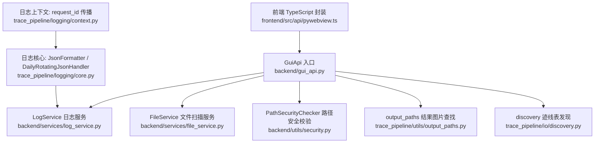
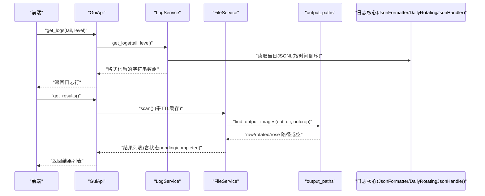
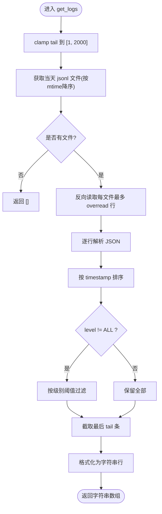
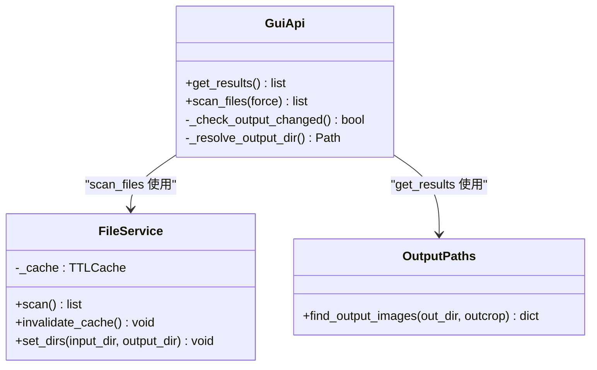
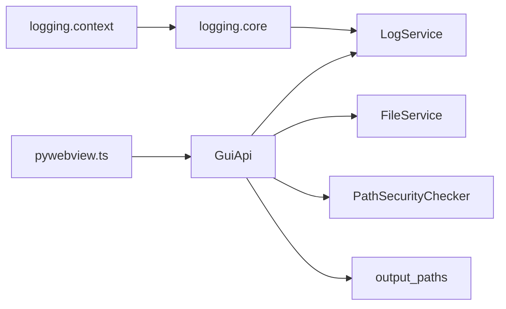

# 工具类 API

<cite>
**本文引用的文件**   
- [backend/gui_api.py](file://backend/gui_api.py)
- [backend/services/log_service.py](file://backend/services/log_service.py)
- [backend/services/file_service.py](file://backend/services/file_service.py)
- [trace_pipeline/logging/core.py](file://trace_pipeline/logging/core.py)
- [trace_pipeline/logging/context.py](file://trace_pipeline/logging/context.py)
- [backend/utils/security.py](file://backend/utils/security.py)
- [backend/utils/path_utils.py](file://backend/utils/path_utils.py)
- [trace_pipeline/io/discovery.py](file://trace_pipeline/io/discovery.py)
- [trace_pipeline/utils/output_paths.py](file://trace_pipeline/utils/output_paths.py)
- [frontend/src/api/pywebview.ts](file://frontend/src/api/pywebview.ts)
- [tests/test_gui_api.py](file://tests/test_gui_api.py)
- [tests/test_logging.py](file://tests/test_logging.py)
</cite>

## 目录
1. [简介](#简介)
2. [项目结构](#项目结构)
3. [核心组件](#核心组件)
4. [架构总览](#架构总览)
5. [详细组件分析](#详细组件分析)
6. [依赖关系分析](#依赖关系分析)
7. [性能与容量特性](#性能与容量特性)
8. [安全与权限控制](#安全与权限控制)
9. [日志格式规范与查询语法](#日志格式规范与查询语法)
10. [结果查询机制与状态判断](#结果查询机制与状态判断)
11. [调试与故障排除指南](#调试与故障排除指南)
12. [结论](#结论)

## 简介
本文件面向“工具类 API”的开发者与维护者，聚焦以下两个辅助功能接口：
- get_logs（日志查询）
- get_results（结果查询）

文档将系统阐述日志系统的整体架构、日志级别过滤与滚动策略、日志记录格式与查询语法；并解释结果查询的文件扫描机制、状态判断与路径解析。同时覆盖安全校验机制、路径遍历防护与权限控制，并提供调试与排障最佳实践。

## 项目结构
后端通过 GuiApi 暴露给前端（pywebview），其中：
- get_logs 调用 LogService 读取结构化 JSON Lines 日志
- get_results 基于输出目录扫描结果图片，返回结果列表
- 日志写入由 trace_pipeline.logging.core 提供 JsonFormatter 与按天/按大小滚动的 DailyRotatingJsonHandler
- 安全校验由 PathSecurityChecker 统一实现，防止路径遍历与设备名攻击
- 输入/输出目录发现与匹配由 discovery 与 output_paths 模块完成

图表来源
- [backend/gui_api.py](file://backend/gui_api.py)
- [backend/services/log_service.py](file://backend/services/log_service.py)
- [backend/services/file_service.py](file://backend/services/file_service.py)
- [trace_pipeline/logging/core.py](file://trace_pipeline/logging/core.py)
- [trace_pipeline/logging/context.py](file://trace_pipeline/logging/context.py)
- [backend/utils/security.py](file://backend/utils/security.py)
- [trace_pipeline/utils/output_paths.py](file://trace_pipeline/utils/output_paths.py)
- [trace_pipeline/io/discovery.py](file://trace_pipeline/io/discovery.py)
- [frontend/src/api/pywebview.ts](file://frontend/src/api/pywebview.ts)

章节来源
- [backend/gui_api.py](file://backend/gui_api.py)
- [frontend/src/api/pywebview.ts](file://frontend/src/api/pywebview.ts)

## 核心组件
- GuiApi：对外暴露的 JS Bridge 方法集合，包含 get_logs 与 get_results 等工具方法，负责参数校验、缓存失效、并发锁与安全校验。
- LogService：读取 logs 目录下当天 JSONL 日志，支持 tail 行数限制与 level 过滤，采用反向高效读取避免全量加载大文件。
- FileService：扫描 input 目录中的迹线表文件，结合 output 目录中是否存在特定命名规则的图片，判定处理状态 pending/completed。
- 日志核心：JsonFormatter 输出标准 JSON Lines；DailyRotatingJsonHandler 支持按天归档、按大小分片与旧日打包清理。
- 安全校验：PathSecurityChecker 对任意路径进行 URL 解码、.. 检查、Windows 设备名检查、符号链接解析与基准目录约束。
- 结果查找：output_paths.find_output_images 使用安全 glob 模式定位 raw/rotated/rose 三类结果图。

章节来源
- [backend/gui_api.py](file://backend/gui_api.py)
- [backend/services/log_service.py](file://backend/services/log_service.py)
- [backend/services/file_service.py](file://backend/services/file_service.py)
- [trace_pipeline/logging/core.py](file://trace_pipeline/logging/core.py)
- [backend/utils/security.py](file://backend/utils/security.py)
- [trace_pipeline/utils/output_paths.py](file://trace_pipeline/utils/output_paths.py)

## 架构总览
get_logs 与 get_results 的端到端调用流程如下：

图表来源
- [backend/gui_api.py](file://backend/gui_api.py)
- [backend/services/log_service.py](file://backend/services/log_service.py)
- [backend/services/file_service.py](file://backend/services/file_service.py)
- [trace_pipeline/utils/output_paths.py](file://trace_pipeline/utils/output_paths.py)
- [trace_pipeline/logging/core.py](file://trace_pipeline/logging/core.py)

## 详细组件分析

### get_logs（日志查询）
- 入口：GuiApi.get_logs
  - 参数校验与限幅：tail 强制为整数并在 [1, 2000] 范围内截断；level 默认 INFO。
  - 委托 LogService.get_logs 执行实际读取与过滤。
- 日志读取策略（LogService）：
  - 仅读取当天目录下的 jsonl 文件，最多取最近修改时间的若干文件，避免跨天/历史数据污染。
  - 单文件过大时跳过，防止 OOM。
  - 使用反向读取（tail_lines）从文件末尾逐块读取，内存上限保护，避免整文件加载。
  - 解析 JSON Lines，按 timestamp 排序后按 level 阈值过滤，再截取最后 N 条。
  - 将结构化记录格式化为人类可读的行字符串，包含时间戳、级别、模块、请求ID（可选）、耗时（可选）。
- 日志级别过滤：
  - 内置映射：DEBUG=10, INFO=20, WARNING/WARN=30, ERROR=40, CRITICAL=50；ALL 不过滤。
  - 仅保留 levelno >= 阈值的记录。
- 错误与健壮性：
  - 非法 JSON 行跳过；OSError 读取失败记录警告；超大文件跳过。

图表来源
- [backend/gui_api.py](file://backend/gui_api.py)
- [backend/services/log_service.py](file://backend/services/log_service.py)

章节来源
- [backend/gui_api.py](file://backend/gui_api.py)
- [backend/services/log_service.py](file://backend/services/log_service.py)
- [tests/test_gui_api.py](file://tests/test_gui_api.py)

### get_results（结果查询）
- 入口：GuiApi.get_results
  - 检测 output 目录外部变更，必要时使缓存失效。
  - 解析配置得到 output_dir，扫描 *.png 中符合 {outcrop}_raw(n=*).png 的文件名，提取 outcrop。
  - 调用 find_output_images 获取 raw/rotated/rose 三张图的绝对路径（若存在）。
  - 返回结果列表，每项包含 outcrop 及三个图片路径字段。
- 文件扫描机制（FileService.scan）：
  - 扫描 input 目录，匹配 *_process.xlsx/.xls 作为迹线表。
  - 在 output 目录中根据 outcrop 名称匹配 _raw(n=*).png 与 _rotated(strike=*).png 是否存在，据此设置 status=pending/completed。
  - 使用 TTLCache 缓存扫描结果，减少重复 IO。
- 状态判断：
  - 当 raw 与 rotated 两张图均存在时为 completed，否则为 pending。
- 路径解析：
  - 使用 resolve_path 将相对路径解析为绝对路径；输出路径来自 output_dir 配置。

图表来源
- [backend/gui_api.py](file://backend/gui_api.py)
- [backend/services/file_service.py](file://backend/services/file_service.py)
- [trace_pipeline/utils/output_paths.py](file://trace_pipeline/utils/output_paths.py)

章节来源
- [backend/gui_api.py](file://backend/gui_api.py)
- [backend/services/file_service.py](file://backend/services/file_service.py)
- [trace_pipeline/utils/output_paths.py](file://trace_pipeline/utils/output_paths.py)
- [trace_pipeline/io/discovery.py](file://trace_pipeline/io/discovery.py)

## 依赖关系分析
- 前端通过 pywebview.ts 的 api 对象调用后端方法，包括 get_logs 与 get_results。
- GuiApi 组合多个服务：LogService、FileService、StatsService、DataService、ReportService、AuditService 等，按需懒加载。
- 日志核心模块被 setup_logging 注入到 trace_pipeline 与 backend logger，确保统一输出到同一 JSONL 文件。
- 安全校验贯穿所有涉及用户输入路径的方法，如 generate_report 保存路径、图像访问等。

图表来源
- [frontend/src/api/pywebview.ts](file://frontend/src/api/pywebview.ts)
- [backend/gui_api.py](file://backend/gui_api.py)
- [backend/services/log_service.py](file://backend/services/log_service.py)
- [backend/services/file_service.py](file://backend/services/file_service.py)
- [backend/utils/security.py](file://backend/utils/security.py)
- [trace_pipeline/utils/output_paths.py](file://trace_pipeline/utils/output_paths.py)
- [trace_pipeline/logging/core.py](file://trace_pipeline/logging/core.py)
- [trace_pipeline/logging/context.py](file://trace_pipeline/logging/context.py)

章节来源
- [frontend/src/api/pywebview.ts](file://frontend/src/api/pywebview.ts)
- [backend/gui_api.py](file://backend/gui_api.py)

## 性能与容量特性
- 日志读取：
  - 反向读取限制最大缓冲（约 2MB），避免大文件导致内存暴涨。
  - 单文件超过阈值（约 10MB）直接跳过，保证稳定性。
  - 仅读取当天目录，且限制文件数量，降低 IO 压力。
- 结果扫描：
  - scan 结果使用 TTL 缓存（默认 30s），减少频繁扫描。
  - output 目录变更检测器自动失效相关缓存，保持数据一致性。
- 并发控制：
  - 重资源操作（预览、报告生成）使用运行锁，避免并发导致的资源耗尽。
  - 日志归档与分片使用线程锁，避免竞态。

[本节为通用性能讨论，不直接分析具体文件]

## 安全与权限控制
- 路径遍历防护：
  - PathSecurityChecker 递归 URL 解码，拒绝包含 .. 的路径，拒绝 Windows 设备名，解析符号链接后限制在 base 目录内。
- 可信目录白名单：
  - GuiApi 维护 trusted file bases（项目根、input_dir、output_dir、report 目录），仅允许在这些目录内操作。
- 用户选择路径登记：
  - 通过对话框选择的绝对路径需登记，后续访问才放行，防止任意路径读写。
- 配置覆盖白名单：
  - run_pipeline 仅允许覆盖处理与样式相关字段，禁止前端覆盖 input_dir/output_dir 等路径字段。

章节来源
- [backend/utils/security.py](file://backend/utils/security.py)
- [backend/gui_api.py](file://backend/gui_api.py)
- [tests/test_gui_api.py](file://tests/test_gui_api.py)

## 日志格式规范与查询语法

### 日志格式规范
- 存储格式：JSON Lines（每行一个 JSON 对象）。
- 字段定义：
  - timestamp：ISO 8601 时间（UTC）
  - level：日志级别名称（DEBUG/INFO/WARNING/WARN/ERROR/CRITICAL）
  - logger：logger 名称
  - module：模块名
  - funcName：函数名
  - lineno：行号
  - message：消息文本
  - request_id：当前请求 ID（如有）
  - exc_info：异常堆栈（如有）
  - extra：扩展字段（通过 extra= 传入）
- 数值清洗：
  - NaN/Inf 会被替换为 None，确保合法 JSON。
- 滚动策略：
  - 按天目录：logs/YYYY-MM-DD/run_XXX.jsonl
  - 按大小分片：run_XXX_part_N.jsonl（超过单文件大小阈值自动分片）
  - 旧日归档：非当天日期目录打包为 zip 后删除
  - 保留期限：zip 归档保留固定天数后清理

章节来源
- [trace_pipeline/logging/core.py](file://trace_pipeline/logging/core.py)
- [tests/test_logging.py](file://tests/test_logging.py)

### 查询语法与行为
- get_logs 参数：
  - tail：整数，范围 [1, 2000]，超出将被截断
  - level：字符串，支持 DEBUG/INFO/WARNING/WARN/ERROR/CRITICAL/ALL
- 过滤逻辑：
  - 先按 timestamp 排序，再按 level 阈值过滤，最后截取最后 tail 条
- 输出格式：
  - 字符串数组，每行包含时间戳、级别、模块、消息，以及可选的请求ID与耗时信息

章节来源
- [backend/gui_api.py](file://backend/gui_api.py)
- [backend/services/log_service.py](file://backend/services/log_service.py)

## 结果查询机制与状态判断

### 文件扫描机制
- 输入扫描：
  - 匹配 *_process.xlsx/.xls 作为迹线表，去重规则按 stem 小写键值。
- 输出扫描：
  - 根据 outcrop 名称匹配 raw/rotated/rose 三类图片，使用安全的 glob 模式构建，避免通配符误解析。
- 状态判断：
  - 若 raw 与 rotated 两张图均存在，则 status=completed；否则为 pending。

### 路径解析
- 使用 resolve_path 将相对路径解析为绝对路径，基准目录为 PROJECT_ROOT 或指定 base。
- output_dir 从配置读取，若非绝对路径则拼接项目根后再解析。

章节来源
- [backend/services/file_service.py](file://backend/services/file_service.py)
- [trace_pipeline/io/discovery.py](file://trace_pipeline/io/discovery.py)
- [trace_pipeline/utils/output_paths.py](file://trace_pipeline/utils/output_paths.py)
- [backend/utils/path_utils.py](file://backend/utils/path_utils.py)
- [backend/gui_api.py](file://backend/gui_api.py)

## 调试与故障排除指南

### 常见问题与诊断
- 日志为空或无新记录：
  - 确认当天目录是否存在，是否写入成功；检查单文件大小是否超过阈值导致跳过。
  - 检查 level 过滤是否过严（例如设置为 CRITICAL 会只保留严重日志）。
- 结果列表为空：
  - 确认 input 目录中存在 *_process.xlsx/.xls 文件；确认 output 目录中已生成对应图片。
  - 检查 output 目录变更检测是否生效，必要时强制刷新 scan_files。
- 路径越权或拒绝访问：
  - 检查是否使用了未登记的外部绝对路径；确认路径是否在可信目录白名单内。
  - 检查是否存在 .. 或 Windows 设备名等非法路径片段。
- 性能问题：
  - 日志 tail 过大导致响应慢，建议控制在合理范围（如 200~500）。
  - 频繁扫描 input/output 目录，利用缓存与变更检测减少 IO。

### 最佳实践
- 使用 request_id 追踪一次请求的全链路日志，便于定位问题。
- 在关键路径添加 extra 字段（如 stage、duration_ms），提升可观测性。
- 定期清理 logs 下旧 zip 归档，避免磁盘占用过高。
- 对 get_logs 的 tail 做前端限幅，避免一次性拉取过多数据。

章节来源
- [trace_pipeline/logging/core.py](file://trace_pipeline/logging/core.py)
- [trace_pipeline/logging/context.py](file://trace_pipeline/logging/context.py)
- [backend/gui_api.py](file://backend/gui_api.py)
- [backend/services/log_service.py](file://backend/services/log_service.py)
- [backend/services/file_service.py](file://backend/services/file_service.py)
- [backend/utils/security.py](file://backend/utils/security.py)

## 结论
get_logs 与 get_results 作为工具类 API，分别提供了高效的日志查询与结果扫描能力。其设计强调安全性（路径校验与白名单）、性能（反向读取、缓存与变更检测）与可观测性（结构化 JSONL 与 request_id 传播）。遵循本文档的格式规范与查询语法，并结合调试与排障建议，可有效提升开发与运维效率。