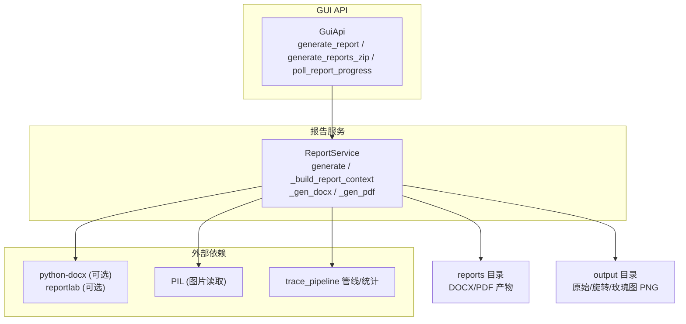
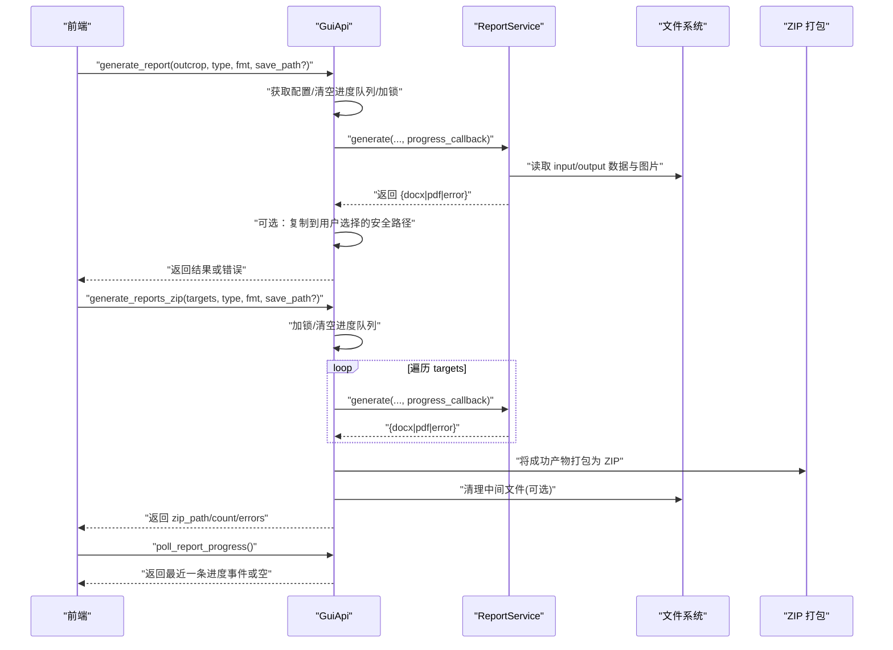
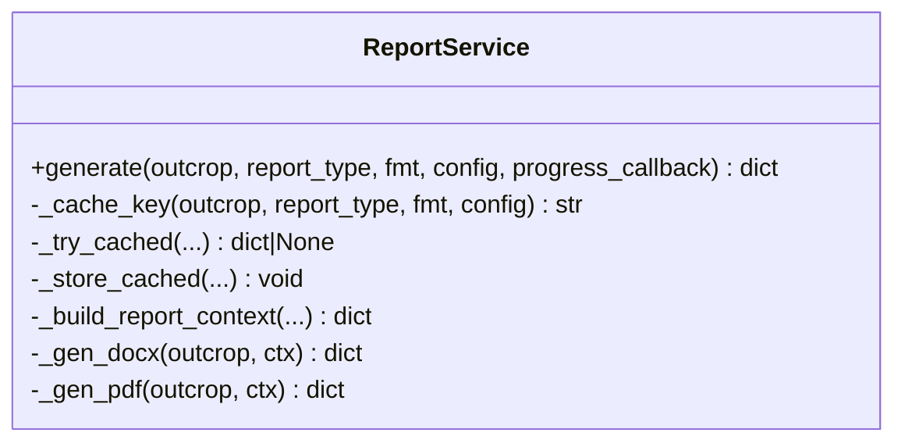
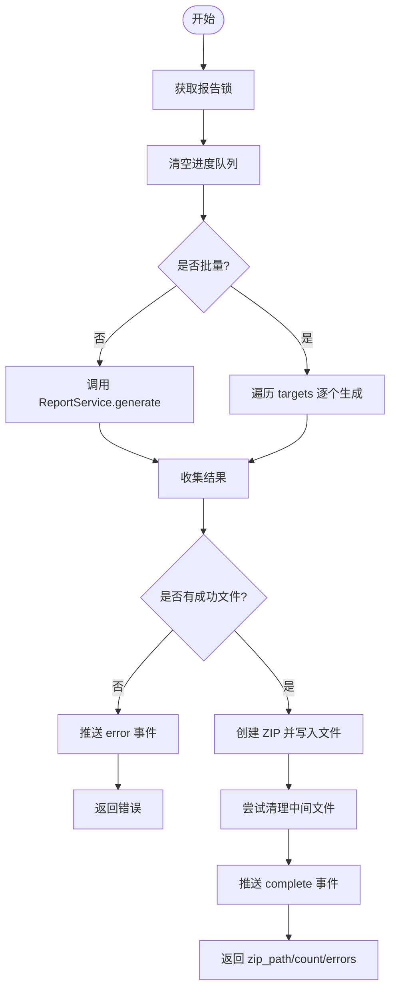
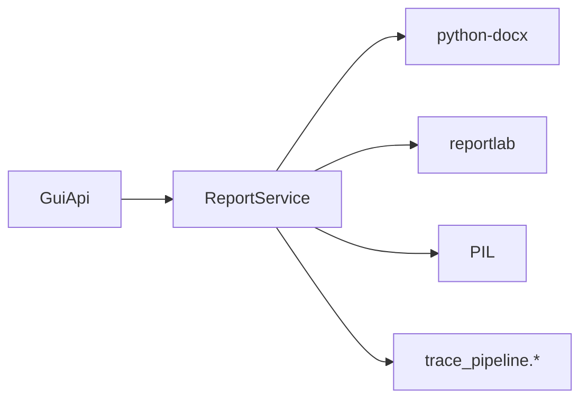

# 报告导出 API

<cite>
**本文引用的文件**   
- [backend/services/report_service.py](file://backend/services/report_service.py)
- [backend/gui_api.py](file://backend/gui_api.py)
- [tests/test_report_service.py](file://tests/test_report_service.py)
- [tests/test_gui_api.py](file://tests/test_gui_api.py)
- [config.example.json](file://config.example.json)
</cite>

## 目录
1. [简介](#简介)
2. [项目结构](#项目结构)
3. [核心组件](#核心组件)
4. [架构总览](#架构总览)
5. [详细组件分析](#详细组件分析)
6. [依赖关系分析](#依赖关系分析)
7. [性能与缓存](#性能与缓存)
8. [故障排查指南](#故障排查指南)
9. [结论](#结论)
10. [附录：API 定义与示例](#附录api-定义与示例)

## 简介
本文件面向“报告导出”能力，系统性解析以下接口与工作流：
- generate_report（单露头报告生成）
- generate_reports_zip（批量报告打包）
- poll_report_progress（进度轮询）

内容涵盖：
- 报告模板系统、样式定制与内容自定义方法
- 数据加载与统计计算流程
- 文件格式支持（DOCX/PDF）
- 批量处理机制、错误隔离与进度追踪
- ZIP 打包算法、文件命名规范与存储策略
- 完整工作流示例与错误处理最佳实践

## 项目结构
报告导出相关代码主要位于后端服务层与 GUI API 层：
- 服务层：ReportService 负责报告上下文构建、DOCX/PDF 渲染与结果缓存
- API 层：GuiApi 暴露前端可调用的接口，负责并发控制、审计日志、路径安全校验、ZIP 打包与进度队列管理
- 配置：config.example.json 提供影响报告生成的关键参数（如输入输出目录、窗口策略、玫瑰图分箱宽度等）

图示来源
- [backend/gui_api.py:644-853](file://backend/gui_api.py#L644-L853)
- [backend/services/report_service.py:183-579](file://backend/services/report_service.py#L183-L579)

章节来源
- [backend/gui_api.py:644-853](file://backend/gui_api.py#L644-L853)
- [backend/services/report_service.py:183-579](file://backend/services/report_service.py#L183-L579)
- [config.example.json:1-26](file://config.example.json#L1-L26)

## 核心组件
- ReportService
  - 职责：统一构建报告上下文（统计文本行、图片路径），分别生成 DOCX 与 PDF，并维护基于配置与图片修改时间的 TTL 缓存。
  - 关键点：跨平台字体探测与注册、中英文混排 HTML 片段拆分、图片尺寸自适应、错误隔离与日志记录。
- GuiApi
  - 职责：对外暴露 generate_report、generate_reports_zip、poll_report_progress；实现并发锁、审计日志、路径安全校验、ZIP 打包与进度事件队列。
  - 关键点：共享 _report_lock 避免并发写入同名中间产物；ZIP 仅允许来自受信目录的文件；失败路径推送 error 而非 complete。

章节来源
- [backend/services/report_service.py:183-579](file://backend/services/report_service.py#L183-L579)
- [backend/gui_api.py:644-853](file://backend/gui_api.py#L644-L853)

## 架构总览
下图展示从前端调用到报告产物的端到端流程，包括进度事件与错误传播。

图示来源
- [backend/gui_api.py:644-853](file://backend/gui_api.py#L644-L853)
- [backend/services/report_service.py:245-364](file://backend/services/report_service.py#L245-L364)

## 详细组件分析

### 报告服务 ReportService
- 报告上下文构建
  - 根据 report_type 决定包含的统计项与图片集合。
  - 图片来源于 output 目录，按固定命名规则匹配 raw/rotated/rose 三张 PNG。
- DOCX 生成
  - 使用 python-docx 设置标题与正文样式，插入统计文本与图片。
  - 文件名：{outcrop}_report.docx，存放于 reports 目录。
- PDF 生成
  - 使用 reportlab 注册多套字体（拉丁/中文标题/中文正文），对中英文混排进行分段渲染。
  - 图片按最大宽度缩放后插入，异常跳过并记录警告。
  - 文件名：{outcrop}_report.pdf，存放于 reports 目录。
- 缓存策略
  - 基于 outcrop、report_type、fmt 与关键配置子集生成稳定哈希键。
  - 结合图片 mtime 失效检测，TTL 过期自动失效。

图示来源
- [backend/services/report_service.py:183-579](file://backend/services/report_service.py#L183-L579)

章节来源
- [backend/services/report_service.py:245-364](file://backend/services/report_service.py#L245-L364)
- [backend/services/report_service.py:366-413](file://backend/services/report_service.py#L366-L413)
- [backend/services/report_service.py:416-478](file://backend/services/report_service.py#L416-L478)
- [backend/services/report_service.py:481-579](file://backend/services/report_service.py#L481-L579)
- [tests/test_report_service.py:9-51](file://tests/test_report_service.py#L9-L51)

### GUI API 报告导出接口
- generate_report
  - 并发控制：使用 _report_lock 防止重复执行。
  - 审计日志：记录入参与阶段信息。
  - 进度回调：每次调用前清空进度队列，生成过程中通过回调推送步骤消息，完成后推送 complete。
  - 保存路径：若指定 save_path，需通过安全校验（白名单/用户选择登记），否则直接返回默认 reports 目录中的路径。
- generate_reports_zip
  - 并发控制：与 generate_report 共用 _report_lock，避免并发写入同名中间产物。
  - 批量处理：逐个调用 ReportService.generate，收集成功产物，失败累积 errors。
  - ZIP 打包：仅允许来自受信目录（PROJECT_ROOT、input_dir、output_dir、reports）的文件；压缩算法为 DEFLATED。
  - 清理策略：打包成功后尝试删除中间文件（仅允许安全基准内）。
  - 进度事件：失败路径推送 error，不推送 complete；成功路径推送 complete。
- poll_report_progress
  - 非阻塞地从内部队列取出一条最新事件，供前端轮询显示进度。

图示来源
- [backend/gui_api.py:644-853](file://backend/gui_api.py#L644-L853)

章节来源
- [backend/gui_api.py:644-731](file://backend/gui_api.py#L644-L731)
- [backend/gui_api.py:732-853](file://backend/gui_api.py#L732-L853)
- [tests/test_gui_api.py:273-324](file://tests/test_gui_api.py#L273-L324)

### 报告模板系统与样式定制
- 模板与内容
  - 标题：由 outcrop 拼接固定后缀构成。
  - 统计项：根据 report_type 动态包含测线走向、迹线条数、平均迹长、密度指标、圆窗策略、I/II/III 型计数等。
  - 图片：raw(n=...)、rotated(strike=...)、rose(bin=...) 三张 PNG。
- 样式定制
  - DOCX：通过设置 Normal/Title/Heading N 样式的西文与东亚字体、字号与粗体，统一文档风格。
  - PDF：注册拉丁字体与多套中文字体（标题/正文），对中英文混排文本进行分段渲染，保证可读性。
- 内容自定义
  - 通过配置项调整统计与图片生成行为（见“配置选项”小节）。
  - 如需扩展统计项或新增图片，可在上下文构建处追加逻辑。

章节来源
- [backend/services/report_service.py:366-413](file://backend/services/report_service.py#L366-L413)
- [backend/services/report_service.py:416-478](file://backend/services/report_service.py#L416-L478)
- [backend/services/report_service.py:481-579](file://backend/services/report_service.py#L481-L579)

### 文件格式支持与命名规范
- 支持格式
  - DOCX：依赖 python-docx（未安装时返回错误提示）。
  - PDF：依赖 reportlab（未安装时返回错误提示）。
- 命名规范
  - 单报告：{outcrop}_report.docx / {outcrop}_report.pdf
  - 批量 ZIP：reports_{YYYYMMDD_HHMMSS}.zip（未指定 save_path 时）
- 存储策略
  - 默认目录：reports（项目根下）
  - 可指定 save_path（需通过安全校验）

章节来源
- [backend/services/report_service.py:245-364](file://backend/services/report_service.py#L245-L364)
- [backend/gui_api.py:801-853](file://backend/gui_api.py#L801-L853)

### 批量处理机制、错误隔离与进度追踪
- 批量处理
  - 顺序调用单个报告生成，收集成功产物，失败项累计 errors。
- 错误隔离
  - 单个目标失败不影响其他目标继续生成；最终汇总错误列表。
- 进度追踪
  - 每个目标生成期间推送 step/message/outcrop/current/total。
  - 整体完成推送 complete；异常或无产物推送 error。

章节来源
- [backend/gui_api.py:732-853](file://backend/gui_api.py#L732-L853)
- [tests/test_gui_api.py:273-324](file://tests/test_gui_api.py#L273-L324)

### ZIP 打包算法、文件命名与存储策略
- 算法
  - 使用 zipfile.ZipFile 以 DEFLATED 压缩模式创建压缩包。
- 安全策略
  - 仅允许来自受信目录（PROJECT_ROOT、input_dir、output_dir、reports）的文件加入 ZIP。
  - 保存位置可通过用户选择对话框指定，但仍需安全校验。
- 命名与存储
  - 未指定 save_path：reports/reports_{时间戳}.zip
  - 指定 save_path：写入用户选择的合法路径

章节来源
- [backend/gui_api.py:801-853](file://backend/gui_api.py#L801-L853)

## 依赖关系分析
- 外部库
  - python-docx：用于 DOCX 生成（可选）
  - reportlab：用于 PDF 生成（可选）
  - PIL：用于读取图片尺寸（PDF 缩放）
- 内部模块
  - trace_pipeline.pipeline.load_trace_data：加载迹线数据
  - trace_pipeline.geology.statistics.compute_trace_statistics：计算统计量
  - trace_pipeline.utils.fonts.is_cjk：判断字符是否为 CJK

图示来源
- [backend/gui_api.py:644-853](file://backend/gui_api.py#L644-L853)
- [backend/services/report_service.py:183-579](file://backend/services/report_service.py#L183-L579)

章节来源
- [backend/services/report_service.py:183-579](file://backend/services/report_service.py#L183-L579)
- [backend/gui_api.py:644-853](file://backend/gui_api.py#L644-L853)

## 性能与缓存
- 报告结果缓存
  - 基于出参组合与关键配置子集的 SHA256 哈希键，避免进程重启导致的随机化问题。
  - 结合图片 mtime 失效检测，确保引用图片变更时缓存失效。
  - TTL 过期自动失效，减少内存占用。
- 并发控制
  - 使用线程锁限制报告生成任务的并发，避免资源争用与中间产物冲突。
- 字体预热
  - 系统字体探测与注册在首次生成时触发，后续复用已注册字体。

章节来源
- [backend/services/report_service.py:183-244](file://backend/services/report_service.py#L183-L244)
- [backend/services/report_service.py:245-364](file://backend/services/report_service.py#L245-L364)
- [backend/gui_api.py:644-731](file://backend/gui_api.py#L644-L731)

## 故障排查指南
- 常见错误与定位
  - 依赖缺失：python-docx 或 reportlab 未安装导致对应格式生成失败。
  - 图片缺失：output 目录下缺少 raw/rotated/rose 图片，导致报告中图片为空。
  - 字体问题：PDF 中文显示异常，检查系统字体或回退字体注册。
  - 路径越权：save_path 不在受信目录或未通过用户选择登记，被拒绝。
  - 并发冲突：同时发起多个报告任务被拒绝，等待锁释放。
- 调试建议
  - 查看进度事件：poll_report_progress 返回的 step/message 有助于定位阶段。
  - 检查日志：服务端记录各阶段与异常堆栈，便于快速定位。
  - 验证配置：确认 input_dir/output_dir、window_strategy、rose_bin_width 等关键项。

章节来源
- [backend/services/report_service.py:416-478](file://backend/services/report_service.py#L416-L478)
- [backend/services/report_service.py:481-579](file://backend/services/report_service.py#L481-L579)
- [backend/gui_api.py:644-853](file://backend/gui_api.py#L644-L853)

## 结论
本报告导出 API 提供了稳定的单条与批量报告生成能力，具备完善的并发控制、错误隔离、进度追踪与安全校验机制。通过灵活的配置项与样式定制，可满足多种报告需求。建议在大规模导出场景下关注依赖安装、字体可用性与磁盘空间，并结合进度轮询优化用户体验。

## 附录：API 定义与示例

### 接口定义
- generate_report
  - 入参：outcrop（露头标识）、report_type（报告类型）、fmt（docx/pdf/both）、save_path（可选）
  - 出参：成功返回 docx/pdf 路径或复制后的路径；失败返回 error
- generate_reports_zip
  - 入参：targets（露头列表）、report_type、fmt、save_path（可选）
  - 出参：zip_path、count、errors；失败返回 error
- poll_report_progress
  - 入参：无
  - 出参：最近一条进度事件或空

章节来源
- [backend/gui_api.py:644-853](file://backend/gui_api.py#L644-L853)

### 配置选项（影响报告生成）
- input_dir：输入目录（相对路径会解析为项目根下的绝对路径）
- output_dir：输出目录（包含 raw/rotated/rose 图片）
- window_strategy：圆窗策略（auto/tangent/hybrid/concentric）
- min_intersections：最小交点数阈值
- rose_bin_width：玫瑰图分箱宽度
- style：样式配置（可扩展至报告样式）
- parallel_workers：并行度（与报告生成无关，但影响流水线）

章节来源
- [config.example.json:1-26](file://config.example.json#L1-L26)

### 工作流示例（概念性）
- 单条报告生成
  - 调用 generate_report，传入 outcrop/type/fmt
  - 前端轮询 poll_report_progress 获取进度
  - 完成后下载或打开 reports 目录中的产物
- 批量报告打包
  - 调用 generate_reports_zip，传入 targets/type/fmt
  - 轮询进度直至 complete 或 error
  - 下载 ZIP 包并解压分发

[本节为概念性说明，无需源码引用]