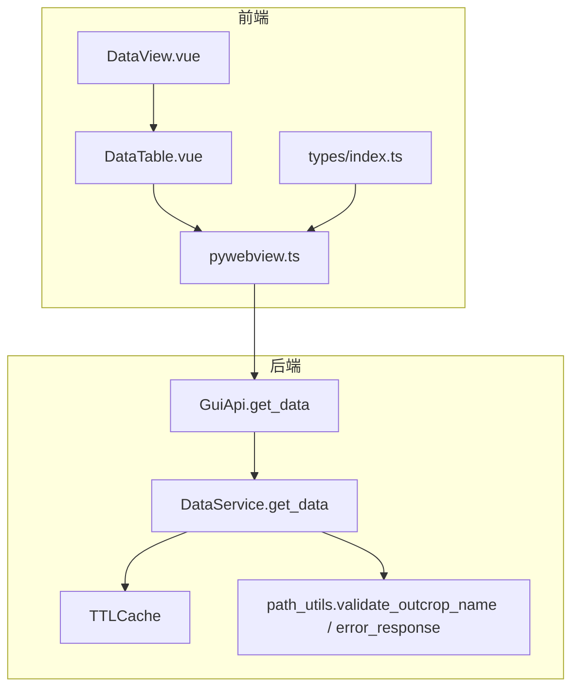
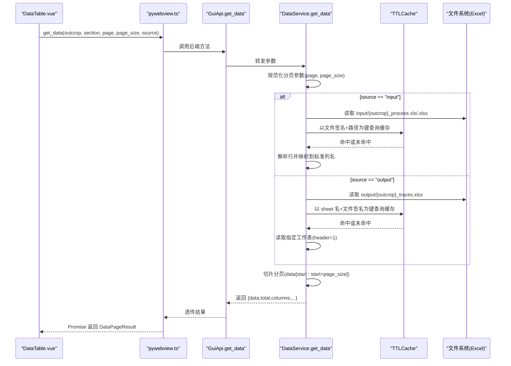
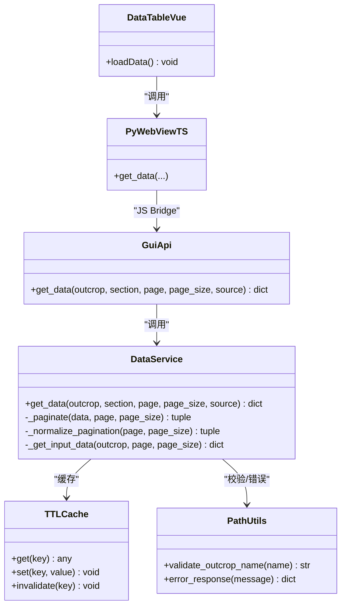
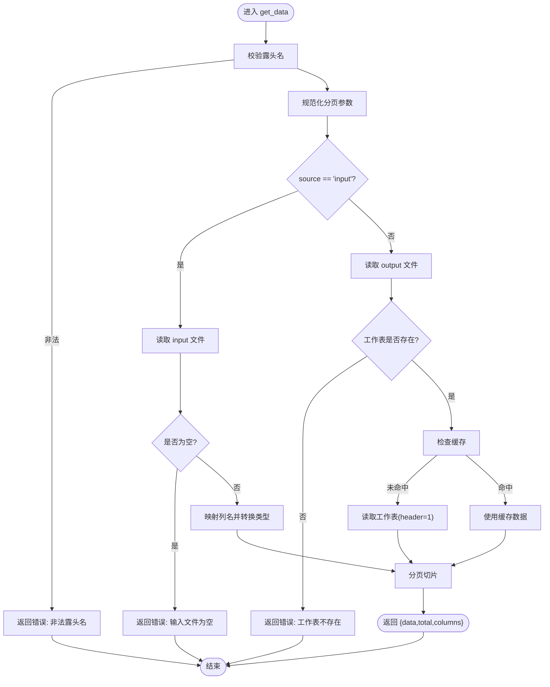

# 数据访问 API

<cite>
**本文引用的文件**   
- [backend/services/data_service.py](file://backend/services/data_service.py)
- [backend/gui_api.py](file://backend/gui_api.py)
- [backend/utils/cache.py](file://backend/utils/cache.py)
- [backend/utils/path_utils.py](file://backend/utils/path_utils.py)
- [frontend/src/components/DataTable.vue](file://frontend/src/components/DataTable.vue)
- [frontend/src/views/DataView.vue](file://frontend/src/views/DataView.vue)
- [frontend/src/api/pywebview.ts](file://frontend/src/api/pywebview.ts)
- [frontend/src/types/index.ts](file://frontend/src/types/index.ts)
- [tests/test_data_service.py](file://tests/test_data_service.py)
- [tests/test_data_service_pagination.py](file://tests/test_data_service_pagination.py)
</cite>

## 目录
1. [简介](#简介)
2. [项目结构](#项目结构)
3. [核心组件](#核心组件)
4. [架构总览](#架构总览)
5. [详细组件分析](#详细组件分析)
6. [依赖关系分析](#依赖关系分析)
7. [性能与缓存策略](#性能与缓存策略)
8. [分页参数规范与结果格式](#分页参数规范与结果格式)
9. [数据表结构与字段映射](#数据表结构与字段映射)
10. [错误处理与边界情况](#错误处理与边界情况)
11. [前端表格集成示例与最佳实践](#前端表格集成示例与最佳实践)
12. [故障排查指南](#故障排查指南)
13. [结论](#结论)

## 简介
本文件面向“数据访问 API”的完整说明，聚焦于 get_data（获取指定露头的数据表记录）的分页、源选择、数据结构与类型转换、缓存与性能优化、错误处理与边界条件，以及前端表格组件集成的最佳实践。该 API 支持两类数据源：
- output：输出 Excel 的多工作表结果（如“走向与长度”“节点统计”等）
- input：输入原始 Excel（按固定列名映射为结构化记录）

## 项目结构
后端通过 GuiApi 暴露 JS 桥接方法，DataService 负责读取 Excel 并返回分页数据；前端通过 pywebview.ts 调用后端方法，并在 DataTable.vue 中渲染表格与分页控件。

图表来源
- [backend/gui_api.py:556-599](file://backend/gui_api.py#L556-L599)
- [backend/services/data_service.py:78-188](file://backend/services/data_service.py#L78-L188)
- [backend/utils/cache.py:18-90](file://backend/utils/cache.py#L18-L90)
- [backend/utils/path_utils.py:20-37](file://backend/utils/path_utils.py#L20-L37)
- [frontend/src/api/pywebview.ts:307-308](file://frontend/src/api/pywebview.ts#L307-L308)
- [frontend/src/components/DataTable.vue:88-110](file://frontend/src/components/DataTable.vue#L88-L110)
- [frontend/src/types/index.ts:134-139](file://frontend/src/types/index.ts#L134-L139)

章节来源
- [backend/gui_api.py:556-599](file://backend/gui_api.py#L556-L599)
- [backend/services/data_service.py:78-188](file://backend/services/data_service.py#L78-L188)
- [frontend/src/components/DataTable.vue:88-110](file://frontend/src/components/DataTable.vue#L88-L110)
- [frontend/src/api/pywebview.ts:307-308](file://frontend/src/api/pywebview.ts#L307-L308)
- [frontend/src/types/index.ts:134-139](file://frontend/src/types/index.ts#L134-L139)

## 核心组件
- DataService：实现 get_data，统一处理 output/input 两种数据源，内置分页与缓存。
- GuiApi：作为 JS 桥接层，转发 get_data 请求并记录日志。
- TTLCache：线程安全的 TTL + LRU 缓存，用于减少重复 IO。
- path_utils：提供露头名校验与统一错误响应构造。
- 前端 DataTable.vue：封装分页、搜索、列头动态生成与加载状态。
- pywebview.ts：前端对后端的类型化封装，定义 DataPageResult 接口。

章节来源
- [backend/services/data_service.py:44-188](file://backend/services/data_service.py#L44-L188)
- [backend/gui_api.py:556-599](file://backend/gui_api.py#L556-L599)
- [backend/utils/cache.py:18-90](file://backend/utils/cache.py#L18-L90)
- [backend/utils/path_utils.py:20-37](file://backend/utils/path_utils.py#L20-L37)
- [frontend/src/components/DataTable.vue:88-110](file://frontend/src/components/DataTable.vue#L88-L110)
- [frontend/src/api/pywebview.ts:307-308](file://frontend/src/api/pywebview.ts#L307-L308)
- [frontend/src/types/index.ts:134-139](file://frontend/src/types/index.ts#L134-L139)

## 架构总览
get_data 的端到端调用流程如下：

图表来源
- [backend/gui_api.py:556-599](file://backend/gui_api.py#L556-L599)
- [backend/services/data_service.py:78-188](file://backend/services/data_service.py#L78-L188)
- [backend/services/data_service.py:190-266](file://backend/services/data_service.py#L190-L266)
- [backend/utils/cache.py:40-64](file://backend/utils/cache.py#L40-L64)
- [frontend/src/components/DataTable.vue:88-110](file://frontend/src/components/DataTable.vue#L88-L110)
- [frontend/src/api/pywebview.ts:307-308](file://frontend/src/api/pywebview.ts#L307-L308)

## 详细组件分析

### 服务端：DataService.get_data
- 功能要点
  - 参数校验：使用 validate_outcrop_name 防止路径遍历。
  - 分页归一化：_normalize_pagination 将 page 限制为 >=1，page_size 限制在 [1, 500]。
  - 源选择：source="input" 走 _get_input_data；否则读 output 多工作表。
  - 缓存键：基于文件签名（mtime_ns, size）与工作表名，避免无效缓存。
  - 读取策略：output 使用 header=1（跳过标题行），input 使用固定列名映射。
  - 异常处理：捕获 ValueError/OSError/MemoryError 等，返回统一错误格式。
- 复杂度
  - 时间：O(N) 读取整表并转字典列表；分页 O(1)。
  - 空间：O(N) 存储全表记录（受缓存上限 maxsize 控制）。

章节来源
- [backend/services/data_service.py:78-188](file://backend/services/data_service.py#L78-L188)
- [backend/services/data_service.py:190-266](file://backend/services/data_service.py#L190-L266)
- [backend/utils/path_utils.py:20-37](file://backend/utils/path_utils.py#L20-L37)

### 服务端：GuiApi.get_data
- 作用：转发参数至 DataService，记录耗时与关键指标，便于监控。
- 并发：服务懒加载，避免启动开销；重资源操作有锁保护（与本接口无关）。

章节来源
- [backend/gui_api.py:556-599](file://backend/gui_api.py#L556-L599)

### 前端：DataTable.vue
- 行为
  - 根据 source 切换标签页与 section 映射。
  - 调用 api.get_data 并绑定 columns、data、total。
  - 监听 outcrop/source 变化重置分页并重新加载。
- 交互
  - 分页器变更触发 loadData。
  - 搜索框回车或清空时重置到第 1 页并刷新。

章节来源
- [frontend/src/components/DataTable.vue:76-110](file://frontend/src/components/DataTable.vue#L76-L110)
- [frontend/src/components/DataTable.vue:112-141](file://frontend/src/components/DataTable.vue#L112-L141)

### 前端：pywebview.ts 与 types
- 类型：DataPageResult 包含 data、total、columns、error。
- 调用：api.get_data 直接透传到后端方法。

章节来源
- [frontend/src/types/index.ts:134-139](file://frontend/src/types/index.ts#L134-L139)
- [frontend/src/api/pywebview.ts:307-308](file://frontend/src/api/pywebview.ts#L307-L308)

## 依赖关系分析
- 模块耦合
  - GuiApi 依赖 DataService、path_utils、cache。
  - DataService 依赖 pandas、openpyxl（通过 pd.read_excel）、path_utils、cache。
  - 前端 DataTable.vue 依赖 pywebview.ts 与 Element Plus 组件。
- 外部依赖
  - Excel 读写：pandas + openpyxl。
  - 桌面环境：pywebview 注入的 JS Bridge。

图表来源
- [backend/gui_api.py:556-599](file://backend/gui_api.py#L556-L599)
- [backend/services/data_service.py:78-188](file://backend/services/data_service.py#L78-L188)
- [backend/utils/cache.py:18-90](file://backend/utils/cache.py#L18-L90)
- [backend/utils/path_utils.py:20-37](file://backend/utils/path_utils.py#L20-L37)
- [frontend/src/components/DataTable.vue:88-110](file://frontend/src/components/DataTable.vue#L88-L110)
- [frontend/src/api/pywebview.ts:307-308](file://frontend/src/api/pywebview.ts#L307-L308)

## 性能与缓存策略
- 缓存键设计
  - output：key = "output:{path}:{sheet_name}:{mtime_ns}:{size}"
  - input：key = "input:{path}:{outcrop}:{mtime_ns}:{size}"
- TTL 与容量
  - TTL 默认 300 秒，最大条目数 64（可配置）。
  - 批量驱逐策略降低扫描开销。
- 目录变更检测
  - DirectoryChangeDetector 用于其他服务；DataService 使用文件签名保证缓存一致性。
- 建议
  - 大表优先使用较小 page_size（如 20~50）以降低内存占用。
  - 频繁切换 sheet 会复用同一文件的缓存，但不同 sheet 会分别缓存。

章节来源
- [backend/services/data_service.py:116-127](file://backend/services/data_service.py#L116-L127)
- [backend/services/data_service.py:202-218](file://backend/services/data_service.py#L202-L218)
- [backend/utils/cache.py:18-90](file://backend/utils/cache.py#L18-L90)

## 分页参数规范与结果格式
- 入参
  - outcrop: string，需通过白名单校验（字母、数字、下划线、连字符、中文）。
  - section: string，output 模式下需匹配 SECTION_MAP 中的分区名；input 模式固定为“原始输入”。
  - page: number，规范化为 >=1。
  - page_size: number，规范化为 [1, 500]。
  - source: "output" | "input"，默认 "output"。
- 出参（DataPageResult）
  - data: Record<string, unknown>[]，当前页记录数组。
  - total: number，总记录数。
  - columns: string[]，列名数组。
  - error?: string，错误信息（当存在时）。
- 分页计算
  - start = (page - 1) * page_size
  - 返回 data[start : start + page_size]

章节来源
- [backend/services/data_service.py:53-71](file://backend/services/data_service.py#L53-L71)
- [backend/services/data_service.py:159-188](file://backend/services/data_service.py#L159-L188)
- [frontend/src/types/index.ts:134-139](file://frontend/src/types/index.ts#L134-L139)
- [tests/test_data_service_pagination.py:9-90](file://tests/test_data_service_pagination.py#L9-L90)

## 数据表结构与字段映射

### Output 数据（多工作表）
- 文件命名：output/{outcrop}_traces.xlsx
- 工作表映射（前端标签 -> 后端 section）
  - “基本信息” -> “基本信息”
  - “原始坐标” -> “原始端点坐标”
  - “旋转坐标” -> “旋转后端点坐标”
  - “走向与长度” -> “走向与长度”
  - “裂隙情况” -> “裂隙情况”
  - “计算数据” -> “计算数据”
  - “节点统计” -> “节点统计”
  - “节点明细” -> “节点明细”
  - “节点交点” -> “节点交点”
- 读取方式：header=1（跳过第一行标题，第二行作为列头）
- 列名：由 Excel 实际列决定，随工作表而异。

章节来源
- [backend/services/data_service.py:17-28](file://backend/services/data_service.py#L17-L28)
- [backend/services/data_service.py:124-126](file://backend/services/data_service.py#L124-L126)

### Input 数据（原始输入）
- 文件命名：input/{outcrop}_process.xls 或 .xlsx
- 读取顺序：优先 xls，不存在则尝试 xlsx
- 工作表：优先以 outcrop 名称读取，失败则回退到无工作表名读取
- 列映射（固定顺序）：
  - r1-沿测线位移
  - r2-垂直测线位移
  - 倾向
  - r4-左侧迹长1
  - r5-左侧迹长2
  - r6-右侧迹长1
  - r7-右侧迹长2
  - 测线走向
  - 迹线条数
- 数据类型转换：
  - 数值型（int/float/numpy integer）转换为 float
  - 非数值或空值转为字符串或空串
  - 空行会被过滤

章节来源
- [backend/services/data_service.py:30-41](file://backend/services/data_service.py#L30-L41)
- [backend/services/data_service.py:190-266](file://backend/services/data_service.py#L190-L266)

## 错误处理与边界情况
- 露头名校验失败：返回统一错误对象，包含 error/message/status。
- 文件不存在：返回错误消息，提示文件路径。
- 工作表不存在：提示需要重新处理以生成新格式。
- 输入文件为空：返回错误消息。
- 内存/中断异常：MemoryError、KeyboardInterrupt、SystemExit 不吞没，向上传播。
- 其他异常：统一包装为错误响应。

图表来源
- [backend/services/data_service.py:78-188](file://backend/services/data_service.py#L78-L188)
- [backend/services/data_service.py:190-266](file://backend/services/data_service.py#L190-L266)
- [backend/utils/path_utils.py:20-37](file://backend/utils/path_utils.py#L20-L37)

章节来源
- [backend/services/data_service.py:87-157](file://backend/services/data_service.py#L87-L157)
- [backend/services/data_service.py:196-231](file://backend/services/data_service.py#L196-L231)
- [backend/utils/path_utils.py:59-67](file://backend/utils/path_utils.py#L59-L67)

## 前端表格集成示例与最佳实践
- 基本用法
  - 在 DataTable.vue 中，根据 props.outcrop 与 props.source 调用 api.get_data。
  - 将返回的 columns 动态渲染为 el-table-column，data 绑定到表格数据。
  - 使用 el-pagination 的 current-page/page-size 与 total 联动。
- 推荐实践
  - 切换 source 或 outcrop 时重置 page 到 1。
  - 搜索时重置到第 1 页并刷新。
  - 合理设置 page-sizes（如 10/20/50），避免过大导致内存压力。
  - 对错误响应进行友好提示，并清空表格数据。
  - 结合缓存：若页面仅展示少量列，可在前端做二次筛选以减少网络传输。

章节来源
- [frontend/src/components/DataTable.vue:88-110](file://frontend/src/components/DataTable.vue#L88-L110)
- [frontend/src/components/DataTable.vue:112-141](file://frontend/src/components/DataTable.vue#L112-L141)
- [frontend/src/api/pywebview.ts:307-308](file://frontend/src/api/pywebview.ts#L307-L308)
- [frontend/src/types/index.ts:134-139](file://frontend/src/types/index.ts#L134-L139)

## 故障排查指南
- 现象：返回错误“非法的露头名”
  - 原因：outcrop 包含非法字符或为空。
  - 处理：确保只使用字母、数字、下划线、连字符、中文。
- 现象：返回错误“文件不存在”
  - 原因：output 或 input 目录下缺少对应 Excel 文件。
  - 处理：确认文件名符合 {outcrop}_traces.xlsx 或 {outcrop}_process.xls/.xlsx。
- 现象：返回错误“工作表不存在”
  - 原因：output 文件中缺少目标 sheet。
  - 处理：重新处理该露头以生成新格式文件。
- 现象：返回错误“输入文件为空”
  - 原因：input 文件无有效数据行。
  - 处理：检查输入数据是否包含至少一行有效记录。
- 现象：分页异常（如 page=0 或 page_size 超大）
  - 原因：前端传入不规范参数。
  - 处理：后端已自动规范化，但仍建议前端遵循规范。

章节来源
- [backend/services/data_service.py:87-157](file://backend/services/data_service.py#L87-L157)
- [backend/services/data_service.py:196-231](file://backend/services/data_service.py#L196-L231)
- [tests/test_data_service_pagination.py:9-90](file://tests/test_data_service_pagination.py#L9-L90)

## 结论
get_data API 提供了稳定、安全且高性能的数据访问能力，支持 output/input 双源、严格的安全校验、健壮的错误处理与高效的缓存策略。配合前端的 DataTable 组件，可实现流畅的大表分页浏览体验。建议在业务侧遵循分页参数规范，并结合缓存与目录变更检测机制，以获得更优的性能与一致性。