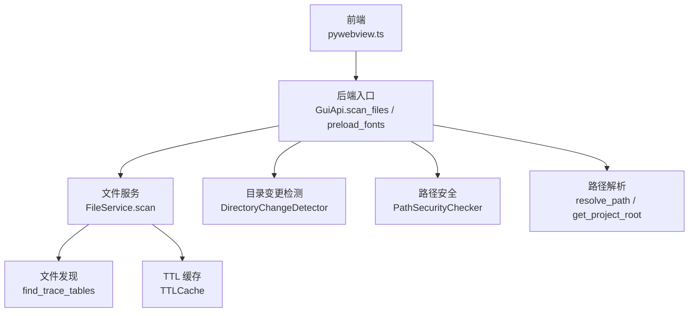
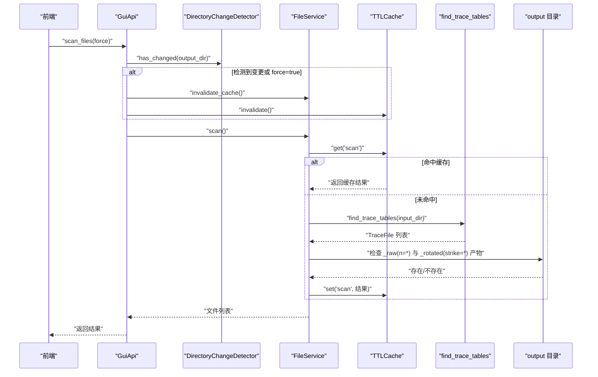
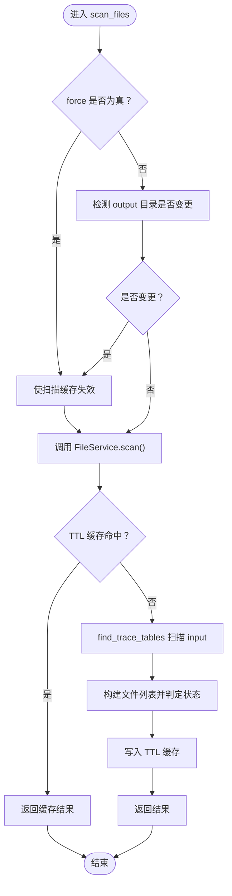
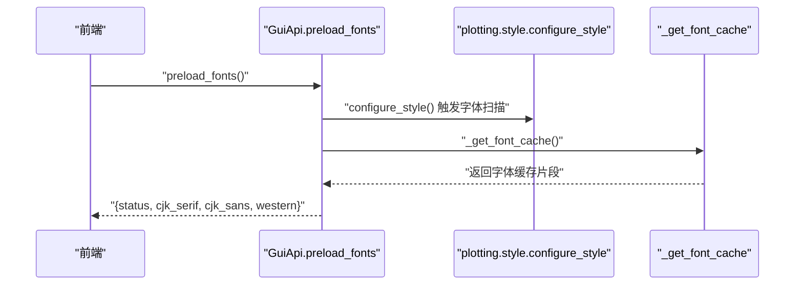
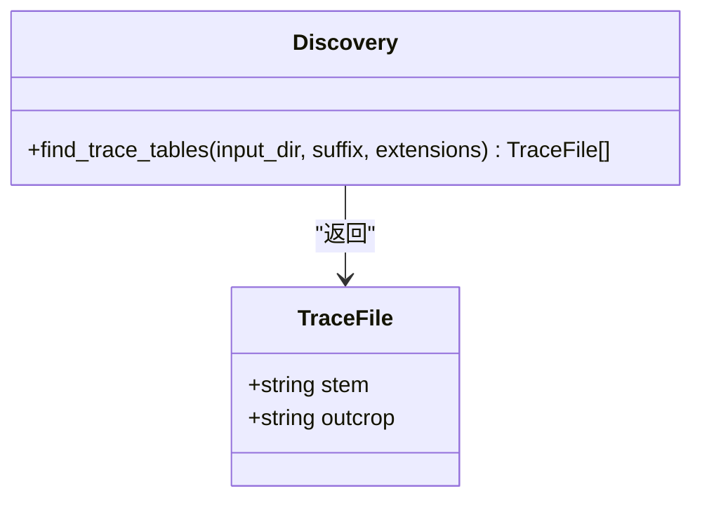
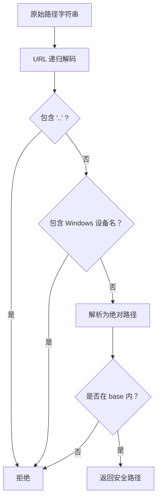
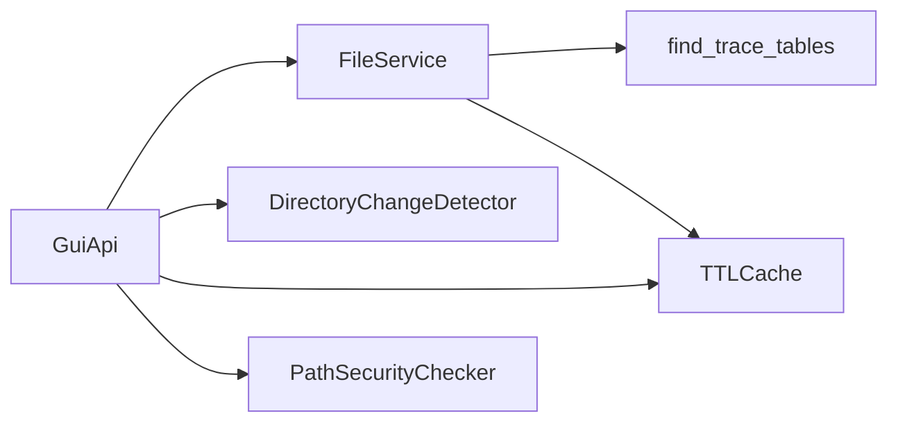

# 文件操作 API

<cite>
**本文引用的文件**   
- [backend/gui_api.py](file://backend/gui_api.py)
- [backend/services/file_service.py](file://backend/services/file_service.py)
- [trace_pipeline/io/discovery.py](file://trace_pipeline/io/discovery.py)
- [backend/utils/cache.py](file://backend/utils/cache.py)
- [backend/utils/path_utils.py](file://backend/utils/path_utils.py)
- [backend/utils/security.py](file://backend/utils/security.py)
- [trace_pipeline/utils/paths.py](file://trace_pipeline/utils/paths.py)
- [frontend/src/api/pywebview.ts](file://frontend/src/api/pywebview.ts)
</cite>

## 目录
1. [简介](#简介)
2. [项目结构](#项目结构)
3. [核心组件](#核心组件)
4. [架构总览](#架构总览)
5. [详细组件分析](#详细组件分析)
6. [依赖关系分析](#依赖关系分析)
7. [性能考虑](#性能考虑)
8. [故障排查指南](#故障排查指南)
9. [结论](#结论)
10. [附录：数据结构定义](#附录数据结构定义)

## 简介
本文件面向“文件操作 API”，聚焦以下能力与机制：
- 扫描输入输出目录，发现迹线表并返回带状态的文件列表（scan_files）
- 预热 matplotlib 字体缓存，降低首次绘图延迟（preload_fonts）
- 文件发现机制、状态跟踪（pending/completed/error）、路径安全校验与缓存策略
- 目录变更检测与性能优化技巧
- 文件列表完整数据结构定义（含元数据、处理状态与错误信息）

## 项目结构
围绕文件操作相关的关键模块分布如下：
- GUI 层对外暴露方法：GuiApi（scan_files、preload_fonts）
- 文件服务：FileService（扫描 input_dir，结合 output_dir 判定状态）
- 文件发现：discovery.find_trace_tables（匹配规则与去重）
- 缓存与变更检测：TTLCache、DirectoryChangeDetector
- 路径解析与安全：path_utils.resolve_path、security.PathSecurityChecker、paths.get_project_root
- 前端桥接：pywebview.ts（类型与调用封装）

图表来源
- [backend/gui_api.py:335-385](file://backend/gui_api.py#L335-L385)
- [backend/services/file_service.py:29-89](file://backend/services/file_service.py#L29-L89)
- [trace_pipeline/io/discovery.py:24-62](file://trace_pipeline/io/discovery.py#L24-L62)
- [backend/utils/cache.py:18-90](file://backend/utils/cache.py#L18-L90)
- [backend/utils/cache.py:92-155](file://backend/utils/cache.py#L92-L155)
- [backend/utils/security.py:14-128](file://backend/utils/security.py#L14-L128)
- [backend/utils/path_utils.py:40-56](file://backend/utils/path_utils.py#L40-L56)
- [trace_pipeline/utils/paths.py:12-24](file://trace_pipeline/utils/paths.py#L12-L24)
- [frontend/src/api/pywebview.ts:103-142](file://frontend/src/api/pywebview.ts#L103-L142)

章节来源
- [backend/gui_api.py:335-385](file://backend/gui_api.py#L335-L385)
- [backend/services/file_service.py:29-89](file://backend/services/file_service.py#L29-L89)
- [trace_pipeline/io/discovery.py:24-62](file://trace_pipeline/io/discovery.py#L24-L62)
- [backend/utils/cache.py:18-90](file://backend/utils/cache.py#L18-L90)
- [backend/utils/cache.py:92-155](file://backend/utils/cache.py#L92-L155)
- [backend/utils/security.py:14-128](file://backend/utils/security.py#L14-L128)
- [backend/utils/path_utils.py:40-56](file://backend/utils/path_utils.py#L40-L56)
- [trace_pipeline/utils/paths.py:12-24](file://trace_pipeline/utils/paths.py#L12-L24)
- [frontend/src/api/pywebview.ts:103-142](file://frontend/src/api/pywebview.ts#L103-L142)

## 核心组件
- GuiApi
  - scan_files(force=false)：根据 force 与 output 目录变更检测结果决定是否失效缓存，再调用 FileService.scan 返回文件列表。
  - preload_fonts()：主动触发样式配置与字体缓存初始化，返回部分已加载字体预览。
- FileService
  - scan()：使用 TTLCache 缓存扫描结果；基于 find_trace_tables 发现输入文件，并结合 output 目录产物判断 pending/completed。
- discovery.find_trace_tables
  - 按后缀与扩展名匹配，大小写不敏感去重，按 outcrop 排序返回 TraceFile 列表。
- TTLCache
  - 线程安全的 TTL + LRU 缓存，支持批量淘汰与键前缀失效。
- DirectoryChangeDetector
  - 对目录进行浅层快照比较，检测外部变更并允许手动失效。
- PathSecurityChecker / resolve_path
  - 统一路径解析与安全校验，防止路径遍历与越权访问。

章节来源
- [backend/gui_api.py:335-385](file://backend/gui_api.py#L335-L385)
- [backend/services/file_service.py:29-89](file://backend/services/file_service.py#L29-L89)
- [trace_pipeline/io/discovery.py:24-62](file://trace_pipeline/io/discovery.py#L24-L62)
- [backend/utils/cache.py:18-90](file://backend/utils/cache.py#L18-L90)
- [backend/utils/cache.py:92-155](file://backend/utils/cache.py#L92-L155)
- [backend/utils/security.py:14-128](file://backend/utils/security.py#L14-L128)
- [backend/utils/path_utils.py:40-56](file://backend/utils/path_utils.py#L40-L56)

## 架构总览
下图展示了从前端到后端的文件扫描与字体预加载主流程，以及关键的安全与缓存环节。

图表来源
- [backend/gui_api.py:357-385](file://backend/gui_api.py#L357-L385)
- [backend/services/file_service.py:29-89](file://backend/services/file_service.py#L29-L89)
- [trace_pipeline/io/discovery.py:24-62](file://trace_pipeline/io/discovery.py#L24-L62)
- [backend/utils/cache.py:18-90](file://backend/utils/cache.py#L18-L90)
- [backend/utils/cache.py:92-155](file://backend/utils/cache.py#L92-L155)

## 详细组件分析

### 组件一：scan_files（文件扫描与状态判定）
- 功能要点
  - 强制刷新：force=true 时直接使缓存失效。
  - 目录变更检测：若 output 目录发生外部变更，自动失效扫描与统计缓存。
  - 状态判定：同时存在 raw 与 rotated 产物时为 completed，否则为 pending。
  - 缓存策略：TTL 缓存扫描结果，避免重复 IO。
- 关键实现位置
  - 入口与流程控制：[backend/gui_api.py:357-385](file://backend/gui_api.py#L357-L385)
  - 扫描与状态计算：[backend/services/file_service.py:29-89](file://backend/services/file_service.py#L29-L89)
  - 文件发现规则：[trace_pipeline/io/discovery.py:24-62](file://trace_pipeline/io/discovery.py#L24-L62)
  - 缓存与变更检测：[backend/utils/cache.py:18-90](file://backend/utils/cache.py#L18-L90)、[backend/utils/cache.py:92-155](file://backend/utils/cache.py#L92-L155)

图表来源
- [backend/gui_api.py:357-385](file://backend/gui_api.py#L357-L385)
- [backend/services/file_service.py:29-89](file://backend/services/file_service.py#L29-L89)
- [trace_pipeline/io/discovery.py:24-62](file://trace_pipeline/io/discovery.py#L24-L62)
- [backend/utils/cache.py:18-90](file://backend/utils/cache.py#L18-L90)
- [backend/utils/cache.py:92-155](file://backend/utils/cache.py#L92-L155)

章节来源
- [backend/gui_api.py:357-385](file://backend/gui_api.py#L357-L385)
- [backend/services/file_service.py:29-89](file://backend/services/file_service.py#L29-L89)
- [trace_pipeline/io/discovery.py:24-62](file://trace_pipeline/io/discovery.py#L24-L62)
- [backend/utils/cache.py:18-90](file://backend/utils/cache.py#L18-L90)
- [backend/utils/cache.py:92-155](file://backend/utils/cache.py#L92-L155)

### 组件二：preload_fonts（字体预热）
- 功能要点
  - 主动触发样式配置与字体缓存初始化，减少首次绘图时的延迟。
  - 返回少量字体名称用于前端展示预热结果。
- 关键实现位置
  - 入口与异常处理：[backend/gui_api.py:335-356](file://backend/gui_api.py#L335-L356)
  - 字体分类工具（辅助）：[trace_pipeline/utils/fonts.py:8-41](file://trace_pipeline/utils/fonts.py#L8-L41)

图表来源
- [backend/gui_api.py:335-356](file://backend/gui_api.py#L335-L356)
- [trace_pipeline/utils/fonts.py:8-41](file://trace_pipeline/utils/fonts.py#L8-L41)

章节来源
- [backend/gui_api.py:335-356](file://backend/gui_api.py#L335-L356)
- [trace_pipeline/utils/fonts.py:8-41](file://trace_pipeline/utils/fonts.py#L8-L41)

### 组件三：文件发现机制（find_trace_tables）
- 匹配规则
  - 文件名以指定后缀结尾（默认 _process）。
  - 扩展名在允许集合中（默认 .xlsx/.xls）。
  - 同名文件不同扩展名按首次发现去重（大小写不敏感）。
  - 返回按 outcrop 排序的 TraceFile 列表。
- 关键实现位置
  - 发现逻辑与日志：[trace_pipeline/io/discovery.py:24-62](file://trace_pipeline/io/discovery.py#L24-L62)

图表来源
- [trace_pipeline/io/discovery.py:17-62](file://trace_pipeline/io/discovery.py#L17-L62)

章节来源
- [trace_pipeline/io/discovery.py:24-62](file://trace_pipeline/io/discovery.py#L24-L62)

### 组件四：路径安全校验与目录变更检测
- 路径安全
  - 拒绝包含 ".." 的路径与 Windows 设备名。
  - URL 递归解码后再校验，限制最终路径在可信 base 内。
  - 提供统一 resolve_path 将相对路径解析为绝对路径。
- 目录变更检测
  - 记录目录与子项 stat 快照，比较 mtime_ns 与文件大小变化。
  - 大目录截断保护：记录总数作为新增/删除信号。
- 关键实现位置
  - 安全校验器：[backend/utils/security.py:14-128](file://backend/utils/security.py#L14-L128)
  - 路径解析：[backend/utils/path_utils.py:40-56](file://backend/utils/path_utils.py#L40-L56)
  - 项目根推断：[trace_pipeline/utils/paths.py:12-24](file://trace_pipeline/utils/paths.py#L12-L24)
  - 变更检测器：[backend/utils/cache.py:92-155](file://backend/utils/cache.py#L92-L155)

图表来源
- [backend/utils/security.py:47-127](file://backend/utils/security.py#L47-L127)
- [backend/utils/path_utils.py:40-56](file://backend/utils/path_utils.py#L40-L56)
- [trace_pipeline/utils/paths.py:12-24](file://trace_pipeline/utils/paths.py#L12-L24)

章节来源
- [backend/utils/security.py:14-128](file://backend/utils/security.py#L14-L128)
- [backend/utils/path_utils.py:40-56](file://backend/utils/path_utils.py#L40-L56)
- [trace_pipeline/utils/paths.py:12-24](file://trace_pipeline/utils/paths.py#L12-L24)
- [backend/utils/cache.py:92-155](file://backend/utils/cache.py#L92-L155)

## 依赖关系分析
- 组件耦合
  - GuiApi 依赖 FileService、DirectoryChangeDetector、TTLCache、PathSecurityChecker。
  - FileService 依赖 discovery.find_trace_tables 与 TTLCache。
  - 安全与路径工具被多处复用，保证一致性与安全性。
- 外部依赖
  - matplotlib（仅在 preload_fonts 中通过样式模块间接使用）。
  - PIL（图片读取，非本次重点）。
- 潜在循环
  - 未发现循环导入；各模块职责清晰。

图表来源
- [backend/gui_api.py:335-385](file://backend/gui_api.py#L335-L385)
- [backend/services/file_service.py:29-89](file://backend/services/file_service.py#L29-L89)
- [trace_pipeline/io/discovery.py:24-62](file://trace_pipeline/io/discovery.py#L24-L62)
- [backend/utils/cache.py:18-90](file://backend/utils/cache.py#L18-L90)
- [backend/utils/cache.py:92-155](file://backend/utils/cache.py#L92-L155)
- [backend/utils/security.py:14-128](file://backend/utils/security.py#L14-L128)

章节来源
- [backend/gui_api.py:335-385](file://backend/gui_api.py#L335-L385)
- [backend/services/file_service.py:29-89](file://backend/services/file_service.py#L29-L89)
- [trace_pipeline/io/discovery.py:24-62](file://trace_pipeline/io/discovery.py#L24-L62)
- [backend/utils/cache.py:18-90](file://backend/utils/cache.py#L18-L90)
- [backend/utils/cache.py:92-155](file://backend/utils/cache.py#L92-L155)
- [backend/utils/security.py:14-128](file://backend/utils/security.py#L14-L128)

## 性能考虑
- 扫描缓存
  - TTLCache 提供 TTL 与 LRU 双重策略，批量淘汰过期条目，降低频繁扫描开销。
- 目录变更检测
  - DirectoryChangeDetector 仅做浅层快照比较，避免全量深度遍历；大目录采用计数截断保护。
- 懒加载与锁
  - GuiApi 对重资源服务采用懒加载与运行锁，避免并发导致的资源竞争。
- 建议
  - 合理设置 TTL（当前扫描缓存 TTL 较短，适合高频变更场景）。
  - 在大批量文件场景下，优先依赖变更检测而非强制刷新。

[本节为通用指导，无需具体文件引用]

## 故障排查指南
- 常见问题
  - 扫描结果为空：确认 input 目录是否存在且包含符合后缀与扩展名的文件。
  - 状态始终 pending：检查 output 目录是否生成对应的 raw 与 rotated 产物。
  - 路径越权报错：检查传入路径是否包含 ".." 或位于受限目录外。
  - 字体预热失败：确认样式模块可用，matplotlib 环境正常。
- 定位线索
  - 日志关键字：file_scan、api_scan_files、output_dir_changed、font cache warmup。
  - 相关实现：
    - 扫描与状态：[backend/services/file_service.py:29-89](file://backend/services/file_service.py#L29-L89)
    - 变更检测：[backend/utils/cache.py:92-155](file://backend/utils/cache.py#L92-L155)
    - 安全校验：[backend/utils/security.py:14-128](file://backend/utils/security.py#L14-L128)
    - 字体预热：[backend/gui_api.py:335-356](file://backend/gui_api.py#L335-L356)

章节来源
- [backend/services/file_service.py:29-89](file://backend/services/file_service.py#L29-L89)
- [backend/utils/cache.py:92-155](file://backend/utils/cache.py#L92-L155)
- [backend/utils/security.py:14-128](file://backend/utils/security.py#L14-L128)
- [backend/gui_api.py:335-356](file://backend/gui_api.py#L335-L356)

## 结论
- scan_files 通过“强制刷新 + 目录变更检测 + TTL 缓存”的组合，兼顾实时性与性能。
- 状态判定基于 output 产物存在性，简单可靠，便于前端直观展示。
- 路径安全校验贯穿所有文件操作，有效防御路径遍历与越权访问。
- preload_fonts 在启动阶段完成字体扫描与样式初始化，显著改善首帧渲染体验。

[本节为总结，无需具体文件引用]

## 附录：数据结构定义

### 文件列表项（scan_files 返回）
- 字段
  - stem: string — 文件基本名（含后缀），如 O76_process.xlsx
  - outcrop: string — 露头标识（由 stem 去除后缀得到）
  - path: string — 输入文件的绝对路径
  - status: 'pending' | 'completed' — 处理状态
- 说明
  - 当 output 目录中存在对应 raw 与 rotated 产物时，标记为 completed；否则为 pending。
  - 该结构在前端类型定义中亦有体现，便于类型安全消费。

章节来源
- [backend/services/file_service.py:49-89](file://backend/services/file_service.py#L49-L89)
- [frontend/src/api/pywebview.ts:36-42](file://frontend/src/api/pywebview.ts#L36-L42)

### 字体预热响应（preload_fonts 返回）
- 字段
  - status: string — 通常为 ok 或 error
  - message?: string — 错误消息（当 status 为 error 时）
  - cjk_serif: string[] — CJK 衬线字体示例（最多 3 个）
  - cjk_sans: string[] — CJK 无衬线字体示例（最多 3 个）
  - western: string[] — 西文字体示例（最多 3 个）
- 说明
  - 成功时返回少量字体名称供前端展示；失败时返回错误消息。

章节来源
- [backend/gui_api.py:335-356](file://backend/gui_api.py#L335-L356)

### 错误响应（通用）
- 字段
  - status: string — 通常为 error
  - message: string — 错误描述
  - error?: string — 兼容字段（同 message）
- 说明
  - 统一错误格式，便于前端集中处理。

章节来源
- [backend/utils/path_utils.py:59-67](file://backend/utils/path_utils.py#L59-L67)