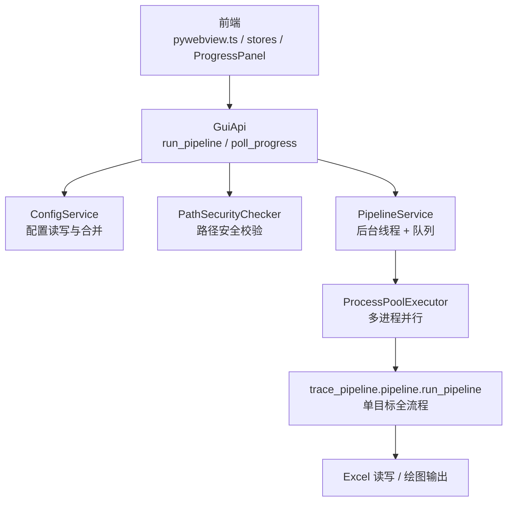
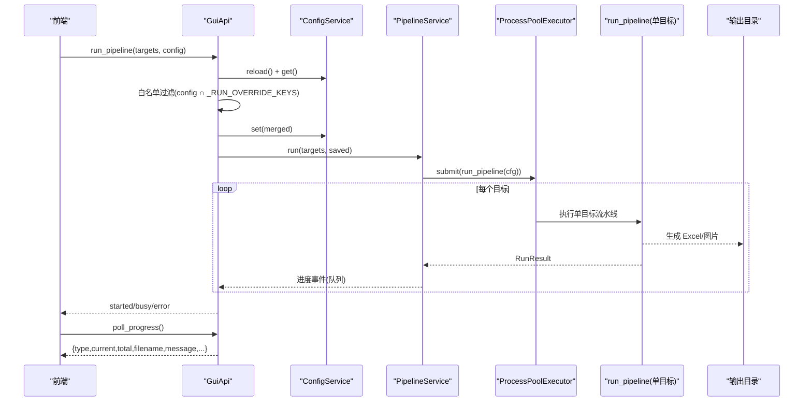
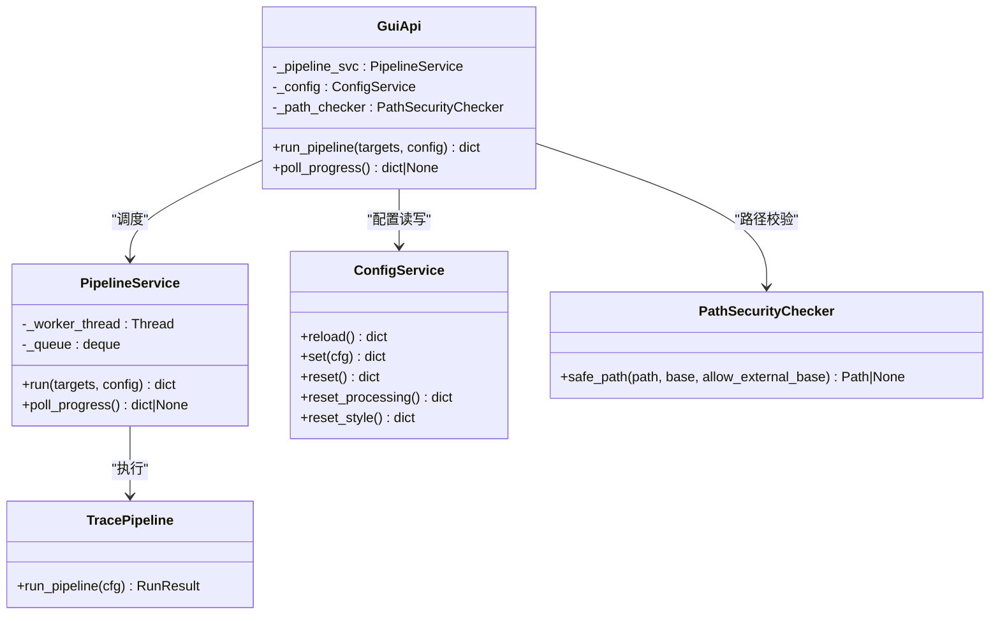

# 流水线控制 API

<cite>
**本文引用的文件列表**
- [backend/gui_api.py](file://backend/gui_api.py)
- [backend/services/pipeline_service.py](file://backend/services/pipeline_service.py)
- [trace_pipeline/pipeline.py](file://trace_pipeline/pipeline.py)
- [trace_pipeline/config.py](file://trace_pipeline/config.py)
- [trace_pipeline/models.py](file://trace_pipeline/models.py)
- [backend/services/config_service.py](file://backend/services/config_service.py)
- [frontend/src/api/pywebview.ts](file://frontend/src/api/pywebview.ts)
- [frontend/src/types/index.ts](file://frontend/src/types/index.ts)
- [frontend/src/stores/pipeline.ts](file://frontend/src/stores/pipeline.ts)
- [frontend/src/components/ProgressPanel.vue](file://frontend/src/components/ProgressPanel.vue)
- [backend/utils/security.py](file://backend/utils/security.py)
</cite>

## 目录
1. [简介](#简介)
2. [项目结构](#项目结构)
3. [核心组件](#核心组件)
4. [架构总览](#架构总览)
5. [详细组件分析](#详细组件分析)
6. [依赖关系分析](#依赖关系分析)
7. [性能与并发](#性能与并发)
8. [错误处理与异常恢复](#错误处理与异常恢复)
9. [配置参数规范与白名单覆盖](#配置参数规范与白名单覆盖)
10. [进度事件数据结构与前端集成示例](#进度事件数据结构与前端集成示例)
11. [故障排查指南](#故障排查指南)
12. [结论](#结论)

## 简介
本文件面向“数据处理流水线”的启动与监控，聚焦以下两个关键 API：
- run_pipeline：启动批量处理任务，支持目标选择与配置覆盖（受白名单限制）
- poll_progress：轮询处理进度事件，驱动前端展示实时进度

文档将全面解析流水线执行流程、任务调度机制、进度事件类型与状态管理，并提供完整的任务配置参数规范、安全限制说明、并发控制策略、错误处理与异常恢复方案，以及前端集成示例。

## 项目结构
后端通过 GUI API 暴露方法给前端调用；GUI API 负责鉴权、路径校验、配置合并与审计；PipelineService 负责后台线程调度与多进程并行执行；trace_pipeline.pipeline 实现单目标全流程编排；前端通过 pywebview.ts 桥接调用并维护运行状态与进度 UI。

图表来源
- [backend/gui_api.py:388-456](file://backend/gui_api.py#L388-L456)
- [backend/services/pipeline_service.py:32-100](file://backend/services/pipeline_service.py#L32-L100)
- [trace_pipeline/pipeline.py:230-474](file://trace_pipeline/pipeline.py#L230-L474)
- [backend/services/config_service.py:41-144](file://backend/services/config_service.py#L41-L144)
- [backend/utils/security.py:14-128](file://backend/utils/security.py#L14-L128)

章节来源
- [backend/gui_api.py:388-456](file://backend/gui_api.py#L388-L456)
- [backend/services/pipeline_service.py:32-100](file://backend/services/pipeline_service.py#L32-L100)
- [trace_pipeline/pipeline.py:230-474](file://trace_pipeline/pipeline.py#L230-L474)
- [backend/services/config_service.py:41-144](file://backend/services/config_service.py#L41-L144)
- [backend/utils/security.py:14-128](file://backend/utils/security.py#L14-L128)

## 核心组件
- GuiApi：对外暴露 run_pipeline 与 poll_progress，负责配置合并、白名单校验、缓存失效、审计日志与并发锁。
- PipelineService：后台工作线程 + 线程安全队列，使用 ProcessPoolExecutor 进行多进程并行执行，按完成顺序推送进度与结果。
- trace_pipeline.pipeline.run_pipeline：单目标全流程编排（加载 → 变换 → 节点识别 → Excel 导出 → 绘图），返回 RunResult。
- ConfigService：config.json 的唯一写入入口，提供 reload/set/reset 等能力，保证原子写入与线程安全。
- 前端桥接层：pywebview.ts 封装所有后端方法，stores/pipeline.ts 维护运行态，ProgressPanel.vue 渲染进度条与并行度控制。

章节来源
- [backend/gui_api.py:388-456](file://backend/gui_api.py#L388-L456)
- [backend/services/pipeline_service.py:32-100](file://backend/services/pipeline_service.py#L32-L100)
- [trace_pipeline/pipeline.py:230-474](file://trace_pipeline/pipeline.py#L230-L474)
- [backend/services/config_service.py:41-144](file://backend/services/config_service.py#L41-L144)
- [frontend/src/api/pywebview.ts:294-337](file://frontend/src/api/pywebview.ts#L294-L337)
- [frontend/src/stores/pipeline.ts:22-56](file://frontend/src/stores/pipeline.ts#L22-L56)
- [frontend/src/components/ProgressPanel.vue:60-165](file://frontend/src/components/ProgressPanel.vue#L60-L165)

## 架构总览
下图展示了从前端到后端的完整调用链与数据流，包括配置合并、白名单过滤、多进程并行、进度事件回传与前端轮询消费。

图表来源
- [backend/gui_api.py:388-456](file://backend/gui_api.py#L388-L456)
- [backend/services/pipeline_service.py:100-346](file://backend/services/pipeline_service.py#L100-L346)
- [trace_pipeline/pipeline.py:230-474](file://trace_pipeline/pipeline.py#L230-L474)

## 详细组件分析

### run_pipeline 接口
- 功能：启动后台流水线，非阻塞返回；支持目标选择与配置覆盖。
- 输入：
  - targets: 字符串数组，表示要处理的露头标识（outcrop）。
  - config: 字典，仅允许覆盖白名单字段（见下节“配置参数规范与白名单覆盖”）。
- 行为：
  - 刷新配置，读取磁盘最新值。
  - 仅取白名单内的键覆盖磁盘配置，禁止前端覆盖路径/目标字段。
  - 保存合并后的配置，同步服务路径，使缓存失效。
  - 调用 PipelineService.run 启动后台线程。
- 返回：
  - 成功：{"status": "started", "total": N}
  - 忙：{"status": "busy", "message": "..."}
  - 错误：{"status": "error", "message": "..."}

章节来源
- [backend/gui_api.py:388-445](file://backend/gui_api.py#L388-L445)
- [backend/services/pipeline_service.py:42-64](file://backend/services/pipeline_service.py#L42-L64)

### poll_progress 接口
- 功能：前端轮询获取进度事件，线程安全、非阻塞。
- 行为：从内部队列弹出一个事件对象，若无事件则返回空。
- 返回：
  - 事件对象或 null。事件类型包含 start、progress、file_complete、complete、error。

章节来源
- [backend/gui_api.py:447-456](file://backend/gui_api.py#L447-L456)
- [backend/services/pipeline_service.py:66-69](file://backend/services/pipeline_service.py#L66-L69)

### PipelineService 后台调度
- 后台线程：非守护线程，确保主进程退出前完成当前文件/Excel 写入。
- 并发模型：
  - 使用 multiprocessing.get_context("spawn") 创建子进程池。
  - parallel_workers=0 自动为 min(任务数, CPU 核心数)。
  - parallel_workers=1 串行（仍在独立进程中）。
  - parallel_workers>1 取 min(任务数, 请求值, CPU 核心数)。
- 关闭信号：支持优雅关闭，设置 shutdown_event 并在任务间检查，必要时取消剩余任务。
- 进度事件：
  - start：批次开始
  - progress：总体进度（current/total）
  - file_complete：单个目标完成，附带 result 详情
  - complete：全部完成
  - error：异常事件

章节来源
- [backend/services/pipeline_service.py:32-100](file://backend/services/pipeline_service.py#L32-L100)
- [backend/services/pipeline_service.py:100-346](file://backend/services/pipeline_service.py#L100-L346)

### run_pipeline 单目标流程
- 阶段：
  1. 加载数据：读取 Excel，计算端点、走向、长度等，带签名缓存。
  2. 坐标变换与统计：归一化坐标、计算统计量、构建圆窗与凸包覆盖层。
  3. 节点识别（可选）：识别交点/分支等节点，构建叠加层。
  4. 导出 Excel：多表头结果写入。
  5. 绘图：原始迹线图、旋转迹线图、玫瑰图（可选）。
- 异常处理：
  - PermissionError/FileNotFoundError 友好提示。
  - MemoryError/KeyboardInterrupt 向上传播。
  - 其他异常统一包装为失败结果并记录 traceback（可选）。

章节来源
- [trace_pipeline/pipeline.py:230-474](file://trace_pipeline/pipeline.py#L230-L474)

### 配置服务与安全
- ConfigService：
  - reload/get/set/reset/reset_processing/reset_style 等方法，线程安全。
  - 原子写入：先写临时文件再替换，避免中断损坏配置。
- 路径安全：
  - PathSecurityChecker 防止路径遍历攻击，拒绝 ".."、Windows 设备名、越权路径。
  - GUI API 对输出目录变更检测，自动失效缓存。

章节来源
- [backend/services/config_service.py:41-144](file://backend/services/config_service.py#L41-L144)
- [backend/utils/security.py:14-128](file://backend/utils/security.py#L14-L128)
- [backend/gui_api.py:250-262](file://backend/gui_api.py#L250-L262)

## 依赖关系分析
- GuiApi 依赖：
  - ConfigService：配置读写与合并
  - PathSecurityChecker：路径安全校验
  - PipelineService：后台调度
- PipelineService 依赖：
  - ProcessPoolExecutor：多进程并行
  - trace_pipeline.pipeline.run_pipeline：单目标执行
  - trace_pipeline.config.resolve_io_paths：输入输出路径解析
  - trace_pipeline.logging.LogContext：上下文日志
- 前端依赖：
  - pywebview.ts：后端方法封装与就绪等待
  - stores/pipeline.ts：运行态与持久化偏好
  - ProgressPanel.vue：进度可视化与并行度控制

图表来源
- [backend/gui_api.py:388-456](file://backend/gui_api.py#L388-L456)
- [backend/services/pipeline_service.py:32-100](file://backend/services/pipeline_service.py#L32-L100)
- [backend/services/config_service.py:41-144](file://backend/services/config_service.py#L41-L144)
- [backend/utils/security.py:14-128](file://backend/utils/security.py#L14-L128)
- [trace_pipeline/pipeline.py:230-474](file://trace_pipeline/pipeline.py#L230-L474)

## 性能与并发
- 并行度控制：
  - parallel_workers=0：自动根据 CPU 核心数与任务数决定。
  - parallel_workers=1：串行（仍为独立进程，隔离资源）。
  - parallel_workers>1：受限于 CPU 核心数与任务数。
- 内存与 I/O：
  - 子进程独立初始化 matplotlib 后端，避免共享状态冲突。
  - 输出目录变更检测器自动失效缓存，减少重复扫描。
- 显示优化：
  - 前端进度平滑插值，提升视觉流畅性。

章节来源
- [backend/services/pipeline_service.py:146-184](file://backend/services/pipeline_service.py#L146-L184)
- [trace_pipeline/pipeline.py:239-253](file://trace_pipeline/pipeline.py#L239-L253)
- [frontend/src/components/ProgressPanel.vue:84-148](file://frontend/src/components/ProgressPanel.vue#L84-L148)

## 错误处理与异常恢复
- 单目标异常：
  - PermissionError：友好提示“文件被占用或权限不足”。
  - FileNotFoundError：提示“输入文件不存在”。
  - 其他异常：统一包装为失败结果，可包含 traceback。
- 批处理异常：
  - 关键异常（MemoryError/SystemExit/KeyboardInterrupt）向上传播。
  - 其它异常记录并发送 error 事件，包含 completed_count 与 total。
- 优雅关闭：
  - 设置 shutdown_event，在任务间检查，必要时取消剩余任务。
  - join(timeout) 等待线程结束，超时记录警告。

章节来源
- [trace_pipeline/pipeline.py:450-474](file://trace_pipeline/pipeline.py#L450-L474)
- [backend/services/pipeline_service.py:202-221](file://backend/services/pipeline_service.py#L202-L221)
- [backend/services/pipeline_service.py:326-346](file://backend/services/pipeline_service.py#L326-L346)

## 配置参数规范与白名单覆盖
- 白名单覆盖键：
  - 处理参数键集合 PROCESSING_KEYS 加上 style 与 parallel_workers。
  - 禁止前端覆盖路径/目标字段（如 input_dir、output_dir、table_stem、outcrop）。
- 处理参数键（PROCESSING_KEYS）：
  - process_all、export_rose_plot、rose_dpi、rose_bin_width、trace_dpi、rotated_trace_dpi、window_strategy、auto_density_threshold、tangent_window_count、min_intersections、enable_node_recognition、node_merge_tolerance、show_node_overlay、is_dev_mode、node_label_mode。
- 默认配置与校验：
  - DEFAULT_CONFIG 定义默认值。
  - validate_config 合并默认值、规范化类型、检查必填项、解析绝对路径。
- 运行时覆盖流程：
  - 读取磁盘最新配置。
  - 仅取白名单内键覆盖。
  - 保存合并后的配置，同步服务路径，使缓存失效。

章节来源
- [backend/gui_api.py:48-50](file://backend/gui_api.py#L48-L50)
- [backend/services/config_service.py:22-38](file://backend/services/config_service.py#L22-L38)
- [trace_pipeline/config.py:56-79](file://trace_pipeline/config.py#L56-L79)
- [trace_pipeline/config.py:148-190](file://trace_pipeline/config.py#L148-L190)
- [backend/gui_api.py:396-408](file://backend/gui_api.py#L396-L408)

## 进度事件数据结构与前端集成示例

### 事件类型与字段
- start：
  - type: "start"
  - total: 任务总数
  - current: 0
  - filename: ""
  - message: "开始处理"
- progress：
  - type: "progress"
  - current: 已完成数量
  - total: 任务总数
  - filename: 当前文件名（表名前缀）
  - message: 描述信息
- file_complete：
  - type: "file_complete"
  - current: 已完成数量
  - total: 任务总数
  - filename: 当前文件名
  - message: 成功/失败消息
  - result: 单目标结果详情（包含 outcrop、status、trace_count、mean_length、scanline_azimuth、excel_path、raw_plot、rotated_plot、rose_plot、window_strategy、area_source、error、error_type、node_count、node_x_count、node_y_count、node_i_count）
- complete：
  - type: "complete"
  - current: total
  - total: 任务总数
  - message: "全部处理完成"
  - completed_count: 实际完成数量
- error：
  - type: "error"
  - message: 异常信息
  - completed_count: 已完成数量
  - total: 任务总数

章节来源
- [backend/services/pipeline_service.py:116-124](file://backend/services/pipeline_service.py#L116-L124)
- [backend/services/pipeline_service.py:176-184](file://backend/services/pipeline_service.py#L176-L184)
- [backend/services/pipeline_service.py:254-305](file://backend/services/pipeline_service.py#L254-L305)
- [backend/services/pipeline_service.py:317-325](file://backend/services/pipeline_service.py#L317-L325)
- [backend/services/pipeline_service.py:335-342](file://backend/services/pipeline_service.py#L335-L342)

### 前端集成示例（TypeScript）
- 启动流水线：
  - 调用 api.run_pipeline(targets, config)，其中 config 仅包含白名单键。
  - 监听返回状态，若为 "started" 则进入轮询。
- 轮询进度：
  - 循环调用 api.poll_progress()，直到收到 "complete" 或 "error"。
  - 更新 stores/pipeline.ts 中的 running、progress、results。
- 渲染进度：
  - ProgressPanel.vue 接收 running 与 progress，计算百分比并平滑动画。
  - 并行度控制通过 parallel 模型绑定到配置中的 parallel_workers。

章节来源
- [frontend/src/api/pywebview.ts:302-304](file://frontend/src/api/pywebview.ts#L302-L304)
- [frontend/src/stores/pipeline.ts:22-56](file://frontend/src/stores/pipeline.ts#L22-L56)
- [frontend/src/components/ProgressPanel.vue:60-165](file://frontend/src/components/ProgressPanel.vue#L60-L165)

## 故障排查指南
- 常见问题：
  - 文件被占用：PermissionError，提示关闭 Excel/WPS 后重试。
  - 输入文件不存在：FileNotFoundError，检查输入目录与文件名。
  - 并行度过高：超出 CPU 核心数会被裁剪，调整 parallel_workers。
  - 输出目录变更：自动失效缓存，重新扫描以获取最新结果。
- 诊断步骤：
  - 查看后端日志，关注 stage 标签（batch_start、parallel_start、item_end、batch_end、batch_error）。
  - 检查前端轮询是否持续返回 null（可能无事件或已消费完毕）。
  - 确认白名单覆盖是否正确，避免非法字段导致校验失败。

章节来源
- [trace_pipeline/pipeline.py:450-474](file://trace_pipeline/pipeline.py#L450-L474)
- [backend/services/pipeline_service.py:289-305](file://backend/services/pipeline_service.py#L289-L305)
- [backend/gui_api.py:250-262](file://backend/gui_api.py#L250-L262)

## 结论
本流水线控制 API 通过 GuiApi 暴露 run_pipeline 与 poll_progress，结合 PipelineService 的后台线程与多进程并行，实现了高效、可控的数据处理流水线。配置覆盖采用严格的白名单机制，保障安全与一致性。前端通过轮询与平滑动画提供友好的用户体验。完善的错误处理与优雅关闭策略确保了系统的健壮性与可恢复性。