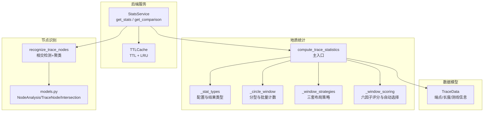
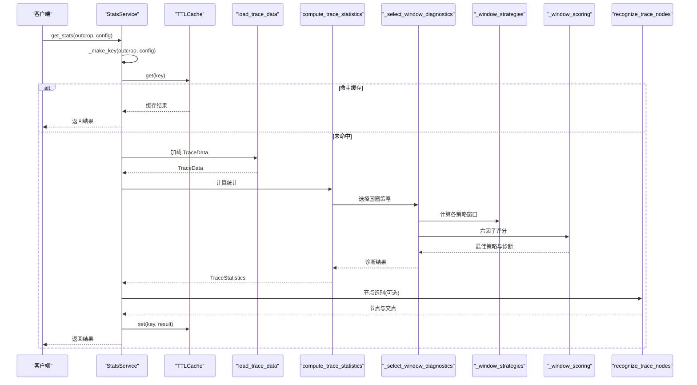
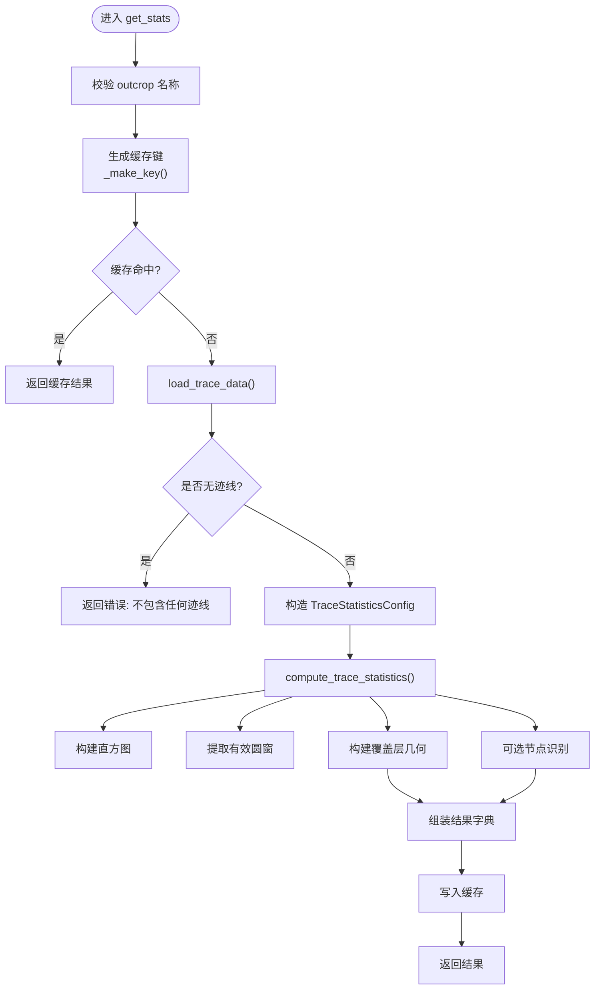
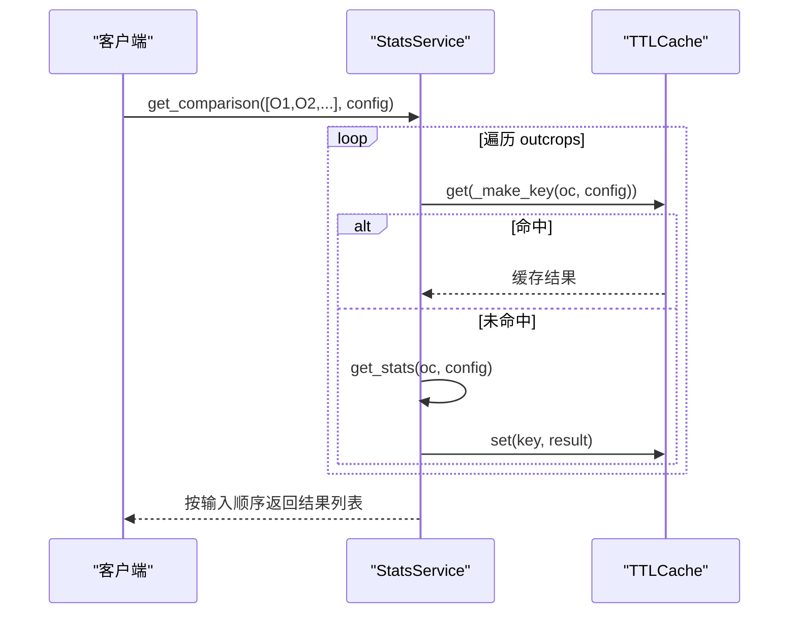
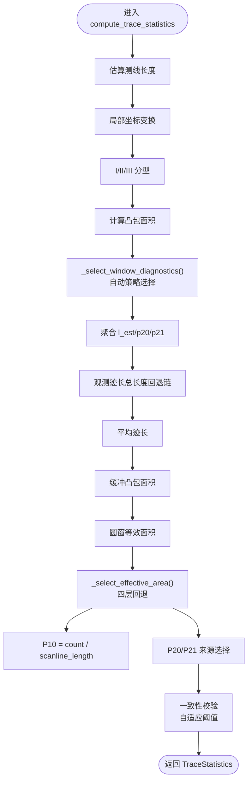
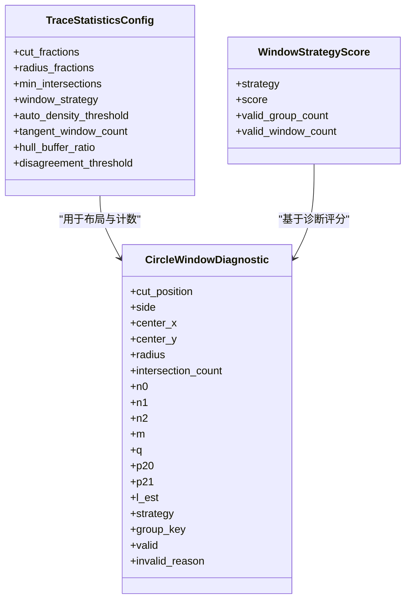
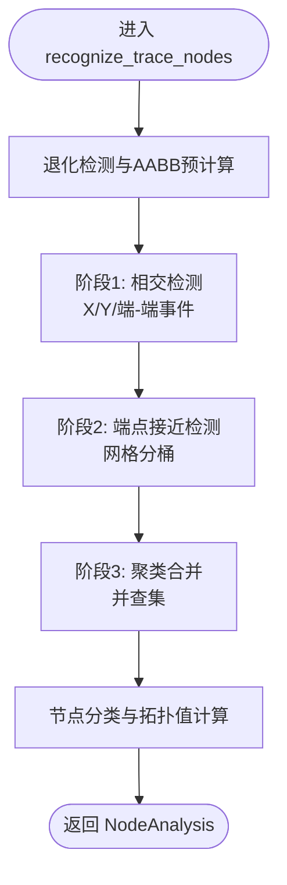
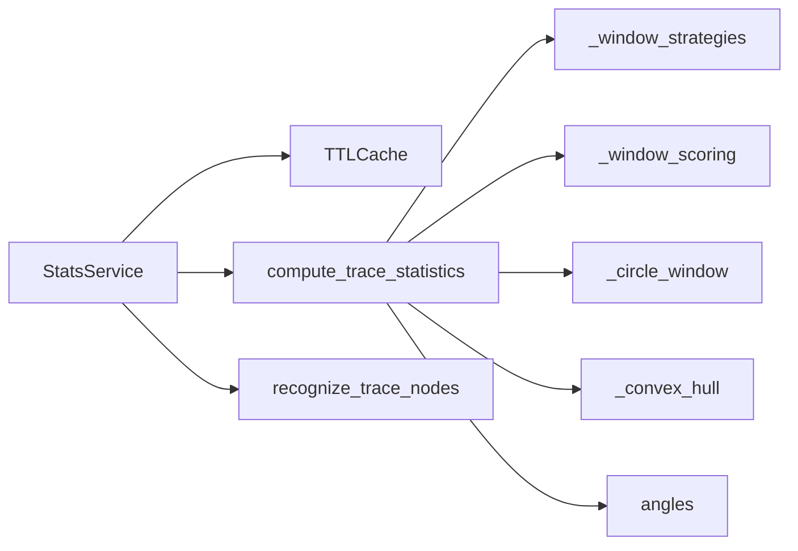

# 统计分析 API

<cite>
**本文引用的文件列表**
- [backend/services/stats_service.py](file://backend/services/stats_service.py)
- [trace_pipeline/geology/statistics.py](file://trace_pipeline/geology/statistics.py)
- [trace_pipeline/geology/_stat_types.py](file://trace_pipeline/geology/_stat_types.py)
- [trace_pipeline/geology/_circle_window.py](file://trace_pipeline/geology/_circle_window.py)
- [trace_pipeline/geology/_window_scoring.py](file://trace_pipeline/geology/_window_scoring.py)
- [trace_pipeline/geology/_window_strategies.py](file://trace_pipeline/geology/_window_strategies.py)
- [trace_pipeline/analysis/models.py](file://trace_pipeline/analysis/models.py)
- [trace_pipeline/analysis/nodes.py](file://trace_pipeline/analysis/nodes.py)
- [trace_pipeline/models.py](file://trace_pipeline/models.py)
- [backend/utils/cache.py](file://backend/utils/cache.py)
- [tests/test_stats_service.py](file://tests/test_stats_service.py)
- [tests/test_statistics.py](file://tests/test_statistics.py)
</cite>

## 目录
1. [简介](#简介)
2. [项目结构](#项目结构)
3. [核心组件](#核心组件)
4. [架构总览](#架构总览)
5. [详细组件分析](#详细组件分析)
6. [依赖关系分析](#依赖关系分析)
7. [性能与精度](#性能与精度)
8. [故障排查指南](#故障排查指南)
9. [结论](#结论)
10. [附录：数据结构定义](#附录数据结构定义)

## 简介
本文件面向“统计分析 API”，围绕两个关键接口展开：
- get_stats：获取单个露头的统计指标（P₁₀/P₂₀/P₂₁、平均迹长估计、圆窗策略选择、覆盖层几何等）
- get_comparison：多露头对比分析（保持输入顺序，复用缓存）

文档将系统解析统计计算流程、圆窗策略与评分机制、结果缓存、节点识别与可视化数据准备，并给出数据结构定义、异常值处理与性能优化建议。

## 项目结构
统计分析相关代码主要分布在后端服务与地质统计模块中：
- 后端服务层：StatsService 提供对外 API 能力，负责缓存、参数校验、数据加载与结果组装
- 地质统计核心：statistics 主入口，组合坐标变换、I/II/III 分型、圆窗计数、面积回退链、P10/P20/P21 计算与一致性校验
- 圆窗策略与评分：三种布局策略（tangent/hybrid/concentric）、六因子加权评分与自动策略选择
- 节点识别：基于线段相交检测与空间聚类的 I/Y/X 节点分类
- 模型与类型：TraceData、TraceStatisticsConfig、CircleWindowDiagnostic、NodeAnalysis 等不可变数据类
- 缓存工具：TTLCache 线程安全 TTL+LRU 缓存

图表来源
- [backend/services/stats_service.py:101-342](file://backend/services/stats_service.py#L101-L342)
- [trace_pipeline/geology/statistics.py:212-391](file://trace_pipeline/geology/statistics.py#L212-L391)
- [trace_pipeline/geology/_stat_types.py:14-125](file://trace_pipeline/geology/_stat_types.py#L14-L125)
- [trace_pipeline/geology/_circle_window.py:12-269](file://trace_pipeline/geology/_circle_window.py#L12-L269)
- [trace_pipeline/geology/_window_strategies.py:173-185](file://trace_pipeline/geology/_window_strategies.py#L173-L185)
- [trace_pipeline/geology/_window_scoring.py:235-323](file://trace_pipeline/geology/_window_scoring.py#L235-L323)
- [trace_pipeline/analysis/nodes.py:160-417](file://trace_pipeline/analysis/nodes.py#L160-L417)
- [trace_pipeline/analysis/models.py:22-98](file://trace_pipeline/analysis/models.py#L22-L98)
- [trace_pipeline/models.py:41-157](file://trace_pipeline/models.py#L41-L157)
- [backend/utils/cache.py:18-90](file://backend/utils/cache.py#L18-L90)

章节来源
- [backend/services/stats_service.py:101-342](file://backend/services/stats_service.py#L101-L342)
- [trace_pipeline/geology/statistics.py:212-391](file://trace_pipeline/geology/statistics.py#L212-L391)

## 核心组件
- StatsService.get_stats：读取已处理结果，返回统计指标与覆盖层几何；带缓存与指纹键生成
- compute_trace_statistics：统计主入口，完成测线长度估算、局部坐标系转换、I/II/III 分型、圆窗诊断、面积回退链、P10/P20/P21 计算与一致性校验
- 圆窗策略与评分：tangent/hybrid/concentric 三套布局，六因子加权评分，自动策略选择
- 节点识别：线段相交检测、端点接近检测、网格聚类合并、拓扑值与类型判定
- 缓存：TTLCache 提供线程安全的 TTL+LRU 缓存，支持前缀失效

章节来源
- [backend/services/stats_service.py:35-100](file://backend/services/stats_service.py#L35-L100)
- [trace_pipeline/geology/statistics.py:212-391](file://trace_pipeline/geology/statistics.py#L212-L391)
- [trace_pipeline/geology/_window_scoring.py:178-206](file://trace_pipeline/geology/_window_scoring.py#L178-L206)
- [trace_pipeline/analysis/nodes.py:160-417](file://trace_pipeline/analysis/nodes.py#L160-L417)
- [backend/utils/cache.py:18-90](file://backend/utils/cache.py#L18-L90)

## 架构总览
API 调用到统计计算的端到端流程如下：

图表来源
- [backend/services/stats_service.py:101-342](file://backend/services/stats_service.py#L101-L342)
- [trace_pipeline/geology/statistics.py:212-391](file://trace_pipeline/geology/statistics.py#L212-L391)
- [trace_pipeline/geology/_window_scoring.py:235-323](file://trace_pipeline/geology/_window_scoring.py#L235-L323)
- [trace_pipeline/geology/_window_strategies.py:173-185](file://trace_pipeline/geology/_window_strategies.py#L173-L185)
- [trace_pipeline/analysis/nodes.py:160-417](file://trace_pipeline/analysis/nodes.py#L160-L417)
- [backend/utils/cache.py:18-90](file://backend/utils/cache.py#L18-L90)

## 详细组件分析

### 组件 A：单露头统计 get_stats
职责
- 参数校验与缓存键生成（仅影响统计的关键配置字段 + 输入文件指纹）
- 加载 TraceData，构造 TraceStatisticsConfig，调用统计主入口
- 构建直方图、圆窗几何、原始/旋转坐标系下的覆盖层几何
- 可选节点识别与交点输出
- 记录日志并写入缓存

关键实现要点
- 缓存键：仅包含 window_strategy、auto_density_threshold、tangent_window_count、min_intersections、enable_node_recognition、node_merge_tolerance、show_node_overlay、node_label_mode、input_dir 以及 input_fingerprint（文件名、mtime_ns、size），避免无关字段导致缓存失效
- 输入指纹：对 {outcrop}_process.xlsx/.xls 的 stat 信息做稳定哈希
- 结果字段：包含 P10/P20/P21、mean_trace_length、type_i/ii/iii 计数、scanline/outcrop_area 及其来源、histogram、circles、nodes_summary、nodes、intersections、raw/rotated_plot_overlay 等

图表来源
- [backend/services/stats_service.py:101-342](file://backend/services/stats_service.py#L101-L342)

章节来源
- [backend/services/stats_service.py:88-100](file://backend/services/stats_service.py#L88-L100)
- [backend/services/stats_service.py:101-342](file://backend/services/stats_service.py#L101-L342)

### 组件 B：多露头对比 get_comparison
职责
- 按输入顺序返回多个露头的统计结果
- 优先从缓存读取缺失项再调用 get_stats 计算
- 保证输出顺序与输入一致

图表来源
- [backend/services/stats_service.py:344-361](file://backend/services/stats_service.py#L344-L361)

章节来源
- [backend/services/stats_service.py:344-361](file://backend/services/stats_service.py#L344-L361)

### 组件 C：统计主入口 compute_trace_statistics
职责
- 测线长度估算（实测优先，否则基于 scanline_positions 估计）
- 局部坐标系转换（按 scanline_azimuth）
- I/II/III 分型（向量化）
- 圆窗诊断（独立路径，不依赖凸包面积）
- 面积选择四层回退（实测 → 凸包 → 缓冲凸包 → 圆窗等效面积）
- P10/P20/P21 计算与一致性校验（自适应阈值）

图表来源
- [trace_pipeline/geology/statistics.py:212-391](file://trace_pipeline/geology/statistics.py#L212-L391)

章节来源
- [trace_pipeline/geology/statistics.py:51-68](file://trace_pipeline/geology/statistics.py#L51-L68)
- [trace_pipeline/geology/statistics.py:99-165](file://trace_pipeline/geology/statistics.py#L99-L165)
- [trace_pipeline/geology/statistics.py:179-206](file://trace_pipeline/geology/statistics.py#L179-L206)
- [trace_pipeline/geology/statistics.py:212-391](file://trace_pipeline/geology/statistics.py#L212-L391)

### 组件 D：圆窗策略与评分
职责
- 三套布局策略：tangent（切圆）、hybrid（混合）、concentric（同心）
- 六因子加权评分：有效分组数、有效分组占比、空间覆盖（侧向+沿测线）、稳定性（变异系数倒数）、半径大小、样本充分性
- 自动策略选择：当所有策略得分非正时回退最保守 tangent；在得分相近时考虑密度偏好

图表来源
- [trace_pipeline/geology/_stat_types.py:14-125](file://trace_pipeline/geology/_stat_types.py#L14-L125)
- [trace_pipeline/geology/_window_scoring.py:170-206](file://trace_pipeline/geology/_window_scoring.py#L170-L206)

章节来源
- [trace_pipeline/geology/_window_strategies.py:52-185](file://trace_pipeline/geology/_window_strategies.py#L52-L185)
- [trace_pipeline/geology/_window_scoring.py:178-323](file://trace_pipeline/geology/_window_scoring.py#L178-L323)

### 组件 E：节点识别 recognize_trace_nodes
职责
- 预处理：退化线段过滤、AABB 包围盒预计算
- 阶段1：候选邻居筛选与精确相交检测（X/Y/端-端事件）
- 阶段2：未使用端点的接近检测（网格分桶）
- 阶段3：空间聚类合并（网格+并查集）
- 节点分类：根据参与方式与拓扑值判定 I/Y/X 类型

图表来源
- [trace_pipeline/analysis/nodes.py:160-417](file://trace_pipeline/analysis/nodes.py#L160-L417)

章节来源
- [trace_pipeline/analysis/nodes.py:160-417](file://trace_pipeline/analysis/nodes.py#L160-L417)
- [trace_pipeline/analysis/models.py:22-98](file://trace_pipeline/analysis/models.py#L22-L98)

## 依赖关系分析
- StatsService 依赖：
  - cache.TTLCache：缓存
  - path_utils.validate_outcrop_name：输入名校验
  - analysis.nodes.recognize_trace_nodes：节点识别
  - geology.statistics.compute_trace_statistics：统计主入口
  - geology.transforms.normalize_coordinates：坐标归一化
  - pipeline.load_trace_data：数据加载
  - plotting.overlays.*：覆盖层几何构建
- statistics 依赖：
  - _circle_window._classify_trace_types：I/II/III 分型
  - _convex_hull.*：凸包面积与顶点
  - _window_scoring._select_window_diagnostics：自动策略选择
  - _window_strategies.compute_circle_windows：三套布局
  - angles.azimuth_to_cartesian_deg：方位角转换

图表来源
- [backend/services/stats_service.py:101-342](file://backend/services/stats_service.py#L101-L342)
- [trace_pipeline/geology/statistics.py:212-391](file://trace_pipeline/geology/statistics.py#L212-L391)

章节来源
- [backend/services/stats_service.py:101-342](file://backend/services/stats_service.py#L101-L342)
- [trace_pipeline/geology/statistics.py:212-391](file://trace_pipeline/geology/statistics.py#L212-L391)

## 性能与精度

### 统计精度验证
- 自适应阈值：
  - 面积降级阈值随样本量增大而更严格
  - P20/P21 一致性校验阈值随样本量增大而更严格
- 一致性校验：比较主 P20/P21 与圆窗估计值的相对差异，超过阈值则发出告警

章节来源
- [trace_pipeline/geology/statistics.py:84-93](file://trace_pipeline/geology/statistics.py#L84-L93)
- [trace_pipeline/geology/statistics.py:313-336](file://trace_pipeline/geology/statistics.py#L313-L336)

### 异常值处理
- 退化线段：节点识别跳过长度小于容差的线段，并记录警告
- 无效圆窗：相交迹线不足或 m/q 为负/零时标记 invalid，并记录原因
- NaN/Inf 保护：多处使用 isfinite 检查与 _EPS 阈值，避免除零与数值不稳定

章节来源
- [trace_pipeline/analysis/nodes.py:208-222](file://trace_pipeline/analysis/nodes.py#L208-L222)
- [trace_pipeline/geology/_circle_window.py:177-191](file://trace_pipeline/geology/_circle_window.py#L177-L191)
- [trace_pipeline/geology/statistics.py:171-176](file://trace_pipeline/geology/statistics.py#L171-L176)

### 性能优化策略
- 向量化计算：
  - I/II/III 分型与圆窗相交计数采用 NumPy 广播与矩阵运算
  - 节点识别使用 AABB 快速筛选与网格分桶减少 O(N^2) 比较
- 批量处理：
  - 圆窗批量计数一次计算所有线段到所有圆心的距离矩阵
- 缓存与批淘汰：
  - TTLCache 每若干次 set 才全扫描过期条目，降低锁竞争与 GC 压力
- 内存友好：
  - TraceData 派生属性缓存（如 lengths）避免重复计算

章节来源
- [trace_pipeline/geology/_circle_window.py:71-216](file://trace_pipeline/geology/_circle_window.py#L71-L216)
- [trace_pipeline/analysis/nodes.py:232-270](file://trace_pipeline/analysis/nodes.py#L232-L270)
- [backend/utils/cache.py:53-90](file://backend/utils/cache.py#L53-L90)
- [trace_pipeline/models.py:134-151](file://trace_pipeline/models.py#L134-L151)

## 故障排查指南
- 输入文件缺失或权限问题：
  - 指纹生成捕获 FileNotFoundError/OSError，返回错误信息
- 无迹线数据：
  - trace.count == 0 或 endpoints.size == 0 时返回错误提示
- 缓存键不一致：
  - 确保仅影响统计的关键配置字段被纳入键生成
  - 输入文件内容变化会改变指纹，从而失效旧缓存
- 圆窗策略无有效候选：
  - auto 模式会回退到密度偏好策略，必要时回退到 tangent
- 节点识别坐标过大：
  - 可能触发网格索引溢出警告，建议缩放或调整单位

章节来源
- [backend/services/stats_service.py:59-86](file://backend/services/stats_service.py#L59-L86)
- [backend/services/stats_service.py:138-142](file://backend/services/stats_service.py#L138-L142)
- [tests/test_stats_service.py:6-49](file://tests/test_stats_service.py#L6-L49)
- [trace_pipeline/geology/_window_scoring.py:289-296](file://trace_pipeline/geology/_window_scoring.py#L289-L296)
- [trace_pipeline/analysis/nodes.py:339-346](file://trace_pipeline/analysis/nodes.py#L339-L346)

## 结论
统计分析 API 通过严谨的数据流与多层回退机制，在保证精度的同时兼顾鲁棒性与性能。圆窗策略的六因子评分与自动选择提升了在不同密度与分布场景下的适应性；节点识别算法结合网格与并查集实现了高效的空间聚类；TTLCache 提供了高吞吐的缓存支撑。建议在大规模对比场景中合理设置 min_intersections 与 auto_density_threshold，以获得更稳定的统计结果。

## 附录：数据结构定义

### 统计配置与结果类型
- TraceStatisticsConfig：控制圆窗布局与评分参数
- CircleWindowDiagnostic：单个圆窗的诊断与统计值
- TraceStatistics：最终统计结果，含来源标注与一致性告警

章节来源
- [trace_pipeline/geology/_stat_types.py:14-125](file://trace_pipeline/geology/_stat_types.py#L14-L125)

### 节点识别模型
- NodeRecognitionConfig：节点识别开关与合并容差
- TraceNode：节点位置、类型、度、关联迹线索引
- TraceIntersection：两迹线相交事件的几何与参数
- NodeAnalysis：节点与交点集合及统计摘要

章节来源
- [trace_pipeline/analysis/models.py:22-98](file://trace_pipeline/analysis/models.py#L22-L98)

### 迹线数据模型
- TraceData：端点、走向、长度、测线位置、实测长度与面积等

章节来源
- [trace_pipeline/models.py:41-157](file://trace_pipeline/models.py#L41-L157)