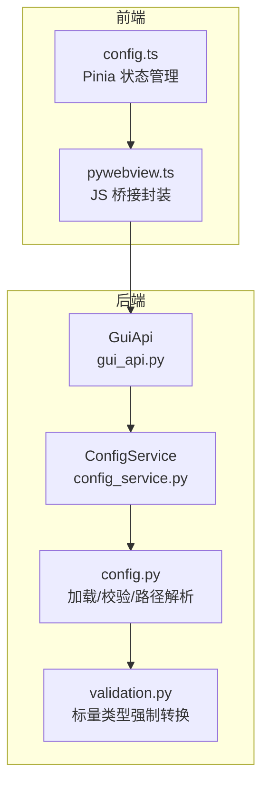
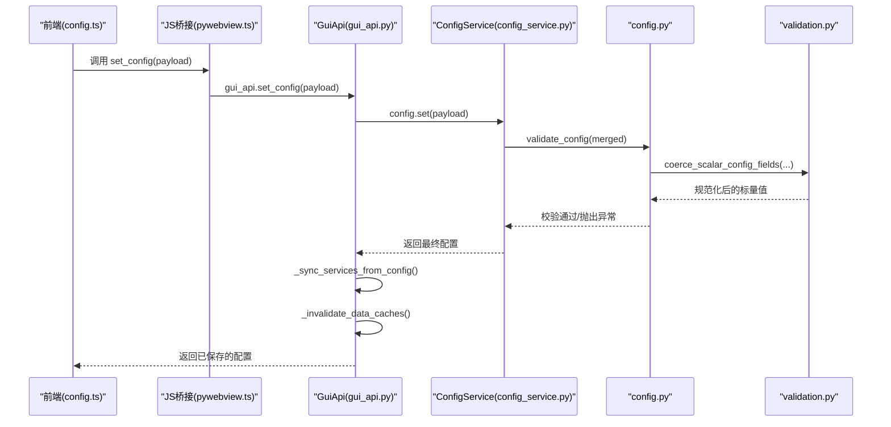
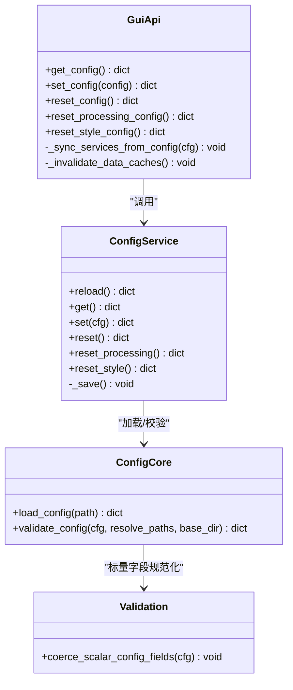

# 配置管理 API

<cite>
**本文引用的文件**
- [backend/gui_api.py](file://backend/gui_api.py)
- [backend/services/config_service.py](file://backend/services/config_service.py)
- [trace_pipeline/config.py](file://trace_pipeline/config.py)
- [trace_pipeline/validation.py](file://trace_pipeline/validation.py)
- [config.example.json](file://config.example.json)
- [frontend/src/api/pywebview.ts](file://frontend/src/api/pywebview.ts)
- [frontend/src/stores/config.ts](file://frontend/src/stores/config.ts)
</cite>

## 目录
1. [简介](#简介)
2. [项目结构](#项目结构)
3. [核心组件](#核心组件)
4. [架构总览](#架构总览)
5. [详细组件分析](#详细组件分析)
6. [依赖关系分析](#依赖关系分析)
7. [性能与缓存](#性能与缓存)
8. [故障排查指南](#故障排查指南)
9. [结论](#结论)
10. [附录：字段规范与示例](#附录字段规范与示例)

## 简介
本文件面向使用 TracePipeline 桌面应用的前端开发者与集成方，系统化说明配置管理相关 API。重点覆盖以下四个核心方法：
- get_config：获取当前配置
- set_config：设置配置并同步服务
- reset_config：重置为默认配置
- reset_processing_config / reset_style_config：部分重置（仅处理参数或仅样式）

文档包含参数规范、返回值格式、配置字段验证规则与安全限制；提供完整的请求/响应示例；解释配置变更后的服务同步机制与缓存失效策略。

## 项目结构
配置管理涉及后端 GUI API 层、配置服务层、配置加载与校验模块，以及前端桥接与状态管理。

图表来源
- [backend/gui_api.py:264-333](file://backend/gui_api.py#L264-L333)
- [backend/services/config_service.py:41-144](file://backend/services/config_service.py#L41-L144)
- [trace_pipeline/config.py:86-190](file://trace_pipeline/config.py#L86-L190)
- [trace_pipeline/validation.py:90-112](file://trace_pipeline/validation.py#L90-L112)
- [frontend/src/api/pywebview.ts:104-142](file://frontend/src/api/pywebview.ts#L104-L142)
- [frontend/src/stores/config.ts:14-71](file://frontend/src/stores/config.ts#L14-L71)

章节来源
- [backend/gui_api.py:264-333](file://backend/gui_api.py#L264-L333)
- [backend/services/config_service.py:41-144](file://backend/services/config_service.py#L41-L144)
- [trace_pipeline/config.py:86-190](file://trace_pipeline/config.py#L86-L190)
- [trace_pipeline/validation.py:90-112](file://trace_pipeline/validation.py#L90-L112)
- [frontend/src/api/pywebview.ts:104-142](file://frontend/src/api/pywebview.ts#L104-L142)
- [frontend/src/stores/config.ts:14-71](file://frontend/src/stores/config.ts#L14-L71)

## 核心组件
- GuiApi（GUI API 入口）
  - 暴露 get_config、set_config、reset_config、reset_processing_config、reset_style_config 等前端可调用的方法。
  - 负责审计日志记录、调用 ConfigService 持久化配置、同步下游服务、使缓存失效。
- ConfigService（配置服务）
  - 作为 config.json 的唯一写入入口，提供 get/set/reset/partial-reset 能力。
  - 内部使用线程锁保证并发安全，采用原子写（临时文件 + replace）。
- trace_pipeline.config（配置核心）
  - 提供 DEFAULT_CONFIG、DEFAULT_CONFIG_PATH、load_config、validate_config、路径解析与 CLI 覆盖合并等。
- validation（校验与类型强制）
  - 提供 coerce_bool、coerce_positive_int、coerce_positive_float、coerce_window_strategy、coerce_node_label_mode、coerce_rose_bin_width 及批量标量字段规范化。

章节来源
- [backend/gui_api.py:264-333](file://backend/gui_api.py#L264-L333)
- [backend/services/config_service.py:41-144](file://backend/services/config_service.py#L41-L144)
- [trace_pipeline/config.py:56-190](file://trace_pipeline/config.py#L56-L190)
- [trace_pipeline/validation.py:26-112](file://trace_pipeline/validation.py#L26-L112)

## 架构总览
配置管理 API 的端到端流程如下：

图表来源
- [backend/gui_api.py:273-291](file://backend/gui_api.py#L273-L291)
- [backend/services/config_service.py:92-101](file://backend/services/config_service.py#L92-L101)
- [trace_pipeline/config.py:148-190](file://trace_pipeline/config.py#L148-L190)
- [trace_pipeline/validation.py:107-112](file://trace_pipeline/validation.py#L107-L112)

## 详细组件分析

### 方法一：get_config
- 功能
  - 返回当前配置字典（深拷贝），确保外部不可直接修改内存中的配置对象。
- 参数
  - 无
- 返回值
  - 完整配置字典，键名与类型见“附录：字段规范与示例”。
- 行为细节
  - 若配置文件不存在，自动创建默认配置并返回。
  - 读取过程加读锁，避免并发读写导致不一致。
- 典型用途
  - 页面初始化时拉取配置，渲染表单与预览。

章节来源
- [backend/gui_api.py:264-271](file://backend/gui_api.py#L264-L271)
- [backend/services/config_service.py:87-90](file://backend/services/config_service.py#L87-L90)
- [backend/services/config_service.py:68-85](file://backend/services/config_service.py#L68-L85)

### 方法二：set_config
- 功能
  - 合并新配置到磁盘最新配置，校验后持久化，并同步服务与缓存。
- 参数
  - config: 字典，允许覆盖任意受支持的配置项。未知键将被忽略并记录警告。
- 返回值
  - 合并并校验后的完整配置字典。
- 验证规则
  - 必填字段检查：input_dir、output_dir、outcrop 必须非空；当 process_all=false 时，table_stem 也必填。
  - 标量字段类型强制转换与范围约束（见附录）。
  - 路径解析：相对路径基于配置文件所在目录或项目根目录解析为绝对路径。
- 副作用
  - 持久化到 config.json（原子写）。
  - 同步 FileService/DataService 的输入输出目录。
  - 使文件扫描、统计、输出目录变更检测器、图片缓存失效。
- 错误处理
  - 校验失败抛出 ValueError，由上层统一捕获并返回错误信息。
  - 文件写入异常会清理临时文件并向上抛出。

章节来源
- [backend/gui_api.py:273-291](file://backend/gui_api.py#L273-L291)
- [backend/services/config_service.py:92-101](file://backend/services/config_service.py#L92-L101)
- [backend/services/config_service.py:128-143](file://backend/services/config_service.py#L128-L143)
- [trace_pipeline/config.py:148-190](file://trace_pipeline/config.py#L148-L190)
- [trace_pipeline/validation.py:90-112](file://trace_pipeline/validation.py#L90-L112)

### 方法三：reset_config
- 功能
  - 将配置恢复为默认值，并持久化。
- 参数
  - 无
- 返回值
  - 默认配置字典。
- 副作用
  - 同步服务与缓存失效（同 set_config）。

章节来源
- [backend/gui_api.py:293-305](file://backend/gui_api.py#L293-L305)
- [backend/services/config_service.py:103-108](file://backend/services/config_service.py#L103-L108)

### 方法四：reset_processing_config / reset_style_config
- 功能
  - reset_processing_config：仅将“处理参数”重置为默认值，保留路径与样式。
  - reset_style_config：仅将样式置为空（默认值），保留路径与处理参数。
- 参数
  - 无
- 返回值
  - 重置后的完整配置字典。
- 处理参数键集合
  - 包括导出开关、DPI、窗口策略、节点识别、标签模式等（详见“附录”）。
- 副作用
  - 同步服务与缓存失效（同 set_config）。

章节来源
- [backend/gui_api.py:307-333](file://backend/gui_api.py#L307-L333)
- [backend/services/config_service.py:110-126](file://backend/services/config_service.py#L110-L126)
- [backend/services/config_service.py:21-38](file://backend/services/config_service.py#L21-L38)

## 依赖关系分析
- GuiApi 依赖 ConfigService 进行配置的持久化与并发控制。
- ConfigService 依赖 trace_pipeline.config 的 load_config 与 validate_config 完成加载与校验。
- validate_config 依赖 validation 模块对标量字段进行类型强制与范围校验。
- 前端通过 pywebview.ts 桥接调用 GuiApi 暴露的方法，并在 Pinia store 中维护本地状态。

图表来源
- [backend/gui_api.py:264-333](file://backend/gui_api.py#L264-L333)
- [backend/services/config_service.py:41-144](file://backend/services/config_service.py#L41-L144)
- [trace_pipeline/config.py:86-190](file://trace_pipeline/config.py#L86-L190)
- [trace_pipeline/validation.py:90-112](file://trace_pipeline/validation.py#L90-L112)

章节来源
- [backend/gui_api.py:264-333](file://backend/gui_api.py#L264-L333)
- [backend/services/config_service.py:41-144](file://backend/services/config_service.py#L41-L144)
- [trace_pipeline/config.py:86-190](file://trace_pipeline/config.py#L86-L190)
- [trace_pipeline/validation.py:90-112](file://trace_pipeline/validation.py#L90-L112)

## 性能与缓存
- 原子写入：配置保存先写临时文件再替换，避免中断损坏。
- 并发安全：ConfigService 使用可重入锁保护读写；GuiApi 在关键路径上记录耗时与审计日志。
- 缓存失效策略：
  - 文件扫描缓存：FileService.invalidate_cache()
  - 统计缓存：StatsService.invalidate_cache()
  - 输出目录变更检测器：DirectoryChangeDetector.invalidate()
  - 图片缓存：TTLCache.invalidate()
- 建议：
  - 批量更新配置时尽量一次提交，减少多次 set_config 带来的重复校验与 IO。
  - 仅在必要时触发 reset，避免频繁刷新导致的额外开销。

章节来源
- [backend/services/config_service.py:128-143](file://backend/services/config_service.py#L128-L143)
- [backend/gui_api.py:225-229](file://backend/gui_api.py#L225-L229)

## 故障排查指南
- JSON 解析失败
  - 现象：set_config 或启动时报错，提示不是合法 JSON。
  - 原因：配置文件内容不符合 JSON 语法。
  - 处理：修复 JSON 格式或使用模板文件覆盖。
- 缺少必要字段
  - 现象：报错提示缺少 input_dir/output_dir/outcrop，或在 process_all=false 时缺少 table_stem。
  - 处理：补充必填字段并确保非空。
- 标量字段类型不合法
  - 现象：如 DPI 为非正整数、window_strategy 不在允许集合、rose_bin_width 超出范围等。
  - 处理：根据“附录”修正字段值。
- 路径越权或无效
  - 现象：路径解析失败或拒绝越权路径。
  - 处理：确保路径在项目根或可信目录下，且不含非法字符或设备名。
- 写入权限不足
  - 现象：无法创建配置文件或目录。
  - 处理：以具备写权限的用户运行程序，或调整目标目录权限。

章节来源
- [trace_pipeline/config.py:110-145](file://trace_pipeline/config.py#L110-L145)
- [trace_pipeline/config.py:148-190](file://trace_pipeline/config.py#L148-L190)
- [trace_pipeline/validation.py:26-87](file://trace_pipeline/validation.py#L26-L87)
- [backend/utils/security.py:47-127](file://backend/utils/security.py#L47-L127)

## 结论
配置管理 API 提供了安全的配置读取、写入与部分重置能力，并通过严格的校验与路径安全策略保障系统稳定性。所有配置变更都会同步至下游服务并主动失效相关缓存，确保前后端数据一致性。建议在前端集中管理配置变更，减少不必要的重复调用。

## 附录：字段规范与示例

### 字段定义与默认值
以下为配置字典的键、类型、默认值与简要说明（来源于默认配置与示例文件）：
- input_dir: string，默认项目根/input，输入数据目录
- output_dir: string，默认项目根/output，输出结果目录
- output_prefix: string，默认 Outcrop，输出文件名前缀
- table_stem: string，默认 O76_process，表格名称前缀（process_all=false 时必填）
- outcrop: string，默认 O76，露头标识
- process_all: bool，默认 true，是否批量处理所有露头
- export_rose_plot: bool，默认 false，是否导出玫瑰图
- rose_bin_width: float，默认 10.0，玫瑰图分箱宽度，范围 (0, 180]
- rose_dpi: int，默认 600，玫瑰图 DPI（正整数）
- trace_dpi: int，默认 600，迹线图 DPI（正整数）
- rotated_trace_dpi: int，默认 600，旋转迹线图 DPI（正整数）
- window_strategy: string，默认 auto，取值 auto/tangent/hybrid/concentric
- auto_density_threshold: float，默认 5.0，自动密度阈值（正数）
- tangent_window_count: int，默认 3，切窗数量（正整数）
- min_intersections: int，默认 5，最小交点数（正整数）
- style: object，默认 {}，绘图样式配置（自由扩展）
- enable_node_recognition: bool，默认 false，启用节点识别
- node_merge_tolerance: float，默认 0.01，节点合并容差（正数）
- show_node_overlay: bool，默认 true，显示节点叠加
- is_dev_mode: bool，默认 false，开发模式
- node_label_mode: string，默认 type，取值 none/type/id
- parallel_workers: int，默认 0，并行工作进程数

章节来源
- [trace_pipeline/config.py:56-79](file://trace_pipeline/config.py#L56-L79)
- [config.example.json:1-26](file://config.example.json#L1-L26)

### 验证规则摘要
- 必填字段：input_dir、output_dir、outcrop；当 process_all=false 时，table_stem 亦必填。
- 布尔字段：支持字符串/数字形式的布尔值，会被规范化为布尔。
- 正整数字段：rose_dpi、trace_dpi、rotated_trace_dpi、tangent_window_count、min_intersections 必须为正整数。
- 正浮点字段：auto_density_threshold、node_merge_tolerance 必须为正数。
- 枚举字段：window_strategy 必须在允许集合内；node_label_mode 必须在 none/type/id 中。
- 范围字段：rose_bin_width 必须在 (0, 180] 范围内。
- 路径解析：相对路径基于配置文件所在目录或项目根目录解析为绝对路径。

章节来源
- [trace_pipeline/config.py:148-190](file://trace_pipeline/config.py#L148-L190)
- [trace_pipeline/validation.py:26-87](file://trace_pipeline/validation.py#L26-L87)

### 请求/响应示例（JSON）
- 获取配置
  - 请求：GET/调用 get_config()
  - 响应：完整配置字典（见“字段定义与默认值”）
- 设置配置
  - 请求：POST/调用 set_config({ "rose_dpi": 300, "style": { "theme": "dark" } })
  - 响应：合并并校验后的完整配置字典
- 重置全部
  - 请求：POST/调用 reset_config()
  - 响应：默认配置字典
- 重置处理参数
  - 请求：POST/调用 reset_processing_config()
  - 响应：重置处理参数后的完整配置字典
- 重置样式
  - 请求：POST/调用 reset_style_config()
  - 响应：样式置空后的完整配置字典

章节来源
- [frontend/src/api/pywebview.ts:104-142](file://frontend/src/api/pywebview.ts#L104-L142)
- [frontend/src/stores/config.ts:14-71](file://frontend/src/stores/config.ts#L14-L71)
- [backend/gui_api.py:264-333](file://backend/gui_api.py#L264-L333)

### 配置变更后的服务同步与缓存失效
- 服务同步
  - 更新 FileService 的输入/输出目录
  - 更新 DataService 的输出/输入目录
- 缓存失效
  - 文件扫描缓存
  - 统计数据缓存
  - 输出目录变更检测器
  - 图片缓存

章节来源
- [backend/gui_api.py:218-229](file://backend/gui_api.py#L218-L229)