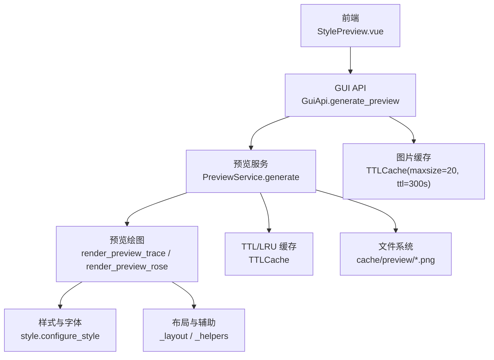
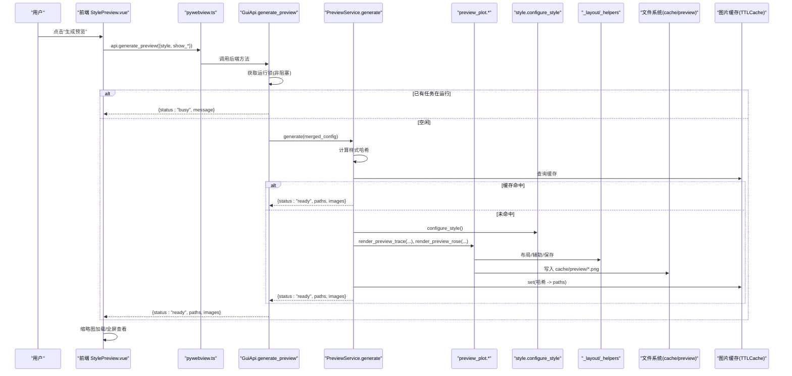
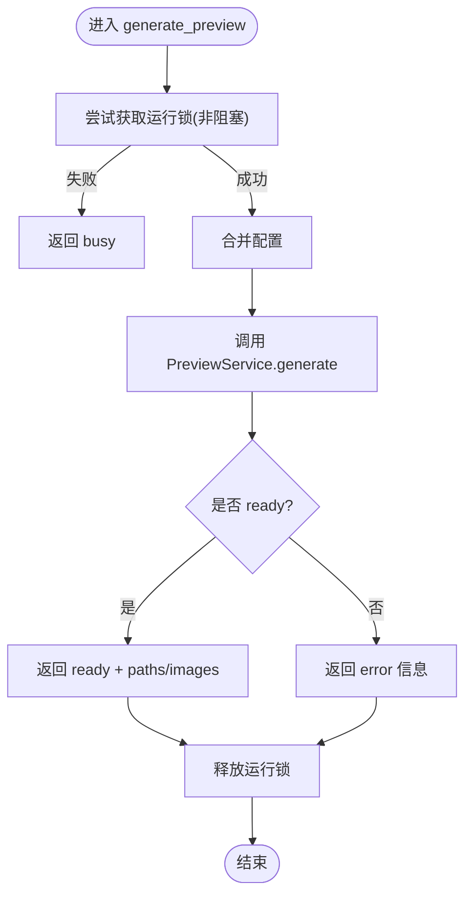
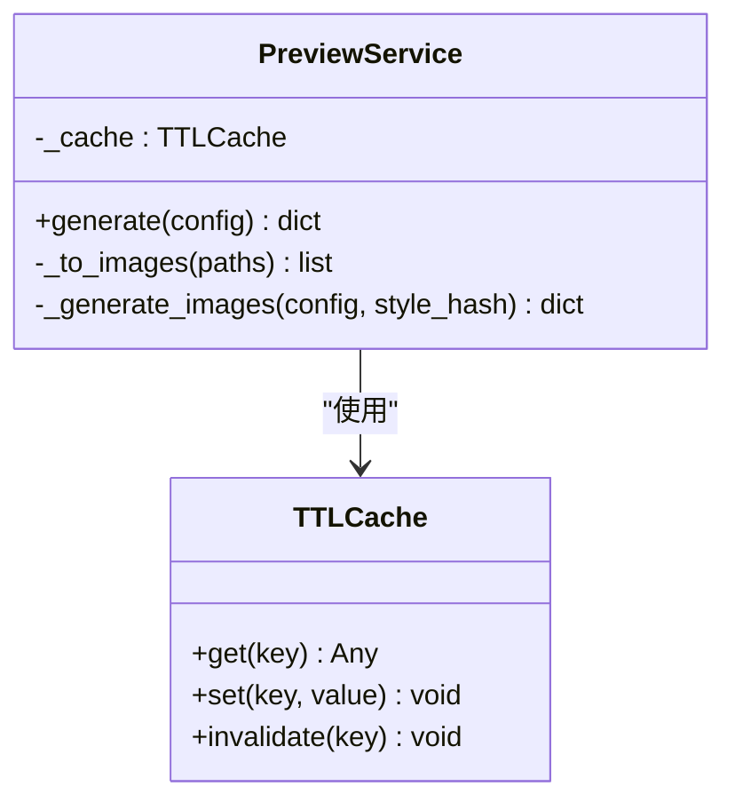
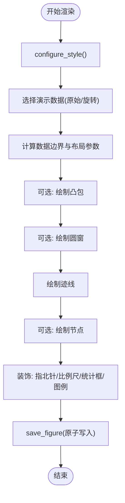
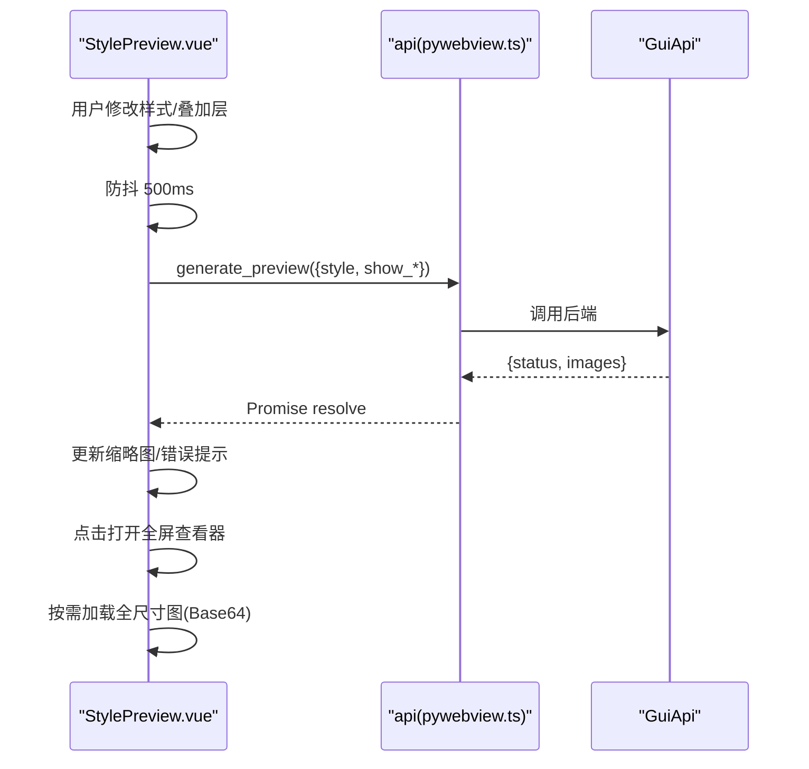
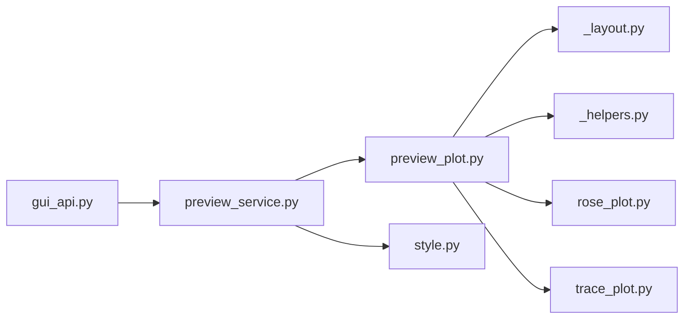

# 预览生成 API

<cite>
**本文引用的文件**   
- [backend/gui_api.py](file://backend/gui_api.py)
- [backend/services/preview_service.py](file://backend/services/preview_service.py)
- [trace_pipeline/plotting/preview_plot.py](file://trace_pipeline/plotting/preview_plot.py)
- [trace_pipeline/plotting/style.py](file://trace_pipeline/plotting/style.py)
- [trace_pipeline/plotting/_helpers.py](file://trace_pipeline/plotting/_helpers.py)
- [trace_pipeline/plotting/_layout.py](file://trace_pipeline/plotting/_layout.py)
- [backend/utils/cache.py](file://backend/utils/cache.py)
- [frontend/src/components/StylePreview.vue](file://frontend/src/components/StylePreview.vue)
- [frontend/src/api/pywebview.ts](file://frontend/src/api/pywebview.ts)
- [config.example.json](file://config.example.json)
</cite>

## 目录
1. [简介](#简介)
2. [项目结构](#项目结构)
3. [核心组件](#核心组件)
4. [架构总览](#架构总览)
5. [详细组件分析](#详细组件分析)
6. [依赖关系分析](#依赖关系分析)
7. [性能与内存管理](#性能与内存管理)
8. [故障排查指南](#故障排查指南)
9. [结论](#结论)
10. [附录：配置规范与前端集成示例](#附录配置规范与前端集成示例)

## 简介
本文件面向“实时样式预览”的生成能力，围绕 generate_preview 接口进行端到端说明。内容涵盖：
- 渲染流程：从前端触发到后端生成三张预览图（原始迹线图、旋转迹线图、走向玫瑰图）
- 渲染引擎初始化：matplotlib 全局样式与字体缓存预热
- 资源管理与并发控制：运行锁、TTL/LRU 缓存、图片缓存策略
- 输出格式与样式定制：支持的样式键、覆盖层开关、DPI 等
- 前端集成：Vue 组件调用、缩略图加载、全屏查看、防抖与错误处理
- 性能优化建议与常见问题定位

## 项目结构
预览功能由前后端协作完成：
- 前端通过 pywebview 桥调用后端 GuiApi.generate_preview
- 后端 GuiApi 使用 PreviewService 生成预览图，内部调用 trace_pipeline.plotting.preview_plot 中的渲染函数
- 渲染过程复用布局与辅助模块，统一样式与字体配置
- 结果以 PNG 文件落盘，并返回路径供前端展示

图表来源
- [backend/gui_api.py:601-627](file://backend/gui_api.py#L601-L627)
- [backend/services/preview_service.py:37-90](file://backend/services/preview_service.py#L37-L90)
- [trace_pipeline/plotting/preview_plot.py:285-491](file://trace_pipeline/plotting/preview_plot.py#L285-L491)
- [trace_pipeline/plotting/style.py:187-256](file://trace_pipeline/plotting/style.py#L187-L256)
- [trace_pipeline/plotting/_layout.py:362-391](file://trace_pipeline/plotting/_layout.py#L362-L391)
- [trace_pipeline/plotting/_helpers.py:42-93](file://trace_pipeline/plotting/_helpers.py#L42-L93)
- [backend/utils/cache.py:18-90](file://backend/utils/cache.py#L18-L90)

章节来源
- [backend/gui_api.py:601-627](file://backend/gui_api.py#L601-L627)
- [backend/services/preview_service.py:37-90](file://backend/services/preview_service.py#L37-L90)
- [trace_pipeline/plotting/preview_plot.py:285-491](file://trace_pipeline/plotting/preview_plot.py#L285-L491)
- [trace_pipeline/plotting/style.py:187-256](file://trace_pipeline/plotting/style.py#L187-L256)
- [trace_pipeline/plotting/_layout.py:362-391](file://trace_pipeline/plotting/_layout.py#L362-L391)
- [trace_pipeline/plotting/_helpers.py:42-93](file://trace_pipeline/plotting/_helpers.py#L42-L93)
- [backend/utils/cache.py:18-90](file://backend/utils/cache.py#L18-L90)

## 核心组件
- GUI API 层
  - 提供 generate_preview(config) 方法，负责合并配置、加锁、调用预览服务、记录日志
- 预览服务层
  - 基于配置计算哈希键，命中 TTLCache 则直接返回；否则调用渲染函数生成三张图，写入 cache/preview 目录
- 渲染层
  - preview_plot.render_preview_trace：绘制原始/旋转迹线图（含凸包、圆窗、节点、指北针、比例尺、统计框、图例）
  - preview_plot.render_preview_rose：绘制走向玫瑰花瓣图
  - style.configure_style：一次性配置 matplotlib 全局样式与字体栈
  - _layout/_helpers：共享布局、坐标轴、比例尺、统计框、保存图形等工具
- 缓存层
  - TTLCache：线程安全 TTL + LRU，用于预览结果与图片数据
  - DirectoryChangeDetector：检测 output 目录变更，联动失效（与本预览流间接相关）

章节来源
- [backend/gui_api.py:601-627](file://backend/gui_api.py#L601-L627)
- [backend/services/preview_service.py:37-90](file://backend/services/preview_service.py#L37-L90)
- [trace_pipeline/plotting/preview_plot.py:285-491](file://trace_pipeline/plotting/preview_plot.py#L285-L491)
- [trace_pipeline/plotting/style.py:187-256](file://trace_pipeline/plotting/style.py#L187-L256)
- [trace_pipeline/plotting/_layout.py:362-391](file://trace_pipeline/plotting/_layout.py#L362-L391)
- [trace_pipeline/plotting/_helpers.py:42-93](file://trace_pipeline/plotting/_helpers.py#L42-L93)
- [backend/utils/cache.py:18-90](file://backend/utils/cache.py#L18-L90)

## 架构总览
下图展示了从前端点击“生成预览”到最终显示图片的完整时序。

图表来源
- [frontend/src/components/StylePreview.vue:122-173](file://frontend/src/components/StylePreview.vue#L122-L173)
- [frontend/src/api/pywebview.ts:309](file://frontend/src/api/pywebview.ts#L309)
- [backend/gui_api.py:601-627](file://backend/gui_api.py#L601-L627)
- [backend/services/preview_service.py:45-90](file://backend/services/preview_service.py#L45-L90)
- [trace_pipeline/plotting/preview_plot.py:285-491](file://trace_pipeline/plotting/preview_plot.py#L285-L491)
- [trace_pipeline/plotting/style.py:187-256](file://trace_pipeline/plotting/style.py#L187-L256)
- [trace_pipeline/plotting/_layout.py:362-391](file://trace_pipeline/plotting/_layout.py#L362-L391)
- [trace_pipeline/plotting/_helpers.py:42-93](file://trace_pipeline/plotting/_helpers.py#L42-L93)

## 详细组件分析

### 组件一：GUI API 层（并发控制与入口）
- 职责
  - 暴露 generate_preview(config) 给前端
  - 合并当前配置与请求覆盖项
  - 使用非阻塞锁防止并发预览任务导致资源争用
  - 记录关键日志（状态、耗时、图像数量）
- 并发控制
  - 使用 threading.Lock 实现“运行锁”，若已有任务在运行则立即拒绝并返回 busy
- 懒加载
  - PreviewService 按需创建，避免启动开销

图表来源
- [backend/gui_api.py:601-627](file://backend/gui_api.py#L601-L627)

章节来源
- [backend/gui_api.py:601-627](file://backend/gui_api.py#L601-L627)

### 组件二：预览服务（缓存与生成编排）
- 职责
  - 根据配置计算哈希键（仅考虑影响预览的参数）
  - 命中 TTLCache 直接返回；否则调用渲染函数生成三张图
  - 将路径字典转换为结构化 images 数组返回前端
- 缓存键规则
  - 参与哈希的键：style、show_hull、show_circles、show_nodes
  - 使用 JSON 序列化后 SHA256 前缀作为键
- 生成流程
  - 调用 configure_style 初始化样式
  - 分别渲染原始/旋转迹线图与玫瑰图（若无有效产状数据则跳过玫瑰图）
  - 写入 cache/preview 目录，文件名包含哈希前缀
- 返回值
  - status: "ready"/"error"
  - paths: {"raw": "...", "rotated": "...", "rose": "..."}
  - images: [{key, label, path}, ...]

图表来源
- [backend/services/preview_service.py:37-90](file://backend/services/preview_service.py#L37-L90)
- [backend/utils/cache.py:18-90](file://backend/utils/cache.py#L18-L90)

章节来源
- [backend/services/preview_service.py:37-90](file://backend/services/preview_service.py#L37-L90)
- [backend/utils/cache.py:18-90](file://backend/utils/cache.py#L18-L90)

### 组件三：渲染引擎（预览绘图与样式）
- 迹线图渲染
  - 支持叠加层：凸包、圆窗、节点（I/Y/X），按 zorder 分层绘制
  - 自动计算数据边界、比例尺长度、标题字号、布局位置
  - 添加指北针、比例尺带、统计信息框、动态图例
- 玫瑰图渲染
  - 固定分箱宽度，绘制极坐标柱状图
- 样式与字体
  - configure_style 幂等执行一次，设置字体族、数学文本字体、线宽、DPI 等
  - 标题与正文字体栈优先 Times New Roman 与宋体，缺失时回退
- 图形保存
  - 原子写入：先写临时文件再重命名，异常时清理临时文件
  - 关闭 figure 释放内存

图表来源
- [trace_pipeline/plotting/preview_plot.py:285-491](file://trace_pipeline/plotting/preview_plot.py#L285-L491)
- [trace_pipeline/plotting/style.py:187-256](file://trace_pipeline/plotting/style.py#L187-L256)
- [trace_pipeline/plotting/_helpers.py:42-93](file://trace_pipeline/plotting/_helpers.py#L42-L93)
- [trace_pipeline/plotting/_layout.py:362-391](file://trace_pipeline/plotting/_layout.py#L362-L391)

章节来源
- [trace_pipeline/plotting/preview_plot.py:285-491](file://trace_pipeline/plotting/preview_plot.py#L285-L491)
- [trace_pipeline/plotting/style.py:187-256](file://trace_pipeline/plotting/style.py#L187-L256)
- [trace_pipeline/plotting/_helpers.py:42-93](file://trace_pipeline/plotting/_helpers.py#L42-L93)
- [trace_pipeline/plotting/_layout.py:362-391](file://trace_pipeline/plotting/_layout.py#L362-L391)

### 组件四：缓存机制（TTL/LRU 与图片缓存）
- 预览结果缓存（TTLCache）
  - 默认 TTL=300 秒，最大条目数 50
  - 批量驱逐：每 N 次 set 扫描一次过期条目
  - 支持按前缀或全量失效
- 图片缓存（GuiApi 层）
  - maxsize=20，ttl=300 秒，用于 get_image/get_image_thumbnail 等
- 失效条件
  - TTL 到期
  - 显式 invalidate/invalidate_prefix
  - 目录变更检测（output 目录）可联动使其他缓存失效（与本预览流间接相关）

章节来源
- [backend/utils/cache.py:18-90](file://backend/utils/cache.py#L18-L90)
- [backend/gui_api.py:92-94](file://backend/gui_api.py#L92-L94)
- [backend/gui_api.py:225-230](file://backend/gui_api.py#L225-L230)

### 组件五：前端集成（实时预览体验）
- 交互流程
  - 用户勾选叠加层或修改样式后，组件防抖 500ms 触发生成
  - 调用 api.generate_preview，返回 ready 后更新缩略图
  - 点击缩略图打开全屏查看器，按需加载全尺寸 Base64
- 用户体验优化
  - 缩略图加载：限制最大边长，减少首屏带宽
  - 懒加载：全屏查看时才加载全尺寸图
  - 错误提示：统一错误消息与清空占位图
  - 防抖：避免频繁重复请求

图表来源
- [frontend/src/components/StylePreview.vue:122-173](file://frontend/src/components/StylePreview.vue#L122-L173)
- [frontend/src/api/pywebview.ts:309](file://frontend/src/api/pywebview.ts#L309)

章节来源
- [frontend/src/components/StylePreview.vue:122-173](file://frontend/src/components/StylePreview.vue#L122-L173)
- [frontend/src/api/pywebview.ts:309](file://frontend/src/api/pywebview.ts#L309)

## 依赖关系分析
- 模块耦合
  - gui_api.py 依赖 preview_service.py
  - preview_service.py 依赖 preview_plot.py、style.py、_layout.py、_helpers.py
  - preview_plot.py 依赖 rose_plot、trace_plot 的部分导出（如 segments_to_xy）
- 外部依赖
  - matplotlib（绘图）、numpy（数值计算）、PIL（图片处理，图片缓存路径中可能用到）
- 潜在循环依赖
  - 通过延迟导入避免（例如 apply_style_overrides 内延迟导入 trace_plot/rose_plot）

图表来源
- [backend/gui_api.py:601-627](file://backend/gui_api.py#L601-L627)
- [backend/services/preview_service.py:105-166](file://backend/services/preview_service.py#L105-L166)
- [trace_pipeline/plotting/preview_plot.py:1-34](file://trace_pipeline/plotting/preview_plot.py#L1-L34)

章节来源
- [backend/gui_api.py:601-627](file://backend/gui_api.py#L601-L627)
- [backend/services/preview_service.py:105-166](file://backend/services/preview_service.py#L105-L166)
- [trace_pipeline/plotting/preview_plot.py:1-34](file://trace_pipeline/plotting/preview_plot.py#L1-L34)

## 性能与内存管理
- 并发控制
  - 运行锁保证同一时刻只有一个预览任务执行，避免多进程竞争资源
- 缓存策略
  - 预览结果 TTLCache：TTL=300s，maxsize=50，LRU 淘汰
  - 图片缓存 TTLCache：TTL=300s，maxsize=20，降低磁盘 I/O 与解码开销
- 渲染优化
  - 演示数据硬编码，避免真实数据处理开销
  - 原子写入 savefig，异常不产生损坏文件
  - 按需关闭 figure，及时释放内存
- 前端优化
  - 缩略图加载限制尺寸，减少网络传输
  - 懒加载全尺寸图，提升首屏速度
  - 防抖减少重复请求

[本节为通用性能讨论，无需特定文件引用]

## 故障排查指南
- 常见错误与定位
  - 返回 busy：已有预览任务在运行，等待或重试
  - 返回 error：检查后端日志，确认样式键是否合法、文件系统权限、matplotlib 字体可用性
  - 图片无法显示：确认路径是否在可信目录内、图片缓存是否命中、浏览器是否允许本地资源访问
- 日志关键字
  - preview_cache_hit、preview_generate、preview_error、api_preview_reject、api_preview
- 快速自检
  - 调用 preload_fonts 预热字体与样式，观察返回的可用字体列表
  - 检查 cache/preview 目录是否存在对应 PNG 文件
  - 调整 TTL/maxsize 观察命中率变化

章节来源
- [backend/gui_api.py:601-627](file://backend/gui_api.py#L601-L627)
- [backend/services/preview_service.py:45-90](file://backend/services/preview_service.py#L45-L90)
- [trace_pipeline/plotting/_helpers.py:42-93](file://trace_pipeline/plotting/_helpers.py#L42-L93)

## 结论
预览生成 API 通过“运行锁 + TTL/LRU 缓存 + 原子写入 + 前端懒加载”的组合，实现了低延迟、高吞吐、稳定的实时样式预览体验。其解耦的预览绘图模块确保样式验证不受业务逻辑干扰，便于独立迭代与回归测试。

[本节为总结性内容，无需特定文件引用]

## 附录：配置规范与前端集成示例

### 预览配置规范
- 顶层字段（merge 到当前配置）
  - style: 对象，包含样式键（见下）
  - show_hull: 布尔，是否显示凸包
  - show_circles: 布尔，是否显示圆窗
  - show_nodes: 布尔，是否显示节点
- 样式键（部分常用键，其余参考样式常量映射）
  - trace_line_color、trace_line_width
  - hull_line_color、hull_fill_alpha
  - circle_window_line_color、circle_window_fill_alpha
  - rose_bar_color、rose_bar_edge、rose_grid_color
  - title_font_size、label_font_size（向后兼容 global_font_size）
  - node_style: 预设名（default/solid/hollow/dark）
- 输出格式
  - PNG，DPI 默认 300（可在渲染函数参数中指定）
- 文件落盘
  - 目录：cache/preview
  - 命名：preview_{style_hash}_{raw|rotated|rose}.png

章节来源
- [backend/services/preview_service.py:28-34](file://backend/services/preview_service.py#L28-L34)
- [backend/services/preview_service.py:105-166](file://backend/services/preview_service.py#L105-L166)
- [trace_pipeline/plotting/preview_plot.py:285-491](file://trace_pipeline/plotting/preview_plot.py#L285-L491)
- [trace_pipeline/plotting/style.py:22-35](file://trace_pipeline/plotting/style.py#L22-L35)
- [config.example.json:18](file://config.example.json#L18)

### 前端集成示例（步骤）
- 在 Vue 组件中引入 api 并调用 generate_preview
- 传入当前样式配置与叠加层开关
- 处理返回的 images 列表，为每个 key 生成缩略图 URL
- 点击缩略图打开全屏查看器，按需加载全尺寸图
- 错误处理：显示错误消息并清空占位图
- 防抖：对样式/叠加层变更进行 500ms 防抖

章节来源
- [frontend/src/components/StylePreview.vue:122-173](file://frontend/src/components/StylePreview.vue#L122-L173)
- [frontend/src/api/pywebview.ts:309](file://frontend/src/api/pywebview.ts#L309)