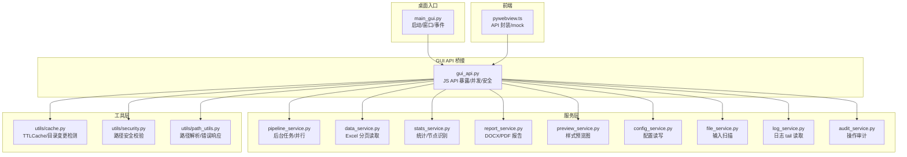
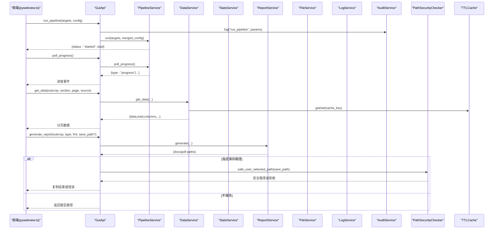
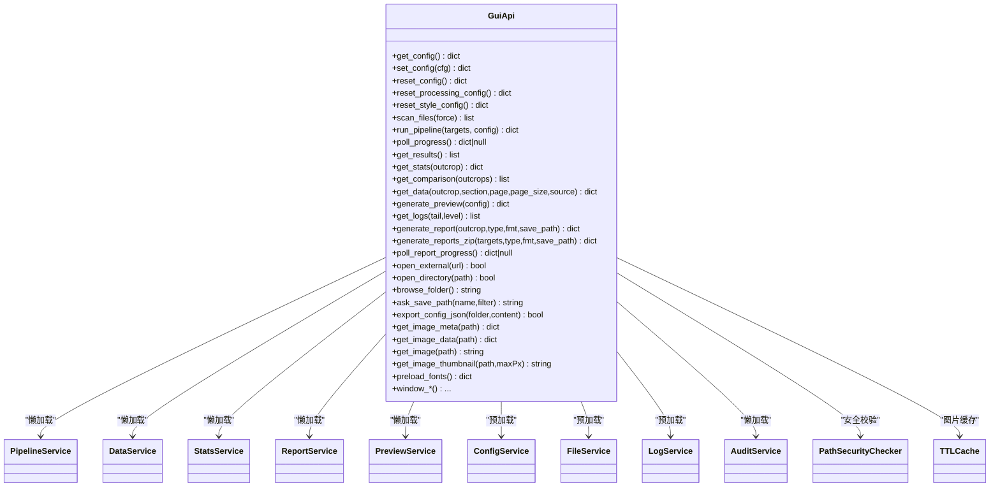
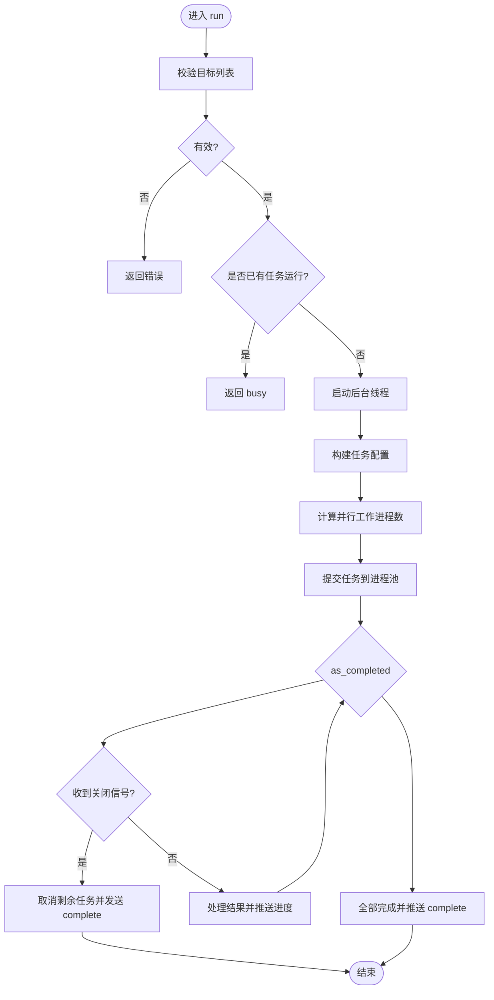
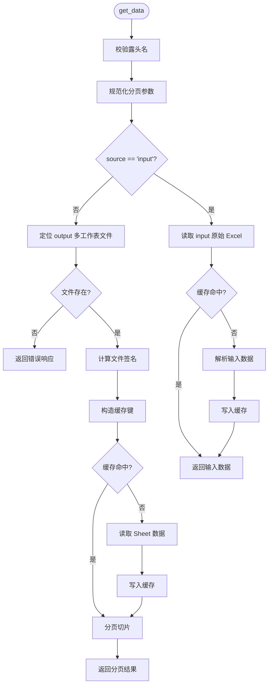
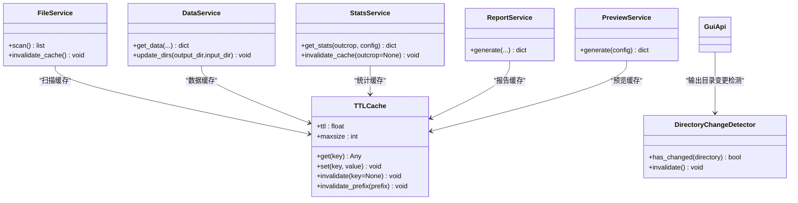
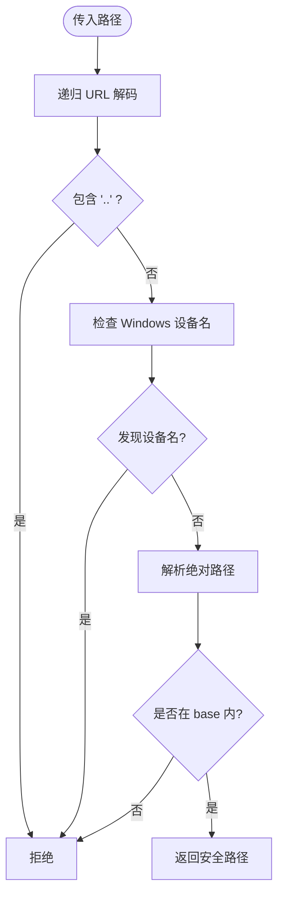
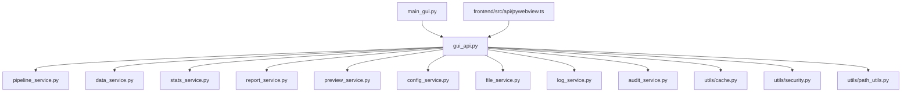

# 后端开发

<cite>
**本文引用的文件**   
- [backend/main_gui.py](file://backend/main_gui.py)
- [backend/gui_api.py](file://backend/gui_api.py)
- [backend/services/pipeline_service.py](file://backend/services/pipeline_service.py)
- [backend/services/data_service.py](file://backend/services/data_service.py)
- [backend/utils/cache.py](file://backend/utils/cache.py)
- [backend/services/config_service.py](file://backend/services/config_service.py)
- [backend/services/file_service.py](file://backend/services/file_service.py)
- [backend/services/log_service.py](file://backend/services/log_service.py)
- [backend/utils/security.py](file://backend/utils/security.py)
- [backend/utils/path_utils.py](file://backend/utils/path_utils.py)
- [backend/services/preview_service.py](file://backend/services/preview_service.py)
- [backend/services/stats_service.py](file://backend/services/stats_service.py)
- [backend/services/report_service.py](file://backend/services/report_service.py)
- [backend/services/audit_service.py](file://backend/services/audit_service.py)
- [frontend/src/api/pywebview.ts](file://frontend/src/api/pywebview.ts)
</cite>

## 目录
1. [简介](#简介)
2. [项目结构](#项目结构)
3. [核心组件](#核心组件)
4. [架构总览](#架构总览)
5. [详细组件分析](#详细组件分析)
6. [依赖关系分析](#依赖关系分析)
7. [性能考量](#性能考量)
8. [故障排查指南](#故障排查指南)
9. [结论](#结论)
10. [附录](#附录)

## 简介
本指南面向 TracePipeline 后端开发者，系统性解析 Python 后端服务架构、GUI API 设计、前后端通信协议与异步处理机制，并深入剖析核心服务（pipeline_service、data_service、cache_service）的实现细节。文档同时覆盖安全机制（路径遍历防护、外部域名白名单）、日志记录、异常处理与性能监控，并提供扩展开发与测试策略建议。

## 项目结构
后端采用“入口 + GUI API 桥接 + 分层服务”的架构：
- 入口程序负责应用启动、窗口创建、WebView2 检查与生命周期管理。
- GuiApi 作为 pywebview JS API 暴露层，统一编排各业务服务调用、并发控制与安全校验。
- services 下按职责划分多个服务模块，分别负责流水线执行、数据访问、统计计算、报告生成、预览、配置、文件扫描、日志读取与审计。
- utils 提供缓存、路径工具与安全校验等通用能力。
- frontend/src/api/pywebview.ts 为前端对后端 API 的 TypeScript 封装，屏蔽环境差异并提供 mock 支持。

图表来源
- [backend/main_gui.py:81-206](file://backend/main_gui.py#L81-L206)
- [backend/gui_api.py:52-158](file://backend/gui_api.py#L52-L158)
- [backend/services/pipeline_service.py:32-95](file://backend/services/pipeline_service.py#L32-L95)
- [backend/services/data_service.py:44-188](file://backend/services/data_service.py#L44-L188)
- [backend/services/stats_service.py:35-100](file://backend/services/stats_service.py#L35-L100)
- [backend/services/report_service.py:183-244](file://backend/services/report_service.py#L183-L244)
- [backend/services/preview_service.py:37-90](file://backend/services/preview_service.py#L37-L90)
- [backend/services/config_service.py:41-101](file://backend/services/config_service.py#L41-L101)
- [backend/services/file_service.py:17-89](file://backend/services/file_service.py#L17-L89)
- [backend/services/log_service.py:57-142](file://backend/services/log_service.py#L57-L142)
- [backend/services/audit_service.py:22-47](file://backend/services/audit_service.py#L22-L47)
- [backend/utils/cache.py:18-90](file://backend/utils/cache.py#L18-L90)
- [backend/utils/security.py:14-128](file://backend/utils/security.py#L14-L128)
- [backend/utils/path_utils.py:20-68](file://backend/utils/path_utils.py#L20-L68)
- [frontend/src/api/pywebview.ts:144-185](file://frontend/src/api/pywebview.ts#L144-L185)

章节来源
- [backend/main_gui.py:81-206](file://backend/main_gui.py#L81-L206)
- [backend/gui_api.py:52-158](file://backend/gui_api.py#L52-L158)
- [frontend/src/api/pywebview.ts:144-185](file://frontend/src/api/pywebview.ts#L144-L185)

## 核心组件
- 入口与窗口管理：负责 WebView2 检查、窗口居中、图标设置、关闭时优雅停止流水线。
- GUI API 桥接：集中暴露所有可被前端调用的方法；实现懒加载服务实例、运行锁、进度队列、输出目录变更检测、图片缓存、外部域名白名单校验等。
- 服务层：
  - pipeline_service：后台线程 + 进程池并行执行，非阻塞返回，前端轮询进度。
  - data_service：读取 input/output Excel，多工作表支持，分页返回，TTL 缓存。
  - stats_service：统计指标、节点识别、覆盖层几何计算，带 TTL 缓存与指纹键。
  - report_service：DOCX/PDF 报告生成，结果缓存，字体探测与混排。
  - preview_service：基于固定演示数据的样式预览图生成，独立于正式绘图逻辑。
  - config_service：配置文件的原子写入、合并、重置、部分重置。
  - file_service：扫描输入目录，判断处理状态，带扫描缓存。
  - log_service：高效 tail 读取 JSON Lines 日志，按级别过滤。
  - audit_service：操作审计记录，内存缓冲 + 日志归档回退。
- 工具层：
  - cache：TTLCache（LRU+过期驱逐），DirectoryChangeDetector（目录快照对比）。
  - security：PathSecurityChecker（URL 解码、设备名、符号链接、基准目录限制）。
  - path_utils：露头名校验、路径解析、统一错误响应格式。

章节来源
- [backend/gui_api.py:52-158](file://backend/gui_api.py#L52-L158)
- [backend/services/pipeline_service.py:32-95](file://backend/services/pipeline_service.py#L32-L95)
- [backend/services/data_service.py:44-188](file://backend/services/data_service.py#L44-L188)
- [backend/services/stats_service.py:35-100](file://backend/services/stats_service.py#L35-L100)
- [backend/services/report_service.py:183-244](file://backend/services/report_service.py#L183-L244)
- [backend/services/preview_service.py:37-90](file://backend/services/preview_service.py#L37-L90)
- [backend/services/config_service.py:41-101](file://backend/services/config_service.py#L41-L101)
- [backend/services/file_service.py:17-89](file://backend/services/file_service.py#L17-L89)
- [backend/services/log_service.py:57-142](file://backend/services/log_service.py#L57-L142)
- [backend/services/audit_service.py:22-47](file://backend/services/audit_service.py#L22-L47)
- [backend/utils/cache.py:18-90](file://backend/utils/cache.py#L18-L90)
- [backend/utils/security.py:14-128](file://backend/utils/security.py#L14-L128)
- [backend/utils/path_utils.py:20-68](file://backend/utils/path_utils.py#L20-L68)

## 架构总览
整体交互流程：前端通过 pywebview.ts 调用后端 GuiApi 暴露的方法；GuiApi 根据请求路由到对应服务；服务内部使用工具层进行缓存、安全校验与路径解析；必要时触发后台任务并通过轮询获取进度。

图表来源
- [backend/gui_api.py:388-445](file://backend/gui_api.py#L388-L445)
- [backend/gui_api.py:556-599](file://backend/gui_api.py#L556-L599)
- [backend/gui_api.py:644-730](file://backend/gui_api.py#L644-L730)
- [backend/services/pipeline_service.py:42-95](file://backend/services/pipeline_service.py#L42-L95)
- [backend/services/data_service.py:78-188](file://backend/services/data_service.py#L78-L188)
- [backend/services/report_service.py:245-364](file://backend/services/report_service.py#L245-L364)
- [backend/utils/security.py:47-128](file://backend/utils/security.py#L47-L128)
- [backend/utils/cache.py:40-90](file://backend/utils/cache.py#L40-L90)

## 详细组件分析

### GUI API 设计与前后端通信协议
- 通信方式：桌面端通过 pywebview 注入的全局对象将 GuiApi 方法暴露给前端；前端在 pywebview.ts 中封装为 async Promise 接口，并在浏览器环境下自动降级为 mockApi。
- 就绪等待：waitForApi 监听 pywebviewready 事件，超时放行以支持开发模式。
- 参数与返回值：
  - 配置：get_config/set_config/reset_config/reset_processing_config/reset_style_config。
  - 文件：scan_files(force)。
  - 流水线：run_pipeline(targets, config)，poll_progress()。
  - 结果与统计：get_results(), get_stats(outcrop), get_comparison(outcrops)。
  - 数据页：get_data(outcrop, section, page, page_size, source="output")。
  - 预览：generate_preview(config)。
  - 日志：get_logs(tail, level)。
  - 报告：generate_report(outcrop, report_type, fmt, save_path?)，generate_reports_zip(targets, report_type, fmt, save_path?)，poll_report_progress()。
  - 其他：open_external(url)、open_directory(path)、browse_folder()、ask_save_path(defaultName, fileFilter)、export_config_json(folder, content)、图像相关接口、窗口控制接口、preload_fonts()。
- 错误响应格式：统一使用 {"status":"error","message":...,"error":...} 形式，便于前端一致处理。

图表来源
- [backend/gui_api.py:52-158](file://backend/gui_api.py#L52-L158)
- [backend/gui_api.py:388-445](file://backend/gui_api.py#L388-L445)
- [backend/gui_api.py:556-599](file://backend/gui_api.py#L556-L599)
- [backend/gui_api.py:644-730](file://backend/gui_api.py#L644-L730)
- [backend/services/pipeline_service.py:32-95](file://backend/services/pipeline_service.py#L32-L95)
- [backend/services/data_service.py:44-188](file://backend/services/data_service.py#L44-L188)
- [backend/services/stats_service.py:35-100](file://backend/services/stats_service.py#L35-L100)
- [backend/services/report_service.py:183-244](file://backend/services/report_service.py#L183-L244)
- [backend/services/preview_service.py:37-90](file://backend/services/preview_service.py#L37-L90)
- [backend/services/config_service.py:41-101](file://backend/services/config_service.py#L41-L101)
- [backend/services/file_service.py:17-89](file://backend/services/file_service.py#L17-L89)
- [backend/services/log_service.py:57-142](file://backend/services/log_service.py#L57-L142)
- [backend/services/audit_service.py:22-47](file://backend/services/audit_service.py#L22-L47)
- [backend/utils/security.py:14-128](file://backend/utils/security.py#L14-L128)
- [backend/utils/cache.py:18-90](file://backend/utils/cache.py#L18-L90)

章节来源
- [frontend/src/api/pywebview.ts:144-185](file://frontend/src/api/pywebview.ts#L144-L185)
- [frontend/src/api/pywebview.ts:193-279](file://frontend/src/api/pywebview.ts#L193-L279)
- [backend/gui_api.py:388-445](file://backend/gui_api.py#L388-L445)
- [backend/gui_api.py:556-599](file://backend/gui_api.py#L556-L599)
- [backend/gui_api.py:644-730](file://backend/gui_api.py#L644-L730)

### 流水线服务（pipeline_service）处理流程编排
- 非阻塞启动：run 校验目标列表，启动后台线程执行 _run_background，立即返回 started。
- 并行执行：根据 parallel_workers 与 CPU 核心数决定工作进程数，使用 ProcessPoolExecutor 提交任务。
- 进度推送：通过线程安全队列向 GuiApi 推送 start/progress/file_complete/complete/error 事件。
- 优雅关闭：shutdown 设置取消信号并 join(timeout)，避免强制中断导致文件损坏。

图表来源
- [backend/services/pipeline_service.py:42-95](file://backend/services/pipeline_service.py#L42-L95)
- [backend/services/pipeline_service.py:100-346](file://backend/services/pipeline_service.py#L100-L346)

章节来源
- [backend/services/pipeline_service.py:42-95](file://backend/services/pipeline_service.py#L42-L95)
- [backend/services/pipeline_service.py:100-346](file://backend/services/pipeline_service.py#L100-L346)

### 数据服务（data_service）数据访问模式
- 数据源：output/{outcrop}_traces.xlsx（多工作表）或 input/{outcrop}_process.xls/.xlsx。
- 分区映射：SECTION_MAP 将前端分区名映射到 Excel Sheet 名。
- 分页：规范化 page/page_size，限制最大页大小，返回当前页数据与总数。
- 缓存：基于文件签名（mtime_ns、size）与 sheet 名构造 TTL 缓存键，减少重复 IO。
- 输入读取：兼容单工作表与多工作表旧格式，空行过滤与类型转换。

图表来源
- [backend/services/data_service.py:78-188](file://backend/services/data_service.py#L78-L188)
- [backend/services/data_service.py:190-266](file://backend/services/data_service.py#L190-L266)

章节来源
- [backend/services/data_service.py:78-188](file://backend/services/data_service.py#L78-L188)
- [backend/services/data_service.py:190-266](file://backend/services/data_service.py#L190-L266)

### 多级缓存体系（cache_service）
- TTLCache：线程安全的 LRU + TTL 淘汰，批量驱逐降低开销，支持前缀失效与全量失效。
- DirectoryChangeDetector：维护目录浅层快照（文件名、是否目录、大小、修改时间），用于检测外部变更并触发缓存失效。
- 应用点：
  - FileService 扫描缓存（短 TTL）。
  - DataService 数据缓存（基于文件签名）。
  - StatsService 统计缓存（基于关键配置子集与输入指纹）。
  - ReportService 报告结果缓存（含图片 mtime 校验）。
  - PreviewService 预览图缓存（基于样式哈希）。

图表来源
- [backend/utils/cache.py:18-90](file://backend/utils/cache.py#L18-L90)
- [backend/utils/cache.py:92-155](file://backend/utils/cache.py#L92-L155)
- [backend/services/file_service.py:17-89](file://backend/services/file_service.py#L17-L89)
- [backend/services/data_service.py:78-188](file://backend/services/data_service.py#L78-L188)
- [backend/services/stats_service.py:35-100](file://backend/services/stats_service.py#L35-L100)
- [backend/services/report_service.py:183-244](file://backend/services/report_service.py#L183-L244)
- [backend/services/preview_service.py:37-90](file://backend/services/preview_service.py#L37-L90)
- [backend/gui_api.py:250-262](file://backend/gui_api.py#L250-L262)

章节来源
- [backend/utils/cache.py:18-90](file://backend/utils/cache.py#L18-L90)
- [backend/utils/cache.py:92-155](file://backend/utils/cache.py#L92-L155)
- [backend/gui_api.py:250-262](file://backend/gui_api.py#L250-L262)

### 安全机制
- 路径遍历防护：
  - PathSecurityChecker 递归 URL 解码、禁止 ".."、拒绝 Windows 设备名、resolve 后限制在 base 目录下。
  - GuiApi 提供 _safe_path/_safe_known_path/_safe_user_selected_path 等方法，结合可信目录白名单与用户选择登记机制。
- 外部域名白名单验证：
  - open_external 仅允许预定义域（如 Microsoft 官方下载域），防止任意外链打开。
- 露头名校验：
  - validate_outcrop_name 使用正则限制字符集，防止路径逃逸。

图表来源
- [backend/utils/security.py:47-128](file://backend/utils/security.py#L47-L128)
- [backend/gui_api.py:165-208](file://backend/gui_api.py#L165-L208)
- [backend/utils/path_utils.py:20-37](file://backend/utils/path_utils.py#L20-L37)
- [backend/gui_api.py:39-46](file://backend/gui_api.py#L39-L46)

章节来源
- [backend/utils/security.py:47-128](file://backend/utils/security.py#L47-L128)
- [backend/gui_api.py:165-208](file://backend/gui_api.py#L165-L208)
- [backend/utils/path_utils.py:20-37](file://backend/utils/path_utils.py#L20-L37)
- [backend/gui_api.py:39-46](file://backend/gui_api.py#L39-L46)

### 日志记录、异常处理与性能监控
- 结构化日志：
  - 主日志：JSON Lines 按天归档，LogService 反向 tail 读取，支持级别过滤与 request_id 追踪。
  - 审计日志：AuditService 将操作记录到统一日志流，内存缓冲 + 归档回退。
- 异常处理：
  - 服务层捕获业务异常并返回统一错误响应；关键异常（MemoryError、SystemExit、KeyboardInterrupt）向上抛出。
  - 流水线后台线程捕获异常并推送 error 事件，确保前端感知失败。
- 性能监控：
  - 大量使用 time.perf_counter 计算耗时，extra 字段携带 duration_ms、stage、count 等指标，便于分析与告警。
  - 并发与资源控制：运行锁（preview/report）、Rlock 保护服务懒加载、进程池并行度裁剪。

章节来源
- [backend/services/log_service.py:78-142](file://backend/services/log_service.py#L78-L142)
- [backend/services/audit_service.py:28-47](file://backend/services/audit_service.py#L28-L47)
- [backend/services/pipeline_service.py:326-346](file://backend/services/pipeline_service.py#L326-L346)
- [backend/gui_api.py:420-445](file://backend/gui_api.py#L420-L445)

### 服务扩展开发与测试策略
- 新增服务步骤：
  - 在 backend/services 下新建服务类，遵循单一职责与线程安全原则。
  - 在 GuiApi 中以懒加载属性暴露新服务，并在需要处加入运行锁与审计记录。
  - 在前端 pywebview.ts 中补充对应方法签名与 mock 实现。
- 测试策略：
  - 单元测试：针对服务方法（如 get_data、get_stats、generate）编写断言，覆盖正常与异常分支。
  - 集成测试：模拟文件系统与配置变更，验证缓存失效与目录变更检测。
  - 并发测试：验证运行锁与进程池行为，确保无竞态与资源耗尽。
  - 安全测试：构造越权路径与非法露头名，确认拦截与错误响应。
  - 性能测试：测量关键路径耗时与缓存命中率，评估 TTL 与 maxsize 配置。

[本节为概念性内容，不直接分析具体文件]

## 依赖关系分析
- 入口 main_gui.py 初始化 GuiApi 并绑定窗口事件。
- GuiApi 依赖各服务与工具层，形成松耦合的分层架构。
- 服务间尽量不直接互相依赖，通过 GuiApi 协调；必要时通过工具层共享能力（缓存、安全、路径）。
- 前端通过 pywebview.ts 与后端解耦，mock 支持提升开发效率。

图表来源
- [backend/main_gui.py:81-206](file://backend/main_gui.py#L81-L206)
- [backend/gui_api.py:52-158](file://backend/gui_api.py#L52-L158)
- [frontend/src/api/pywebview.ts:144-185](file://frontend/src/api/pywebview.ts#L144-L185)

章节来源
- [backend/main_gui.py:81-206](file://backend/main_gui.py#L81-L206)
- [backend/gui_api.py:52-158](file://backend/gui_api.py#L52-L158)
- [frontend/src/api/pywebview.ts:144-185](file://frontend/src/api/pywebview.ts#L144-L185)

## 性能考量
- 并行执行：pipeline_service 根据 CPU 核心数与配置动态调整工作进程，避免过度并行导致上下文切换开销。
- 缓存策略：
  - TTLCache 批量驱逐与 LRU 淘汰，减少频繁清理开销。
  - 目录变更检测仅在必要时机触发，避免全量扫描。
  - 统计与报告缓存基于稳定键与图片 mtime 校验，提高命中率与一致性。
- I/O 优化：
  - LogService 反向 tail 读取，避免大文件全量加载。
  - DataService 基于文件签名构造缓存键，减少重复解析。
- 资源控制：
  - 重资源操作（预览、报告）使用运行锁，防止并发导致资源耗尽。
  - 图片缓存限制数量与 TTL，平衡内存占用与命中率。

[本节为一般性指导，不直接分析具体文件]

## 故障排查指南
- 常见问题定位：
  - 流水线未启动或卡住：检查 GuiApi 运行锁与 pipeline_service 后台线程状态；查看日志中的 stage 与 duration_ms。
  - 数据读取失败：确认 output/input 目录与文件存在；检查 SECTION_MAP 与工作表名称；查看 DataService 的错误响应。
  - 报告生成失败：确认依赖库安装（python-docx、reportlab）；检查字体注册与图片路径；查看 ReportService 的错误信息。
  - 安全拒绝：检查 PathSecurityChecker 的日志输出，确认路径是否越权或包含非法字符。
- 调试技巧：
  - 使用 get_logs 拉取最近日志，按级别过滤，关注 request_id 与 extra 字段。
  - 启用 AuditService 的操作审计，回溯用户动作与参数。
  - 在关键路径增加额外日志，标注阶段与耗时，便于性能分析。

章节来源
- [backend/services/log_service.py:78-142](file://backend/services/log_service.py#L78-L142)
- [backend/services/audit_service.py:28-47](file://backend/services/audit_service.py#L28-L47)
- [backend/services/data_service.py:128-157](file://backend/services/data_service.py#L128-L157)
- [backend/services/report_service.py:315-364](file://backend/services/report_service.py#L315-L364)
- [backend/utils/security.py:47-128](file://backend/utils/security.py#L47-L128)

## 结论
TracePipeline 后端采用清晰的分层架构与模块化服务设计，通过 GuiApi 统一暴露 API、协调并发与安全校验，配合多级缓存与目录变更检测，实现了高性能与高可用。安全机制完善，日志与审计健全，便于问题定位与性能优化。扩展开发应遵循现有模式，保持线程安全与错误响应一致性，并通过完善的测试策略保障质量。

[本节为总结性内容，不直接分析具体文件]

## 附录
- 前端 API 封装要点：
  - waitForApi 保证后端就绪后再发起调用。
  - mockApi 提供与后端一致的接口，支持浏览器环境独立开发。
  - 所有方法均为 async Promise，异常由调用方 catch 处理。

章节来源
- [frontend/src/api/pywebview.ts:144-185](file://frontend/src/api/pywebview.ts#L144-L185)
- [frontend/src/api/pywebview.ts:193-279](file://frontend/src/api/pywebview.ts#L193-L279)