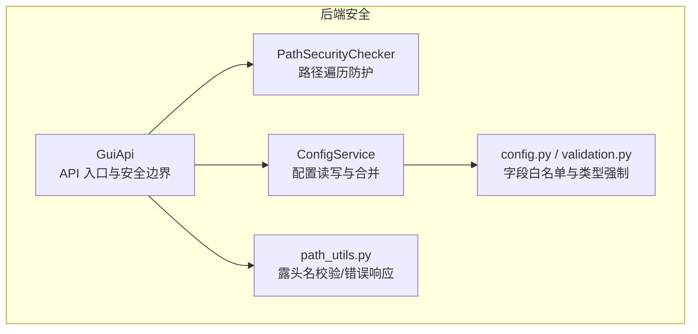
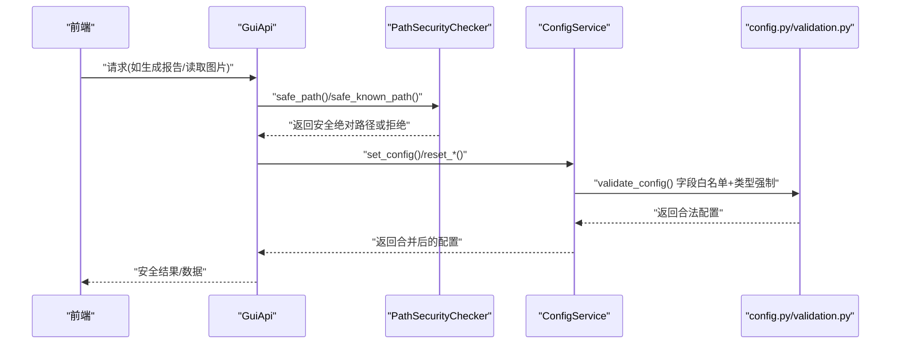
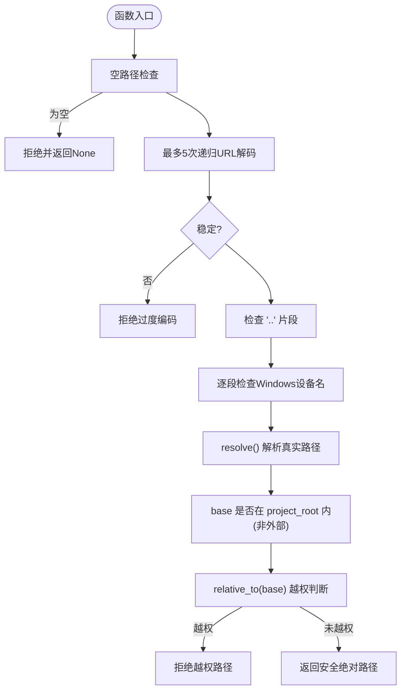
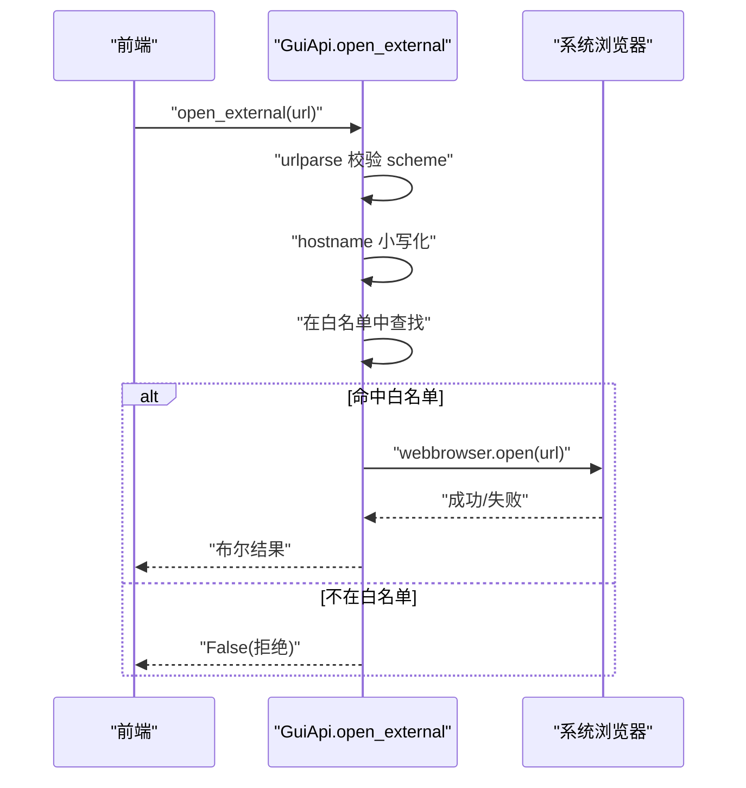
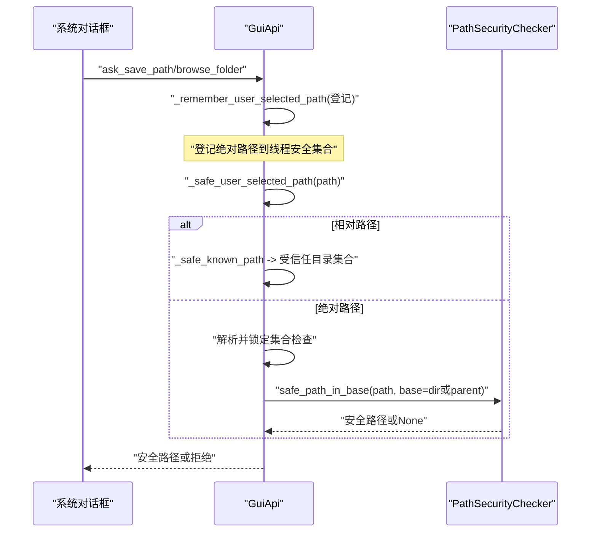
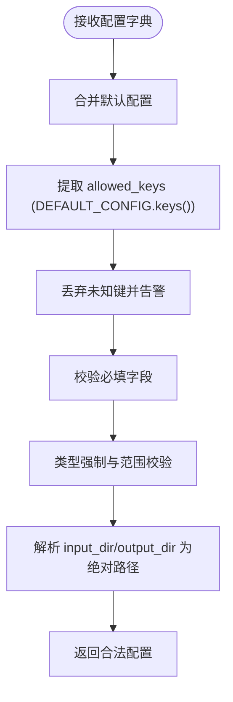
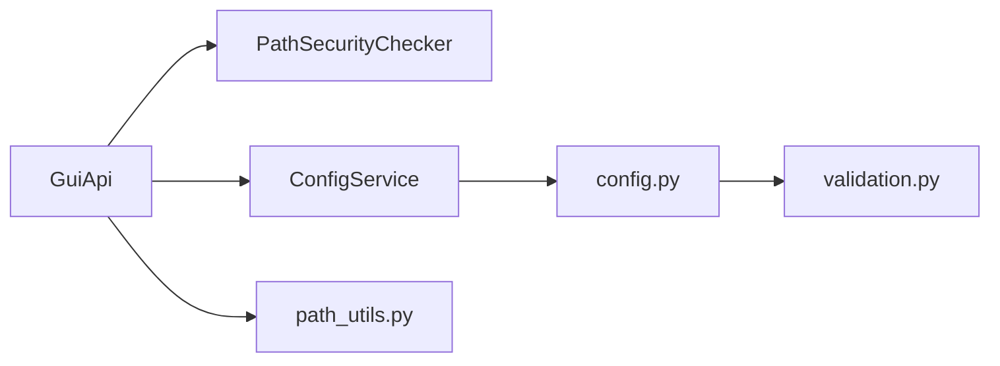

# 安全机制

<cite>
**本文引用的文件列表**
- [backend/utils/security.py](file://backend/utils/security.py)
- [backend/gui_api.py](file://backend/gui_api.py)
- [backend/services/config_service.py](file://backend/services/config_service.py)
- [trace_pipeline/config.py](file://trace_pipeline/config.py)
- [trace_pipeline/validation.py](file://trace_pipeline/validation.py)
- [backend/utils/path_utils.py](file://backend/utils/path_utils.py)
- [tests/test_security.py](file://tests/test_security.py)
- [tests/test_path_utils.py](file://tests/test_path_utils.py)
</cite>

## 目录
1. [简介](#简介)
2. [项目结构](#项目结构)
3. [核心组件](#核心组件)
4. [架构总览](#架构总览)
5. [详细组件分析](#详细组件分析)
6. [依赖关系分析](#依赖关系分析)
7. [性能与安全权衡](#性能与安全权衡)
8. [故障排查指南](#故障排查指南)
9. [结论](#结论)
10. [附录：渗透测试与最佳实践](#附录渗透测试与最佳实践)

## 简介
本技术文档聚焦后端安全机制，围绕以下目标展开：
- 深入解析 PathSecurityChecker 的路径遍历防护实现（路径规范化、白名单验证、越权访问检测）。
- 详细说明外部域名白名单机制（URL 解析、域名匹配与安全策略）。
- 解释用户选择路径的安全验证流程（系统对话框登记、绝对路径校验和权限检查）。
- 说明配置文件覆盖的安全限制（字段白名单与敏感参数保护）。
- 提供安全漏洞防护最佳实践与渗透测试指南。

## 项目结构
本项目在后端层集中实现了多项安全控制点，关键位置如下：
- 路径安全校验器：backend/utils/security.py
- GUI API 入口与安全边界：backend/gui_api.py
- 配置服务与覆盖白名单：backend/services/config_service.py
- 配置加载与字段白名单/类型强制：trace_pipeline/config.py, trace_pipeline/validation.py
- 共享路径工具与露头名校验：backend/utils/path_utils.py
- 相关单元测试：tests/test_security.py, tests/test_path_utils.py

图表来源
- [backend/gui_api.py:1-120](file://backend/gui_api.py#L1-L120)
- [backend/utils/security.py:14-128](file://backend/utils/security.py#L14-L128)
- [backend/services/config_service.py:41-144](file://backend/services/config_service.py#L41-L144)
- [trace_pipeline/config.py:148-190](file://trace_pipeline/config.py#L148-L190)
- [trace_pipeline/validation.py:90-112](file://trace_pipeline/validation.py#L90-L112)
- [backend/utils/path_utils.py:20-37](file://backend/utils/path_utils.py#L20-L37)

章节来源
- [backend/gui_api.py:1-120](file://backend/gui_api.py#L1-L120)
- [backend/utils/security.py:14-128](file://backend/utils/security.py#L14-L128)
- [backend/services/config_service.py:41-144](file://backend/services/config_service.py#L41-L144)
- [trace_pipeline/config.py:148-190](file://trace_pipeline/config.py#L148-L190)
- [trace_pipeline/validation.py:90-112](file://trace_pipeline/validation.py#L90-L112)
- [backend/utils/path_utils.py:20-37](file://backend/utils/path_utils.py#L20-L37)

## 核心组件
- PathSecurityChecker：统一的路径安全校验器，负责 URL 解码、路径规范化、Windows 设备名过滤、符号链接解析与基准目录约束。
- GuiApi：对外暴露的 JS API 入口，封装了图片读取、报告导出、目录打开、外部链接打开等能力，并在入口处实施安全策略。
- ConfigService + config.py + validation.py：配置文件的唯一写入入口，通过字段白名单与类型强制确保不可信输入不会引入危险键或非法值。
- path_utils.validate_outcrop_name：对“露头名”进行白名单校验，防止拼接文件名时发生路径逃逸。

章节来源
- [backend/utils/security.py:14-128](file://backend/utils/security.py#L14-L128)
- [backend/gui_api.py:164-216](file://backend/gui_api.py#L164-L216)
- [backend/services/config_service.py:92-101](file://backend/services/config_service.py#L92-L101)
- [trace_pipeline/config.py:148-190](file://trace_pipeline/config.py#L148-L190)
- [trace_pipeline/validation.py:90-112](file://trace_pipeline/validation.py#L90-L112)
- [backend/utils/path_utils.py:20-37](file://backend/utils/path_utils.py#L20-L37)

## 架构总览
下图展示了从前端到后端的典型调用链与安全控制点：

图表来源
- [backend/gui_api.py:164-216](file://backend/gui_api.py#L164-L216)
- [backend/utils/security.py:47-127](file://backend/utils/security.py#L47-L127)
- [backend/services/config_service.py:92-101](file://backend/services/config_service.py#L92-L101)
- [trace_pipeline/config.py:148-190](file://trace_pipeline/config.py#L148-L190)
- [trace_pipeline/validation.py:90-112](file://trace_pipeline/validation.py#L90-L112)

## 详细组件分析

### PathSecurityChecker 路径遍历防护
- 功能要点
  - 递归 URL 解码并限制最大解码次数，防御双重/多重编码绕过。
  - 在原始与解码后路径上均检查 “..” 片段，拒绝路径穿越。
  - 逐段检查 Windows 设备名（CON/NUL/COMx/LPTx 等），避免特殊设备节点。
  - 使用 resolve() 跟随符号链接，并对 base 自身也做 resolve，防止基目录被篡改。
  - 默认仅允许在项目根目录下；当 allow_external_base=True 时，允许在可信外部基准下操作（由调用方显式开启）。
  - 最终通过 relative_to(base) 判定是否越权。

- 复杂度与健壮性
  - 时间复杂度 O(n)，n 为路径段数；空间复杂度 O(n)。
  - 对异常路径解析捕获 OSError/RuntimeError，避免崩溃。
  - 日志记录所有拒绝原因，便于审计与排障。

图表来源
- [backend/utils/security.py:47-127](file://backend/utils/security.py#L47-L127)

章节来源
- [backend/utils/security.py:14-128](file://backend/utils/security.py#L14-L128)
- [tests/test_security.py:21-43](file://tests/test_security.py#L21-L43)

### 外部域名白名单机制
- 触发点：GuiApi.open_external(url)
- 安全策略
  - 仅允许 http/https 协议。
  - 主机名小写化后与内置白名单集合严格匹配。
  - 失败时记录警告日志并返回 False。

图表来源
- [backend/gui_api.py:39-46](file://backend/gui_api.py#L39-L46)
- [backend/gui_api.py:901-925](file://backend/gui_api.py#L901-L925)

章节来源
- [backend/gui_api.py:39-46](file://backend/gui_api.py#L39-L46)
- [backend/gui_api.py:901-925](file://backend/gui_api.py#L901-L925)

### 用户选择路径的安全验证流程
- 设计思路
  - 通过系统对话框（保存/浏览文件夹）获取用户选择的绝对路径，立即登记到内存白名单集合。
  - 后续任何使用该路径的操作，必须先经过 _safe_user_selected_path：
    - 若为相对路径，则走 _safe_known_path（限定于受信任目录集合）。
    - 若为绝对路径，必须已在登记集合中，且再经 safe_path_in_base 确认位于所选目录或其父目录范围内。
  - 登记与校验均加锁，保证并发安全。

图表来源
- [backend/gui_api.py:194-216](file://backend/gui_api.py#L194-L216)
- [backend/gui_api.py:179-192](file://backend/gui_api.py#L179-L192)
- [backend/utils/security.py:47-127](file://backend/utils/security.py#L47-L127)

章节来源
- [backend/gui_api.py:194-216](file://backend/gui_api.py#L194-L216)
- [tests/test_security.py:45-104](file://tests/test_security.py#L45-L104)

### 配置文件覆盖的安全限制
- 字段白名单
  - validate_config 基于 DEFAULT_CONFIG 的键集合构建 allowed_keys，未知键将被忽略并记录警告。
  - 必填项校验（input_dir/output_dir/outcrop 等），process_all 模式下对 table_stem 有豁免逻辑。
- 类型强制与范围校验
  - 标量字段通过 coerce_scalar_config_fields 进行类型转换与范围校验（正整数、正浮点数、枚举值等）。
  - 窗口策略、标签模式等采用受限枚举，避免任意字符串注入。
- 路径解析
  - input_dir/output_dir 会被解析为绝对路径，基准目录根据配置文件所在目录或项目根决定。
- 运行期覆盖白名单
  - run_pipeline 仅允许前端覆盖 PROCESSING_KEYS 与 style/parallel_workers，禁止覆盖路径/目标字段。

图表来源
- [trace_pipeline/config.py:148-190](file://trace_pipeline/config.py#L148-L190)
- [trace_pipeline/validation.py:90-112](file://trace_pipeline/validation.py#L90-L112)
- [backend/gui_api.py:48-49](file://backend/gui_api.py#L48-L49)
- [backend/services/config_service.py:22-38](file://backend/services/config_service.py#L22-38)

章节来源
- [trace_pipeline/config.py:148-190](file://trace_pipeline/config.py#L148-L190)
- [trace_pipeline/validation.py:90-112](file://trace_pipeline/validation.py#L90-L112)
- [backend/gui_api.py:48-49](file://backend/gui_api.py#L48-L49)
- [backend/services/config_service.py:22-38](file://backend/services/config_service.py#L22-38)

### 其他安全控制点（图片与导出）
- 图片读取
  - 扩展名白名单（png/jpg/jpeg/gif/bmp/webp），拒绝 SVG 等潜在 XSS 载体。
  - 文件大小上限（5MB），缩略图尺寸上下限，TTL 缓存减少重复 IO。
- 报告导出与 ZIP 打包
  - 源文件必须来自受信任目录（_safe_known_path），保存路径需经系统对话框登记后再校验。
  - 打包完成后清理中间产物，仅删除受信任目录内的文件。

章节来源
- [backend/gui_api.py:964-1010](file://backend/gui_api.py#L964-L1010)
- [backend/gui_api.py:1076-1163](file://backend/gui_api.py#L1076-L1163)
- [backend/gui_api.py:814-851](file://backend/gui_api.py#L814-L851)

## 依赖关系分析
- 耦合与内聚
  - PathSecurityChecker 无外部业务依赖，职责单一，内聚度高。
  - GuiApi 聚合多个服务，但通过内部方法（_safe_path/_safe_known_path/_safe_user_selected_path）将安全边界收敛。
  - ConfigService 作为配置写入的唯一入口，屏蔽底层 JSON 原子写入细节。
- 直接/间接依赖
  - GuiApi 依赖 PathSecurityChecker、ConfigService、各业务服务。
  - ConfigService 依赖 config.py 与 validation.py。
- 循环依赖
  - 校验模块与配置模块解耦，避免循环引用。

图表来源
- [backend/gui_api.py:1-120](file://backend/gui_api.py#L1-L120)
- [backend/utils/security.py:14-128](file://backend/utils/security.py#L14-L128)
- [backend/services/config_service.py:41-144](file://backend/services/config_service.py#L41-L144)
- [trace_pipeline/config.py:148-190](file://trace_pipeline/config.py#L148-L190)
- [trace_pipeline/validation.py:90-112](file://trace_pipeline/validation.py#L90-L112)
- [backend/utils/path_utils.py:20-37](file://backend/utils/path_utils.py#L20-L37)

章节来源
- [backend/gui_api.py:1-120](file://backend/gui_api.py#L1-L120)
- [backend/utils/security.py:14-128](file://backend/utils/security.py#L14-L128)
- [backend/services/config_service.py:41-144](file://backend/services/config_service.py#L41-L144)
- [trace_pipeline/config.py:148-190](file://trace_pipeline/config.py#L148-L190)
- [trace_pipeline/validation.py:90-112](file://trace_pipeline/validation.py#L90-L112)
- [backend/utils/path_utils.py:20-37](file://backend/utils/path_utils.py#L20-L37)

## 性能与安全权衡
- 图片缓存：TTLCache 降低重复 IO，但需注意缓存失效时机（输出目录变更检测）。
- 缩略图生成：限制最大像素与格式，避免 CPU/内存 DoS。
- 配置写入：原子替换（先写临时文件再 replace）提升可靠性，避免损坏配置。
- 并发控制：重资源操作（预览、报告）使用互斥锁，避免并发竞争导致资源耗尽。

[本节为通用指导，不直接分析具体文件]

## 故障排查指南
- 常见拒绝原因
  - 路径包含 “..” 或 Windows 设备名：检查传入路径是否被 URL 编码或存在多级跳转。
  - 外部路径未登记：确认是否通过 ask_save_path/browse_folder 选择过该路径。
  - 域名不在白名单：核对 open_external 的目标主机名。
  - 配置字段未知或被忽略：检查是否传入了不在 DEFAULT_CONFIG 中的键。
- 定位手段
  - 查看后端日志中的 stage 标记与 warning/error 信息。
  - 使用 get_audit_log 接口查看关键操作审计记录。
  - 针对图片问题，检查扩展名与文件大小是否符合限制。

章节来源
- [backend/gui_api.py:901-925](file://backend/gui_api.py#L901-L925)
- [backend/gui_api.py:194-216](file://backend/gui_api.py#L194-L216)
- [backend/gui_api.py:964-1010](file://backend/gui_api.py#L964-L1010)
- [backend/gui_api.py:886-898](file://backend/gui_api.py#L886-898)

## 结论
本项目在后端层构建了多层次的安全防线：
- 路径层面：统一的 PathSecurityChecker 抵御路径遍历、设备名攻击与符号链接逃逸。
- 网络层面：严格的域名白名单与协议限制，避免任意外链打开。
- 交互层面：用户选择路径必须经由系统对话框登记，再进行权限校验。
- 配置层面：字段白名单与类型强制确保不可信输入无法注入危险键或非法值。
这些措施共同降低了越权访问、路径遍历、XSS 与 DoS 等风险面。

[本节为总结性内容，不直接分析具体文件]

## 附录：渗透测试与最佳实践

### 渗透测试建议
- 路径遍历
  - 尝试多层 URL 编码、混合大小写、不同分隔符的组合，验证 safe_path 的鲁棒性。
  - 构造 Windows 设备名变体（含尾随空格/点），确认被拒绝。
- 越权访问
  - 在未通过系统对话框登记的情况下，直接传入绝对路径，应被拒绝。
  - 修改 output_dir 配置后，仍应只能访问受信任目录集合。
- 外部链接
  - 尝试 file://、javascript: 等非 HTTP(S) 协议，应被拒绝。
  - 尝试白名单之外的域名，应被拒绝。
- 配置注入
  - 传入未知键，应被忽略并记录警告。
  - 传入非法类型或超出范围的数值，应抛出校验错误。
- 图片与导出
  - 上传超大图片或非白名单扩展名，应被拒绝。
  - 尝试将报告保存到未登记的外部路径，应被拒绝。

章节来源
- [tests/test_security.py:21-104](file://tests/test_security.py#L21-L104)
- [tests/test_path_utils.py:10-34](file://tests/test_path_utils.py#L10-L34)
- [backend/gui_api.py:964-1010](file://backend/gui_api.py#L964-L1010)
- [backend/gui_api.py:901-925](file://backend/gui_api.py#L901-L925)
- [trace_pipeline/config.py:148-190](file://trace_pipeline/config.py#L148-L190)

### 安全最佳实践
- 始终使用 PathSecurityChecker 进行路径校验，不要自行拼接路径。
- 对用户输入一律白名单校验（如露头名），拒绝一切可能包含路径分隔符的字符。
- 对外部资源访问遵循最小权限原则，仅开放必要域名与协议。
- 所有可写路径均需通过系统对话框登记，并进行二次权限校验。
- 配置更新必须通过 ConfigService，禁止直接写磁盘。
- 对大对象（图片、JSON）设置大小上限，避免内存/CPU 耗尽。
- 保持日志与审计完善，便于事后追溯与取证。

[本节为通用指导，不直接分析具体文件]