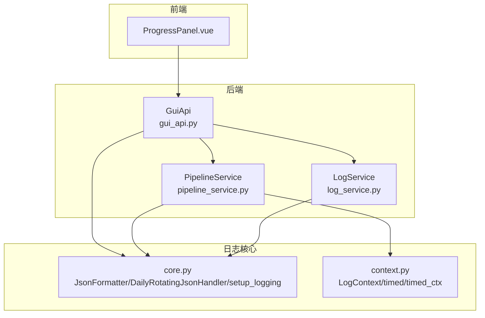
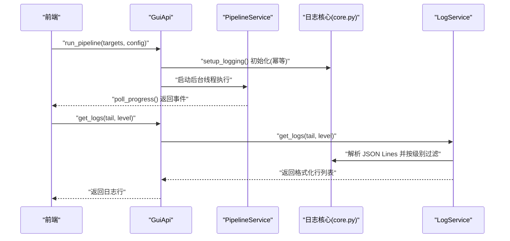
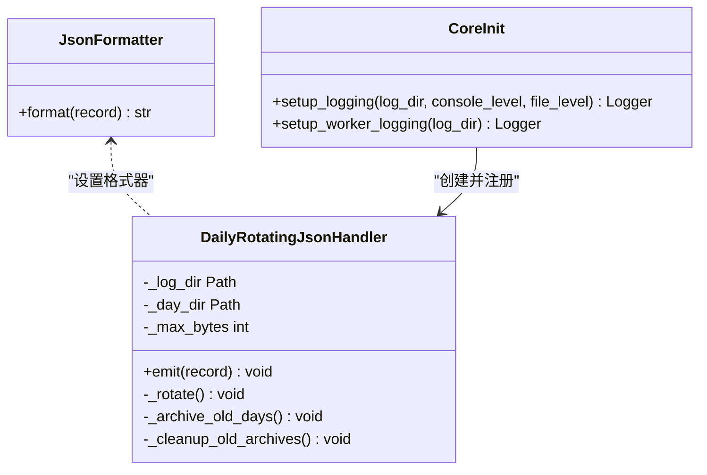
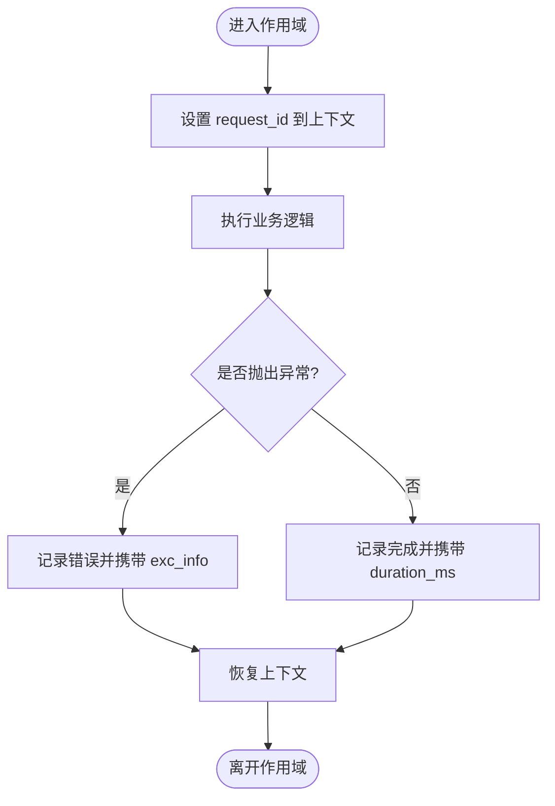
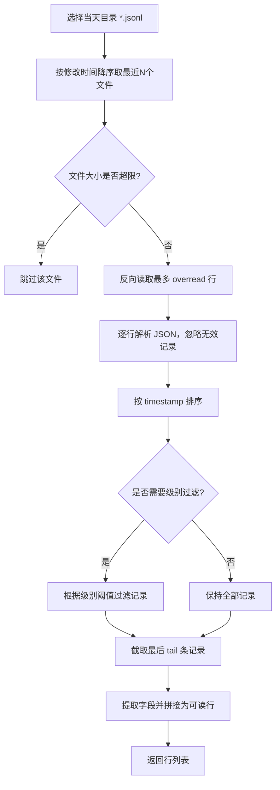
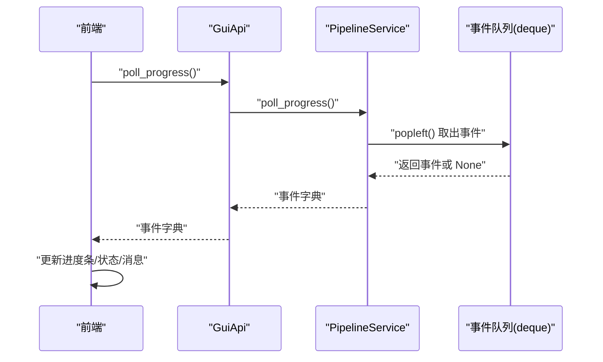
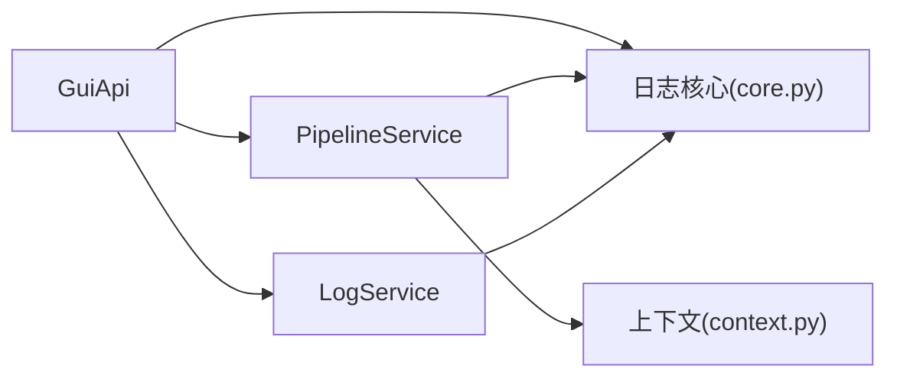

# 日志与监控

<cite>
**本文引用的文件**   
- [backend/services/log_service.py](file://backend/services/log_service.py)
- [trace_pipeline/logging/core.py](file://trace_pipeline/logging/core.py)
- [trace_pipeline/logging/context.py](file://trace_pipeline/logging/context.py)
- [backend/gui_api.py](file://backend/gui_api.py)
- [backend/services/pipeline_service.py](file://backend/services/pipeline_service.py)
- [frontend/src/components/ProgressPanel.vue](file://frontend/src/components/ProgressPanel.vue)
- [tests/test_logging.py](file://tests/test_logging.py)
</cite>

## 目录
1. [简介](#简介)
2. [项目结构](#项目结构)
3. [核心组件](#核心组件)
4. [架构总览](#架构总览)
5. [详细组件分析](#详细组件分析)
6. [依赖关系分析](#依赖关系分析)
7. [性能考量](#性能考量)
8. [故障排查指南](#故障排查指南)
9. [结论](#结论)
10. [附录](#附录)

## 简介
本技术文档聚焦于系统的日志记录与监控能力，覆盖以下关键主题：
- LogService 的多级日志读取机制（JSON Lines、级别过滤、性能指标）
- LogContext 的请求上下文追踪（request_id 生成、跨服务调用链追踪、异步任务关联）
- 进度监控系统设计（队列管理、前端轮询、实时状态更新）
- 异常处理与错误上报（堆栈跟踪、错误分类、用户友好提示）
- 日志分析工具与性能监控最佳实践

## 项目结构
与日志和监控相关的代码主要分布在后端服务、日志核心库、前端进度面板以及测试用例中。整体组织方式如下：
- 日志核心：trace_pipeline/logging 提供 JSON 格式化、按天归档、分片、上下文传播与计时工具
- 日志读取：backend/services/log_service.py 提供高效 tail 读取与级别过滤
- API 层：backend/gui_api.py 暴露 get_logs、poll_progress 等接口，并集成 LogContext
- 流水线执行：backend/services/pipeline_service.py 使用线程+进程池并发执行，推送进度事件
- 前端展示：frontend/src/components/ProgressPanel.vue 实现平滑进度动画与状态显示
- 测试：tests/test_logging.py 验证日志初始化幂等性与 JSON 序列化健壮性

图表来源
- [backend/gui_api.py](file://backend/gui_api.py)
- [backend/services/pipeline_service.py](file://backend/services/pipeline_service.py)
- [backend/services/log_service.py](file://backend/services/log_service.py)
- [trace_pipeline/logging/core.py](file://trace_pipeline/logging/core.py)
- [trace_pipeline/logging/context.py](file://trace_pipeline/logging/context.py)
- [frontend/src/components/ProgressPanel.vue](file://frontend/src/components/ProgressPanel.vue)

章节来源
- [backend/gui_api.py](file://backend/gui_api.py)
- [backend/services/pipeline_service.py](file://backend/services/pipeline_service.py)
- [backend/services/log_service.py](file://backend/services/log_service.py)
- [trace_pipeline/logging/core.py](file://trace_pipeline/logging/core.py)
- [trace_pipeline/logging/context.py](file://trace_pipeline/logging/context.py)
- [frontend/src/components/ProgressPanel.vue](file://frontend/src/components/ProgressPanel.vue)

## 核心组件
- JsonFormatter：将日志记录序列化为单行 JSON，自动注入 timestamp、level、logger、module、funcName、lineno、message、request_id、exc_info、extra 等字段，并对 NaN/Inf 进行安全清洗。
- DailyRotatingJsonHandler：按天目录存储 JSON Lines，支持按大小分片与旧日打包压缩，主进程负责归档与清理，子进程仅写入 worker_{pid}.jsonl。
- setup_logging / setup_worker_logging：统一初始化控制台与文件处理器，合并 backend 到 trace_pipeline 命名空间，确保同 run_*.jsonl 输出；为子进程提供独立 handler。
- LogContext：基于 contextvars 的 request_id 传播，支持装饰器与上下文管理器两种用法，自动在作用域内绑定/恢复请求标识。
- timed / timed_ctx：计时装饰器/上下文管理器，记录 duration_ms、error 等扩展信息，便于性能分析与问题定位。
- LogService：从 logs/ 当天目录反向读取最新 N 条 JSON Lines，支持级别过滤与结构化字段拼接，返回人类可读的行列表。
- PipelineService：后台线程 + 进程池并行执行流水线，通过线程安全队列推送进度事件，供前端轮询。
- ProgressPanel.vue：前端进度面板，实现平滑插值动画、运行态指示、当前文件与消息展示。

章节来源
- [trace_pipeline/logging/core.py](file://trace_pipeline/logging/core.py)
- [trace_pipeline/logging/context.py](file://trace_pipeline/logging/context.py)
- [backend/services/log_service.py](file://backend/services/log_service.py)
- [backend/services/pipeline_service.py](file://backend/services/pipeline_service.py)
- [frontend/src/components/ProgressPanel.vue](file://frontend/src/components/ProgressPanel.vue)

## 架构总览
系统采用“结构化日志 + 上下文追踪 + 轮询式进度”的组合方案：
- 所有业务模块通过标准 logging 接口输出，由 JsonFormatter 统一格式化为 JSON Lines
- 通过 LogContext 在请求/批次/任务范围内传播 request_id，形成可关联的调用链
- 前端通过 poll_progress 轮询获取进度事件，驱动 UI 实时更新
- 日志文件按天归档、按大小分片，并提供高效 tail 读取与级别过滤

图表来源
- [backend/gui_api.py](file://backend/gui_api.py)
- [backend/services/pipeline_service.py](file://backend/services/pipeline_service.py)
- [backend/services/log_service.py](file://backend/services/log_service.py)
- [trace_pipeline/logging/core.py](file://trace_pipeline/logging/core.py)

## 详细组件分析

### 日志核心（core.py）
- JsonFormatter
  - 输出字段包含时间戳、级别、模块、函数名、行号、消息、request_id、异常堆栈与 extra 扩展字段
  - 对浮点型进行有限性检查，避免 JSON 非法字符
  - 支持 numpy 等不可直接序列化的类型转换
- DailyRotatingJsonHandler
  - 按天目录存放日志，文件名形如 run_001.jsonl，worker 进程写入 worker_{pid}.jsonl
  - 超过阈值大小自动分片，旧日期目录打包 zip 并删除原目录
  - 仅主进程执行归档与清理，避免多进程竞态
- setup_logging / setup_worker_logging
  - 幂等初始化，复用已托管的 Handler，避免重复添加
  - 将 backend 命名空间的日志合并到同一输出，便于集中检索
  - 子进程移除继承的 StreamHandler，创建独立的 stderr 精简输出

图表来源
- [trace_pipeline/logging/core.py](file://trace_pipeline/logging/core.py)

章节来源
- [trace_pipeline/logging/core.py](file://trace_pipeline/logging/core.py)
- [tests/test_logging.py](file://tests/test_logging.py)

### 上下文与计时（context.py）
- LogContext
  - 基于 contextvars 的 request_id 传播，支持 with 语句或装饰器模式
  - 自动生成唯一 ID（时间戳+UUID短前缀），并在退出时恢复上下文
- timed / timed_ctx
  - 装饰器或上下文管理器形式，记录 duration_ms、error、func/module 等扩展信息
  - 异常路径记录 exc_info，便于堆栈回溯

图表来源
- [trace_pipeline/logging/context.py](file://trace_pipeline/logging/context.py)

章节来源
- [trace_pipeline/logging/context.py](file://trace_pipeline/logging/context.py)

### 日志读取服务（log_service.py）
- 高效 tail 读取
  - 从文件末尾反向读取，避免全量加载大文件
  - 限制最大缓冲区大小，防止内存占用过高
- 级别过滤
  - 支持 DEBUG/INFO/WARNING/WARN/ERROR/CRITICAL/ALL
  - 按内置等级映射过滤记录
- 结构化输出
  - 从 JSON 记录中提取 timestamp、level、logger、message、request_id、duration_ms 等字段
  - 拼接为人类可读的行字符串，便于前端展示

图表来源
- [backend/services/log_service.py](file://backend/services/log_service.py)

章节来源
- [backend/services/log_service.py](file://backend/services/log_service.py)

### 进度监控（pipeline_service.py + gui_api.py + ProgressPanel.vue）
- 队列管理
  - 使用线程安全的 deque 作为事件队列，支持 popleft 非阻塞读取
  - 后台线程在执行过程中持续推送 start/progress/file_complete/complete/error 事件
- 前端轮询
  - GuiApi.poll_progress 暴露给前端，周期性拉取事件
  - 前端根据事件类型更新进度条、当前文件与消息
- 实时状态更新
  - 前端使用 requestAnimationFrame 实现平滑插值动画，提升用户体验
  - 支持并行度配置与上限提示

图表来源
- [backend/services/pipeline_service.py](file://backend/services/pipeline_service.py)
- [backend/gui_api.py](file://backend/gui_api.py)
- [frontend/src/components/ProgressPanel.vue](file://frontend/src/components/ProgressPanel.vue)

章节来源
- [backend/services/pipeline_service.py](file://backend/services/pipeline_service.py)
- [backend/gui_api.py](file://backend/gui_api.py)
- [frontend/src/components/ProgressPanel.vue](file://frontend/src/components/ProgressPanel.vue)

### 异常处理与错误上报
- 堆栈跟踪
  - JsonFormatter 自动捕获 exc_info 并序列化到 JSON 记录
  - 计时装饰器在异常路径记录 error 与 exc_info
- 错误分类
  - 流水线针对常见错误类型（如 PermissionError、FileNotFoundError）附加用户友好提示
  - 后台线程捕获异常并推送 error 事件，前端据此展示失败原因
- 用户友好提示
  - 错误消息包含阶段、耗时、错误类型与简要说明，便于快速定位
  - GUI 层对越权路径、资源忙等情况给出明确反馈

章节来源
- [trace_pipeline/logging/core.py](file://trace_pipeline/logging/core.py)
- [trace_pipeline/logging/context.py](file://trace_pipeline/logging/context.py)
- [backend/services/pipeline_service.py](file://backend/services/pipeline_service.py)
- [backend/gui_api.py](file://backend/gui_api.py)

## 依赖关系分析
- 组件耦合
  - GuiApi 依赖 PipelineService 与 LogService，同时使用日志核心进行统一输出
  - PipelineService 依赖日志核心与上下文工具，用于记录与追踪
  - LogService 依赖日志核心输出的 JSON Lines 文件进行解析
- 外部依赖
  - 文件系统：日志归档、分片、zip 打包
  - 多线程/多进程：并发执行与事件队列
  - 前端框架：Element Plus 进度条与图标

图表来源
- [backend/gui_api.py](file://backend/gui_api.py)
- [backend/services/pipeline_service.py](file://backend/services/pipeline_service.py)
- [backend/services/log_service.py](file://backend/services/log_service.py)
- [trace_pipeline/logging/core.py](file://trace_pipeline/logging/core.py)
- [trace_pipeline/logging/context.py](file://trace_pipeline/logging/context.py)

章节来源
- [backend/gui_api.py](file://backend/gui_api.py)
- [backend/services/pipeline_service.py](file://backend/services/pipeline_service.py)
- [backend/services/log_service.py](file://backend/services/log_service.py)
- [trace_pipeline/logging/core.py](file://trace_pipeline/logging/core.py)
- [trace_pipeline/logging/context.py](file://trace_pipeline/logging/context.py)

## 性能考量
- 日志写入
  - 按大小分片避免单文件过大，降低 I/O 压力
  - 仅主进程执行归档与清理，减少多进程竞争
- 日志读取
  - 反向 tail 读取与缓冲截断，控制内存占用
  - 级别过滤减少不必要的数据传输与渲染
- 并发执行
  - 根据 CPU 核心数与配置动态调整工作进程数
  - 使用 as_completed 及时收集结果，避免长尾阻塞
- 前端体验
  - 平滑插值动画减少视觉抖动
  - 合理轮询频率平衡实时性与网络开销

[本节为通用指导，不直接分析具体文件]

## 故障排查指南
- 日志缺失或不完整
  - 检查 logs/ 当天目录是否存在，确认 DailyRotatingJsonHandler 是否成功创建
  - 查看是否因文件大小超限被跳过，或归档过程出现权限问题
- 级别过滤无结果
  - 确认请求中的 level 参数是否在支持集合内，且阈值映射正确
- 进度不更新
  - 检查 poll_progress 是否返回 None，确认后台线程是否仍在运行
  - 观察事件队列长度与前端轮询间隔
- 错误提示不明确
  - 查看 JSON 记录中的 error_type 与 message，结合 exc_info 定位根因
  - 关注 GUI 层的越权路径拒绝与资源忙提示

章节来源
- [trace_pipeline/logging/core.py](file://trace_pipeline/logging/core.py)
- [backend/services/log_service.py](file://backend/services/log_service.py)
- [backend/services/pipeline_service.py](file://backend/services/pipeline_service.py)
- [backend/gui_api.py](file://backend/gui_api.py)

## 结论
本系统通过结构化 JSON Lines 日志、上下文追踪与轮询式进度监控，构建了高可观测性的日志与监控体系。核心优势包括：
- 统一的日志格式与强大的序列化能力，便于集中采集与分析
- 基于 contextvars 的请求链路追踪，支持跨服务与异步任务的关联
- 高效的日志读取与级别过滤，兼顾性能与可用性
- 线程安全的事件队列与前端平滑动画，提供良好的交互体验
- 完善的异常处理与错误上报，帮助快速定位与修复问题

[本节为总结性内容，不直接分析具体文件]

## 附录
- 日志字段参考
  - timestamp：ISO 8601 带时区时间戳
  - level：日志级别名称
  - logger：logger 名称
  - module：模块名
  - funcName：函数名
  - lineno：行号
  - message：日志消息
  - request_id：请求标识（如有）
  - exc_info：异常堆栈（如有）
  - extra：扩展字段（含 duration_ms、error 等）
- 进度事件类型
  - start：批次开始
  - progress：处理进度
  - file_complete：单个文件处理完成
  - complete：批次完成
  - error：发生错误

章节来源
- [trace_pipeline/logging/core.py](file://trace_pipeline/logging/core.py)
- [backend/services/pipeline_service.py](file://backend/services/pipeline_service.py)