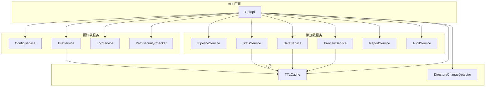
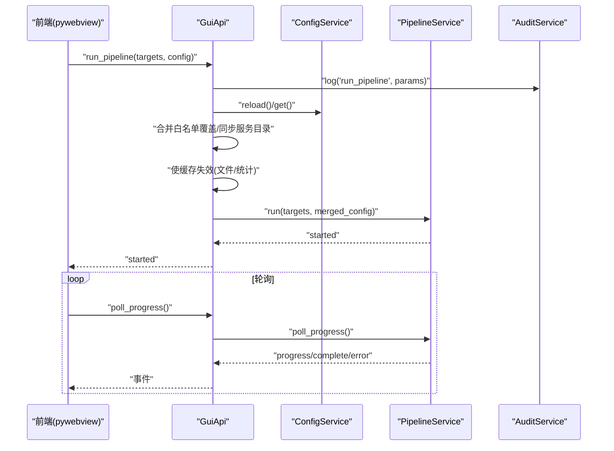
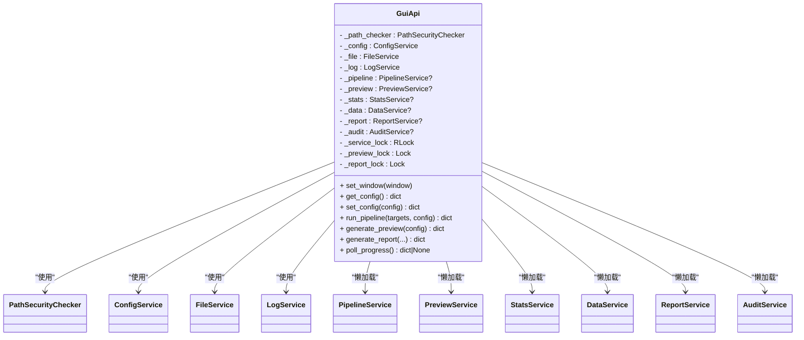
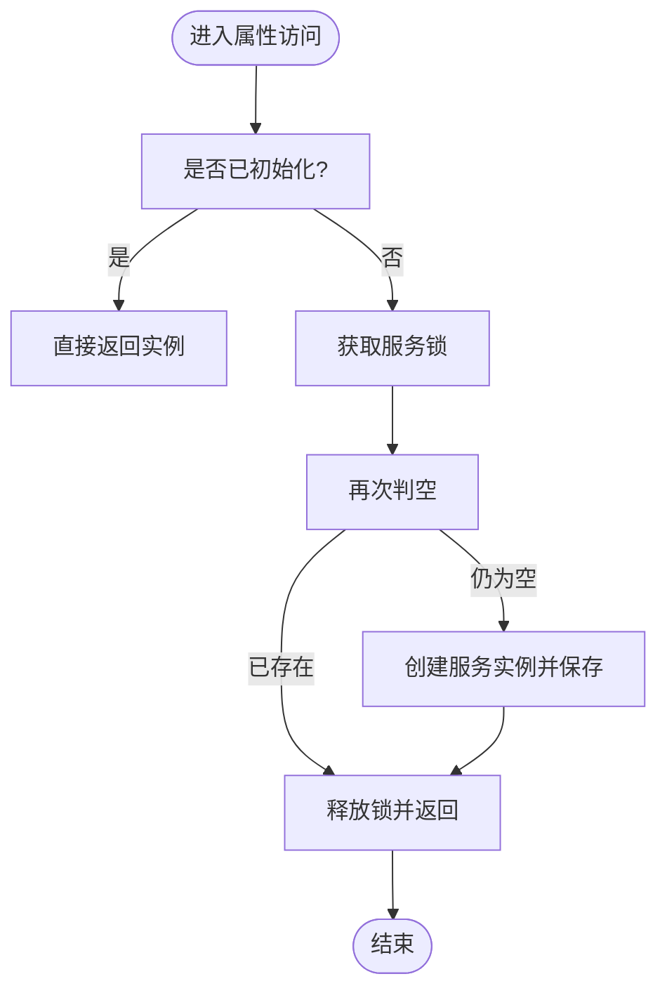
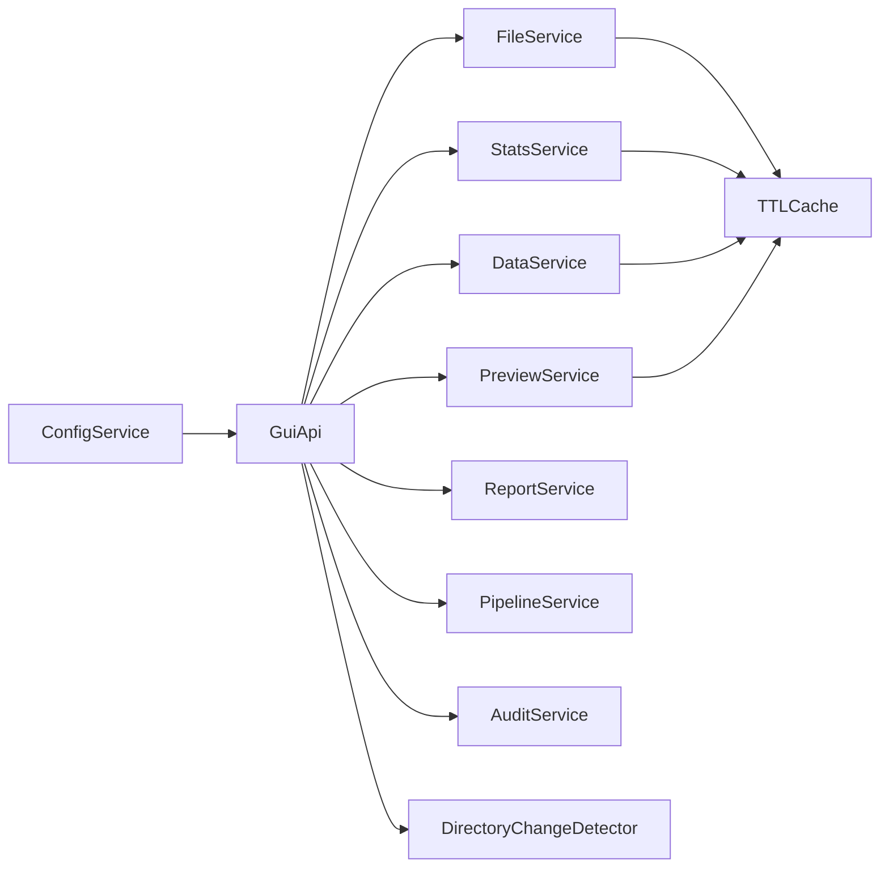
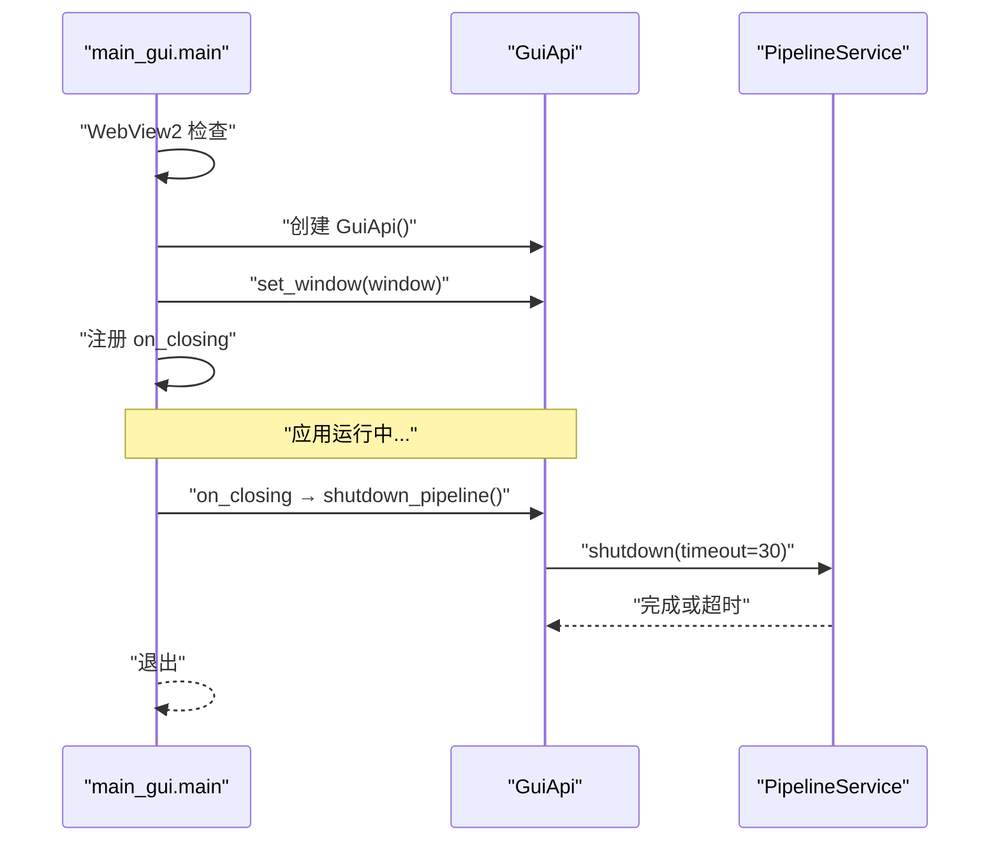
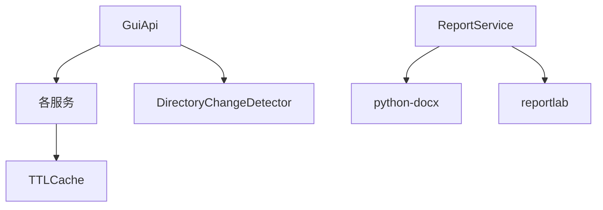

# 服务架构设计

<cite>
**本文引用的文件**   
- [gui_api.py](file://backend/gui_api.py)
- [main_gui.py](file://backend/main_gui.py)
- [security.py](file://backend/utils/security.py)
- [cache.py](file://backend/utils/cache.py)
- [config_service.py](file://backend/services/config_service.py)
- [file_service.py](file://backend/services/file_service.py)
- [log_service.py](file://backend/services/log_service.py)
- [pipeline_service.py](file://backend/services/pipeline_service.py)
- [preview_service.py](file://backend/services/preview_service.py)
- [stats_service.py](file://backend/services/stats_service.py)
- [data_service.py](file://backend/services/data_service.py)
- [report_service.py](file://backend/services/report_service.py)
- [audit_service.py](file://backend/services/audit_service.py)
</cite>

## 目录
1. [引言](#引言)
2. [项目结构](#项目结构)
3. [核心组件](#核心组件)
4. [架构总览](#架构总览)
5. [详细组件分析](#详细组件分析)
6. [依赖关系分析](#依赖关系分析)
7. [性能考量](#性能考量)
8. [故障排查指南](#故障排查指南)
9. [结论](#结论)

## 引言
本文件面向 TracePipeline 后端服务，聚焦 GuiApi 类的分层初始化策略与线程安全实现，系统性解析启动时预加载服务与按需懒加载服务的职责边界、依赖关系与数据流向。文档同时覆盖服务生命周期管理、资源清理机制与错误恢复策略，并提供架构图与交互时序图，帮助读者快速理解系统设计与最佳实践。

## 项目结构
后端采用“API 门面 + 领域服务”的分层组织方式：
- API 门面：GuiApi 暴露给前端（pywebview）的调用入口，负责鉴权、参数校验、并发控制、缓存失效与审计记录。
- 领域服务：按功能拆分为配置、文件扫描、日志、流水线、预览、统计、数据读取、报告生成、审计等独立服务。
- 工具库：路径安全校验、TTL/LRU 缓存、目录变更检测等通用能力。

图表来源
- [gui_api.py:52-158](file://backend/gui_api.py#L52-L158)
- [config_service.py:41-101](file://backend/services/config_service.py#L41-L101)
- [file_service.py:17-103](file://backend/services/file_service.py#L17-L103)
- [log_service.py:57-142](file://backend/services/log_service.py#L57-L142)
- [pipeline_service.py:32-100](file://backend/services/pipeline_service.py#L32-L100)
- [preview_service.py:37-90](file://backend/services/preview_service.py#L37-L90)
- [stats_service.py:35-100](file://backend/services/stats_service.py#L35-L100)
- [data_service.py:44-120](file://backend/services/data_service.py#L44-L120)
- [report_service.py:183-244](file://backend/services/report_service.py#L183-L244)
- [audit_service.py:22-48](file://backend/services/audit_service.py#L22-L48)
- [cache.py:18-90](file://backend/utils/cache.py#L18-L90)
- [cache.py:92-155](file://backend/utils/cache.py#L92-L155)

章节来源
- [gui_api.py:52-158](file://backend/gui_api.py#L52-L158)
- [main_gui.py:81-175](file://backend/main_gui.py#L81-L175)

## 核心组件
- GuiApi：统一对外接口，集中处理配置同步、缓存失效、并发锁、审计记录与进度推送。
- PathSecurityChecker：路径安全校验器，防止路径遍历与设备名攻击。
- ConfigService：配置文件的唯一写入入口，提供原子写回与部分重置能力。
- FileService：输入目录扫描与状态判定，带 TTL 缓存。
- LogService：结构化 JSON Lines 日志的高效 tail 读取与过滤。
- PipelineService：后台并行执行流水线，支持进程池、取消信号与轮询进度。
- PreviewService：样式预览图生成，基于固定演示数据，具备结果缓存。
- StatsService：统计数据计算与覆盖层几何构建，含输入指纹与稳定哈希键。
- DataService：Excel 多工作表数据分页读取，支持 input/output 双源。
- ReportService：DOCX/PDF 报告生成，跨平台字体探测与混合排版。
- AuditService：操作审计事件写入统一日志流，并维护内存缓冲。

章节来源
- [gui_api.py:52-158](file://backend/gui_api.py#L52-L158)
- [security.py:14-128](file://backend/utils/security.py#L14-L128)
- [config_service.py:41-144](file://backend/services/config_service.py#L41-L144)
- [file_service.py:17-103](file://backend/services/file_service.py#L17-L103)
- [log_service.py:57-142](file://backend/services/log_service.py#L57-L142)
- [pipeline_service.py:32-100](file://backend/services/pipeline_service.py#L32-L100)
- [preview_service.py:37-90](file://backend/services/preview_service.py#L37-L90)
- [stats_service.py:35-100](file://backend/services/stats_service.py#L35-L100)
- [data_service.py:44-120](file://backend/services/data_service.py#L44-L120)
- [report_service.py:183-244](file://backend/services/report_service.py#L183-L244)
- [audit_service.py:22-48](file://backend/services/audit_service.py#L22-L48)

## 架构总览
GuiApi 作为门面，将外部请求路由到具体服务；服务之间通过明确的输入输出契约协作，避免直接耦合。关键特性包括：
- 分层初始化：启动时创建基础服务，重资源服务按需懒加载。
- 双检锁：属性访问使用“先检查后加锁再检查”的模式保证线程安全。
- 并发控制：对预览与报告生成使用非阻塞锁拒绝重复任务。
- 缓存一致性：配置变更后触发多级缓存失效与目录变更检测。
- 审计与可观测性：所有关键操作均记录审计事件与结构化日志。

图表来源
- [gui_api.py:388-446](file://backend/gui_api.py#L388-L446)
- [pipeline_service.py:42-99](file://backend/services/pipeline_service.py#L42-L99)
- [audit_service.py:28-47](file://backend/services/audit_service.py#L28-L47)
- [config_service.py:68-101](file://backend/services/config_service.py#L68-L101)

## 详细组件分析

### GuiApi 类与分层初始化
- 启动时预加载：PathSecurityChecker、ConfigService、FileService、LogService。
- 按需懒加载：PipelineService、PreviewService、StatsService、DataService、ReportService、AuditService。
- 双检锁模式：每个懒加载属性在首次访问时加锁创建实例，后续访问直接返回，确保线程安全且无额外开销。
- 配置同步：_sync_services_from_config 将统一配置同步至 FileService/DataService 的路径设置。
- 缓存失效：_invalidate_data_caches 统一使文件扫描、统计、目录变更检测与图片缓存失效。
- 输出目录变更检测：_check_output_changed 利用 DirectoryChangeDetector 自动失效相关缓存。

图表来源
- [gui_api.py:52-158](file://backend/gui_api.py#L52-L158)

章节来源
- [gui_api.py:64-158](file://backend/gui_api.py#L64-L158)
- [gui_api.py:218-230](file://backend/gui_api.py#L218-L230)
- [gui_api.py:250-262](file://backend/gui_api.py#L250-L262)

### 双检锁模式的线程安全实现
- 每个懒加载属性遵循“先读空判断 -> 加锁 -> 再次判空 -> 构造实例”的流程。
- 使用 RLock 保护多个懒加载属性的并发创建，避免死锁。
- 该模式既保证了多线程环境下的单例语义，又避免了不必要的锁竞争。

图表来源
- [gui_api.py:112-158](file://backend/gui_api.py#L112-L158)

章节来源
- [gui_api.py:112-158](file://backend/gui_api.py#L112-L158)

### 服务间依赖关系与数据流向
- 配置驱动：ConfigService 为唯一写入入口，GuiApi 在配置变更后同步各服务路径并触发缓存失效。
- 文件扫描：FileService 扫描 input 目录，结合 output 目录产物判定 pending/completed 状态。
- 统计与数据：StatsService 与 DataService 分别负责统计指标与 Excel 数据分页读取，均使用 TTLCache 提升性能。
- 预览与报告：PreviewService 基于固定演示数据生成预览；ReportService 读取输出图片与统计信息生成 DOCX/PDF。
- 审计与日志：AuditService 记录用户操作；LogService 提供高效 tail 读取。

图表来源
- [config_service.py:41-101](file://backend/services/config_service.py#L41-L101)
- [file_service.py:17-103](file://backend/services/file_service.py#L17-L103)
- [stats_service.py:35-100](file://backend/services/stats_service.py#L35-L100)
- [data_service.py:44-120](file://backend/services/data_service.py#L44-L120)
- [preview_service.py:37-90](file://backend/services/preview_service.py#L37-L90)
- [report_service.py:183-244](file://backend/services/report_service.py#L183-L244)
- [cache.py:18-90](file://backend/utils/cache.py#L18-L90)
- [cache.py:92-155](file://backend/utils/cache.py#L92-L155)

章节来源
- [gui_api.py:218-230](file://backend/gui_api.py#L218-L230)
- [file_service.py:29-89](file://backend/services/file_service.py#L29-L89)
- [stats_service.py:101-142](file://backend/services/stats_service.py#L101-L142)
- [data_service.py:78-158](file://backend/services/data_service.py#L78-L158)
- [preview_service.py:45-90](file://backend/services/preview_service.py#L45-L90)
- [report_service.py:245-364](file://backend/services/report_service.py#L245-L364)

### 服务生命周期管理与资源清理
- 启动阶段：main_gui 创建 WebView2 检查器与 GuiApi，绑定窗口并注册关闭回调。
- 运行阶段：GuiApi 持有服务实例与锁对象，按需懒加载服务。
- 关闭阶段：窗口 closing 事件触发 shutdown_pipeline，等待后台流水线完成，避免文件损坏。
- 资源清理：PipelineService.shutdown 发送取消信号并 join 等待，超时则警告继续关闭流程。

图表来源
- [main_gui.py:186-190](file://backend/main_gui.py#L186-L190)
- [pipeline_service.py:74-95](file://backend/services/pipeline_service.py#L74-L95)

章节来源
- [main_gui.py:81-175](file://backend/main_gui.py#L81-L175)
- [main_gui.py:186-190](file://backend/main_gui.py#L186-L190)
- [pipeline_service.py:74-95](file://backend/services/pipeline_service.py#L74-L95)

### 错误恢复策略
- 配置写入：ConfigService 使用临时文件+replace 原子写回，异常时清理临时文件。
- 流水线异常：PipelineService 捕获非致命异常包装为失败结果，关键异常（MemoryError、SystemExit、KeyboardInterrupt）向上抛出。
- 报告生成：ReportService 在字体缺失、依赖未安装等场景下返回明确错误信息，并记录详细日志。
- 数据读取：DataService 对文件不存在、工作表缺失、内存不足等情况进行分级处理与提示。

章节来源
- [config_service.py:128-144](file://backend/services/config_service.py#L128-L144)
- [pipeline_service.py:222-242](file://backend/services/pipeline_service.py#L222-L242)
- [report_service.py:416-478](file://backend/services/report_service.py#L416-L478)
- [data_service.py:120-158](file://backend/services/data_service.py#L120-L158)

## 依赖关系分析
- 低耦合：服务之间通过 GuiApi 协调，不直接互相引用，降低循环依赖风险。
- 工具复用：TTLCache 与 DirectoryChangeDetector 被多个服务共享，提高一致性与可维护性。
- 外部依赖：报告生成依赖 python-docx 与 reportlab，缺失时优雅降级并返回错误。

图表来源
- [cache.py:18-90](file://backend/utils/cache.py#L18-L90)
- [cache.py:92-155](file://backend/utils/cache.py#L92-L155)
- [report_service.py:416-478](file://backend/services/report_service.py#L416-L478)

章节来源
- [cache.py:18-90](file://backend/utils/cache.py#L18-L90)
- [cache.py:92-155](file://backend/utils/cache.py#L92-L155)
- [report_service.py:416-478](file://backend/services/report_service.py#L416-L478)

## 性能考量
- 懒加载减少启动时间：仅在实际使用时才创建重资源服务。
- 并发控制避免资源争用：预览与报告生成使用非阻塞锁，拒绝重复任务。
- 缓存策略：TTLCache 提供 LRU 与过期淘汰，DirectoryChangeDetector 检测外部变更以精准失效。
- 并行执行：PipelineService 根据 CPU 核心数与配置动态调整工作进程数，提升吞吐。

[本节为通用指导，无需特定文件来源]

## 故障排查指南
- 配置问题：查看 set_config/reset_config 的审计与日志，确认字段合并与保存成功。
- 文件扫描异常：检查 input/output 目录权限与路径解析，关注 scan_files 的统计日志。
- 流水线失败：根据 poll_progress 的事件定位失败目标，常见错误包括文件占用与输入缺失。
- 报告生成失败：确认 python-docx/reportlab 已安装，检查字体可用性与输出图片是否存在。
- 日志查询：使用 get_logs 指定级别与行数，结合 request_id 追踪单次请求链路。

章节来源
- [gui_api.py:273-333](file://backend/gui_api.py#L273-L333)
- [gui_api.py:358-385](file://backend/gui_api.py#L358-L385)
- [gui_api.py:447-456](file://backend/gui_api.py#L447-L456)
- [gui_api.py:630-636](file://backend/gui_api.py#L630-L636)
- [report_service.py:416-478](file://backend/services/report_service.py#L416-L478)

## 结论
TracePipeline 后端通过 GuiApi 的门面化设计与分层初始化策略，实现了高内聚、低耦合的服务架构。双检锁与并发锁保障了线程安全与资源可控，TTL 缓存与目录变更检测提升了性能与一致性。完善的审计与日志体系为问题定位提供了有力支撑。整体设计兼顾了易用性、可扩展性与健壮性，适合持续演进与团队协作。