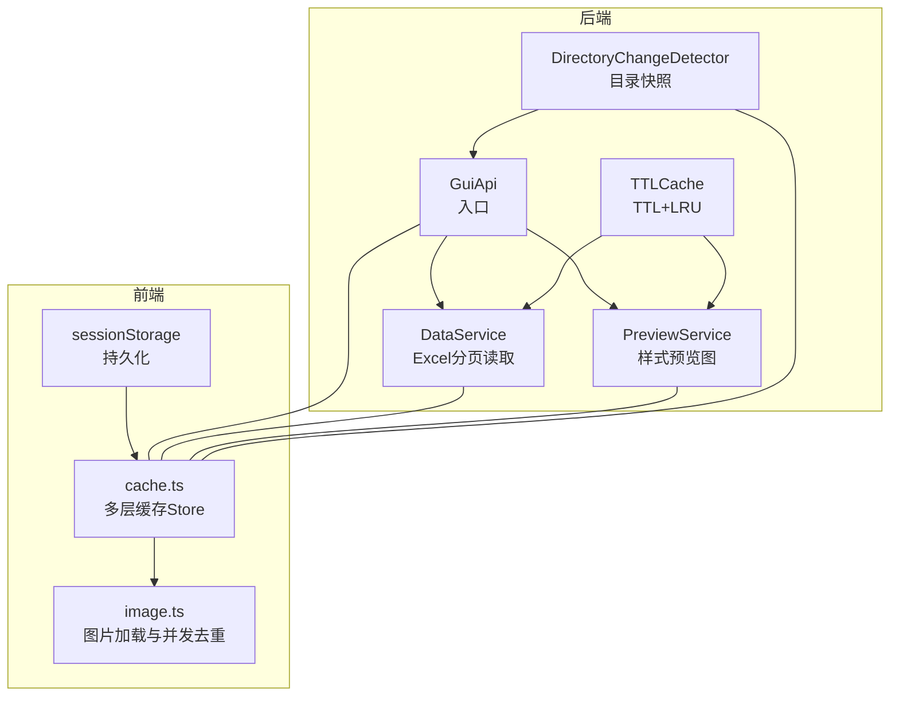
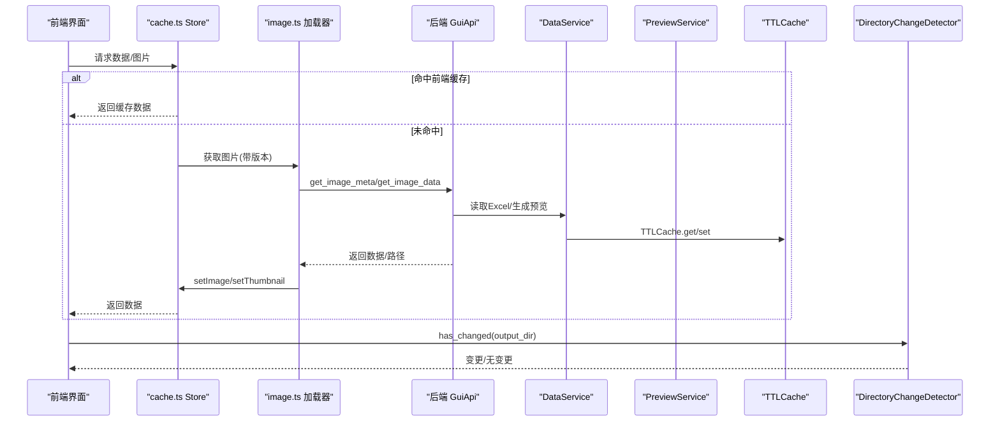
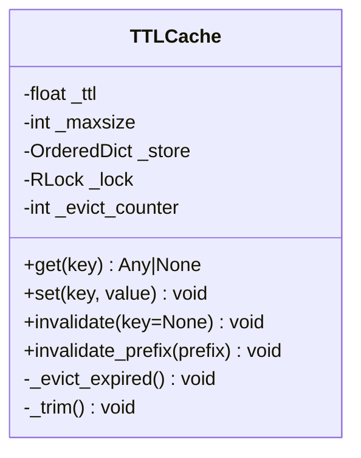
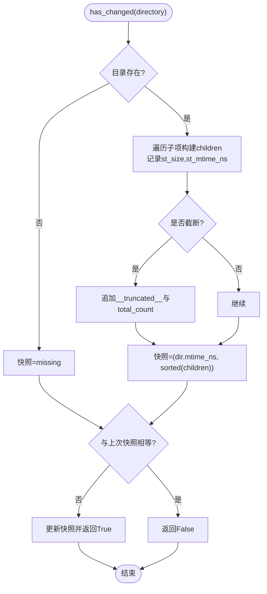
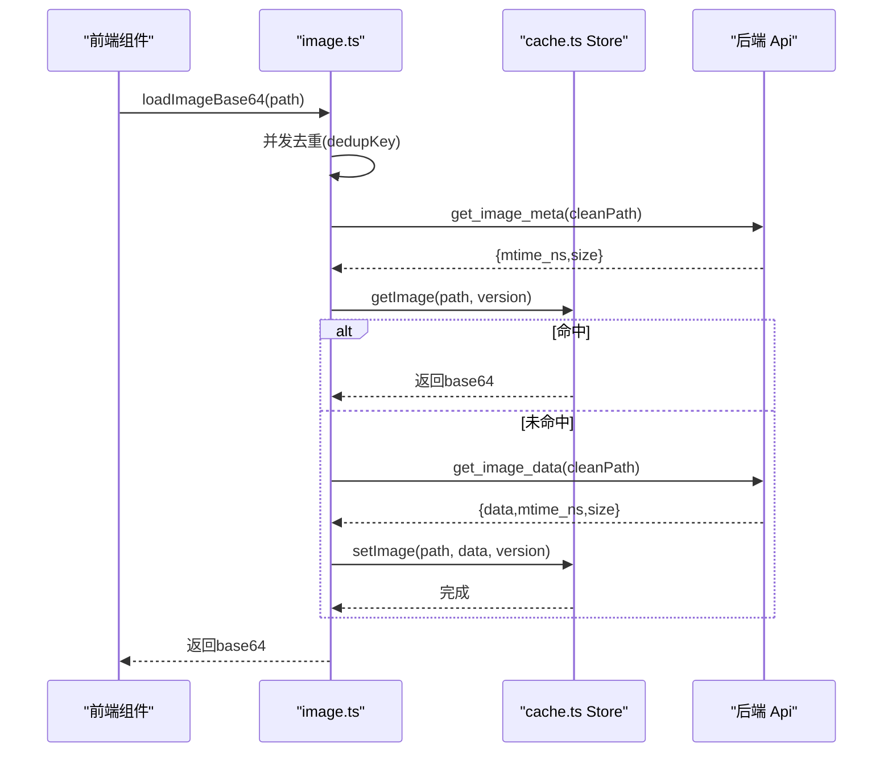
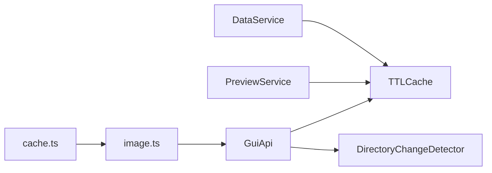

# 缓存系统

<cite>
**本文引用的文件**   
- [backend/utils/cache.py](file://backend/utils/cache.py)
- [backend/gui_api.py](file://backend/gui_api.py)
- [backend/services/data_service.py](file://backend/services/data_service.py)
- [backend/services/preview_service.py](file://backend/services/preview_service.py)
- [frontend/src/stores/cache.ts](file://frontend/src/stores/cache.ts)
- [frontend/src/utils/image.ts](file://frontend/src/utils/image.ts)
- [tests/test_cache.py](file://tests/test_cache.py)
</cite>

## 目录
1. [简介](#简介)
2. [项目结构](#项目结构)
3. [核心组件](#核心组件)
4. [架构总览](#架构总览)
5. [详细组件分析](#详细组件分析)
6. [依赖关系分析](#依赖关系分析)
7. [性能考虑](#性能考虑)
8. [故障排查指南](#故障排查指南)
9. [结论](#结论)
10. [附录](#附录)

## 简介
本技术文档围绕多级缓存系统展开，重点解析后端与前端协同的缓存策略与实现：
- 后端 DirectoryChangeDetector 的目录变更检测机制（浅层快照、增量更新、失效通知）
- TTLCache 的时间过期与容量限制（TTL + LRU、批量驱逐、内存管理）
- 图片缓存优化（缓存键生成、压缩存储、自动清理）
- 缓存一致性保证（写穿透、失效传播、并发控制）
- 缓存性能监控与调优建议

## 项目结构
本仓库采用前后端分离的多级缓存设计：
- 后端提供通用缓存工具类 TTLCache 与目录变更检测器 DirectoryChangeDetector，被多个服务复用
- 前端通过 Pinia Store 维护多层缓存（扫描、统计、对比、结果、图片、缩略图），并结合 sessionStorage 持久化
- 图片加载流程在前端进行并发去重与版本感知，结合后端元数据确保缓存键稳定

图表来源
- [backend/gui_api.py:91-94](file://backend/gui_api.py#L91-L94)
- [backend/services/data_service.py:47-51](file://backend/services/data_service.py#L47-L51)
- [backend/services/preview_service.py:40-43](file://backend/services/preview_service.py#L40-L43)
- [backend/utils/cache.py:18-90](file://backend/utils/cache.py#L18-L90)
- [backend/utils/cache.py:92-155](file://backend/utils/cache.py#L92-L155)
- [frontend/src/stores/cache.ts:111-129](file://frontend/src/stores/cache.ts#L111-L129)
- [frontend/src/utils/image.ts:21-37](file://frontend/src/utils/image.ts#L21-L37)

章节来源
- [backend/gui_api.py:91-94](file://backend/gui_api.py#L91-L94)
- [backend/services/data_service.py:47-51](file://backend/services/data_service.py#L47-L51)
- [backend/services/preview_service.py:40-43](file://backend/services/preview_service.py#L40-L43)
- [backend/utils/cache.py:18-90](file://backend/utils/cache.py#L18-L90)
- [backend/utils/cache.py:92-155](file://backend/utils/cache.py#L92-L155)
- [frontend/src/stores/cache.ts:111-129](file://frontend/src/stores/cache.ts#L111-L129)
- [frontend/src/utils/image.ts:21-37](file://frontend/src/utils/image.ts#L21-L37)

## 核心组件
- TTLCache：线程安全的 TTL + LRU 缓存，支持最大容量限制、批量过期驱逐、按前缀失效
- DirectoryChangeDetector：基于浅层快照的目录变更检测，支持截断场景下的新增/删除检测
- 前端多层缓存 Store：按业务域划分缓存层级，结合 TTL 与 LRU，部分使用 sessionStorage 持久化
- 图片加载与并发去重：基于 Promise 去重、版本感知（mtime_ns + size）、缩略图与全图双缓存

章节来源
- [backend/utils/cache.py:18-90](file://backend/utils/cache.py#L18-L90)
- [backend/utils/cache.py:92-155](file://backend/utils/cache.py#L92-L155)
- [frontend/src/stores/cache.ts:111-129](file://frontend/src/stores/cache.ts#L111-L129)
- [frontend/src/utils/image.ts:21-37](file://frontend/src/utils/image.ts#L21-L37)

## 架构总览
后端以 TTLCache 为核心，为数据读取与预览生成提供统一缓存能力；DirectoryChangeDetector 用于输出目录变更感知。前端通过 cache.ts 组织多层缓存，并在 image.ts 中实现图片加载的并发去重与版本感知。

图表来源
- [frontend/src/stores/cache.ts:111-129](file://frontend/src/stores/cache.ts#L111-L129)
- [frontend/src/utils/image.ts:21-37](file://frontend/src/utils/image.ts#L21-L37)
- [backend/gui_api.py:91-94](file://backend/gui_api.py#L91-L94)
- [backend/services/data_service.py:47-51](file://backend/services/data_service.py#L47-L51)
- [backend/services/preview_service.py:40-43](file://backend/services/preview_service.py#L40-L43)
- [backend/utils/cache.py:18-90](file://backend/utils/cache.py#L18-L90)
- [backend/utils/cache.py:92-155](file://backend/utils/cache.py#L92-L155)

## 详细组件分析

### TTLCache 时间过期缓存
- 数据结构：OrderedDict 存储 (timestamp, value)，配合 RLock 保证线程安全
- TTL 策略：get 时检查 monotonic 时间差，超过 TTL 则删除并返回空；set 后移动至末尾维持 LRU 顺序
- 容量限制：maxsize > 0 时，在 set 后执行 _trim，从最旧条目开始淘汰
- 批量驱逐：每 N 次 set 触发一次 _evict_expired，扫描并删除过期条目，降低频繁遍历开销
- 失效接口：invalidate(key)、invalidate_prefix(prefix) 支持单键或前缀批量失效

图表来源
- [backend/utils/cache.py:18-90](file://backend/utils/cache.py#L18-L90)

章节来源
- [backend/utils/cache.py:18-90](file://backend/utils/cache.py#L18-L90)

### DirectoryChangeDetector 目录变更检测
- 浅层快照：记录目录 mtime_ns 与子项列表（文件名、是否目录、大小、mtime_ns），首次调用建立快照
- 截断处理：当子项数量超过 max_files 时，追加“__truncated__”及总条目数作为信号，避免截断导致永远不变
- 并发安全：内部使用 Lock 保护 has_changed/invalidate，测试覆盖并发 invalidate 与 has_changed 无异常
- 失效通知：invalidate 清空快照，下次 has_changed 重建；上层可据此触发增量更新与缓存失效

图表来源
- [backend/utils/cache.py:92-155](file://backend/utils/cache.py#L92-L155)

章节来源
- [backend/utils/cache.py:92-155](file://backend/utils/cache.py#L92-L155)
- [tests/test_cache.py:14-46](file://tests/test_cache.py#L14-L46)
- [tests/test_cache.py:76-157](file://tests/test_cache.py#L76-L157)

### 图片缓存优化策略
- 缓存键生成：imageKey(path, version?, variant?, maxPx?) 将 path 与查询参数组合，区分 full/thumbnail 与尺寸
- 版本感知：基于 mtime_ns 与 size 计算 version，确保文件变更后键变化，避免脏读
- 压缩存储：前端以 base64 字符串形式缓存，缩略图减小体积；后端也可按需压缩（当前以路径/元数据为主）
- 自动清理：
  - 计数淘汰：超过 IMAGE_MAX_COUNT/THUMBNAIL_MAX_COUNT 时淘汰最久未访问条目（Map keys 顺序模拟 LRU）
  - 字符预算：超过 IMAGE_MAX_CHARS/THUMBNAIL_MAX_CHARS 时循环删除最旧条目直至满足上限
  - 同路径清理：写入新值前先清理同路径不同版本的旧条目，避免重复占用内存
- 并发去重：image.ts 使用 Map 保存正在进行的 Promise，相同 key 的请求复用同一 Promise，减少重复 IO

图表来源
- [frontend/src/utils/image.ts:21-37](file://frontend/src/utils/image.ts#L21-L37)
- [frontend/src/utils/image.ts:39-68](file://frontend/src/utils/image.ts#L39-L68)
- [frontend/src/stores/cache.ts:199-210](file://frontend/src/stores/cache.ts#L199-L210)
- [frontend/src/stores/cache.ts:277-308](file://frontend/src/stores/cache.ts#L277-L308)

章节来源
- [frontend/src/utils/image.ts:21-37](file://frontend/src/utils/image.ts#L21-L37)
- [frontend/src/utils/image.ts:39-68](file://frontend/src/utils/image.ts#L39-L68)
- [frontend/src/stores/cache.ts:199-210](file://frontend/src/stores/cache.ts#L199-L210)
- [frontend/src/stores/cache.ts:277-308](file://frontend/src/stores/cache.ts#L277-L308)

### 缓存一致性保证机制
- 写穿透：
  - 后端 DataService 在读取 Excel 后写入 TTLCache，后续请求直接命中缓存
  - 前端 image.ts 在获取到数据后调用 setImage/setThumbnail 写入缓存
- 失效传播：
  - DirectoryChangeDetector.has_changed 检测到 output 目录变更，上层可触发相关缓存失效（如 results、stats、images）
  - 前端提供 invalidateAll/invalidateImages 等接口，在 pipeline 完成后统一失效
- 并发控制：
  - TTLCache 使用 RLock 保护读写与驱逐
  - DirectoryChangeDetector 使用 Lock 保护快照读写
  - 前端 image.ts 使用 Map 保存进行中的 Promise，避免重复 IO

章节来源
- [backend/services/data_service.py:116-127](file://backend/services/data_service.py#L116-L127)
- [backend/gui_api.py:91-94](file://backend/gui_api.py#L91-L94)
- [frontend/src/stores/cache.ts:388-402](file://frontend/src/stores/cache.ts#L388-L402)
- [frontend/src/utils/image.ts:21-37](file://frontend/src/utils/image.ts#L21-L37)
- [backend/utils/cache.py:18-90](file://backend/utils/cache.py#L18-L90)
- [backend/utils/cache.py:92-155](file://backend/utils/cache.py#L92-L155)

## 依赖关系分析
- 后端服务对 TTLCache 的依赖：
  - DataService：按文件签名生成缓存键，TTL=300s，maxsize=64
  - PreviewService：按配置哈希生成缓存键，TTL=300s，maxsize=50
  - GuiApi：图片缓存 TTL=300s，maxsize=20；output 目录使用 DirectoryChangeDetector
- 前端对后端服务的依赖：
  - cache.ts 暴露多层缓存接口，供各视图与组件使用
  - image.ts 通过 api 调用后端获取图片元数据与数据，结合 store 进行缓存

图表来源
- [backend/services/data_service.py:47-51](file://backend/services/data_service.py#L47-L51)
- [backend/services/preview_service.py:40-43](file://backend/services/preview_service.py#L40-L43)
- [backend/gui_api.py:91-94](file://backend/gui_api.py#L91-L94)
- [frontend/src/stores/cache.ts:111-129](file://frontend/src/stores/cache.ts#L111-L129)
- [frontend/src/utils/image.ts:21-37](file://frontend/src/utils/image.ts#L21-L37)

章节来源
- [backend/services/data_service.py:47-51](file://backend/services/data_service.py#L47-L51)
- [backend/services/preview_service.py:40-43](file://backend/services/preview_service.py#L40-L43)
- [backend/gui_api.py:91-94](file://backend/gui_api.py#L91-L94)
- [frontend/src/stores/cache.ts:111-129](file://frontend/src/stores/cache.ts#L111-L129)
- [frontend/src/utils/image.ts:21-37](file://frontend/src/utils/image.ts#L21-L37)

## 性能考虑
- TTL 与 LRU 平衡：
  - 合理设置 TTL 与 maxsize，避免频繁重建与过度淘汰
  - 使用批量驱逐降低扫描开销（TTLCache._EVICT_BATCH_INTERVAL）
- 目录变更检测：
  - 调整 max_files 以平衡检测精度与性能；大目录启用截断信号避免误判
- 图片缓存：
  - 使用缩略图减少内存占用与渲染压力
  - 利用版本感知避免脏读，减少不必要的刷新
- 并发控制：
  - 后端锁粒度适中，避免热点竞争
  - 前端并发去重减少重复 IO 与网络开销

[本节为通用指导，不直接分析具体文件]

## 故障排查指南
- 目录变更检测异常：
  - 并发调用 invalidate 与 has_changed 不应抛异常（参考测试用例）
  - 大目录新增/删除应能被检测到（含截断场景）
- 缓存未命中或脏读：
  - 检查缓存键是否包含足够信息（文件签名、配置哈希、图片版本）
  - 确认失效时机是否正确（pipeline 完成、目录变更）
- 内存占用过高：
  - 调整图片缓存的最大条目与字符预算
  - 定期调用 invalidateImages/invalidateThumbnails 释放内存

章节来源
- [tests/test_cache.py:14-46](file://tests/test_cache.py#L14-L46)
- [tests/test_cache.py:76-157](file://tests/test_cache.py#L76-L157)
- [frontend/src/stores/cache.ts:337-350](file://frontend/src/stores/cache.ts#L337-L350)
- [frontend/src/stores/cache.ts:352-362](file://frontend/src/stores/cache.ts#L352-L362)

## 结论
该多级缓存系统在后端与前端分别实现了高效、可控的缓存策略：
- 后端以 TTLCache 为核心，结合 DirectoryChangeDetector 实现目录变更感知与增量更新
- 前端通过多层缓存与并发去重提升用户体验，同时保持与后端的一致性
- 通过合理的 TTL、容量限制与失效传播机制，系统在性能与一致性之间取得良好平衡

[本节为总结性内容，不直接分析具体文件]

## 附录
- 关键常量与默认值：
  - 前端 TTL：scan=30s、stats=5min、comparison=5min、results=5s、image/thumbnail=10min
  - 前端容量：stats max=100、image max=50/80MB、thumbnail max=120/30MB
  - 后端 TTL：DataService=300s、PreviewService=300s、GuiApi 图片=300s
- 失效接口：
  - 前端：invalidateScan/invalidateStats/invalidateComparison/invalidateResults/invalidateImages/invalidateThumbnails/invalidateAll/onPipelineComplete
  - 后端：TTLCache.invalidate/invalidate_prefix、DirectoryChangeDetector.invalidate

章节来源
- [frontend/src/stores/cache.ts:28-37](file://frontend/src/stores/cache.ts#L28-37)
- [frontend/src/stores/cache.ts:364-402](file://frontend/src/stores/cache.ts#L364-L402)
- [backend/services/data_service.py:47-51](file://backend/services/data_service.py#L47-L51)
- [backend/services/preview_service.py:40-43](file://backend/services/preview_service.py#L40-L43)
- [backend/gui_api.py:91-94](file://backend/gui_api.py#L91-L94)
- [backend/utils/cache.py:65-79](file://backend/utils/cache.py#L65-L79)
- [backend/utils/cache.py:151-155](file://backend/utils/cache.py#L151-L155)