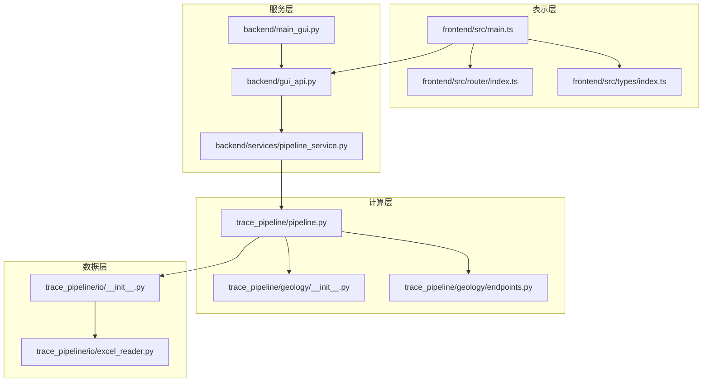
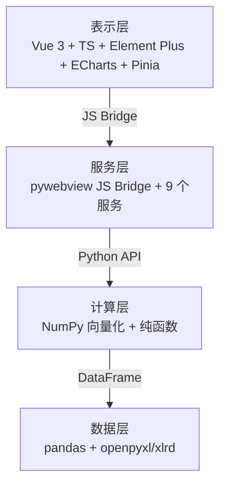
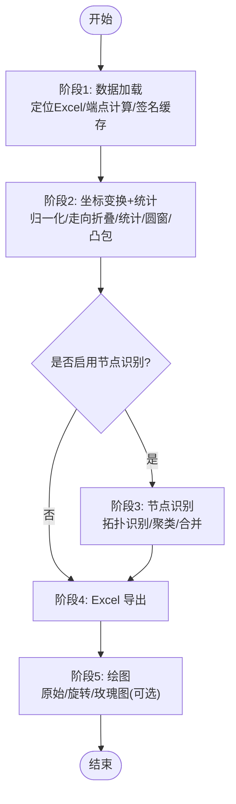
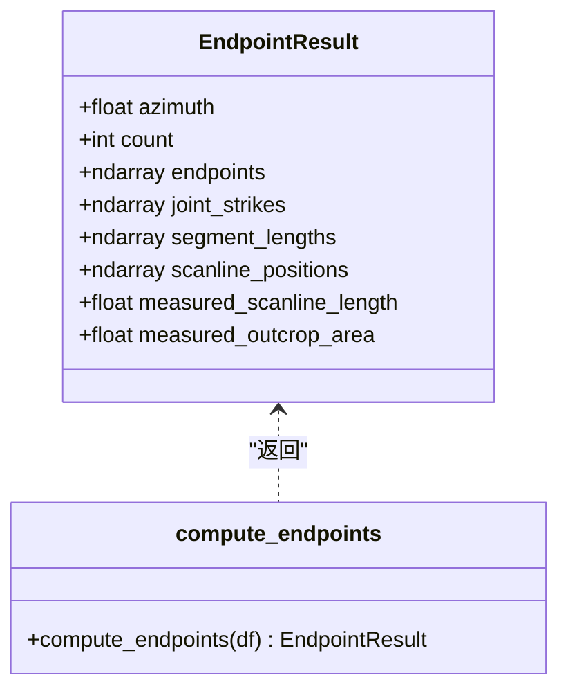
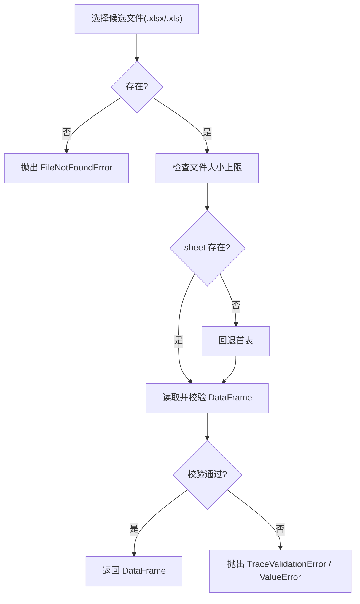
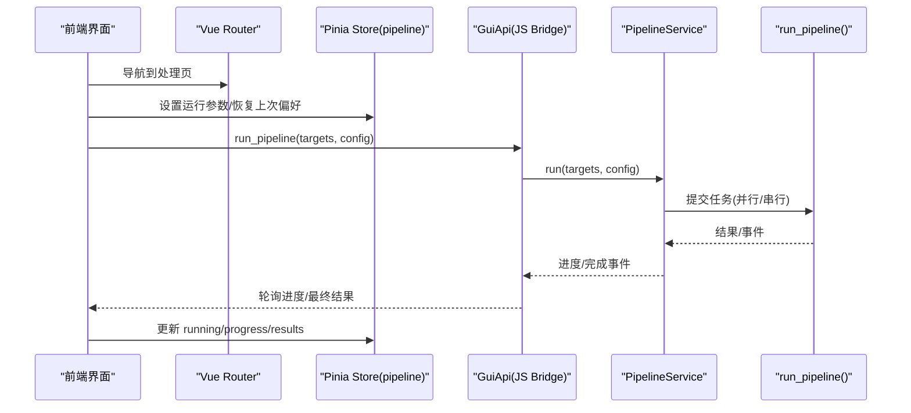
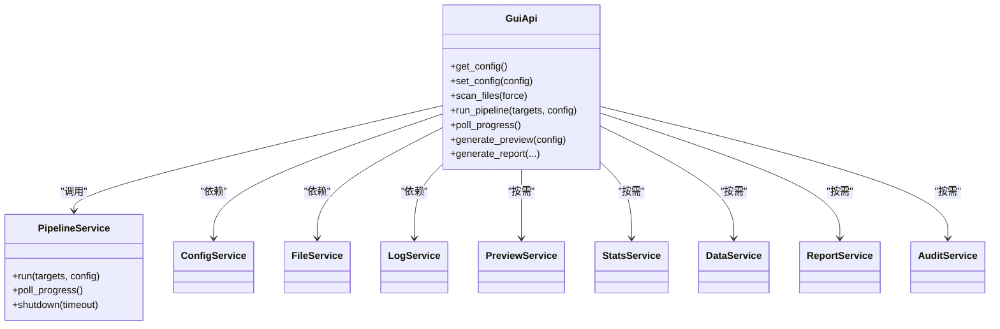
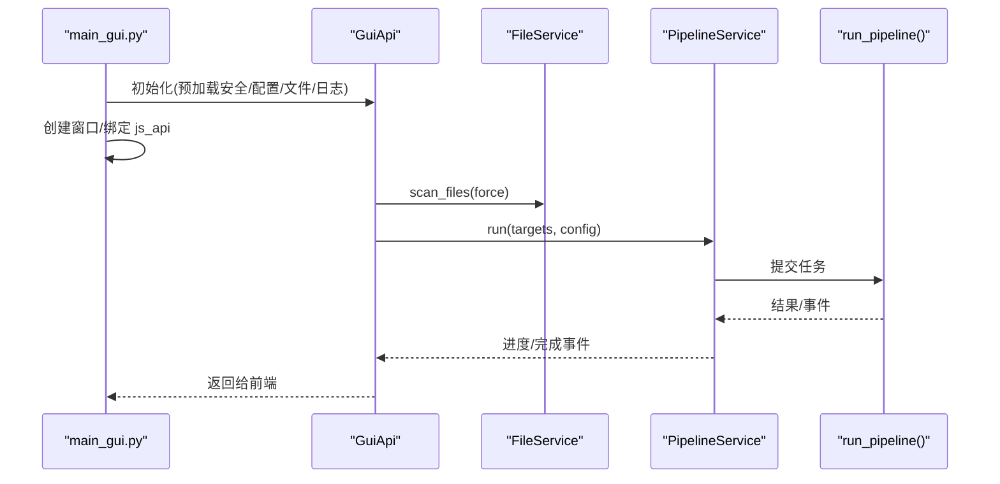
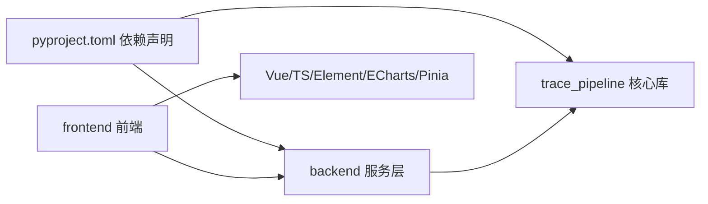

# 开发指南

<cite>
**本文引用的文件**   
- [README.md](file://README.md)
- [pyproject.toml](file://pyproject.toml)
- [trace_pipeline/pipeline.py](file://trace_pipeline/pipeline.py)
- [backend/main_gui.py](file://backend/main_gui.py)
- [backend/gui_api.py](file://backend/gui_api.py)
- [backend/services/pipeline_service.py](file://backend/services/pipeline_service.py)
- [trace_pipeline/geology/__init__.py](file://trace_pipeline/geology/__init__.py)
- [trace_pipeline/geology/endpoints.py](file://trace_pipeline/geology/endpoints.py)
- [trace_pipeline/io/__init__.py](file://trace_pipeline/io/__init__.py)
- [trace_pipeline/io/excel_reader.py](file://trace_pipeline/io/excel_reader.py)
- [frontend/src/main.ts](file://frontend/src/main.ts)
- [frontend/src/router/index.ts](file://frontend/src/router/index.ts)
- [frontend/src/stores/pipeline.ts](file://frontend/src/stores/pipeline.ts)
- [frontend/src/types/index.ts](file://frontend/src/types/index.ts)
- [tests/test_pipeline.py](file://tests/test_pipeline.py)
</cite>

## 目录
1. [简介](#简介)
2. [项目结构](#项目结构)
3. [核心组件](#核心组件)
4. [架构总览](#架构总览)
5. [详细组件分析](#详细组件分析)
6. [依赖关系分析](#依赖关系分析)
7. [性能考量](#性能考量)
8. [故障排查指南](#故障排查指南)
9. [结论](#结论)
10. [附录](#附录)

## 简介
TracePipeline 是一套面向岩体节理几何特征分析的专业工具，提供从原始测线记录到统计指标、可视化图表的全流程自动化处理。系统采用四层架构（表示层/服务层/计算层/数据层），前后端通过 pywebview JS Bridge 通信，后端以 9 个 Python 服务模块组织职责，前端基于 Vue 3 + Element Plus + ECharts + Pinia 构建桌面 GUI。

本指南面向开发者，覆盖：
- 四层架构与依赖关系
- 五阶段处理流水线与纯函数设计
- 前后端通信协议与缓存体系
- 测试策略与用例编写
- 代码质量工具链配置与使用
- 打包分发与自定义扩展开发

## 项目结构
仓库采用“功能域 + 分层”的组织方式：
- trace_pipeline：核心库（管线编排、地质算法、绘图、IO、模型等）
- backend：GUI 后端服务（pywebview API、9 个服务模块、安全与缓存）
- frontend：Vue 3 前端（组件、路由、状态管理、类型定义、测试）
- tests：pytest 集成与单元测试
- scripts：打包脚本

图示来源
- [backend/main_gui.py:1-211](file://backend/main_gui.py#L1-L211)
- [backend/gui_api.py:1-800](file://backend/gui_api.py#L1-L800)
- [backend/services/pipeline_service.py:1-346](file://backend/services/pipeline_service.py#L1-L346)
- [trace_pipeline/pipeline.py:1-474](file://trace_pipeline/pipeline.py#L1-L474)
- [trace_pipeline/geology/__init__.py:1-36](file://trace_pipeline/geology/__init__.py#L1-L36)
- [trace_pipeline/geology/endpoints.py:1-418](file://trace_pipeline/geology/endpoints.py#L1-L418)
- [trace_pipeline/io/__init__.py:1-22](file://trace_pipeline/io/__init__.py#L1-L22)
- [trace_pipeline/io/excel_reader.py:1-169](file://trace_pipeline/io/excel_reader.py#L1-L169)
- [frontend/src/main.ts:1-88](file://frontend/src/main.ts#L1-L88)
- [frontend/src/router/index.ts:1-26](file://frontend/src/router/index.ts#L1-L26)
- [frontend/src/types/index.ts:1-167](file://frontend/src/types/index.ts#L1-L167)

章节来源
- [README.md:170-282](file://README.md#L170-L282)
- [pyproject.toml:1-83](file://pyproject.toml#L1-L83)

## 核心组件
- 五阶段流水线：加载 → 坐标变换+统计 → 节点识别 → Excel 导出 → 绘图
- 纯函数地质算法：角度转换、端点计算、坐标变换、统计指标
- IO 子系统：Excel 读取/写入、文件发现、多工作表导出
- GUI 服务层：9 个服务模块（配置、文件、日志、流水线、预览、统计、数据、报告、审计）
- 前端：Vue 3 组件、Pinia Store、路由、类型定义

章节来源
- [trace_pipeline/pipeline.py:1-474](file://trace_pipeline/pipeline.py#L1-L474)
- [trace_pipeline/geology/__init__.py:1-36](file://trace_pipeline/geology/__init__.py#L1-L36)
- [trace_pipeline/io/__init__.py:1-22](file://trace_pipeline/io/__init__.py#L1-L22)
- [backend/gui_api.py:1-800](file://backend/gui_api.py#L1-L800)
- [frontend/src/main.ts:1-88](file://frontend/src/main.ts#L1-L88)

## 架构总览
系统严格分层，单向依赖：
- 表示层：Vue 3 + TypeScript + Element Plus + ECharts + Pinia
- 服务层：pywebview JS Bridge + 9 个 Python 服务模块
- 计算层：NumPy 向量化 + 纯函数模块
- 数据层：pandas + openpyxl/xlrd

图示来源
- [README.md:198-220](file://README.md#L198-L220)

## 详细组件分析

### 五阶段处理流水线（pipeline.py）
- 阶段 1 数据加载：定位输入 Excel，按文件签名缓存 TraceData，解析端点
- 阶段 2 坐标变换+统计：归一化坐标、走向角折叠、统计 P₁₀/P₂₀/P₂₁、圆窗策略、凸包构建
- 阶段 3 节点识别：I/Y/X 拓扑识别、网格聚类 + 并查集、自适应合并容差
- 阶段 4 Excel 导出：多工作表结果写入
- 阶段 5 绘图：原始迹线图、旋转迹线图、玫瑰图（可选）

图示来源
- [trace_pipeline/pipeline.py:230-474](file://trace_pipeline/pipeline.py#L230-L474)

章节来源
- [trace_pipeline/pipeline.py:1-474](file://trace_pipeline/pipeline.py#L1-L474)

### 地质子包（geology）纯函数设计
- 角度转换：方位角→笛卡尔、倾向→走向、半平面折叠
- 端点计算：复数向量法，分左/右/双侧三种情形向量化计算
- 坐标变换：平移正象限、走向角旋转、再平移
- 统计指标：P₁₀/P₂₀/P₂₁、平均迹长、面积四级回退、圆窗四策略评分

图示来源
- [trace_pipeline/geology/endpoints.py:70-82](file://trace_pipeline/geology/endpoints.py#L70-L82)
- [trace_pipeline/geology/endpoints.py:295-418](file://trace_pipeline/geology/endpoints.py#L295-L418)

章节来源
- [trace_pipeline/geology/__init__.py:1-36](file://trace_pipeline/geology/__init__.py#L1-L36)
- [trace_pipeline/geology/endpoints.py:1-418](file://trace_pipeline/geology/endpoints.py#L1-L418)

### IO 模块（excel_reader.py）
- 候选扩展名回退：优先 .xlsx，缺失则回退 .xls
- 工作表回退：目标 sheet 不存在时自动回退首表
- 格式校验：最小列数、数值有效性、文件大小上限保护
- 错误分类：TraceValidationError 用于区分“数据格式错误”与“工作表不存在”

图示来源
- [trace_pipeline/io/excel_reader.py:36-106](file://trace_pipeline/io/excel_reader.py#L36-L106)
- [trace_pipeline/io/excel_reader.py:128-169](file://trace_pipeline/io/excel_reader.py#L128-L169)

章节来源
- [trace_pipeline/io/__init__.py:1-22](file://trace_pipeline/io/__init__.py#L1-L22)
- [trace_pipeline/io/excel_reader.py:1-169](file://trace_pipeline/io/excel_reader.py#L1-L169)

### 前端组件架构（Vue 3 + Pinia + Router）
- 入口初始化：创建应用、注册 Element Plus 组件、Pinia、Router
- 路由：Hash 模式，懒加载页面视图，统一重定向
- 类型定义：前后端一致的类型契约（PipelineResult、StatsData、ConfigData 等）
- 状态管理：pipeline Store 管理运行状态、进度、结果列表，持久化用户偏好

图示来源
- [frontend/src/main.ts:1-88](file://frontend/src/main.ts#L1-L88)
- [frontend/src/router/index.ts:1-26](file://frontend/src/router/index.ts#L1-L26)
- [frontend/src/stores/pipeline.ts:1-56](file://frontend/src/stores/pipeline.ts#L1-L56)
- [backend/gui_api.py:388-446](file://backend/gui_api.py#L388-L446)
- [backend/services/pipeline_service.py:42-64](file://backend/services/pipeline_service.py#L42-L64)
- [trace_pipeline/pipeline.py:230-474](file://trace_pipeline/pipeline.py#L230-L474)

章节来源
- [frontend/src/main.ts:1-88](file://frontend/src/main.ts#L1-L88)
- [frontend/src/router/index.ts:1-26](file://frontend/src/router/index.ts#L1-L26)
- [frontend/src/stores/pipeline.ts:1-56](file://frontend/src/stores/pipeline.ts#L1-L56)
- [frontend/src/types/index.ts:1-167](file://frontend/src/types/index.ts#L1-L167)

### 后端服务设计（9 个服务模块）
- 配置服务：全局配置读写、重置、样式/处理配置分离
- 文件服务：扫描 input/output 目录、缓存失效、输出变更检测
- 日志服务：结构化日志读取、级别过滤
- 流水线服务：后台线程 + 进程池执行，事件队列 + 轮询
- 预览服务：生成预览图（受运行锁保护）
- 统计服务：单露头/对比统计，LRU/TTL 缓存
- 数据服务：Excel 分页读取（输入/输出切换）
- 报告服务：Word/PDF 生成、批量 ZIP 打包、进度推送
- 审计服务：操作审计日志

图示来源
- [backend/gui_api.py:52-158](file://backend/gui_api.py#L52-L158)
- [backend/services/pipeline_service.py:32-95](file://backend/services/pipeline_service.py#L32-L95)

章节来源
- [backend/gui_api.py:1-800](file://backend/gui_api.py#L1-L800)
- [backend/services/pipeline_service.py:1-346](file://backend/services/pipeline_service.py#L1-L346)

### 前后端通信协议
- 启动：main_gui.py 初始化 WebView2 检查、窗口居中、绑定 GuiApi
- 请求：前端通过 JS Bridge 调用 GuiApi 方法
- 响应：JSON 对象，包含 status/message/data 字段
- 进度：事件队列（start/progress/file_complete/complete/error）
- 安全：路径白名单、外部域名白名单、图片格式/大小校验

图示来源
- [backend/main_gui.py:81-206](file://backend/main_gui.py#L81-L206)
- [backend/gui_api.py:358-446](file://backend/gui_api.py#L358-L446)
- [backend/services/pipeline_service.py:100-346](file://backend/services/pipeline_service.py#L100-L346)
- [trace_pipeline/pipeline.py:230-474](file://trace_pipeline/pipeline.py#L230-L474)

章节来源
- [backend/main_gui.py:1-211](file://backend/main_gui.py#L1-L211)
- [backend/gui_api.py:1-800](file://backend/gui_api.py#L1-L800)

### 缓存体系实现
- 文件扫描：TTLCache + 目录变更检测
- 统计数据：LRU（SHA-256 配置指纹）
- 图片/缩略图：LRU（容量/内存上限）
- Excel 数据：TTLCache
- 样式预览：文件系统缓存（配置 MD5）
- 结果列表：前端 sessionStorage
- 对比数据：前端 sessionStorage

章节来源
- [backend/gui_api.py:225-262](file://backend/gui_api.py#L225-L262)
- [README.md:636-648](file://README.md#L636-L648)

## 依赖关系分析
- 后端依赖：numpy、pandas、matplotlib、openpyxl、xlrd、scipy、shapely、pywebview、python-docx、reportlab、tqdm
- 前端依赖：Vue 3、Element Plus、ECharts、Pinia、TypeScript
- 构建与打包：pyproject 元数据、scripts/package.py

图示来源
- [pyproject.toml:35-48](file://pyproject.toml#L35-L48)
- [pyproject.toml:50-60](file://pyproject.toml#L50-L60)

章节来源
- [pyproject.toml:1-83](file://pyproject.toml#L1-L83)

## 性能考量
- 向量化优先：NumPy 广播 + 复数运算替代 for 循环；布尔 mask 分支
- 惰性导入：避免 import 副作用，首次绘图才初始化 matplotlib
- 并行执行：ProcessPoolExecutor 控制 workers，支持 0=自动、1=串行、>1=指定
- 缓存命中：文件签名缓存、LRU/TTL 降低重复计算与 IO
- 资源限制：图片缓存上限、报告/预览并发锁

[本节为通用指导，不直接分析具体文件]

## 故障排查指南
- 常见异常：PermissionError（文件占用）、FileNotFoundError（输入缺失）、ValueError/KeyError/TypeError/IndexError/OSError
- 友好提示：统一错误处理路径，附加上下文信息（request_id、stage、duration_ms）
- 调试建议：查看结构化日志 JSON Lines，关注 stage 与 duration_ms 字段

章节来源
- [trace_pipeline/pipeline.py:98-130](file://trace_pipeline/pipeline.py#L98-L130)
- [trace_pipeline/pipeline.py:450-474](file://trace_pipeline/pipeline.py#L450-L474)

## 结论
TracePipeline 以清晰的分层与纯函数设计实现了高内聚低耦合的地质数据处理流水线。前后端通过类型安全的 JS Bridge 通信，结合完善的缓存与并发机制，提供了稳定高效的桌面体验。建议在扩展新功能时遵循现有规范：纯函数计算、向量化优先、惰性导入、结构化日志与完善测试。

[本节为总结性内容，不直接分析具体文件]

## 附录

### 测试策略与用例编写指南
- 后端 pytest：覆盖端到端流水线、服务接口、IO 与算法模块
- 前端 Vitest：组件与 Store 测试（示例见 tests/stores）
- 推荐实践：构造最小可复现输入、断言关键结果字段、模拟异常路径

章节来源
- [tests/test_pipeline.py:1-125](file://tests/test_pipeline.py#L1-L125)

### 代码质量工具链（ruff、mypy）
- ruff：规则集 E/F/I/N/UP/B/SIM，行宽 100，目标版本 py310
- mypy：Python 3.10，warn_return_any=true
- coverage：source 包含 trace_pipeline 与 backend，排除 tests

章节来源
- [pyproject.toml:62-73](file://pyproject.toml#L62-L73)

### 打包分发流程
- 一键打包：scripts/package.py（安装版 + 便携版）
- 工具链：PyInstaller、Inno Setup 6、7-Zip SFX
- 前置条件：确保前端已构建（backend/static/index.html 存在）

章节来源
- [README.md:749-778](file://README.md#L749-L778)

### 自定义扩展开发指南
- 新增计算步骤：在 geology 或 analysis 下添加纯函数，保持无状态与向量化
- 新增 IO 能力：在 io 子包中扩展 reader/writer/discovery，遵循错误分类与校验约定
- 新增服务：在 backend/services 下新建服务类，通过 GuiApi 暴露方法，注意线程安全与缓存一致性
- 新增前端页面：在 views 下新增组件，注册路由，定义类型并在 stores 中管理状态

[本节为概念性指导，不直接分析具体文件]